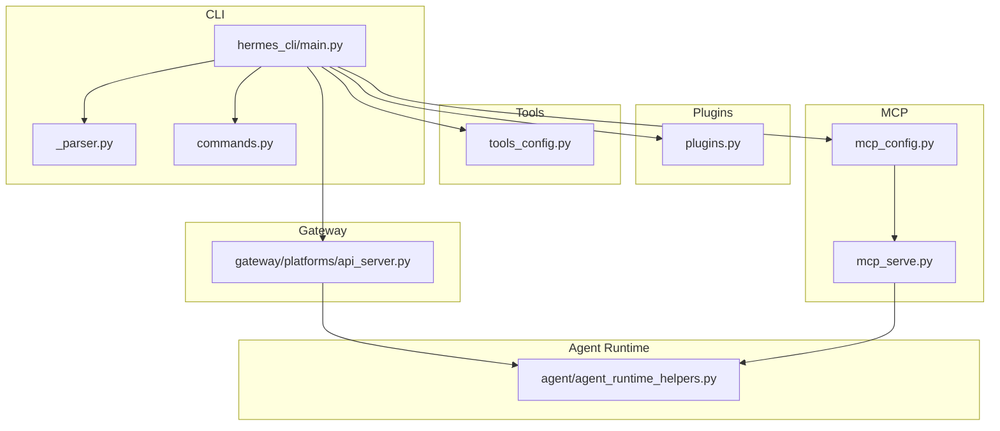
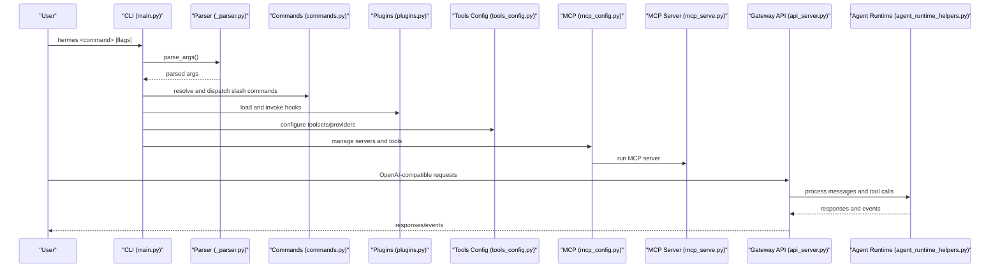
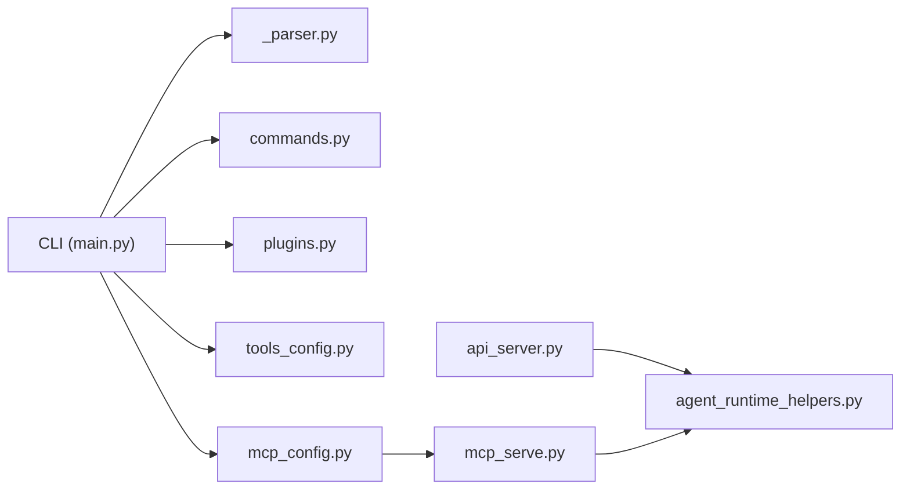

# API Reference

<cite>
**Referenced Files in This Document**
- [hermes_cli/main.py](file://hermes_cli/main.py)
- [hermes_cli/_parser.py](file://hermes_cli/_parser.py)
- [hermes_cli/commands.py](file://hermes_cli/commands.py)
- [hermes_cli/plugins.py](file://hermes_cli/plugins.py)
- [hermes_cli/tools_config.py](file://hermes_cli/tools_config.py)
- [hermes_cli/mcp_config.py](file://hermes_cli/mcp_config.py)
- [mcp_serve.py](file://mcp_serve.py)
- [gateway/platforms/api_server.py](file://gateway/platforms/api_server.py)
- [agent/agent_runtime_helpers.py](file://agent/agent_runtime_helpers.py)
</cite>

## Table of Contents
1. [Introduction](#introduction)
2. [Project Structure](#project-structure)
3. [Core Components](#core-components)
4. [Architecture Overview](#architecture-overview)
5. [Detailed Component Analysis](#detailed-component-analysis)
6. [Dependency Analysis](#dependency-analysis)
7. [Performance Considerations](#performance-considerations)
8. [Troubleshooting Guide](#troubleshooting-guide)
9. [Conclusion](#conclusion)
10. [Appendices](#appendices)

## Introduction
This document provides a comprehensive API reference for Hermes Agent’s public interfaces and integration points. It covers:
- CLI command API with commands, flags, and configuration options
- Plugin development API (manifest schemas, lifecycle hooks, integration interfaces)
- Tool development API (tool schema definitions, execution interfaces, safety requirements)
- Agent runtime API for programmatic integration (conversation management, memory access, tool execution)
- Gateway API for platform integration, webhook endpoints, and delivery mechanisms
- Protocol specifications for MCP integration, WebSocket APIs for real-time communication, and REST API endpoints for administrative functions
- Authentication methods, rate limiting, error handling, and versioning considerations
- Practical examples, client implementation guidelines, and integration patterns

## Project Structure
Hermes Agent exposes multiple integration surfaces:
- CLI entrypoint and command parsing
- Plugin system with lifecycle hooks and tool registration
- Tool configuration and provider-aware setup
- MCP server for editor and client integrations
- Gateway API server exposing OpenAI-compatible endpoints
- Agent runtime helpers for conversation and tool execution orchestration

**Diagram sources**
- [hermes_cli/main.py:1-120](file://hermes_cli/main.py#L1-L120)
- [hermes_cli/_parser.py:82-377](file://hermes_cli/_parser.py#L82-L377)
- [hermes_cli/commands.py:45-217](file://hermes_cli/commands.py#L45-L217)
- [hermes_cli/plugins.py:128-168](file://hermes_cli/plugins.py#L128-L168)
- [hermes_cli/tools_config.py:49-81](file://hermes_cli/tools_config.py#L49-L81)
- [hermes_cli/mcp_config.py:226-250](file://hermes_cli/mcp_config.py#L226-L250)
- [mcp_serve.py:450-800](file://mcp_serve.py#L450-L800)
- [gateway/platforms/api_server.py:631-763](file://gateway/platforms/api_server.py#L631-L763)
- [agent/agent_runtime_helpers.py:57-225](file://agent/agent_runtime_helpers.py#L57-L225)

**Section sources**
- [hermes_cli/main.py:1-120](file://hermes_cli/main.py#L1-L120)
- [hermes_cli/_parser.py:82-377](file://hermes_cli/_parser.py#L82-L377)

## Core Components
- CLI command API: Top-level parser, chat subcommand, inherited flags, and slash command registry
- Plugin system: Manifest schema, lifecycle hooks, tool and provider registrations
- Tool configuration: Toolset enable/disable, provider selection, and post-setup flows
- MCP integration: Server lifecycle management and MCP server implementation
- Gateway API server: OpenAI-compatible endpoints, SSE, approvals, and health checks
- Agent runtime helpers: Conversation normalization, tool call sanitation, and recovery strategies

**Section sources**
- [hermes_cli/_parser.py:82-377](file://hermes_cli/_parser.py#L82-L377)
- [hermes_cli/commands.py:45-217](file://hermes_cli/commands.py#L45-L217)
- [hermes_cli/plugins.py:233-281](file://hermes_cli/plugins.py#L233-L281)
- [hermes_cli/tools_config.py:49-81](file://hermes_cli/tools_config.py#L49-L81)
- [hermes_cli/mcp_config.py:226-250](file://hermes_cli/mcp_config.py#L226-L250)
- [mcp_serve.py:450-800](file://mcp_serve.py#L450-L800)
- [gateway/platforms/api_server.py:631-763](file://gateway/platforms/api_server.py#L631-L763)
- [agent/agent_runtime_helpers.py:57-225](file://agent/agent_runtime_helpers.py#L57-L225)

## Architecture Overview
The CLI orchestrates user interactions and delegates to runtime components. Plugins extend capabilities, tools are configured via toolsets, and the MCP server exposes Hermes conversations to editors. The gateway API server provides OpenAI-compatible endpoints for external clients.

**Diagram sources**
- [hermes_cli/main.py:1-120](file://hermes_cli/main.py#L1-L120)
- [hermes_cli/_parser.py:82-377](file://hermes_cli/_parser.py#L82-L377)
- [hermes_cli/commands.py:224-370](file://hermes_cli/commands.py#L224-L370)
- [hermes_cli/plugins.py:790-800](file://hermes_cli/plugins.py#L790-L800)
- [hermes_cli/tools_config.py:454-520](file://hermes_cli/tools_config.py#L454-L520)
- [hermes_cli/mcp_config.py:743-781](file://hermes_cli/mcp_config.py#L743-L781)
- [mcp_serve.py:450-800](file://mcp_serve.py#L450-L800)
- [gateway/platforms/api_server.py:631-763](file://gateway/platforms/api_server.py#L631-L763)
- [agent/agent_runtime_helpers.py:57-225](file://agent/agent_runtime_helpers.py#L57-L225)

## Detailed Component Analysis

### CLI Command API
- Top-level flags and chat subcommand options are defined in the parser and inherited by chat.
- Global flags include model/provider overrides, toolsets, resume/continue, worktree, acceptance of hooks, skills preload, yolo mode, session ID pass-through, config/user rule overrides, and TUI/dev toggles.
- Chat subcommand adds query, image attachment, and session control flags.
- Slash command registry defines categories, aliases, and availability across CLI and gateway.

Key behaviors:
- Profile override sets HERMES_HOME before imports.
- IPv4 preference and logging initialization occur early.
- Provider detection and authentication gating influence CLI behavior.

Practical usage examples:
- One-shot mode for scripts: hermes -z "Summarize"
- Resume a session by name or ID: hermes -c "project" or hermes --resume <session_id>
- Launch TUI: hermes --tui
- Disable user rules and config: hermes --ignore-user-config --ignore-rules

**Section sources**
- [hermes_cli/_parser.py:82-377](file://hermes_cli/_parser.py#L82-L377)
- [hermes_cli/main.py:119-205](file://hermes_cli/main.py#L119-L205)
- [hermes_cli/commands.py:64-217](file://hermes_cli/commands.py#L64-L217)

### Plugin Development API
Plugin manifest schema:
- Fields include name, version, description, author, requires_env, provides_tools/hooks, source, path, kind, and registry key.

Lifecycle hooks:
- Valid hooks include pre/post tool calls, LLM output transformation, pre/post API request, session lifecycle, subagent stop, gateway pre-dispatch, and approval lifecycle.

Integration interfaces:
- PluginContext provides:
  - register_tool(schema, handler, override)
  - register_cli_command(setup_fn, handler_fn)
  - register_command(handler, description, args_hint)
  - dispatch_tool(tool_name, args)
  - register_context_engine, register_*_provider helpers
  - register_platform(adapter factory, check_fn, validate_config, required_env)
  - register_hook
  - register_skill

Plugin discovery and loading:
- Scans bundled, user, project, and pip entry-point sources; later sources override earlier ones.

**Section sources**
- [hermes_cli/plugins.py:233-281](file://hermes_cli/plugins.py#L233-L281)
- [hermes_cli/plugins.py:128-168](file://hermes_cli/plugins.py#L128-L168)
- [hermes_cli/plugins.py:287-582](file://hermes_cli/plugins.py#L287-L582)
- [hermes_cli/plugins.py:790-800](file://hermes_cli/plugins.py#L790-L800)

### Tool Development API
Toolset configuration:
- Toolsets are grouped for display and include web, browser, terminal, file, code execution, vision, video, image generation, video generation, X search, MoA, TTS, skills, todo, memory, session search, clarify, delegation, cronjob, messaging, homeassistant, spotify, discord, yuanbao, and computer use.

Provider-aware setup:
- Tool categories define providers and environment variables per toolset.
- Post-setup hooks install dependencies (e.g., cua-driver, browser automation).

Safety requirements:
- Tool schemas and handler signatures are validated; plugin overrides can replace built-in tools.

**Section sources**
- [hermes_cli/tools_config.py:49-81](file://hermes_cli/tools_config.py#L49-L81)
- [hermes_cli/tools_config.py:198-472](file://hermes_cli/tools_config.py#L198-L472)
- [hermes_cli/tools_config.py:679-791](file://hermes_cli/tools_config.py#L679-L791)

### Agent Runtime API
Conversation management:
- Trajectory conversion normalizes multimodal tool results and wraps tool calls/results in XML-like markers for training data.
- Message sanitation repairs corrupted tool-call arguments and merges user messages to satisfy provider alternation invariants.

Memory access:
- SessionDB is used by MCP server to poll for new messages and maintain an event queue.

Tool execution:
- Tool dispatch uses a registry with parent agent context when available.

Recovery strategies:
- Credential pool rotation on rate limits and billing exhaustion.
- Primary transport recovery for transient transport errors.

**Section sources**
- [agent/agent_runtime_helpers.py:57-225](file://agent/agent_runtime_helpers.py#L57-L225)
- [agent/agent_runtime_helpers.py:228-336](file://agent/agent_runtime_helpers.py#L228-L336)
- [agent/agent_runtime_helpers.py:339-438](file://agent/agent_runtime_helpers.py#L339-L438)
- [agent/agent_runtime_helpers.py:537-637](file://agent/agent_runtime_helpers.py#L537-L637)
- [mcp_serve.py:332-445](file://mcp_serve.py#L332-L445)

### Gateway API (OpenAI-Compatible)
Endpoints:
- POST /v1/chat/completions (stateless; optional session continuity via X-Hermes-Session-Id; optional memory scoping via X-Hermes-Session-Key)
- POST /v1/responses (stateful via previous_response_id; X-Hermes-Session-Key supported)
- GET /v1/responses/{response_id}
- DELETE /vv1/responses/{response_id}
- GET /v1/models
- GET /v1/capabilities
- POST /v1/runs
- GET /v1/runs/{run_id}
- GET /v1/runs/{run_id}/events (SSE)
- POST /v1/runs/{run_id}/approval
- POST /v1/runs/{run_id}/stop
- GET /health
- GET /health/detailed

Security and validation:
- CORS middleware and security headers
- Body size limits and normalized content handling
- Optional API key authentication

**Section sources**
- [gateway/platforms/api_server.py:1-26](file://gateway/platforms/api_server.py#L1-L26)
- [gateway/platforms/api_server.py:631-763](file://gateway/platforms/api_server.py#L631-L763)
- [gateway/platforms/api_server.py:459-533](file://gateway/platforms/api_server.py#L459-L533)

### MCP Integration API
Server lifecycle management:
- hermes mcp add/remove/list/test/configure/login
- Presets and environment variable handling
- OAuth configuration for HTTP servers

MCP server implementation:
- FastMCP server with tools:
  - conversations_list, conversation_get
  - messages_read, attachments_fetch
  - events_poll, events_wait
  - messages_send
  - channels_list

Event bridge:
- Polls SessionDB for new messages and maintains an in-memory event queue with waiter support.

**Section sources**
- [hermes_cli/mcp_config.py:226-250](file://hermes_cli/mcp_config.py#L226-L250)
- [hermes_cli/mcp_config.py:420-451](file://hermes_cli/mcp_config.py#L420-L451)
- [hermes_cli/mcp_config.py:521-583](file://hermes_cli/mcp_config.py#L521-L583)
- [mcp_serve.py:450-800](file://mcp_serve.py#L450-L800)
- [mcp_serve.py:204-445](file://mcp_serve.py#L204-L445)

### WebSocket and Real-Time Communication
- SSE endpoints for run events (/v1/runs/{run_id}/events)
- Event bridge maintains queues and waits for new events

**Section sources**
- [gateway/platforms/api_server.py:631-763](file://gateway/platforms/api_server.py#L631-L763)
- [mcp_serve.py:204-445](file://mcp_serve.py#L204-L445)

### Administrative Functions (REST)
- Health endpoints (/health, /health/detailed)
- Capability discovery (/v1/capabilities)
- Model listing (/v1/models)

**Section sources**
- [gateway/platforms/api_server.py:1-26](file://gateway/platforms/api_server.py#L1-L26)
- [gateway/platforms/api_server.py:631-763](file://gateway/platforms/api_server.py#L631-L763)

## Dependency Analysis
- CLI depends on parser, commands, plugins, tools_config, and MCP config.
- Gateway API server depends on agent runtime helpers for message processing.
- MCP server depends on SessionDB and channel directory for event bridging.
- Plugins integrate via PluginContext and registry for tools/providers.

**Diagram sources**
- [hermes_cli/main.py:1-120](file://hermes_cli/main.py#L1-L120)
- [hermes_cli/_parser.py:82-377](file://hermes_cli/_parser.py#L82-L377)
- [hermes_cli/commands.py:45-217](file://hermes_cli/commands.py#L45-L217)
- [hermes_cli/plugins.py:790-800](file://hermes_cli/plugins.py#L790-L800)
- [hermes_cli/tools_config.py:454-520](file://hermes_cli/tools_config.py#L454-L520)
- [hermes_cli/mcp_config.py:743-781](file://hermes_cli/mcp_config.py#L743-L781)
- [gateway/platforms/api_server.py:631-763](file://gateway/platforms/api_server.py#L631-L763)
- [mcp_serve.py:450-800](file://mcp_serve.py#L450-L800)
- [agent/agent_runtime_helpers.py:57-225](file://agent/agent_runtime_helpers.py#L57-L225)

**Section sources**
- [hermes_cli/main.py:1-120](file://hermes_cli/main.py#L1-L120)
- [gateway/platforms/api_server.py:631-763](file://gateway/platforms/api_server.py#L631-L763)
- [mcp_serve.py:450-800](file://mcp_serve.py#L450-L800)

## Performance Considerations
- Request body size limits and normalized content handling reduce overhead.
- Event bridge uses mtime checks to minimize database polling.
- Idempotency cache reduces duplicate computation for repeated requests.
- Provider fallback and credential pool rotation improve resilience under transient failures.

[No sources needed since this section provides general guidance]

## Troubleshooting Guide
Common issues and resolutions:
- Authentication failures: Verify API key configuration and OAuth setup for MCP servers.
- Rate limit handling: Review credential pool exhaustion and primary transport recovery behavior.
- Tool call argument corruption: Sanitization repairs malformed JSON; ensure tool schemas are valid.
- Session continuity: Use X-Hermes-Session-Id and X-Hermes-Session-Key headers for API server endpoints.
- Gateway health: Use /health and /health/detailed endpoints to diagnose connectivity and status.

**Section sources**
- [gateway/platforms/api_server.py:742-763](file://gateway/platforms/api_server.py#L742-L763)
- [agent/agent_runtime_helpers.py:537-637](file://agent/agent_runtime_helpers.py#L537-L637)
- [agent/agent_runtime_helpers.py:228-336](file://agent/agent_runtime_helpers.py#L228-L336)

## Conclusion
Hermes Agent provides a robust, extensible API surface spanning CLI, plugins, tools, MCP, and gateway integrations. The documented interfaces enable programmatic control of conversations, memory, and tool execution, while maintaining strong security, reliability, and performance characteristics.

[No sources needed since this section summarizes without analyzing specific files]

## Appendices

### CLI Command Reference
- Top-level commands and flags are defined in the parser and chat subcommand.
- Slash commands are centrally defined with categories, aliases, and availability.

**Section sources**
- [hermes_cli/_parser.py:82-377](file://hermes_cli/_parser.py#L82-L377)
- [hermes_cli/commands.py:64-217](file://hermes_cli/commands.py#L64-L217)

### Plugin Manifest Schema
- Fields: name, version, description, author, requires_env, provides_tools, provides_hooks, source, path, kind, key.

**Section sources**
- [hermes_cli/plugins.py:233-281](file://hermes_cli/plugins.py#L233-L281)

### Toolset and Provider Configuration
- Toolsets and provider options are defined for TTS, web search, image/video generation, browser automation, home assistant, Spotify, and computer use.

**Section sources**
- [hermes_cli/tools_config.py:49-81](file://hermes_cli/tools_config.py#L49-L81)
- [hermes_cli/tools_config.py:198-472](file://hermes_cli/tools_config.py#L198-L472)

### MCP Server Tools
- Tool definitions include conversations_list, conversation_get, messages_read, attachments_fetch, events_poll, events_wait, messages_send, and channels_list.

**Section sources**
- [mcp_serve.py:450-800](file://mcp_serve.py#L450-L800)

### Gateway API Endpoints
- OpenAI-compatible endpoints, SSE for events, and health checks.

**Section sources**
- [gateway/platforms/api_server.py:1-26](file://gateway/platforms/api_server.py#L1-L26)
- [gateway/platforms/api_server.py:631-763](file://gateway/platforms/api_server.py#L631-L763)