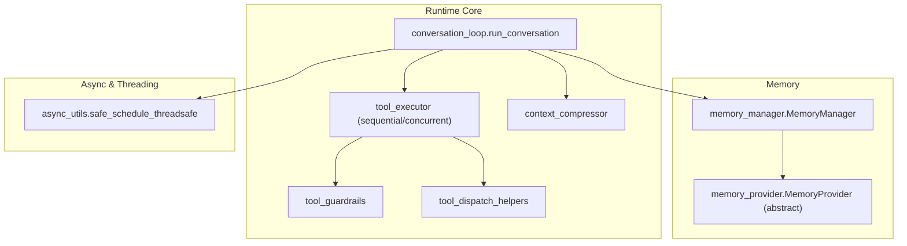
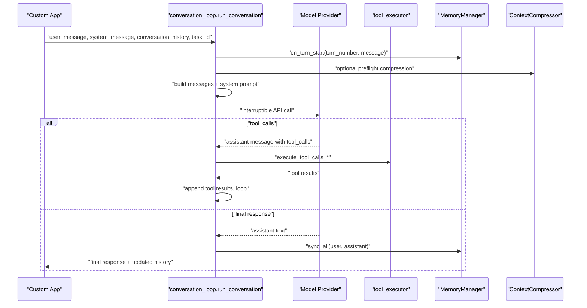
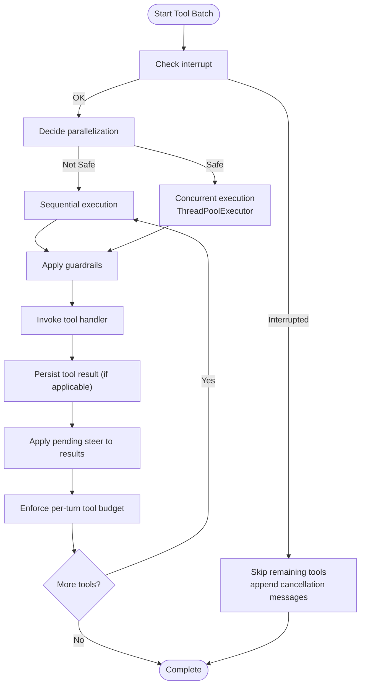
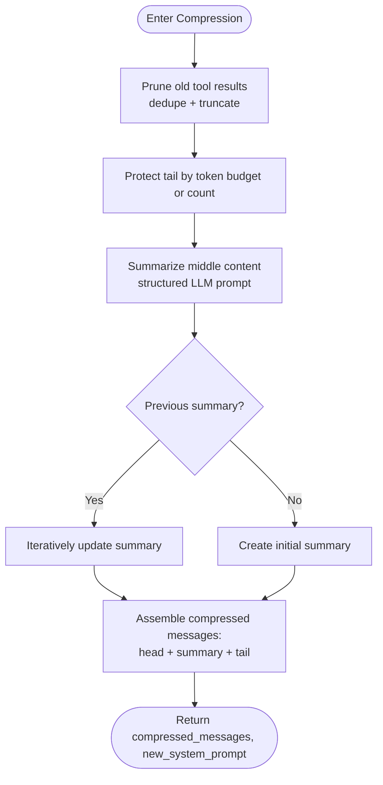
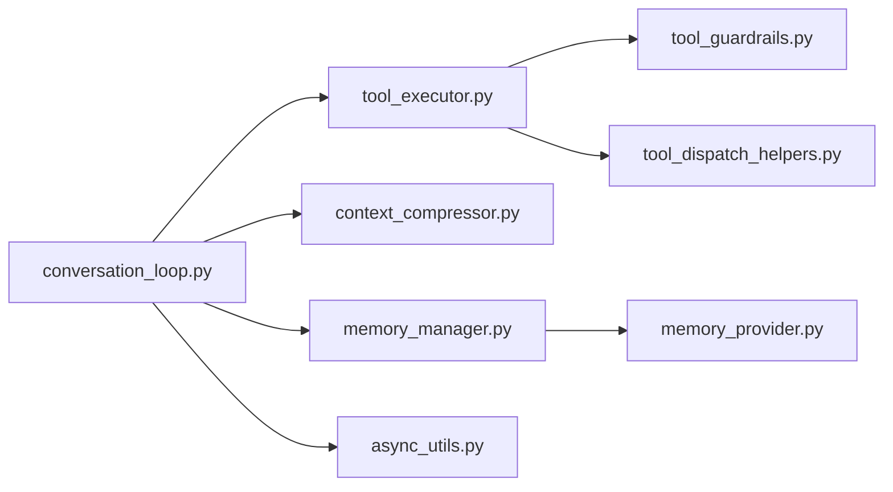

# Agent Runtime API

<cite>
**Referenced Files in This Document**
- [conversation_loop.py](file://agent/conversation_loop.py)
- [tool_executor.py](file://agent/tool_executor.py)
- [memory_manager.py](file://agent/memory_manager.py)
- [memory_provider.py](file://agent/memory_provider.py)
- [context_compressor.py](file://agent/context_compressor.py)
- [tool_dispatch_helpers.py](file://agent/tool_dispatch_helpers.py)
- [tool_guardrails.py](file://agent/tool_guardrails.py)
- [async_utils.py](file://agent/async_utils.py)
- [agent-loop.md](file://website/docs/developer-guide/agent-loop.md)
- [context-compression-and-caching.md](file://website/docs/developer-guide/context-compression-and-caching.md)
- [test_async_utils.py](file://tests/agent/test_async_utils.py)
- [test_model_tools_async_bridge.py](file://tests/test_model_tools_async_bridge.py)
</cite>

## Table of Contents
1. [Introduction](#introduction)
2. [Project Structure](#project-structure)
3. [Core Components](#core-components)
4. [Architecture Overview](#architecture-overview)
5. [Detailed Component Analysis](#detailed-component-analysis)
6. [Dependency Analysis](#dependency-analysis)
7. [Performance Considerations](#performance-considerations)
8. [Troubleshooting Guide](#troubleshooting-guide)
9. [Conclusion](#conclusion)
10. [Appendices](#appendices)

## Introduction
This document describes the Agent Runtime API for programmatic integration with Hermes Agent. It focuses on:
- Conversation management interfaces and orchestration of the agent loop
- Memory access patterns and provider lifecycle
- Tool execution APIs, concurrency, and guardrails
- Context management and compression
- Threading, async bridging, error handling, and production performance

It is intended for developers embedding Hermes in custom applications, building integrations, or extending the runtime behavior.

## Project Structure
The runtime is centered around a conversation loop that:
- Prepares messages and system prompts
- Optionally compresses context
- Executes tool calls (sequential or concurrent)
- Manages memory providers and session state
- Handles interrupts, steers, and streaming

**Diagram sources**
- [conversation_loop.py:85-112](file://agent/conversation_loop.py#L85-L112)
- [tool_executor.py:64-83](file://agent/tool_executor.py#L64-L83)
- [context_compressor.py:454-483](file://agent/context_compressor.py#L454-L483)
- [tool_guardrails.py:224-240](file://agent/tool_guardrails.py#L224-L240)
- [tool_dispatch_helpers.py:103-146](file://agent/tool_dispatch_helpers.py#L103-L146)
- [memory_manager.py:190-201](file://agent/memory_manager.py#L190-L201)
- [memory_provider.py:42-50](file://agent/memory_provider.py#L42-L50)
- [async_utils.py:34-68](file://agent/async_utils.py#L34-L68)

**Section sources**
- [conversation_loop.py:85-112](file://agent/conversation_loop.py#L85-L112)
- [agent-loop.md:59-102](file://website/docs/developer-guide/agent-loop.md#L59-L102)

## Core Components
- Conversation loop: orchestrates a single turn, builds messages, invokes model, executes tools, and persists state.
- Tool executor: runs tool calls sequentially or concurrently, with safety, progress callbacks, and per-tool budgets.
- Memory manager/provider: registers and coordinates memory providers, prefetches context, syncs turns, and routes tool calls.
- Context compressor: prunes tool results, protects head/tail, summarizes middle content, and supports iterative updates.
- Tool guardrails: detects repeated failures and lack of progress to warn or halt tool loops.
- Async/threading utilities: safe scheduling of coroutines from threads and worker loop isolation.

**Section sources**
- [conversation_loop.py:85-112](file://agent/conversation_loop.py#L85-L112)
- [tool_executor.py:64-83](file://agent/tool_executor.py#L64-L83)
- [memory_manager.py:190-201](file://agent/memory_manager.py#L190-L201)
- [context_compressor.py:454-483](file://agent/context_compressor.py#L454-L483)
- [tool_guardrails.py:224-240](file://agent/tool_guardrails.py#L224-L240)
- [async_utils.py:34-68](file://agent/async_utils.py#L34-L68)

## Architecture Overview
High-level runtime flow for a single turn:
1. Initialize turn, hydrate state, and prepare messages
2. Optionally preflight compress context
3. Build API messages and system prompt
4. Invoke model (interruptible)
5. Parse response:
   - If tool_calls: execute tools (sequential or concurrent), append results, loop
   - Else: persist session, flush memory if needed, return

**Diagram sources**
- [conversation_loop.py:460-532](file://agent/conversation_loop.py#L460-L532)
- [conversation_loop.py:643-799](file://agent/conversation_loop.py#L643-L799)
- [tool_executor.py:474-780](file://agent/tool_executor.py#L474-L780)
- [memory_manager.py:317-326](file://agent/memory_manager.py#L317-L326)
- [context_compressor.py:601-621](file://agent/context_compressor.py#L601-L621)

**Section sources**
- [agent-loop.md:59-102](file://website/docs/developer-guide/agent-loop.md#L59-L102)
- [conversation_loop.py:460-532](file://agent/conversation_loop.py#L460-L532)

## Detailed Component Analysis

### Conversation Management Interfaces
- Entry point: run_conversation(agent, user_message, system_message=None, conversation_history=None, task_id=None, stream_callback=None, persist_user_message=None)
- Responsibilities:
  - Sanitize inputs, set runtime main, tag logs, bind skill write origin
  - Reset retry counters and iteration budget
  - Hydrate todo store and memory/skill counters from history
  - Append user message, build cached system prompt, and inject ephemeral context
  - Optional preflight compression if context exceeds threshold
  - Build API messages (with reasoning, sanitization, Anthropic cache hints)
  - Invoke model (interruptible), parse response, and loop on tool_calls
  - Persist session and sync memory on final response

Key behaviors:
- Message roles enforced: system → user → assistant → tool → assistant, avoiding consecutive same roles
- Streaming: stream_callback is stored for _interruptible_api_call to observe deltas
- Interrupts: thread-scoped interrupt signaling; concurrent tools receive per-thread signals
- Prefetch: external memory provider prefetch is performed once per turn and cached across tool iterations

**Section sources**
- [conversation_loop.py:85-112](file://agent/conversation_loop.py#L85-L112)
- [conversation_loop.py:228-298](file://agent/conversation_loop.py#L228-L298)
- [conversation_loop.py:356-423](file://agent/conversation_loop.py#L356-L423)
- [conversation_loop.py:643-799](file://agent/conversation_loop.py#L643-L799)
- [agent-loop.md:81-102](file://website/docs/developer-guide/agent-loop.md#L81-L102)

### Memory Access Patterns and Provider Lifecycle
- MemoryManager:
  - Registers providers (builtin first; at most one external)
  - Builds system prompt blocks from providers
  - Prefetches context for the turn and queues background prefetch for next turn
  - Syncs completed turns to all providers
  - Routes tool calls to the correct provider
  - Lifecycle hooks: on_turn_start, on_session_end, on_session_switch, on_pre_compress, on_memory_write, on_delegation
- MemoryProvider (abstract):
  - Core lifecycle: is_available, initialize, system_prompt_block, prefetch, queue_prefetch, sync_turn, get_tool_schemas, handle_tool_call, shutdown
  - Optional hooks: on_turn_start, on_session_end, on_session_switch, on_pre_compress, on_memory_write, on_delegation
  - Config schema and save_config for setup

Integration patterns:
- Add provider via MemoryManager.add_provider
- Use prefetch_all to inject recall context into user message
- Use sync_all after each turn to persist
- Use handle_tool_call for provider-specific tools routed by tool name

**Section sources**
- [memory_manager.py:190-201](file://agent/memory_manager.py#L190-L201)
- [memory_manager.py:285-302](file://agent/memory_manager.py#L285-L302)
- [memory_manager.py:317-326](file://agent/memory_manager.py#L317-L326)
- [memory_manager.py:356-374](file://agent/memory_manager.py#L356-L374)
- [memory_manager.py:378-436](file://agent/memory_manager.py#L378-L436)
- [memory_manager.py:483-511](file://agent/memory_manager.py#L483-L511)
- [memory_provider.py:42-50](file://agent/memory_provider.py#L42-L50)
- [memory_provider.py:121-137](file://agent/memory_provider.py#L121-L137)
- [memory_provider.py:144-151](file://agent/memory_provider.py#L144-L151)
- [memory_provider.py:202-211](file://agent/memory_provider.py#L202-L211)

### Tool Execution APIs and Concurrency
- Sequential execution:
  - execute_tool_calls_sequential: iterates tool_calls, validates interrupts, applies guardrails, checkpoints, and progress callbacks
  - Supports special tools (todo, session_search, memory, clarify, delegate_task, context engine tools, memory provider tools)
  - Calls handle_function_call for registry tools
- Concurrent execution:
  - execute_tool_calls_concurrent: pools up to _MAX_TOOL_WORKERS, propagates context vars, captures CLI callbacks in workers, and cancels pending futures on interrupt
  - Applies guardrails and per-tool budgets; enforces steer injection between results
- Parallelization rules:
  - _should_parallelize_tool_batch: forbids certain tools (e.g., clarify), requires disjoint path scopes for file tools, and checks MCP parallel safety
  - _is_destructive_command: heuristic to gate destructive terminal commands
- Tool result handling:
  - Multimodal envelopes: _is_multimodal_tool_result, _multimodal_text_summary, _append_subdir_hint_to_multimodal
  - File mutation verification: _extract_file_mutation_targets, per-turn verifier integration

**Diagram sources**
- [tool_executor.py:474-780](file://agent/tool_executor.py#L474-L780)
- [tool_executor.py:64-83](file://agent/tool_executor.py#L64-L83)
- [tool_dispatch_helpers.py:103-146](file://agent/tool_dispatch_helpers.py#L103-L146)
- [tool_dispatch_helpers.py:177-234](file://agent/tool_dispatch_helpers.py#L177-L234)

**Section sources**
- [tool_executor.py:64-83](file://agent/tool_executor.py#L64-L83)
- [tool_executor.py:474-780](file://agent/tool_executor.py#L474-L780)
- [tool_dispatch_helpers.py:103-146](file://agent/tool_dispatch_helpers.py#L103-L146)
- [tool_dispatch_helpers.py:177-234](file://agent/tool_dispatch_helpers.py#L177-L234)

### Context Management and Compression APIs
- ContextCompressor:
  - Initialization with model, thresholds, and budgets
  - should_compress: decides whether to compress based on token counts and effectiveness
  - _prune_old_tool_results: replaces large tool outputs with concise summaries, deduplicates identical results, and truncates large tool_call arguments
  - Iterative summary updates: preserves information across multiple compactions using _previous_summary
  - Tail protection: protects recent tokens/messages using token budget or count
  - Integration hooks: on_session_reset, update_model, update_from_response
- Compression lifecycle:
  - Preflight checks before loop
  - on_pre_compress for providers
  - on_session_switch for session rotation during compression

**Diagram sources**
- [context_compressor.py:601-621](file://agent/context_compressor.py#L601-L621)
- [context_compressor.py:627-793](file://agent/context_compressor.py#L627-L793)
- [context_compressor.py:799-800](file://agent/context_compressor.py#L799-L800)
- [context_compressor.py:454-483](file://agent/context_compressor.py#L454-L483)
- [context-compression-and-caching.md:192-211](file://website/docs/developer-guide/context-compression-and-caching.md#L192-L211)

**Section sources**
- [context_compressor.py:454-483](file://agent/context_compressor.py#L454-L483)
- [context_compressor.py:601-621](file://agent/context_compressor.py#L601-L621)
- [context_compressor.py:627-793](file://agent/context_compressor.py#L627-L793)
- [context-compression-and-caching.md:192-211](file://website/docs/developer-guide/context-compression-and-caching.md#L192-L211)

### Tool Loop Orchestration, Interrupts, and Steering
- Interrupt mechanism:
  - Thread-scoped interrupt signaling; worker threads registered for targeted cancellation
  - Per-thread _set_interrupt applied to tool workers; concurrent futures cancelled on interrupt
- /steer mechanism:
  - Pending steer text injected into tool results to guide the model on next iteration
  - Drain occurs between tool results and after the batch to ensure earliest possible injection
- Iteration budget and grace call:
  - IterationBudget controls per-turn tool iterations; grace call allows one extra call after budget exhaustion

**Section sources**
- [conversation_loop.py:482-493](file://agent/conversation_loop.py#L482-L493)
- [conversation_loop.py:593-641](file://agent/conversation_loop.py#L593-L641)
- [tool_executor.py:314-327](file://agent/tool_executor.py#L314-L327)
- [tool_executor.py:454-470](file://agent/tool_executor.py#L454-L470)

### Programmatic Conversation Initiation and Response Processing
- Programmatic initiation:
  - Call run_conversation with user_message and optional system_message/history/task_id
  - Provide stream_callback for streaming deltas
  - persist_user_message allows storing a sanitized version of the user message
- Response processing:
  - If response contains tool_calls: execute tools and loop
  - If final text: persist session, sync memory, and return
- Message format:
  - OpenAI-compatible roles: system, user, assistant, tool
  - Assistant reasoning stored in assistant_msg["reasoning"] and copied to provider-friendly fields

**Section sources**
- [conversation_loop.py:85-112](file://agent/conversation_loop.py#L85-L112)
- [conversation_loop.py:643-799](file://agent/conversation_loop.py#L643-L799)
- [agent-loop.md:81-102](file://website/docs/developer-guide/agent-loop.md#L81-L102)

### Embedding Hermes in Custom Applications
- Minimal integration steps:
  - Initialize agent (provider/model/session) and MemoryManager
  - Add memory provider(s) via MemoryManager.add_provider
  - For each turn: call run_conversation with user_message
  - For streaming: pass stream_callback to observe deltas
  - For tool results: rely on tool_executor to append tool messages and enforce budgets
- Gateway-like patterns:
  - Fresh agent per inbound message
  - Hydrate counters from persisted history
  - Use on_session_start/on_session_end hooks for plugin initialization/cleanup

**Section sources**
- [conversation_loop.py:234-256](file://agent/conversation_loop.py#L234-L256)
- [conversation_loop.py:332-353](file://agent/conversation_loop.py#L332-L353)
- [memory_manager.py:330-350](file://agent/memory_manager.py#L330-L350)

### Asynchronous Operations and Threading Considerations
- Safe coroutine scheduling:
  - Use safe_schedule_threadsafe to schedule coroutines on a loop from a thread
  - On failure, coroutine is closed to avoid leaks and warnings
- Worker loop isolation:
  - Each worker thread runs its own event loop; barriers ensure distinct loops across workers
- Interrupt propagation:
  - Worker threads capture CLI callbacks and activity callbacks; per-thread interrupt bits applied to tool workers

**Section sources**
- [async_utils.py:34-68](file://agent/async_utils.py#L34-L68)
- [tool_executor.py:197-270](file://agent/tool_executor.py#L197-L270)
- [test_async_utils.py:39-83](file://tests/agent/test_async_utils.py#L39-L83)
- [test_model_tools_async_bridge.py:132-162](file://tests/test_model_tools_async_bridge.py#L132-L162)

### State Persistence and Session Management
- Session rotation:
  - Context compression may rotate session_id; on_session_switch notifies providers to refresh cached per-session state
- Memory sync:
  - sync_all(user_content, assistant_content) persists completed turns
- Turn counters:
  - _user_turn_count, _turns_since_memory, _iters_since_skill accumulate across turns; hydrated from history for gateway-style agents

**Section sources**
- [conversation_loop.py:381-396](file://agent/conversation_loop.py#L381-L396)
- [memory_manager.py:403-436](file://agent/memory_manager.py#L403-L436)
- [memory_manager.py:317-326](file://agent/memory_manager.py#L317-L326)

## Dependency Analysis
- Coupling:
  - conversation_loop depends on tool_executor, memory_manager, context_compressor, and various helpers
  - tool_executor depends on tool_guardrails, tool_dispatch_helpers, and registry-based tool resolution
  - memory_manager depends on memory_provider abstractions
- Cohesion:
  - Each module encapsulates a single responsibility: loop orchestration, tool execution, memory, compression, or async bridging
- External dependencies:
  - Model providers (OpenAI, Anthropic, etc.) via adapters
  - Optional external memory providers (via MemoryManager)

**Diagram sources**
- [conversation_loop.py:85-112](file://agent/conversation_loop.py#L85-L112)
- [tool_executor.py:64-83](file://agent/tool_executor.py#L64-L83)
- [memory_manager.py:190-201](file://agent/memory_manager.py#L190-L201)
- [context_compressor.py:454-483](file://agent/context_compressor.py#L454-L483)
- [tool_guardrails.py:224-240](file://agent/tool_guardrails.py#L224-L240)
- [tool_dispatch_helpers.py:103-146](file://agent/tool_dispatch_helpers.py#L103-L146)
- [memory_provider.py:42-50](file://agent/memory_provider.py#L42-L50)
- [async_utils.py:34-68](file://agent/async_utils.py#L34-L68)

**Section sources**
- [conversation_loop.py:85-112](file://agent/conversation_loop.py#L85-L112)
- [tool_executor.py:64-83](file://agent/tool_executor.py#L64-L83)
- [memory_manager.py:190-201](file://agent/memory_manager.py#L190-L201)
- [context_compressor.py:454-483](file://agent/context_compressor.py#L454-L483)
- [tool_guardrails.py:224-240](file://agent/tool_guardrails.py#L224-L240)
- [tool_dispatch_helpers.py:103-146](file://agent/tool_dispatch_helpers.py#L103-L146)
- [memory_provider.py:42-50](file://agent/memory_provider.py#L42-L50)
- [async_utils.py:34-68](file://agent/async_utils.py#L34-L68)

## Performance Considerations
- Context compression:
  - Use preflight compression to avoid API errors on large histories
  - Iterative summaries reduce repeated recomputation overhead
- Tool execution:
  - Prefer concurrent execution for independent, read-only tools
  - Use _should_parallelize_tool_batch to avoid unsafe overlaps
- Streaming:
  - Provide stream_callback to start downstream processing early
- Memory prefetch:
  - One-time prefetch per turn reduces repeated provider calls
- Token budgeting:
  - Tail protection and pruning reduce payload sizes

[No sources needed since this section provides general guidance]

## Troubleshooting Guide
- Interrupt handling:
  - If tools hang, ensure per-thread interrupt bits are set for worker threads
  - On concurrent batches, futures are cancelled on interrupt; verify worker cleanup
- Tool loop guardrails:
  - Repeated failures or no-progress warnings can escalate to blocking; adjust thresholds or strategies
- Streaming anomalies:
  - Streaming context scrubber resets per turn; ensure proper scrubbing across chunk boundaries
- Async scheduling:
  - Use safe_schedule_threadsafe to avoid coroutine leaks and warnings during shutdown races
- Compression warnings:
  - Repeated compressions degrade quality; consider /new or focused compression

**Section sources**
- [tool_executor.py:314-327](file://agent/tool_executor.py#L314-L327)
- [tool_guardrails.py:241-283](file://agent/tool_guardrails.py#L241-L283)
- [memory_manager.py:86-156](file://agent/memory_manager.py#L86-L156)
- [async_utils.py:34-68](file://agent/async_utils.py#L34-L68)
- [conversation_loop.py:398-405](file://agent/conversation_loop.py#L398-L405)

## Conclusion
The Agent Runtime API provides a robust, extensible foundation for integrating Hermes into custom applications. By leveraging the conversation loop, memory manager, tool executor, and context compressor, developers can build reliable, production-grade systems with strong controls over concurrency, state, and performance.

[No sources needed since this section summarizes without analyzing specific files]

## Appendices

### API Reference Index
- Conversation loop: run_conversation
- Tool execution: execute_tool_calls_sequential, execute_tool_calls_concurrent
- Memory: MemoryManager, MemoryProvider
- Compression: ContextCompressor
- Guardrails: ToolCallGuardrailController
- Async: safe_schedule_threadsafe

**Section sources**
- [conversation_loop.py:85-112](file://agent/conversation_loop.py#L85-L112)
- [tool_executor.py:64-83](file://agent/tool_executor.py#L64-L83)
- [memory_manager.py:190-201](file://agent/memory_manager.py#L190-L201)
- [memory_provider.py:42-50](file://agent/memory_provider.py#L42-L50)
- [context_compressor.py:454-483](file://agent/context_compressor.py#L454-L483)
- [tool_guardrails.py:224-240](file://agent/tool_guardrails.py#L224-L240)
- [async_utils.py:34-68](file://agent/async_utils.py#L34-L68)