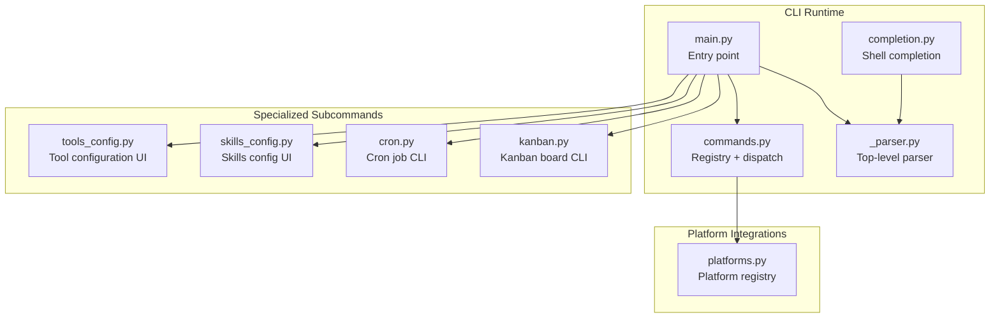
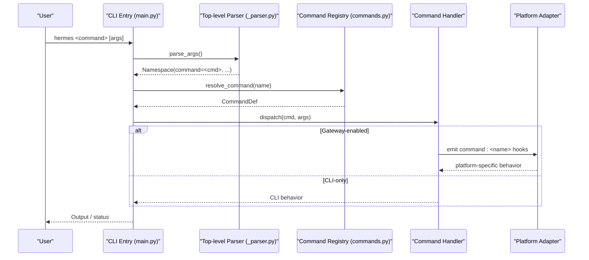
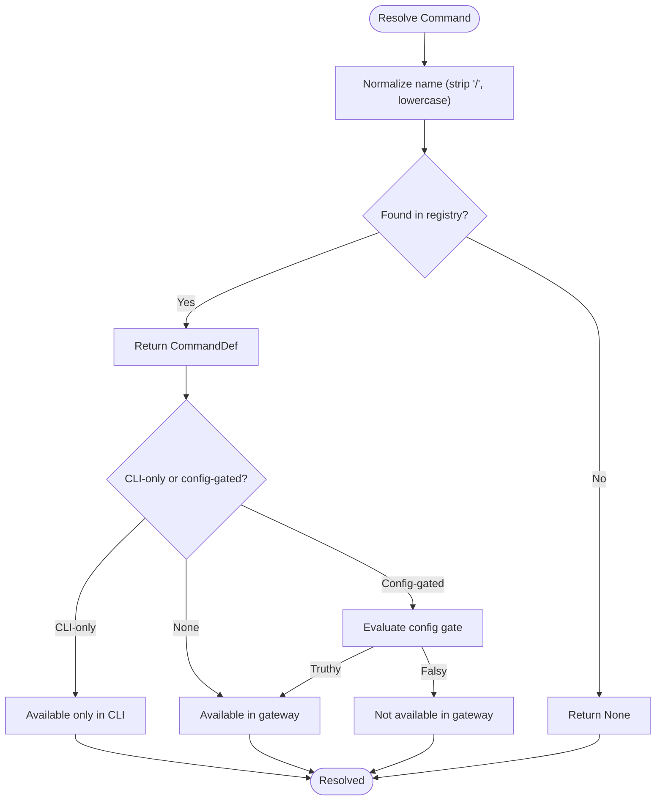
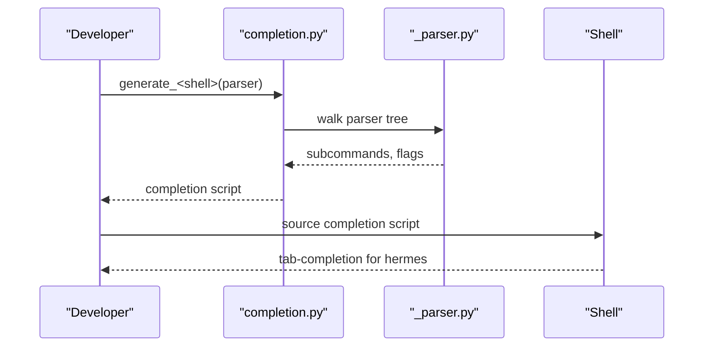
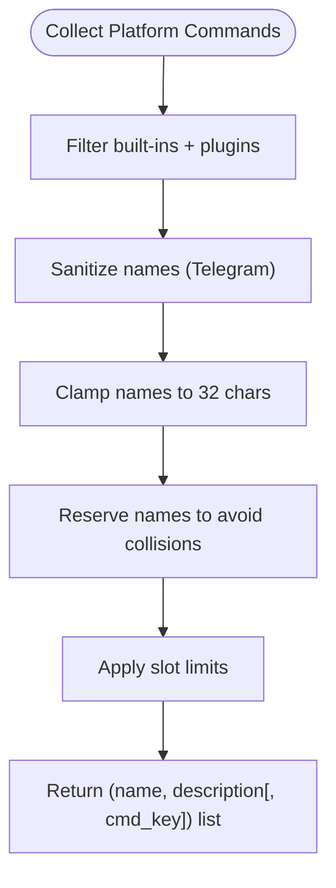
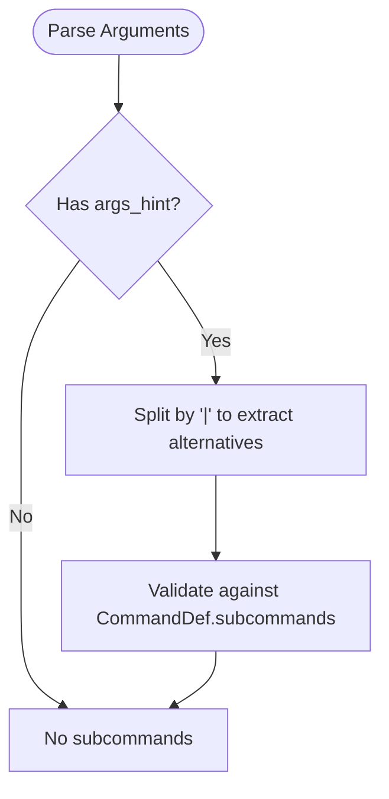
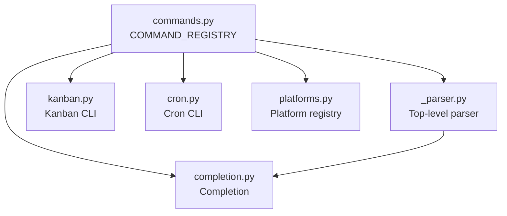

# CLI Commands

<cite>
**Referenced Files in This Document**
- [commands.py](file://hermes_cli/commands.py)
- [_parser.py](file://hermes_cli/_parser.py)
- [main.py](file://hermes_cli/main.py)
- [completion.py](file://hermes_cli/completion.py)
- [platforms.py](file://hermes_cli/platforms.py)
- [kanban.py](file://hermes_cli/kanban.py)
- [cron.py](file://hermes_cli/cron.py)
- [skills_config.py](file://hermes_cli/skills_config.py)
- [tools_config.py](file://hermes_cli/tools_config.py)
</cite>

## Table of Contents
1. [Introduction](#introduction)
2. [Project Structure](#project-structure)
3. [Core Components](#core-components)
4. [Architecture Overview](#architecture-overview)
5. [Detailed Component Analysis](#detailed-component-analysis)
6. [Dependency Analysis](#dependency-analysis)
7. [Performance Considerations](#performance-considerations)
8. [Troubleshooting Guide](#troubleshooting-guide)
9. [Conclusion](#conclusion)
10. [Appendices](#appendices)

## Introduction
This document provides comprehensive API documentation for Hermes Agent’s CLI slash commands. It catalogs all slash commands, their parameters, aliases, categories, and usage contexts. It explains the central command registry, autocomplete and platform-specific command mappings, argument parsing rules, error handling, and availability across CLI versus gateway modes. Practical examples demonstrate command combinations and advanced usage patterns.

## Project Structure
The CLI slash command system is defined centrally and consumed by the CLI entry point, gateway, and platform integrations:
- Central registry and dispatch logic: hermes_cli/commands.py
- Top-level CLI parser and examples: hermes_cli/_parser.py, hermes_cli/main.py
- Shell completion generation: hermes_cli/completion.py
- Platform metadata: hermes_cli/platforms.py
- Specialized subcommands: hermes_cli/kanban.py, hermes_cli/cron.py
- Tools and skills configuration: hermes_cli/tools_config.py, hermes_cli/skills_config.py

**Diagram sources**
- [main.py:1-120](file://hermes_cli/main.py#L1-L120)
- [_parser.py:82-377](file://hermes_cli/_parser.py#L82-L377)
- [commands.py:64-217](file://hermes_cli/commands.py#L64-L217)
- [completion.py:15-44](file://hermes_cli/completion.py#L15-L44)
- [kanban.py:157-661](file://hermes_cli/kanban.py#L157-L661)
- [cron.py:35-314](file://hermes_cli/cron.py#L35-L314)
- [skills_config.py:1-178](file://hermes_cli/skills_config.py#L1-L178)
- [tools_config.py:1-120](file://hermes_cli/tools_config.py#L1-L120)
- [platforms.py:14-44](file://hermes_cli/platforms.py#L14-L44)

**Section sources**
- [main.py:1-120](file://hermes_cli/main.py#L1-L120)
- [_parser.py:82-377](file://hermes_cli/_parser.py#L82-L377)
- [commands.py:64-217](file://hermes_cli/commands.py#L64-L217)
- [completion.py:15-44](file://hermes_cli/completion.py#L15-L44)
- [kanban.py:157-661](file://hermes_cli/kanban.py#L157-L661)
- [cron.py:35-314](file://hermes_cli/cron.py#L35-L314)
- [skills_config.py:1-178](file://hermes_cli/skills_config.py#L1-L178)
- [tools_config.py:1-120](file://hermes_cli/tools_config.py#L1-L120)
- [platforms.py:14-44](file://hermes_cli/platforms.py#L14-L44)

## Core Components
- Central command registry: A single source of truth for slash commands, including canonical names, aliases, descriptions, categories, argument hints, subcommands, and platform/gateway availability flags.
- Dispatch and help: Utilities to resolve commands, derive help text for CLI and gateway, and compute platform-specific command menus.
- Parser and examples: Top-level parser with examples and flags; specialized subparsers for kanban and cron.
- Autocomplete: Shell completion generators for bash, zsh, and fish.
- Platform registry: Canonical platform metadata used by tools and skills configuration.

Key responsibilities:
- Define slash commands and their metadata in one place.
- Derive CLI and gateway help surfaces from the registry.
- Enforce availability gates (CLI-only, gateway-only, config-gated).
- Generate platform command menus with sanitization and collision avoidance.

**Section sources**
- [commands.py:45-217](file://hermes_cli/commands.py#L45-L217)
- [commands.py:224-438](file://hermes_cli/commands.py#L224-L438)
- [commands.py:473-840](file://hermes_cli/commands.py#L473-L840)
- [_parser.py:82-377](file://hermes_cli/_parser.py#L82-L377)
- [completion.py:15-316](file://hermes_cli/completion.py#L15-L316)
- [platforms.py:14-84](file://hermes_cli/platforms.py#L14-L84)

## Architecture Overview
The slash command system is designed around a central registry that informs:
- CLI help and subcommand parsers
- Gateway help and command menus
- Platform-specific command registrations (Telegram, Discord, Slack, etc.)
- Autocomplete generation

**Diagram sources**
- [main.py:1-120](file://hermes_cli/main.py#L1-L120)
- [_parser.py:82-377](file://hermes_cli/_parser.py#L82-L377)
- [commands.py:237-370](file://hermes_cli/commands.py#L237-L370)
- [commands.py:422-438](file://hermes_cli/commands.py#L422-L438)

## Detailed Component Analysis

### Command Categories and Purpose
- Session: Lifecycle and conversational controls (start, history, retry, undo, title, branch, compress, rollback, snapshot, stop, approve, deny, background, queue, steer, goal, subgoal, status, whoami, profile, sethome, resume).
- Configuration: Model switching, provider toggles, UI/display preferences, reasoning effort, fast mode, voice mode, busy behavior, footer, verbose, indicator, skin, personality, codex runtime, gquota.
- Tools & Skills: Tools management, toolsets, skills search/install/inspect, cron management, curator maintenance, kanban board, reloads, plugins, browser tool connectivity.
- Info: Help, commands listing, usage analytics, insights, platforms status, platform control, copy/paste/image attachment, update, debug.
- Exit: Quit/exit with optional deletion of session history.

**Section sources**
- [commands.py:64-217](file://hermes_cli/commands.py#L64-L217)

### Command Registration and Resolution
- Central registry: COMMAND_REGISTRY defines CommandDef entries with name, description, category, aliases, args_hint, subcommands, cli_only, gateway_only, and gateway_config_gate.
- Lookup: resolve_command maps names/aliases to CommandDef, stripping leading slash and lowercasing.
- Help derivation: gateway_help_lines builds help text for gateway surfaces, honoring availability gates.
- Availability gates: cli_only vs gateway-only; config-gated commands evaluated via _resolve_config_gates and _is_gateway_available.

**Diagram sources**
- [commands.py:237-415](file://hermes_cli/commands.py#L237-L415)

**Section sources**
- [commands.py:224-415](file://hermes_cli/commands.py#L224-L415)

### Autocomplete Functionality
- Shell completion generation: completion.py walks the argparse tree to produce accurate completion scripts for bash, zsh, and fish.
- Top-level parser examples: _parser.py includes an extensive examples section for the CLI.

**Diagram sources**
- [completion.py:15-137](file://hermes_cli/completion.py#L15-L137)
- [_parser.py:40-79](file://hermes_cli/_parser.py#L40-L79)

**Section sources**
- [completion.py:15-316](file://hermes_cli/completion.py#L15-L316)
- [_parser.py:40-79](file://hermes_cli/_parser.py#L40-L79)

### Platform-Specific Command Mappings
- Telegram: _sanitize_telegram_name converts names to valid Telegram command names (lowercase, underscores, hyphens replaced). _clamp_command_names enforces 32-character limit with collision avoidance. telegram_menu_commands prioritizes plugin commands, then built-in skills, excluding hub-installed skills and platform-disabled skills.
- Discord: Similar collection logic with Discord’s constraints (names can include hyphens, descriptions capped at 100 chars). discord_skill_commands organizes entries for slash command registration.
- General platform metadata: platforms.py defines platform labels and default toolsets.

**Diagram sources**
- [commands.py:473-574](file://hermes_cli/commands.py#L473-L574)
- [commands.py:580-840](file://hermes_cli/commands.py#L580-L840)
- [platforms.py:14-44](file://hermes_cli/platforms.py#L14-L44)

**Section sources**
- [commands.py:473-840](file://hermes_cli/commands.py#L473-L840)
- [platforms.py:14-84](file://hermes_cli/platforms.py#L14-L84)

### Slash Commands Reference

#### Session
- /new
  - Aliases: reset
  - Args: [name]
  - Description: Start a new session (fresh session ID + history)
  - Category: Session
- /background
  - Aliases: bg, btw
  - Args: <prompt>
  - Description: Run a prompt in the background
  - Category: Session
- /branch
  - Aliases: fork
  - Args: [name]
  - Description: Branch the current session (explore a different path)
  - Category: Session
- /compress
  - Args: [focus topic]
  - Description: Manually compress conversation context
  - Category: Session
- /goal
  - Args: [text | pause | resume | clear | status]
  - Description: Set a standing goal Hermes works on across turns until achieved
  - Category: Session
- /history
  - Description: Show conversation history
  - Category: Session
  - Availability: CLI-only
- /queue
  - Aliases: q
  - Args: <prompt>
  - Description: Queue a prompt for the next turn (doesn't interrupt)
  - Category: Session
- /retry
  - Description: Retry the last message (resend to agent)
  - Category: Session
- /rollback
  - Args: [number]
  - Description: List or restore filesystem checkpoints
  - Category: Session
- /save
  - Description: Save the current conversation
  - Category: Session
  - Availability: CLI-only
- /snapshot
  - Aliases: snap
  - Args: [create|restore <id>|prune]
  - Description: Create or restore state snapshots of Hermes config/state
  - Category: Session
  - Availability: CLI-only
- /status
  - Description: Show session info
  - Category: Session
- /steer
  - Args: <prompt>
  - Description: Inject a message after the next tool call without interrupting
  - Category: Session
- /stop
  - Description: Kill all running background processes
  - Category: Session
- /subgoal
  - Args: [text | remove N | clear]
  - Description: Add or manage extra criteria on the active goal
  - Category: Session
- /title
  - Args: [name]
  - Description: Set a title for the current session
  - Category: Session
- /topic
  - Args: [off|help|session-id]
  - Description: Enable or inspect Telegram DM topic sessions
  - Category: Session
  - Availability: Gateway-only
- /undo
  - Description: Remove the last user/assistant exchange
  - Category: Session
- /whoami
  - Description: Show your slash command access (admin / user)
  - Category: Info
- /profile
  - Description: Show active profile name and home directory
  - Category: Info
- /sethome
  - Aliases: set-home
  - Args: <platform>
  - Description: Set this chat as the home channel
  - Category: Session
  - Availability: Gateway-only
- /resume
  - Args: [name]
  - Description: Resume a previously-named session
  - Category: Session

**Section sources**
- [commands.py:64-116](file://hermes_cli/commands.py#L64-L116)

#### Configuration
- /config
  - Description: Show current configuration
  - Category: Configuration
  - Availability: CLI-only
- /codex-runtime
  - Aliases: codex_runtime
  - Args: [auto|codex_app_server]
  - Description: Toggle codex app-server runtime for OpenAI/Codex models
  - Category: Configuration
- /fast
  - Args: [normal|fast|status|on|off]
  - Description: Toggle fast mode — OpenAI Priority Processing / Anthropic Fast Mode
  - Category: Configuration
- /footer
  - Args: [on|off|status]
  - Subcommands: on, off, status
  - Description: Toggle gateway runtime-metadata footer on final replies
  - Category: Configuration
- /gquota
  - Description: Show Google Gemini Code Assist quota usage
  - Category: Info
  - Availability: CLI-only
- /indicator
  - Args: [kaomoji|emoji|unicode|ascii]
  - Subcommands: kaomoji, emoji, unicode, ascii
  - Description: Pick the TUI busy-indicator style
  - Category: Configuration
  - Availability: CLI-only
- /model
  - Aliases: provider
  - Args: [model] [--provider name] [--global]
  - Description: Switch model for this session
  - Category: Configuration
- /personality
  - Args: [name]
  - Description: Set a predefined personality
  - Category: Configuration
- /reasoning
  - Args: [level|show|hide]
  - Subcommands: none, minimal, low, medium, high, xhigh, show, hide, on, off
  - Description: Manage reasoning effort and display
  - Category: Configuration
- /skin
  - Args: [name]
  - Description: Show or change the display skin/theme
  - Category: Configuration
  - Availability: CLI-only
- /statusbar
  - Aliases: sb
  - Description: Toggle the context/model status bar
  - Category: Configuration
  - Availability: CLI-only
- /verbose
  - Description: Cycle tool progress display: off -> new -> all -> verbose
  - Category: Configuration
  - Availability: Gateway-only (config-gated)
- /voice
  - Args: [on|off|tts|status]
  - Subcommands: on, off, tts, status
  - Description: Toggle voice mode
  - Category: Configuration
- /busy
  - Args: [queue|steer|interrupt|status]
  - Subcommands: queue, steer, interrupt, status
  - Description: Control what Enter does while Hermes is working
  - Category: Configuration
  - Availability: CLI-only

**Section sources**
- [commands.py:121-159](file://hermes_cli/commands.py#L121-L159)

#### Tools & Skills
- /tools
  - Args: [list|disable|enable] [name...]
  - Description: Manage tools: list/disable/enable
  - Category: Tools & Skills
  - Availability: CLI-only
- /toolsets
  - Description: List available toolsets
  - Category: Tools & Skills
  - Availability: CLI-only
- /skills
  - Subcommands: search, browse, inspect, install
  - Description: Search, install, inspect, or manage skills
  - Category: Tools & Skills
  - Availability: CLI-only
- /cron
  - Args: [subcommand]
  - Subcommands: list, add/create, edit, pause, resume, run, remove
  - Description: Manage scheduled tasks
  - Category: Tools & Skills
  - Availability: CLI-only
- /curator
  - Args: [subcommand]
  - Subcommands: status, run, pause, resume, pin, unpin, restore, list-archived
  - Description: Background skill maintenance (status, run, pin, archive, list-archived)
  - Category: Tools & Skills
- /kanban
  - Args: [subcommand]
  - Subcommands: list/ls, show, create, assign, link/unlink, claim, comment, complete, block/unblock, archive, tail, dispatch, context, init, gc
  - Description: Multi-profile collaboration board (tasks, links, comments)
  - Category: Tools & Skills
- /reload
  - Description: Reload .env variables into the running session
  - Category: Tools & Skills
  - Availability: CLI-only
- /reload-mcp
  - Aliases: reload_mcp
  - Description: Reload MCP servers from config
  - Category: Tools & Skills
- /reload-skills
  - Aliases: reload_skills
  - Description: Re-scan ~/.hermes/skills/ for newly installed or removed skills
  - Category: Tools & Skills
- /browser
  - Args: [connect|disconnect|status]
  - Subcommands: connect, disconnect, status
  - Description: Connect browser tools to your live Chrome via CDP
  - Category: Tools & Skills
  - Availability: CLI-only
- /plugins
  - Description: List installed plugins and their status
  - Category: Tools & Skills
  - Availability: CLI-only

**Section sources**
- [commands.py:161-190](file://hermes_cli/commands.py#L161-L190)

#### Info
- /commands
  - Args: [page]
  - Description: Browse all commands and skills (paginated)
  - Category: Info
  - Availability: Gateway-only
- /help
  - Description: Show available commands
  - Category: Info
- /usage
  - Description: Show token usage and rate limits for the current session
  - Category: Info
- /insights
  - Args: [days]
  - Description: Show usage insights and analytics
  - Category: Info
- /platforms
  - Aliases: gateway
  - Description: Show gateway/messaging platform status
  - Category: Info
  - Availability: CLI-only
- /platform
  - Args: <pause|resume|list> [name]
  - Description: Pause, resume, or list a failing gateway platform
  - Category: Info
  - Availability: Gateway-only
- /copy
  - Args: [number]
  - Description: Copy the last assistant response to clipboard
  - Category: Info
  - Availability: CLI-only
- /paste
  - Description: Attach clipboard image from your clipboard
  - Category: Info
  - Availability: CLI-only
- /image
  - Args: <path>
  - Description: Attach a local image file for your next prompt
  - Category: Info
  - Availability: CLI-only
- /update
  - Description: Update Hermes Agent to the latest version
  - Category: Info
  - Availability: Gateway-only
- /debug
  - Description: Upload debug report (system info + logs) and get shareable links
  - Category: Info

**Section sources**
- [commands.py:192-213](file://hermes_cli/commands.py#L192-L213)

#### Exit
- /quit
  - Aliases: exit
  - Args: [--delete]
  - Description: Exit the CLI (use --delete to also remove session history)
  - Category: Exit
  - Availability: CLI-only

**Section sources**
- [commands.py:215-217](file://hermes_cli/commands.py#L215-L217)

### Argument Parsing Rules and Examples
- Argument hints:
  - Required arguments are indicated by angle brackets (e.g., <prompt>).
  - Optional arguments are indicated by square brackets (e.g., [name]).
  - Pipe-separated alternatives in args_hint are automatically extracted as subcommands when explicit subcommands are not defined.
- Examples:
  - Hermetic examples are provided in the top-level parser epilogue, covering chat modes, sessions, setup, auth, model selection, gateway, logs, dashboard, and update.
- Specialized subcommands:
  - Kanban: hermes_cli/kanban.py defines a comprehensive subcommand tree for board and task management.
  - Cron: hermes_cli/cron.py defines list, create, edit, pause/resume/run/remove, status, and tick.

**Diagram sources**
- [commands.py:276-288](file://hermes_cli/commands.py#L276-L288)
- [_parser.py:40-79](file://hermes_cli/_parser.py#L40-L79)
- [kanban.py:157-661](file://hermes_cli/kanban.py#L157-L661)
- [cron.py:165-314](file://hermes_cli/cron.py#L165-L314)

**Section sources**
- [commands.py:276-288](file://hermes_cli/commands.py#L276-L288)
- [_parser.py:40-79](file://hermes_cli/_parser.py#L40-L79)
- [kanban.py:157-661](file://hermes_cli/kanban.py#L157-L661)
- [cron.py:165-314](file://hermes_cli/cron.py#L165-L314)

### Error Handling and Safety
- Safety for active sessions:
  - should_bypass_active_session determines whether recognized slash commands bypass the active session queue to avoid silent interruptions.
- CLI-only vs gateway-only:
  - Commands marked cli_only are unavailable in gateway unless overridden by a config gate.
- Config-gated commands:
  - Commands with gateway_config_gate are only available when the referenced config value is truthy.
- Platform restrictions:
  - Telegram command names are sanitized and clamped to 32 characters; duplicates are resolved by appending a digit suffix.

**Section sources**
- [commands.py:325-370](file://hermes_cli/commands.py#L325-L370)
- [commands.py:372-415](file://hermes_cli/commands.py#L372-L415)
- [commands.py:519-570](file://hermes_cli/commands.py#L519-L570)

### Practical Usage Patterns and Combinations
- Session management:
  - Start a new session, set a title, and queue follow-up prompts without interrupting the agent.
  - Use /branch to explore alternate paths and /rollback to restore checkpoints.
- Configuration:
  - Switch model/provider with /model; adjust reasoning effort with /reasoning; toggle fast mode with /fast.
  - Control UI behavior with /statusbar, /skin, /indicator, and /voice.
- Tools and skills:
  - Enable/disable tools with /tools; list toolsets with /toolsets.
  - Manage skills via /skills; reload skills with /reload-skills.
  - Schedule recurring tasks with /cron; manage Kanban boards with /kanban.
- Gateway and platform:
  - Use /platforms and /platform to monitor and control gateway platforms.
  - On Telegram, commands are mapped with sanitized names and clamped to 32 characters.

**Section sources**
- [commands.py:64-217](file://hermes_cli/commands.py#L64-L217)
- [commands.py:473-574](file://hermes_cli/commands.py#L473-L574)
- [kanban.py:157-661](file://hermes_cli/kanban.py#L157-L661)
- [cron.py:165-314](file://hermes_cli/cron.py#L165-L314)

## Dependency Analysis
The slash command system depends on:
- Central registry for command metadata
- Parser for argument extraction and help
- Platform registry for platform labels and default toolsets
- Specialized subcommand modules for kanban and cron
- Completion generator for shell integration

**Diagram sources**
- [commands.py:64-217](file://hermes_cli/commands.py#L64-L217)
- [_parser.py:82-377](file://hermes_cli/_parser.py#L82-L377)
- [completion.py:15-44](file://hermes_cli/completion.py#L15-L44)
- [kanban.py:157-661](file://hermes_cli/kanban.py#L157-L661)
- [cron.py:165-314](file://hermes_cli/cron.py#L165-L314)
- [platforms.py:14-44](file://hermes_cli/platforms.py#L14-L44)

**Section sources**
- [commands.py:64-217](file://hermes_cli/commands.py#L64-L217)
- [_parser.py:82-377](file://hermes_cli/_parser.py#L82-L377)
- [completion.py:15-44](file://hermes_cli/completion.py#L15-L44)
- [kanban.py:157-661](file://hermes_cli/kanban.py#L157-L661)
- [cron.py:165-314](file://hermes_cli/cron.py#L165-L314)
- [platforms.py:14-44](file://hermes_cli/platforms.py#L14-L44)

## Performance Considerations
- Centralized registry avoids duplication and reduces maintenance overhead.
- Availability gates minimize unnecessary lookups in gateway contexts.
- Platform name clamping prevents excessive collisions and reduces mapping churn.

## Troubleshooting Guide
- Command not found:
  - Verify the command name and aliases; resolve_command returns None for unrecognized names.
- Command not available:
  - Check cli_only and gateway_config_gate; ensure config-gated values are truthy.
- Telegram command issues:
  - Names are sanitized and clamped; verify the resulting sanitized name and length.
- Gateway not running:
  - Some commands rely on gateway activity (e.g., cron status, kanban dispatcher); start the gateway if needed.

**Section sources**
- [commands.py:237-415](file://hermes_cli/commands.py#L237-L415)
- [commands.py:519-570](file://hermes_cli/commands.py#L519-L570)
- [cron.py:126-163](file://hermes_cli/cron.py#L126-L163)
- [kanban.py:99-151](file://hermes_cli/kanban.py#L99-L151)

## Conclusion
The Hermes CLI slash command system provides a unified, extensible, and platform-aware interface for session management, configuration, tools, skills, and gateway operations. Its central registry, robust availability gates, and platform-specific mappings ensure consistent behavior across CLI and gateway contexts while enabling powerful automation and integrations.

## Appendices
- Platform metadata and default toolsets are defined in platforms.py and used by tools and skills configuration modules.
- Shell completion scripts are generated by completion.py and integrate with the top-level parser.

**Section sources**
- [platforms.py:14-84](file://hermes_cli/platforms.py#L14-L84)
- [completion.py:15-316](file://hermes_cli/completion.py#L15-L316)