# Gateway Integration API

<cite>
**Referenced Files in This Document**
- [README.md](file://README.md)
- [gateway/__init__.py](file://gateway/__init__.py)
- [gateway/config.py](file://gateway/config.py)
- [gateway/session.py](file://gateway/session.py)
- [gateway/delivery.py](file://gateway/delivery.py)
- [gateway/status.py](file://gateway/status.py)
- [gateway/platform_registry.py](file://gateway/platform_registry.py)
- [gateway/platforms/base.py](file://gateway/platforms/base.py)
- [gateway/platforms/webhook.py](file://gateway/platforms/webhook.py)
- [gateway/platforms/api_server.py](file://gateway/platforms/api_server.py)
- [gateway/platforms/telegram.py](file://gateway/platforms/telegram.py)
- [gateway/platforms/discord.py](file://gateway/platforms/discord.py)
- [gateway/platforms/slack.py](file://gateway/platforms/slack.py)
- [gateway/platforms/ADDING_A_PLATFORM.md](file://gateway/platforms/ADDING_A_PLATFORM.md)
</cite>

## Table of Contents
1. [Introduction](#introduction)
2. [Project Structure](#project-structure)
3. [Core Components](#core-components)
4. [Architecture Overview](#architecture-overview)
5. [Detailed Component Analysis](#detailed-component-analysis)
6. [Dependency Analysis](#dependency-analysis)
7. [Performance Considerations](#performance-considerations)
8. [Troubleshooting Guide](#troubleshooting-guide)
9. [Conclusion](#conclusion)
10. [Appendices](#appendices)

## Introduction
This document describes the Gateway Integration API for platform connectivity in Hermes Agent. It covers the unified adapter interface, webhook endpoints, delivery mechanisms, session management, and status monitoring. It also documents platform-specific adapters for Telegram, Discord, Slack, and others, including authentication, rate limiting, error handling, and webhook configuration with signature verification and event processing. Finally, it provides guidance for developing custom platform adapters.

## Project Structure
The gateway module provides:
- Unified platform adapter interface and base utilities
- Built-in platform adapters (Telegram, Discord, Slack, API server, Webhook, and many others)
- Session and delivery subsystems
- Configuration and status monitoring
- Platform registration for plugin-based adapters

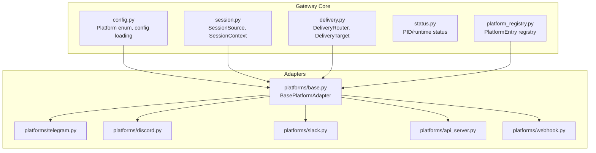

**Diagram sources**
- [gateway/config.py:100-199](file://gateway/config.py#L100-L199)
- [gateway/session.py:70-200](file://gateway/session.py#L70-L200)
- [gateway/delivery.py:28-170](file://gateway/delivery.py#L28-L170)
- [gateway/status.py:44-120](file://gateway/status.py#L44-L120)
- [gateway/platform_registry.py:162-200](file://gateway/platform_registry.py#L162-L200)
- [gateway/platforms/base.py:1-120](file://gateway/platforms/base.py#L1-L120)
- [gateway/platforms/telegram.py:1-120](file://gateway/platforms/telegram.py#L1-L120)
- [gateway/platforms/discord.py:1-120](file://gateway/platforms/discord.py#L1-L120)
- [gateway/platforms/slack.py:1-120](file://gateway/platforms/slack.py#L1-L120)
- [gateway/platforms/api_server.py:1-120](file://gateway/platforms/api_server.py#L1-L120)
- [gateway/platforms/webhook.py:98-140](file://gateway/platforms/webhook.py#L98-L140)

**Section sources**
- [README.md:82-99](file://README.md#L82-L99)
- [gateway/__init__.py:12-35](file://gateway/__init__.py#L12-L35)

## Core Components
- Platform adapter interface: BasePlatformAdapter defines the contract for receiving, processing, and sending messages across platforms.
- Session management: SessionSource and SessionContext track origin, context, and routing metadata for dynamic system prompts and delivery.
- Delivery routing: DeliveryRouter resolves targets (explicit, home channel, origin, local) and dispatches to adapters or local storage.
- Configuration: Platform enum and configuration loading unify platform settings and environment overrides.
- Status monitoring: PID and runtime status files enable external checks and lifecycle management.
- Platform registry: PlatformRegistry enables plugin-based adapters to self-register and integrate seamlessly.

**Section sources**
- [gateway/platforms/base.py:1-120](file://gateway/platforms/base.py#L1-L120)
- [gateway/session.py:70-200](file://gateway/session.py#L70-L200)
- [gateway/delivery.py:28-170](file://gateway/delivery.py#L28-L170)
- [gateway/config.py:100-199](file://gateway/config.py#L100-L199)
- [gateway/status.py:44-120](file://gateway/status.py#L44-L120)
- [gateway/platform_registry.py:162-200](file://gateway/platform_registry.py#L162-L200)

## Architecture Overview
The gateway composes platform adapters around a central runtime:
- Adapters implement BasePlatformAdapter and integrate via PlatformRegistry.
- SessionSource and SessionContext inform the agent’s dynamic system prompt and routing.
- DeliveryRouter selects destinations and invokes adapters or writes local files.
- Status helpers manage PID and runtime state for CLI and external probes.

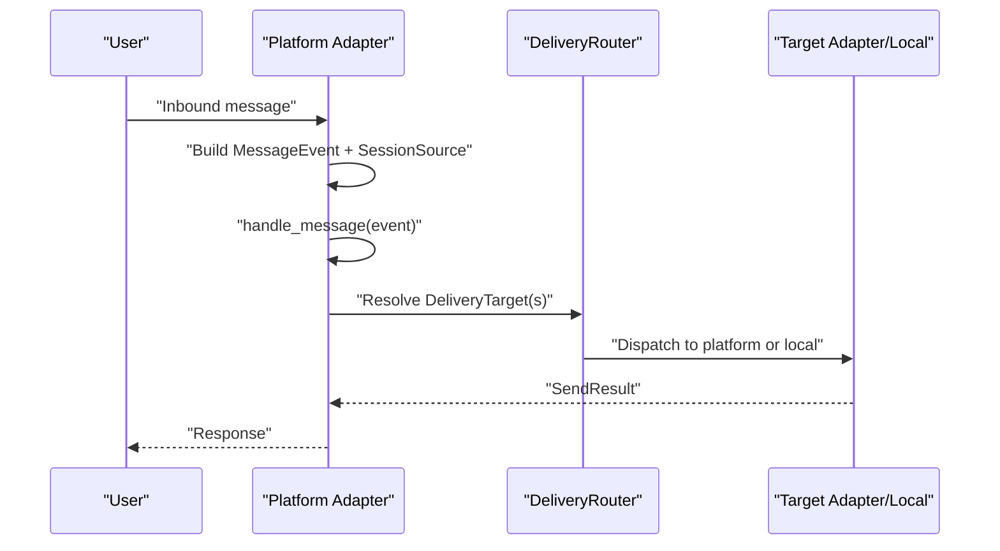

**Diagram sources**
- [gateway/platforms/base.py:1-120](file://gateway/platforms/base.py#L1-L120)
- [gateway/delivery.py:109-170](file://gateway/delivery.py#L109-L170)

## Detailed Component Analysis

### Base Platform Adapter Interface
- Responsibilities: connect/disconnect, send text/media, typing indicators, chat info lookup, and event dispatch.
- Utilities: media caching, UTF-16 length handling, proxy resolution, SSRF protections, thread metadata helpers, and platform-aware message truncation.
- Extensibility: subclasses implement platform-specific logic while sharing common helpers.

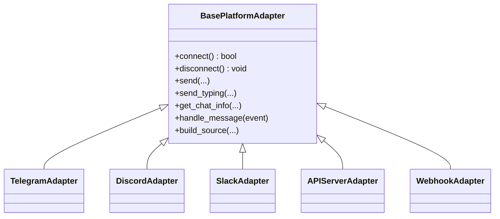

**Diagram sources**
- [gateway/platforms/base.py:1-120](file://gateway/platforms/base.py#L1-L120)
- [gateway/platforms/telegram.py:105-158](file://gateway/platforms/telegram.py#L105-L158)
- [gateway/platforms/discord.py:88-114](file://gateway/platforms/discord.py#L88-L114)
- [gateway/platforms/slack.py:75-99](file://gateway/platforms/slack.py#L75-L99)
- [gateway/platforms/api_server.py:315-320](file://gateway/platforms/api_server.py#L315-L320)
- [gateway/platforms/webhook.py:98-110](file://gateway/platforms/webhook.py#L98-L110)

**Section sources**
- [gateway/platforms/base.py:1-120](file://gateway/platforms/base.py#L1-L120)

### Telegram Adapter
- Uses python-telegram-bot to receive and send messages, handle media, and manage threads.
- Features:
  - MarkdownV2 escaping and sanitization
  - Media caching for images, audio, and videos
  - Telegram-specific message length handling (UTF-16 code units)
  - Fallback transport and IP discovery for network resilience
- Authentication: token-based via environment variables and lazy dependency loading.

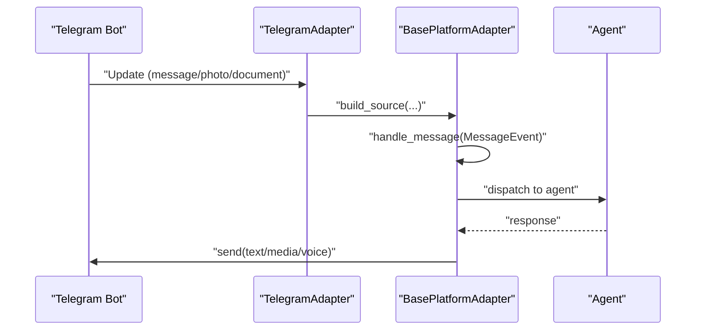

**Diagram sources**
- [gateway/platforms/telegram.py:105-158](file://gateway/platforms/telegram.py#L105-L158)
- [gateway/platforms/base.py:1-120](file://gateway/platforms/base.py#L1-L120)

**Section sources**
- [gateway/platforms/telegram.py:1-120](file://gateway/platforms/telegram.py#L1-L120)

### Discord Adapter
- Uses discord.py to receive messages, manage threads, and handle voice audio capture.
- Features:
  - Allowed mentions policy to prevent unwanted pings
  - Voice receiver for capturing and decoding Opus audio
  - Deduplication and thread participation tracking
- Authentication: token-based via environment variables and lazy dependency loading.

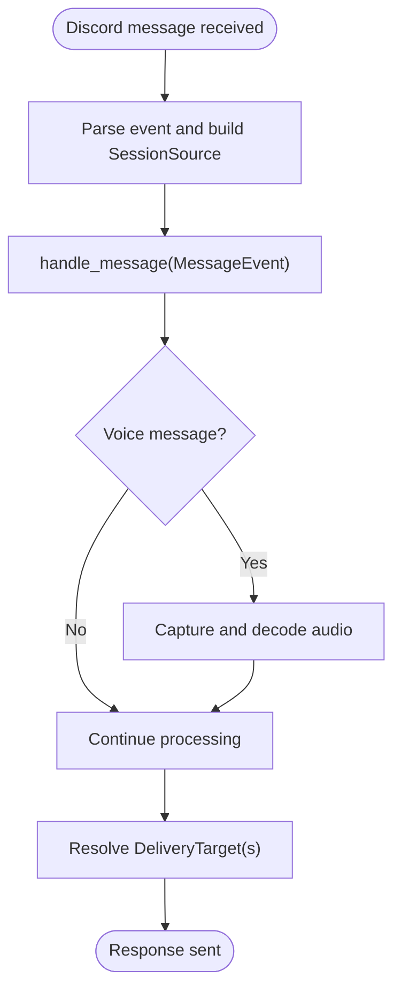

**Diagram sources**
- [gateway/platforms/discord.py:88-114](file://gateway/platforms/discord.py#L88-L114)
- [gateway/platforms/base.py:1-120](file://gateway/platforms/base.py#L1-L120)

**Section sources**
- [gateway/platforms/discord.py:1-120](file://gateway/platforms/discord.py#L1-L120)

### Slack Adapter
- Uses slack-bolt with Socket Mode to receive messages and slash commands.
- Features:
  - ContextVar to track slash command invokers for correct response routing
  - Rich text extraction and serialization for agent consumption
  - Thread context caching and deduplication
- Authentication: app-level token and signing secret via environment variables and lazy dependency loading.

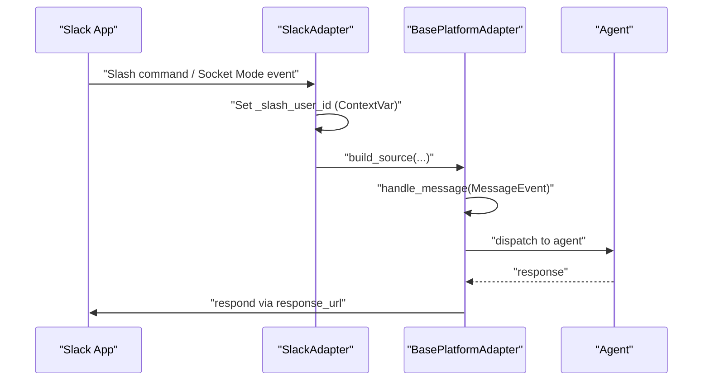

**Diagram sources**
- [gateway/platforms/slack.py:61-99](file://gateway/platforms/slack.py#L61-L99)
- [gateway/platforms/base.py:1-120](file://gateway/platforms/base.py#L1-L120)

**Section sources**
- [gateway/platforms/slack.py:1-120](file://gateway/platforms/slack.py#L1-L120)

### API Server Adapter (OpenAI-Compatible)
- Exposes an HTTP server with OpenAI-compatible endpoints:
  - POST /v1/chat/completions (stateless; optional session continuity via headers)
  - POST /v1/responses (stateful via previous_response_id)
  - GET /v1/responses/{response_id}, DELETE /v1/responses/{response_id}
  - GET /v1/models, GET /v1/capabilities
  - POST /v1/runs, GET /v1/runs/{run_id}, GET /v1/runs/{run_id}/events (SSE)
  - POST /v1/runs/{run_id}/approval, POST /v1/runs/{run_id}/stop
  - GET /health, GET /health/detailed
- Security:
  - Optional Bearer token auth
  - CORS middleware and security headers
  - Body size limits and idempotency cache
- Session continuity:
  - Optional X-Hermes-Session-Id and X-Hermes-Session-Key headers
  - Responses API persists conversation history for stateful runs

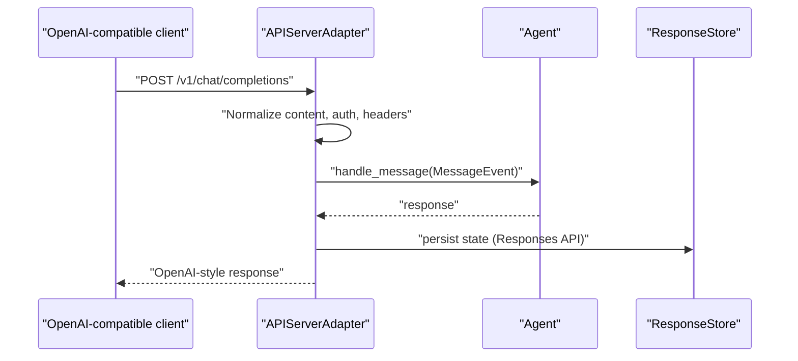

**Diagram sources**
- [gateway/platforms/api_server.py:315-320](file://gateway/platforms/api_server.py#L315-L320)
- [gateway/platforms/api_server.py:497-533](file://gateway/platforms/api_server.py#L497-L533)
- [gateway/platforms/api_server.py:631-763](file://gateway/platforms/api_server.py#L631-L763)

**Section sources**
- [gateway/platforms/api_server.py:1-120](file://gateway/platforms/api_server.py#L1-L120)

### Webhook Adapter
- Receives HTTP POSTs from external services (GitHub, GitLab, JIRA, Stripe, etc.).
- Features:
  - HMAC signature validation (GitHub, GitLab, generic)
  - Route-based configuration with events filtering, prompt templating, and skills injection
  - Rate limiting (per-minute fixed window), idempotency cache, and body size limits
  - Direct delivery mode (deliver_only) for push notifications without agent invocation
  - Cross-platform delivery to any registered platform
- Security:
  - Secret per route (required) or global secret
  - INSECURE_NO_AUTH mode allowed only on loopback hosts
  - SSRF protection and safe URL logging

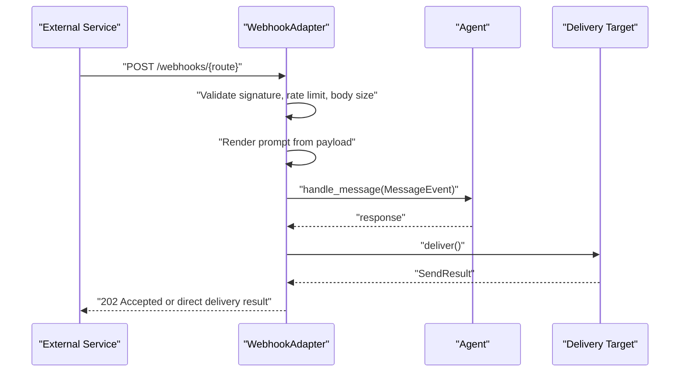

**Diagram sources**
- [gateway/platforms/webhook.py:98-140](file://gateway/platforms/webhook.py#L98-L140)
- [gateway/platforms/webhook.py:326-584](file://gateway/platforms/webhook.py#L326-L584)
- [gateway/platforms/webhook.py:589-620](file://gateway/platforms/webhook.py#L589-L620)

**Section sources**
- [gateway/platforms/webhook.py:1-120](file://gateway/platforms/webhook.py#L1-L120)

### Session Management
- SessionSource captures origin metadata (platform, chat_id, user_id, thread_id, guild_id, etc.).
- SessionContext augments with connected platforms and home channels for dynamic system prompt injection.
- PII redaction helpers and hashing for privacy.

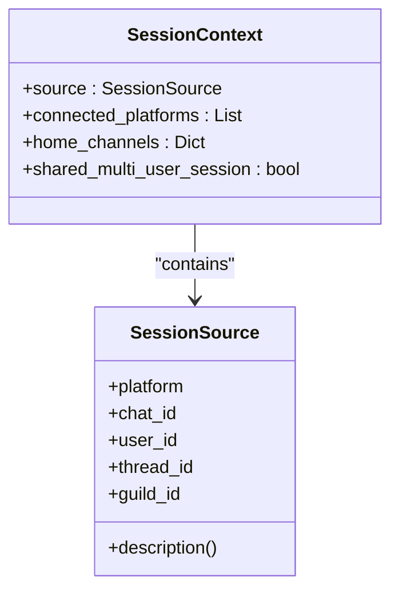

**Diagram sources**
- [gateway/session.py:70-200](file://gateway/session.py#L70-L200)

**Section sources**
- [gateway/session.py:70-200](file://gateway/session.py#L70-L200)

### Delivery Mechanisms
- DeliveryTarget supports:
  - "origin" (back to source)
  - "local" (save to files)
  - "platform" (home channel)
  - "platform:chat_id" (specific chat)
  - "platform:chat_id:thread_id" (threaded delivery)
- DeliveryRouter resolves targets and dispatches to adapters or local storage.

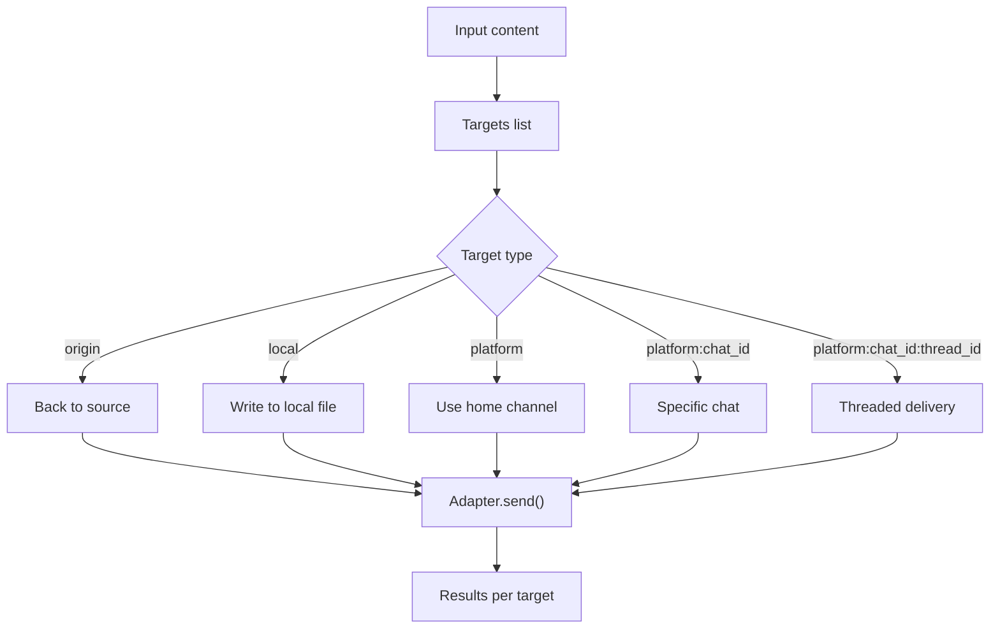

**Diagram sources**
- [gateway/delivery.py:28-170](file://gateway/delivery.py#L28-L170)

**Section sources**
- [gateway/delivery.py:28-170](file://gateway/delivery.py#L28-L170)

### Status Monitoring APIs
- PID-file based detection and runtime status persistence.
- Locking primitives for exclusive access and cross-process coordination.
- Termination helpers with platform-appropriate signals.

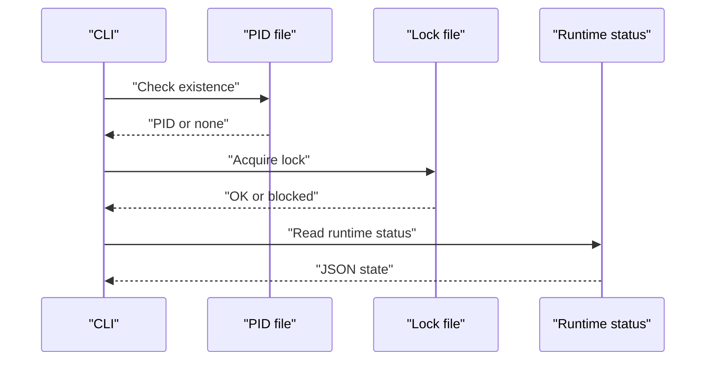

**Diagram sources**
- [gateway/status.py:44-120](file://gateway/status.py#L44-L120)

**Section sources**
- [gateway/status.py:44-120](file://gateway/status.py#L44-L120)

### Platform Registry and Custom Adapters
- PlatformRegistry stores PlatformEntry metadata and factories for plugin adapters.
- Built-in adapters continue to use legacy instantiation paths.
- Developer guide for adding new platforms (plugin or built-in) including hooks and integration points.

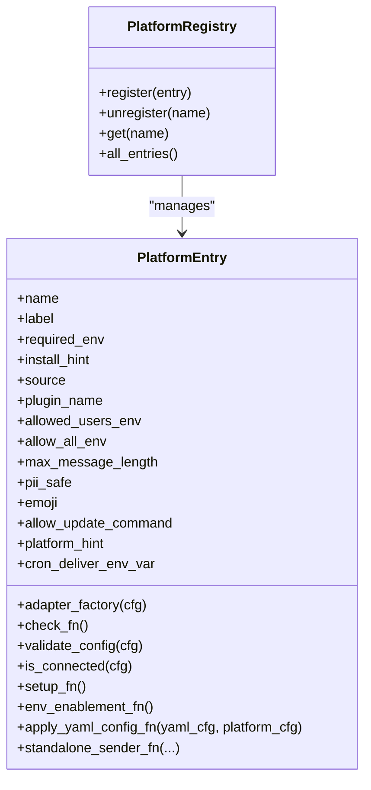

**Diagram sources**
- [gateway/platform_registry.py:162-200](file://gateway/platform_registry.py#L162-L200)

**Section sources**
- [gateway/platform_registry.py:162-200](file://gateway/platform_registry.py#L162-L200)
- [gateway/platforms/ADDING_A_PLATFORM.md:1-120](file://gateway/platforms/ADDING_A_PLATFORM.md#L1-L120)

## Dependency Analysis
- Coupling:
  - Adapters depend on BasePlatformAdapter and share utilities for caching, proxy resolution, and safety checks.
  - DeliveryRouter depends on Platform enum and adapter instances.
  - Status helpers depend on runtime state and locking primitives.
- Cohesion:
  - Each adapter encapsulates platform-specific logic while adhering to a common interface.
  - Configuration and registry provide centralized discovery and validation for platform adapters.
- External dependencies:
  - Platform SDKs (e.g., python-telegram-bot, discord.py, slack-bolt) are lazily loaded and validated.
  - HTTP servers (aiohttp) are used for API server and webhook endpoints.

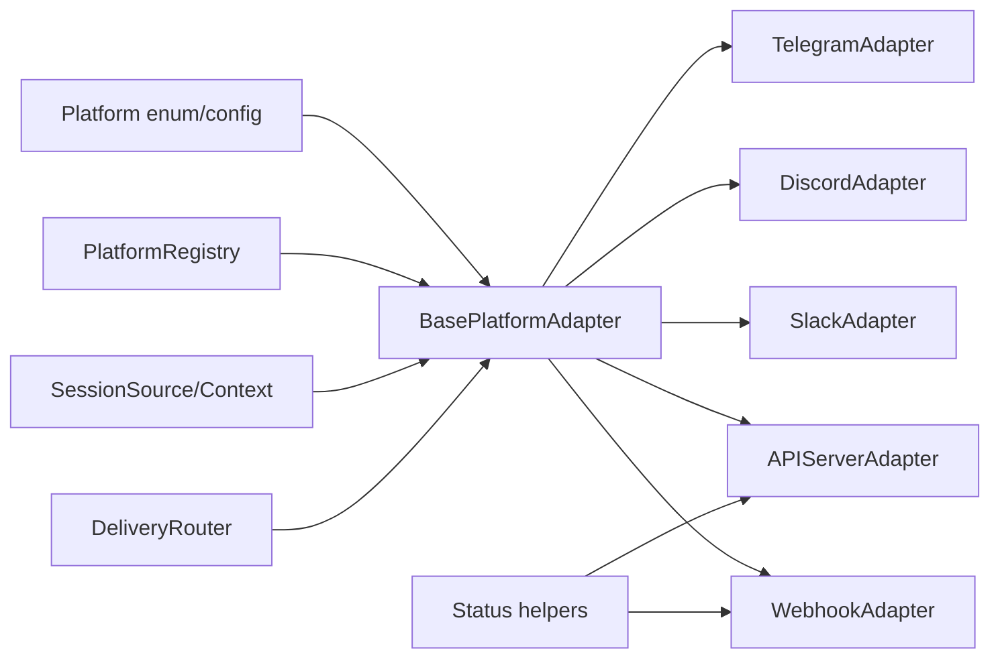

**Diagram sources**
- [gateway/platforms/base.py:1-120](file://gateway/platforms/base.py#L1-L120)
- [gateway/config.py:100-199](file://gateway/config.py#L100-L199)
- [gateway/platform_registry.py:162-200](file://gateway/platform_registry.py#L162-L200)
- [gateway/session.py:70-200](file://gateway/session.py#L70-L200)
- [gateway/delivery.py:109-170](file://gateway/delivery.py#L109-L170)
- [gateway/status.py:44-120](file://gateway/status.py#L44-L120)

**Section sources**
- [gateway/platforms/base.py:1-120](file://gateway/platforms/base.py#L1-L120)
- [gateway/config.py:100-199](file://gateway/config.py#L100-L199)
- [gateway/platform_registry.py:162-200](file://gateway/platform_registry.py#L162-L200)
- [gateway/session.py:70-200](file://gateway/session.py#L70-L200)
- [gateway/delivery.py:109-170](file://gateway/delivery.py#L109-L170)
- [gateway/status.py:44-120](file://gateway/status.py#L44-L120)

## Performance Considerations
- Media caching: Images, audio, and videos are cached locally to avoid platform URL expiration and reduce latency for vision and STT tools.
- Idempotency and rate limiting: Webhook adapter implements per-route rate limiting and idempotency caches to handle retries and protect downstream systems.
- Streaming and SSE: API server provides SSE for run lifecycle events with keepalive intervals.
- Proxy and network safety: Proxy resolution and SSRF guards minimize network overhead and security risks.
- Message truncation: Platform-aware truncation (e.g., Telegram UTF-16 limits) reduces unnecessary retries and payload sizes.

[No sources needed since this section provides general guidance]

## Troubleshooting Guide
- Health checks:
  - API server: GET /health and GET /health/detailed
  - Webhook server: GET /health
- Status and PID:
  - Verify gateway PID file and runtime status for process presence and metadata.
- Logs and secrets:
  - Secure secret entry is not supported over messaging; load in CLI or add keys to environment.
- Network and proxies:
  - Use proxy resolution helpers and NO_PROXY entries to control outbound traffic.
- Platform-specific:
  - Telegram: UTF-16 length limits and media format constraints.
  - Discord: Allowed mentions and voice packet decryption.
  - Slack: Slash command response routing via response_url and thread context.

**Section sources**
- [gateway/platforms/api_server.py:315-320](file://gateway/platforms/api_server.py#L315-L320)
- [gateway/platforms/webhook.py:98-140](file://gateway/platforms/webhook.py#L98-L140)
- [gateway/status.py:44-120](file://gateway/status.py#L44-L120)
- [gateway/platforms/telegram.py:1-120](file://gateway/platforms/telegram.py#L1-L120)
- [gateway/platforms/discord.py:1-120](file://gateway/platforms/discord.py#L1-L120)
- [gateway/platforms/slack.py:1-120](file://gateway/platforms/slack.py#L1-L120)

## Conclusion
The Hermes Gateway Integration API provides a robust, extensible framework for connecting the agent to multiple messaging platforms. Through a unified adapter interface, session-aware routing, and delivery mechanisms, it supports both interactive and automated workflows. Built-in adapters for Telegram, Discord, Slack, and others, along with the API server and webhook receiver, cover a wide range of integration scenarios. The platform registry and developer guide simplify adding custom adapters, ensuring consistent behavior and strong security practices.

[No sources needed since this section summarizes without analyzing specific files]

## Appendices

### Platform Adapter Interfaces and Authentication
- BasePlatformAdapter: connect/disconnect, send, typing, chat info, event handling.
- Telegram: token-based, lazy SDK loading, UTF-16 limits, media caching.
- Discord: token-based, allowed mentions, voice capture, deduplication.
- Slack: Socket Mode, response_url routing, rich text extraction.
- API Server: Bearer auth, CORS, SSE, body limits, idempotency cache.
- Webhook: HMAC validation, route-based config, rate limiting, idempotency, direct delivery.

**Section sources**
- [gateway/platforms/base.py:1-120](file://gateway/platforms/base.py#L1-L120)
- [gateway/platforms/telegram.py:105-158](file://gateway/platforms/telegram.py#L105-L158)
- [gateway/platforms/discord.py:88-114](file://gateway/platforms/discord.py#L88-L114)
- [gateway/platforms/slack.py:75-99](file://gateway/platforms/slack.py#L75-L99)
- [gateway/platforms/api_server.py:497-533](file://gateway/platforms/api_server.py#L497-L533)
- [gateway/platforms/webhook.py:589-620](file://gateway/platforms/webhook.py#L589-L620)

### Message Routing and Delivery Targets
- DeliveryTarget supports origin, local, platform home channel, and explicit chat/thread targets.
- DeliveryRouter resolves targets and dispatches to adapters or local storage.

**Section sources**
- [gateway/delivery.py:28-170](file://gateway/delivery.py#L28-L170)

### Session Management and Dynamic Context
- SessionSource and SessionContext provide origin metadata and dynamic system prompt injection.

**Section sources**
- [gateway/session.py:70-200](file://gateway/session.py#L70-L200)

### Status Monitoring and Lifecycle
- PID file, runtime status, and locking primitives for process and resource management.

**Section sources**
- [gateway/status.py:44-120](file://gateway/status.py#L44-L120)

### Custom Platform Adapter Development
- Plugin path: self-register via PlatformRegistry and use hooks for env/yaml bridging, cron delivery, and standalone sender.
- Built-in path: integrate into adapter factory, authorization maps, session source, system prompt hints, toolsets, cron delivery, send message tool routing, channel directory, status display, setup wizard, and documentation.

**Section sources**
- [gateway/platform_registry.py:162-200](file://gateway/platform_registry.py#L162-L200)
- [gateway/platforms/ADDING_A_PLATFORM.md:1-120](file://gateway/platforms/ADDING_A_PLATFORM.md#L1-L120)
- [gateway/platforms/ADDING_A_PLATFORM.md:120-240](file://gateway/platforms/ADDING_A_PLATFORM.md#L120-L240)
- [gateway/platforms/ADDING_A_PLATFORM.md:240-375](file://gateway/platforms/ADDING_A_PLATFORM.md#L240-L375)