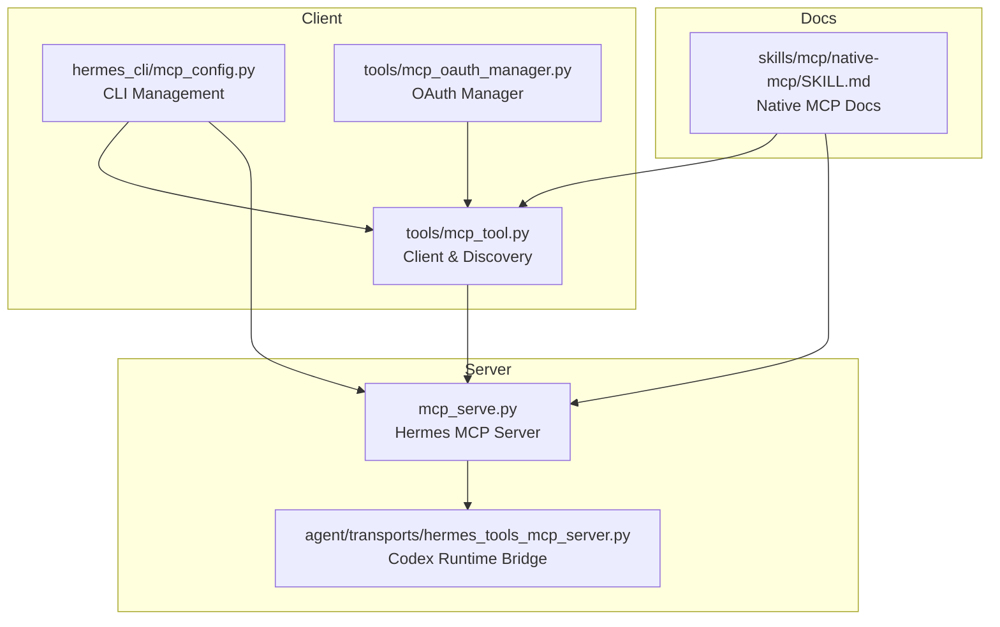
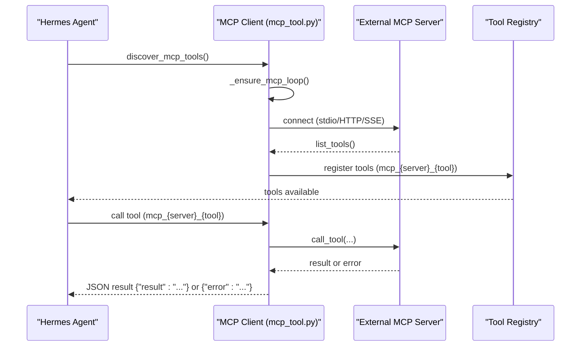
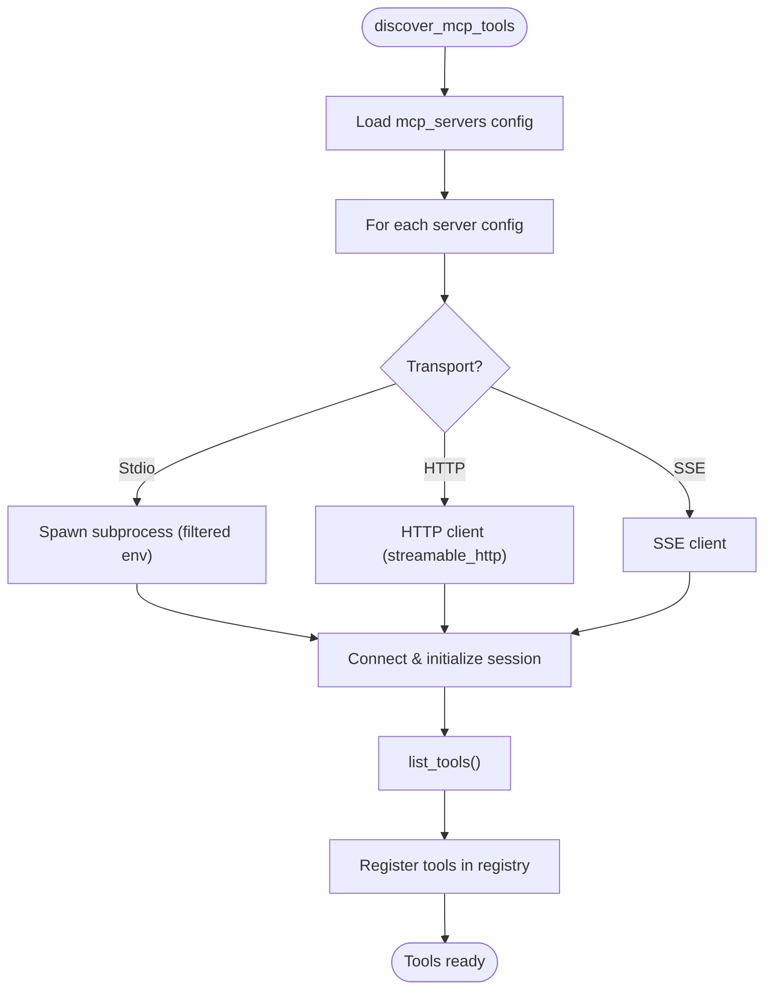
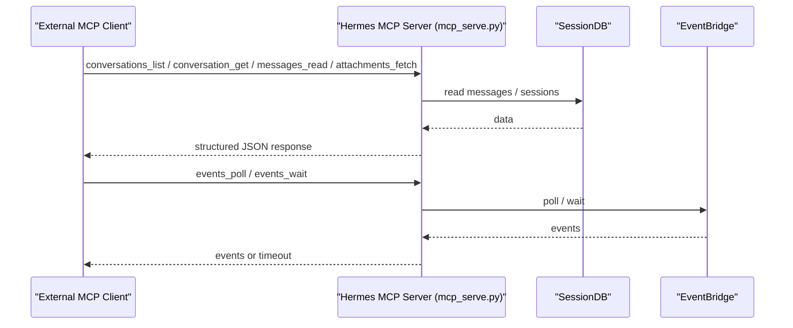
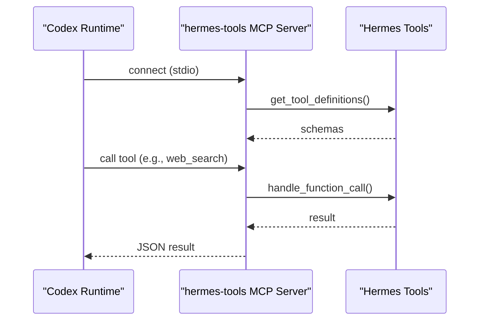
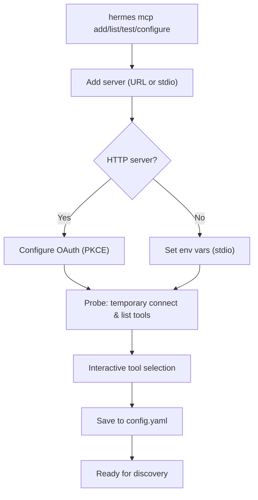
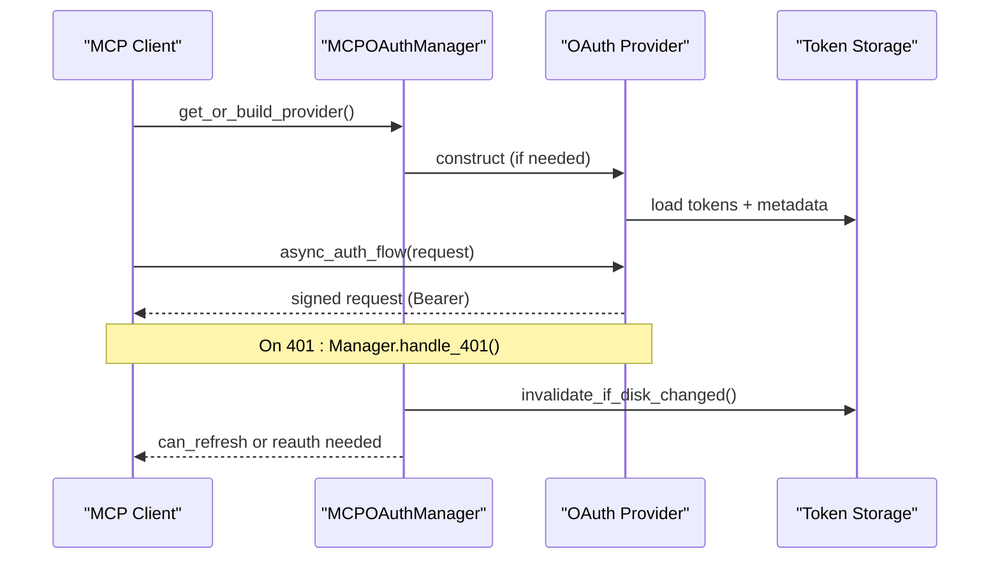
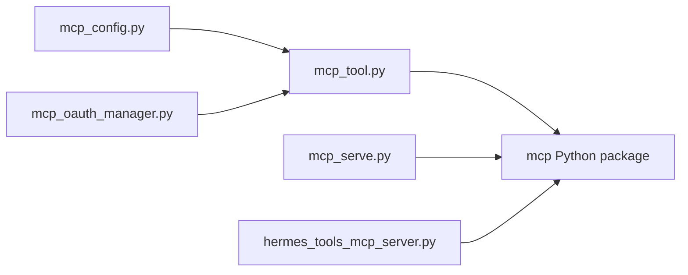

# MCP Protocol API

<cite>
**Referenced Files in This Document**
- [mcp_tool.py](file://tools/mcp_tool.py)
- [mcp_config.py](file://hermes_cli/mcp_config.py)
- [mcp_serve.py](file://mcp_serve.py)
- [hermes_tools_mcp_server.py](file://agent/transports/hermes_tools_mcp_server.py)
- [mcp_oauth_manager.py](file://tools/mcp_oauth_manager.py)
- [SKILL.md](file://skills/mcp/native-mcp/SKILL.md)
</cite>

## Table of Contents
1. [Introduction](#introduction)
2. [Project Structure](#project-structure)
3. [Core Components](#core-components)
4. [Architecture Overview](#architecture-overview)
5. [Detailed Component Analysis](#detailed-component-analysis)
6. [Dependency Analysis](#dependency-analysis)
7. [Performance Considerations](#performance-considerations)
8. [Troubleshooting Guide](#troubleshooting-guide)
9. [Conclusion](#conclusion)
10. [Appendices](#appendices)

## Introduction
This document describes the Model Context Protocol (MCP) API implementation in Hermes Agent. It covers MCP server setup and client configuration, protocol specifications, tool discovery and execution, result handling, authentication and security, error handling, and practical examples for integrating external tools and services. It also documents MCP server lifecycle, connection management, and performance optimization strategies.

## Project Structure
The MCP implementation spans several modules:
- Client-side tool integration and discovery
- Server-side MCP server exposing Hermes tools
- CLI management for MCP servers
- OAuth integration for secure authentication
- Documentation for native MCP client usage

**Diagram sources**
- [mcp_tool.py](file://tools/mcp_tool.py)
- [mcp_config.py](file://hermes_cli/mcp_config.py)
- [mcp_serve.py](file://mcp_serve.py)
- [hermes_tools_mcp_server.py](file://agent/transports/hermes_tools_mcp_server.py)
- [mcp_oauth_manager.py](file://tools/mcp_oauth_manager.py)
- [SKILL.md](file://skills/mcp/native-mcp/SKILL.md)

**Section sources**
- [mcp_tool.py](file://tools/mcp_tool.py)
- [mcp_config.py](file://hermes_cli/mcp_config.py)
- [mcp_serve.py](file://mcp_serve.py)
- [hermes_tools_mcp_server.py](file://agent/transports/hermes_tools_mcp_server.py)
- [mcp_oauth_manager.py](file://tools/mcp_oauth_manager.py)
- [SKILL.md](file://skills/mcp/native-mcp/SKILL.md)

## Core Components
- MCP Client: Connects to external MCP servers, discovers tools, and registers them into the Hermes tool registry. Supports stdio, HTTP/StreamableHTTP, and SSE transports. Includes sampling (server-initiated LLM requests), parallel tool calls, and robust reconnection.
- MCP Server (Hermes): Exposes Hermes messaging and tool capabilities as an MCP server for external clients (e.g., Claude Desktop, Cursor, Codex).
- MCP Server (Codex Runtime Bridge): Bridges a curated subset of Hermes tools into the Codex runtime via stdio MCP.
- CLI Management: Adds, lists, tests, configures, and removes MCP servers; supports OAuth configuration and environment variable interpolation.
- OAuth Manager: Centralized OAuth provider management with disk-watch, 401 deduplication, and reconnect signaling.

**Section sources**
- [mcp_tool.py](file://tools/mcp_tool.py)
- [mcp_serve.py](file://mcp_serve.py)
- [hermes_tools_mcp_server.py](file://agent/transports/hermes_tools_mcp_server.py)
- [mcp_config.py](file://hermes_cli/mcp_config.py)
- [mcp_oauth_manager.py](file://tools/mcp_oauth_manager.py)

## Architecture Overview
The MCP architecture consists of:
- A dedicated background event loop and thread for MCP operations
- Long-lived server tasks per MCP server
- Client-side tool registration and dynamic discovery
- Optional server-initiated sampling via sampling/createMessage
- Secure authentication via OAuth 2.1 PKCE with centralized token management

**Diagram sources**
- [mcp_tool.py](file://tools/mcp_tool.py)

**Section sources**
- [mcp_tool.py](file://tools/mcp_tool.py)

## Detailed Component Analysis

### MCP Client: Setup, Discovery, Execution, and Results
- Transport types:
  - Stdio: Launches a subprocess with filtered environment variables and optional explicit env overrides.
  - HTTP/StreamableHTTP: Requires mcp.client.streamable_http support.
  - SSE: Alternative transport for servers using Server-Sent Events.
- Discovery and registration:
  - Calls list_tools() on each server and registers tools with the naming convention mcp_{server}_{tool}.
  - Tool schemas are normalized and validated; references are rewritten to align with JSON Schema draft 2020-12.
- Execution:
  - Tool calls are executed on the MCP event loop; results are returned as JSON with either a result or error field.
- Sampling:
  - Optional server-initiated LLM requests via sampling/createMessage with configurable model, token caps, rate limits, and tool loop limits.
- Resilience:
  - Initial connection retries with exponential backoff; reconnect on loss with bounded retries; keepalive to prevent idle disconnections.

**Diagram sources**
- [mcp_tool.py](file://tools/mcp_tool.py)

**Section sources**
- [mcp_tool.py](file://tools/mcp_tool.py)

### MCP Server: Exposing Hermes Tools
- The server exposes messaging and tool capabilities for external MCP clients.
- Tools include conversation listing, message retrieval, attachment fetching, event polling/waiting, sending messages, channel listing, and permission management.
- Uses FastMCP to define tools with proper schemas and descriptions.

**Diagram sources**
- [mcp_serve.py](file://mcp_serve.py)

**Section sources**
- [mcp_serve.py](file://mcp_serve.py)

### MCP Server Bridge for Codex Runtime
- Exposes a curated subset of Hermes tools to the Codex runtime via stdio MCP.
- Ensures stateless dispatch compatibility and logs exposed tool counts.

**Diagram sources**
- [hermes_tools_mcp_server.py](file://agent/transports/hermes_tools_mcp_server.py)

**Section sources**
- [hermes_tools_mcp_server.py](file://agent/transports/hermes_tools_mcp_server.py)

### CLI Management: Adding, Listing, Testing, and Configuring MCP Servers
- Adds servers with URL or stdio command; supports OAuth configuration for HTTP servers.
- Tests connectivity and lists discovered tools.
- Allows interactive tool selection and toggling tool inclusion/exclusion.
- Supports environment variable interpolation and masking for sensitive values.

**Diagram sources**
- [mcp_config.py](file://hermes_cli/mcp_config.py)

**Section sources**
- [mcp_config.py](file://hermes_cli/mcp_config.py)

### Authentication and Security
- OAuth 2.1 PKCE via centralized MCPOAuthManager:
  - Cross-process token reload via mtime-based disk watch
  - 401 deduplication across concurrent calls
  - Reconnect signaling for long-lived sessions
- Environment variable filtering for stdio servers:
  - Safe baseline variables plus explicit overrides
- Credential redaction in error messages:
  - Automatic stripping of tokens, keys, and secrets
- URL validation for HTTP servers:
  - Strict parsing and validation of remote MCP endpoints

**Diagram sources**
- [mcp_oauth_manager.py](file://tools/mcp_oauth_manager.py)
- [mcp_tool.py](file://tools/mcp_tool.py)

**Section sources**
- [mcp_oauth_manager.py](file://tools/mcp_oauth_manager.py)
- [mcp_tool.py](file://tools/mcp_tool.py)

### Tool Schemas, Parameter Validation, and Result Formatting
- Tool schemas are normalized and validated:
  - Ensures object schemas have properties
  - Rewrites $ref references to $defs for compatibility
  - Prunes required fields that do not correspond to existing properties
- Result formatting:
  - Tools return JSON with either a result or error field
  - Images from MCP are cached and rendered via MEDIA tags when applicable

**Section sources**
- [mcp_tool.py](file://tools/mcp_tool.py)

### Server Lifecycle, Connection Management, and Performance
- Lifecycle:
  - Each server runs as a long-lived asyncio Task in a background daemon thread
  - Connections persist for the lifetime of the agent process
  - Graceful shutdown signals tasks to exit cleanly
- Reconnection:
  - Initial connection retries with exponential backoff
  - Subsequent disconnects retry with bounded backoff
  - Keepalive via list_tools to prevent idle timeouts
- Performance:
  - Dedicated event loop and thread minimize overhead
  - Optional per-server parallel tool calls
  - Sampling rate limiting and token caps

**Section sources**
- [mcp_tool.py](file://tools/mcp_tool.py)

## Dependency Analysis
Key dependencies and relationships:
- tools/mcp_tool.py depends on the mcp Python package for client sessions and transports.
- hermes_cli/mcp_config.py orchestrates server lifecycle and configuration.
- tools/mcp_oauth_manager.py provides centralized OAuth handling.
- mcp_serve.py and agent/transports/hermes_tools_mcp_server.py define MCP servers.

**Diagram sources**
- [mcp_tool.py](file://tools/mcp_tool.py)
- [mcp_config.py](file://hermes_cli/mcp_config.py)
- [mcp_oauth_manager.py](file://tools/mcp_oauth_manager.py)
- [mcp_serve.py](file://mcp_serve.py)
- [hermes_tools_mcp_server.py](file://agent/transports/hermes_tools_mcp_server.py)

**Section sources**
- [mcp_tool.py](file://tools/mcp_tool.py)
- [mcp_config.py](file://hermes_cli/mcp_config.py)
- [mcp_oauth_manager.py](file://tools/mcp_oauth_manager.py)
- [mcp_serve.py](file://mcp_serve.py)
- [hermes_tools_mcp_server.py](file://agent/transports/hermes_tools_mcp_server.py)

## Performance Considerations
- Use per-server supports_parallel_tool_calls for servers that support concurrent tool execution.
- Tune sampling parameters (max_rpm, max_tokens_cap, max_tool_rounds) to balance throughput and stability.
- Prefer stdio for local servers to reduce network overhead; use HTTP/SSE for remote/shared servers.
- Monitor keepalive intervals to avoid idle timeouts on long-lived connections.

## Troubleshooting Guide
Common issues and resolutions:
- MCP SDK not available: Install the mcp package to enable client/server support.
- No servers configured: Ensure mcp_servers is present in config.yaml.
- Connection failures: Verify command availability, package installation, timeouts, and URL reachability.
- HTTP transport not available: Upgrade mcp to include streamable_http support.
- Tools not appearing: Confirm server name, YAML indentation, and tool prefix naming.
- Frequent reconnections: Check network connectivity and adjust retry/backoff settings.

**Section sources**
- [SKILL.md](file://skills/mcp/native-mcp/SKILL.md)

## Conclusion
Hermes Agent provides a robust, production-ready MCP implementation with strong security, resilient connectivity, and flexible transport options. The native MCP client integrates seamlessly with the agent’s tool ecosystem, while the MCP server exposes powerful capabilities to external clients. The CLI and OAuth manager streamline server lifecycle and secure authentication.

## Appendices

### MCP Client Configuration Reference
- mcp_servers entries support:
  - Stdio: command, args, env, timeout, connect_timeout
  - HTTP: url, headers, timeout, connect_timeout
  - SSE: transport: sse with url
  - Sampling: enabled, model, max_tokens_cap, timeout, max_rpm, allowed_models, max_tool_rounds, log_level
  - Parallel tool calls: supports_parallel_tool_calls

**Section sources**
- [SKILL.md](file://skills/mcp/native-mcp/SKILL.md)

### Example Workflows
- Add and test a stdio server (e.g., time server via uvx)
- Add and test an HTTP server (e.g., GitHub server via npx)
- Configure OAuth for HTTP servers
- Use the Hermes MCP server from external clients

**Section sources**
- [mcp_config.py](file://hermes_cli/mcp_config.py)
- [SKILL.md](file://skills/mcp/native-mcp/SKILL.md)