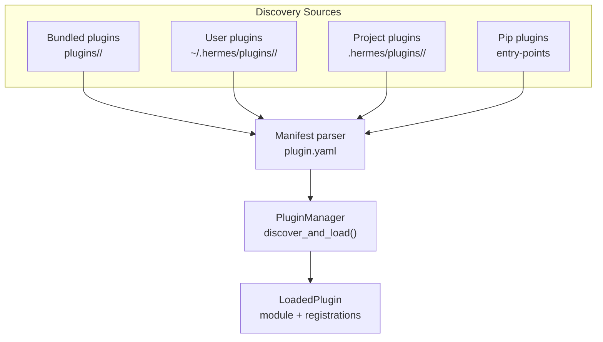
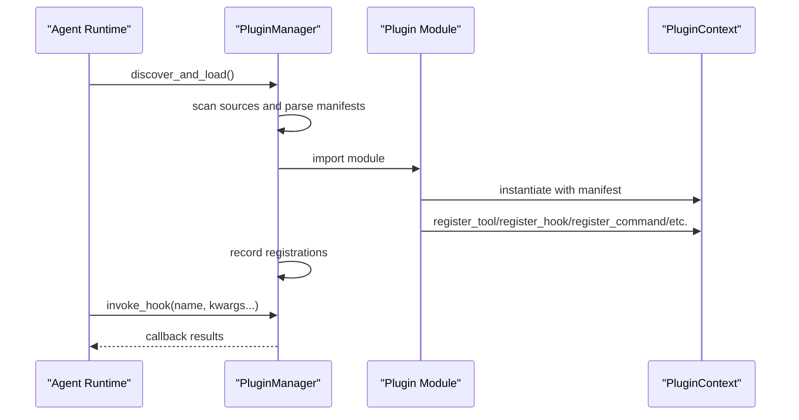
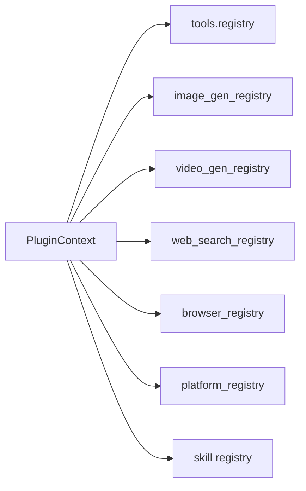

# Plugin Development API

<cite>
**Referenced Files in This Document**
- [plugins.py](file://hermes_cli/plugins.py)
- [plugin.yaml](file://plugins/disk-cleanup/plugin.yaml)
- [plugin.yaml](file://plugins/google_meet/plugin.yaml)
- [manifest.json](file://plugins/example-dashboard/dashboard/manifest.json)
- [plugin_api.py](file://plugins/example-dashboard/dashboard/plugin_api.py)
- [plugin.yaml](file://plugins/spotify/plugin.yaml)
- [plugin.yaml](file://plugins/observability/langfuse/plugin.yaml)
- [__init__.py](file://plugins/disk-cleanup/__init__.py)
- [__init__.py](file://plugins/google_meet/__init__.py)
- [__init__.py](file://plugins/spotify/__init__.py)
- [__init__.py](file://plugins/memory/holographic/__init__.py)
- [model_tools.py](file://model_tools.py)
- [test_plugins.py](file://tests/hermes_cli/test_plugins.py)
</cite>

## Table of Contents
1. [Introduction](#introduction)
2. [Project Structure](#project-structure)
3. [Core Components](#core-components)
4. [Architecture Overview](#architecture-overview)
5. [Detailed Component Analysis](#detailed-component-analysis)
6. [Dependency Analysis](#dependency-analysis)
7. [Performance Considerations](#performance-considerations)
8. [Troubleshooting Guide](#troubleshooting-guide)
9. [Conclusion](#conclusion)
10. [Appendices](#appendices)

## Introduction
This document describes the Hermes Agent plugin development API. It explains the plugin manifest schema, lifecycle hooks, and integration interfaces. It documents the PluginContext class, register_command, and plugin registration patterns. It covers plugin configuration options, dependency management, and security considerations. It includes examples ranging from simple tools to complex integrations, and provides guidelines for installation, discovery, management, testing, debugging, and distribution. Finally, it outlines architecture patterns, best practices, and common pitfalls.

## Project Structure
Hermes organizes plugins in several locations:
- Bundled plugins shipped with the repository under plugins/.
- User plugins under ~/.hermes/plugins/.
- Project plugins under ./hermes/plugins/ (opt-in via environment variable).
- Pip-installed plugins exposing the hermes_agent.plugins entry point.

Plugins are discovered by scanning directories and parsing plugin.yaml manifests. Some plugins are “standalone” (opt-in), others are “backend”, “platform”, or “model-provider” kinds with special discovery rules.

**Diagram sources**
- [plugins.py:790-956](file://hermes_cli/plugins.py#L790-L956)

**Section sources**
- [plugins.py:55-66](file://hermes_cli/plugins.py#L55-L66)
- [plugins.py:790-956](file://hermes_cli/plugins.py#L790-L956)

## Core Components
- PluginManifest: parsed representation of plugin.yaml.
- LoadedPlugin: runtime state for a loaded plugin.
- PluginContext: facade provided to plugins for registering tools, hooks, commands, providers, and skills.
- PluginManager: orchestrates discovery, loading, and invocation of plugins.

Key responsibilities:
- Manifest parsing and validation.
- Discovery across multiple sources with precedence rules.
- Registration of tools, hooks, slash commands, CLI commands, providers, and skills.
- Hook invocation at lifecycle points.
- Enabling/disabling via configuration.

**Section sources**
- [plugins.py:233-281](file://hermes_cli/plugins.py#L233-L281)
- [plugins.py:287-764](file://hermes_cli/plugins.py#L287-L764)
- [plugins.py:770-956](file://hermes_cli/plugins.py#L770-L956)

## Architecture Overview
The plugin system integrates with the agent runtime through lifecycle hooks and tool registries. Plugins can:
- Register tools that appear alongside built-in tools.
- Subscribe to lifecycle hooks to observe or transform behavior.
- Expose slash commands usable in CLI and gateway sessions.
- Register platform adapters, providers, and skills.

**Diagram sources**
- [plugins.py:790-956](file://hermes_cli/plugins.py#L790-L956)
- [plugins.py:287-764](file://hermes_cli/plugins.py#L287-L764)

## Detailed Component Analysis

### Plugin Manifest Schema
Manifests define plugin identity, metadata, and capabilities. Supported fields include:
- name, version, description, author
- kind: standalone, backend, exclusive, platform, model-provider
- provides_tools, hooks
- platforms (optional)
- requires_env (optional)
- key (optional registry key)

Examples:
- Standalone plugin manifest with hooks and provides_tools.
- Google Meet plugin manifest with kind: standalone and platform constraints.
- Dashboard plugin manifest with UI entry and API route definition.

**Section sources**
- [plugin.yaml:1-8](file://plugins/disk-cleanup/plugin.yaml#L1-L8)
- [plugin.yaml:1-17](file://plugins/google_meet/plugin.yaml#L1-L17)
- [manifest.json:1-15](file://plugins/example-dashboard/dashboard/manifest.json#L1-L15)

### Plugin Lifecycle Hooks
The system defines a set of valid hook names. Plugins register callbacks via PluginContext.register_hook. The agent invokes hooks at appropriate times (e.g., pre/post tool call, pre/post LLM call, session lifecycle, gateway dispatch, approval lifecycle).

Common hooks:
- pre_tool_call, post_tool_call
- transform_tool_result, transform_llm_output
- pre_llm_call, post_llm_call
- pre_api_request, post_api_request
- on_session_start, on_session_end, on_session_finalize, on_session_reset
- subagent_stop
- pre_gateway_dispatch
- pre_approval_request, post_approval_response

Hook invocation occurs centrally and forwards kwargs to callbacks.

**Section sources**
- [plugins.py:128-168](file://hermes_cli/plugins.py#L128-L168)
- [plugins.py:701-717](file://hermes_cli/plugins.py#L701-L717)
- [model_tools.py:746-854](file://model_tools.py#L746-L854)

### PluginContext API
PluginContext exposes registration methods to plugins. Highlights:
- register_tool: registers tools into the global registry and tracks plugin-provided names.
- register_command: registers slash commands for CLI and gateway sessions.
- register_cli_command: registers CLI subcommands.
- register_hook: registers lifecycle callbacks.
- register_platform: registers gateway platform adapters.
- register_context_engine, register_image_gen_provider, register_video_gen_provider, register_web_search_provider, register_browser_provider: register specialized providers.
- register_skill: registers read-only skills.
- dispatch_tool: dispatches tools with parent agent context.
- inject_message: injects messages into the active conversation.
- llm: access to host-owned LLM facade for trusted plugins.

Slash command registration:
- Normalizes names, rejects conflicts with built-in commands, supports args_hint for UI hints.

CLI command registration:
- Provides setup_fn and optional handler_fn for argparse wiring.

Provider registration:
- Validates types against expected provider ABCs and registers into category-specific registries.

Skills registration:
- Enforces naming rules and existence of skill files.

**Section sources**
- [plugins.py:287-764](file://hermes_cli/plugins.py#L287-L764)
- [test_plugins.py:1016-1070](file://tests/hermes_cli/test_plugins.py#L1016-L1070)

### Plugin Registration Patterns
Patterns demonstrated by existing plugins:
- Standalone tool plugin: registers tools and lifecycle hooks; exposes slash commands.
- Backend provider plugin: implements a provider interface and registers via PluginContext methods.
- Platform adapter plugin: registers platform entries with factories and checks.
- Dashboard plugin: exposes UI tab and API routes.

Examples:
- disk-cleanup: registers hooks and slash command; auto-tracks ephemeral files and cleans up on session end.
- google_meet: registers tools, CLI, and lifecycle hooks; validates platform support.
- spotify: registers tools gated by availability checks.
- memory holographic: implements a MemoryProvider and registers it.
- example-dashboard: defines UI manifest and FastAPI routes.

**Section sources**
- [__init__.py:309-317](file://plugins/disk-cleanup/__init__.py#L309-L317)
- [__init__.py:65-104](file://plugins/google_meet/__init__.py#L65-L104)
- [__init__.py:56-67](file://plugins/spotify/__init__.py#L56-L67)
- [__init__.py:404-409](file://plugins/memory/holographic/__init__.py#L404-L409)
- [plugin_api.py:9-18](file://plugins/example-dashboard/dashboard/plugin_api.py#L9-L18)
- [manifest.json:1-15](file://plugins/example-dashboard/dashboard/manifest.json#L1-L15)

### Plugin Configuration Options
Plugins can read configuration from the user’s config.yaml. Examples:
- Memory provider plugins read plugin-specific sections under plugins.<plugin-id>.
- Tools may gate availability based on credentials or environment checks.
- Providers may expose configurable schemas via provider.get_config_schema.

Best practices:
- Use cfg_get to safely read nested config.
- Provide defaults and validate inputs.
- Keep sensitive configuration out of manifests; rely on config files.

**Section sources**
- [__init__.py:97-108](file://plugins/memory/holographic/__init__.py#L97-L108)
- [__init__.py:148-156](file://plugins/memory/holographic/__init__.py#L148-L156)

### Dependency Management
Discovery and precedence:
- Sources scanned in order: bundled, user, project (opt-in), entry-points.
- Later sources override earlier ones on name collisions.
- Disabled/enabled lists control activation.
- Special kinds (exclusive, model-provider) are handled by category-specific discovery.

Environment controls:
- HERMES_PLUGINS_DEBUG enables verbose plugin logs.
- HERMES_ENABLE_PROJECT_PLUGINS toggles project plugin scanning.
- HERMES_BUNDLED_PLUGINS overrides bundled plugin directory.

**Section sources**
- [plugins.py:790-956](file://hermes_cli/plugins.py#L790-L956)
- [plugins.py:89-122](file://hermes_cli/plugins.py#L89-L122)
- [plugins.py:175-178](file://hermes_cli/plugins.py#L175-L178)

### Security Considerations
- Plugins run in-process; treat untrusted plugins with caution.
- Platform adapters and gateway integrations require explicit checks and validation.
- Provider registration gates on expected base classes.
- Slash command names are normalized and conflict-checked against built-ins.
- Host-owned LLM access is gated and configurable per plugin.

**Section sources**
- [plugins.py:437-464](file://hermes_cli/plugins.py#L437-L464)
- [plugins.py:645-697](file://hermes_cli/plugins.py#L645-L697)
- [plugins.py:531-554](file://hermes_cli/plugins.py#L531-L554)

### Examples of Plugin Development

#### Simple Tool Plugin (disk-cleanup)
- Registers hooks for post_tool_call and on_session_end.
- Adds a slash command for manual operations.
- Demonstrates auto-tracking and cleanup logic.

**Section sources**
- [plugin.yaml:1-8](file://plugins/disk-cleanup/plugin.yaml#L1-L8)
- [__init__.py:309-317](file://plugins/disk-cleanup/__init__.py#L309-L317)

#### Complex Integration (google_meet)
- Registers multiple tools with schemas and handlers.
- Implements CLI subcommands and lifecycle cleanup.
- Validates platform support before registering.

**Section sources**
- [plugin.yaml:1-17](file://plugins/google_meet/plugin.yaml#L1-L17)
- [__init__.py:65-104](file://plugins/google_meet/__init__.py#L65-L104)

#### Backend Provider (spotify)
- Registers tools gated by availability checks.
- Structured as a plugin for consistency with other integrations.

**Section sources**
- [plugin.yaml:1-23](file://plugins/spotify/plugin.yaml#L1-L23)
- [__init__.py:56-67](file://plugins/spotify/__init__.py#L56-L67)

#### Provider Implementation (memory holographic)
- Implements a MemoryProvider and registers it via PluginContext.
- Reads plugin-specific configuration and exposes a tool schema.

**Section sources**
- [__init__.py:404-409](file://plugins/memory/holographic/__init__.py#L404-L409)

#### Dashboard Plugin (example-dashboard)
- Defines a UI manifest and FastAPI routes mounted under /api/plugins/<name>.

**Section sources**
- [manifest.json:1-15](file://plugins/example-dashboard/dashboard/manifest.json#L1-L15)
- [plugin_api.py:9-18](file://plugins/example-dashboard/dashboard/plugin_api.py#L9-L18)

### Plugin Installation, Discovery, and Management APIs
Installation:
- Place plugin directories under ~/.hermes/plugins/<name>/ or ./hermes/plugins/<name>/ (project).
- Ensure plugin.yaml and __init__.py with register(ctx) exist.

Discovery:
- PluginManager.scan_directory locates manifests and parses them.
- Manifests are deduplicated by key/name; later sources override earlier ones.

Management:
- Enable/disable via configuration keys (plugins.enabled/plugins.disabled).
- Use environment variables to control discovery scope.

**Section sources**
- [plugins.py:790-956](file://hermes_cli/plugins.py#L790-L956)
- [plugins.py:180-224](file://hermes_cli/plugins.py#L180-L224)

### Testing, Debugging, and Distribution
Testing:
- Unit tests validate slash command registration behavior and normalization.
- Tests exercise PluginContext.register_command and related flows.

Debugging:
- Set HERMES_PLUGINS_DEBUG=1 to enable verbose plugin logs to stderr.
- Use targeted logging in plugin code.

Distribution:
- Pip plugins can expose the hermes_agent.plugins entry point group.
- Manifests define plugin identity and capabilities.

**Section sources**
- [test_plugins.py:1016-1070](file://tests/hermes_cli/test_plugins.py#L1016-L1070)
- [plugins.py:89-122](file://hermes_cli/plugins.py#L89-L122)
- [plugins.py:170](file://hermes_cli/plugins.py#L170)

## Dependency Analysis
PluginContext delegates to central registries and managers:
- Tools: delegated to tools.registry.
- Providers: registered into category-specific registries.
- Skills: registered into plugin skill registry.
- Platforms: registered into gateway platform registry.

**Diagram sources**
- [plugins.py:337-350](file://hermes_cli/plugins.py#L337-L350)
- [plugins.py:540-554](file://hermes_cli/plugins.py#L540-L554)
- [plugins.py:567-581](file://hermes_cli/plugins.py#L567-L581)
- [plugins.py:596-609](file://hermes_cli/plugins.py#L596-L609)
- [plugins.py:628-641](file://hermes_cli/plugins.py#L628-L641)
- [plugins.py:677-697](file://hermes_cli/plugins.py#L677-L697)

**Section sources**
- [plugins.py:287-764](file://hermes_cli/plugins.py#L287-L764)

## Performance Considerations
- Hook callbacks execute synchronously; avoid heavy blocking work.
- Provider implementations should minimize I/O and cache where appropriate.
- Tool dispatch and hook invocation are invoked frequently; keep handlers efficient.
- Prefer lazy initialization for expensive resources.

## Troubleshooting Guide
Common issues and remedies:
- Plugin not appearing:
  - Verify plugin.yaml exists and is parseable.
  - Confirm plugin is enabled in configuration or bundled/platform kind.
  - Check discovery logs with HERMES_PLUGINS_DEBUG=1.
- Conflicting slash command names:
  - Names are normalized and conflicts with built-ins are rejected.
- Hook not firing:
  - Ensure hook name is valid and registered.
  - Confirm the agent lifecycle stage triggers the hook.
- Provider registration failures:
  - Ensure the provider inherits from the expected base class.
- Platform adapter not available:
  - Validate platform support and required environment checks.

**Section sources**
- [plugins.py:437-464](file://hermes_cli/plugins.py#L437-L464)
- [plugins.py:128-168](file://hermes_cli/plugins.py#L128-L168)
- [plugins.py:531-554](file://hermes_cli/plugins.py#L531-L554)
- [plugins.py:645-697](file://hermes_cli/plugins.py#L645-L697)

## Conclusion
Hermes provides a robust, extensible plugin system enabling developers to integrate tools, providers, platforms, and UI extensions. By following the manifest schema, lifecycle hooks, and PluginContext APIs, you can build secure, maintainable plugins that integrate seamlessly with the agent runtime. Use the provided examples and testing patterns to ensure reliability and compatibility.

## Appendices

### Appendix A: Lifecycle Hook Reference
- pre_tool_call, post_tool_call
- transform_tool_result, transform_llm_output
- pre_llm_call, post_llm_call
- pre_api_request, post_api_request
- on_session_start, on_session_end, on_session_finalize, on_session_reset
- subagent_stop
- pre_gateway_dispatch
- pre_approval_request, post_approval_response

**Section sources**
- [plugins.py:128-168](file://hermes_cli/plugins.py#L128-L168)

### Appendix B: Provider Registration Interfaces
- register_image_gen_provider
- register_video_gen_provider
- register_web_search_provider
- register_browser_provider
- register_context_engine

**Section sources**
- [plugins.py:531-554](file://hermes_cli/plugins.py#L531-L554)
- [plugins.py:558-581](file://hermes_cli/plugins.py#L558-L581)
- [plugins.py:585-609](file://hermes_cli/plugins.py#L585-L609)
- [plugins.py:613-641](file://hermes_cli/plugins.py#L613-L641)
- [plugins.py:499-527](file://hermes_cli/plugins.py#L499-L527)