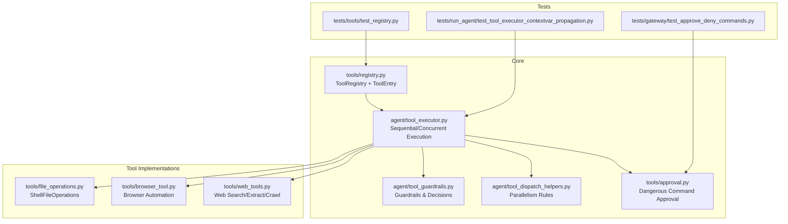
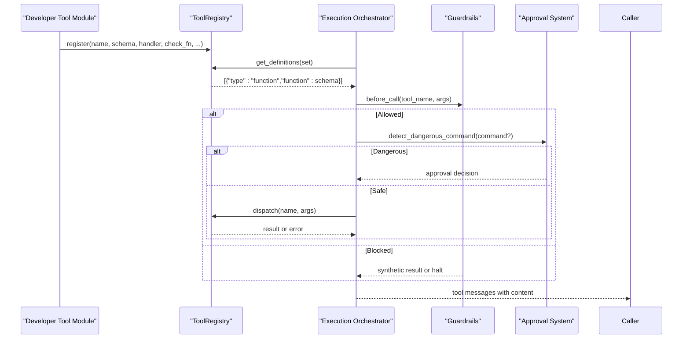
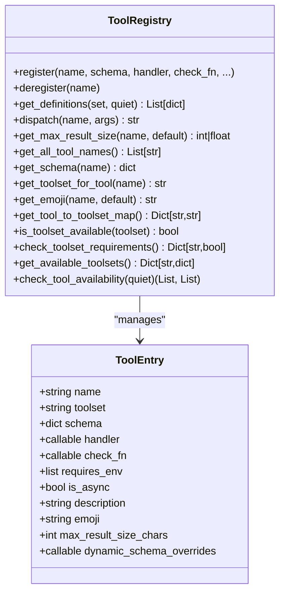
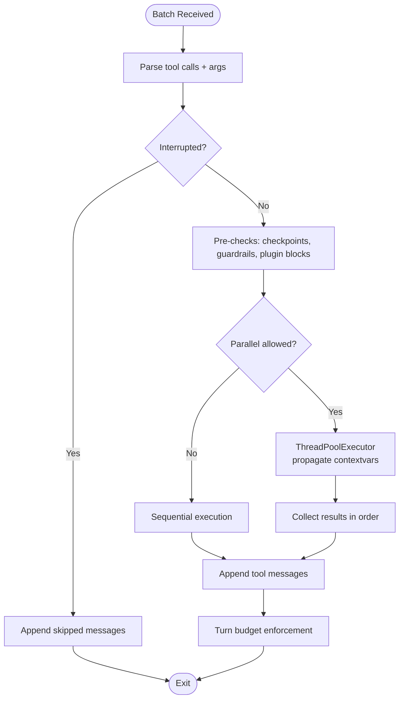
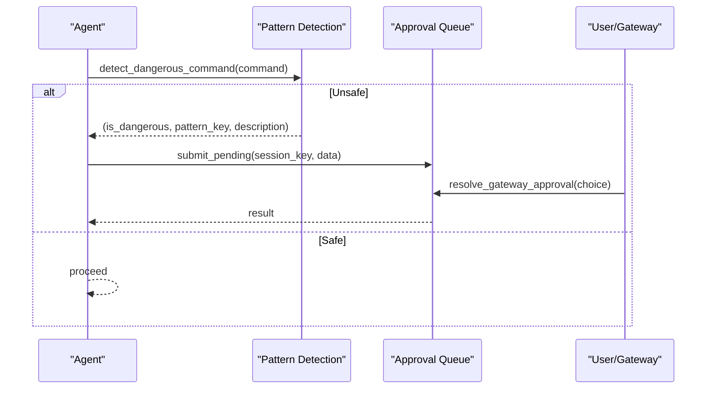
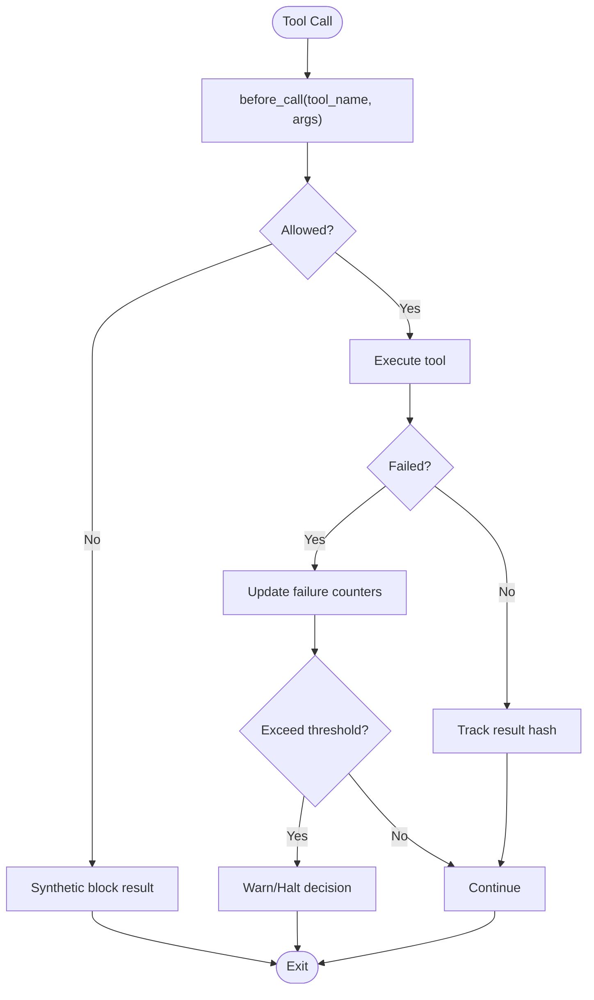
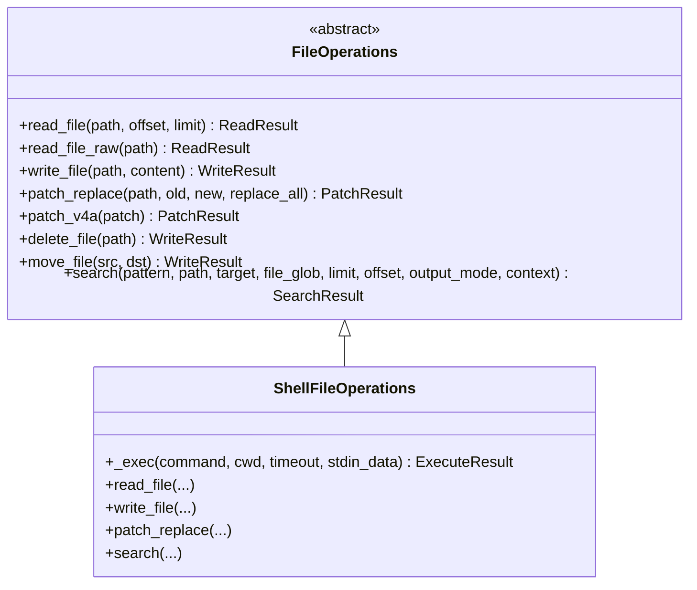
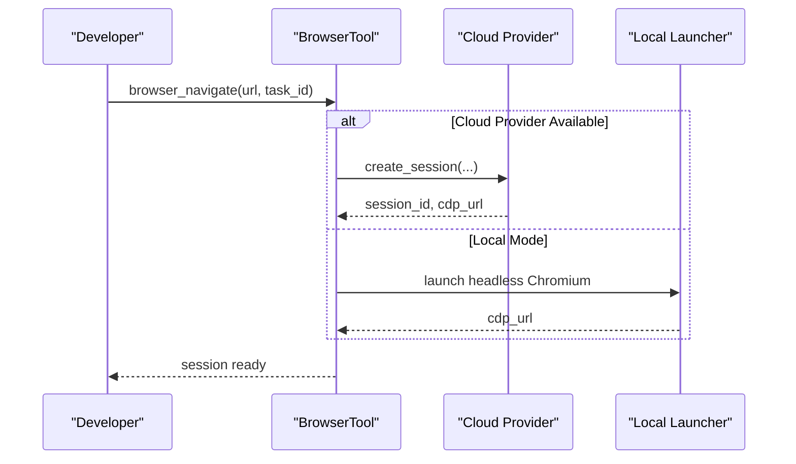
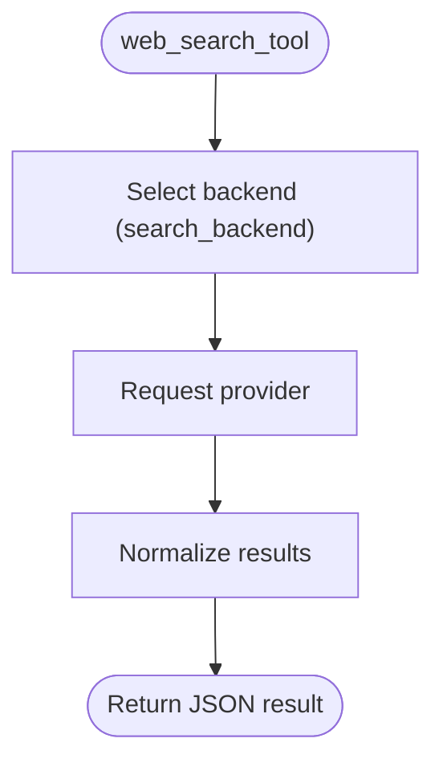
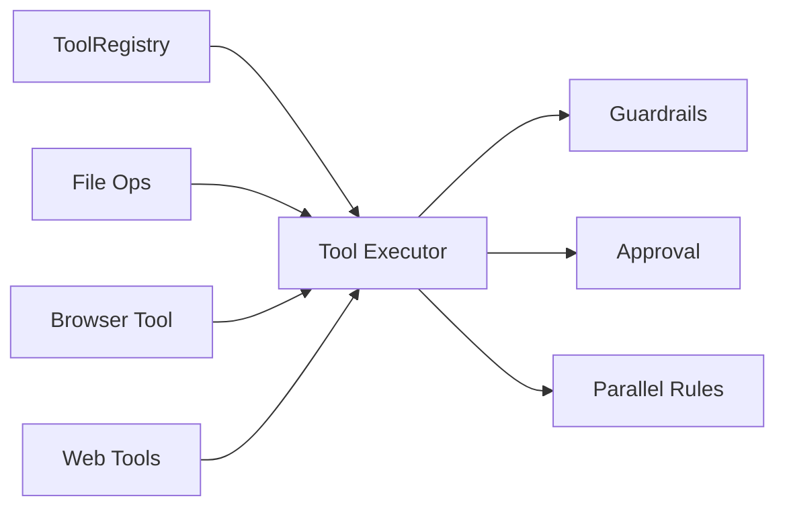

# Tool Development API

<cite>
**Referenced Files in This Document**
- [registry.py](file://tools/registry.py)
- [approval.py](file://tools/approval.py)
- [tool_executor.py](file://agent/tool_executor.py)
- [tool_guardrails.py](file://agent/tool_guardrails.py)
- [tool_dispatch_helpers.py](file://agent/tool_dispatch_helpers.py)
- [file_operations.py](file://tools/file_operations.py)
- [browser_tool.py](file://tools/browser_tool.py)
- [web_tools.py](file://tools/web_tools.py)
- [__init__.py](file://tools/__init__.py)
- [test_registry.py](file://tests/tools/test_registry.py)
- [test_tool_executor_contextvar_propagation.py](file://tests/run_agent/test_tool_executor_contextvar_propagation.py)
- [test_approve_deny_commands.py](file://tests/gateway/test_approve_deny_commands.py)
</cite>

## Table of Contents
1. [Introduction](#introduction)
2. [Project Structure](#project-structure)
3. [Core Components](#core-components)
4. [Architecture Overview](#architecture-overview)
5. [Detailed Component Analysis](#detailed-component-analysis)
6. [Dependency Analysis](#dependency-analysis)
7. [Performance Considerations](#performance-considerations)
8. [Troubleshooting Guide](#troubleshooting-guide)
9. [Conclusion](#conclusion)
10. [Appendices](#appendices)

## Introduction
This document provides comprehensive API documentation for developing tools within the Hermes Agent ecosystem. It explains the tool schema definition and registration model, execution interfaces, safety and approval systems, parallel execution patterns, and operational concerns such as testing, debugging, performance optimization, security, rate limiting, and distribution/maintenance. The guide is designed for both experienced developers and newcomers to the codebase, offering practical examples and diagrams mapped to actual source files.

## Project Structure
Hermes organizes tooling around a central registry and a set of execution and safety utilities:
- Central registry for tool schemas and handlers
- Execution orchestrators for sequential and concurrent tool calls
- Safety and approval systems for dangerous commands
- Tool-specific implementations for file operations, browser automation, and external API integration
- Testing utilities and examples

**Diagram sources**
- [registry.py:151-544](file://tools/registry.py#L151-L544)
- [tool_executor.py:64-472](file://agent/tool_executor.py#L64-L472)
- [tool_guardrails.py:224-384](file://agent/tool_guardrails.py#L224-L384)
- [tool_dispatch_helpers.py:103-147](file://agent/tool_dispatch_helpers.py#L103-L147)
- [approval.py:517-569](file://tools/approval.py#L517-L569)
- [file_operations.py:503-768](file://tools/file_operations.py#L503-L768)
- [browser_tool.py:1-120](file://tools/browser_tool.py#L1-L120)
- [web_tools.py:736-800](file://tools/web_tools.py#L736-L800)
- [test_registry.py:86-121](file://tests/tools/test_registry.py#L86-L121)
- [test_approve_deny_commands.py:503-523](file://tests/gateway/test_approve_deny_commands.py#L503-L523)
- [test_tool_executor_contextvar_propagation.py:94-124](file://tests/run_agent/test_tool_executor_contextvar_propagation.py#L94-L124)

**Section sources**
- [registry.py:1-590](file://tools/registry.py#L1-L590)
- [tool_executor.py:1-921](file://agent/tool_executor.py#L1-L921)
- [tool_guardrails.py:1-459](file://agent/tool_guardrails.py#L1-L459)
- [tool_dispatch_helpers.py:1-337](file://agent/tool_dispatch_helpers.py#L1-L337)
- [approval.py:1-800](file://tools/approval.py#L1-L800)
- [file_operations.py:1-800](file://tools/file_operations.py#L1-L800)
- [browser_tool.py:1-800](file://tools/browser_tool.py#L1-L800)
- [web_tools.py:1-800](file://tools/web_tools.py#L1-L800)

## Core Components
- ToolRegistry and ToolEntry: Centralized tool registration, schema retrieval, availability checks, and dispatch.
- Execution Orchestration: Sequential and concurrent execution paths with progress callbacks, budgets, and multimodal result handling.
- Safety and Approvals: Pattern-based detection of dangerous commands, per-session approval queues, and allowlists.
- Guardrails: Loop detection and hard-stop policies for repeated failures and non-progressing tool calls.
- Parallelism Rules: Heuristics to safely run multiple tools concurrently based on tool categories and path scopes.

Key responsibilities:
- ToolDef-like registration via ToolEntry fields (schema, handler, check_fn, requires_env, is_async, emoji, max_result_size_chars, dynamic_schema_overrides).
- Consistent result/error formatting via helper functions (tool_result, tool_error).
- Thread-safe registry operations with TTL caching for availability checks.

**Section sources**
- [registry.py:77-107](file://tools/registry.py#L77-L107)
- [registry.py:234-302](file://tools/registry.py#L234-L302)
- [registry.py:337-417](file://tools/registry.py#L337-L417)
- [registry.py:563-590](file://tools/registry.py#L563-L590)

## Architecture Overview
The tool development lifecycle integrates registration, schema exposure, execution, safety gating, and result handling.

**Diagram sources**
- [registry.py:234-417](file://tools/registry.py#L234-L417)
- [tool_executor.py:474-780](file://agent/tool_executor.py#L474-L780)
- [tool_guardrails.py:241-378](file://agent/tool_guardrails.py#L241-L378)
- [approval.py:470-800](file://tools/approval.py#L470-L800)

## Detailed Component Analysis

### Tool Registry and Registration
- ToolEntry encapsulates tool metadata and behavior flags.
- register() supports override opt-in for intentional replacements and MCP-to-MCP overwrites.
- get_definitions() filters by availability via check_fn with TTL caching and per-call cache.
- dispatch() executes handlers synchronously or bridges async via model_tools integration.
- Helper functions tool_result() and tool_error() standardize JSON responses.

**Diagram sources**
- [registry.py:77-107](file://tools/registry.py#L77-L107)
- [registry.py:151-544](file://tools/registry.py#L151-L544)

**Section sources**
- [registry.py:77-107](file://tools/registry.py#L77-L107)
- [registry.py:234-302](file://tools/registry.py#L234-L302)
- [registry.py:337-417](file://tools/registry.py#L337-L417)
- [registry.py:563-590](file://tools/registry.py#L563-L590)

### Execution Interfaces and Parallel Patterns
- Sequential execution validates interrupts, builds previews, checkpoints destructive actions, and appends results to messages.
- Concurrent execution uses a thread pool, propagates context variables for approval session isolation, and aggregates results in order.
- Parallelism gating prevents unsafe concurrency for interactive tools and path-scoped tools with overlapping targets.

**Diagram sources**
- [tool_executor.py:64-472](file://agent/tool_executor.py#L64-L472)
- [tool_dispatch_helpers.py:103-147](file://agent/tool_dispatch_helpers.py#L103-L147)

**Section sources**
- [tool_executor.py:64-472](file://agent/tool_executor.py#L64-L472)
- [tool_dispatch_helpers.py:103-147](file://agent/tool_dispatch_helpers.py#L103-L147)

### Safety and Approval Systems
- Pattern-based detection identifies dangerous commands and sensitive targets.
- Per-session approval queues support both CLI and gateway contexts with FIFO resolution.
- Permanent allowlists persist across sessions and integrate with configuration.

**Diagram sources**
- [approval.py:470-800](file://tools/approval.py#L470-L800)
- [approval.py:517-569](file://tools/approval.py#L517-L569)

**Section sources**
- [approval.py:1-800](file://tools/approval.py#L1-L800)

### Guardrails and Loop Detection
- ToolCallGuardrailController tracks repeated failures and non-progressing calls.
- Supports configurable thresholds for warnings and hard stops.
- Provides synthetic results and guidance appended to tool outputs.

**Diagram sources**
- [tool_guardrails.py:224-384](file://agent/tool_guardrails.py#L224-L384)

**Section sources**
- [tool_guardrails.py:1-459](file://agent/tool_guardrails.py#L1-L459)

### Tool Development Examples

#### File Operations Tool
- Implements a unified file API across terminal backends using shell commands.
- Provides read, write, patch, search, and linting with pagination and safety checks.
- Enforces write-path deny-lists and binary/image handling.

**Diagram sources**
- [file_operations.py:259-310](file://tools/file_operations.py#L259-L310)
- [file_operations.py:503-768](file://tools/file_operations.py#L503-L768)

**Section sources**
- [file_operations.py:1-800](file://tools/file_operations.py#L1-L800)

#### Browser Automation Tool
- Supports local headless Chromium and cloud providers (Browserbase, Browser Use).
- Uses accessibility tree snapshots and ref selectors for interaction.
- Handles engine selection (Chrome/Lightpanda) and fallbacks.

**Diagram sources**
- [browser_tool.py:488-590](file://tools/browser_tool.py#L488-L590)
- [browser_tool.py:613-700](file://tools/browser_tool.py#L613-L700)

**Section sources**
- [browser_tool.py:1-800](file://tools/browser_tool.py#L1-L800)

#### External API Integration Tool
- Provides web search, extract, and crawl via multiple backends (Firecrawl, Parallel, Tavily, Exa).
- Uses auxiliary LLM for intelligent summarization and content processing.
- Implements backend selection and capability-specific overrides.

**Diagram sources**
- [web_tools.py:736-800](file://tools/web_tools.py#L736-L800)
- [web_tools.py:167-202](file://tools/web_tools.py#L167-L202)

**Section sources**
- [web_tools.py:1-800](file://tools/web_tools.py#L1-L800)

## Dependency Analysis
- Registry-to-execution: Execution relies on registry for schemas and dispatch; registry depends on model_tools for async bridging.
- Safety-to-execution: Approval and guardrails influence execution paths and synthetic results.
- Parallelism-to-execution: Parallel gating rules are enforced before dispatch.

**Diagram sources**
- [registry.py:337-417](file://tools/registry.py#L337-L417)
- [tool_executor.py:64-472](file://agent/tool_executor.py#L64-L472)
- [tool_guardrails.py:224-384](file://agent/tool_guardrails.py#L224-L384)
- [approval.py:517-569](file://tools/approval.py#L517-L569)
- [tool_dispatch_helpers.py:103-147](file://agent/tool_dispatch_helpers.py#L103-L147)

**Section sources**
- [registry.py:1-590](file://tools/registry.py#L1-L590)
- [tool_executor.py:1-921](file://agent/tool_executor.py#L1-L921)
- [tool_guardrails.py:1-459](file://agent/tool_guardrails.py#L1-L459)
- [approval.py:1-800](file://tools/approval.py#L1-L800)
- [tool_dispatch_helpers.py:1-337](file://agent/tool_dispatch_helpers.py#L1-L337)

## Performance Considerations
- Registry availability checks are TTL-cached (~30 seconds) to amortize expensive environment probes.
- Per-call cache within get_definitions() avoids repeated check_fn evaluations across a single definitions pass.
- Concurrency uses bounded worker threads and periodic heartbeats to prevent timeouts and improve responsiveness.
- Parallelism gating reduces contention for path-scoped tools and interactive tools.

[No sources needed since this section provides general guidance]

## Troubleshooting Guide
Common issues and resolutions:
- Unknown tool or dispatch errors: registry.dispatch() returns standardized JSON with error details; sanitize via model_tools error sanitizer.
- Availability failures: check_fn exceptions are caught and treated as unavailable; verify environment variables and tool prerequisites.
- Parallel execution isolation: ensure context variables are propagated to worker threads; tests validate session-key isolation across concurrent batches.
- Approval timeouts: gateway approvals use queues and resolve FIFO; timeouts return deny decisions.

**Section sources**
- [registry.py:390-417](file://tools/registry.py#L390-L417)
- [test_tool_executor_contextvar_propagation.py:94-124](file://tests/run_agent/test_tool_executor_contextvar_propagation.py#L94-L124)
- [test_approve_deny_commands.py:503-523](file://tests/gateway/test_approve_deny_commands.py#L503-L523)

## Conclusion
Hermes Agent’s tool development API centers on a robust registry, consistent execution orchestration, strong safety and approval systems, and guardrails that prevent loops and excessive retries. By adhering to the registration model, result formatting helpers, and parallelism rules, developers can build reliable, secure, and performant tools that integrate seamlessly with the broader agent runtime.

[No sources needed since this section summarizes without analyzing specific files]

## Appendices

### Tool Schema Definitions and Validation
- Registration fields: name, toolset, schema, handler, check_fn, requires_env, is_async, description, emoji, max_result_size_chars, dynamic_schema_overrides, override.
- Schema retrieval: get_definitions() merges base schema with dynamic overrides and filters by availability.
- Validation: JSON parsing of arguments with fallback to empty dict; pagination normalization for read/search operations.

**Section sources**
- [registry.py:234-302](file://tools/registry.py#L234-L302)
- [registry.py:337-384](file://tools/registry.py#L337-L384)
- [file_operations.py:476-501](file://tools/file_operations.py#L476-L501)

### Result Handling and Formatting
- tool_result() and tool_error() provide consistent JSON responses; avoid boilerplate across tool handlers.
- Multimodal results: envelope format with content parts and text_summary; helpers extract previews and normalize messages.

**Section sources**
- [registry.py:563-590](file://tools/registry.py#L563-L590)
- [tool_dispatch_helpers.py:177-235](file://agent/tool_dispatch_helpers.py#L177-L235)

### Security Considerations
- Dangerous command detection: comprehensive patterns for destructive operations, sensitive targets, and privilege escalation.
- Approval system: per-session queues, allowlists, and permanent approvals; CLI and gateway modes supported.
- File safety: deny-lists for sensitive paths; safe write root constraints; binary/image handling.

**Section sources**
- [approval.py:316-422](file://tools/approval.py#L316-L422)
- [approval.py:517-569](file://tools/approval.py#L517-L569)
- [file_operations.py:48-91](file://tools/file_operations.py#L48-L91)

### Rate Limiting and Error Handling
- Auxiliary clients: web extraction uses configurable timeouts and retry logic; throttling occurs at provider boundaries.
- Error sanitization: tool errors are sanitized before reporting to prevent structural noise in model prompts.

**Section sources**
- [web_tools.py:320-418](file://tools/web_tools.py#L320-L418)
- [registry.py:405-416](file://tools/registry.py#L405-L416)

### Testing and Debugging
- Registry tests: availability checks, check_fn exceptions, and thread-safety validations.
- Approval tests: parallel subagent approvals and gateway notification flows.
- Context propagation tests: ensure approval session keys propagate correctly in concurrent workers.

**Section sources**
- [test_registry.py:86-121](file://tests/tools/test_registry.py#L86-L121)
- [test_registry.py:213-285](file://tests/tools/test_registry.py#L213-L285)
- [test_approve_deny_commands.py:503-523](file://tests/gateway/test_approve_deny_commands.py#L503-L523)
- [test_tool_executor_contextvar_propagation.py:94-124](file://tests/run_agent/test_tool_executor_contextvar_propagation.py#L94-L124)

### Distribution and Maintenance Guidelines
- Use override=True for intentional replacements; MCP-to-MCP overwrites are permitted.
- Keep check_fn lightweight and cacheable; registry invalidates TTL cache on configuration changes.
- Document requires_env and toolset membership; use aliases for toolset names when needed.
- Maintain backward compatibility for dynamic schema overrides and result envelopes.

**Section sources**
- [registry.py:260-290](file://tools/registry.py#L260-L290)
- [registry.py:144-149](file://tools/registry.py#L144-L149)
- [registry.py:208-228](file://tools/registry.py#L208-L228)