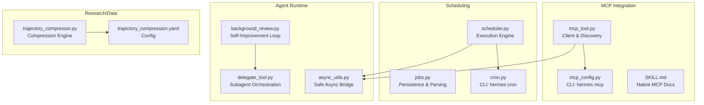
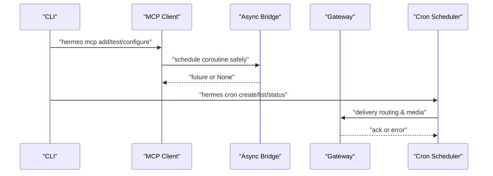
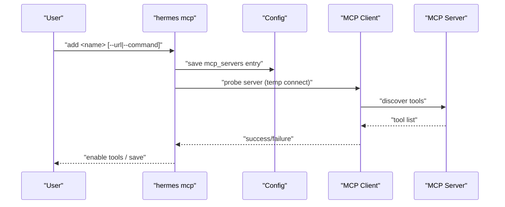
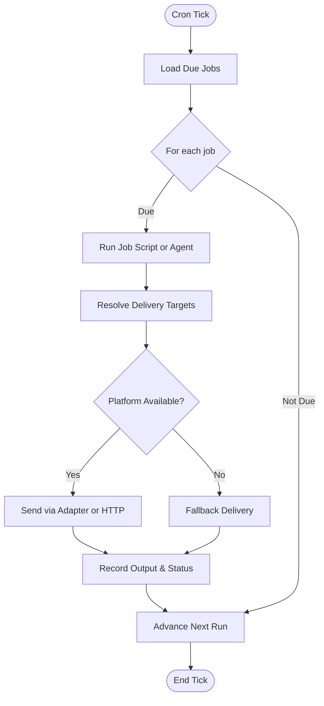
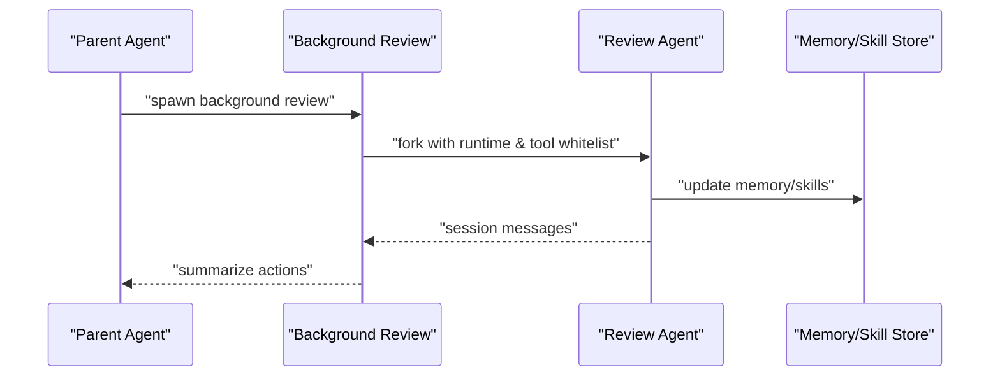
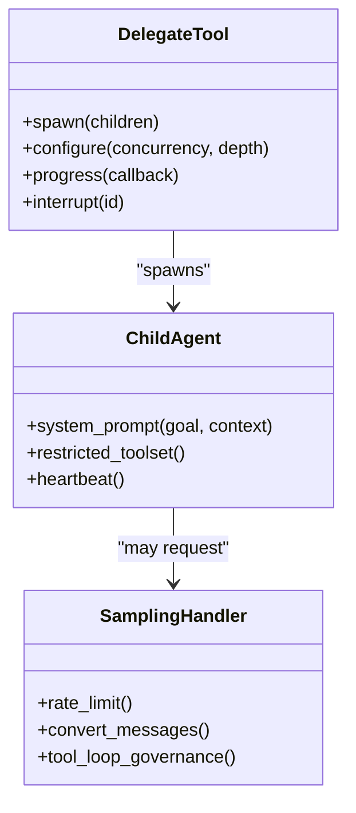
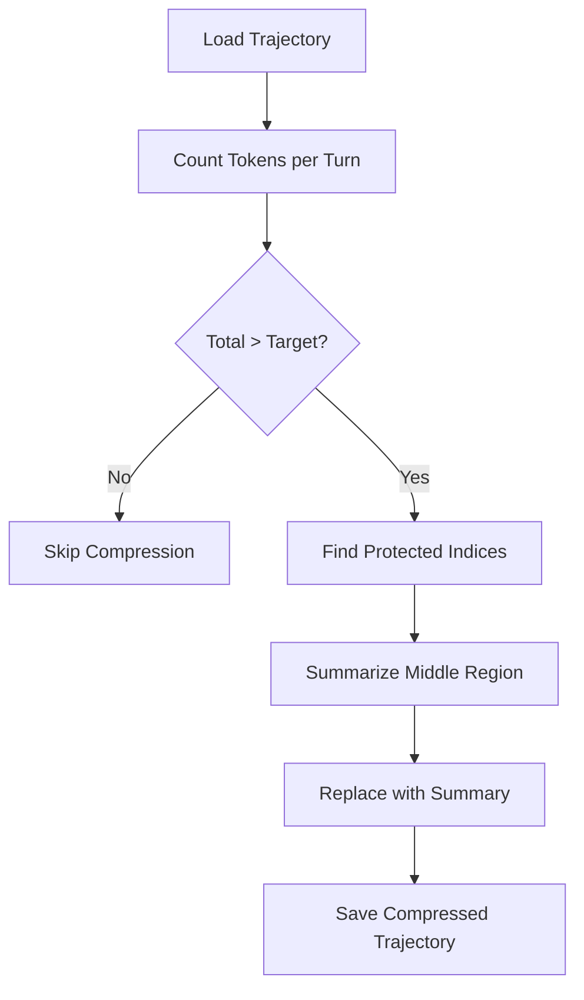
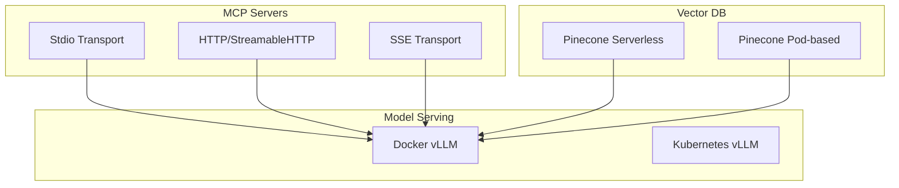
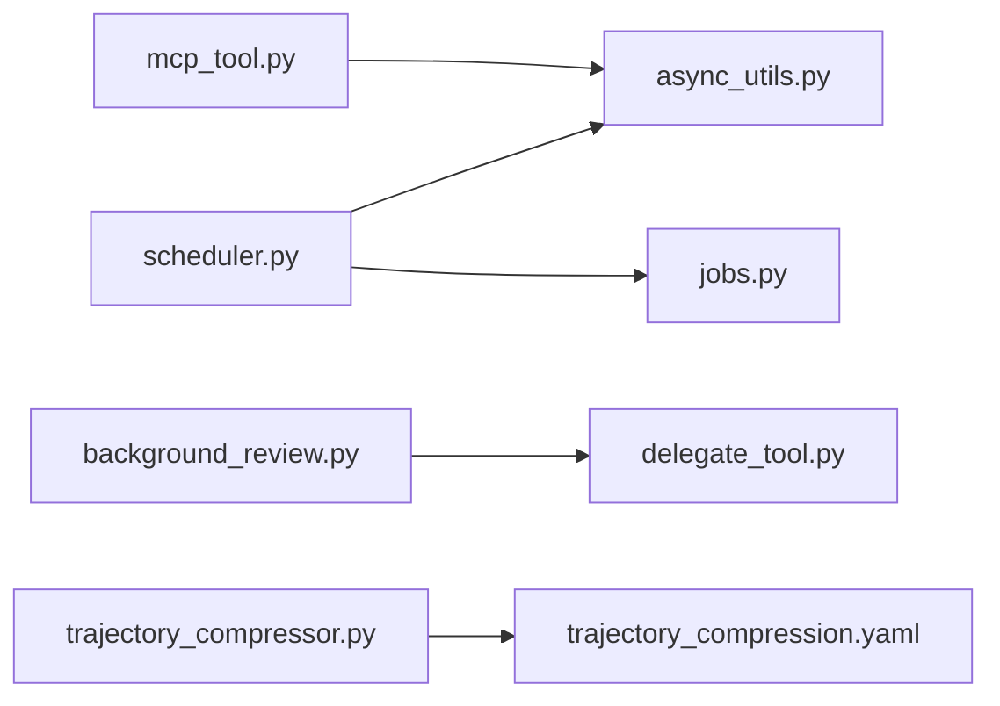

# Advanced Topics

<cite>
**Referenced Files in This Document**
- [scheduler.py](file://cron/scheduler.py)
- [jobs.py](file://cron/jobs.py)
- [cron.py](file://hermes_cli/cron.py)
- [background_review.py](file://agent/background_review.py)
- [delegate_tool.py](file://tools/delegate_tool.py)
- [mcp_tool.py](file://tools/mcp_tool.py)
- [mcp_config.py](file://hermes_cli/mcp_config.py)
- [trajectory_compressor.py](file://trajectory_compressor.py)
- [trajectory_compression.yaml](file://datagen-config-examples/trajectory_compression.yaml)
- [async_utils.py](file://agent/async_utils.py)
- [SKILL.md](file://skills/mcp/native-mcp/SKILL.md)
- [main.py](file://hermes_cli/main.py)
- [server-deployment.md](file://skills/mlops/inference/vllm/references/server-deployment.md)
- [deployment.md](file://optional-skills/mlops/pinecone/references/deployment.md)
</cite>

## Table of Contents
1. [Introduction](#introduction)
2. [Project Structure](#project-structure)
3. [Core Components](#core-components)
4. [Architecture Overview](#architecture-overview)
5. [Detailed Component Analysis](#detailed-component-analysis)
6. [Dependency Analysis](#dependency-analysis)
7. [Performance Considerations](#performance-considerations)
8. [Troubleshooting Guide](#troubleshooting-guide)
9. [Conclusion](#conclusion)
10. [Appendices](#appendices)

## Introduction
This document presents Advanced Topics for sophisticated usage of the system, focusing on:
- MCP (Model Context Protocol) integration: server setup, client configuration, and advanced MCP features such as sampling and parallel tool calls
- Cron scheduling: scheduled task management, execution monitoring, and advanced scheduling patterns
- Background review: ongoing task management and iterative self-improvement
- Advanced agent capabilities: subagent orchestration, parallel processing, and complex multi-step workflows
- Research-focused features: batch trajectory generation and trajectory compression for training next-generation tool-calling models
- Advanced configuration, performance optimization, and troubleshooting complex integration scenarios
- Expert-level deployment patterns and custom extension development

## Project Structure
The advanced features are implemented across several subsystems:
- MCP integration: client tooling, CLI management, and transport configuration
- Scheduling: cron scheduler, job persistence, and CLI commands
- Agent runtime: background review and subagent orchestration
- Research/data generation: trajectory compression and configuration examples
- Utilities: async bridging helpers and deployment references

**Diagram sources**
- [mcp_tool.py:1-120](file://tools/mcp_tool.py#L1-L120)
- [mcp_config.py:1-120](file://hermes_cli/mcp_config.py#L1-L120)
- [SKILL.md:120-200](file://skills/mcp/native-mcp/SKILL.md#L120-L200)
- [scheduler.py:1-120](file://cron/scheduler.py#L1-L120)
- [jobs.py:150-220](file://cron/jobs.py#L150-L220)
- [cron.py:1-120](file://hermes_cli/cron.py#L1-L120)
- [background_review.py:1-80](file://agent/background_review.py#L1-L80)
- [delegate_tool.py:1-120](file://tools/delegate_tool.py#L1-L120)
- [async_utils.py:1-69](file://agent/async_utils.py#L1-L69)
- [trajectory_compressor.py:1-120](file://trajectory_compressor.py#L1-L120)
- [trajectory_compression.yaml:1-102](file://datagen-config-examples/trajectory_compression.yaml#L1-L102)

**Section sources**
- [mcp_tool.py:1-120](file://tools/mcp_tool.py#L1-L120)
- [mcp_config.py:1-120](file://hermes_cli/mcp_config.py#L1-L120)
- [SKILL.md:120-200](file://skills/mcp/native-mcp/SKILL.md#L120-L200)
- [scheduler.py:1-120](file://cron/scheduler.py#L1-L120)
- [jobs.py:150-220](file://cron/jobs.py#L150-L220)
- [cron.py:1-120](file://hermes_cli/cron.py#L1-L120)
- [background_review.py:1-80](file://agent/background_review.py#L1-L80)
- [delegate_tool.py:1-120](file://tools/delegate_tool.py#L1-L120)
- [async_utils.py:1-69](file://agent/async_utils.py#L1-L69)
- [trajectory_compressor.py:1-120](file://trajectory_compressor.py#L1-L120)
- [trajectory_compression.yaml:1-102](file://datagen-config-examples/trajectory_compression.yaml#L1-L102)

## Core Components
- MCP client and discovery: robust stdio and HTTP transports, credential filtering, sampling, and parallel tool call support
- Cron scheduler: file-based locking, delivery routing, and script execution with safety guards
- Background review: periodic self-assessment of memory and skills with minimal side effects
- Subagent orchestration: controlled spawning, parallelism, and nested delegation with safety and visibility
- Trajectory compression: configurable token budgeting, protected turns, and LLM-based summarization

**Section sources**
- [mcp_tool.py:50-120](file://tools/mcp_tool.py#L50-L120)
- [scheduler.py:1-120](file://cron/scheduler.py#L1-L120)
- [background_review.py:1-80](file://agent/background_review.py#L1-L80)
- [delegate_tool.py:1-120](file://tools/delegate_tool.py#L1-L120)
- [trajectory_compressor.py:1-120](file://trajectory_compressor.py#L1-L120)

## Architecture Overview
The advanced features integrate through shared utilities and configuration:
- MCP client runs in a dedicated background loop and bridges to the main runtime via async helpers
- Cron jobs execute in a controlled environment with strict script validation and delivery routing
- Background review forks a lightweight agent to evaluate and update memory/skills
- Subagent orchestration coordinates parallel workers with tool whitelists and progress reporting
- Trajectory compression post-processes runs to reduce token usage while preserving training signal

**Diagram sources**
- [mcp_config.py:220-320](file://hermes_cli/mcp_config.py#L220-L320)
- [mcp_tool.py:600-700](file://tools/mcp_tool.py#L600-L700)
- [async_utils.py:34-69](file://agent/async_utils.py#L34-L69)
- [scheduler.py:489-667](file://cron/scheduler.py#L489-L667)
- [cron.py:165-260](file://hermes_cli/cron.py#L165-L260)

## Detailed Component Analysis

### MCP Integration
- Server setup and discovery: stdio via command/args and HTTP/SSE transports; OAuth and header-based auth; environment filtering for subprocesses
- Client configuration: timeouts, reconnect backoff, sampling, and parallel tool call opt-in
- Advanced MCP features: sampling/createMessage for server-initiated LLM requests, with rate limiting and tool-loop governance

**Diagram sources**
- [mcp_config.py:226-420](file://hermes_cli/mcp_config.py#L226-L420)
- [mcp_tool.py:170-260](file://tools/mcp_tool.py#L170-L260)
- [SKILL.md:146-200](file://skills/mcp/native-mcp/SKILL.md#L146-L200)

**Section sources**
- [mcp_config.py:226-420](file://hermes_cli/mcp_config.py#L226-L420)
- [mcp_tool.py:170-260](file://tools/mcp_tool.py#L170-L260)
- [SKILL.md:146-200](file://skills/mcp/native-mcp/SKILL.md#L146-L200)

### Cron Scheduling System
- Job lifecycle: creation, parsing, persistence, and execution
- Execution engine: tick-based scheduling with file-based locking, delivery routing, and script execution
- CLI commands: list, create, edit, pause/resume/run/remove, status, and tick

**Diagram sources**
- [scheduler.py:489-667](file://cron/scheduler.py#L489-L667)
- [jobs.py:184-220](file://cron/jobs.py#L184-L220)
- [cron.py:165-260](file://hermes_cli/cron.py#L165-L260)

**Section sources**
- [scheduler.py:1-200](file://cron/scheduler.py#L1-L200)
- [jobs.py:150-220](file://cron/jobs.py#L150-L220)
- [cron.py:1-120](file://hermes_cli/cron.py#L1-L120)

### Background Review System
- Periodic self-assessment: fork a lightweight agent to evaluate memory and skills
- Controlled toolset: restrict to memory/skill tools; inherit runtime for cache efficiency
- Action summarization: compact summary surfaced to user and callback

**Diagram sources**
- [background_review.py:309-533](file://agent/background_review.py#L309-L533)

**Section sources**
- [background_review.py:1-200](file://agent/background_review.py#L1-L200)

### Advanced Agent Capabilities: Subagent Orchestration
- Controlled spawning: parallel workers with configurable concurrency and timeouts
- Nested orchestration: role-based delegation with depth caps and toolset inheritance
- Progress and safety: heartbeat monitoring, auto-approval callbacks, and interrupt propagation

**Diagram sources**
- [delegate_tool.py:569-642](file://tools/delegate_tool.py#L569-L642)
- [mcp_tool.py:641-800](file://tools/mcp_tool.py#L641-L800)

**Section sources**
- [delegate_tool.py:1-200](file://tools/delegate_tool.py#L1-L200)
- [mcp_tool.py:620-800](file://tools/mcp_tool.py#L620-L800)

### Research-Focused Features: Trajectory Compression
- Compression strategy: protect first/last turns, summarize middle content, and replace with a single summary
- Configuration: tokenizer, target tokens, summarization model, and output settings
- Batch processing: parallel workers and metrics tracking

**Diagram sources**
- [trajectory_compressor.py:830-862](file://trajectory_compressor.py#L830-L862)
- [trajectory_compression.yaml:1-102](file://datagen-config-examples/trajectory_compression.yaml#L1-L102)

**Section sources**
- [trajectory_compressor.py:1-1350](file://trajectory_compressor.py#L1-L1350)
- [trajectory_compression.yaml:1-102](file://datagen-config-examples/trajectory_compression.yaml#L1-L102)

### Expert-Level Deployment Patterns
- MCP server deployment: native stdio and HTTP transports with authentication and sampling
- Vector database deployment: serverless vs pod-based Pinecone configurations
- Model serving: Docker, Kubernetes, and production tuning for vLLM

**Diagram sources**
- [mcp_tool.py:50-120](file://tools/mcp_tool.py#L50-L120)
- [deployment.md:1-64](file://optional-skills/mlops/pinecone/references/deployment.md#L1-L64)
- [server-deployment.md:1-256](file://skills/mlops/inference/vllm/references/server-deployment.md#L1-L256)

**Section sources**
- [mcp_tool.py:50-120](file://tools/mcp_tool.py#L50-L120)
- [deployment.md:1-64](file://optional-skills/mlops/pinecone/references/deployment.md#L1-L64)
- [server-deployment.md:1-256](file://skills/mlops/inference/vllm/references/server-deployment.md#L1-L256)

## Dependency Analysis
- MCP client depends on async bridging utilities for safe scheduling and uses configuration-driven discovery
- Cron scheduler depends on job persistence and delivery routing; integrates with gateway adapters
- Background review depends on agent runtime inheritance and tool whitelisting
- Subagent orchestration depends on delegate tool configuration and async bridging
- Trajectory compression depends on configuration and tokenizer libraries

**Diagram sources**
- [mcp_tool.py:1-120](file://tools/mcp_tool.py#L1-L120)
- [async_utils.py:1-69](file://agent/async_utils.py#L1-L69)
- [scheduler.py:1-120](file://cron/scheduler.py#L1-L120)
- [jobs.py:150-220](file://cron/jobs.py#L150-L220)
- [background_review.py:1-80](file://agent/background_review.py#L1-L80)
- [delegate_tool.py:1-120](file://tools/delegate_tool.py#L1-L120)
- [trajectory_compressor.py:1-120](file://trajectory_compressor.py#L1-L120)
- [trajectory_compression.yaml:1-102](file://datagen-config-examples/trajectory_compression.yaml#L1-L102)

**Section sources**
- [mcp_tool.py:1-120](file://tools/mcp_tool.py#L1-L120)
- [async_utils.py:1-69](file://agent/async_utils.py#L1-L69)
- [scheduler.py:1-120](file://cron/scheduler.py#L1-L120)
- [jobs.py:150-220](file://cron/jobs.py#L150-L220)
- [background_review.py:1-80](file://agent/background_review.py#L1-L80)
- [delegate_tool.py:1-120](file://tools/delegate_tool.py#L1-L120)
- [trajectory_compressor.py:1-120](file://trajectory_compressor.py#L1-L120)
- [trajectory_compression.yaml:1-102](file://datagen-config-examples/trajectory_compression.yaml#L1-L102)

## Performance Considerations
- MCP sampling and parallel tool calls: tune max RPM, token caps, and tool loop limits to balance throughput and cost
- Cron script execution: enforce timeouts and validate script paths to prevent resource exhaustion
- Background review: minimize overhead by inheriting runtime and suppressing non-essential output
- Trajectory compression: adjust target tokens and tokenizer to achieve desired compression ratios while preserving signal quality

[No sources needed since this section provides general guidance]

## Troubleshooting Guide
- MCP connection issues: verify transport configuration, environment variables, and authentication; check stderr logs and connection errors
- Cron delivery failures: validate platform configuration, home channel settings, and delivery routing; inspect gateway logs
- Subagent stalls: monitor heartbeats and timeouts; adjust concurrency and spawn depth; use interrupt propagation
- Trajectory compression failures: review tokenizer configuration and summarization settings; check per-trajectory timeouts

**Section sources**
- [mcp_tool.py:562-620](file://tools/mcp_tool.py#L562-L620)
- [scheduler.py:489-667](file://cron/scheduler.py#L489-L667)
- [delegate_tool.py:367-430](file://tools/delegate_tool.py#L367-L430)
- [trajectory_compressor.py:1290-1350](file://trajectory_compressor.py#L1290-L1350)

## Conclusion
These advanced features enable expert-level integration, automation, and research-scale data generation. By leveraging MCP for extended capabilities, cron for automated workflows, background review for continuous improvement, subagent orchestration for complex multi-step tasks, and trajectory compression for efficient training data curation, users can build scalable, maintainable, and high-performance AI agent systems.

[No sources needed since this section summarizes without analyzing specific files]

## Appendices
- CLI references: MCP management and cron operations
- Configuration examples: MCP server presets and trajectory compression settings
- Deployment references: MCP, vector databases, and model serving

**Section sources**
- [main.py:10537-10571](file://hermes_cli/main.py#L10537-L10571)
- [mcp_config.py:35-41](file://hermes_cli/mcp_config.py#L35-L41)
- [trajectory_compression.yaml:1-102](file://datagen-config-examples/trajectory_compression.yaml#L1-L102)
- [deployment.md:1-64](file://optional-skills/mlops/pinecone/references/deployment.md#L1-L64)
- [server-deployment.md:1-256](file://skills/mlops/inference/vllm/references/server-deployment.md#L1-L256)