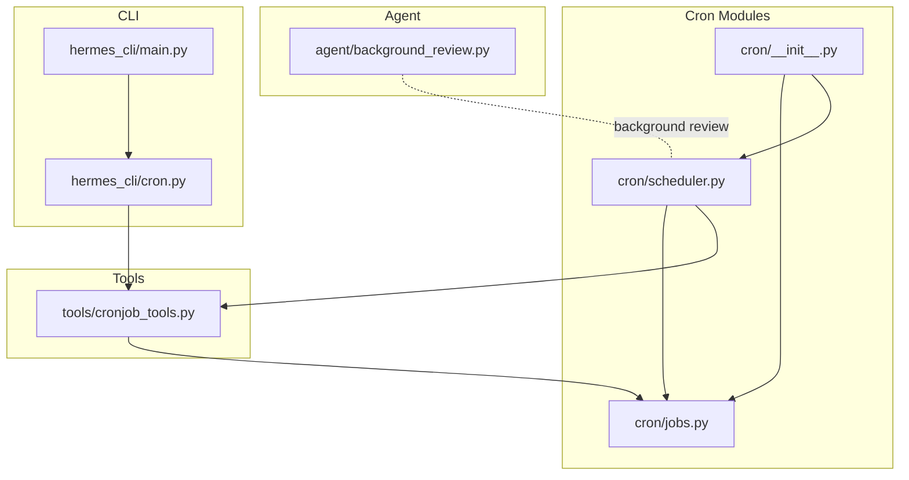
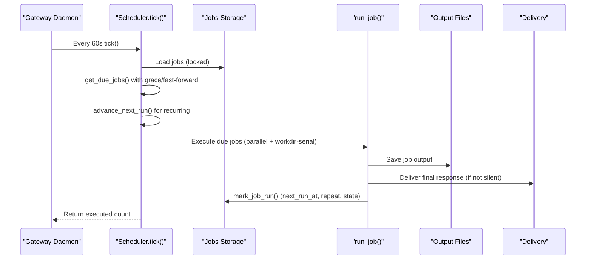
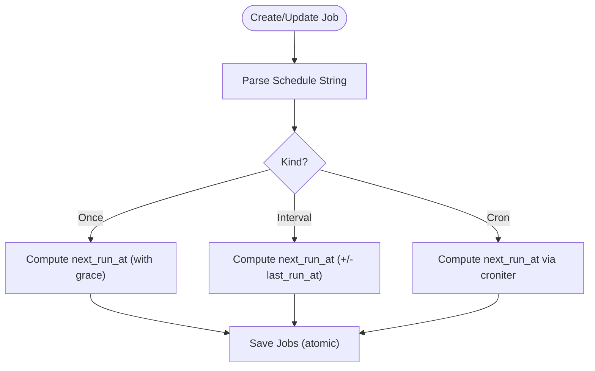
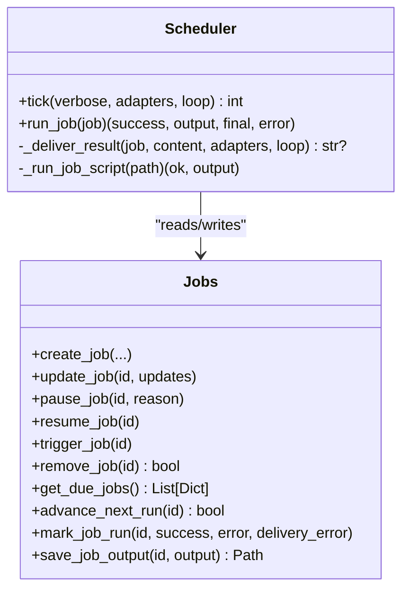
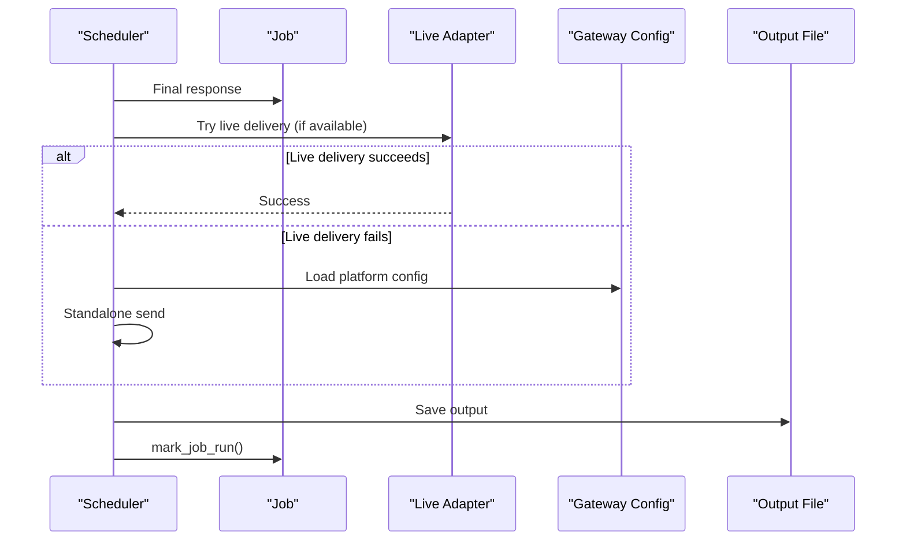
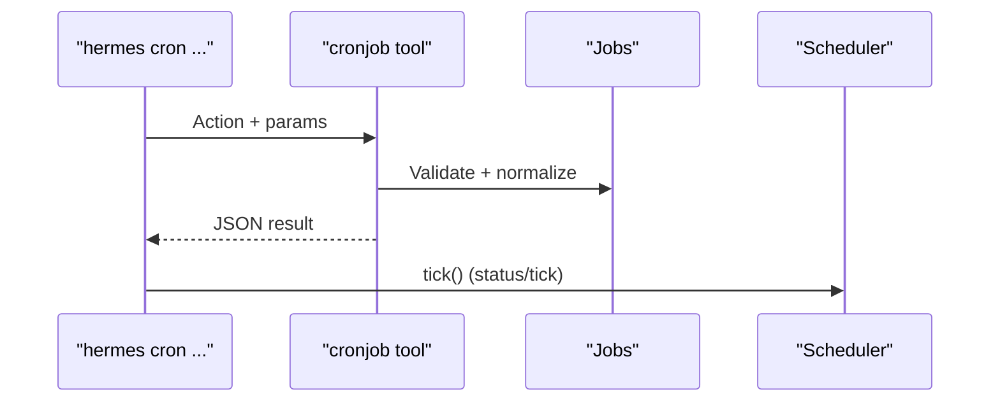
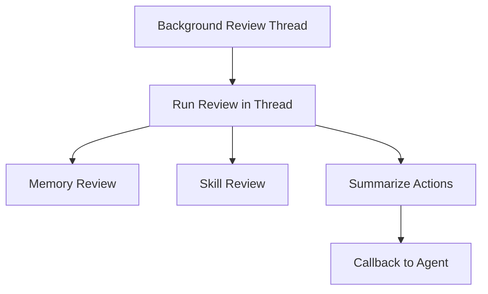
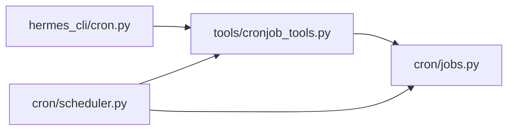

# Cron Scheduling System

<cite>
**Referenced Files in This Document**
- [cron/__init__.py](file://cron/__init__.py)
- [cron/jobs.py](file://cron/jobs.py)
- [cron/scheduler.py](file://cron/scheduler.py)
- [hermes_cli/cron.py](file://hermes_cli/cron.py)
- [hermes_cli/main.py](file://hermes_cli/main.py)
- [tools/cronjob_tools.py](file://tools/cronjob_tools.py)
- [agent/background_review.py](file://agent/background_review.py)
</cite>

## Table of Contents
1. [Introduction](#introduction)
2. [Project Structure](#project-structure)
3. [Core Components](#core-components)
4. [Architecture Overview](#architecture-overview)
5. [Detailed Component Analysis](#detailed-component-analysis)
6. [Dependency Analysis](#dependency-analysis)
7. [Performance Considerations](#performance-considerations)
8. [Troubleshooting Guide](#troubleshooting-guide)
9. [Conclusion](#conclusion)
10. [Appendices](#appendices)

## Introduction
This document describes the cron scheduling system for the Hermes Agent. It covers job definitions, scheduling algorithms, execution contexts, monitoring, and advanced patterns such as conditional execution, resource management, and job chaining. It also explains how cron integrates with agent workflows, background processing, and automated task execution, and provides practical examples, troubleshooting guidance, and scalability recommendations for enterprise deployments.

## Project Structure
The cron system is organized into three primary modules:
- jobs: persistent job storage, parsing, and scheduling computation
- scheduler: execution engine, delivery, and concurrency control
- CLI integration: user-facing commands and tool orchestration

**Diagram sources**
- [cron/__init__.py:1-43](file://cron/__init__.py#L1-L43)
- [cron/jobs.py:1-1160](file://cron/jobs.py#L1-L1160)
- [cron/scheduler.py:1-1837](file://cron/scheduler.py#L1-L1837)
- [hermes_cli/cron.py:1-314](file://hermes_cli/cron.py#L1-L314)
- [hermes_cli/main.py:10537-10571](file://hermes_cli/main.py#L10537-L10571)
- [tools/cronjob_tools.py:1-719](file://tools/cronjob_tools.py#L1-L719)
- [agent/background_review.py:492-570](file://agent/background_review.py#L492-L570)

**Section sources**
- [cron/__init__.py:1-43](file://cron/__init__.py#L1-L43)
- [cron/jobs.py:1-1160](file://cron/jobs.py#L1-L1160)
- [cron/scheduler.py:1-1837](file://cron/scheduler.py#L1-L1837)
- [hermes_cli/cron.py:1-314](file://hermes_cli/cron.py#L1-L314)
- [hermes_cli/main.py:10537-10571](file://hermes_cli/main.py#L10537-L10571)
- [tools/cronjob_tools.py:1-719](file://tools/cronjob_tools.py#L1-L719)
- [agent/background_review.py:492-570](file://agent/background_review.py#L492-L570)

## Core Components
- Job storage and scheduling:
  - Persistent job database in JSON with atomic writes
  - Schedule parsing supporting durations, intervals, cron expressions, and timestamps
  - Next-run computation with grace windows and catch-up logic
- Execution engine:
  - Tick-based scheduler with file locks and concurrency controls
  - Delivery routing to multiple platforms with thread/topic awareness
  - Inactivity-based timeouts and resource cleanup
- CLI and tooling:
  - Unified cronjob tool with safety scanning and normalization
  - CLI commands for listing, creating, updating, pausing, resuming, triggering, removing, checking status, and manual ticking
  - Integration with agent workflows and background processing

**Section sources**
- [cron/jobs.py:1-1160](file://cron/jobs.py#L1-L1160)
- [cron/scheduler.py:1-1837](file://cron/scheduler.py#L1-L1837)
- [hermes_cli/cron.py:1-314](file://hermes_cli/cron.py#L1-L314)
- [tools/cronjob_tools.py:1-719](file://tools/cronjob_tools.py#L1-L719)

## Architecture Overview
The cron system operates as a file-backed scheduler driven by the gateway daemon. The scheduler periodically checks for due jobs, executes them, saves outputs, and delivers results to configured destinations. It supports both LLM-driven jobs and script-only “no-agent” jobs, with robust safety, delivery, and concurrency controls.

**Diagram sources**
- [cron/scheduler.py:1669-1837](file://cron/scheduler.py#L1669-L1837)
- [cron/jobs.py:915-1042](file://cron/jobs.py#L915-L1042)
- [cron/scheduler.py:1024-1667](file://cron/scheduler.py#L1024-L1667)

## Detailed Component Analysis

### Job Definitions and Storage
- Storage layout:
  - Jobs persisted in a JSON file with atomic replace semantics
  - Output saved per job in a timestamped Markdown file
  - Secure permissions enforced on directories and files
- Fields and normalization:
  - Supports single or multiple skills with canonicalization
  - Normalizes schedule strings into structured kinds (once, interval, cron)
  - Computes next run with timezone-awareness and grace windows
- CRUD operations:
  - Create, read, update, pause/resume, trigger, remove
  - Reference resolution by ID or case-insensitive name (with ambiguity handling)
  - Repeat limits and completion tracking

**Diagram sources**
- [cron/jobs.py:184-394](file://cron/jobs.py#L184-L394)
- [cron/jobs.py:482-636](file://cron/jobs.py#L482-L636)

**Section sources**
- [cron/jobs.py:1-1160](file://cron/jobs.py#L1-L1160)

### Scheduling Algorithms and Execution Contexts
- Schedule parsing:
  - Durations (e.g., “30m”, “2h”, “1d”), intervals (“every X”), cron expressions, and timestamps
  - Validation and error reporting for malformed inputs
- Next-run computation:
  - Grace windows for one-shot jobs
  - Catch-up logic for recurring jobs that missed their window
  - Timezone-aware conversions for backward compatibility
- Execution contexts:
  - LLM-driven jobs: AIAgent with session persistence, toolsets, provider routing, and MCP integration
  - Script-only jobs: direct subprocess execution with interpreter selection and wake gates
  - Workdir isolation: per-job working directory for project context and tool sandboxing
  - Delivery routing: origin-based, home channels, or explicit targets with thread/topic preservation

**Diagram sources**
- [cron/scheduler.py:1669-1837](file://cron/scheduler.py#L1669-L1837)
- [cron/jobs.py:915-1042](file://cron/jobs.py#L915-L1042)

**Section sources**
- [cron/scheduler.py:1-1837](file://cron/scheduler.py#L1-L1837)
- [cron/jobs.py:1-1160](file://cron/jobs.py#L1-L1160)

### Delivery and Monitoring
- Delivery targets:
  - Local-only, origin-based, explicit platform targets, or fan-out to all configured channels
  - Thread/topic awareness and fallbacks for missing origin metadata
  - Live adapter delivery when gateway is running, with fallback to standalone HTTP
- Silent suppression:
  - Final response containing a sentinel marker suppresses delivery while saving output
- Monitoring:
  - Execution history, last status, last error, and last delivery error
  - CLI status shows gateway presence, active jobs, and next run time
  - Output files persist for audit and replay

**Diagram sources**
- [cron/scheduler.py:489-667](file://cron/scheduler.py#L489-L667)
- [cron/scheduler.py:1743-1782](file://cron/scheduler.py#L1743-L1782)

**Section sources**
- [cron/scheduler.py:1-1837](file://cron/scheduler.py#L1-L1837)

### Advanced Scheduling Patterns
- Conditional execution:
  - Wake gates via script output to skip agent runs when no data is present
  - Prompt injection scanning to block dangerous assembled prompts
- Resource management:
  - Inactivity-based timeouts with activity tracking
  - Cleanup of agent resources, auxiliary clients, and orphaned MCP children
  - File locks and atomic writes to prevent corruption
- Job chaining:
  - Context injection from prior job outputs
  - Repeat limits and completion tracking
- Prioritization and concurrency:
  - Parallel execution with configurable max workers
  - Workdir jobs run sequentially to avoid environment interference

**Section sources**
- [cron/scheduler.py:823-847](file://cron/scheduler.py#L823-L847)
- [cron/scheduler.py:998-1007](file://cron/scheduler.py#L998-L1007)
- [cron/scheduler.py:1716-1741](file://cron/scheduler.py#L1716-L1741)
- [cron/scheduler.py:1784-1821](file://cron/scheduler.py#L1784-L1821)
- [tools/cronjob_tools.py:74-96](file://tools/cronjob_tools.py#L74-L96)

### CLI and Tool Integration
- Unified cronjob tool:
  - Single action-oriented tool with schema validation and safety scanning
  - Normalization of deliver targets, script paths, and model/provider overrides
- CLI commands:
  - List, create, edit, pause/resume, run/trigger, remove, status, tick
  - Rich formatting and warnings for gateway status and delivery issues

**Diagram sources**
- [hermes_cli/cron.py:165-313](file://hermes_cli/cron.py#L165-L313)
- [tools/cronjob_tools.py:287-542](file://tools/cronjob_tools.py#L287-L542)
- [hermes_cli/main.py:10537-10571](file://hermes_cli/main.py#L10537-L10571)

**Section sources**
- [hermes_cli/cron.py:1-314](file://hermes_cli/cron.py#L1-L314)
- [hermes_cli/main.py:10537-10571](file://hermes_cli/main.py#L10537-L10571)
- [tools/cronjob_tools.py:1-719](file://tools/cronjob_tools.py#L1-L719)

### Background Review System
The agent’s background review system periodically evaluates memory and skills and can be integrated with cron jobs to self-improve over time. While not a cron job itself, it demonstrates ongoing task management and review processes that complement the cron scheduler.

**Diagram sources**
- [agent/background_review.py:557-570](file://agent/background_review.py#L557-L570)

**Section sources**
- [agent/background_review.py:492-570](file://agent/background_review.py#L492-L570)

## Dependency Analysis
- Internal dependencies:
  - scheduler depends on jobs for due job computation and persistence
  - cronjob_tools orchestrates jobs operations and validates inputs
  - CLI delegates to cronjob_tools and scheduler
- External integrations:
  - croniter for cron expression parsing
  - Platform adapters for delivery
  - Agent runtime for LLM-driven jobs

**Diagram sources**
- [hermes_cli/cron.py:1-314](file://hermes_cli/cron.py#L1-L314)
- [tools/cronjob_tools.py:1-719](file://tools/cronjob_tools.py#L1-L719)
- [cron/jobs.py:1-1160](file://cron/jobs.py#L1-L1160)
- [cron/scheduler.py:1-1837](file://cron/scheduler.py#L1-L1837)

**Section sources**
- [cron/__init__.py:1-43](file://cron/__init__.py#L1-L43)
- [cron/jobs.py:1-1160](file://cron/jobs.py#L1-L1160)
- [cron/scheduler.py:1-1837](file://cron/scheduler.py#L1-L1837)
- [hermes_cli/cron.py:1-314](file://hermes_cli/cron.py#L1-L314)
- [tools/cronjob_tools.py:1-719](file://tools/cronjob_tools.py#L1-L719)

## Performance Considerations
- Concurrency:
  - Parallel execution with configurable max workers; default unbounded
  - Workdir jobs run sequentially to avoid environment interference
- Timeouts:
  - Inactivity-based timeouts for LLM-driven jobs
  - Script timeouts configurable via environment or config
- Resource cleanup:
  - Explicit closing of agent resources and auxiliary clients
  - Cleanup of orphaned MCP children post-tick
- Persistence:
  - Atomic writes and secure permissions reduce I/O overhead and risk

[No sources needed since this section provides general guidance]

## Troubleshooting Guide
Common issues and resolutions:
- Gateway not running:
  - Cron jobs will not fire automatically; start the gateway or use manual tick
- Delivery failures:
  - Check last delivery error and platform configuration
  - Verify home channel environment variables and thread/topic IDs
- Script execution problems:
  - Validate script path containment and interpreter availability
  - Inspect script timeout and output/error capture
- Injection or exfiltration blocks:
  - Review prompt scanning results and adjust content
- Recurring schedule errors:
  - Ensure croniter is installed; scheduler will mark state as error if missing

**Section sources**
- [hermes_cli/cron.py:118-124](file://hermes_cli/cron.py#L118-L124)
- [cron/scheduler.py:500-506](file://cron/scheduler.py#L500-L506)
- [tools/cronjob_tools.py:74-96](file://tools/cronjob_tools.py#L74-L96)
- [cron/scheduler.py:857-873](file://cron/scheduler.py#L857-L873)

## Conclusion
The cron scheduling system provides a robust, secure, and flexible framework for automating tasks within the Hermes Agent. It supports diverse scheduling patterns, safe execution contexts, and rich delivery capabilities. With strong concurrency controls, resource management, and monitoring, it is suitable for enterprise deployments requiring reliable background automation.

[No sources needed since this section summarizes without analyzing specific files]

## Appendices

### Practical Examples
- Create a recurring job:
  - Use the CLI to create a job with an interval or cron schedule
  - Optionally attach skills and configure delivery
- Trigger a job immediately:
  - Use the CLI to run a job on the next tick
- Pause/resume a job:
  - Pause for maintenance, resume after fixes
- Monitor execution:
  - Use CLI status and list commands to inspect next runs and delivery errors
- Script-only watchdog:
  - Configure a script-only job to run periodically and deliver only when meaningful output is produced

**Section sources**
- [hermes_cli/cron.py:165-313](file://hermes_cli/cron.py#L165-L313)
- [tools/cronjob_tools.py:287-542](file://tools/cronjob_tools.py#L287-L542)