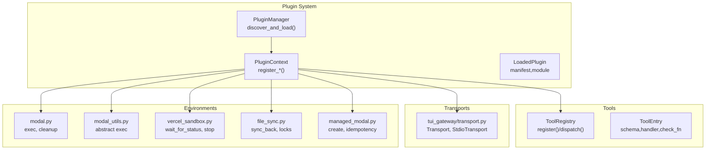
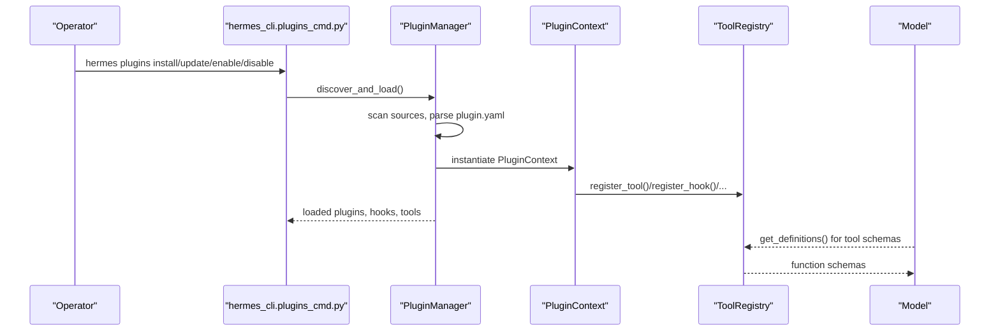
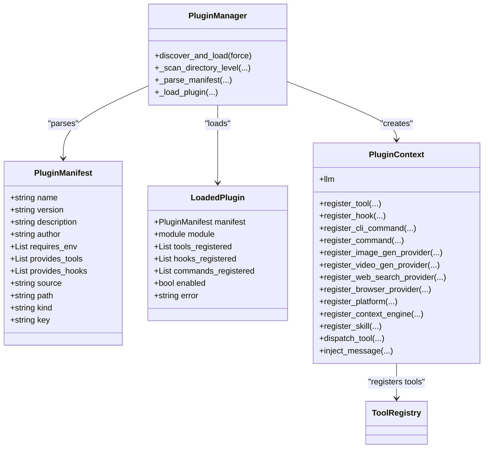
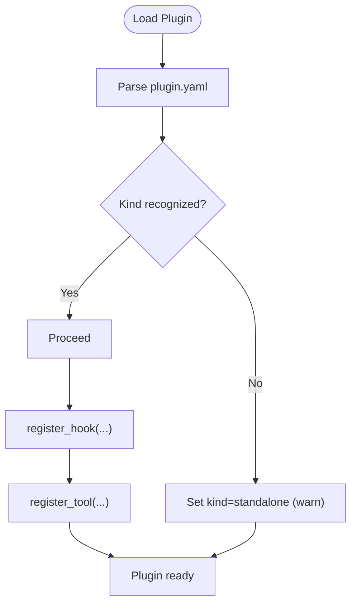
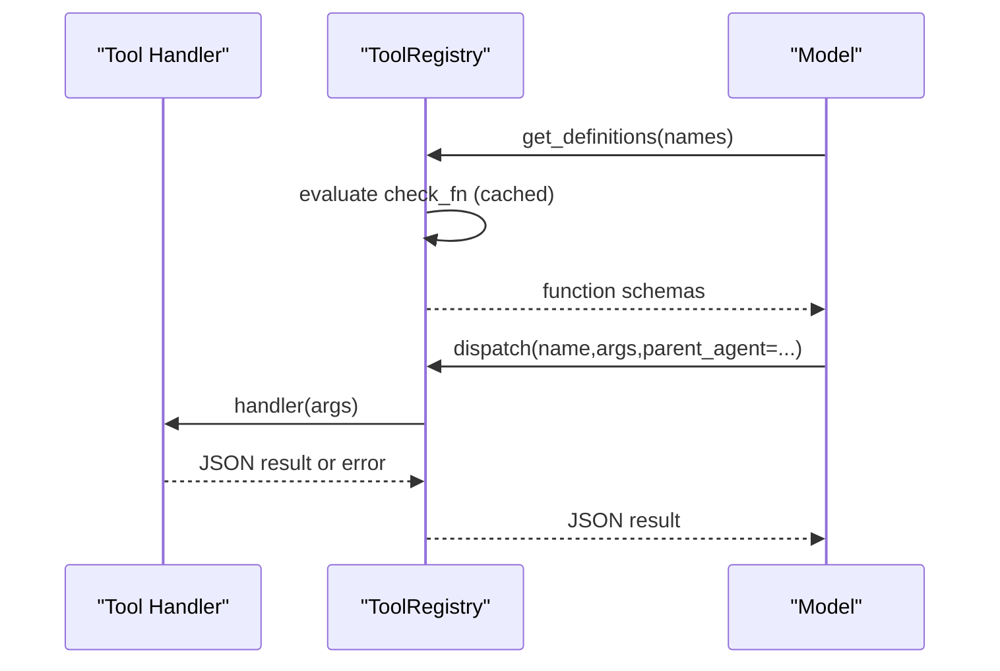
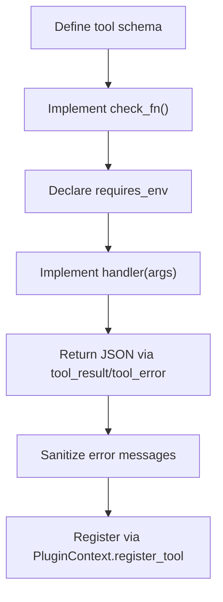
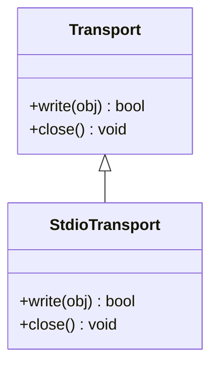
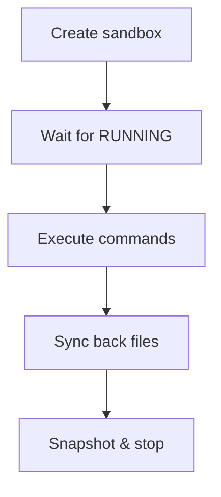
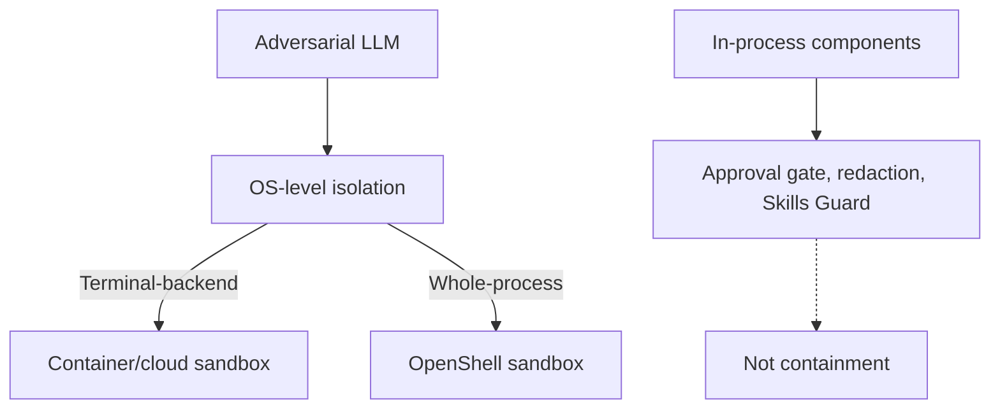
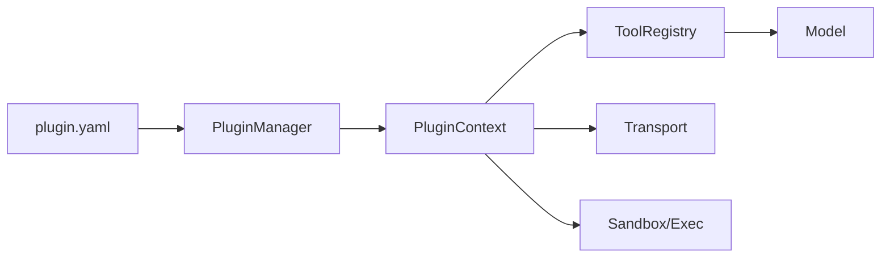

# Custom Extension Development

<cite>
**Referenced Files in This Document**
- [plugins.py](file://hermes_cli/plugins.py)
- [plugins_cmd.py](file://hermes_cli/plugins_cmd.py)
- [registry.py](file://tools/registry.py)
- [schema_sanitizer.py](file://tools/schema_sanitizer.py)
- [transport.py](file://tui_gateway/transport.py)
- [modal.py](file://tools/environments/modal.py)
- [modal_utils.py](file://tools/environments/modal_utils.py)
- [vercel_sandbox.py](file://tools/environments/vercel_sandbox.py)
- [file_sync.py](file://tools/environments/file_sync.py)
- [managed_modal.py](file://tools/environments/managed_modal.py)
- [client.py](file://plugins/spotify/client.py)
- [plugin.yaml](file://plugins/disk-cleanup/plugin.yaml)
- [plugin.yaml](file://plugins/google_meet/plugin.yaml)
- [plugin.yaml](file://plugins/spotify/plugin.yaml)
- [__init__.py](file://plugins/disk-cleanup/__init__.py)
- [__init__.py](file://plugins/google_meet/__init__.py)
- [__init__.py](file://plugins/spotify/__init__.py)
- [SECURITY.md](file://SECURITY.md)
- [security.md](file://website/docs/user-guide/security.md)
- [test_plugin_scanner_recursion.py](file://tests/hermes_cli/test_plugin_scanner_recursion.py)
- [test_registry.py](file://tests/tools/test_registry.py)
- [test_schema_sanitizer.py](file://tests/tools/test_schema_sanitizer.py)
- [test_daytona_environment.py](file://tests/tools/test_daytona_environment.py)
</cite>

## Table of Contents
1. [Introduction](#introduction)
2. [Project Structure](#project-structure)
3. [Core Components](#core-components)
4. [Architecture Overview](#architecture-overview)
5. [Detailed Component Analysis](#detailed-component-analysis)
6. [Dependency Analysis](#dependency-analysis)
7. [Performance Considerations](#performance-considerations)
8. [Troubleshooting Guide](#troubleshooting-guide)
9. [Conclusion](#conclusion)
10. [Appendices](#appendices)

## Introduction
This document explains how to develop custom extensions for the agent, focusing on the plugin system, custom tool creation, and advanced integration patterns. It covers plugin architecture, manifests and lifecycle, dependency resolution, tool registration and validation, sandboxing and security, and practical workflows for testing and deployment.

## Project Structure
The extension ecosystem spans several subsystems:
- Plugin system: discovery, loading, lifecycle hooks, and registration APIs
- Tool registry: centralized schema and handler management
- Transports: pluggable communication channels for the TUI gateway
- Sandboxed environments: secure execution backends for tools and terminals
- Security posture: trust model, credential scoping, and access control

**Diagram sources**
- [plugins.py:770-900](file://hermes_cli/plugins.py#L770-L900)
- [registry.py:151-200](file://tools/registry.py#L151-L200)
- [transport.py:66-103](file://tui_gateway/transport.py#L66-L103)
- [modal.py:417-452](file://tools/environments/modal.py#L417-L452)
- [modal_utils.py:188-199](file://tools/environments/modal_utils.py#L188-L199)
- [vercel_sandbox.py:396-435](file://tools/environments/vercel_sandbox.py#L396-L435)
- [file_sync.py:279-313](file://tools/environments/file_sync.py#L279-L313)
- [managed_modal.py:179-216](file://tools/environments/managed_modal.py#L179-L216)

**Section sources**
- [plugins.py:1-120](file://hermes_cli/plugins.py#L1-L120)
- [plugins_cmd.py:1-120](file://hermes_cli/plugins_cmd.py#L1-L120)
- [registry.py:1-80](file://tools/registry.py#L1-L80)
- [transport.py:66-103](file://tui_gateway/transport.py#L66-L103)

## Core Components
- Plugin Manager: discovers plugins from bundled, user, project, and pip sources; loads manifests; invokes lifecycle hooks; aggregates plugin contributions (tools, commands, providers).
- Plugin Context: exposes registration APIs for tools, hooks, CLI commands, slash commands, providers, and skills.
- Tool Registry: central schema and handler store; validates availability via check functions; dispatches tool calls; serializes results.
- Transport Layer: standardized JSON frame emission and context-bound transport binding for the TUI gateway.
- Sandboxed Environments: modal, Vercel, and managed modal backends for secure execution and file synchronization.

**Section sources**
- [plugins.py:128-170](file://hermes_cli/plugins.py#L128-L170)
- [plugins.py:287-764](file://hermes_cli/plugins.py#L287-L764)
- [registry.py:151-200](file://tools/registry.py#L151-L200)
- [registry.py:390-417](file://tools/registry.py#L390-L417)
- [transport.py:66-103](file://tui_gateway/transport.py#L66-L103)
- [modal.py:417-452](file://tools/environments/modal.py#L417-L452)

## Architecture Overview
The plugin system integrates with the agent core through a manifest-driven discovery and registration pipeline. Plugins contribute tools and hooks; the agent’s tool registry exposes schemas to the LLM; transports and environments provide secure execution contexts.

**Diagram sources**
- [plugins_cmd.py:438-520](file://hermes_cli/plugins_cmd.py#L438-L520)
- [plugins.py:790-850](file://hermes_cli/plugins.py#L790-L850)
- [registry.py:337-384](file://tools/registry.py#L337-L384)

## Detailed Component Analysis

### Plugin System Architecture
- Sources and precedence: bundled, user, project (opt-in), and pip entry-points. Later sources override earlier ones on name collisions.
- Manifest parsing: plugin.yaml must define a name and include either plugin.yaml or plugin.yml and an __init__.py exporting register(ctx).
- Lifecycle hooks: pre/post tool/LLM calls, transform hooks, gateway dispatch, approval lifecycle, session lifecycle.
- Kind semantics: standalone (opt-in), backend (built-in autoloads), exclusive (single provider), platform (gateway adapters), model-provider.
- PluginContext APIs: register_tool, register_hook, register_cli_command, register_command, register_*_provider, register_context_engine, register_skill.

**Diagram sources**
- [plugins.py:233-281](file://hermes_cli/plugins.py#L233-L281)
- [plugins.py:270-281](file://hermes_cli/plugins.py#L270-L281)
- [plugins.py:287-764](file://hermes_cli/plugins.py#L287-L764)
- [plugins.py:770-850](file://hermes_cli/plugins.py#L770-L850)

**Section sources**
- [plugins.py:55-66](file://hermes_cli/plugins.py#L55-L66)
- [plugins.py:128-170](file://hermes_cli/plugins.py#L128-L170)
- [plugins.py:233-281](file://hermes_cli/plugins.py#L233-L281)
- [plugins.py:287-764](file://hermes_cli/plugins.py#L287-L764)
- [plugins.py:770-850](file://hermes_cli/plugins.py#L770-L850)

### Plugin Manifests and Lifecycle Management
- Manifest fields: name, version, description, author, requires_env, provides_tools, provides_hooks, kind, key.
- Validation and defaults: unknown kinds fall back to standalone; missing name/path fields derive from directory names; plugin.yaml presence validated.
- Lifecycle: on_session_start/end/finalize/reset, pre/post tool/LLM/API calls, transform hooks, pre_gateway_dispatch, pre/post approval request/response.

**Diagram sources**
- [plugins.py:1027-1028](file://hermes_cli/plugins.py#L1027-L1028)
- [test_plugin_scanner_recursion.py:189-203](file://tests/hermes_cli/test_plugin_scanner_recursion.py#L189-L203)

**Section sources**
- [plugins.py:233-281](file://hermes_cli/plugins.py#L233-L281)
- [plugins.py:128-170](file://hermes_cli/plugins.py#L128-L170)
- [test_plugin_scanner_recursion.py:164-203](file://tests/hermes_cli/test_plugin_scanner_recursion.py#L164-L203)

### Tool Registration and Execution
- Central registry: ToolRegistry stores ToolEntry objects with schema, handler, check_fn, requires_env, is_async, emoji, and dynamic overrides.
- Availability checks: TTL-cached check_fn results; evaluates toolset availability; supports aliases.
- Dispatch: synchronous or bridged async execution; sanitizes tool errors; returns JSON strings.
- Dynamic schema overrides: runtime-dependent adjustments to tool descriptions or constraints.

**Diagram sources**
- [registry.py:337-384](file://tools/registry.py#L337-L384)
- [registry.py:390-417](file://tools/registry.py#L390-L417)

**Section sources**
- [registry.py:151-200](file://tools/registry.py#L151-L200)
- [registry.py:234-306](file://tools/registry.py#L234-L306)
- [registry.py:337-384](file://tools/registry.py#L337-L384)
- [registry.py:390-417](file://tools/registry.py#L390-L417)
- [test_registry.py:86-141](file://tests/tools/test_registry.py#L86-L141)

### Custom Tool Development
- Schema definition: define a JSON Schema for tool parameters; ensure required fields and properties are well-formed.
- Parameter validation: rely on the registry’s check_fn to gate availability; use requires_env to enforce credential presence.
- Execution handling: return JSON strings; use tool_error/tool_result helpers; handle exceptions safely; leverage async bridging for async handlers.
- Security: sanitize tool errors; avoid leaking secrets; follow environment scoping rules.

**Diagram sources**
- [registry.py:234-306](file://tools/registry.py#L234-L306)
- [registry.py:563-590](file://tools/registry.py#L563-L590)

**Section sources**
- [registry.py:234-306](file://tools/registry.py#L234-L306)
- [registry.py:563-590](file://tools/registry.py#L563-L590)
- [test_registry.py:115-141](file://tests/tools/test_registry.py#L115-L141)

### Advanced Integration Patterns
- Extending agent capabilities:
  - Register platform adapters via PluginContext.register_platform for gateway integrations.
  - Register image/video/web/browser providers to route tool calls to specialized backends.
  - Replace or augment the context engine via register_context_engine.
- Integrating external services:
  - Use PluginContext.register_*_provider to integrate with external APIs (e.g., Spotify client).
  - Gate access via requires_env and check_fn; surface friendly error messages.
- Building custom transports:
  - Implement the Transport protocol and bind it per-request using context variables for the TUI gateway.

**Diagram sources**
- [transport.py:66-103](file://tui_gateway/transport.py#L66-L103)

**Section sources**
- [plugins.py:643-698](file://hermes_cli/plugins.py#L643-L698)
- [plugins.py:529-582](file://hermes_cli/plugins.py#L529-L582)
- [client.py:41-112](file://plugins/spotify/client.py#L41-L112)
- [transport.py:66-103](file://tui_gateway/transport.py#L66-L103)

### Sandbox Environments and File Sync
- Modal/Vercel sandboxes: create, wait for running, exec commands, snapshot and stop; manage persistent filesystems and disk sizes.
- File synchronization: lock-based sync-back to reconcile remote changes; defensive size caps on archives.
- Managed modal: idempotent create with logical keys; guard unsupported credential passthrough.

**Diagram sources**
- [vercel_sandbox.py:396-435](file://tools/environments/vercel_sandbox.py#L396-L435)
- [modal.py:417-452](file://tools/environments/modal.py#L417-L452)
- [file_sync.py:279-313](file://tools/environments/file_sync.py#L279-L313)
- [managed_modal.py:179-216](file://tools/environments/managed_modal.py#L179-L216)

**Section sources**
- [vercel_sandbox.py:396-435](file://tools/environments/vercel_sandbox.py#L396-L435)
- [modal.py:417-452](file://tools/environments/modal.py#L417-L452)
- [file_sync.py:279-313](file://tools/environments/file_sync.py#L279-L313)
- [managed_modal.py:179-216](file://tools/environments/managed_modal.py#L179-L216)

### Plugin Security Considerations
- Trust model: the OS-level boundary is the only containment; in-process heuristics (approval gate, output redaction, Skills Guard) are not boundaries.
- Credential scoping: environment scrubbing for subprocesses; operators must review third-party plugins and skills.
- Access control: external surfaces require authorization; allowlists for network-exposed adapters; loopback-only defaults for local IPC.

**Diagram sources**
- [SECURITY.md:58-120](file://SECURITY.md#L58-L120)
- [SECURITY.md:154-169](file://SECURITY.md#L154-L169)
- [SECURITY.md:170-220](file://SECURITY.md#L170-L220)

**Section sources**
- [SECURITY.md:58-120](file://SECURITY.md#L58-L120)
- [SECURITY.md:154-169](file://SECURITY.md#L154-L169)
- [SECURITY.md:170-220](file://SECURITY.md#L170-L220)
- [security.md:426-446](file://website/docs/user-guide/security.md#L426-L446)

## Dependency Analysis
- Plugin discovery depends on manifest parsing and directory scanning; user plugins override bundled ones.
- Tool registration depends on the ToolRegistry singleton; availability gates are enforced by check_fn caching.
- Transport binding is request-scoped via context variables.
- Sandboxed environments depend on external services (Modal/Vercel) and file synchronization primitives.

**Diagram sources**
- [plugins.py:790-850](file://hermes_cli/plugins.py#L790-L850)
- [registry.py:151-200](file://tools/registry.py#L151-L200)
- [transport.py:77-98](file://tui_gateway/transport.py#L77-L98)

**Section sources**
- [plugins.py:790-850](file://hermes_cli/plugins.py#L790-L850)
- [registry.py:151-200](file://tools/registry.py#L151-L200)
- [transport.py:77-98](file://tui_gateway/transport.py#L77-L98)

## Performance Considerations
- Tool availability checks are TTL-cached to amortize expensive probes (e.g., Docker/Modal/Playwright checks).
- Registry dispatch bridges async handlers transparently; ensure handlers are efficient and avoid heavy synchronous work.
- Sandboxed environments introduce overhead; use idempotent create operations and minimize sync-back frequency.

[No sources needed since this section provides general guidance]

## Troubleshooting Guide
- Plugin not appearing:
  - Verify plugin.yaml presence and valid manifest fields; confirm plugin name/key and kind semantics.
  - Check enabled/disabled lists and source precedence.
- Tool not available:
  - Inspect check_fn results; ensure required environment variables are set.
  - Invalidate check_fn cache after configuration changes.
- Tool execution errors:
  - Review sanitized error messages; ensure handlers return JSON strings.
  - Validate schemas with the sanitizer to avoid backend rejections.
- Sandbox issues:
  - Confirm sandbox reached RUNNING state; handle terminal states and timeouts.
  - Ensure file sync respects locks and size caps.

**Section sources**
- [plugins.py:180-224](file://hermes_cli/plugins.py#L180-L224)
- [registry.py:126-149](file://tools/registry.py#L126-L149)
- [registry.py:390-417](file://tools/registry.py#L390-L417)
- [schema_sanitizer.py:207-239](file://tools/schema_sanitizer.py#L207-L239)
- [vercel_sandbox.py:396-435](file://tools/environments/vercel_sandbox.py#L396-L435)
- [file_sync.py:279-313](file://tools/environments/file_sync.py#L279-L313)

## Conclusion
Custom extensions in this agent are built around a robust plugin system, a centralized tool registry, and secure sandboxed environments. By following manifest conventions, implementing proper validation and error handling, and adhering to the security posture, developers can extend agent capabilities safely and effectively.

[No sources needed since this section summarizes without analyzing specific files]

## Appendices

### Practical Workflows
- Installing and enabling plugins:
  - Use the CLI to install from Git; the installer clones, copies example files, prompts for required environment variables, and optionally enables the plugin.
- Developing a plugin:
  - Create plugin.yaml and __init__.py; implement register(ctx) to call PluginContext.register_* APIs; define tool schemas and handlers; gate availability with check_fn and requires_env.
- Testing and validation:
  - Validate tool schemas with the sanitizer; test tool dispatch and error handling; verify plugin discovery and lifecycle hooks.
- Deployment:
  - Choose isolation posture (terminal-backend or whole-process wrapping); configure allowlists for external surfaces; review third-party plugins and skills before installation.

**Section sources**
- [plugins_cmd.py:438-520](file://hermes_cli/plugins_cmd.py#L438-L520)
- [plugin.yaml:1-8](file://plugins/disk-cleanup/plugin.yaml#L1-L8)
- [plugin.yaml:1-17](file://plugins/google_meet/plugin.yaml#L1-L17)
- [plugin.yaml:1-14](file://plugins/spotify/plugin.yaml#L1-L14)
- [__init__.py:309-317](file://plugins/disk-cleanup/__init__.py#L309-L317)
- [__init__.py:65-104](file://plugins/google_meet/__init__.py#L65-L104)
- [__init__.py:1-50](file://plugins/spotify/__init__.py#L1-L50)
- [test_schema_sanitizer.py:111-193](file://tests/tools/test_schema_sanitizer.py#L111-L193)
- [test_registry.py:115-141](file://tests/tools/test_registry.py#L115-L141)
- [test_daytona_environment.py:201-237](file://tests/tools/test_daytona_environment.py#L201-L237)