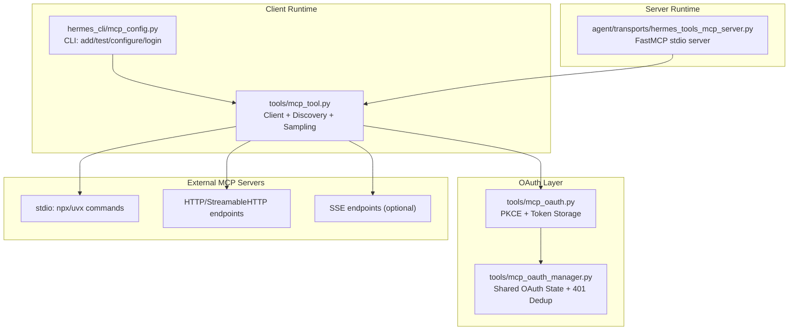
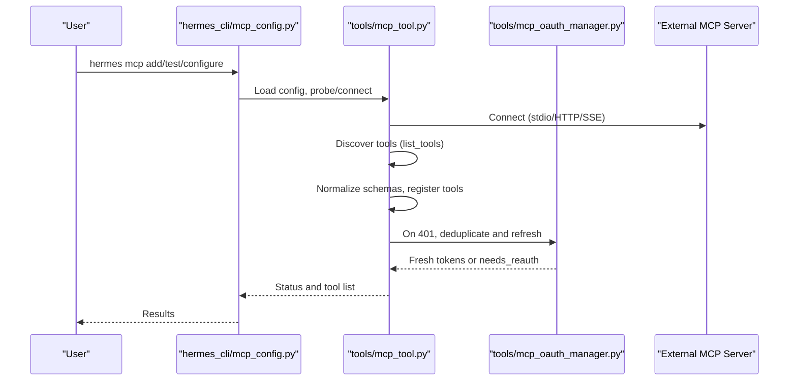
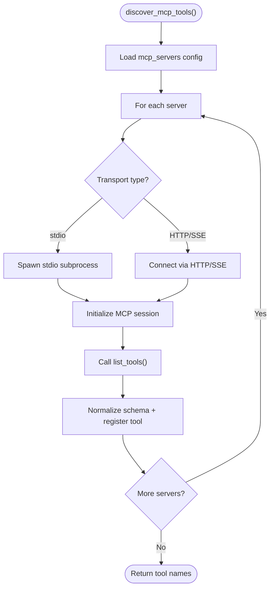
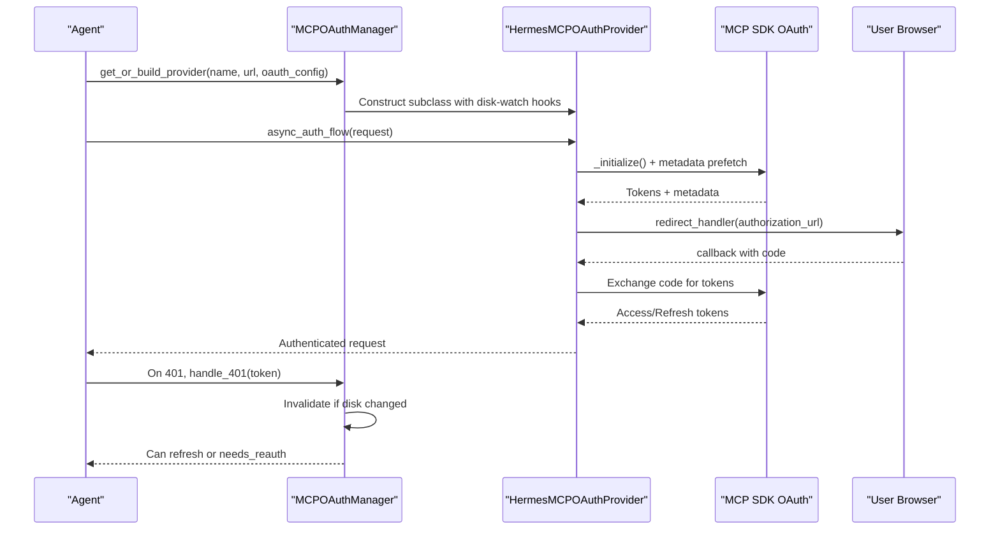
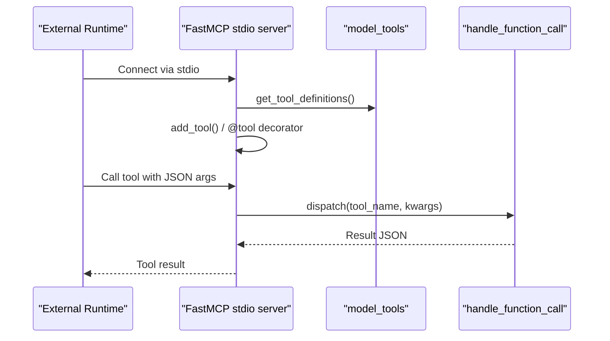
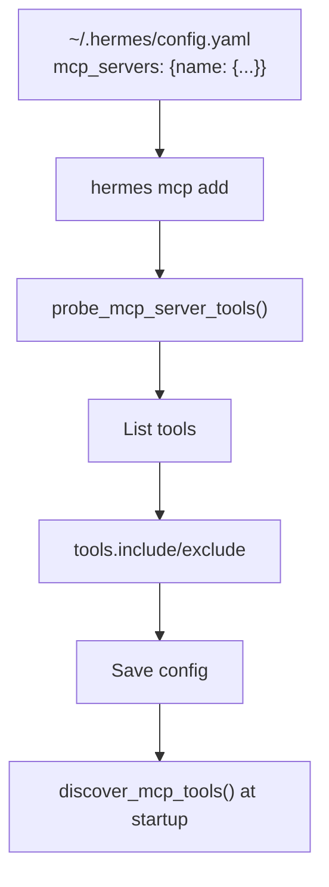
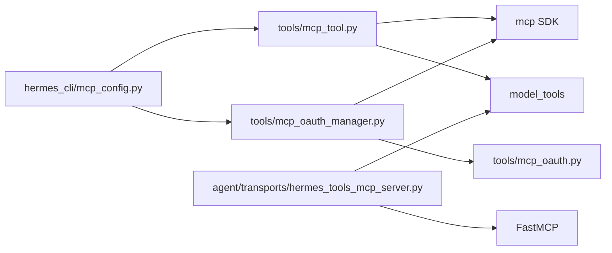

# MCP Integration

<cite>
**Referenced Files in This Document**
- [SKILL.md](file://skills/mcp/native-mcp/SKILL.md)
- [mcp-native-mcp.md](file://website/docs/user-guide/skills/bundled/mcp/mcp-native-mcp.md)
- [mcp_tool.py](file://tools/mcp_tool.py)
- [mcp_oauth.py](file://tools/mcp_oauth.py)
- [mcp_oauth_manager.py](file://tools/mcp_oauth_manager.py)
- [hermes_tools_mcp_server.py](file://agent/transports/hermes_tools_mcp_server.py)
- [mcp_config.py](file://hermes_cli/mcp_config.py)
- [test_mcp_tool.py](file://tests/tools/test_mcp_tool.py)
- [test_mcp_oauth_integration.py](file://tests/tools/test_mcp_oauth_integration.py)
- [test_mcp_probe.py](file://tests/tools/test_mcp_probe.py)
- [test_mcp_image_content.py](file://tests/tools/test_mcp_image_content.py)
- [cua_backend.py](file://tools/computer_use/cua_backend.py)
</cite>

## Table of Contents
1. [Introduction](#introduction)
2. [Project Structure](#project-structure)
3. [Core Components](#core-components)
4. [Architecture Overview](#architecture-overview)
5. [Detailed Component Analysis](#detailed-component-analysis)
6. [Dependency Analysis](#dependency-analysis)
7. [Performance Considerations](#performance-considerations)
8. [Troubleshooting Guide](#troubleshooting-guide)
9. [Conclusion](#conclusion)
10. [Appendices](#appendices)

## Introduction
This document explains how the repository integrates the Model Context Protocol (MCP) across three primary areas:
- MCP client: connecting to external MCP servers (stdio and HTTP/StreamableHTTP), discovering tools, and injecting them into the agent’s toolset.
- MCP server: exposing a curated set of Hermes tools via FastMCP over stdio for use by external runtimes (e.g., Codex).
- Advanced MCP features: OAuth 2.1 with PKCE, structured content handling, image processing, sampling (server-initiated LLM requests), and robust error handling.

It provides practical guidance for server setup, client configuration, authentication flows, dynamic discovery, and operational best practices.

## Project Structure
Key MCP-related modules and their roles:
- tools/mcp_tool.py: MCP client implementation (connections, discovery, tool registration, timeouts, sampling, image content handling).
- tools/mcp_oauth.py: OAuth 2.1 PKCE flow for MCP servers requiring authentication.
- tools/mcp_oauth_manager.py: Centralized OAuth state management and 401 handling.
- agent/transports/hermes_tools_mcp_server.py: FastMCP server exposing Hermes tools over stdio.
- hermes_cli/mcp_config.py: CLI for adding, listing, testing, configuring, and logging into MCP servers.
- skills/mcp/native-mcp/SKILL.md and website docs: User-facing configuration and usage guidance.
- tests/tools: Comprehensive unit tests validating schema normalization, OAuth flows, probing, and image content handling.

**Diagram sources**
- [mcp_tool.py:1-200](file://tools/mcp_tool.py#L1-L200)
- [mcp_config.py:1-120](file://hermes_cli/mcp_config.py#L1-L120)
- [mcp_oauth.py:1-120](file://tools/mcp_oauth.py#L1-L120)
- [mcp_oauth_manager.py:1-120](file://tools/mcp_oauth_manager.py#L1-L120)
- [hermes_tools_mcp_server.py:1-120](file://agent/transports/hermes_tools_mcp_server.py#L1-L120)

**Section sources**
- [SKILL.md:1-120](file://skills/mcp/native-mcp/SKILL.md#L1-L120)
- [mcp-native-mcp.md:1-120](file://website/docs/user-guide/skills/bundled/mcp/mcp-native-mcp.md#L1-L120)

## Core Components
- MCP Client (tools/mcp_tool.py)
  - Supports stdio (npx/uvx), HTTP/StreamableHTTP, and SSE transports.
  - Discovers tools via list_tools(), registers them with mcp_{server}_{tool} naming, and injects into Hermes toolsets.
  - Provides configurable timeouts, environment filtering for stdio, credential redaction, and sampling support.
- OAuth 2.1 (tools/mcp_oauth.py + tools/mcp_oauth_manager.py)
  - Implements PKCE-based authorization code flow with dynamic client registration and token refresh.
  - Centralizes token storage, cross-process reload, and 401 recovery with thundering-herd deduplication.
- MCP Server (agent/transports/hermes_tools_mcp_server.py)
  - Exposes a curated subset of Hermes tools via FastMCP over stdio for external runtimes.
  - Uses model_tools to dispatch to actual Hermes capabilities.
- CLI (hermes_cli/mcp_config.py)
  - Adds servers, probes for tools, lists servers, configures tool filters, and manages OAuth login.

**Section sources**
- [mcp_tool.py:1-200](file://tools/mcp_tool.py#L1-L200)
- [mcp_oauth.py:1-120](file://tools/mcp_oauth.py#L1-L120)
- [mcp_oauth_manager.py:1-120](file://tools/mcp_oauth_manager.py#L1-L120)
- [hermes_tools_mcp_server.py:1-120](file://agent/transports/hermes_tools_mcp_server.py#L1-L120)
- [mcp_config.py:1-120](file://hermes_cli/mcp_config.py#L1-L120)

## Architecture Overview
End-to-end MCP client flow and server exposure:

**Diagram sources**
- [mcp_config.py:226-420](file://hermes_cli/mcp_config.py#L226-L420)
- [mcp_tool.py:3284-3465](file://tools/mcp_tool.py#L3284-L3465)
- [mcp_oauth_manager.py:506-583](file://tools/mcp_oauth_manager.py#L506-L583)

## Detailed Component Analysis

### MCP Client: Discovery, Registration, and Execution
- Transport support
  - Stdio: spawns subprocess with filtered environment and optional env overrides.
  - HTTP/StreamableHTTP: requires mcp.client.streamable_http availability.
  - SSE: optional transport for servers using Server-Sent Events.
- Dynamic discovery
  - Calls list_tools() on each server and registers tools with mcp_{server}_{tool} naming.
  - Tool schemas are normalized and validated; missing inputSchema is handled gracefully.
- Execution and timeouts
  - Per-server tool timeouts and connection timeouts configurable.
  - Background event loop with thread-safe scheduling; graceful shutdown.
- Structured content and images
  - Converts MCP ImageContent blocks to MEDIA tags via a shared cache.
  - Supports sampling/createMessage for server-initiated LLM requests with rate limits and audit metrics.

**Diagram sources**
- [mcp_tool.py:3284-3465](file://tools/mcp_tool.py#L3284-L3465)

**Section sources**
- [mcp_tool.py:1-200](file://tools/mcp_tool.py#L1-L200)
- [mcp_tool.py:3284-3465](file://tools/mcp_tool.py#L3284-L3465)
- [test_mcp_tool.py:105-220](file://tests/tools/test_mcp_tool.py#L105-L220)
- [test_mcp_image_content.py:35-138](file://tests/tools/test_mcp_image_content.py#L35-L138)

### MCP OAuth Integration: PKCE, Token Storage, and Recovery
- OAuth 2.1 PKCE flow
  - Builds OAuthClientMetadata, optional pre-registration, and dynamic client registration.
  - Redirect handler opens browser; callback server captures authorization code.
- Token storage and persistence
  - Tokens and client info persisted to disk with restricted permissions.
  - Absolute expires_at persisted to ensure correct expiry computation after restarts.
- Shared manager and 401 handling
  - MCPOAuthManager centralizes provider instances, disk-watch for external refresh, and 401 recovery with in-flight deduplication.
  - Supports pre-flight metadata discovery to avoid full browser reauth on cold starts.

**Diagram sources**
- [mcp_oauth_manager.py:339-583](file://tools/mcp_oauth_manager.py#L339-L583)
- [mcp_oauth.py:598-650](file://tools/mcp_oauth.py#L598-L650)

**Section sources**
- [mcp_oauth.py:1-200](file://tools/mcp_oauth.py#L1-L200)
- [mcp_oauth_manager.py:1-200](file://tools/mcp_oauth_manager.py#L1-L200)
- [test_mcp_oauth_integration.py:35-70](file://tests/tools/test_mcp_oauth_integration.py#L35-L70)

### MCP Server Exposure: FastMCP over Stdio
- Purpose
  - Expose Hermes tools to external runtimes (e.g., Codex) via stdio FastMCP server.
- Scope
  - Curated tools only (web search, browser automation, vision, image generation, skills, TTS, Kanban).
  - Excludes tools requiring mid-loop state (delegate_task, memory, session_search, todo).
- Registration
  - Uses model_tools.get_tool_definitions to pull authoritative schemas and dispatch via handle_function_call.
  - Supports both modern and legacy mcp SDK signatures for tool registration.

**Diagram sources**
- [hermes_tools_mcp_server.py:108-194](file://agent/transports/hermes_tools_mcp_server.py#L108-L194)

**Section sources**
- [hermes_tools_mcp_server.py:1-234](file://agent/transports/hermes_tools_mcp_server.py#L1-L234)

### Client Configuration, Authentication, and Dynamic Discovery
- Configuration locations and keys
  - mcp_servers entries define stdio (command/args/env) or HTTP (url/headers) transports.
  - Optional oauth block for OAuth 2.1 PKCE; optional tools.include/exclude filters.
- Authentication flows
  - Static headers for HTTP servers (via environment variable interpolation).
  - OAuth 2.1 PKCE via CLI “hermes mcp add” and “hermes mcp login”.
- Dynamic discovery
  - “hermes mcp test” performs a temporary connect and lists tools.
  - “hermes mcp configure” toggles tool filters interactively.

**Diagram sources**
- [mcp_config.py:167-222](file://hermes_cli/mcp_config.py#L167-L222)
- [mcp_tool.py:3426-3454](file://tools/mcp_tool.py#L3426-L3454)

**Section sources**
- [mcp_config.py:1-200](file://hermes_cli/mcp_config.py#L1-L200)
- [mcp_tool.py:3426-3454](file://tools/mcp_tool.py#L3426-L3454)
- [test_mcp_probe.py:24-219](file://tests/tools/test_mcp_probe.py#L24-L219)

### Advanced MCP Features
- Structured content handling
  - Sampling messages converted to OpenAI format; tool results and pure text/image content supported.
  - StructuredContent field from MCP results is preserved when present.
- Image content processing
  - Base64 image blocks decoded and cached; MEDIA tags emitted for rendering.
  - MIME-type to extension mapping with sensible defaults.
- MCP probe mechanism
  - Lightweight temporary connections to list tools without enabling servers.
- Sampling (server-initiated LLM requests)
  - Configurable max RPM, token caps, model overrides, and tool loop limits.
  - Audit metrics tracked per server.

**Section sources**
- [mcp_tool.py:622-800](file://tools/mcp_tool.py#L622-L800)
- [mcp_tool.py:438-494](file://tools/mcp_tool.py#L438-L494)
- [cua_backend.py:285-318](file://tools/computer_use/cua_backend.py#L285-L318)
- [test_mcp_image_content.py:35-138](file://tests/tools/test_mcp_image_content.py#L35-L138)

## Dependency Analysis
- MCP client depends on:
  - mcp Python SDK (optional) for transports and types.
  - asyncio and concurrent.futures for background execution.
  - model_tools for schema and dispatch in server exposure.
- OAuth layer depends on:
  - MCP SDK’s OAuthClientProvider and httpx for HTTP interactions.
  - Persistent token storage and disk-watch logic.
- CLI depends on:
  - tools.mcp_tool for probing and configuration updates.
  - tools.mcp_oauth_manager for OAuth login flows.

**Diagram sources**
- [mcp_tool.py:174-236](file://tools/mcp_tool.py#L174-L236)
- [mcp_oauth_manager.py:339-447](file://tools/mcp_oauth_manager.py#L339-L447)
- [mcp_config.py:1-120](file://hermes_cli/mcp_config.py#L1-L120)
- [hermes_tools_mcp_server.py:108-194](file://agent/transports/hermes_tools_mcp_server.py#L108-L194)

**Section sources**
- [mcp_tool.py:174-236](file://tools/mcp_tool.py#L174-L236)
- [mcp_oauth_manager.py:339-447](file://tools/mcp_oauth_manager.py#L339-L447)
- [mcp_config.py:1-120](file://hermes_cli/mcp_config.py#L1-L120)
- [hermes_tools_mcp_server.py:108-194](file://agent/transports/hermes_tools_mcp_server.py#L108-L194)

## Performance Considerations
- Background event loop
  - Dedicated asyncio loop in a daemon thread; tool calls scheduled thread-safely to avoid blocking.
- Timeouts
  - Separate per-server tool timeouts and connection timeouts; defaults tuned for reliability.
- Sampling limits
  - Sliding-window rate limiting, token caps, and tool loop limits prevent runaway server-initiated requests.
- Image caching
  - Efficient base64 decoding and shared cache reduce repeated processing overhead.

[No sources needed since this section provides general guidance]

## Troubleshooting Guide
Common issues and resolutions:
- MCP SDK not available
  - Install the mcp package; without it, MCP support is silently disabled.
- No MCP servers configured
  - Ensure mcp_servers key exists and is properly indented.
- Failed to connect to MCP server
  - Verify command availability (npx/uvx), package existence, and increase connect_timeout if needed.
  - For HTTP servers, check URL reachability and headers.
- HTTP transport not available
  - Upgrade mcp package to include streamable_http support.
- Tools not appearing
  - Confirm server listed under mcp_servers, correct YAML indentation, and tool names prefixed with mcp_{server}_{tool}.
- Connection keeps dropping
  - Client retries with exponential backoff; verify server availability and network.
- OAuth failures
  - Use “hermes mcp login” to force re-auth; ensure callback port is reachable (especially over SSH).

**Section sources**
- [SKILL.md:205-245](file://skills/mcp/native-mcp/SKILL.md#L205-L245)
- [mcp-native-mcp.md:223-263](file://website/docs/user-guide/skills/bundled/mcp/mcp-native-mcp.md#L223-L263)
- [mcp_config.py:585-641](file://hermes_cli/mcp_config.py#L585-L641)

## Conclusion
The repository provides a robust, production-ready MCP integration:
- MCP client with multi-transport support, dynamic discovery, structured content, and sampling.
- Secure OAuth 2.1 PKCE with persistent token storage and intelligent 401 recovery.
- MCP server exposing Hermes tools over stdio for external runtimes.
- Comprehensive CLI for lifecycle management and troubleshooting.

These components work together to enable seamless, secure, and powerful MCP integrations across diverse environments.

## Appendices

### Practical Deployment and Usage Examples
- Server setup
  - Stdio server via npx/uvx with filtered environment and optional env overrides.
  - HTTP server with headers and optional OAuth configuration.
- Client connections
  - Add servers via CLI, test connectivity, and configure tool filters.
- Tool execution
  - Tools appear with mcp_{server}_{tool} names; schemas normalized and validated.

**Section sources**
- [SKILL.md:246-358](file://skills/mcp/native-mcp/SKILL.md#L246-L358)
- [mcp-native-mcp.md:264-376](file://website/docs/user-guide/skills/bundled/mcp/mcp-native-mcp.md#L264-L376)
- [mcp_config.py:226-420](file://hermes_cli/mcp_config.py#L226-L420)