# Performance Optimization

<cite>
**Referenced Files in This Document**
- [context_compressor.py](file://agent/context_compressor.py)
- [prompt_caching.py](file://agent/prompt_caching.py)
- [rate_limit_tracker.py](file://agent/rate_limit_tracker.py)
- [async_utils.py](file://agent/async_utils.py)
- [memory_manager.py](file://agent/memory_manager.py)
- [conversation_compression.py](file://agent/conversation_compression.py)
- [model_metadata.py](file://agent/model_metadata.py)
- [retry_utils.py](file://agent/retry_utils.py)
- [usage_pricing.py](file://agent/usage_pricing.py)
- [auxiliary_client.py](file://agent/auxiliary_client.py)
- [tool_executor.py](file://agent/tool_executor.py)
- [tool_dispatch_helpers.py](file://agent/tool_dispatch_helpers.py)
</cite>

## Table of Contents
1. [Introduction](#introduction)
2. [Project Structure](#project-structure)
3. [Core Components](#core-components)
4. [Architecture Overview](#architecture-overview)
5. [Detailed Component Analysis](#detailed-component-analysis)
6. [Dependency Analysis](#dependency-analysis)
7. [Performance Considerations](#performance-considerations)
8. [Troubleshooting Guide](#troubleshooting-guide)
9. [Conclusion](#conclusion)
10. [Appendices](#appendices)

## Introduction
This document provides a comprehensive guide to performance optimization for AI agent deployments, focusing on scaling, runtime efficiency, and operational excellence. It synthesizes the repository’s performance-related modules to explain context compression strategies, prompt caching, rate limit management, asynchronous processing, memory optimization, concurrent operations, monitoring, profiling, bottleneck identification, advanced configuration tuning, resource allocation, and high-throughput deployment patterns. Practical examples and capacity planning guidance are included to support enterprise-grade systems.

## Project Structure
The performance-critical subsystems are primarily located under the agent/ directory and integrate with tools and plugins across the repository. Key areas include:
- Context compression and summarization for long conversations
- Prompt caching for providers that support it
- Rate limit tracking and display
- Asynchronous scheduling utilities
- Memory orchestration and streaming scrubbing
- Tool execution concurrency and safety gating
- Auxiliary client routing and fallback chains
- Model metadata and pricing utilities

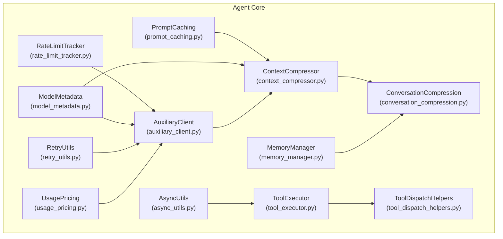

**Diagram sources**
- [context_compressor.py:454-800](file://agent/context_compressor.py#L454-L800)
- [prompt_caching.py:1-80](file://agent/prompt_caching.py#L1-L80)
- [rate_limit_tracker.py:1-247](file://agent/rate_limit_tracker.py#L1-L247)
- [async_utils.py:1-69](file://agent/async_utils.py#L1-L69)
- [memory_manager.py:1-556](file://agent/memory_manager.py#L1-L556)
- [conversation_compression.py:1-557](file://agent/conversation_compression.py#L1-L557)
- [model_metadata.py:1-800](file://agent/model_metadata.py#L1-L800)
- [retry_utils.py:1-58](file://agent/retry_utils.py#L1-L58)
- [usage_pricing.py:1-878](file://agent/usage_pricing.py#L1-L878)
- [auxiliary_client.py:1-800](file://agent/auxiliary_client.py#L1-L800)
- [tool_executor.py:1-921](file://agent/tool_executor.py#L1-L921)
- [tool_dispatch_helpers.py:1-337](file://agent/tool_dispatch_helpers.py#L1-L337)

**Section sources**
- [context_compressor.py:1-800](file://agent/context_compressor.py#L1-L800)
- [prompt_caching.py:1-80](file://agent/prompt_caching.py#L1-L80)
- [rate_limit_tracker.py:1-247](file://agent/rate_limit_tracker.py#L1-L247)
- [async_utils.py:1-69](file://agent/async_utils.py#L1-L69)
- [memory_manager.py:1-556](file://agent/memory_manager.py#L1-L556)
- [conversation_compression.py:1-557](file://agent/conversation_compression.py#L1-L557)
- [model_metadata.py:1-800](file://agent/model_metadata.py#L1-L800)
- [retry_utils.py:1-58](file://agent/retry_utils.py#L1-L58)
- [usage_pricing.py:1-878](file://agent/usage_pricing.py#L1-L878)
- [auxiliary_client.py:1-800](file://agent/auxiliary_client.py#L1-L800)
- [tool_executor.py:1-921](file://agent/tool_executor.py#L1-L921)
- [tool_dispatch_helpers.py:1-337](file://agent/tool_dispatch_helpers.py#L1-L337)

## Core Components
- Context compression and summarization: Reduces token usage by pruning tool outputs, stripping historical images, and iteratively updating summaries while protecting head and tail context.
- Prompt caching: Applies cache markers for Anthropic to reduce input token costs in multi-turn sessions.
- Rate limit tracking: Parses provider headers and formats human-readable displays for RPM/TPM and resets.
- Async scheduling: Leak-safe coroutine scheduling from synchronous contexts to event loops.
- Memory orchestration: Manages memory providers, sanitizes streaming context, and coordinates pre/post turn synchronization.
- Conversation compression: Feasibility checks for auxiliary compression models, compression execution, and session splitting.
- Model metadata and pricing: Resolves context windows, pricing, and usage normalization across providers.
- Retry utilities: Implements jittered backoff to decorrelate retries and avoid thundering herd.
- Auxiliary client: Provides robust provider resolution chains and fallbacks for text and multimodal tasks.
- Tool execution concurrency: Parallel tool dispatch with safety gating, path isolation, and interrupt propagation.

**Section sources**
- [context_compressor.py:454-800](file://agent/context_compressor.py#L454-L800)
- [prompt_caching.py:1-80](file://agent/prompt_caching.py#L1-L80)
- [rate_limit_tracker.py:1-247](file://agent/rate_limit_tracker.py#L1-L247)
- [async_utils.py:1-69](file://agent/async_utils.py#L1-L69)
- [memory_manager.py:1-556](file://agent/memory_manager.py#L1-L556)
- [conversation_compression.py:1-557](file://agent/conversation_compression.py#L1-L557)
- [model_metadata.py:1-800](file://agent/model_metadata.py#L1-L800)
- [retry_utils.py:1-58](file://agent/retry_utils.py#L1-L58)
- [usage_pricing.py:1-878](file://agent/usage_pricing.py#L1-L878)
- [auxiliary_client.py:1-800](file://agent/auxiliary_client.py#L1-L800)
- [tool_executor.py:1-921](file://agent/tool_executor.py#L1-L921)
- [tool_dispatch_helpers.py:1-337](file://agent/tool_dispatch_helpers.py#L1-L337)

## Architecture Overview
The performance architecture integrates context compression, auxiliary clients, and tool execution to minimize latency and maximize throughput. The auxiliary client resolves providers and models, while the context compressor reduces input size. Rate limits and retries are handled centrally, and memory orchestration ensures streaming safety and efficient recall.

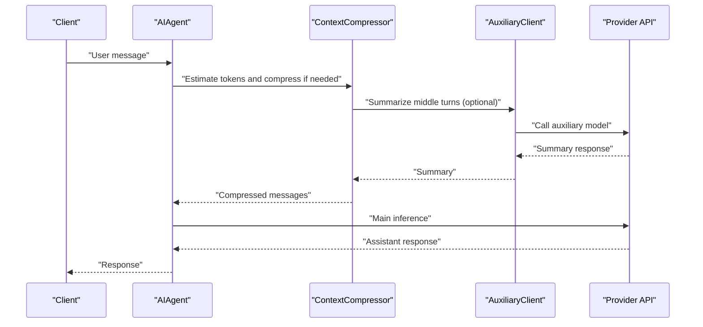

**Diagram sources**
- [context_compressor.py:454-800](file://agent/context_compressor.py#L454-L800)
- [auxiliary_client.py:1-800](file://agent/auxiliary_client.py#L1-L800)

## Detailed Component Analysis

### Context Compression Strategies
- Tool output pruning: Deduplicates identical tool results and replaces large outputs with concise summaries.
- Historical media stripping: Removes image payloads from older messages to avoid resending large base64 blobs.
- Iterative summary updates: Preserves information across multiple compaction passes.
- Tail protection: Uses token budgets to protect recent context instead of fixed counts.
- Threshold calibration: Adapts thresholds when model context changes.

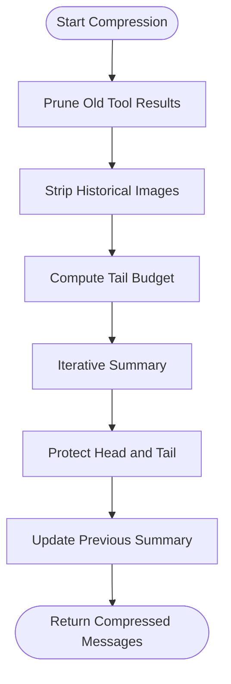

**Diagram sources**
- [context_compressor.py:627-794](file://agent/context_compressor.py#L627-L794)

**Section sources**
- [context_compressor.py:454-800](file://agent/context_compressor.py#L454-L800)

### Prompt Caching Mechanisms
- Anthropic cache control: Applies cache markers to system and last N non-system messages for a single TTL.
- Single layout strategy: Reduces input token costs by ~75% within a session.

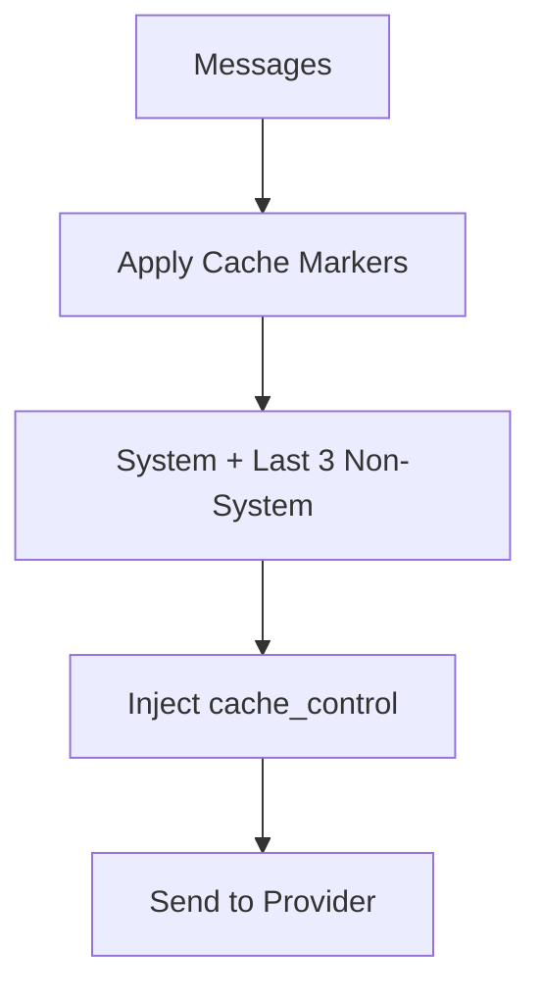

**Diagram sources**
- [prompt_caching.py:49-80](file://agent/prompt_caching.py#L49-L80)

**Section sources**
- [prompt_caching.py:1-80](file://agent/prompt_caching.py#L1-L80)

### Rate Limit Management
- Header parsing: Supports x-ratelimit-* headers across providers.
- Bucket modeling: Tracks requests/min, requests/hr, tokens/min, tokens/hr.
- Formatted display: Human-friendly usage bars and reset timers.
- Compact status: One-line summaries for dashboards.

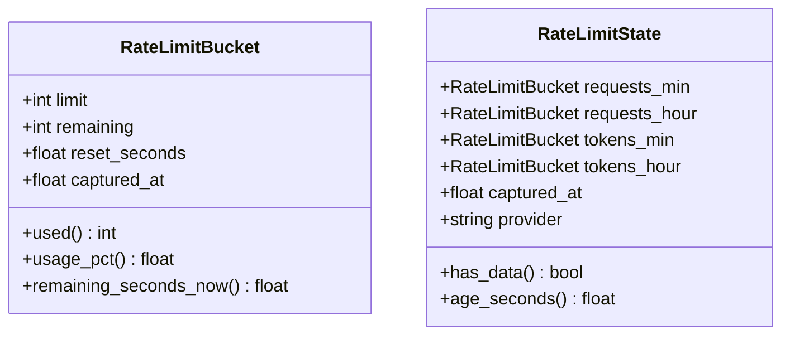

**Diagram sources**
- [rate_limit_tracker.py:30-130](file://agent/rate_limit_tracker.py#L30-L130)

**Section sources**
- [rate_limit_tracker.py:1-247](file://agent/rate_limit_tracker.py#L1-L247)

### Asynchronous Processing Patterns
- Safe scheduling: Closes coroutines on scheduling failure to prevent leaks and warnings.
- Thread-to-event loop coordination: Bridges synchronous contexts to async loops.

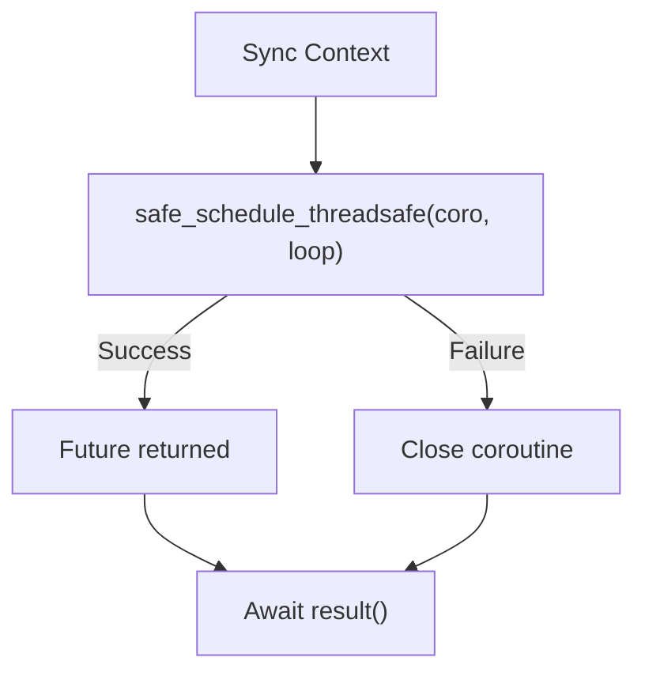

**Diagram sources**
- [async_utils.py:34-69](file://agent/async_utils.py#L34-L69)

**Section sources**
- [async_utils.py:1-69](file://agent/async_utils.py#L1-L69)

### Memory Optimization and Streaming Scrubbing
- Streaming scrubber: State machine to safely strip memory fences across chunk boundaries.
- Sanitization: Removes injected context blocks and system notes from provider output.
- Provider orchestration: Coordinates prefetch, sync, and tool routing across providers.

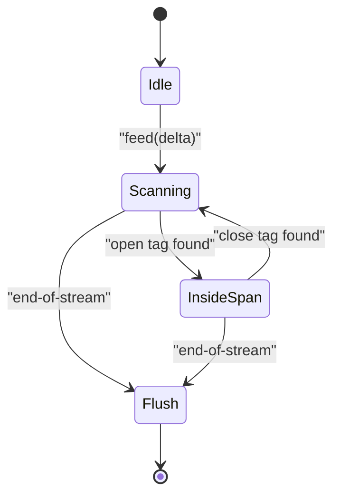

**Diagram sources**
- [memory_manager.py:62-157](file://agent/memory_manager.py#L62-L157)

**Section sources**
- [memory_manager.py:1-556](file://agent/memory_manager.py#L1-L556)

### Concurrent Operation Strategies
- Parallel tool dispatch: Batch tools when safe; gated by destructive command heuristics and path overlap checks.
- Worker thread pool: Up to a bounded number of workers; collects results in original order.
- Interrupt propagation: Cancels pending futures and tears down worker state cleanly.
- Safety gating: Prevents concurrent execution of interactive tools and overlapping file mutations.

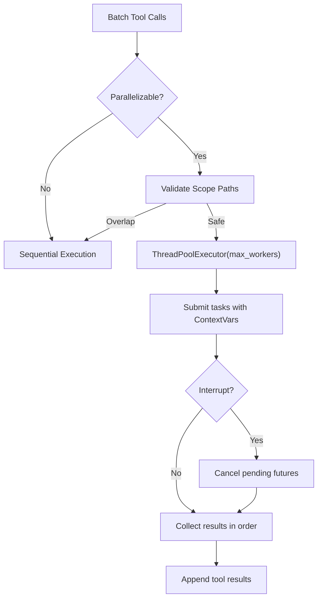

**Diagram sources**
- [tool_executor.py:64-472](file://agent/tool_executor.py#L64-L472)
- [tool_dispatch_helpers.py:103-147](file://agent/tool_dispatch_helpers.py#L103-L147)

**Section sources**
- [tool_executor.py:1-921](file://agent/tool_executor.py#L1-L921)
- [tool_dispatch_helpers.py:1-337](file://agent/tool_dispatch_helpers.py#L1-L337)

### Auxiliary Client Routing and Fallbacks
- Resolution chains: Auto-selects best provider for text and multimodal tasks.
- Payment fallback: Retries on credit exhaustion using next available provider.
- Lazy SDK loading: Defers OpenAI SDK import to reduce cold-start overhead.
- Vision model mapping: Provider-specific multimodal models for exotic providers.

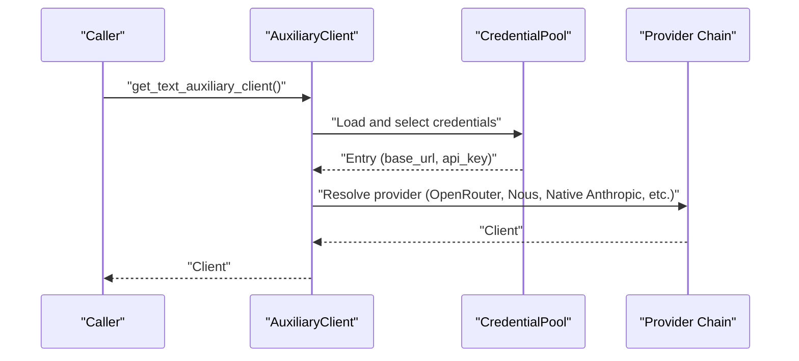

**Diagram sources**
- [auxiliary_client.py:1-800](file://agent/auxiliary_client.py#L1-L800)

**Section sources**
- [auxiliary_client.py:1-800](file://agent/auxiliary_client.py#L1-L800)

### Model Metadata and Pricing Utilities
- Context length detection: Resolves provider-specific context windows and caches metadata.
- Pricing lookup: Normalizes usage and estimates costs across providers and APIs.
- Canonical usage: Handles provider differences in token accounting and cache semantics.

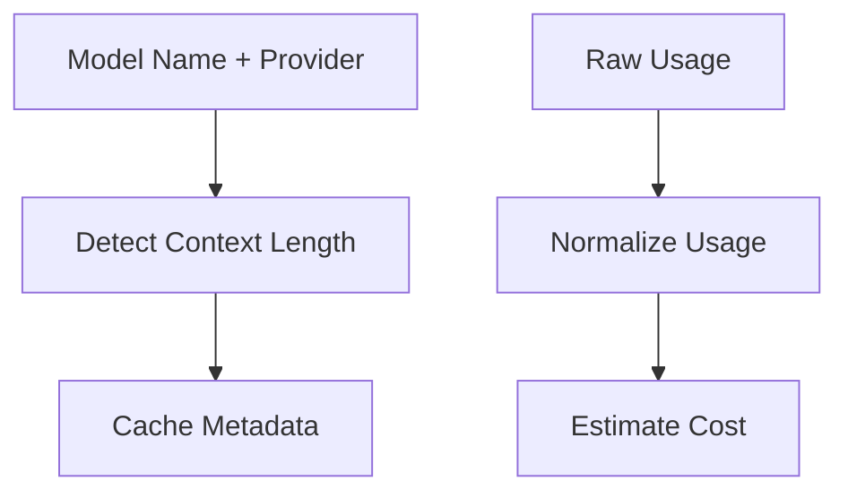

**Diagram sources**
- [model_metadata.py:611-789](file://agent/model_metadata.py#L611-L789)
- [usage_pricing.py:642-800](file://agent/usage_pricing.py#L642-L800)

**Section sources**
- [model_metadata.py:1-800](file://agent/model_metadata.py#L1-L800)
- [usage_pricing.py:1-878](file://agent/usage_pricing.py#L1-L878)

## Dependency Analysis
Key dependencies and coupling:
- ContextCompressor depends on model metadata for thresholds and on auxiliary client for summarization.
- ConversationCompression orchestrates context compression feasibility and session splitting.
- ToolExecutor depends on ToolDispatchHelpers for safety gating and on MemoryManager for tool routing.
- AuxiliaryClient integrates with credential pools and provider chains.
- RateLimitTracker and RetryUtils support resilient API interactions.

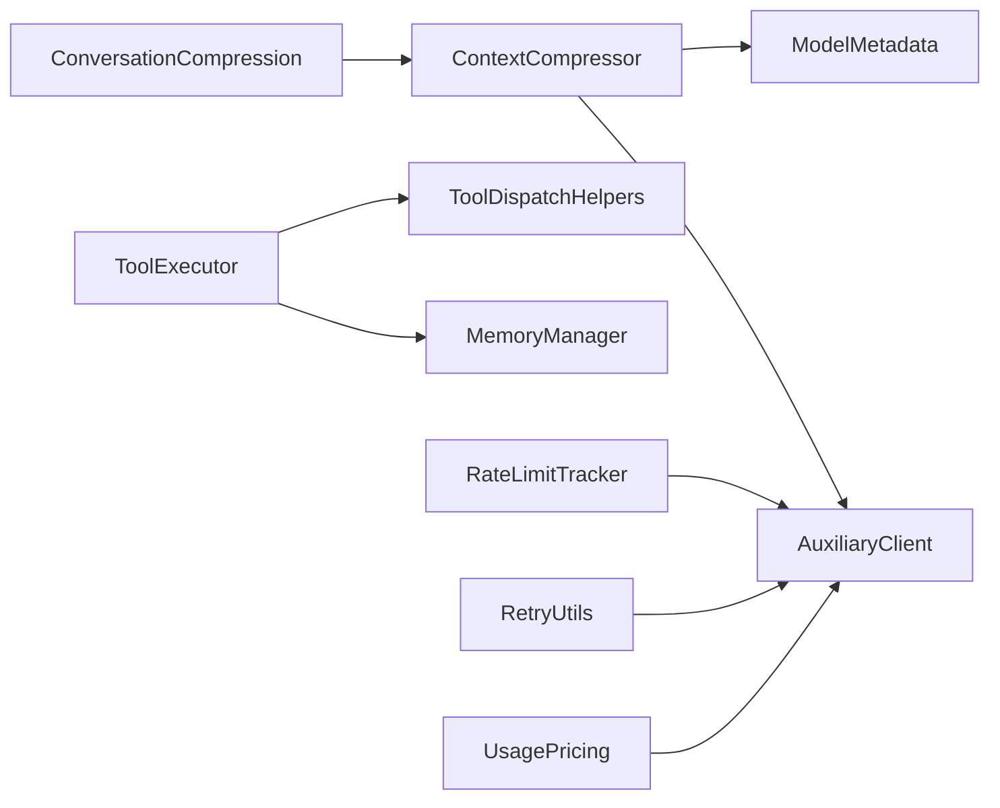

**Diagram sources**
- [context_compressor.py:454-800](file://agent/context_compressor.py#L454-L800)
- [conversation_compression.py:1-557](file://agent/conversation_compression.py#L1-L557)
- [tool_executor.py:1-921](file://agent/tool_executor.py#L1-L921)
- [tool_dispatch_helpers.py:1-337](file://agent/tool_dispatch_helpers.py#L1-L337)
- [auxiliary_client.py:1-800](file://agent/auxiliary_client.py#L1-L800)
- [rate_limit_tracker.py:1-247](file://agent/rate_limit_tracker.py#L1-L247)
- [retry_utils.py:1-58](file://agent/retry_utils.py#L1-L58)
- [usage_pricing.py:1-878](file://agent/usage_pricing.py#L1-L878)

**Section sources**
- [context_compressor.py:1-800](file://agent/context_compressor.py#L1-L800)
- [conversation_compression.py:1-557](file://agent/conversation_compression.py#L1-L557)
- [tool_executor.py:1-921](file://agent/tool_executor.py#L1-L921)
- [tool_dispatch_helpers.py:1-337](file://agent/tool_dispatch_helpers.py#L1-L337)
- [auxiliary_client.py:1-800](file://agent/auxiliary_client.py#L1-L800)
- [rate_limit_tracker.py:1-247](file://agent/rate_limit_tracker.py#L1-L247)
- [retry_utils.py:1-58](file://agent/retry_utils.py#L1-L58)
- [usage_pricing.py:1-878](file://agent/usage_pricing.py#L1-L878)

## Performance Considerations
- Context compression
  - Tune summary target ratio and tail budgets to balance accuracy and token savings.
  - Use iterative updates to preserve information across compactions.
  - Apply image stripping and tool output pruning to reduce input size.
- Prompt caching
  - Enable cache control for Anthropic to cut input tokens in multi-turn sessions.
  - Align TTL with session length to maximize reuse.
- Rate limiting
  - Monitor usage bars and resets; proactively throttle to avoid penalties.
  - Use compact status for dashboards and alerts.
- Concurrency
  - Limit worker threads to avoid contention; ensure path isolation for file tools.
  - Use safety gating to prevent destructive or interactive conflicts.
- Asynchrony
  - Use safe scheduling to avoid coroutine leaks and warnings.
  - Decorrelate retries with jittered backoff to prevent thundering herd.
- Auxiliary routing
  - Prefer provider chains with adequate context windows for compression.
  - Cache metadata to reduce repeated probing.
- Pricing and usage
  - Normalize usage across providers and estimate costs for budgeting.
  - Track cache reads/writes to optimize prompt reuse.

[No sources needed since this section provides general guidance]

## Troubleshooting Guide
- Compression effectiveness
  - If recent compressions saved <10% each, compression is skipped to avoid thrashing—consider starting a new session or using focused compression topics.
  - Verify auxiliary compression model context window meets threshold; adjust model or threshold accordingly.
- Image too large
  - Use image-shrink recovery to re-encode base64 images under provider ceilings.
- Rate limit warnings
  - Review formatted displays for high usage and upcoming resets; adjust request pacing.
- Interrupt handling
  - Concurrent tool execution cancels pending futures on interrupt; verify worker cleanup and thread-local callback clearing.
- Async scheduling failures
  - Confirm loop availability and handle coroutine closure to prevent leaks.

**Section sources**
- [conversation_compression.py:243-436](file://agent/conversation_compression.py#L243-L436)
- [context_compressor.py:601-622](file://agent/context_compressor.py#L601-L622)
- [rate_limit_tracker.py:182-247](file://agent/rate_limit_tracker.py#L182-L247)
- [tool_executor.py:314-327](file://agent/tool_executor.py#L314-L327)
- [async_utils.py:34-69](file://agent/async_utils.py#L34-L69)

## Conclusion
By combining context compression, prompt caching, robust rate limit handling, safe asynchronous scheduling, memory orchestration, and concurrent tool execution with strong safety gating, the system achieves scalable, high-throughput AI agent deployments. Advanced configuration tuning, resource allocation strategies, and careful monitoring enable sustained performance in enterprise environments.

[No sources needed since this section summarizes without analyzing specific files]

## Appendices

### Practical Examples and Capacity Planning
- Context compression
  - Example: Adjust summary target ratio to 20% and protect last 20K tokens for tail budget to balance accuracy and token savings.
  - Example: Use iterative summary updates to preserve cross-session information.
- Prompt caching
  - Example: Apply Anthropic cache control with 5-minute TTL for single-session reuse.
- Concurrency
  - Example: Limit worker threads to 8; ensure file tools target disjoint paths to avoid contention.
- Rate limiting
  - Example: Monitor “Requests/min” and “Tokens/min” usage bars; reduce burstiness to stay under 80% usage.
- Auxiliary routing
  - Example: Select auxiliary models with sufficient context windows for compression; cache metadata to avoid repeated probing.
- Pricing
  - Example: Normalize usage and estimate monthly costs using pricing entries; track cache read/write impacts.

[No sources needed since this section provides general guidance]