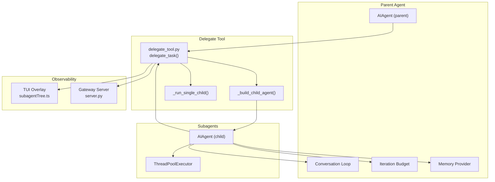
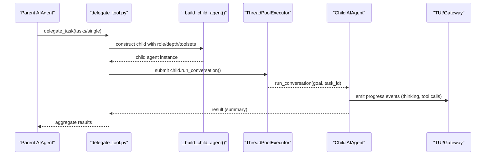
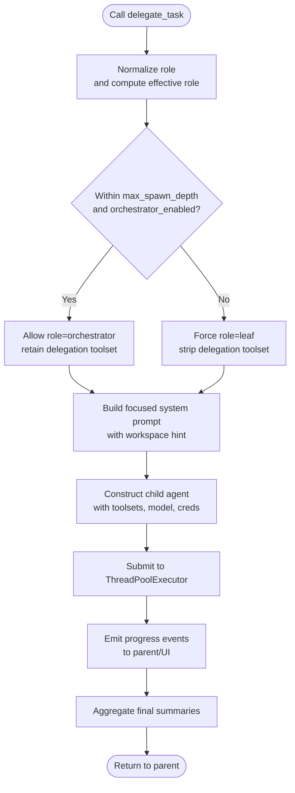
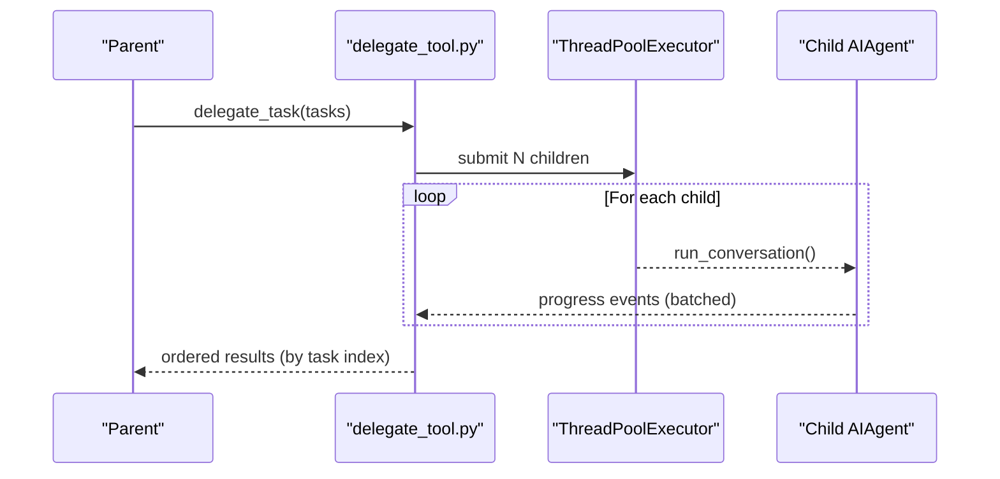
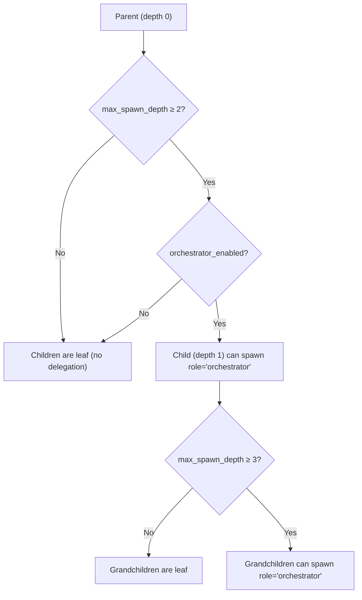
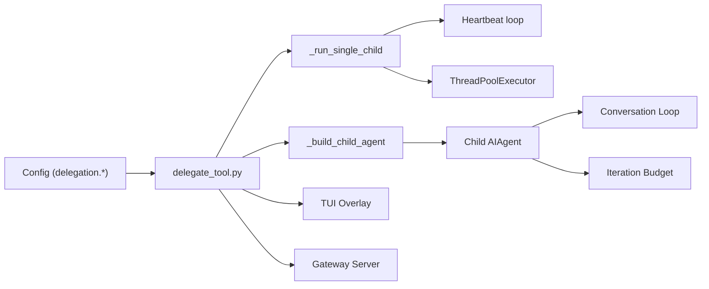

# Subagent Orchestration

<cite>
**Referenced Files in This Document**
- [delegate_tool.py](file://tools/delegate_tool.py)
- [delegation.md](file://website/docs/user-guide/features/delegation.md)
- [SKILL.md](file://skills/software-development/subagent-driven-development/SKILL.md)
- [conversation_loop.py](file://agent/conversation_loop.py)
- [iteration_budget.py](file://agent/iteration_budget.py)
- [memory_provider.py](file://agent/memory_provider.py)
- [process_bootstrap.py](file://agent/process_bootstrap.py)
- [subagentTree.ts](file://ui-tui/src/lib/subagentTree.ts)
- [server.py](file://tui_gateway/server.py)
- [test_delegate.py](file://tests/tools/test_delegate.py)
</cite>

## Table of Contents
1. [Introduction](#introduction)
2. [Project Structure](#project-structure)
3. [Core Components](#core-components)
4. [Architecture Overview](#architecture-overview)
5. [Detailed Component Analysis](#detailed-component-analysis)
6. [Dependency Analysis](#dependency-analysis)
7. [Performance Considerations](#performance-considerations)
8. [Troubleshooting Guide](#troubleshooting-guide)
9. [Conclusion](#conclusion)
10. [Appendices](#appendices)

## Introduction
This document explains subagent orchestration in the system, focusing on multi-agent workflows, parallel processing, and complex task delegation. It covers how subagents are spawned, coordinated, and monitored; how roles and depth limits govern nested orchestration; and how results are aggregated. It also documents parallel execution, resource allocation, conflict resolution, hierarchical delegation, cross-agent communication, shared memory management, security and isolation, and practical optimization and troubleshooting patterns.

## Project Structure
The subagent orchestration spans several subsystems:
- Tooling: the delegate_task tool constructs and runs child agents, manages concurrency, timeouts, and progress reporting.
- Agent runtime: conversation loop, iteration budget, and memory provider integrate subagent outputs into the parent’s context.
- UI/TUI: observability overlays reconstruct and visualize the subagent spawn tree and metrics.
- Gateway: server-side persistence and retrieval of subagent spawn trees for auditing and post-hoc review.
- Tests: validate configuration behavior such as concurrency and depth limits.

**Diagram sources**
- [delegate_tool.py:870-1174](file://tools/delegate_tool.py#L870-L1174)
- [conversation_loop.py:2900-2931](file://agent/conversation_loop.py#L2900-L2931)
- [iteration_budget.py:17-62](file://agent/iteration_budget.py#L17-L62)
- [memory_provider.py:214-225](file://agent/memory_provider.py#L214-L225)
- [subagentTree.ts:17-48](file://ui-tui/src/lib/subagentTree.ts#L17-L48)
- [server.py:2846-2869](file://tui_gateway/server.py#L2846-L2869)

**Section sources**
- [delegate_tool.py:1-17](file://tools/delegate_tool.py#L1-L17)
- [delegation.md:1-11](file://website/docs/user-guide/features/delegation.md#L1-L11)

## Core Components
- delegate_task: The primary orchestration entry point that spawns isolated subagents, supports single and batch modes, and aggregates results.
- Subagent construction: Builds child agents with focused system prompts, restricted toolsets, and isolated sessions.
- Progress and monitoring: Relays tool calls and thinking to the parent, supports TUI overlays and gateway observability.
- Concurrency and timeouts: Thread pool-backed execution with configurable max concurrency and child timeouts.
- Nested orchestration: Role-based delegation and depth limits control when children can spawn further.
- Resource control: Iteration budgets and per-child max_iterations prevent runaway consumption.
- Memory integration: Parent observes subagent outcomes via memory provider hooks.

**Section sources**
- [delegate_tool.py:870-1174](file://tools/delegate_tool.py#L870-L1174)
- [delegation.md:120-131](file://website/docs/user-guide/features/delegation.md#L120-L131)
- [iteration_budget.py:17-62](file://agent/iteration_budget.py#L17-L62)
- [memory_provider.py:214-225](file://agent/memory_provider.py#L214-L225)

## Architecture Overview
The subagent architecture centers on a parent AIAgent invoking delegate_task, which:
- Resolves role and depth limits.
- Constructs child agents with isolated toolsets and system prompts.
- Executes children in parallel (single-threaded for single-task) with a thread pool.
- Surfaces progress to the parent and UI/Gateway.
- Aggregates final summaries into the parent’s context.

**Diagram sources**
- [delegate_tool.py:870-1174](file://tools/delegate_tool.py#L870-L1174)
- [conversation_loop.py:2900-2931](file://agent/conversation_loop.py#L2900-L2931)
- [delegation.md:120-131](file://website/docs/user-guide/features/delegation.md#L120-L131)

## Detailed Component Analysis

### Subagent Spawning and Coordination
- Role resolution: The caller’s role is normalized; orchestrator children can spawn further only when depth allows and the orchestrator feature is enabled.
- Toolset restriction: Blocked tools are stripped for leaf children; orchestrators retain delegation toolset.
- System prompt composition: Includes task, context, workspace hint, and role-specific guidance.
- Credential and model overrides: Subagents can inherit or override provider/model/API mode; credential pools are shared to enable rotation.
- Progress callback: Bridges child tool calls and thinking to the parent and UI.

**Diagram sources**
- [delegate_tool.py:904-913](file://tools/delegate_tool.py#L904-L913)
- [delegate_tool.py:971-978](file://tools/delegate_tool.py#L971-L978)
- [delegate_tool.py:1106-1137](file://tools/delegate_tool.py#L1106-L1137)

**Section sources**
- [delegate_tool.py:904-913](file://tools/delegate_tool.py#L904-L913)
- [delegate_tool.py:971-978](file://tools/delegate_tool.py#L971-L978)
- [delegate_tool.py:1106-1137](file://tools/delegate_tool.py#L1106-L1137)

### Parallel Processing and Concurrency
- Max concurrency: Controlled by delegation.max_concurrent_children (default 3), with no hard upper bound enforced.
- Execution model: Single-task runs synchronously; batch mode uses ThreadPoolExecutor with a configurable worker limit.
- Progress batching: Tool names are batched and relayed to the parent callback; per-subagent counters track tool usage.
- Heartbeat and staleness: Child activity is periodically surfaced to prevent gateway inactivity timeouts; stale detection distinguishes idle vs in-tool delays.

**Diagram sources**
- [delegate_tool.py:1492-1512](file://tools/delegate_tool.py#L1492-L1512)
- [delegate_tool.py:851-864](file://tools/delegate_tool.py#L851-L864)

**Section sources**
- [delegate_tool.py:1492-1512](file://tools/delegate_tool.py#L1492-L1512)
- [delegate_tool.py:851-864](file://tools/delegate_tool.py#L851-L864)
- [delegation.md:120-131](file://website/docs/user-guide/features/delegation.md#L120-L131)

### Nested Orchestration and Hierarchical Delegation
- Depth limits: max_spawn_depth caps the delegation tree; default is 1 (flat), allowing 2 or 3 for deeper nesting.
- Orchestrator kill switch: orchestrator_enabled disables nested delegation globally.
- Role semantics: role="orchestrator" allows a child to spawn its own workers up to the depth cap; otherwise treated as leaf.

**Diagram sources**
- [delegate_tool.py:394-429](file://tools/delegate_tool.py#L394-L429)
- [delegate_tool.py:432-446](file://tools/delegate_tool.py#L432-L446)
- [delegation.md:202-220](file://website/docs/user-guide/features/delegation.md#L202-L220)

**Section sources**
- [delegate_tool.py:394-429](file://tools/delegate_tool.py#L394-L429)
- [delegate_tool.py:432-446](file://tools/delegate_tool.py#L432-L446)
- [delegation.md:202-220](file://website/docs/user-guide/features/delegation.md#L202-L220)

### Task Partitioning and Result Aggregation
- Task partitioning: Split complex goals into independent subtasks; batch mode runs multiple tasks concurrently.
- Result aggregation: Only final summaries enter the parent’s context; intermediate tool calls remain isolated to each child.
- Ordering: Results are returned in task index order despite completion timing differences.

**Section sources**
- [delegation.md:120-131](file://website/docs/user-guide/features/delegation.md#L120-L131)
- [SKILL.md:56-175](file://skills/software-development/subagent-driven-development/SKILL.md#L56-L175)

### Cross-Agent Communication and Shared Memory Management
- Cross-agent communication: Achieved via parent relay of subagent progress and summaries; subagents do not directly communicate with each other.
- Shared memory: Subagents run with skip_memory=True; memory provider hooks on the parent capture subagent outcomes for persistent observation.

**Section sources**
- [conversation_loop.py:2900-2931](file://agent/conversation_loop.py#L2900-L2931)
- [memory_provider.py:214-225](file://agent/memory_provider.py#L214-L225)

### Security, Isolation, and Approval Controls
- Isolation: Each subagent has its own terminal session, task_id, and ephemeral system prompt; no parent context leakage.
- Approval controls: Subagents install a non-interactive approval callback in worker threads to avoid deadlocks; configurable auto-approve policy.
- Dangerous command handling: Defaults deny; opt-in auto-approval for batch scenarios.

**Section sources**
- [delegate_tool.py:100-111](file://tools/delegate_tool.py#L100-L111)
- [process_bootstrap.py:63-110](file://agent/process_bootstrap.py#L63-L110)

### Observability and Monitoring
- TUI overlay: Reconstructs the subagent spawn tree from event streams, aggregates metrics (tools, duration, tokens, cost), and supports kill/pause per branch.
- Gateway persistence: Saves subagent spawn trees for post-hoc review and labeling.

**Section sources**
- [subagentTree.ts:17-48](file://ui-tui/src/lib/subagentTree.ts#L17-L48)
- [server.py:2846-2869](file://tui_gateway/server.py#L2846-L2869)

## Dependency Analysis
The orchestration depends on:
- Configuration: delegation.max_concurrent_children, delegation.max_spawn_depth, delegation.orchestrator_enabled, delegation.child_timeout_seconds, delegation.max_iterations.
- Runtime: ThreadPoolExecutor, heartbeat loops, progress callbacks, and iteration budgets.
- UI/Gateway: event reconstruction and persistence of subagent trees.

**Diagram sources**
- [delegate_tool.py:329-391](file://tools/delegate_tool.py#L329-L391)
- [delegate_tool.py:1369-1437](file://tools/delegate_tool.py#L1369-L1437)
- [conversation_loop.py:2900-2931](file://agent/conversation_loop.py#L2900-L2931)
- [iteration_budget.py:17-62](file://agent/iteration_budget.py#L17-L62)
- [subagentTree.ts:17-48](file://ui-tui/src/lib/subagentTree.ts#L17-L48)
- [server.py:2846-2869](file://tui_gateway/server.py#L2846-L2869)

**Section sources**
- [test_delegate.py:2034-2091](file://tests/tools/test_delegate.py#L2034-L2091)

## Performance Considerations
- Concurrency tuning: Increase delegation.max_concurrent_children judiciously; each child consumes tokens independently. Defaults balance throughput and cost.
- Depth and cost: Deeper nesting multiplies concurrent agents exponentially; raise max_spawn_depth intentionally and monitor costs.
- Iteration limits: Configure delegation.max_iterations per subagent to cap reasoning loops and reduce token usage.
- Timeouts: Adjust delegation.child_timeout_seconds for slow models or heavy tools; shorter timeouts for fast local models, longer for complex reasoning.
- I/O resilience: Safe stdio wrappers protect against broken pipes during subagent execution.

**Section sources**
- [delegation.md:164-185](file://website/docs/user-guide/features/delegation.md#L164-L185)
- [iteration_budget.py:17-62](file://agent/iteration_budget.py#L17-L62)
- [process_bootstrap.py:63-110](file://agent/process_bootstrap.py#L63-L110)

## Troubleshooting Guide
- Zero-call timeouts: When a subagent fails before its first API call, a structured diagnostic is written to logs with config snapshots and stack traces to aid root-cause analysis.
- Stuck subagents: Heartbeat detects staleness; idle vs in-tool thresholds differentiate legitimate long-running tools from wedged children.
- Interrupt propagation: Interrupting the parent cancels all active children; results may not reach the user if the parent also interrupts.
- Configuration validation: Tests confirm default values and clamping behavior for concurrency and depth limits.

**Section sources**
- [delegate_tool.py:1177-1318](file://tools/delegate_tool.py#L1177-L1318)
- [delegate_tool.py:1369-1437](file://tools/delegate_tool.py#L1369-L1437)
- [delegation.md:222-235](file://website/docs/user-guide/features/delegation.md#L222-L235)
- [test_delegate.py:2034-2091](file://tests/tools/test_delegate.py#L2034-L2091)

## Conclusion
Subagent orchestration provides a robust framework for multi-agent workflows with strong isolation, controlled parallelism, and rich observability. By combining role-based delegation, depth-limited nesting, and strict resource controls, it scales from simple parallel tasks to complex, hierarchical orchestration while maintaining security and cost predictability.

## Appendices

### Practical Patterns and Examples
- Parallel research: Dispatch multiple topics concurrently with web toolsets; aggregate summaries.
- Code review + fix: Use terminal and file toolsets to review and fix security issues.
- Multi-file refactoring: Delegate large refactorings to avoid flooding the parent’s context.

**Section sources**
- [delegation.md:60-118](file://website/docs/user-guide/features/delegation.md#L60-L118)

### Subagent-Driven Development Workflow
- Fresh subagent per task with two-stage review: spec compliance followed by code quality.
- Task granularity: Keep tasks focused and short-lived.
- Risk mitigation: Avoid skipping reviews, moving to next task with open issues, or dispatching multiple subagents to overlapping files.

**Section sources**
- [SKILL.md:36-175](file://skills/software-development/subagent-driven-development/SKILL.md#L36-L175)