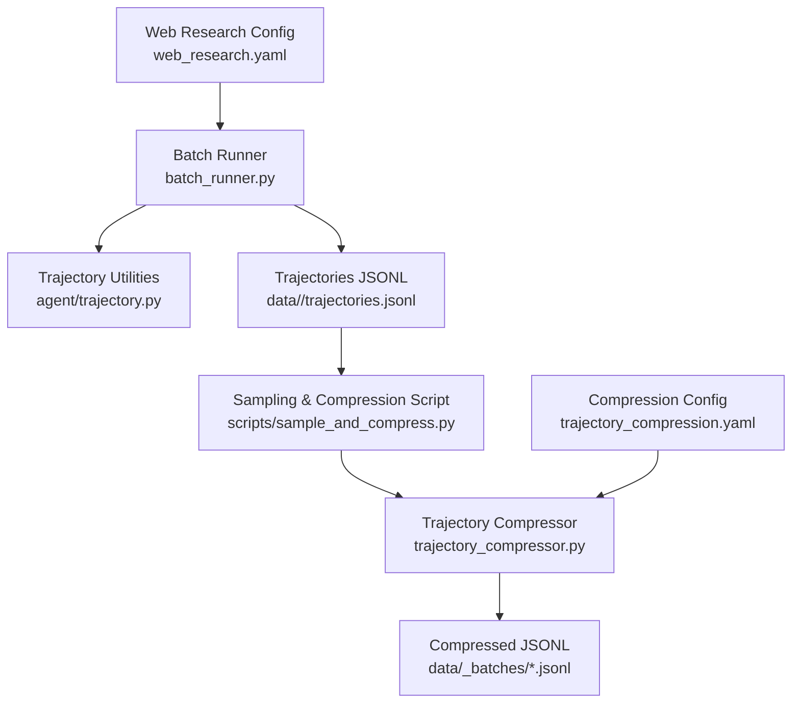
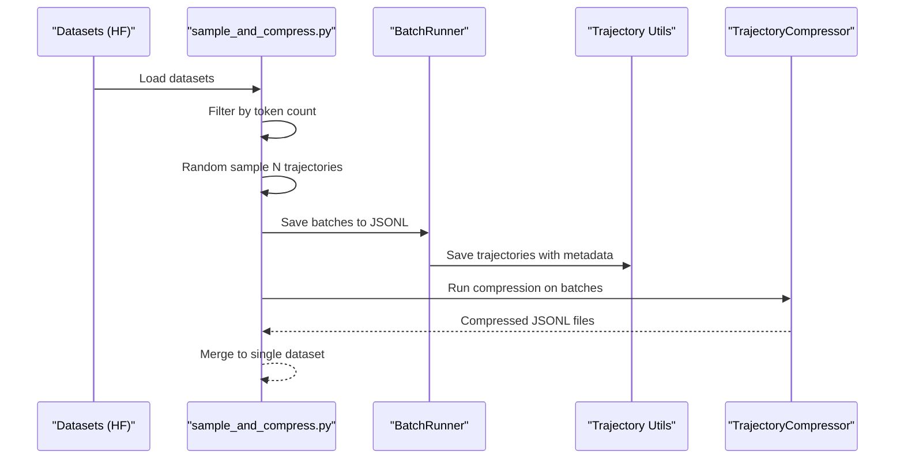
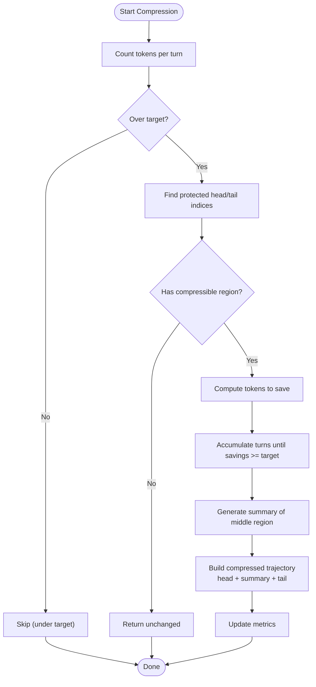
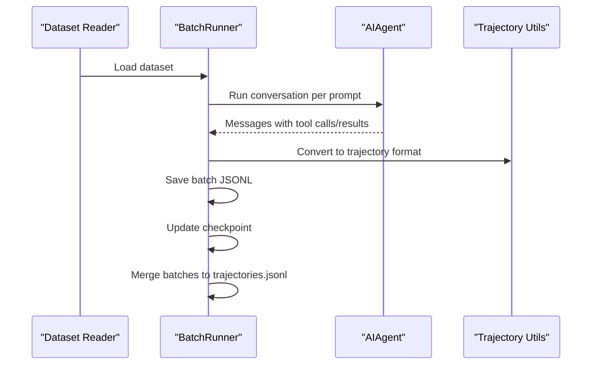
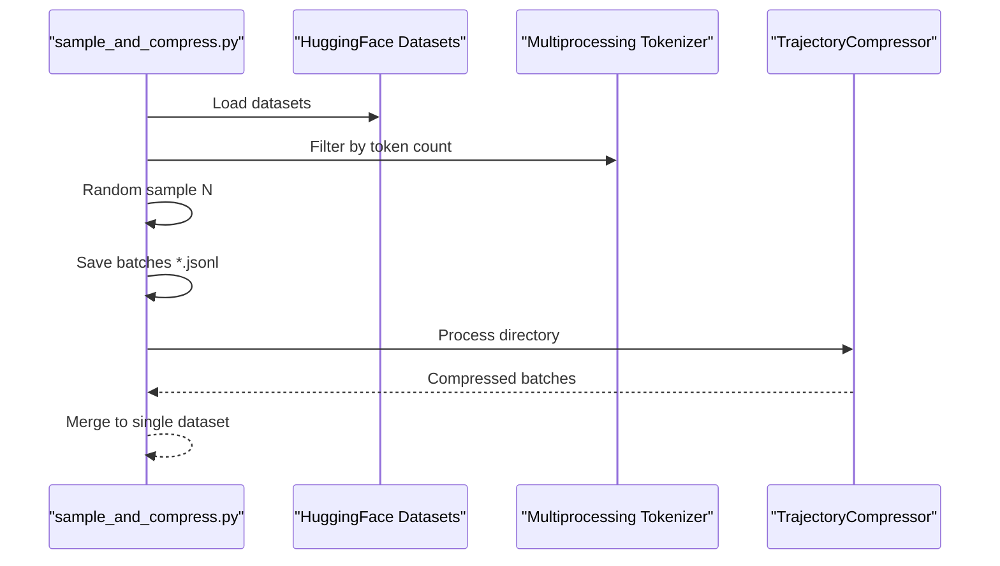
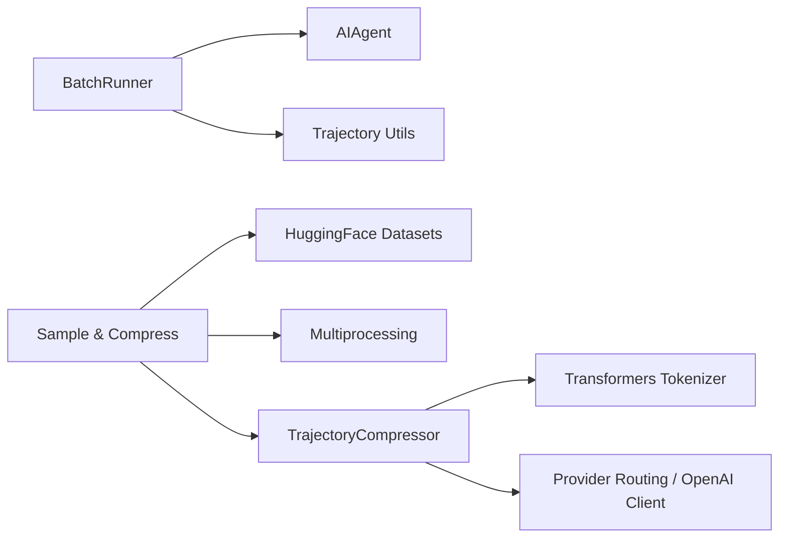

# Trajectory Compression and Research

<cite>
**Referenced Files in This Document**
- [trajectory_compressor.py](file://trajectory_compressor.py)
- [trajectory.py](file://agent/trajectory.py)
- [batch_runner.py](file://batch_runner.py)
- [trajectory_compression.yaml](file://datagen-config-examples/trajectory_compression.yaml)
- [web_research.yaml](file://datagen-config-examples/web_research.yaml)
- [sample_and_compress.py](file://scripts/sample_and_compress.py)
- [test_trajectory_compressor.py](file://tests/test_trajectory_compressor.py)
</cite>

## Table of Contents
1. [Introduction](#introduction)
2. [Project Structure](#project-structure)
3. [Core Components](#core-components)
4. [Architecture Overview](#architecture-overview)
5. [Detailed Component Analysis](#detailed-component-analysis)
6. [Dependency Analysis](#dependency-analysis)
7. [Performance Considerations](#performance-considerations)
8. [Troubleshooting Guide](#troubleshooting-guide)
9. [Conclusion](#conclusion)
10. [Appendices](#appendices)

## Introduction
This document explains the trajectory compression and research capabilities for next-generation tool-calling models. It covers:
- Batch trajectory generation via the batch runner
- Trajectory compression strategies that optimize tokens while preserving training signal
- Training data preparation workflows for model research
- Research-focused features for generating datasets, evaluating performance, and ensuring reproducibility
- Practical workflows for sampling, compression, storage, retrieval, and sharing of trajectories

## Project Structure
Key modules involved in trajectory compression and research:
- Trajectory compression engine: trajectory_compressor.py
- Trajectory saving utilities: agent/trajectory.py
- Batch trajectory generation: batch_runner.py
- Configuration examples: datagen-config-examples/*.yaml
- Research data pipeline script: scripts/sample_and_compress.py
- Tests: tests/test_trajectory_compressor.py

**Diagram sources**
- [batch_runner.py:1-1303](file://batch_runner.py#L1-L1303)
- [trajectory.py:1-57](file://agent/trajectory.py#L1-L57)
- [sample_and_compress.py:1-410](file://scripts/sample_and_compress.py#L1-L410)
- [trajectory_compressor.py:1-1509](file://trajectory_compressor.py#L1-L1509)
- [trajectory_compression.yaml:1-102](file://datagen-config-examples/trajectory_compression.yaml#L1-L102)
- [web_research.yaml:1-47](file://datagen-config-examples/web_research.yaml#L1-L47)

**Section sources**
- [batch_runner.py:1-1303](file://batch_runner.py#L1-L1303)
- [trajectory.py:1-57](file://agent/trajectory.py#L1-L57)
- [sample_and_compress.py:1-410](file://scripts/sample_and_compress.py#L1-L410)
- [trajectory_compressor.py:1-1509](file://trajectory_compressor.py#L1-L1509)
- [trajectory_compression.yaml:1-102](file://datagen-config-examples/trajectory_compression.yaml#L1-L102)
- [web_research.yaml:1-47](file://datagen-config-examples/web_research.yaml#L1-L47)

## Core Components
- TrajectoryCompressor: Implements compression with protected head/tail turns, middle-region summarization, and token budget enforcement.
- CompressionConfig: Centralized configuration for tokenizer, target budgets, summarization model, and processing parameters.
- TrajectoryMetrics and AggregateMetrics: Track compression outcomes, token savings, and summarization API usage.
- BatchRunner: Produces tool-calling trajectories in ShareGPT-like format with tool usage and reasoning statistics.
- Trajectory utilities: Save trajectories to JSONL with metadata and model info.
- Research pipeline: scripts/sample_and_compress.py for sampling HF datasets, filtering by token count, and running compression.

**Section sources**
- [trajectory_compressor.py:82-330](file://trajectory_compressor.py#L82-L330)
- [batch_runner.py:527-1303](file://batch_runner.py#L527-L1303)
- [trajectory.py:30-57](file://agent/trajectory.py#L30-L57)
- [sample_and_compress.py:117-410](file://scripts/sample_and_compress.py#L117-L410)

## Architecture Overview
End-to-end research pipeline from raw datasets to compressed training data:

**Diagram sources**
- [sample_and_compress.py:117-410](file://scripts/sample_and_compress.py#L117-L410)
- [batch_runner.py:527-1303](file://batch_runner.py#L527-L1303)
- [trajectory_compressor.py:975-1180](file://trajectory_compressor.py#L975-L1180)

## Detailed Component Analysis

### Trajectory Compressor
Implements a token-aware compression strategy that:
- Protects first system/human/gpt/tool and last N turns
- Computes a compressible middle region and accumulates turns until sufficient token savings
- Summarizes the middle region into a single human summary turn
- Preserves tool calls outside the compressed region
- Tracks metrics and supports async summarization with concurrency limits

Key behaviors:
- Token counting via HuggingFace tokenizer with fallback
- Protected turn detection aligns boundaries to avoid splitting tool_call/tool_result pairs
- Summarization prompt targets a specific token count and uses a configurable model/provider
- Async processing with per-entry timeouts and semaphore-controlled concurrency
- Aggregates metrics across trajectories and prints a detailed summary

**Diagram sources**
- [trajectory_compressor.py:709-925](file://trajectory_compressor.py#L709-L925)
- [trajectory_compressor.py:927-973](file://trajectory_compressor.py#L927-L973)

**Section sources**
- [trajectory_compressor.py:82-330](file://trajectory_compressor.py#L82-L330)
- [trajectory_compressor.py:709-925](file://trajectory_compressor.py#L709-L925)
- [trajectory_compressor.py:927-973](file://trajectory_compressor.py#L927-L973)
- [trajectory_compressor.py:975-1180](file://trajectory_compressor.py#L975-L1180)
- [trajectory_compressor.py:1290-1509](file://trajectory_compressor.py#L1290-L1509)

### Batch Trajectory Generation
Produces ShareGPT-style trajectories with:
- Tool usage statistics normalized across all tools
- Reasoning coverage tracking (assistant turns with/without reasoning)
- Checkpointing for fault tolerance and resume
- Merging of batch files into a single trajectories.jsonl
- Filtering of corrupted entries (invalid tool names)

**Diagram sources**
- [batch_runner.py:244-524](file://batch_runner.py#L244-L524)
- [batch_runner.py:810-1126](file://batch_runner.py#L810-L1126)
- [trajectory.py:30-57](file://agent/trajectory.py#L30-L57)

**Section sources**
- [batch_runner.py:244-524](file://batch_runner.py#L244-L524)
- [batch_runner.py:810-1126](file://batch_runner.py#L810-L1126)
- [trajectory.py:30-57](file://agent/trajectory.py#L30-L57)

### Research Data Pipeline (Sampling and Compression)
End-to-end research workflow:
- Loads multiple HuggingFace datasets
- Filters entries by minimum token count using parallel tokenization
- Randomly samples N trajectories
- Splits into batched JSONL files
- Runs compression with configurable target budgets
- Merges outputs into a single dataset

**Diagram sources**
- [sample_and_compress.py:117-410](file://scripts/sample_and_compress.py#L117-L410)
- [trajectory_compressor.py:975-1180](file://trajectory_compressor.py#L975-L1180)

**Section sources**
- [sample_and_compress.py:117-410](file://scripts/sample_and_compress.py#L117-L410)
- [trajectory_compressor.py:975-1180](file://trajectory_compressor.py#L975-L1180)

### Configuration and Metadata Preservation
- CompressionConfig supports YAML-driven configuration for tokenizer, target budgets, summarization model/provider, output behavior, processing concurrency, and metrics.
- Trajectory entries include metadata such as model, batch_num, timestamp, toolsets_used, tool_stats, and tool_error_counts.
- Compression notices can be appended to system messages to inform downstream consumers.

**Section sources**
- [trajectory_compression.yaml:1-102](file://datagen-config-examples/trajectory_compression.yaml#L1-L102)
- [web_research.yaml:1-47](file://datagen-config-examples/web_research.yaml#L1-L47)
- [batch_runner.py:473-483](file://batch_runner.py#L473-L483)
- [trajectory_compressor.py:804-812](file://trajectory_compressor.py#L804-L812)

## Dependency Analysis
- TrajectoryCompressor depends on:
  - HuggingFace tokenizer for token counting
  - Provider routing for summarization (OpenRouter, Kimi, etc.) or raw OpenAI client
  - AsyncOpenAI client created per event loop to avoid “event loop closed” errors
- BatchRunner depends on:
  - AIAgent for running conversations
  - Trajectory utilities for saving and normalizing tool stats
  - Multiprocessing for parallel batch processing
- Research pipeline depends on:
  - HuggingFace datasets for sampling
  - Multiprocessing for token counting
  - TrajectoryCompressor for post-processing

**Diagram sources**
- [trajectory_compressor.py:362-433](file://trajectory_compressor.py#L362-L433)
- [batch_runner.py:325-346](file://batch_runner.py#L325-L346)
- [trajectory.py:30-57](file://agent/trajectory.py#L30-L57)
- [sample_and_compress.py:117-410](file://scripts/sample_and_compress.py#L117-L410)

**Section sources**
- [trajectory_compressor.py:362-433](file://trajectory_compressor.py#L362-L433)
- [batch_runner.py:325-346](file://batch_runner.py#L325-L346)
- [sample_and_compress.py:117-410](file://scripts/sample_and_compress.py#L117-L410)

## Performance Considerations
- Token counting: Uses HuggingFace tokenizer with fallback to character-based estimation; parallel tokenization improves throughput for large datasets.
- Concurrency: Semaphore-controlled async summarization prevents API throttling and resource exhaustion.
- Memory: Streaming JSONL processing avoids loading entire datasets into memory; batched files reduce I/O overhead.
- Throughput: Multiprocessing and async I/O maximize utilization of CPU and network resources.

[No sources needed since this section provides general guidance]

## Troubleshooting Guide
Common issues and resolutions:
- Missing API keys or provider misconfiguration: Ensure environment variables are set and provider routing resolves correctly.
- Event loop errors when running compression multiple times: Async clients are created per loop; avoid reusing closed loops.
- Invalid tool names in trajectories: BatchRunner filters corrupted entries; verify tool schemas and distributions.
- Compression timeouts: Increase per-trajectory timeout or reduce max_concurrent_requests.
- Low compression ratios: Adjust target_max_tokens and summary_target_tokens; review protected turn settings.

**Section sources**
- [trajectory_compressor.py:374-433](file://trajectory_compressor.py#L374-L433)
- [batch_runner.py:1030-1051](file://batch_runner.py#L1030-L1051)
- [trajectory_compressor.py:1056-1099](file://trajectory_compressor.py#L1056-L1099)

## Conclusion
The trajectory compression and research pipeline provides a robust, reproducible workflow for generating high-quality tool-calling datasets. By protecting critical context, summarizing middle regions, and maintaining metadata, it enables efficient training data preparation for next-generation tool-call models. The batch runner, compression engine, and research pipeline integrate seamlessly to support scalable, research-grade data generation and evaluation.

[No sources needed since this section summarizes without analyzing specific files]

## Appendices

### Practical Workflows

- Batch trajectory generation
  - Configure web_research.yaml with toolsets, model, and compression settings
  - Run batch_runner.py to produce trajectories.jsonl with tool and reasoning stats
  - Use checkpointing for fault tolerance and resume capability

- Trajectory compression
  - Prepare trajectory_compression.yaml with tokenizer, target budgets, and summarization settings
  - Run trajectory_compressor.py on JSONL files or directories
  - Review compression metrics and adjust parameters as needed

- Research data generation
  - Use scripts/sample_and_compress.py to sample from HF datasets, filter by token count, and run compression
  - Merge outputs into a single dataset for upload or further processing

**Section sources**
- [web_research.yaml:1-47](file://datagen-config-examples/web_research.yaml#L1-L47)
- [batch_runner.py:1128-1303](file://batch_runner.py#L1128-L1303)
- [trajectory_compression.yaml:1-102](file://datagen-config-examples/trajectory_compression.yaml#L1-L102)
- [trajectory_compressor.py:1290-1509](file://trajectory_compressor.py#L1290-L1509)
- [sample_and_compress.py:316-410](file://scripts/sample_and_compress.py#L316-L410)

### Quality Assurance and Reproducibility
- Tests validate configuration parsing, metrics computation, protected turn detection, token counting, and summary generation.
- BatchRunner’s content-based resume ensures recovery across dataset changes.
- Compression metrics enable reproducible analysis of compression effectiveness.

**Section sources**
- [test_trajectory_compressor.py:1-511](file://tests/test_trajectory_compressor.py#L1-L511)
- [batch_runner.py:732-808](file://batch_runner.py#L732-L808)
- [trajectory_compressor.py:182-330](file://trajectory_compressor.py#L182-L330)