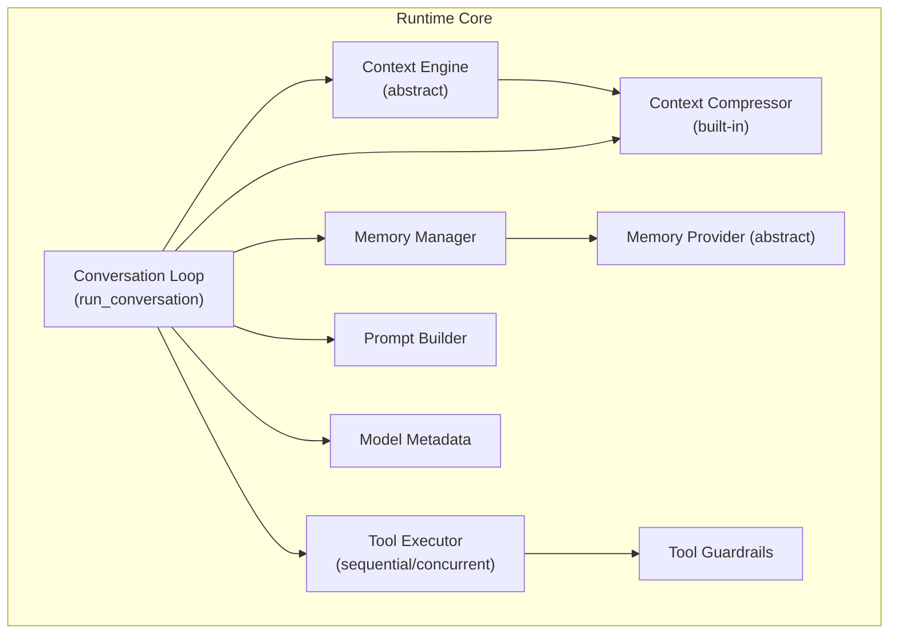
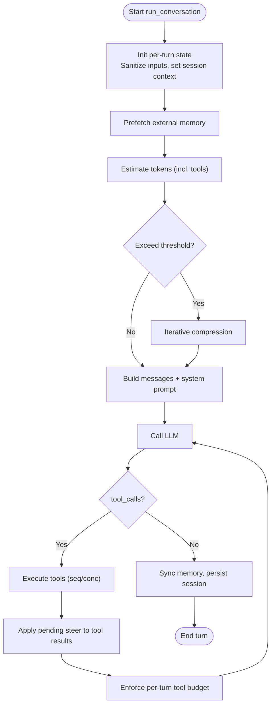
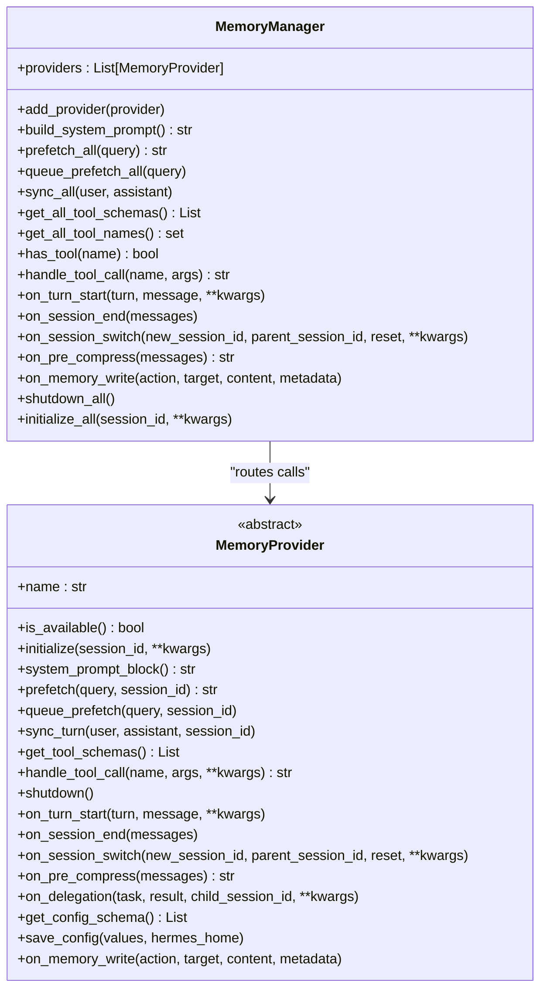
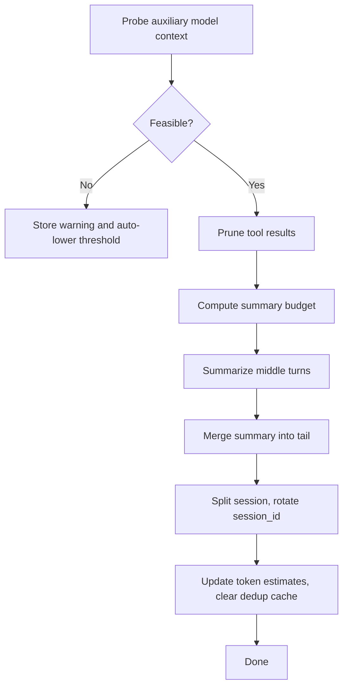
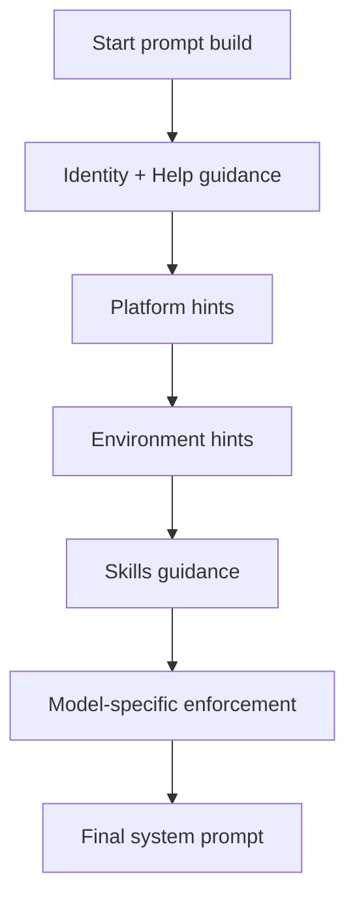
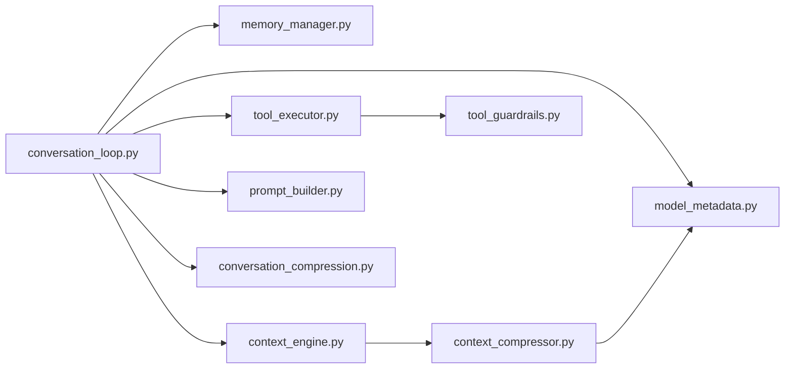

# Agent Runtime System

<cite>
**Referenced Files in This Document**
- [conversation_loop.py](file://agent/conversation_loop.py)
- [memory_manager.py](file://agent/memory_manager.py)
- [context_engine.py](file://agent/context_engine.py)
- [tool_executor.py](file://agent/tool_executor.py)
- [prompt_builder.py](file://agent/prompt_builder.py)
- [context_compressor.py](file://agent/context_compressor.py)
- [model_metadata.py](file://agent/model_metadata.py)
- [tool_guardrails.py](file://agent/tool_guardrails.py)
- [memory_provider.py](file://agent/memory_provider.py)
- [conversation_compression.py](file://agent/conversation_compression.py)
</cite>

## Table of Contents
1. [Introduction](#introduction)
2. [Project Structure](#project-structure)
3. [Core Components](#core-components)
4. [Architecture Overview](#architecture-overview)
5. [Detailed Component Analysis](#detailed-component-analysis)
6. [Dependency Analysis](#dependency-analysis)
7. [Performance Considerations](#performance-considerations)
8. [Troubleshooting Guide](#troubleshooting-guide)
9. [Conclusion](#conclusion)
10. [Appendices](#appendices)

## Introduction
This document explains the Agent Runtime System that powers the Hermes Agent’s self-improving intelligence loop. It covers the conversation loop architecture (turn lifecycle, message formatting, alternation, and error handling), memory management (persistent storage, capacity management, and curation), context management (compression, token estimation, and budgeting), tool execution (registry, safety, and parallelism), prompt building and model metadata handling, and practical examples of how these components collaborate. It also includes performance considerations, debugging techniques, and integration patterns with external services.

## Project Structure
The Agent Runtime System is organized around cohesive subsystems:
- Conversation loop orchestration and lifecycle
- Memory management and provider abstraction
- Context engines and compression
- Tool execution and safety controls
- Prompt building and model metadata
- Compression feasibility and session splitting



**Diagram sources**
- [conversation_loop.py:85-470](file://agent/conversation_loop.py#L85-L470)
- [tool_executor.py:64-471](file://agent/tool_executor.py#L64-L471)
- [context_engine.py:32-212](file://agent/context_engine.py#L32-L212)
- [context_compressor.py:454-595](file://agent/context_compressor.py#L454-L595)
- [memory_manager.py:190-556](file://agent/memory_manager.py#L190-L556)
- [memory_provider.py:42-280](file://agent/memory_provider.py#L42-L280)
- [prompt_builder.py:1-120](file://agent/prompt_builder.py#L1-L120)
- [model_metadata.py:114-134](file://agent/model_metadata.py#L114-L134)
- [tool_guardrails.py:224-384](file://agent/tool_guardrails.py#L224-L384)

**Section sources**
- [conversation_loop.py:1-120](file://agent/conversation_loop.py#L1-L120)
- [context_engine.py:1-60](file://agent/context_engine.py#L1-L60)
- [context_compressor.py:1-60](file://agent/context_compressor.py#L1-L60)
- [memory_manager.py:1-40](file://agent/memory_manager.py#L1-L40)
- [prompt_builder.py:1-40](file://agent/prompt_builder.py#L1-L40)
- [model_metadata.py:1-40](file://agent/model_metadata.py#L1-L40)
- [tool_guardrails.py:1-20](file://agent/tool_guardrails.py#L1-L20)
- [memory_provider.py:1-35](file://agent/memory_provider.py#L1-L35)

## Core Components
- Conversation Loop: Drives a single user turn, manages retries, compression, and post-turn hooks.
- Memory Manager: Integrates built-in and external memory providers, prefetch, sync, and tool routing.
- Context Engine: Pluggable interface for context compaction; built-in compressor is the default.
- Tool Executor: Executes tool calls sequentially or concurrently with safety and progress tracking.
- Prompt Builder: Assembles system prompt pieces, platform hints, environment info, and guidance.
- Model Metadata: Provides context length detection, fallbacks, and pricing metadata.
- Tool Guardrails: Enforces per-turn safety thresholds and suggests warnings/halts.
- Memory Provider: Abstract base for external memory backends.

**Section sources**
- [conversation_loop.py:85-220](file://agent/conversation_loop.py#L85-L220)
- [memory_manager.py:190-400](file://agent/memory_manager.py#L190-L400)
- [context_engine.py:32-120](file://agent/context_engine.py#L32-L120)
- [tool_executor.py:64-120](file://agent/tool_executor.py#L64-L120)
- [prompt_builder.py:130-220](file://agent/prompt_builder.py#L130-L220)
- [model_metadata.py:114-250](file://agent/model_metadata.py#L114-L250)
- [tool_guardrails.py:63-120](file://agent/tool_guardrails.py#L63-L120)
- [memory_provider.py:42-140](file://agent/memory_provider.py#L42-L140)

## Architecture Overview
The runtime composes a conversation turn from user input, system prompt, memory prefetch, and plugin hooks. It executes model calls, processes tool calls (sequential or concurrent), applies safety guardrails, compresses context when needed, and persists memory and session state.

```mermaid
sequenceDiagram
participant User as "User"
participant Loop as "Conversation Loop"
participant Prefetch as "Memory Manager.prefetch"
participant Engine as "Context Engine"
participant Model as "LLM API"
participant Exec as "Tool Executor"
participant Guard as "Tool Guardrails"
participant DB as "Session DB"
User->>Loop : "User message"
Loop->>Loop : "Sanitize inputs, set session context"
Loop->>Prefetch : "Prefetch external context"
Prefetch-->>Loop : "Context block"
Loop->>Engine : "Estimate tokens, preflight compression"
Engine-->>Loop : "Compression decision"
Loop->>Model : "Build messages + system prompt"
Model-->>Loop : "Assistant message (tool_calls?)"
alt "Has tool_calls"
Loop->>Exec : "Sequential or Concurrent dispatch"
Exec->>Guard : "before_call()"
Guard-->>Exec : "Decision"
Exec->>Exec : "Invoke tool(s)"
Exec-->>Loop : "Tool results"
Loop->>Model : "Send tool results"
Model-->>Loop : "Final response"
else "No tool_calls"
Model-->>Loop : "Final response"
end
Loop->>DB : "Persist messages, sync memory"
Loop-->>User : "Response"
```

**Diagram sources**
- [conversation_loop.py:460-532](file://agent/conversation_loop.py#L460-L532)
- [memory_manager.py:284-327](file://agent/memory_manager.py#L284-L327)
- [context_engine.py:70-102](file://agent/context_engine.py#L70-L102)
- [tool_executor.py:64-120](file://agent/tool_executor.py#L64-L120)
- [tool_guardrails.py:241-284](file://agent/tool_guardrails.py#L241-L284)
- [conversation_compression.py:243-435](file://agent/conversation_compression.py#L243-L435)

## Detailed Component Analysis

### Conversation Loop: Turn Lifecycle, Message Formatting, Alternation, and Error Handling
- Lifecycle: Initializes per-turn state, sanitizes inputs, restores primary runtime, hydrates counters, and prepares streaming context scrubbers.
- Message formatting: Builds system prompt once per session, injects ephemeral context into user message, normalizes whitespace and tool-call JSON, and strips internal fields for strict providers.
- Role alternation: Repairs malformed sequences and drops thinking-only assistant turns to avoid provider errors.
- Tool execution: Routes to sequential or concurrent executor; applies per-tool steer injection and per-turn budget enforcement.
- Compression: Performs preflight checks and iterative compression when exceeding thresholds.
- Persistence: Commits memory, updates session DB, and rotates session IDs on compression.



**Diagram sources**
- [conversation_loop.py:85-532](file://agent/conversation_loop.py#L85-L532)
- [conversation_compression.py:243-435](file://agent/conversation_compression.py#L243-L435)

**Section sources**
- [conversation_loop.py:113-220](file://agent/conversation_loop.py#L113-L220)
- [conversation_loop.py:643-790](file://agent/conversation_loop.py#L643-L790)
- [conversation_loop.py:356-423](file://agent/conversation_loop.py#L356-L423)
- [conversation_compression.py:243-435](file://agent/conversation_compression.py#L243-L435)

### Memory Management: Persistent Storage, Capacity, and Curation
- Memory Manager orchestrates one built-in provider and at most one external provider, enforcing a single external provider to avoid tool schema bloat.
- Prefetch: Collects context from all providers before the tool loop to avoid repeated calls.
- Sync: Persists completed turns asynchronously.
- Tools: Routes tool calls to the correct provider; aggregates tool schemas and tool names.
- Lifecycle hooks: Notifies providers on turn start, session end, session switch, pre-compression, and memory writes.



**Diagram sources**
- [memory_manager.py:190-556](file://agent/memory_manager.py#L190-L556)
- [memory_provider.py:42-280](file://agent/memory_provider.py#L42-L280)

**Section sources**
- [memory_manager.py:190-400](file://agent/memory_manager.py#L190-L400)
- [memory_provider.py:42-140](file://agent/memory_provider.py#L42-L140)

### Context Management: Compression, Token Estimation, and Budgeting
- Context Engine defines the contract for compaction, including token state, thresholds, and optional tools.
- Context Compressor implements a built-in engine with:
  - Tool output pruning (dedupe, truncate, strip images)
  - Tail token budget protection
  - Structured summary with iterative updates
  - Anti-thrashing safeguards
  - Auxiliary model feasibility checks and fallbacks
- Compression feasibility warns when the auxiliary model lacks sufficient context window and auto-adjusts thresholds.



**Diagram sources**
- [context_engine.py:32-120](file://agent/context_engine.py#L32-L120)
- [context_compressor.py:454-595](file://agent/context_compressor.py#L454-L595)
- [conversation_compression.py:44-223](file://agent/conversation_compression.py#L44-L223)

**Section sources**
- [context_engine.py:32-120](file://agent/context_engine.py#L32-L120)
- [context_compressor.py:454-595](file://agent/context_compressor.py#L454-L595)
- [conversation_compression.py:44-223](file://agent/conversation_compression.py#L44-L223)

### Tool Execution System: Registry, Safety Controls, and Parallelism
- Sequential vs Concurrent: Executes tool calls in order or in parallel with bounded workers, applying pre-execution bookkeeping (checkpoints, approvals).
- Safety: Pre-tool hooks, guardrails, and per-tool steer injection; enforces per-turn budgets and deduplicates tool results.
- Parallelism: Thread pool with interrupt propagation, heartbeat updates, and graceful cancellation.

```mermaid
sequenceDiagram
participant Loop as "Conversation Loop"
participant Exec as "Tool Executor"
participant Guard as "Tool Guardrails"
participant Prov as "Memory Provider"
participant Tool as "Tool Function"
Loop->>Exec : "tool_calls"
Exec->>Guard : "before_call(tool_name, args)"
Guard-->>Exec : "Decision"
alt "Allowed"
Exec->>Exec : "Checkpoint, approvals"
Exec->>Tool : "Invoke"
Tool-->>Exec : "Result"
Exec->>Prov : "Mirror memory writes (optional)"
Exec-->>Loop : "Tool result"
else "Blocked"
Exec-->>Loop : "Synthetic result (blocked)"
end
```

**Diagram sources**
- [tool_executor.py:64-120](file://agent/tool_executor.py#L64-L120)
- [tool_guardrails.py:241-384](file://agent/tool_guardrails.py#L241-L384)
- [memory_manager.py:483-512](file://agent/memory_manager.py#L483-L512)

**Section sources**
- [tool_executor.py:64-120](file://agent/tool_executor.py#L64-L120)
- [tool_executor.py:177-347](file://agent/tool_executor.py#L177-L347)
- [tool_guardrails.py:224-384](file://agent/tool_guardrails.py#L224-L384)
- [memory_manager.py:483-512](file://agent/memory_manager.py#L483-L512)

### Prompt Building and Model Metadata Handling
- Prompt Builder constructs the system prompt from identity, platform hints, environment info, skills guidance, and model-specific enforcement.
- Model Metadata resolves context length via models.dev, OpenRouter, provider-specific endpoints, and local server probes; provides fallbacks and pricing metadata.



**Diagram sources**
- [prompt_builder.py:134-272](file://agent/prompt_builder.py#L134-L272)
- [model_metadata.py:611-788](file://agent/model_metadata.py#L611-L788)

**Section sources**
- [prompt_builder.py:134-272](file://agent/prompt_builder.py#L134-L272)
- [model_metadata.py:114-250](file://agent/model_metadata.py#L114-L250)
- [model_metadata.py:611-788](file://agent/model_metadata.py#L611-L788)

### Practical Examples: Self-Improving Agent Loop
- Memory curation: Memory Manager prefetches context and routes tool calls to external providers; on memory writes, it mirrors changes to external providers.
- Compression feedback: After compression, the system updates token estimates, propagates titles across sessions, and warns on repeated compressions.
- Tool safety: Tool Guardrails detect repeated failures and idempotent no-progress loops, emitting warnings or halting execution depending on configuration.

**Section sources**
- [memory_manager.py:328-375](file://agent/memory_manager.py#L328-L375)
- [conversation_compression.py:326-435](file://agent/conversation_compression.py#L326-L435)
- [tool_guardrails.py:241-384](file://agent/tool_guardrails.py#L241-L384)

## Dependency Analysis
Key dependencies and coupling:
- Conversation Loop depends on Memory Manager, Context Engine, Tool Executor, Prompt Builder, and Model Metadata.
- Context Engine abstracts compression; Context Compressor implements the default behavior.
- Tool Executor depends on Tool Guardrails and Memory Manager for tool routing and memory mirroring.
- Model Metadata is used by Context Compressor and Conversation Compression for feasibility checks and token estimation.



**Diagram sources**
- [conversation_loop.py:85-220](file://agent/conversation_loop.py#L85-L220)
- [memory_manager.py:190-400](file://agent/memory_manager.py#L190-L400)
- [context_engine.py:32-120](file://agent/context_engine.py#L32-L120)
- [context_compressor.py:454-595](file://agent/context_compressor.py#L454-L595)
- [tool_executor.py:64-120](file://agent/tool_executor.py#L64-L120)
- [tool_guardrails.py:224-384](file://agent/tool_guardrails.py#L224-L384)
- [prompt_builder.py:134-272](file://agent/prompt_builder.py#L134-L272)
- [model_metadata.py:114-250](file://agent/model_metadata.py#L114-L250)
- [conversation_compression.py:44-223](file://agent/conversation_compression.py#L44-L223)

**Section sources**
- [conversation_loop.py:85-220](file://agent/conversation_loop.py#L85-L220)
- [context_compressor.py:454-595](file://agent/context_compressor.py#L454-L595)
- [tool_executor.py:64-120](file://agent/tool_executor.py#L64-L120)
- [tool_guardrails.py:224-384](file://agent/tool_guardrails.py#L224-L384)
- [model_metadata.py:114-250](file://agent/model_metadata.py#L114-L250)

## Performance Considerations
- Token estimation: Use rough estimates that include tool schemas to avoid missing large tool schema contributions.
- Compression budgeting: Scale summary budgets proportionally to compressed content and protect tail by token budget rather than fixed message count.
- Prefetching: Perform once per turn to avoid repeated external calls; leverage provider caching.
- Parallel tool execution: Limit worker threads and propagate interrupts to avoid blocking on long-running tools.
- Image handling: Strip or resize large images to fit provider limits; re-encode only oversized data URLs.
- Prompt caching: Apply cache control for compatible providers to reduce input token costs.

[No sources needed since this section provides general guidance]

## Troubleshooting Guide
Common issues and remedies:
- Context compression threshold exceeded: Enable compression, verify auxiliary model context window, and consider lowering threshold or upgrading compression model.
- Tool loop detected: Guardrails will warn or halt repeated failures; adjust tool strategy or arguments.
- Image too large: Use image-shrink recovery to re-encode oversized data URLs under provider limits.
- Provider connectivity: Pre-flight cleanup of stale connections can prevent hangs; verify base URL and credentials.
- Streaming interruptions: Reset streaming context scrubbers to avoid leaking partial memory-context spans.

**Section sources**
- [conversation_compression.py:44-223](file://agent/conversation_compression.py#L44-L223)
- [tool_guardrails.py:241-384](file://agent/tool_guardrails.py#L241-L384)
- [conversation_loop.py:193-210](file://agent/conversation_loop.py#L193-L210)
- [conversation_compression.py:438-548](file://agent/conversation_compression.py#L438-L548)

## Conclusion
The Agent Runtime System integrates a robust conversation loop, memory orchestration, pluggable context engines, safe and parallel tool execution, and model-aware prompt/building. Together, these components enable long-lived, self-improving agent behavior with strong safety, performance, and observability.

[No sources needed since this section summarizes without analyzing specific files]

## Appendices
- Integration patterns:
  - External memory providers: Register via Memory Manager; ensure single external provider.
  - Context engines: Select via config; built-in compressor is the default.
  - Tool registries: Route through Memory Manager for provider tools; use tool schemas from all providers.
  - Model metadata: Resolve context length dynamically; use fallbacks and provider-specific endpoints.

[No sources needed since this section provides general guidance]