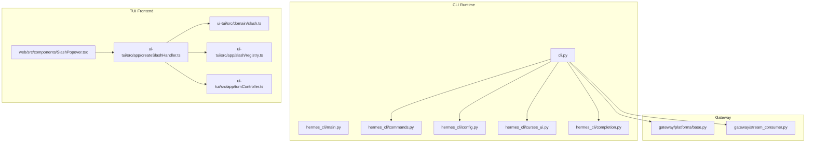
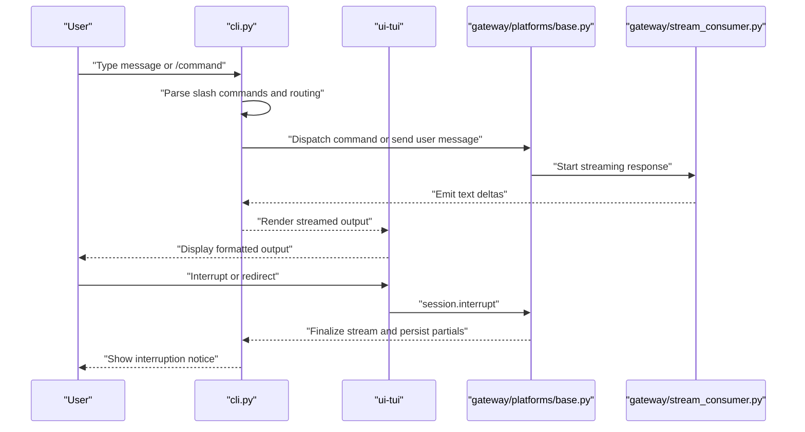
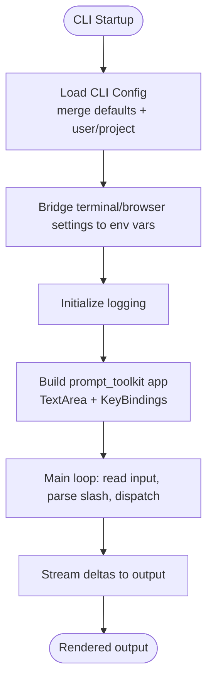
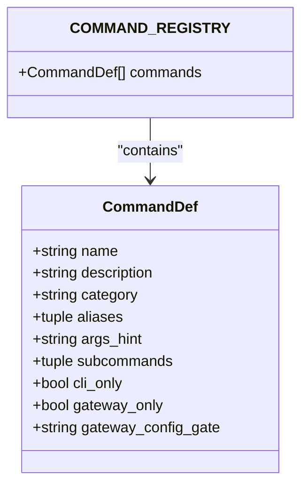
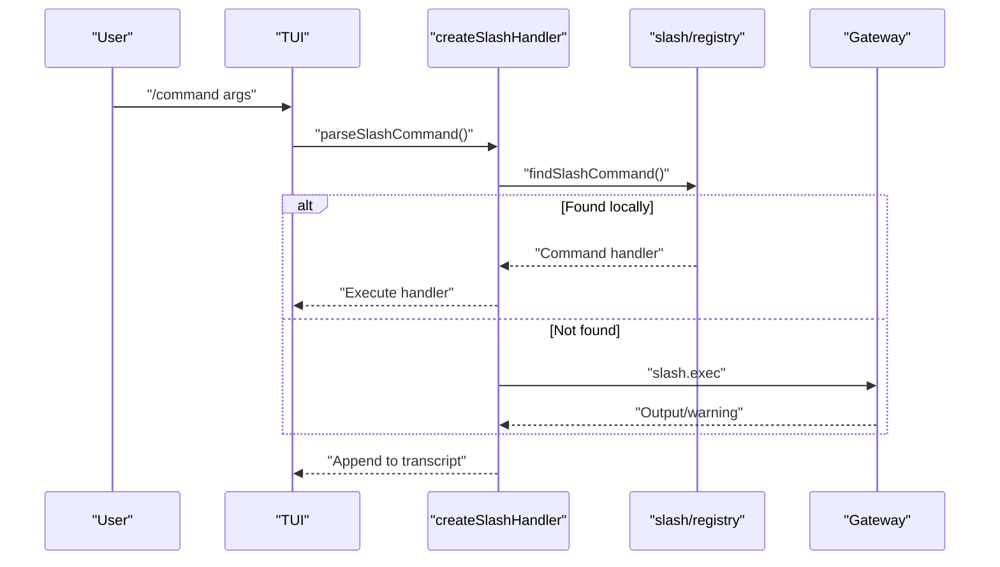
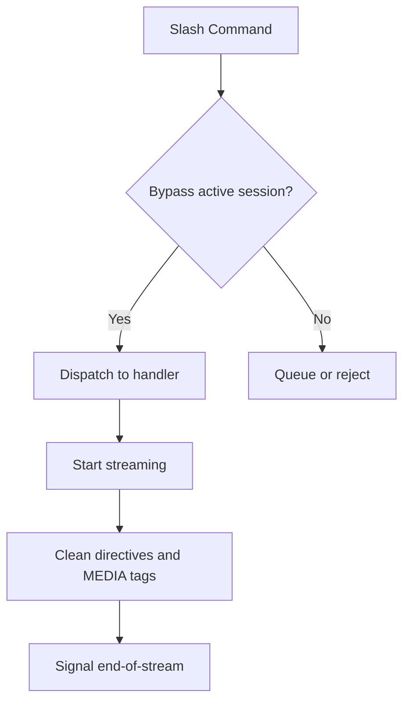
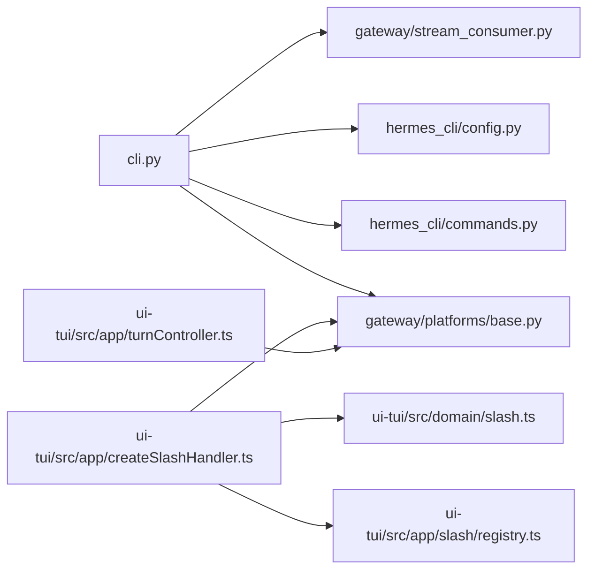

# CLI Interface

<cite>
**Referenced Files in This Document**
- [cli.py](file://cli.py)
- [hermes_cli/main.py](file://hermes_cli/main.py)
- [hermes_cli/commands.py](file://hermes_cli/commands.py)
- [hermes_cli/completion.py](file://hermes_cli/completion.py)
- [hermes_cli/config.py](file://hermes_cli/config.py)
- [hermes_cli/curses_ui.py](file://hermes_cli/curses_ui.py)
- [ui-tui/src/domain/slash.ts](file://ui-tui/src/domain/slash.ts)
- [ui-tui/src/app/createSlashHandler.ts](file://ui-tui/src/app/createSlashHandler.ts)
- [ui-tui/src/app/turnController.ts](file://ui-tui/src/app/turnController.ts)
- [ui-tui/src/app/slash/registry.ts](file://ui-tui/src/app/slash/registry.ts)
- [web/src/components/SlashPopover.tsx](file://web/src/components/SlashPopover.tsx)
- [gateway/platforms/base.py](file://gateway/platforms/base.py)
- [gateway/stream_consumer.py](file://gateway/stream_consumer.py)
- [website/docs/developer-guide/extending-the-cli.md](file://website/docs/developer-guide/extending-the-cli.md)
</cite>

## Table of Contents
1. [Introduction](#introduction)
2. [Project Structure](#project-structure)
3. [Core Components](#core-components)
4. [Architecture Overview](#architecture-overview)
5. [Detailed Component Analysis](#detailed-component-analysis)
6. [Dependency Analysis](#dependency-analysis)
7. [Performance Considerations](#performance-considerations)
8. [Troubleshooting Guide](#troubleshooting-guide)
9. [Conclusion](#conclusion)
10. [Appendices](#appendices)

## Introduction
This document describes the CLI Interface system for the Hermes Agent, covering both the interactive TUI and command-line functionality. It explains how the terminal interface handles multiline editing, slash-command autocomplete, conversation history, interrupt-and-redirect capabilities, and streaming tool output. It documents command processing and routing mechanisms, session management, configuration handling, and TUI components such as message rendering, input handling, and user interaction patterns. It also provides a command reference, practical workflows, keyboard shortcuts, advanced usage patterns, and integration details between the CLI and agent runtime, including platform-specific considerations and terminal compatibility.

## Project Structure
The CLI system spans several modules:
- Core CLI runtime and TUI: [cli.py](file://cli.py)
- CLI entrypoint and orchestration: [hermes_cli/main.py](file://hermes_cli/main.py)
- Slash command registry and routing: [hermes_cli/commands.py](file://hermes_cli/commands.py)
- Shell completion generation: [hermes_cli/completion.py](file://hermes_cli/completion.py)
- Configuration management: [hermes_cli/config.py](file://hermes_cli/config.py)
- Curses-based UI helpers: [hermes_cli/curses_ui.py](file://hermes_cli/curses_ui.py)
- TUI slash command parsing and dispatch: [ui-tui/src/domain/slash.ts](file://ui-tui/src/domain/slash.ts), [ui-tui/src/app/createSlashHandler.ts](file://ui-tui/src/app/createSlashHandler.ts), [ui-tui/src/app/slash/registry.ts](file://ui-tui/src/app/slash/registry.ts)
- TUI turn controller and interrupt handling: [ui-tui/src/app/turnController.ts](file://ui-tui/src/app/turnController.ts)
- Web slash popover and completion: [web/src/components/SlashPopover.tsx](file://web/src/components/SlashPopover.tsx)
- Gateway session control and streaming: [gateway/platforms/base.py](file://gateway/platforms/base.py), [gateway/stream_consumer.py](file://gateway/stream_consumer.py)
- Extensibility guide for wrapper CLIs: [website/docs/developer-guide/extending-the-cli.md](file://website/docs/developer-guide/extending-the-cli.md)

**Diagram sources**
- [cli.py](file://cli.py)
- [hermes_cli/main.py](file://hermes_cli/main.py)
- [hermes_cli/commands.py](file://hermes_cli/commands.py)
- [hermes_cli/config.py](file://hermes_cli/config.py)
- [hermes_cli/curses_ui.py](file://hermes_cli/curses_ui.py)
- [hermes_cli/completion.py](file://hermes_cli/completion.py)
- [ui-tui/src/domain/slash.ts](file://ui-tui/src/domain/slash.ts)
- [ui-tui/src/app/createSlashHandler.ts](file://ui-tui/src/app/createSlashHandler.ts)
- [ui-tui/src/app/slash/registry.ts](file://ui-tui/src/app/slash/registry.ts)
- [ui-tui/src/app/turnController.ts](file://ui-tui/src/app/turnController.ts)
- [web/src/components/SlashPopover.tsx](file://web/src/components/SlashPopover.tsx)
- [gateway/platforms/base.py](file://gateway/platforms/base.py)
- [gateway/stream_consumer.py](file://gateway/stream_consumer.py)

**Section sources**
- [cli.py](file://cli.py)
- [hermes_cli/main.py](file://hermes_cli/main.py)
- [hermes_cli/commands.py](file://hermes_cli/commands.py)
- [hermes_cli/completion.py](file://hermes_cli/completion.py)
- [hermes_cli/config.py](file://hermes_cli/config.py)
- [hermes_cli/curses_ui.py](file://hermes_cli/curses_ui.py)
- [ui-tui/src/domain/slash.ts](file://ui-tui/src/domain/slash.ts)
- [ui-tui/src/app/createSlashHandler.ts](file://ui-tui/src/app/createSlashHandler.ts)
- [ui-tui/src/app/slash/registry.ts](file://ui-tui/src/app/slash/registry.ts)
- [ui-tui/src/app/turnController.ts](file://ui-tui/src/app/turnController.ts)
- [web/src/components/SlashPopover.tsx](file://web/src/components/SlashPopover.tsx)
- [gateway/platforms/base.py](file://gateway/platforms/base.py)
- [gateway/stream_consumer.py](file://gateway/stream_consumer.py)

## Core Components
- CLI runtime and TUI: Provides the interactive terminal interface, multiline input, streaming output, and session management. It integrates with the agent runtime and handles configuration bridging to environment variables.
- Slash command system: Central registry defines all slash commands, categories, aliases, and subcommands. It supports gateway and CLI surfaces and provides helpers for platform-specific exposure.
- Configuration system: Loads user and project configs, merges defaults, expands environment variables, and bridges terminal/browser settings to environment variables for downstream components.
- Curses UI helpers: Provides fallbacks and utilities for interactive selection menus when curses is unavailable.
- Shell completion: Generates bash/zsh/fish completion scripts dynamically from the CLI’s argparse parser.
- TUI frontend: Implements slash command parsing, dispatch, autocomplete, and turn lifecycle including interruptions and streaming tool output.
- Gateway integration: Manages active sessions, command bypass behavior, and streaming response cleanup.

**Section sources**
- [cli.py](file://cli.py)
- [hermes_cli/commands.py](file://hermes_cli/commands.py)
- [hermes_cli/config.py](file://hermes_cli/config.py)
- [hermes_cli/curses_ui.py](file://hermes_cli/curses_ui.py)
- [hermes_cli/completion.py](file://hermes_cli/completion.py)
- [ui-tui/src/domain/slash.ts](file://ui-tui/src/domain/slash.ts)
- [ui-tui/src/app/createSlashHandler.ts](file://ui-tui/src/app/createSlashHandler.ts)
- [ui-tui/src/app/turnController.ts](file://ui-tui/src/app/turnController.ts)
- [gateway/platforms/base.py](file://gateway/platforms/base.py)
- [gateway/stream_consumer.py](file://gateway/stream_consumer.py)

## Architecture Overview
The CLI orchestrates user input, slash command parsing, and agent runtime integration. The TUI frontend augments the CLI with a rich terminal UI, while the gateway coordinates long-running sessions and streaming responses.

**Diagram sources**
- [cli.py](file://cli.py)
- [ui-tui/src/app/createSlashHandler.ts](file://ui-tui/src/app/createSlashHandler.ts)
- [ui-tui/src/app/turnController.ts](file://ui-tui/src/app/turnController.ts)
- [gateway/platforms/base.py](file://gateway/platforms/base.py)
- [gateway/stream_consumer.py](file://gateway/stream_consumer.py)

## Detailed Component Analysis

### CLI Runtime and TUI
- Multiline editing: Uses prompt_toolkit TextArea for fixed input area with processors and key bindings. Shift/Ctrl aliases are installed to enable Shift+Enter and Ctrl+Enter for newline insertion.
- Streaming tool output: Integrates with gateway stream consumer to emit text deltas and clean directives before display. Supports busy-input modes (queue, steer, interrupt).
- Conversation history: Maintains session state and persists messages; supports commands like /history, /save, /retry, /undo, and /compress.
- Interrupt-and-redirect: Implements Ctrl+C handling and session.interrupt to drain in-flight tool segments and preserve partials.
- Configuration bridging: Loads config.yaml and project cli-config.yaml, expands environment variables, and bridges terminal/browser settings to environment variables for downstream components.

**Diagram sources**
- [cli.py](file://cli.py)
- [hermes_cli/config.py](file://hermes_cli/config.py)
- [gateway/stream_consumer.py](file://gateway/stream_consumer.py)

**Section sources**
- [cli.py](file://cli.py)
- [hermes_cli/config.py](file://hermes_cli/config.py)
- [gateway/stream_consumer.py](file://gateway/stream_consumer.py)

### Slash Command System
- Registry: Central list of CommandDef entries with name, description, category, aliases, args_hint, subcommands, and platform gates.
- Resolution: Resolves command names and aliases, supports gateway-known command sets, and bypass logic for active-session commands.
- Autocomplete: Provides completion hints and subcommands for CLI and gateway surfaces.
- Platform exposure: Telegram/Discord command menus and skill command catalogs are derived from the registry.

**Diagram sources**
- [hermes_cli/commands.py](file://hermes_cli/commands.py)

**Section sources**
- [hermes_cli/commands.py](file://hermes_cli/commands.py)

### TUI Components
- Slash parsing: Recognizes commands starting with “/” and extracts name and arguments.
- Dispatch: Routes built-in slash commands to local handlers; falls back to gateway slash.exec for others.
- Autocomplete: Debounced completion fetch from gateway; replaces input appropriately.
- Turn lifecycle: Manages streaming segments, tool execution, and interruption. Preserves partials and reasoning segments on interrupt.

**Diagram sources**
- [ui-tui/src/domain/slash.ts](file://ui-tui/src/domain/slash.ts)
- [ui-tui/src/app/createSlashHandler.ts](file://ui-tui/src/app/createSlashHandler.ts)
- [ui-tui/src/app/slash/registry.ts](file://ui-tui/src/app/slash/registry.ts)

**Section sources**
- [ui-tui/src/domain/slash.ts](file://ui-tui/src/domain/slash.ts)
- [ui-tui/src/app/createSlashHandler.ts](file://ui-tui/src/app/createSlashHandler.ts)
- [ui-tui/src/app/slash/registry.ts](file://ui-tui/src/app/slash/registry.ts)
- [web/src/components/SlashPopover.tsx](file://web/src/components/SlashPopover.tsx)

### Gateway Integration and Streaming
- Active session control: Commands that bypass the active-session guard are routed directly to handlers; others are queued or rejected.
- Interrupt handling: Cancels active tasks, drains pending messages, and releases guards. Schedules redaction for recalled content.
- Streaming cleanup: Removes internal markers and MEDIA tags before display; signals end-of-stream to consumers.

**Diagram sources**
- [gateway/platforms/base.py](file://gateway/platforms/base.py)
- [gateway/stream_consumer.py](file://gateway/stream_consumer.py)

**Section sources**
- [gateway/platforms/base.py](file://gateway/platforms/base.py)
- [gateway/stream_consumer.py](file://gateway/stream_consumer.py)

### Configuration Handling
- Config loading: Merges user config.yaml and project cli-config.yaml, normalizes keys, and expands environment variables.
- Terminal bridging: Converts terminal config to environment variables for terminal_tool and related components.
- Browser bridging: Bridges browser settings to environment variables.
- Auxiliary model overrides: Sets env vars for auxiliary tasks (vision, web_extract, approval).

**Section sources**
- [hermes_cli/config.py](file://hermes_cli/config.py)

### Curses UI Helpers
- Checklist and radiolist: Multi-select and single-select menus with keyboard navigation and curses fallbacks.
- Input sanitation: Flushes stdin after curses to avoid buffered escape sequences corrupting subsequent input.

**Section sources**
- [hermes_cli/curses_ui.py](file://hermes_cli/curses_ui.py)

### Shell Completion
- Dynamic generation: Walks argparse parser to generate bash/zsh/fish completion scripts with subcommands and flags.
- Profile completion: Special handling for profile actions and profile names.

**Section sources**
- [hermes_cli/completion.py](file://hermes_cli/completion.py)

### Extensibility Guide
- Wrapper CLI hooks: Demonstrates extending the CLI with extra TUI widgets and keybindings, and overriding command processing.

**Section sources**
- [website/docs/developer-guide/extending-the-cli.md](file://website/docs/developer-guide/extending-the-cli.md)

## Dependency Analysis
- CLI depends on:
  - Slash command registry for command resolution and routing
  - Configuration system for environment bridging
  - Gateway for session control and streaming
  - Stream consumer for cleaning and emitting deltas
- TUI depends on:
  - Slash parsing and registry for command dispatch
  - Gateway for slash.exec fallback
  - Turn controller for interruption and segment management
- Gateway depends on:
  - Base platform for active session control and task cancellation
  - Stream consumer for display cleanup

**Diagram sources**
- [cli.py](file://cli.py)
- [hermes_cli/commands.py](file://hermes_cli/commands.py)
- [hermes_cli/config.py](file://hermes_cli/config.py)
- [gateway/platforms/base.py](file://gateway/platforms/base.py)
- [gateway/stream_consumer.py](file://gateway/stream_consumer.py)
- [ui-tui/src/app/createSlashHandler.ts](file://ui-tui/src/app/createSlashHandler.ts)
- [ui-tui/src/app/slash/registry.ts](file://ui-tui/src/app/slash/registry.ts)
- [ui-tui/src/domain/slash.ts](file://ui-tui/src/domain/slash.ts)
- [ui-tui/src/app/turnController.ts](file://ui-tui/src/app/turnController.ts)

**Section sources**
- [cli.py](file://cli.py)
- [hermes_cli/commands.py](file://hermes_cli/commands.py)
- [hermes_cli/config.py](file://hermes_cli/config.py)
- [gateway/platforms/base.py](file://gateway/platforms/base.py)
- [gateway/stream_consumer.py](file://gateway/stream_consumer.py)
- [ui-tui/src/app/createSlashHandler.ts](file://ui-tui/src/app/createSlashHandler.ts)
- [ui-tui/src/app/slash/registry.ts](file://ui-tui/src/app/slash/registry.ts)
- [ui-tui/src/domain/slash.ts](file://ui-tui/src/domain/slash.ts)
- [ui-tui/src/app/turnController.ts](file://ui-tui/src/app/turnController.ts)

## Performance Considerations
- Streaming: Minimizes UI thrash by batching deltas and cleaning directives before display.
- Background tasks: Tracks background tasks safely and invalidates UI when appropriate.
- Config caching: Thread-safe caching of expanded config to reduce YAML load overhead.
- Terminal bridging: Avoids redundant environment variable exports when already set by gateway.

[No sources needed since this section provides general guidance]

## Troubleshooting Guide
- Terminal compatibility: Ensure UTF-8 stdio setup on Windows via hermes_bootstrap. Use curses fallbacks when available.
- Interrupt behavior: On Ctrl+C, the CLI triggers session.interrupt; verify gateway cancels tasks and drains pending messages.
- Streaming display: If MEDIA tags or internal markers appear, confirm stream consumer cleanup is active.
- Completion issues: Regenerate shell completion scripts from the CLI parser to reflect current subcommands and flags.
- Configuration errors: Fix YAML syntax in config.yaml; warnings are logged and surfaced to stderr once per file change.

**Section sources**
- [cli.py](file://cli.py)
- [hermes_cli/completion.py](file://hermes_cli/completion.py)
- [gateway/platforms/base.py](file://gateway/platforms/base.py)
- [gateway/stream_consumer.py](file://gateway/stream_consumer.py)

## Conclusion
The CLI Interface system combines a robust TUI with a powerful slash command framework, seamless configuration bridging, and tight integration with the agent runtime and gateway. It supports advanced workflows like streaming output, interruption and redirection, and session management, while remaining extensible for wrapper CLIs and platform-specific adaptations.

[No sources needed since this section summarizes without analyzing specific files]

## Appendices

### Command Reference
- Session commands: /new, /topic, /clear, /redraw, /history, /save, /retry, /undo, /title, /handoff, /branch, /compress, /rollback, /snapshot, /stop, /approve, /deny, /background, /agents, /queue, /steer, /goal, /subgoal, /status, /whoami, /profile, /sethome, /resume
- Configuration commands: /sessions, /config, /model, /codex-runtime, /gquota, /personality, /statusbar, /verbose, /footer, /yolo, /reasoning, /fast, /skin, /indicator, /voice, /busy
- Tools & Skills commands: /tools, /toolsets, /skills, /cron, /curator, /kanban, /reload, /reload-mcp, /reload-skills, /browser, /plugins
- Info commands: /commands, /help, /restart, /usage, /insights, /platforms, /platform, /copy, /paste, /image, /update, /debug
- Exit commands: /quit

**Section sources**
- [hermes_cli/commands.py](file://hermes_cli/commands.py)

### Practical Workflows and Shortcuts
- Multiline editing: Use Shift+Enter or Ctrl+Enter to insert a newline; Enter submits.
- Interrupt and redirect: Press Ctrl+C to interrupt; use /queue, /steer, or /background to redirect without losing context.
- Streaming: Watch tool output stream in real-time; partials are preserved on interruption.
- Slash autocomplete: Type “/” to trigger autocomplete; use Tab to accept suggestions.
- Session management: Use /history to review, /compress to optimize context, /save to persist, and /branch to explore alternatives.

**Section sources**
- [cli.py](file://cli.py)
- [ui-tui/src/app/createSlashHandler.ts](file://ui-tui/src/app/createSlashHandler.ts)
- [ui-tui/src/app/turnController.ts](file://ui-tui/src/app/turnController.ts)

### Advanced Usage Patterns
- Wrapper CLI extensions: Override hooks to inject widgets and keybindings; extend command processing for custom behaviors.
- Busy input mode: Configure how Enter behaves while Hermes is working (queue, steer, interrupt).
- Skin and indicators: Customize theme and busy indicator styles for the TUI.

**Section sources**
- [website/docs/developer-guide/extending-the-cli.md](file://website/docs/developer-guide/extending-the-cli.md)
- [cli.py](file://cli.py)

### Platform-Specific Considerations
- Windows: UTF-8 stdio setup via hermes_bootstrap; ensure Node.js availability for TUI when applicable.
- Containers: Permissions and chmod are adapted for containerized environments; managed mode adjusts ownership and access.
- Terminals: Curses fallbacks ensure usability on non-TTY or limited terminals; stdin flushing prevents corruption after curses.

**Section sources**
- [cli.py](file://cli.py)
- [hermes_cli/config.py](file://hermes_cli/config.py)
- [hermes_cli/curses_ui.py](file://hermes_cli/curses_ui.py)