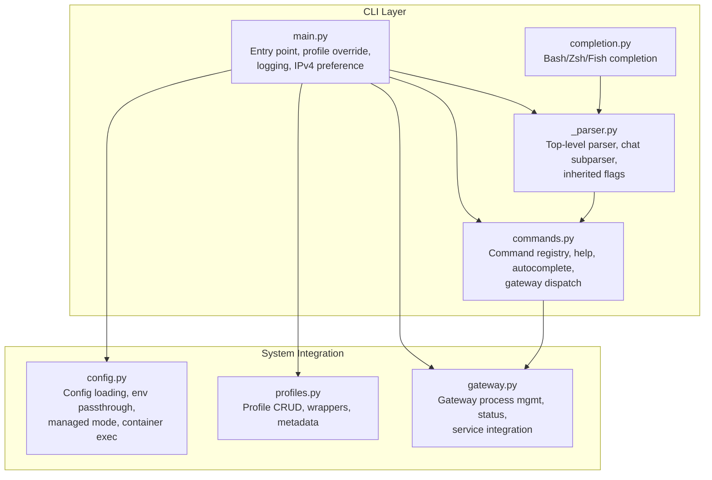
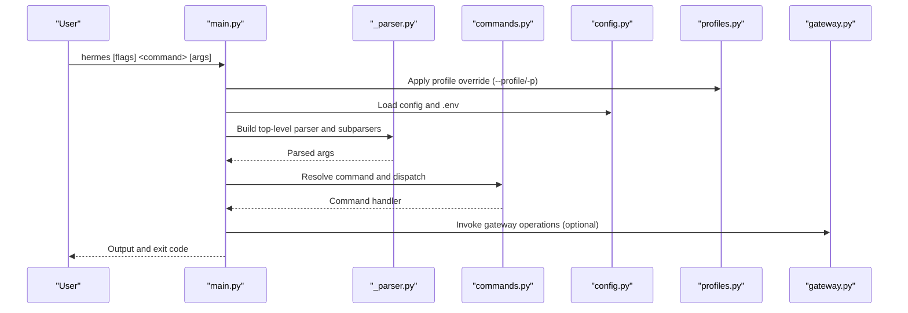
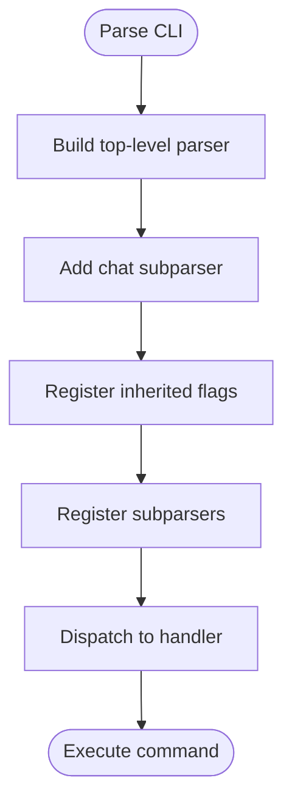
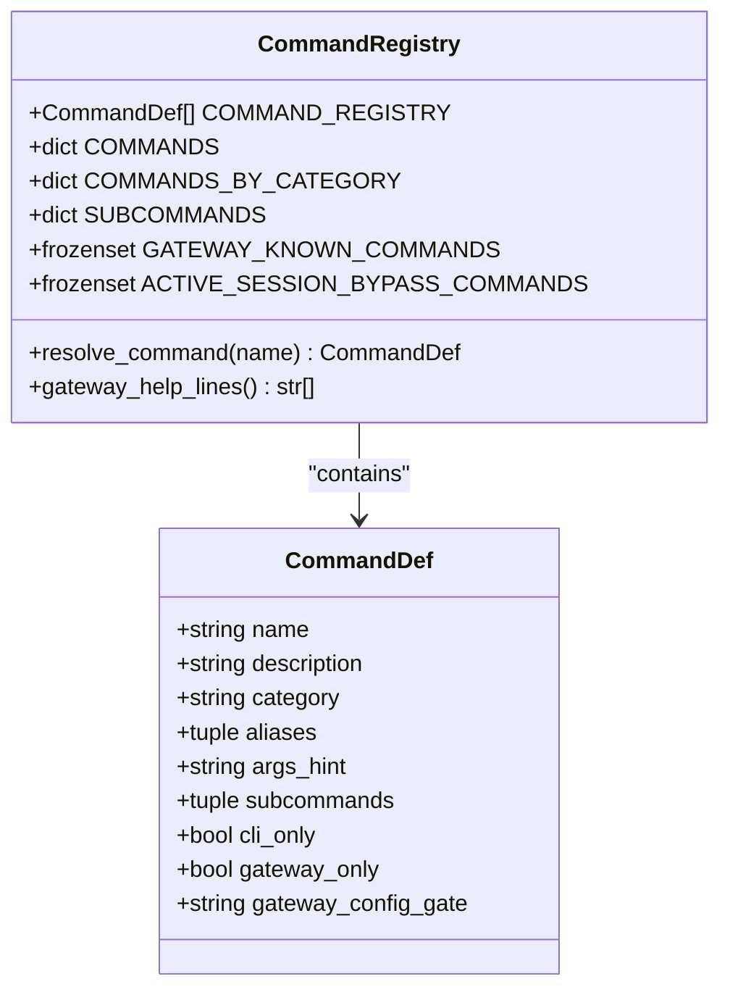
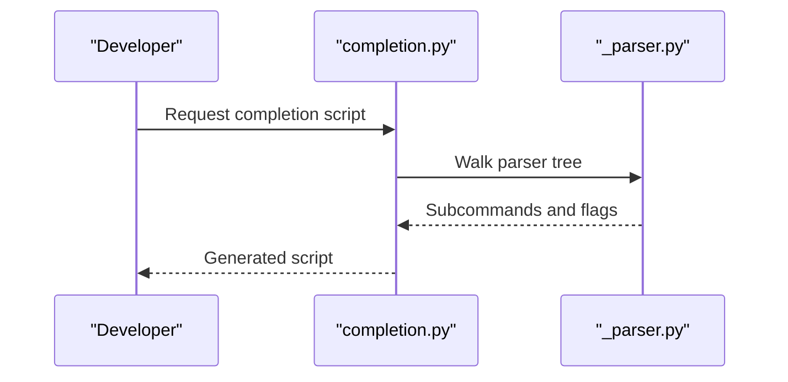
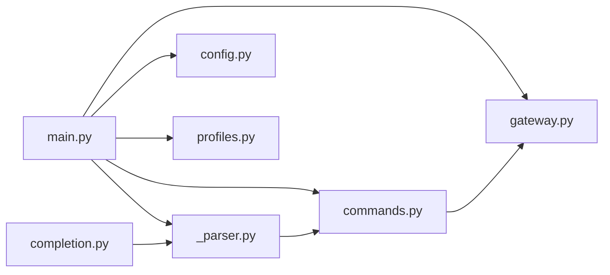

# Command System

<cite>
**Referenced Files in This Document**
- [main.py](file://hermes_cli/main.py)
- [_parser.py](file://hermes_cli/_parser.py)
- [commands.py](file://hermes_cli/commands.py)
- [completion.py](file://hermes_cli/completion.py)
- [config.py](file://hermes_cli/config.py)
- [profiles.py](file://hermes_cli/profiles.py)
- [gateway.py](file://hermes_cli/gateway.py)
</cite>

## Table of Contents
1. [Introduction](#introduction)
2. [Project Structure](#project-structure)
3. [Core Components](#core-components)
4. [Architecture Overview](#architecture-overview)
5. [Detailed Component Analysis](#detailed-component-analysis)
6. [Dependency Analysis](#dependency-analysis)
7. [Performance Considerations](#performance-considerations)
8. [Troubleshooting Guide](#troubleshooting-guide)
9. [Conclusion](#conclusion)
10. [Appendices](#appendices)

## Introduction
This document explains the CLI command system architecture for the Hermes Agent. It covers how commands are parsed and routed, how arguments are processed, and how subcommands are structured. It documents the command registration system, help generation, and autocompletion functionality. It also details major command categories (chat, gateway management, setup wizards, configuration management, and utilities), the configuration system integration, environment variable handling, and profile management. Practical examples, advanced usage scenarios, validation, error handling, and user feedback mechanisms are included, along with the relationship between CLI commands and underlying system operations.

## Project Structure
The CLI is implemented primarily in the hermes_cli package:
- Entry point and top-level parsing: main.py and _parser.py
- Command registry and dispatch: commands.py
- Autocompletion generation: completion.py
- Configuration and environment: config.py
- Profiles and environment switching: profiles.py
- Gateway lifecycle management: gateway.py

**Diagram sources**
- [main.py:1-266](file://hermes_cli/main.py#L1-L266)
- [_parser.py:82-376](file://hermes_cli/_parser.py#L82-L376)
- [commands.py:45-438](file://hermes_cli/commands.py#L45-L438)
- [completion.py:15-316](file://hermes_cli/completion.py#L15-L316)
- [config.py:323-464](file://hermes_cli/config.py#L323-L464)
- [profiles.py:210-311](file://hermes_cli/profiles.py#L210-L311)
- [gateway.py:49-800](file://hermes_cli/gateway.py#L49-L800)

**Section sources**
- [main.py:1-266](file://hermes_cli/main.py#L1-L266)
- [_parser.py:82-376](file://hermes_cli/_parser.py#L82-L376)
- [commands.py:45-438](file://hermes_cli/commands.py#L45-L438)
- [completion.py:15-316](file://hermes_cli/completion.py#L15-L316)
- [config.py:323-464](file://hermes_cli/config.py#L323-L464)
- [profiles.py:210-311](file://hermes_cli/profiles.py#L210-L311)
- [gateway.py:49-800](file://hermes_cli/gateway.py#L49-L800)

## Core Components
- Top-level parser and chat subparser define flags and subcommands, including inherited flags carried across relaunches.
- Command registry centralizes slash command definitions, aliases, categories, and availability gates for gateway surfaces.
- Autocompletion generator walks the parser tree to produce dynamic completion scripts for bash, zsh, and fish.
- Configuration and environment loader integrate with config.yaml and .env, including managed mode and container-aware execution.
- Profiles provide isolated environments with wrapper scripts and metadata, enabling multi-profile workflows.
- Gateway module manages process lifecycle, service integration, and status queries.

**Section sources**
- [_parser.py:82-376](file://hermes_cli/_parser.py#L82-L376)
- [commands.py:45-438](file://hermes_cli/commands.py#L45-L438)
- [completion.py:15-316](file://hermes_cli/completion.py#L15-L316)
- [config.py:323-464](file://hermes_cli/config.py#L323-L464)
- [profiles.py:210-311](file://hermes_cli/profiles.py#L210-L311)
- [gateway.py:49-800](file://hermes_cli/gateway.py#L49-L800)

## Architecture Overview
The CLI architecture follows a layered design:
- Parsing layer: argparse-based top-level parser and chat subparser with inherited flags.
- Command layer: central registry for slash commands, help generation, and gateway dispatch.
- Integration layer: configuration and environment handling, profile management, and gateway process management.
- Completion layer: dynamic shell completion generation.

**Diagram sources**
- [main.py:119-205](file://hermes_cli/main.py#L119-L205)
- [main.py:239-243](file://hermes_cli/main.py#L239-L243)
- [_parser.py:82-376](file://hermes_cli/_parser.py#L82-L376)
- [commands.py:237-370](file://hermes_cli/commands.py#L237-L370)
- [config.py:323-464](file://hermes_cli/config.py#L323-L464)
- [profiles.py:210-311](file://hermes_cli/profiles.py#L210-L311)
- [gateway.py:49-800](file://hermes_cli/gateway.py#L49-L800)

## Detailed Component Analysis

### Command Parsing and Routing
- Top-level parser defines version, oneshot, model/provider overrides, toolsets, resume/continue, worktree, inherited flags, and subparsers.
- Chat subparser adds query/image flags, model/provider overrides, verbose/quiet modes, resume/continue, worktree, inherited flags, checkpoints, max turns, and source.
- Inherited flags are tagged for relaunch preservation, ensuring continuity across interactive flows (e.g., after session browsing).

**Diagram sources**
- [_parser.py:82-376](file://hermes_cli/_parser.py#L82-L376)

**Section sources**
- [_parser.py:82-376](file://hermes_cli/_parser.py#L82-L376)

### Argument Processing and Validation
- Profile override is applied before module imports to ensure correct HERMES_HOME resolution. It strips the flag from argv to avoid argparse choking.
- IPv4 preference is applied early to influence HTTP client behavior.
- Logging is initialized centrally to capture all subcommands.
- Provider configuration presence is probed to gate external tool credentials and improve UX during setup.

**Section sources**
- [main.py:119-205](file://hermes_cli/main.py#L119-L205)
- [main.py:245-257](file://hermes_cli/main.py#L245-L257)
- [main.py:239-243](file://hermes_cli/main.py#L239-L243)
- [main.py:287-399](file://hermes_cli/main.py#L287-L399)

### Subcommand Structure and Registration
- Central registry defines slash commands with name, description, category, aliases, args_hint, subcommands, and availability flags (cli_only, gateway_only, gateway_config_gate).
- Help generation derives from the registry for CLI and gateway surfaces.
- Gateway-known commands include both built-in and plugin-registered commands, with config-gated visibility.

**Diagram sources**
- [commands.py:45-438](file://hermes_cli/commands.py#L45-L438)

**Section sources**
- [commands.py:45-438](file://hermes_cli/commands.py#L45-L438)

### Help Generation and Autocompletion
- Help generation pulls from the registry, including aliases and args hints, for both CLI and gateway surfaces.
- Autocompletion scripts are generated dynamically by walking the parser tree, supporting bash, zsh, and fish.
- Special handling for the profile subcommand and inherited flags (e.g., --profile) ensures accurate completion.

**Diagram sources**
- [completion.py:15-316](file://hermes_cli/completion.py#L15-L316)
- [_parser.py:82-376](file://hermes_cli/_parser.py#L82-L376)

**Section sources**
- [completion.py:15-316](file://hermes_cli/completion.py#L15-L316)

### Major Command Categories

#### Chat Commands
- Interactive chat with optional single-query mode, image attachment, model/provider overrides, toolsets, verbose/quiet modes, resume/continue, checkpoints, max turns, and source tagging.
- One-shot mode prints only the final response text without banners or tool previews.

Practical examples:
- Start interactive chat: hermes
- Single query: hermes chat -q "Hello"
- Resume session: hermes chat --resume <session_id>
- Quiet mode for scripts: hermes chat --quiet -q "Echo"

**Section sources**
- [_parser.py:234-376](file://hermes_cli/_parser.py#L234-L376)

#### Gateway Management
- Gateway lifecycle: run, start, stop, restart, status, install, uninstall, setup.
- Process scanning, service integration (systemd/launchd), and graceful restart via signal.
- Status reporting includes service state, running PIDs, and runtime snapshots.

Practical examples:
- Start gateway: hermes gateway start
- Check status: hermes gateway status
- Restart with drain: hermes gateway restart

**Section sources**
- [gateway.py:49-800](file://hermes_cli/gateway.py#L49-L800)

#### Setup Wizards
- Setup wizard entry points and related flows are integrated into the CLI entry and configuration loading.

**Section sources**
- [main.py:239-243](file://hermes_cli/main.py#L239-L243)

#### Configuration Management
- Show current configuration, edit config, set values, and wizard re-run.
- Managed mode detection, container-aware execution, and environment passthrough.

Practical examples:
- Show config: hermes config
- Edit config: hermes config edit
- Set model: hermes config set model gpt-4

**Section sources**
- [config.py:323-464](file://hermes_cli/config.py#L323-L464)

#### Utility Commands
- Tools and skills management, cron scheduling, platform status, copy/paste attachments, image attachment, update, debug report upload, dashboard control, and more.

Practical examples:
- List tools: hermes tools list
- Manage cron: hermes cron list
- Platform status: hermes platforms

**Section sources**
- [commands.py:160-217](file://hermes_cli/commands.py#L160-L217)

### Configuration System Integration and Environment Variables
- Configuration loading with caching, defaults merging, and environment expansion.
- Managed mode and container-aware behavior for permissions and execution.
- Environment variable handling for API keys and platform credentials.

Key behaviors:
- Parse failures are logged and surfaced once per file change.
- Managed mode influences update commands and error messaging.
- Container mode metadata triggers containerized execution.

**Section sources**
- [config.py:37-72](file://hermes_cli/config.py#L37-L72)
- [config.py:166-268](file://hermes_cli/config.py#L166-L268)
- [config.py:274-317](file://hermes_cli/config.py#L274-L317)

### Profile Management
- Isolated profiles with independent config.yaml, .env, sessions, skills, gateway, cron, and logs.
- Wrapper scripts enable quick access to profiles via aliases.
- CRUD operations, validation, and metadata persistence.

Practical examples:
- Create profile: hermes profile create coder
- Use profile: hermes profile use coder
- List profiles: hermes profile list

**Section sources**
- [profiles.py:210-311](file://hermes_cli/profiles.py#L210-L311)
- [profiles.py:573-631](file://hermes_cli/profiles.py#L573-L631)

### Command-Line Flags and Options
- Global flags: version, oneshot, model/provider overrides, toolsets, resume/continue, worktree, accept-hooks, skills, yolo, pass-session-id, ignore-user-config, ignore-rules, tui/dev.
- Chat subparser flags mirror global flags with additional options for checkpoints, max turns, and source.
- Inherited flags are preserved across relaunch scenarios.

Effects on system behavior:
- Model/provider overrides influence inference selection.
- Quiet mode suppresses UI elements for scripted usage.
- Accept-hooks auto-approves shell hooks in non-TTY contexts.
- TUI toggles modern interface versus classic REPL.

**Section sources**
- [_parser.py:82-376](file://hermes_cli/_parser.py#L82-L376)

### Command Validation, Error Handling, and User Feedback
- Profile override validates names and rejects reserved values.
- Gateway status and process scanning handle platform differences (Windows, POSIX).
- Managed mode and container detection provide user-friendly errors and guidance.
- Logging initialization ensures consistent error visibility.

**Section sources**
- [profiles.py:267-295](file://hermes_cli/profiles.py#L267-L295)
- [gateway.py:334-478](file://hermes_cli/gateway.py#L334-L478)
- [config.py:166-268](file://hermes_cli/config.py#L166-L268)

## Dependency Analysis
The CLI components interact as follows:
- main.py orchestrates profile override, config/env loading, logging, and parser construction.
- _parser.py constructs the argument tree and inherits flags for relaunch continuity.
- commands.py provides the central registry and gateway dispatch logic.
- completion.py depends on the parser tree for dynamic completion.
- config.py integrates with profiles and gateway for environment and runtime state.
- gateway.py coordinates with system services and process management.

**Diagram sources**
- [main.py:119-205](file://hermes_cli/main.py#L119-L205)
- [_parser.py:82-376](file://hermes_cli/_parser.py#L82-L376)
- [commands.py:294-346](file://hermes_cli/commands.py#L294-L346)
- [completion.py:15-44](file://hermes_cli/completion.py#L15-L44)
- [config.py:323-464](file://hermes_cli/config.py#L323-L464)
- [profiles.py:210-311](file://hermes_cli/profiles.py#L210-L311)
- [gateway.py:49-800](file://hermes_cli/gateway.py#L49-L800)

**Section sources**
- [main.py:119-205](file://hermes_cli/main.py#L119-L205)
- [_parser.py:82-376](file://hermes_cli/_parser.py#L82-L376)
- [commands.py:294-346](file://hermes_cli/commands.py#L294-L346)
- [completion.py:15-44](file://hermes_cli/completion.py#L15-L44)
- [config.py:323-464](file://hermes_cli/config.py#L323-L464)
- [profiles.py:210-311](file://hermes_cli/profiles.py#L210-L311)
- [gateway.py:49-800](file://hermes_cli/gateway.py#L49-L800)

## Performance Considerations
- Config loading caches expanded and raw configurations keyed by path and mtime to reduce YAML parsing overhead.
- Thread-safe access to config files prevents race conditions during concurrent operations.
- Container-aware execution and managed mode optimizations minimize unnecessary filesystem operations and permission changes.

[No sources needed since this section provides general guidance]

## Troubleshooting Guide
Common issues and resolutions:
- Profile name validation errors: ensure names match allowed patterns and are not reserved.
- Gateway status confusion: use service integration detection and process scanning; verify managed mode and container settings.
- Configuration parse failures: fix YAML syntax; warnings are logged once per file change.
- Managed mode restrictions: use recommended update commands for the detected installation method.

**Section sources**
- [profiles.py:267-295](file://hermes_cli/profiles.py#L267-L295)
- [gateway.py:648-777](file://hermes_cli/gateway.py#L648-L777)
- [config.py:37-72](file://hermes_cli/config.py#L37-L72)
- [config.py:166-268](file://hermes_cli/config.py#L166-L268)

## Conclusion
The CLI command system is a robust, layered architecture centered on argparse-based parsing, a central command registry, dynamic autocompletion, and strong integration with configuration, environment, profiles, and gateway lifecycle management. It balances usability (help, completion, wizard flows) with reliability (validation, error handling, managed/container awareness) and performance (caching, thread safety).

## Appendices

### Practical Examples Index
- Interactive chat: hermes
- Single query: hermes chat -q "..."
- Resume session: hermes chat --resume <id>
- Quiet mode: hermes chat --quiet -q "..."
- Gateway start/status/restart: hermes gateway start/status/restart
- Show config/edit/set: hermes config/show/edit/set
- Tools/skills/cron/platforms: hermes tools/skills/cron/platforms
- Profile create/use/list: hermes profile create/use/list

[No sources needed since this section aggregates previously cited examples]