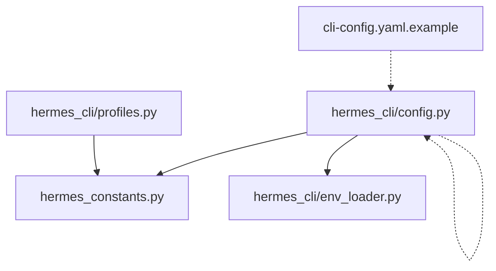
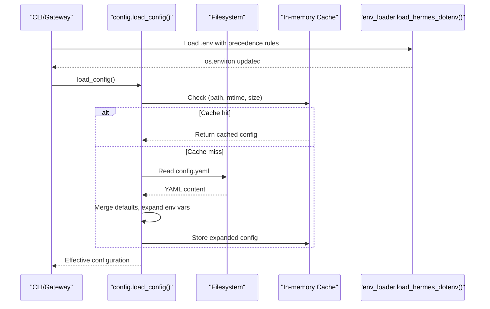
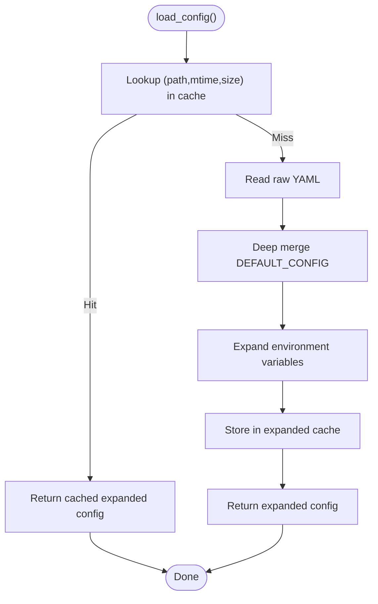
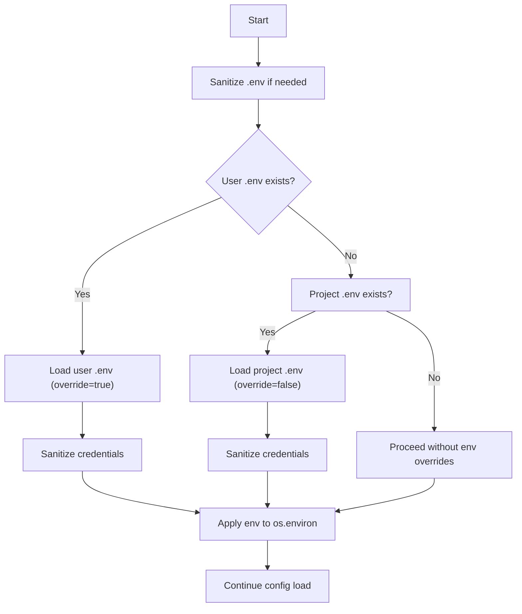
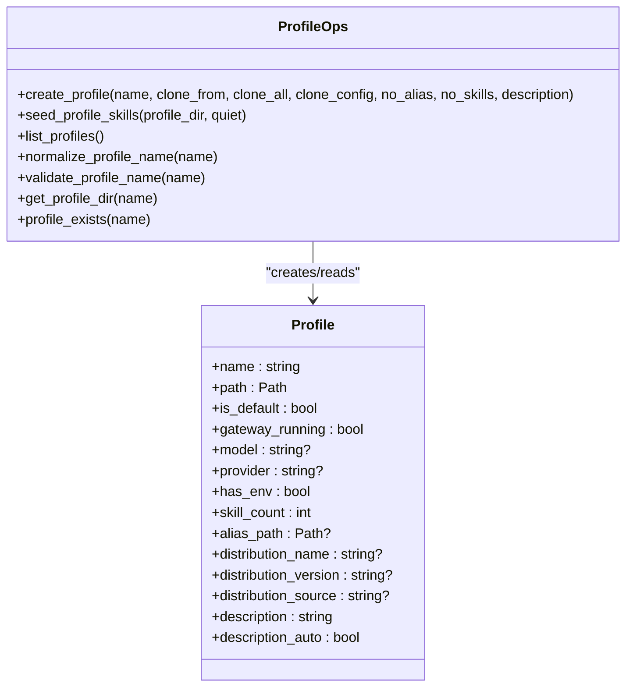
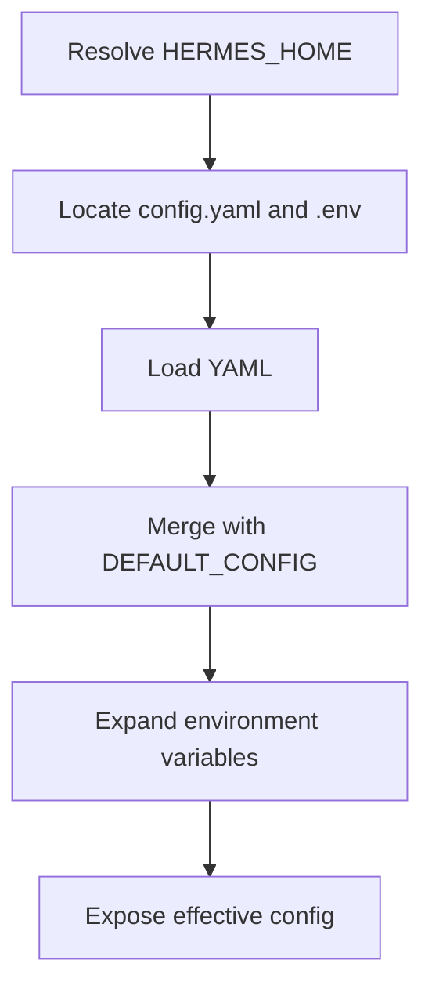
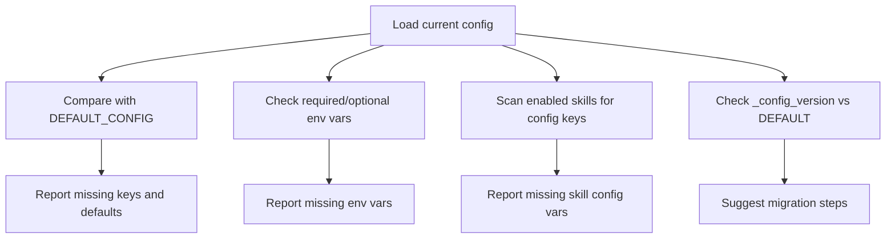
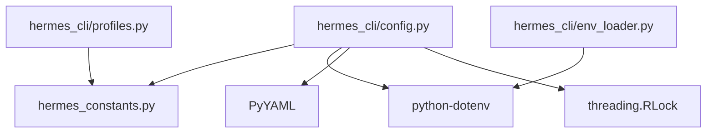

# Configuration Handling

<cite>
**Referenced Files in This Document**
- [config.py](file://hermes_cli/config.py)
- [profiles.py](file://hermes_cli/profiles.py)
- [env_loader.py](file://hermes_cli/env_loader.py)
- [hermes_constants.py](file://hermes_constants.py)
- [cli-config.yaml.example](file://cli-config.yaml.example)
</cite>

## Table of Contents
1. [Introduction](#introduction)
2. [Project Structure](#project-structure)
3. [Core Components](#core-components)
4. [Architecture Overview](#architecture-overview)
5. [Detailed Component Analysis](#detailed-component-analysis)
6. [Dependency Analysis](#dependency-analysis)
7. [Performance Considerations](#performance-considerations)
8. [Troubleshooting Guide](#troubleshooting-guide)
9. [Conclusion](#conclusion)
10. [Appendices](#appendices)

## Introduction
This document explains the CLI configuration system used by the Hermes Agent. It covers configuration file structure, environment variable precedence, dynamic loading, profile-based isolation, validation and migration, environment handling and secrets, discovery and defaults, and the relationship between CLI configuration and agent runtime behavior. Practical examples and troubleshooting guidance are included to help users configure, validate, and maintain their installations safely and efficiently.

## Project Structure
The configuration system spans several modules:
- Central configuration loader and defaults
- Profile management for environment isolation
- Environment (.env) loading and sanitization
- Constants and path resolution
- Example configuration schema

**Diagram sources**
- [config.py:1-200](file://hermes_cli/config.py#L1-L200)
- [hermes_constants.py:1-120](file://hermes_constants.py#L1-L120)
- [env_loader.py:1-176](file://hermes_cli/env_loader.py#L1-L176)
- [profiles.py:1-120](file://hermes_cli/profiles.py#L1-L120)
- [cli-config.yaml.example:1-120](file://cli-config.yaml.example#L1-L120)

**Section sources**
- [config.py:1-200](file://hermes_cli/config.py#L1-L200)
- [hermes_constants.py:1-120](file://hermes_constants.py#L1-L120)
- [env_loader.py:1-176](file://hermes_cli/env_loader.py#L1-L176)
- [profiles.py:1-120](file://hermes_cli/profiles.py#L1-L120)
- [cli-config.yaml.example:1-120](file://cli-config.yaml.example#L1-L120)

## Core Components
- Configuration defaults and schema: The module defines a comprehensive DEFAULT_CONFIG dictionary that establishes the baseline configuration, including model selection, providers, agent behavior, terminal backends, browser settings, tool loop guardrails, compression, prompt caching, auxiliary models, display, privacy, TTS/STT, voice, memory, delegation, goals, skills, curator, platform settings, approvals, hooks, security, cron, kanban, code execution, logging, model catalog, network, sessions, onboarding, updates, LSP, x_search, and a version marker.
- Dynamic loading and caching: The loader reads YAML, merges defaults, expands environment variables, and caches results to avoid repeated parsing and merging.
- Environment variable handling: A dedicated loader sanitizes credentials, supports fallback encodings, and ensures precedence rules between user .env and project .env.
- Profile system: Profiles provide fully isolated environments with independent config.yaml, .env, memories, sessions, skills, logs, and more.
- Validation and migration: Helpers detect missing fields, missing environment variables, and missing skill configuration variables; migration metadata tracks environment variables introduced across versions.

Key responsibilities:
- Provide a single source of truth for configuration paths and defaults
- Enforce environment variable precedence and sanitize credentials
- Support profile-based isolation and environment passthrough
- Validate and migrate configuration across versions

**Section sources**
- [config.py:470-1693](file://hermes_cli/config.py#L470-L1693)
- [config.py:1695-1777](file://hermes_cli/config.py#L1695-L1777)
- [config.py:2783-2802](file://hermes_cli/config.py#L2783-L2802)
- [config.py:2856-2881](file://hermes_cli/config.py#L2856-L2881)
- [config.py:2884-2928](file://hermes_cli/config.py#L2884-L2928)
- [env_loader.py:142-176](file://hermes_cli/env_loader.py#L142-L176)
- [profiles.py:1-120](file://hermes_cli/profiles.py#L1-L120)

## Architecture Overview
The configuration architecture integrates file-based configuration, environment variables, and profile isolation. The loader ensures thread-safe access, caches results, and exposes helpers for validation and migration.

**Diagram sources**
- [config.py:83-95](file://hermes_cli/config.py#L83-L95)
- [config.py:370-420](file://hermes_cli/config.py#L370-L420)
- [env_loader.py:142-176](file://hermes_cli/env_loader.py#L142-L176)

**Section sources**
- [config.py:370-420](file://hermes_cli/config.py#L370-L420)
- [config.py:83-95](file://hermes_cli/config.py#L83-L95)
- [env_loader.py:142-176](file://hermes_cli/env_loader.py#L142-L176)

## Detailed Component Analysis

### Configuration Loading and Caching
- Thread-safe loading: A lock serializes reads/writes to avoid concurrent YAML loads and ensures cache coherency.
- Caching strategy: Two caches track raw and expanded configurations keyed by (path, mtime, size). Atomic file writes invalidate caches automatically.
- Parsing and expansion: YAML is parsed, defaults merged, and environment variables expanded. Errors are surfaced once per file instance to avoid spam.

**Diagram sources**
- [config.py:83-95](file://hermes_cli/config.py#L83-L95)
- [config.py:370-420](file://hermes_cli/config.py#L370-L420)

**Section sources**
- [config.py:83-95](file://hermes_cli/config.py#L83-L95)
- [config.py:370-420](file://hermes_cli/config.py#L370-L420)

### Environment Variable Precedence and Secrets
- Precedence: ~/.hermes/.env overrides shell-exported values when present; project .env acts as a dev fallback and only fills missing values when the user env exists; if no user env exists, project .env also overrides stale shell vars.
- Sanitization: Credentials are sanitized to ASCII to prevent HTTP header corruption; offending characters are stripped and reported once per process lifecycle.
- Encoding fallback: Corrupted .env lines are pre-sanitized before parsing to avoid mangling values.

**Diagram sources**
- [env_loader.py:97-140](file://hermes_cli/env_loader.py#L97-L140)
- [env_loader.py:142-176](file://hermes_cli/env_loader.py#L142-L176)

**Section sources**
- [env_loader.py:97-140](file://hermes_cli/env_loader.py#L97-L140)
- [env_loader.py:142-176](file://hermes_cli/env_loader.py#L142-L176)

### Profile System: Switching, Inheritance, and Isolation
- Isolation: Each profile is a fully independent HERMES_HOME directory with its own config.yaml, .env, memories, sessions, skills, logs, and more. Profiles live under ~/.hermes/profiles/<name>/ by default; the "default" profile is ~/.hermes itself.
- Switching: Profiles can be created, used, and deleted; a sticky active profile can be set; wrapper scripts enable alias-based invocation.
- Inheritance: Profiles can clone configuration and skills from another profile; cloning supports selective inclusion and excludes infrastructure artifacts.
- Environment isolation: Subprocesses can use a per-profile HOME directory to keep tool configs (git, ssh, gh, npm) inside the profile’s data directory.

**Diagram sources**
- [profiles.py:399-426](file://hermes_cli/profiles.py#L399-L426)
- [profiles.py:633-777](file://hermes_cli/profiles.py#L633-L777)
- [profiles.py:573-630](file://hermes_cli/profiles.py#L573-L630)

**Section sources**
- [profiles.py:1-120](file://hermes_cli/profiles.py#L1-L120)
- [profiles.py:297-310](file://hermes_cli/profiles.py#L297-L310)
- [profiles.py:633-777](file://hermes_cli/profiles.py#L633-L777)
- [profiles.py:573-630](file://hermes_cli/profiles.py#L573-L630)
- [hermes_constants.py:165-188](file://hermes_constants.py#L165-L188)

### Configuration Discovery, Defaults, and Overrides
- Discovery: Configuration files are discovered under the canonical HERMES_HOME directory. Paths are resolved via constants to ensure consistency across modules.
- Defaults: DEFAULT_CONFIG provides a comprehensive baseline covering model selection, providers, agent behavior, terminal backends, browser settings, tool loop guardrails, compression, prompt caching, auxiliary models, display, privacy, TTS/STT, voice, memory, delegation, goals, skills, curator, platform settings, approvals, hooks, security, cron, kanban, code execution, logging, model catalog, network, sessions, onboarding, updates, LSP, x_search, and a version marker.
- Overrides: Environment variables are expanded into the configuration at load time; provider overrides and model-specific settings are supported.

**Diagram sources**
- [hermes_constants.py:14-68](file://hermes_constants.py#L14-L68)
- [config.py:470-1693](file://hermes_cli/config.py#L470-L1693)
- [config.py:370-420](file://hermes_cli/config.py#L370-L420)

**Section sources**
- [hermes_constants.py:14-68](file://hermes_constants.py#L14-L68)
- [config.py:470-1693](file://hermes_cli/config.py#L470-L1693)
- [config.py:370-420](file://hermes_cli/config.py#L370-L420)

### Validation, Migration, and Upgrade
- Missing fields: Helpers recursively compare DEFAULT_CONFIG with the loaded configuration to report missing keys and their defaults.
- Missing environment variables: Helpers enumerate required and optional environment variables and report those not present.
- Missing skill configuration variables: Helpers scan enabled skills for declared configuration keys and report those absent or empty in config.yaml.
- Migration metadata: ENV_VARS_BY_VERSION tracks environment variables introduced in each config version; migration prompts highlight only new variables since the user’s last version.

**Diagram sources**
- [config.py:2856-2881](file://hermes_cli/config.py#L2856-L2881)
- [config.py:2783-2802](file://hermes_cli/config.py#L2783-L2802)
- [config.py:2884-2928](file://hermes_cli/config.py#L2884-L2928)
- [config.py:1699-1708](file://hermes_cli/config.py#L1699-L1708)

**Section sources**
- [config.py:2856-2881](file://hermes_cli/config.py#L2856-L2881)
- [config.py:2783-2802](file://hermes_cli/config.py#L2783-L2802)
- [config.py:2884-2928](file://hermes_cli/config.py#L2884-L2928)
- [config.py:1699-1708](file://hermes_cli/config.py#L1699-L1708)

### Practical Configuration Scenarios
- Set a model and provider: Use the model.default and model.provider keys in config.yaml; environment variables can override provider selection and base URLs.
- Configure terminal backends: Choose among local, SSH, Docker, Singularity, Modal, or Daytona; set timeouts, resource limits, and optional sudo support.
- Enable browser automation: Configure browser settings, inactivity timeouts, and optional cloud browser providers.
- Tune tool loop guardrails: Adjust warnings and hard stops for repeated failures or non-progressing tool calls.
- Manage context compression: Configure thresholds, target ratios, and protection for head/tail messages.
- Configure auxiliary models: Select providers and models for vision, web extraction, compression, session search, and other side tasks.
- Secure environment handling: Use .env for secrets; ensure proper permissions and avoid exposing sensitive data.
- Use profiles for isolation: Create named profiles for different roles or tenants; clone configurations and skills as needed.

**Section sources**
- [cli-config.yaml.example:1-800](file://cli-config.yaml.example#L1-L800)
- [config.py:470-1693](file://hermes_cli/config.py#L470-L1693)
- [profiles.py:633-777](file://hermes_cli/profiles.py#L633-L777)

### Advanced Patterns
- Provider overrides: Use the providers section to set per-provider request timeouts, non-stream stale timeouts, and per-model exceptions.
- Custom providers: Normalize and validate custom provider entries; ensure base URLs and model lists are valid.
- Environment passthrough: Configure terminal.env_passthrough and docker_forward_env to securely pass environment variables into sandboxed execution.
- Proxy and network settings: Force IPv4 connections when IPv6 is unreliable; configure proxies for messaging platforms and API servers.

**Section sources**
- [cli-config.yaml.example:67-97](file://cli-config.yaml.example#L67-L97)
- [config.py:2931-3056](file://hermes_cli/config.py#L2931-L3056)
- [config.py:3059-3120](file://hermes_cli/config.py#L3059-L3120)
- [hermes_constants.py:300-340](file://hermes_constants.py#L300-L340)

## Dependency Analysis
The configuration system depends on:
- hermes_constants for canonical paths and environment detection
- python-dotenv for environment file loading
- YAML parsing for configuration files
- Threading locks for thread-safe access

**Diagram sources**
- [config.py:147-149](file://hermes_cli/config.py#L147-L149)
- [env_loader.py:9-10](file://hermes_cli/env_loader.py#L9-L10)
- [hermes_constants.py:1-12](file://hermes_constants.py#L1-L12)

**Section sources**
- [config.py:147-149](file://hermes_cli/config.py#L147-L149)
- [env_loader.py:9-10](file://hermes_cli/env_loader.py#L9-L10)
- [hermes_constants.py:1-12](file://hermes_constants.py#L1-L12)

## Performance Considerations
- Caching: Expanded and raw configuration caches avoid repeated YAML parsing and merging; atomic file writes invalidate caches automatically.
- Concurrency: A reentrant lock serializes reads/writes to prevent race conditions and ensure consistent cache behavior.
- Environment sanitization: Credential sanitization occurs once per process and avoids repeated overhead.
- Container and managed mode: Special handling reduces unnecessary permission changes in containerized or managed environments.

[No sources needed since this section provides general guidance]

## Troubleshooting Guide
Common issues and resolutions:
- YAML parse failures: The loader surfaces a warning and falls back to defaults; fix the YAML and restart.
- Environment variable precedence confusion: ~/.hermes/.env overrides shell-exported values; project .env only fills missing values when user env exists.
- Non-ASCII credentials: Credentials are sanitized to ASCII; copy keys from provider dashboards and run setup again.
- Profile isolation pitfalls: Ensure subprocesses use the per-profile HOME when needed; verify active profile and sticky settings.
- Missing configuration fields: Use helpers to detect missing keys and their defaults; add them to config.yaml.
- Missing environment variables: Use helpers to enumerate required and optional variables; set them in .env or shell.
- Migration surprises: Review ENV_VARS_BY_VERSION and apply only new variables since your last version.

**Section sources**
- [config.py:37-72](file://hermes_cli/config.py#L37-L72)
- [env_loader.py:40-95](file://hermes_cli/env_loader.py#L40-L95)
- [config.py:2783-2802](file://hermes_cli/config.py#L2783-L2802)
- [config.py:2856-2881](file://hermes_cli/config.py#L2856-L2881)
- [config.py:1699-1708](file://hermes_cli/config.py#L1699-L1708)

## Conclusion
The CLI configuration system provides a robust, secure, and flexible foundation for Hermes Agent. It combines comprehensive defaults, strict environment precedence, profile-based isolation, and strong validation and migration support. By following the guidance in this document, users can confidently configure, validate, and maintain their installations across diverse environments.

[No sources needed since this section summarizes without analyzing specific files]

## Appendices

### Appendix A: Configuration Keys Overview
- Model and providers: model.default, model.provider, model.base_url, providers overrides, auxiliary models
- Agent behavior: agent.max_turns, agent.gateway_timeout, agent.restart_drain_timeout, agent.api_max_retries, agent.tool_use_enforcement, agent.clarify_timeout, agent.gateway_notify_interval, agent.gateway_auto_continue_freshness, agent.image_input_mode, agent.disabled_toolsets
- Terminal backends: terminal.backend, terminal.modal_mode, terminal.cwd, terminal.timeout, terminal.env_passthrough, terminal.shell_init_files, terminal.auto_source_bashrc, terminal.docker_image, terminal.docker_forward_env, terminal.docker_env, terminal.singularity_image, terminal.modal_image, terminal.daytona_image, terminal.vercel_runtime, terminal.container_cpu, terminal.container_memory, terminal.container_disk, terminal.container_persistent, terminal.docker_volumes, terminal.docker_mount_cwd_to_workspace, terminal.docker_extra_args, terminal.docker_run_as_host_user, terminal.persistent_shell
- Browser: browser.inactivity_timeout, browser.command_timeout, browser.record_sessions, browser.allow_private_urls, browser.engine, browser.auto_local_for_private_urls, browser.cdp_url, browser.dialog_policy, browser.dialog_timeout_s, browser.camofox.managed_persistence, browser.camofox.user_id, browser.camofox.session_key, browser.camofox.adopt_existing_tab
- Checkpoints: checkpoints.enabled, checkpoints.max_snapshots, checkpoints.max_total_size_mb, checkpoints.max_file_size_mb, checkpoints.auto_prune, checkpoints.retention_days, checkpoints.delete_orphans, checkpoints.min_interval_hours
- Tool output: tool_output.max_bytes, tool_output.max_lines, tool_output.max_line_length
- Tool loop guardrails: tool_loop_guardrails.warnings_enabled, tool_loop_guardrails.hard_stop_enabled, tool_loop_guardrails.warn_after.exact_failure, tool_loop_guardrails.warn_after.same_tool_failure, tool_loop_guardrails.warn_after.idempotent_no_progress, tool_loop_guardrails.hard_stop_after.exact_failure, tool_loop_guardrails.hard_stop_after.same_tool_failure, tool_loop_guardrails.hard_stop_after.idempotent_no_progress
- Compression: compression.enabled, compression.threshold, compression.target_ratio, compression.protect_last_n, compression.hygiene_hard_message_limit, compression.protect_first_n
- Prompt caching: prompt_caching.cache_ttl
- OpenRouter: openrouter.response_cache, openrouter.response_cache_ttl, openrouter.min_coding_score
- Display: display.compact, display.personality, display.resume_display, display.busy_input_mode, display.tui_auto_resume_recent, display.bell_on_complete, display.show_reasoning, display.streaming, display.timestamps, display.final_response_markdown, display.persistent_output, display.persistent_output_max_lines, display.inline_diffs, display.file_mutation_verifier, display.show_cost, display.skin, display.language, display.tui_status_indicator, display.user_message_preview.first_lines, display.user_message_preview.last_lines, display.interim_assistant_messages, display.tool_progress_command, display.tool_progress_overrides, display.tool_preview_length, display.ephemeral_system_ttl, display.platforms, display.runtime_footer.enabled, display.runtime_footer.fields, display.copy_shortcut
- Privacy: privacy.redact_pii
- TTS: tts.provider, tts.edge.*, tts.elevenlabs.*, tts.openai.*, tts.xai.*, tts.mistral.*, tts.neutts.*, tts.piper.*
- STT: stt.enabled, stt.provider, stt.local.*, stt.openai.*, stt.mistral.*
- Voice: voice.record_key, voice.max_recording_seconds, voice.auto_tts, voice.beep_enabled, voice.silence_threshold, voice.silence_duration
- Human delay: human_delay.mode, human_delay.min_ms, human_delay.max_ms
- Context engine: context.engine
- Memory: memory.memory_enabled, memory.user_profile_enabled, memory.memory_char_limit, memory.user_char_limit, memory.provider
- Delegation: delegation.model, delegation.provider, delegation.base_url, delegation.api_key, delegation.api_mode, delegation.inherit_mcp_toolsets, delegation.max_iterations, delegation.child_timeout_seconds, delegation.reasoning_effort, delegation.max_concurrent_children, delegation.max_spawn_depth, delegation.orchestrator_enabled, delegation.subagent_auto_approve
- Prefill messages: prefill_messages_file
- Goals: goals.max_turns
- Skills: skills.external_dirs, skills.template_vars, skills.inline_shell, skills.inline_shell_timeout, skills.guard_agent_created
- Curator: curator.enabled, curator.interval_hours, curator.min_idle_hours, curator.stale_after_days, curator.archive_after_days, curator.backup.enabled, curator.backup.keep
- Honcho: honcho.*
- Timezone: timezone
- Platform settings: slack.*, discord.*, whatsapp.*, telegram.*, mattermost.*, matrix.*
- Approvals: approvals.mode, approvals.timeout, approvals.cron_mode, approvals.mcp_reload_confirm, approvals.destructive_slash_confirm
- Command allowlist: command_allowlist
- Quick commands: quick_commands
- Hooks: hooks, hooks_auto_accept
- Personalities: personalities
- Security: security.allow_private_urls, security.redact_secrets, security.tirith_enabled, security.tirith_path, security.tirith_timeout, security.tirith_fail_open, security.website_blocklist.enabled, security.website_blocklist.domains, security.website_blocklist.shared_files, security.acked_advisories, security.allow_lazy_installs
- Cron: cron.wrap_response, cron.max_parallel_jobs
- Kanban: kanban.dispatch_in_gateway, kanban.dispatch_interval_seconds, kanban.failure_limit, kanban.orchestrator_profile, kanban.default_assignee, kanban.auto_decompose, kanban.auto_decompose_per_tick
- Code execution: code_execution.mode
- Logging: logging.level, logging.max_size_mb, logging.backup_count, logging.memory_monitor.enabled, logging.memory_monitor.interval_seconds
- Model catalog: model_catalog.enabled, model_catalog.url, model_catalog.ttl_hours, model_catalog.providers
- Network: network.force_ipv4
- Sessions: sessions.auto_prune, sessions.retention_days, sessions.vacuum_after_prune, sessions.min_interval_hours
- Onboarding: onboarding.seen
- Updates: updates.pre_update_backup, updates.backup_keep
- LSP: lsp.enabled, lsp.wait_mode, lsp.wait_timeout, lsp.install_strategy, lsp.servers
- x_search: x_search.model, x_search.timeout_seconds, x_search.retries
- Version: _config_version

**Section sources**
- [config.py:470-1693](file://hermes_cli/config.py#L470-L1693)