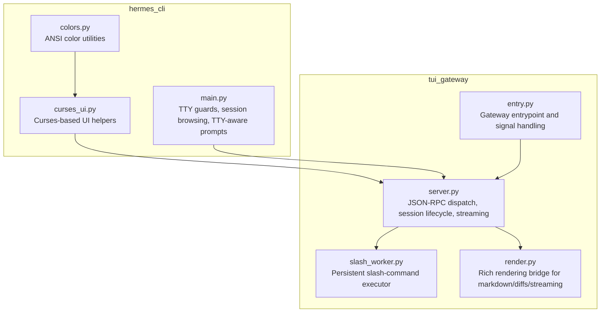
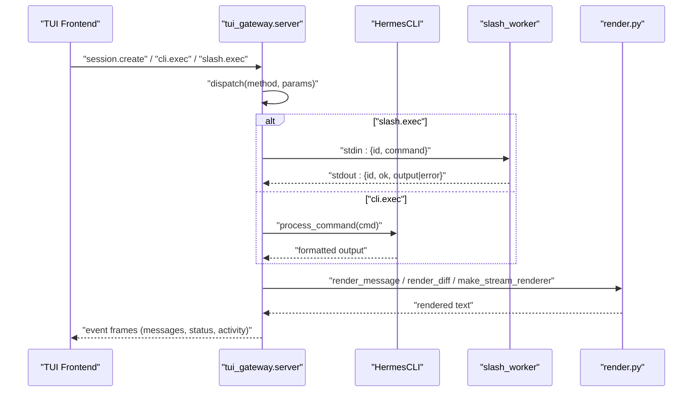
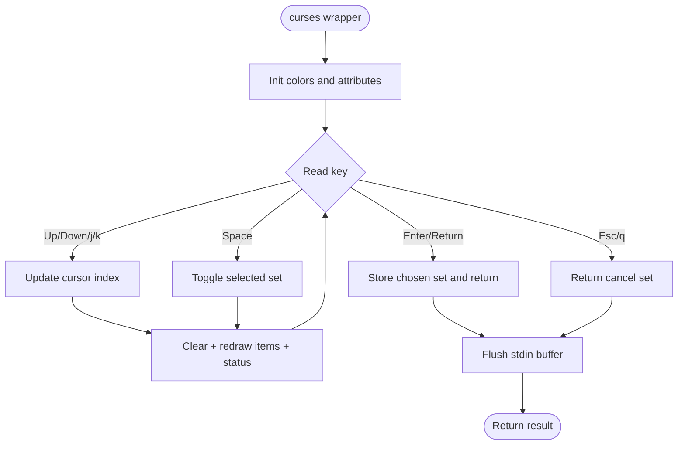
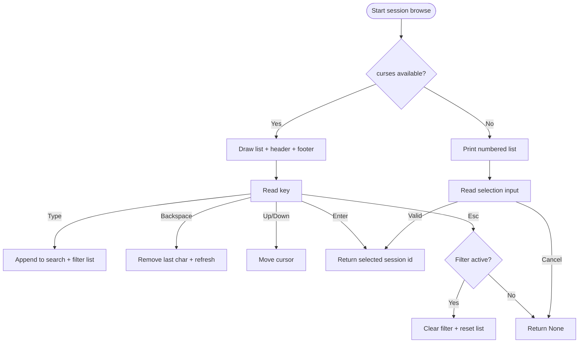
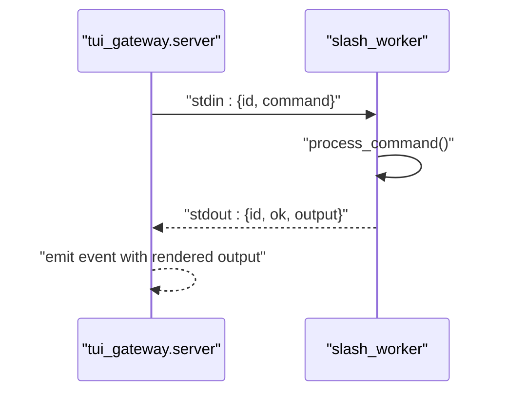
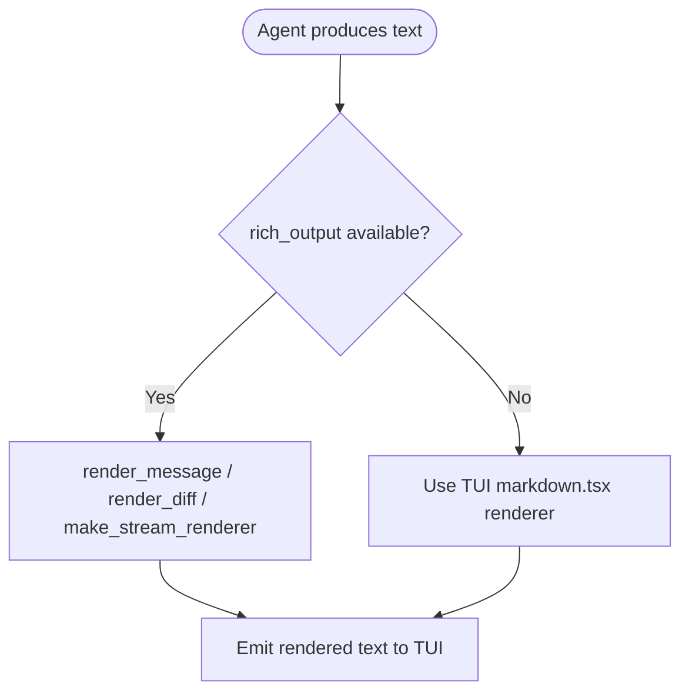
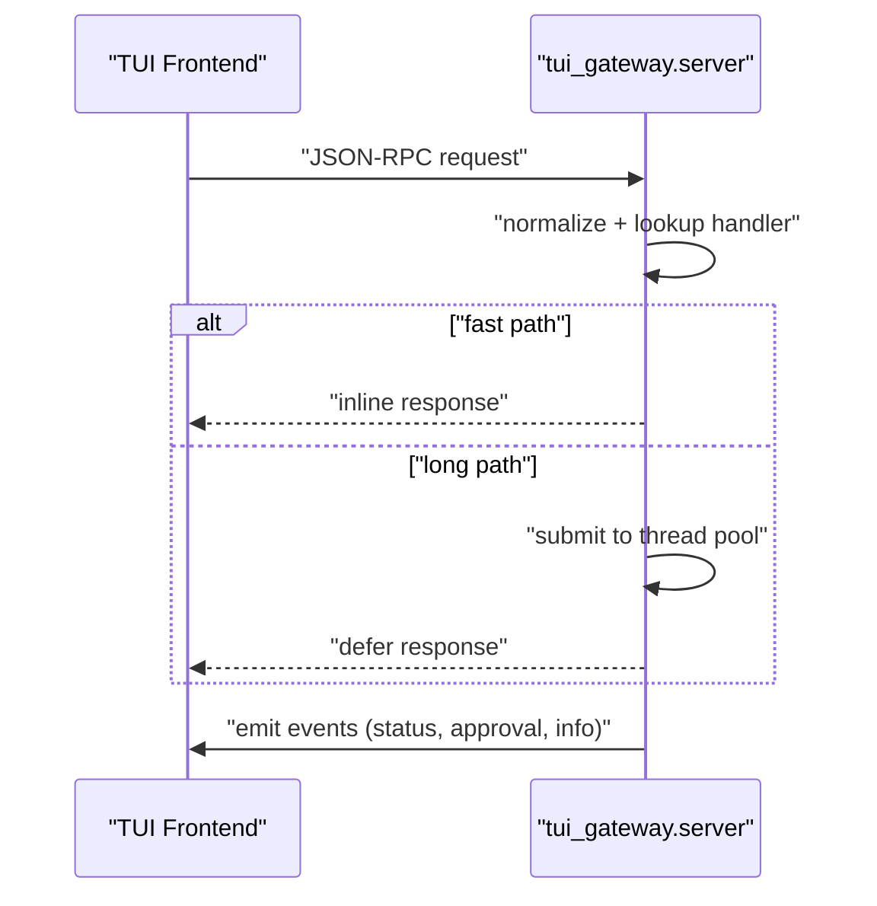
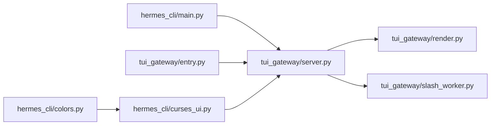

# Interactive TUI

<cite>
**Referenced Files in This Document**
- [curses_ui.py](file://hermes_cli/curses_ui.py)
- [colors.py](file://hermes_cli/colors.py)
- [main.py](file://hermes_cli/main.py)
- [server.py](file://tui_gateway/server.py)
- [entry.py](file://tui_gateway/entry.py)
- [slash_worker.py](file://tui_gateway/slash_worker.py)
- [render.py](file://tui_gateway/render.py)
</cite>

## Table of Contents
1. [Introduction](#introduction)
2. [Project Structure](#project-structure)
3. [Core Components](#core-components)
4. [Architecture Overview](#architecture-overview)
5. [Detailed Component Analysis](#detailed-component-analysis)
6. [Dependency Analysis](#dependency-analysis)
7. [Performance Considerations](#performance-considerations)
8. [Troubleshooting Guide](#troubleshooting-guide)
9. [Conclusion](#conclusion)

## Introduction
This document explains the Interactive TUI (Text User Interface) system used by the Hermes CLI. It focuses on the curses-based terminal interface, including multiline editing capabilities, slash-command autocomplete and execution, conversation history management, and streaming tool output display. It also documents input handling (keyboard shortcuts, cursor navigation, text manipulation), message rendering (markdown support, streaming response handling, real-time updates), session management integration with the agent runtime, terminal compatibility and color handling, platform-specific considerations, and practical workflows and shortcuts.

## Project Structure
The TUI system spans two primary areas:
- hermes_cli: curses UI helpers and terminal-aware utilities
- tui_gateway: JSON-RPC gateway that bridges the CLI agent runtime to the TUI, including streaming renderer integration and slash-command execution

**Diagram sources**
- [curses_ui.py:1-473](file://hermes_cli/curses_ui.py#L1-L473)
- [colors.py:1-39](file://hermes_cli/colors.py#L1-L39)
- [main.py:1-800](file://hermes_cli/main.py#L1-L800)
- [entry.py:1-252](file://tui_gateway/entry.py#L1-L252)
- [server.py:1-800](file://tui_gateway/server.py#L1-L800)
- [slash_worker.py:1-77](file://tui_gateway/slash_worker.py#L1-L77)
- [render.py:1-50](file://tui_gateway/render.py#L1-L50)

**Section sources**
- [curses_ui.py:1-473](file://hermes_cli/curses_ui.py#L1-L473)
- [colors.py:1-39](file://hermes_cli/colors.py#L1-L39)
- [main.py:1-800](file://hermes_cli/main.py#L1-L800)
- [entry.py:1-252](file://tui_gateway/entry.py#L1-L252)
- [server.py:1-800](file://tui_gateway/server.py#L1-L800)
- [slash_worker.py:1-77](file://tui_gateway/slash_worker.py#L1-L77)
- [render.py:1-50](file://tui_gateway/render.py#L1-L50)

## Core Components
- Curses UI helpers: Provide interactive menus, single/multi-select, and fallbacks for non-TTY environments. They manage terminal state, colors, and input handling.
- Terminal color utilities: Control color output based on environment and TTY capability.
- TUI gateway entrypoint: Initializes the gateway, installs signal handlers, and emits the initial ready event.
- JSON-RPC server: Manages sessions, dispatches requests, streams events, and coordinates with the agent runtime.
- Slash-command worker: Runs a persistent CLI subprocess per session to execute slash commands and return formatted output.
- Rendering bridge: Integrates with rich_output for markdown rendering, diffs, and streaming renderers.

**Section sources**
- [curses_ui.py:35-473](file://hermes_cli/curses_ui.py#L35-L473)
- [colors.py:7-39](file://hermes_cli/colors.py#L7-L39)
- [entry.py:187-252](file://tui_gateway/entry.py#L187-L252)
- [server.py:116-800](file://tui_gateway/server.py#L116-L800)
- [slash_worker.py:18-77](file://tui_gateway/slash_worker.py#L18-L77)
- [render.py:10-50](file://tui_gateway/render.py#L10-L50)

## Architecture Overview
The TUI architecture uses a JSON-RPC protocol over stdin/stdout between the TUI frontend and the gateway. The gateway:
- Builds the agent lazily on first use
- Manages sessions and history
- Streams events to the TUI
- Executes slash commands via a persistent subprocess
- Renders markdown and diffs using rich_output when available

**Diagram sources**
- [server.py:464-515](file://tui_gateway/server.py#L464-L515)
- [slash_worker.py:46-77](file://tui_gateway/slash_worker.py#L46-L77)
- [render.py:10-50](file://tui_gateway/render.py#L10-L50)

## Detailed Component Analysis

### Curses UI Helpers
The curses UI provides:
- Multi-select checklist with space-toggle, enter-confirm, escape-cancel
- Single-select radio list with navigation and selection
- Numbered fallbacks for non-TTY environments
- Color support detection and attribute application
- Safe stdin flushing after curses returns

Key behaviors:
- Terminal capability checks and color pair initialization
- Scrollable lists with dynamic cursor and offset management
- Status bar rendering when a status function is supplied
- Robust fallback to text-based menus when curses is unavailable

**Diagram sources**
- [curses_ui.py:67-157](file://hermes_cli/curses_ui.py#L67-L157)

**Section sources**
- [curses_ui.py:35-473](file://hermes_cli/curses_ui.py#L35-L473)
- [colors.py:7-39](file://hermes_cli/colors.py#L7-L39)

### Terminal Compatibility and Color Support
- Color usage respects NO_COLOR and TERM=dumb
- Color output is disabled when stdout is not a TTY
- ANSI color codes are applied conditionally

Practical implications:
- Disable color in CI or non-interactive environments
- Some terminals may require COLORTERM or TERM to enable color

**Section sources**
- [colors.py:7-39](file://hermes_cli/colors.py#L7-L39)

### Session Browsing and Search
The session picker supports:
- Live filtering by typing
- Arrow keys for navigation
- Enter to select, Esc to cancel or clear filter
- Adaptive column widths based on terminal size
- Fallback to numbered list when curses is unavailable

**Diagram sources**
- [main.py:401-640](file://hermes_cli/main.py#L401-L640)

**Section sources**
- [main.py:401-640](file://hermes_cli/main.py#L401-L640)

### Slash Command Execution
Slash commands are executed via a persistent subprocess per session:
- A dedicated slash worker is spawned on agent build
- Commands are sent as JSON lines with an id
- Worker executes the command in a CLI instance configured for the session
- Output is returned as JSON with id, ok, and either output or error

**Diagram sources**
- [server.py:183-265](file://tui_gateway/server.py#L183-L265)
- [slash_worker.py:46-77](file://tui_gateway/slash_worker.py#L46-L77)

**Section sources**
- [server.py:183-265](file://tui_gateway/server.py#L183-L265)
- [slash_worker.py:18-77](file://tui_gateway/slash_worker.py#L18-L77)

### Message Rendering and Streaming
The gateway integrates with rich_output when available:
- render_message: renders markdown-like text with width control
- render_diff: renders unified diffs
- make_stream_renderer: creates a streaming renderer for incremental updates

Fallback behavior:
- If rich_output is not available, the TUI uses its own markdown renderer

**Diagram sources**
- [render.py:10-50](file://tui_gateway/render.py#L10-L50)

**Section sources**
- [render.py:10-50](file://tui_gateway/render.py#L10-L50)

### JSON-RPC Dispatch and Session Lifecycle
The gateway:
- Validates and dispatches JSON-RPC requests
- Spawns long-running handlers on a thread pool to keep the main loop responsive
- Manages session creation, readiness, and finalization
- Emits events for status updates, approvals, and session info

**Diagram sources**
- [server.py:464-515](file://tui_gateway/server.py#L464-L515)

**Section sources**
- [server.py:464-515](file://tui_gateway/server.py#L464-L515)

### Input Handling and Keyboard Shortcuts
Common shortcuts (derived from curses UI components):
- Navigation: Up/Down arrows or j/k
- Selection: Space (toggle) or Enter/Return
- Confirmation: Enter/Return
- Cancellation: Escape or q

These patterns appear across:
- Checklist: navigate, toggle, confirm, cancel
- Radio list: navigate, select, cancel
- Single-select: navigate, confirm, cancel
- Session browse: navigate, select, filter, cancel

**Section sources**
- [curses_ui.py:142-153](file://hermes_cli/curses_ui.py#L142-L153)
- [curses_ui.py:268-277](file://hermes_cli/curses_ui.py#L268-L277)
- [curses_ui.py:391-400](file://hermes_cli/curses_ui.py#L391-L400)
- [main.py:570-606](file://hermes_cli/main.py#L570-L606)

### Conversation History Management
- Sessions are tracked and finalized on close/shutdown
- Memory commits are attempted when appropriate
- Session boundaries trigger lifecycle hooks for CLI parity

Operational notes:
- Finalization marks sessions as ended in the database
- Ensures continuity across compressed sessions by using the live continuation id

**Section sources**
- [server.py:285-322](file://tui_gateway/server.py#L285-L322)
- [server.py:565-616](file://tui_gateway/server.py#L565-L616)

### Streaming Tool Output Display
- Streaming renderer is created when rich_output is available
- Incremental updates are emitted as events to the TUI
- The gateway maintains a persistent slash worker to keep command execution responsive

**Section sources**
- [render.py:38-50](file://tui_gateway/render.py#L38-L50)
- [server.py:183-265](file://tui_gateway/server.py#L183-L265)

### Platform-Specific Considerations
- Signal handling: SIGPIPE is ignored; SIGTERM/SIGHUP/SIGBREAK are logged with stack traces
- Shutdown grace period: configurable via environment to allow draining and cleanup
- TTY guards: interactive commands require a TTY; otherwise they exit with a clear error
- Container routing: exec into managed containers preserves TTY and environment variables

**Section sources**
- [entry.py:65-163](file://tui_gateway/entry.py#L65-L163)
- [main.py:88-103](file://hermes_cli/main.py#L88-L103)
- [main.py:662-771](file://hermes_cli/main.py#L662-L771)

## Dependency Analysis
High-level dependencies:
- hermes_cli/curses_ui.py depends on hermes_cli/colors.py for color utilities
- tui_gateway/entry.py depends on tui_gateway/server.py and tui_gateway/render.py
- tui_gateway/server.py depends on rich_output via render.py and spawns slash_worker.py
- hermes_cli/main.py provides TTY guards and session browsing UI

**Diagram sources**
- [curses_ui.py:10-10](file://hermes_cli/curses_ui.py#L10-L10)
- [colors.py:1-39](file://hermes_cli/colors.py#L1-L39)
- [main.py:1-800](file://hermes_cli/main.py#L1-L800)
- [entry.py:1-252](file://tui_gateway/entry.py#L1-L252)
- [server.py:1-800](file://tui_gateway/server.py#L1-L800)
- [slash_worker.py:1-77](file://tui_gateway/slash_worker.py#L1-L77)
- [render.py:1-50](file://tui_gateway/render.py#L1-L50)

**Section sources**
- [curses_ui.py:10-10](file://hermes_cli/curses_ui.py#L10-L10)
- [colors.py:1-39](file://hermes_cli/colors.py#L1-L39)
- [main.py:1-800](file://hermes_cli/main.py#L1-L800)
- [entry.py:1-252](file://tui_gateway/entry.py#L1-L252)
- [server.py:1-800](file://tui_gateway/server.py#L1-L800)
- [slash_worker.py:1-77](file://tui_gateway/slash_worker.py#L1-L77)
- [render.py:1-50](file://tui_gateway/render.py#L1-L50)

## Performance Considerations
- Lazy agent initialization: The agent is built on first use to keep the TUI responsive during session creation.
- Thread pool for long handlers: Slow operations (slash.exec, cli.exec, shell.exec, session.* methods) are offloaded to a thread pool to keep the main loop responsive.
- Streaming renderer: Incremental rendering reduces latency for long outputs.
- Terminal size adaptation: Dynamic column widths reduce unnecessary redraws.
- Crash logging and graceful shutdown: Ensures the gateway can terminate cleanly under various failure modes.

[No sources needed since this section provides general guidance]

## Troubleshooting Guide
Common issues and remedies:
- TTY-required commands failing in non-interactive contexts: Ensure the command is run in a terminal; the CLI enforces TTY checks for interactive commands.
- Color output not appearing: Verify NO_COLOR is not set and TERM is not dumb; ensure stdout is a TTY.
- Gateway crashes or hangs: Check the crash log for unhandled exceptions and thread exceptions; review the stderr summary emitted by the gateway.
- Broken pipe or silent exits: SIGPIPE is ignored; if the TUI closes the pipe unexpectedly, the gateway logs the reason and exits gracefully.
- Slash command timeouts: The slash worker has a timeout; increase via the environment variable controlling slash timeout if needed.

**Section sources**
- [main.py:88-103](file://hermes_cli/main.py#L88-L103)
- [colors.py:7-19](file://hermes_cli/colors.py#L7-L19)
- [entry.py:49-107](file://tui_gateway/entry.py#L49-L107)
- [entry.py:165-184](file://tui_gateway/entry.py#L165-L184)
- [server.py:129-133](file://tui_gateway/server.py#L129-L133)
- [server.py:228-253](file://tui_gateway/server.py#L228-L253)

## Conclusion
The Interactive TUI system combines curses-based UI helpers, a robust JSON-RPC gateway, and rich rendering to deliver a responsive, feature-rich terminal interface. It supports interactive menus, session browsing, slash commands, streaming output, and markdown rendering, while handling terminal compatibility, color support, and platform-specific concerns. The architecture emphasizes responsiveness via lazy initialization and thread pools, and provides clear diagnostics through crash logging and graceful shutdown.