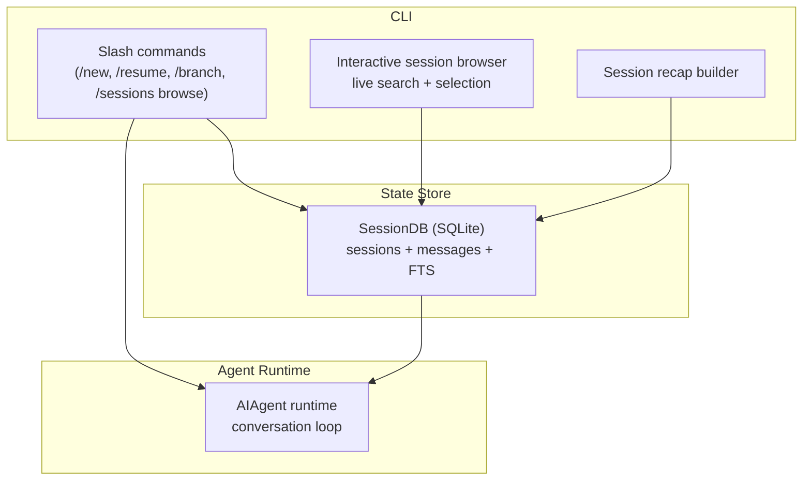
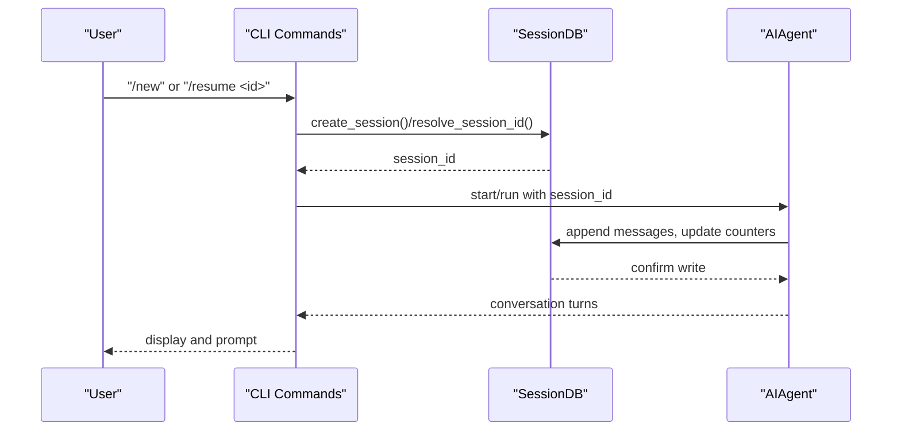
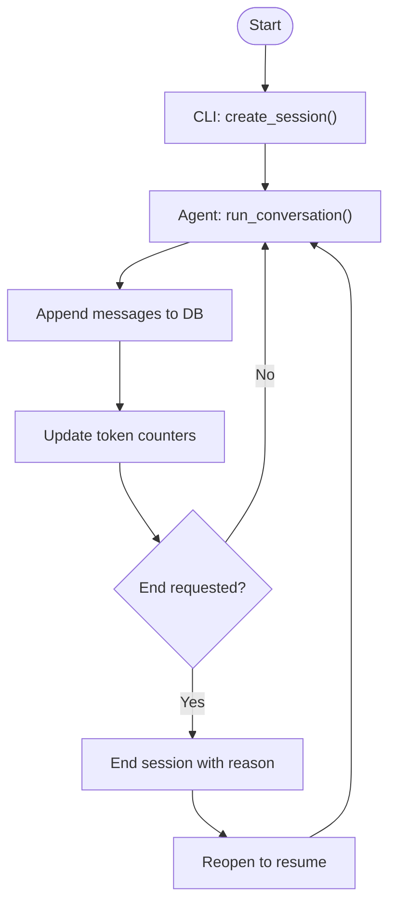
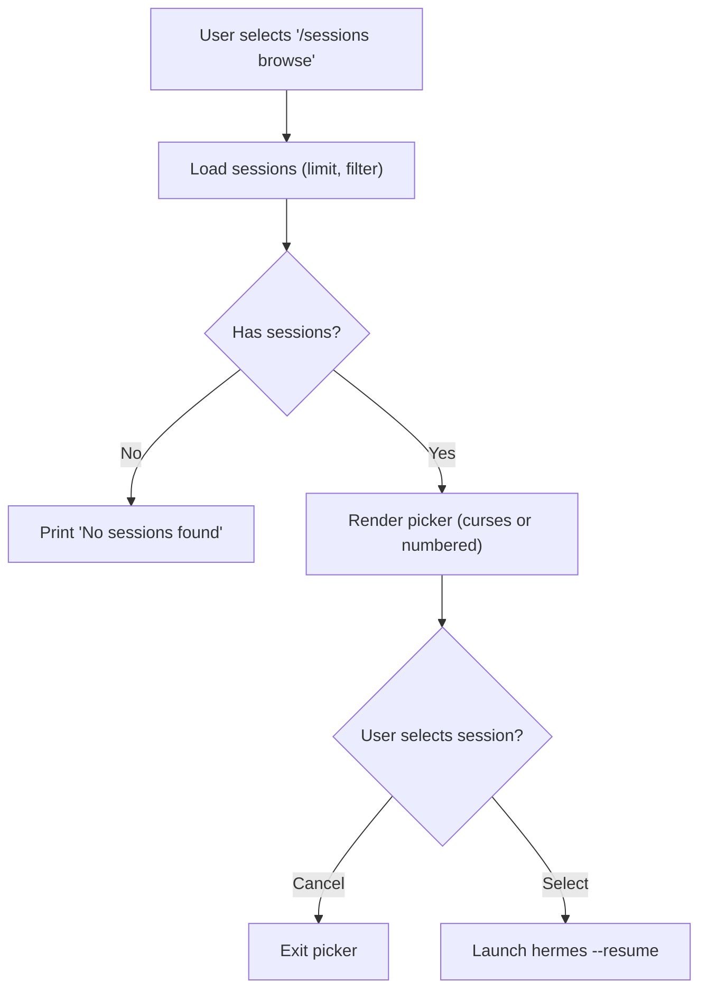
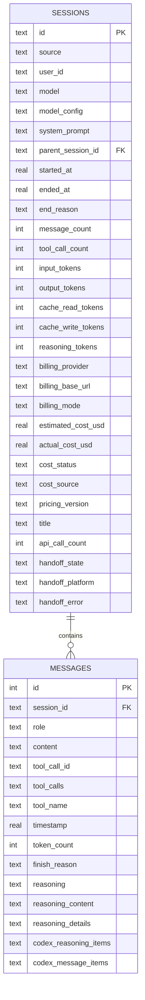
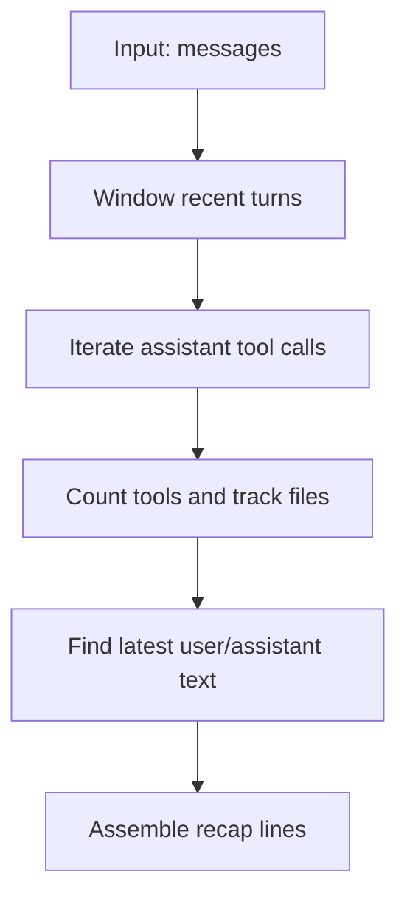
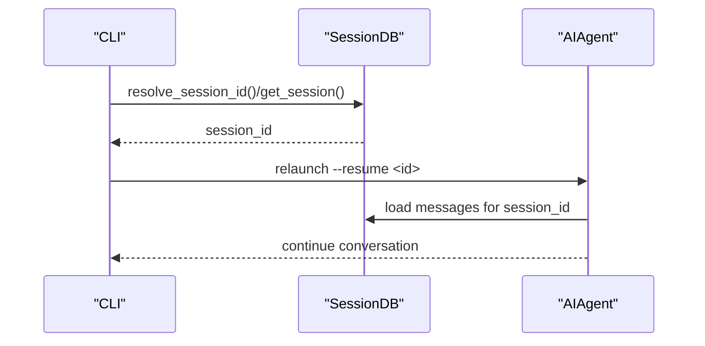
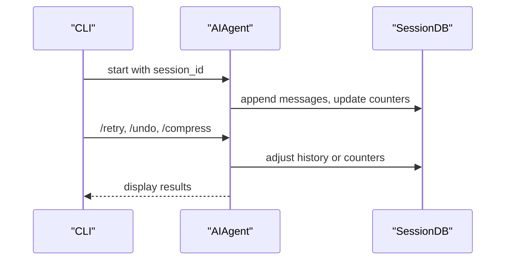
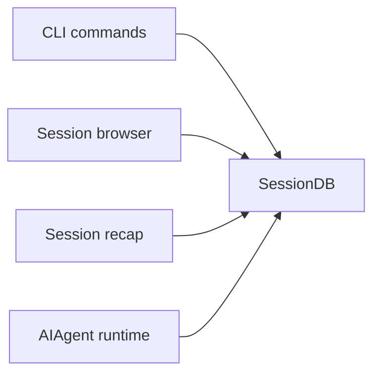

# Session Management

<cite>
**Referenced Files in This Document**
- [hermes_cli/main.py](file://hermes_cli/main.py)
- [hermes_cli/commands.py](file://hermes_cli/commands.py)
- [hermes_cli/session_recap.py](file://hermes_cli/session_recap.py)
- [hermes_state.py](file://hermes_state.py)
- [cli.py](file://cli.py)
- [run_agent.py](file://run_agent.py)
- [gateway/session.py](file://gateway/session.py)
- [tests/cli/test_exit_delete_session.py](file://tests/cli/test_exit_delete_session.py)
- [tests/hermes_cli/test_session_browse.py](file://tests/hermes_cli/test_session_browse.py)
</cite>

## Table of Contents
1. [Introduction](#introduction)
2. [Project Structure](#project-structure)
3. [Core Components](#core-components)
4. [Architecture Overview](#architecture-overview)
5. [Detailed Component Analysis](#detailed-component-analysis)
6. [Dependency Analysis](#dependency-analysis)
7. [Performance Considerations](#performance-considerations)
8. [Troubleshooting Guide](#troubleshooting-guide)
9. [Conclusion](#conclusion)

## Introduction
This document explains the session management system within the CLI interface. It covers how sessions are created, switched, and deleted; the interactive session browser with live search filtering; persistence and metadata management; state tracking across CLI invocations; the session recap system; restoration and branching; and how CLI session management integrates with the underlying agent runtime. Practical workflows, advanced operations, and troubleshooting guidance are included, alongside security and privacy considerations.

## Project Structure
The session management system spans CLI commands, a state database, and the agent runtime:
- CLI commands define session lifecycle operations (new, resume, branch, compress, prune, delete, etc.).
- An interactive session browser supports live search and selection.
- A SQLite-backed state store persists sessions, messages, and metadata.
- The agent runtime participates in session creation, switching, and termination.

**Diagram sources**
- [hermes_cli/main.py:11650-11849](file://hermes_cli/main.py#L11650-L11849)
- [hermes_cli/commands.py:64-120](file://hermes_cli/commands.py#L64-L120)
- [hermes_cli/session_recap.py:238-317](file://hermes_cli/session_recap.py#L238-L317)
- [hermes_state.py:309-800](file://hermes_state.py#L309-L800)
- [run_agent.py:1-200](file://run_agent.py#L1-L200)

**Section sources**
- [hermes_cli/main.py:11650-11849](file://hermes_cli/main.py#L11650-L11849)
- [hermes_cli/commands.py:64-120](file://hermes_cli/commands.py#L64-L120)
- [hermes_cli/session_recap.py:238-317](file://hermes_cli/session_recap.py#L238-L317)
- [hermes_state.py:309-800](file://hermes_state.py#L309-L800)
- [cli.py:673-674](file://cli.py#L673-L674)
- [run_agent.py:1-200](file://run_agent.py#L1-L200)

## Core Components
- SessionDB: SQLite-backed store with FTS5 search, WAL/DELETE fallback, and schema reconciliation. Supports create, end/reopen, token accounting, and session listing/search.
- CLI slash commands: Define session lifecycle and browsing operations (/new, /resume, /branch, /sessions browse, /sessions prune/delete, etc.).
- Interactive session browser: Live-filtering curses-based picker with fallback to numbered list.
- Session recap: Summarizes recent activity, tools used, files touched, and last prompts.
- Agent runtime integration: AIAgent participates in session creation, switching, and termination hooks.

**Section sources**
- [hermes_state.py:309-800](file://hermes_state.py#L309-L800)
- [hermes_cli/commands.py:64-120](file://hermes_cli/commands.py#L64-L120)
- [hermes_cli/main.py:401-640](file://hermes_cli/main.py#L401-L640)
- [hermes_cli/session_recap.py:238-317](file://hermes_cli/session_recap.py#L238-L317)
- [run_agent.py:1-200](file://run_agent.py#L1-L200)

## Architecture Overview
The CLI orchestrates session operations via slash commands and the state store. The runtime uses the same session identifiers to persist messages and metadata. The state store provides fast search and resilience via WAL/DELETE fallback and schema reconciliation.

**Diagram sources**
- [hermes_cli/commands.py:64-120](file://hermes_cli/commands.py#L64-L120)
- [hermes_state.py:713-742](file://hermes_state.py#L713-L742)
- [run_agent.py:1-200](file://run_agent.py#L1-L200)

## Detailed Component Analysis

### Session Creation and Lifecycle
- Creation: CLI commands create a session record in the state store and start the agent runtime with that session_id.
- Ending and reopening: Sessions can be ended with a reason and reopened to resume.
- Token accounting: Incremental or absolute token updates are recorded to track usage and cost.

**Diagram sources**
- [hermes_state.py:713-742](file://hermes_state.py#L713-L742)
- [hermes_state.py:753-800](file://hermes_state.py#L753-L800)

**Section sources**
- [hermes_state.py:713-742](file://hermes_state.py#L713-L742)
- [hermes_state.py:753-800](file://hermes_state.py#L753-L800)

### Interactive Session Browser with Live Search
- The CLI provides an interactive session browser with live filtering by title, preview, ID, or source.
- It uses curses for a robust TUI experience and falls back to a numbered list on platforms without curses.
- Selection launches a new process to resume the chosen session.

**Diagram sources**
- [hermes_cli/main.py:11650-11849](file://hermes_cli/main.py#L11650-L11849)
- [hermes_cli/main.py:401-640](file://hermes_cli/main.py#L401-L640)

**Section sources**
- [hermes_cli/main.py:401-640](file://hermes_cli/main.py#L401-L640)
- [hermes_cli/main.py:11650-11849](file://hermes_cli/main.py#L11650-L11849)
- [tests/hermes_cli/test_session_browse.py:423-441](file://tests/hermes_cli/test_session_browse.py#L423-L441)

### Session Persistence and Metadata Management
- Persistence: Sessions and messages are stored in SQLite with FTS5 indexes for content and tool metadata.
- Metadata: Includes source, user_id, model, timestamps, counters (tokens, API calls), and optional title.
- Schema evolution: Declarative reconciliation adds missing columns without version-gated migrations.

**Diagram sources**
- [hermes_state.py:185-251](file://hermes_state.py#L185-L251)
- [hermes_state.py:506-550](file://hermes_state.py#L506-L550)

**Section sources**
- [hermes_state.py:185-251](file://hermes_state.py#L185-L251)
- [hermes_state.py:506-550](file://hermes_state.py#L506-L550)

### Session Recap System
- Purpose: Provide a quick summary of recent activity, tools used, files touched, and the last user/assistant exchanges.
- Scope: Uses a recent turn window and summarizes assistant tool calls and file-editing actions.
- Output: Plain-text recap suitable for terminal and gateway displays.

**Diagram sources**
- [hermes_cli/session_recap.py:238-317](file://hermes_cli/session_recap.py#L238-L317)

**Section sources**
- [hermes_cli/session_recap.py:238-317](file://hermes_cli/session_recap.py#L238-L317)

### Session Restoration and Branching
- Resume: Resolve a session by ID or title and relaunch with the same session_id.
- Branch: Create a new session continuing from the current session’s history (conceptual; branching command is defined in the command registry).
- Pruning: Remove ended sessions older than a threshold to reclaim space.

**Diagram sources**
- [hermes_cli/main.py:11650-11849](file://hermes_cli/main.py#L11650-L11849)
- [hermes_cli/commands.py:64-120](file://hermes_cli/commands.py#L64-L120)

**Section sources**
- [hermes_cli/main.py:11650-11849](file://hermes_cli/main.py#L11650-L11849)
- [hermes_cli/commands.py:64-120](file://hermes_cli/commands.py#L64-L120)

### Integration with Agent Runtime
- The CLI starts the agent runtime and passes the active session_id.
- The runtime appends messages and updates counters; the CLI can trigger operations like retry/undo/compress.
- Memory providers receive session-switch notifications to maintain continuity.

**Diagram sources**
- [cli.py:673-674](file://cli.py#L673-L674)
- [run_agent.py:1-200](file://run_agent.py#L1-L200)
- [hermes_state.py:753-800](file://hermes_state.py#L753-L800)

**Section sources**
- [cli.py:673-674](file://cli.py#L673-L674)
- [run_agent.py:1-200](file://run_agent.py#L1-L200)
- [hermes_state.py:753-800](file://hermes_state.py#L753-L800)

### Practical Workflows and Advanced Operations
- New session: Start fresh with a new session_id.
- Resume by name or ID: Use /resume with a title or session ID; the system resolves lineage and lands on the live tip.
- Browse and resume: Use /sessions browse to filter and select a session to resume.
- Prune old sessions: Remove ended sessions older than N days to reduce database size.
- Delete sessions: Remove a session and all its messages with confirmation.
- Rename sessions: Assign or change a human-friendly title.

**Section sources**
- [hermes_cli/commands.py:64-120](file://hermes_cli/commands.py#L64-L120)
- [hermes_cli/main.py:11650-11849](file://hermes_cli/main.py#L11650-L11849)
- [tests/cli/test_exit_delete_session.py:70-101](file://tests/cli/test_exit_delete_session.py#L70-L101)

### Security, Privacy, and Data Retention
- Redaction: Security settings can enable secret redaction in logs and outputs.
- Data location: Sessions and state are stored under the hermes home directory; pruning and deletion are supported to control retention.
- Platform isolation: Sessions are tagged by source (cli, telegram, etc.), enabling filtering and targeted retention policies.

**Section sources**
- [cli.py:610-616](file://cli.py#L610-L616)
- [hermes_cli/main.py:11650-11849](file://hermes_cli/main.py#L11650-L11849)

## Dependency Analysis
- CLI depends on SessionDB for listing, resolving, and mutating sessions.
- The runtime depends on SessionDB for message persistence and counters.
- The session browser depends on SessionDB for loading and filtering sessions.
- Recap depends on message history to summarize activity.

**Diagram sources**
- [hermes_cli/main.py:11650-11849](file://hermes_cli/main.py#L11650-L11849)
- [hermes_cli/session_recap.py:238-317](file://hermes_cli/session_recap.py#L238-L317)
- [hermes_state.py:309-800](file://hermes_state.py#L309-L800)
- [run_agent.py:1-200](file://run_agent.py#L1-L200)

**Section sources**
- [hermes_cli/main.py:11650-11849](file://hermes_cli/main.py#L11650-L11849)
- [hermes_cli/session_recap.py:238-317](file://hermes_cli/session_recap.py#L238-L317)
- [hermes_state.py:309-800](file://hermes_state.py#L309-L800)
- [run_agent.py:1-200](file://run_agent.py#L1-L200)

## Performance Considerations
- Journal mode: WAL is used when compatible; falls back to DELETE on incompatible filesystems to maintain functionality.
- Contention handling: Application-level retries with jitter reduce convoy effects under concurrent writers.
- Checkpointing: Periodic passive WAL checkpoints keep the WAL file size bounded.
- Full-text search: FTS5 virtual tables and triggers enable fast text search across messages.

**Section sources**
- [hermes_state.py:128-184](file://hermes_state.py#L128-L184)
- [hermes_state.py:375-426](file://hermes_state.py#L375-L426)
- [hermes_state.py:427-447](file://hermes_state.py#L427-L447)
- [hermes_state.py:253-306](file://hermes_state.py#L253-L306)

## Troubleshooting Guide
- Session database unavailable: The CLI surfaces the underlying cause (e.g., locking protocol on NFS/SMB) to aid diagnosis.
- Deleting active sessions: The system prevents deletion of sessions currently bound to a live agent to avoid corruption.
- Exit with delete: The CLI recognizes the --delete flag for /exit and guards against typos to prevent accidental deletion.
- Session browse picker: If the terminal is too small, the picker informs the user; on platforms without curses, a numbered list is used.

**Section sources**
- [hermes_state.py:105-126](file://hermes_state.py#L105-L126)
- [tui_gateway/server.py:2290-2325](file://tui_gateway/server.py#L2290-L2325)
- [tests/cli/test_exit_delete_session.py:70-101](file://tests/cli/test_exit_delete_session.py#L70-L101)
- [hermes_cli/main.py:401-640](file://hermes_cli/main.py#L401-L640)

## Conclusion
The CLI session management system provides a robust, searchable, and resilient foundation for conversational AI sessions. It integrates tightly with the agent runtime, offers powerful browsing and restoration features, and supports operational controls like pruning and deletion. The state store’s design balances performance and reliability, while the recap system delivers quick situational awareness across platforms.