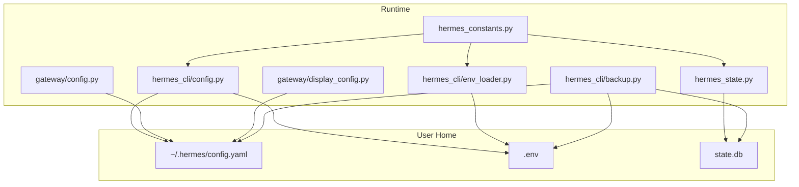
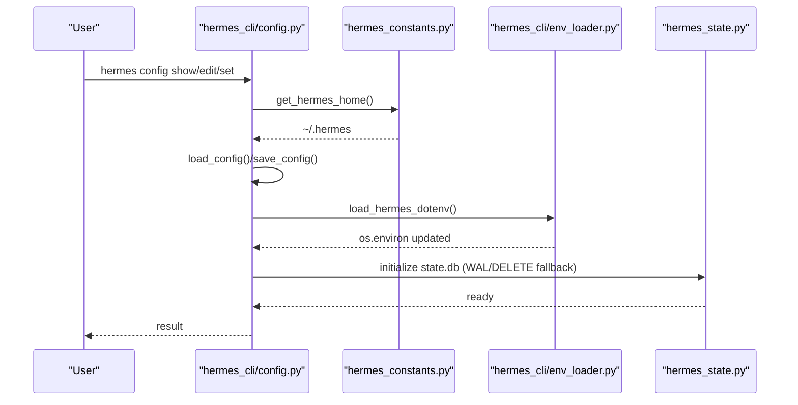
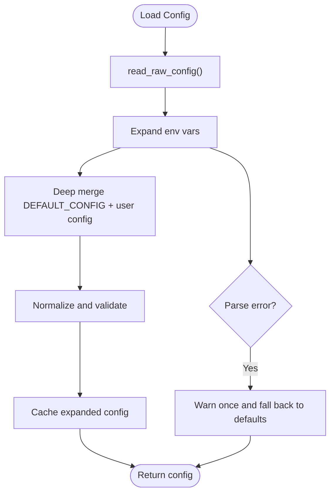
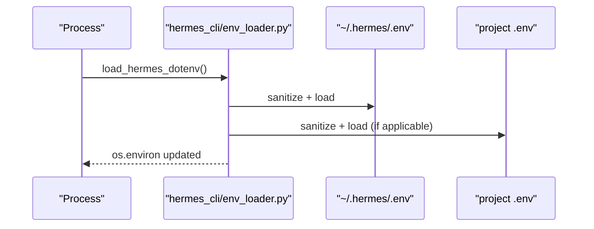
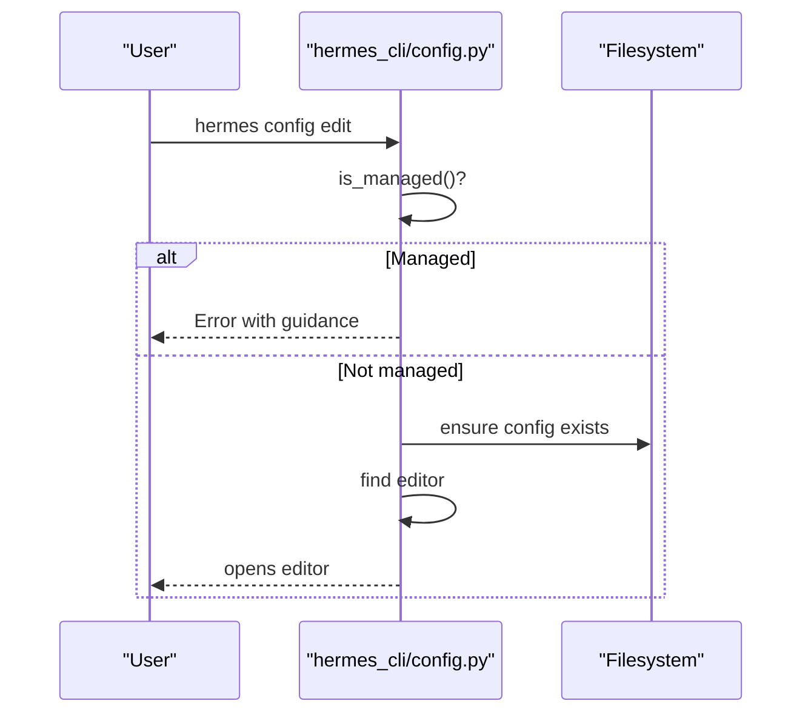
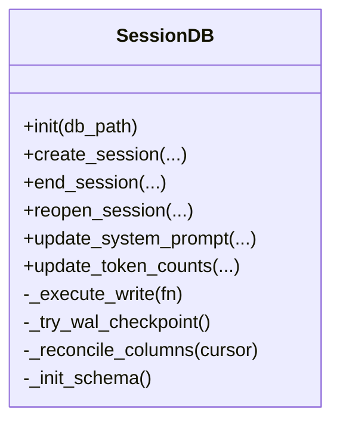
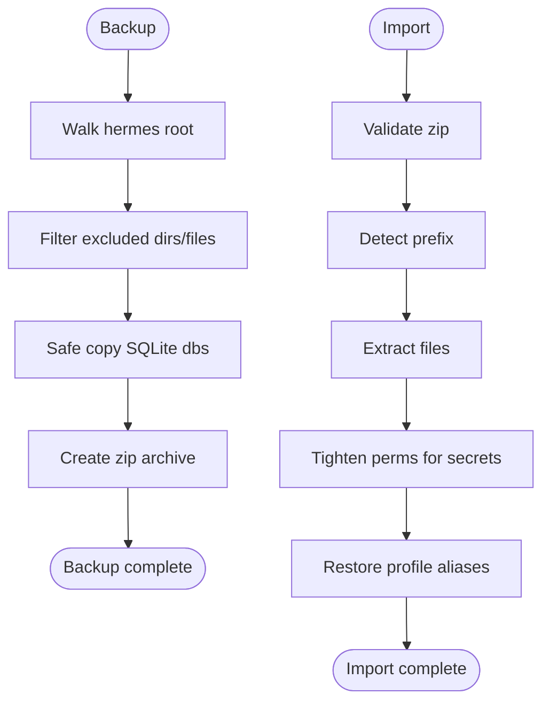
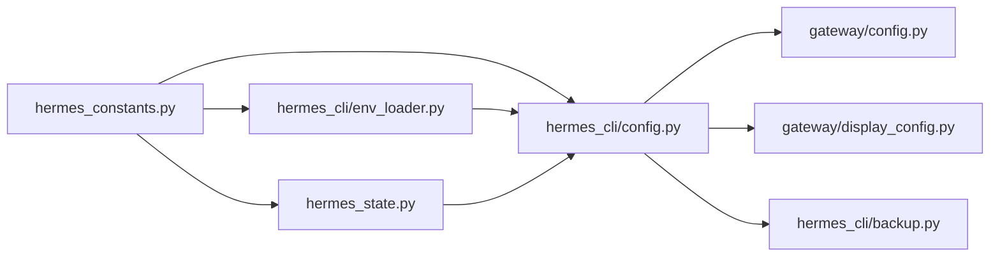

# Configuration System

<cite>
**Referenced Files in This Document**
- [hermes_cli/config.py](file://hermes_cli/config.py)
- [hermes_cli/env_loader.py](file://hermes_cli/env_loader.py)
- [hermes_constants.py](file://hermes_constants.py)
- [hermes_state.py](file://hermes_state.py)
- [cli-config.yaml.example](file://cli-config.yaml.example)
- [hermes_cli/backup.py](file://hermes_cli/backup.py)
- [hermes_cli/commands.py](file://hermes_cli/commands.py)
- [gateway/config.py](file://gateway/config.py)
- [gateway/display_config.py](file://gateway/display_config.py)
- [docker-compose.yml](file://docker-compose.yml)
- [Dockerfile](file://Dockerfile)
- [docker/entrypoint.sh](file://docker/entrypoint.sh)
- [docker/SOUL.md](file://docker/SOUL.md)
</cite>

## Table of Contents
1. [Introduction](#introduction)
2. [Project Structure](#project-structure)
3. [Core Components](#core-components)
4. [Architecture Overview](#architecture-overview)
5. [Detailed Component Analysis](#detailed-component-analysis)
6. [Dependency Analysis](#dependency-analysis)
7. [Performance Considerations](#performance-considerations)
8. [Troubleshooting Guide](#troubleshooting-guide)
9. [Conclusion](#conclusion)
10. [Appendices](#appendices)

## Introduction
This document describes the Configuration System that manages Hermes Agent settings and state. It explains the configuration file structure, environment variable handling, validation mechanisms, and the hierarchical configuration system (global settings, per-session overrides, and runtime modifications). It also covers configuration management via CLI commands (showing, editing, setting values, importing/exporting, and migrating), environment setup for development and production (including containerization), practical configuration scenarios, troubleshooting, and state persistence, backup, and restore procedures.

## Project Structure
The configuration system spans several modules:
- Global configuration files: ~/.hermes/config.yaml and ~/.hermes/.env
- Constants and paths: hermes_constants.py
- CLI configuration management: hermes_cli/config.py
- Environment loading: hermes_cli/env_loader.py
- State persistence: hermes_state.py
- Example CLI configuration: cli-config.yaml.example
- Backup/restore: hermes_cli/backup.py
- Gateway configuration: gateway/config.py and gateway/display_config.py
- Containerization: Dockerfile, docker-compose.yml, docker/entrypoint.sh, docker/SOUL.md

**Diagram sources**
- [hermes_constants.py:14-68](file://hermes_constants.py#L14-L68)
- [hermes_cli/config.py:327-333](file://hermes_cli/config.py#L327-L333)
- [hermes_cli/env_loader.py:142-175](file://hermes_cli/env_loader.py#L142-L175)
- [gateway/config.py](file://gateway/config.py)
- [gateway/display_config.py](file://gateway/display_config.py)
- [hermes_state.py:34-36](file://hermes_state.py#L34-L36)
- [hermes_cli/backup.py:128-250](file://hermes_cli/backup.py#L128-L250)

**Section sources**
- [hermes_cli/config.py:1-100](file://hermes_cli/config.py#L1-L100)
- [hermes_constants.py:14-68](file://hermes_constants.py#L14-L68)
- [hermes_cli/env_loader.py:1-176](file://hermes_cli/env_loader.py#L1-L176)
- [hermes_state.py:1-120](file://hermes_state.py#L1-L120)
- [cli-config.yaml.example:1-120](file://cli-config.yaml.example#L1-L120)
- [hermes_cli/backup.py:1-120](file://hermes_cli/backup.py#L1-L120)

## Core Components
- Configuration file locations and permissions:
  - Main config: ~/.hermes/config.yaml
  - Secrets: ~/.hermes/.env
  - State database: ~/.hermes/state.db
  - Permissions are secured (owner-only on non-managed/containerized deployments)
- Environment loading:
  - Consistent loading with sanitization of credential values
  - Support for project-level .env fallbacks
- CLI configuration management:
  - Show current config, edit, set values, check/migrate
  - Hierarchical merging of defaults, user config, and environment
- State persistence:
  - SQLite-backed session store with WAL fallback and FTS5 search
  - Automatic schema reconciliation and migrations
- Backup/restore:
  - Full home backup/restore with SQLite-safe copy
  - Quick state snapshots for critical files
- Gateway configuration:
  - Platform-specific settings and display configuration

**Section sources**
- [hermes_cli/config.py:327-464](file://hermes_cli/config.py#L327-L464)
- [hermes_cli/env_loader.py:142-176](file://hermes_cli/env_loader.py#L142-L176)
- [hermes_state.py:34-120](file://hermes_state.py#L34-L120)
- [hermes_cli/backup.py:128-250](file://hermes_cli/backup.py#L128-L250)
- [gateway/config.py](file://gateway/config.py)
- [gateway/display_config.py](file://gateway/display_config.py)

## Architecture Overview
The configuration system integrates file-based configuration, environment variables, and runtime state. It ensures:
- Secure defaults and permissions
- Hierarchical merging and validation
- Robust state persistence with migrations
- Safe backup/restore and quick snapshots

**Diagram sources**
- [hermes_cli/config.py:327-464](file://hermes_cli/config.py#L327-L464)
- [hermes_constants.py:14-68](file://hermes_constants.py#L14-L68)
- [hermes_cli/env_loader.py:142-176](file://hermes_cli/env_loader.py#L142-L175)
- [hermes_state.py:332-372](file://hermes_state.py#L332-L372)

## Detailed Component Analysis

### Configuration File Structure and Hierarchical Loading
- Locations:
  - ~/.hermes/config.yaml: main configuration (model, providers, agent, terminal, browser, checkpoints, tool_output, tool_loop_guardrails, compression, prompt_caching, openrouter)
  - ~/.hermes/.env: API keys and secrets
- Defaults:
  - DEFAULT_CONFIG defines baseline values for all keys
- Loading pipeline:
  - Cache-bypass read for raw config
  - Expand environment variables
  - Merge defaults and user config
  - Validate and normalize
  - Cache result keyed by (path, mtime_ns, size)
- Environment expansion:
  - Supports ${VAR} and $VAR forms
  - Warns once per (path, mtime, size) on parse failure and falls back to defaults
- Permissions:
  - Secure directories and files (0700/0600) unless managed/containerized
  - Managed mode (NixOS/Homebrew) uses group-readable permissions
  - Container mode adjusts permissions to allow multi-process access

**Diagram sources**
- [hermes_cli/config.py:37-95](file://hermes_cli/config.py#L37-L95)
- [hermes_cli/config.py:466-520](file://hermes_cli/config.py#L466-L520)

**Section sources**
- [hermes_cli/config.py:470-800](file://hermes_cli/config.py#L470-L800)
- [hermes_cli/config.py:37-95](file://hermes_cli/config.py#L37-L95)
- [hermes_cli/config.py:390-464](file://hermes_cli/config.py#L390-L464)

### Environment Variable Handling and Injection
- Loading order:
  - ~/.hermes/.env overrides stale shell-exported values
  - Project .env acts as fallback when user env exists
  - If no user env exists, project .env also overrides stale shell vars
- Sanitization:
  - Strips non-ASCII characters from credential-like env vars
  - Emits warnings with details about offending characters
- Injection:
  - Provider and platform plugin env vars are injected into OPTIONAL_ENV_VARS for setup wizard visibility

**Diagram sources**
- [hermes_cli/env_loader.py:142-176](file://hermes_cli/env_loader.py#L142-L176)

**Section sources**
- [hermes_cli/env_loader.py:13-176](file://hermes_cli/env_loader.py#L13-L176)
- [hermes_cli/config.py:5315-5451](file://hermes_cli/config.py#L5315-L5451)

### Configuration Management via CLI
- Commands:
  - hermes config: show current configuration
  - hermes config edit: open config in editor
  - hermes config set <key> <value>: set a config value
  - hermes config check: check for missing/outdated config
  - hermes config migrate: update config with new options
  - hermes config path/env-path: show file paths
- Editor selection:
  - Respects EDITOR/VISUAL, falls back to platform-aware defaults
- Managed mode protection:
  - Disallows editing when managed by NixOS/Homebrew

**Diagram sources**
- [hermes_cli/config.py:5046-5070](file://hermes_cli/config.py#L5046-L5070)

**Section sources**
- [hermes_cli/config.py:5034-5311](file://hermes_cli/config.py#L5034-L5311)
- [hermes_cli/commands.py:120-140](file://hermes_cli/commands.py#L120-L140)

### State Persistence and Migration
- State database:
  - SQLite with WAL mode by default; falls back to DELETE on incompatible filesystems
  - FTS5 virtual tables for full-text search
  - Automatic schema reconciliation and versioned migrations
- Concurrency:
  - Short SQLite timeout with application-level jitter retries to avoid convoy effects
  - Periodic WAL checkpoints to prevent WAL growth
- Migration:
  - Declarative column reconciliation
  - Version-gated data migrations (e.g., v10 adds trigram FTS; v11 reindexes FTS)

**Diagram sources**
- [hermes_state.py:309-680](file://hermes_state.py#L309-L680)

**Section sources**
- [hermes_state.py:128-184](file://hermes_state.py#L128-L184)
- [hermes_state.py:332-426](file://hermes_state.py#L332-L426)
- [hermes_state.py:506-680](file://hermes_state.py#L506-L680)

### Backup and Restore Procedures
- Full backup:
  - Creates a zip of ~/.hermes excluding transient files and directories
  - Uses SQLite safe copy for consistent snapshots
- Import:
  - Validates zip content and strips common prefixes
  - Restores files with permission tightening for sensitive files
  - Restores profile aliases and provides guidance
- Quick snapshots:
  - Captures critical state files (state.db, config.yaml, .env, auth.json, gateway_state.json, pairing, etc.)
  - Auto-prunes beyond a keep limit

**Diagram sources**
- [hermes_cli/backup.py:128-250](file://hermes_cli/backup.py#L128-L250)
- [hermes_cli/backup.py:307-464](file://hermes_cli/backup.py#L307-L464)
- [hermes_cli/backup.py:503-584](file://hermes_cli/backup.py#L503-L584)

**Section sources**
- [hermes_cli/backup.py:1-250](file://hermes_cli/backup.py#L1-L250)
- [hermes_cli/backup.py:256-464](file://hermes_cli/backup.py#L256-L464)
- [hermes_cli/backup.py:503-689](file://hermes_cli/backup.py#L503-L689)

### Gateway and Platform Configuration
- Gateway config:
  - Loads and merges platform-specific settings
  - Supports display configuration and runtime metadata
- Example CLI configuration:
  - Comprehensive example covering model, providers, terminal backends, browser, compression, prompt caching, auxiliary models, memory, session reset policy, streaming, skills, agent behavior, toolsets, and MCP servers

**Section sources**
- [gateway/config.py](file://gateway/config.py)
- [gateway/display_config.py](file://gateway/display_config.py)
- [cli-config.yaml.example:1-1092](file://cli-config.yaml.example#L1-L1092)

### Containerization and Platform-Specific Configurations
- Dockerfile and docker-compose.yml define containerized deployment
- docker/entrypoint.sh initializes environment and permissions
- docker/SOUL.md seeds default personality content
- Container mode detection and permissions adjustments for multi-process setups

**Section sources**
- [Dockerfile](file://Dockerfile)
- [docker-compose.yml](file://docker-compose.yml)
- [docker/entrypoint.sh](file://docker/entrypoint.sh)
- [docker/SOUL.md](file://docker/SOUL.md)
- [hermes_cli/config.py:274-316](file://hermes_cli/config.py#L274-L316)

## Dependency Analysis
The configuration system exhibits clear separation of concerns:
- hermes_constants.py centralizes path resolution and environment checks
- hermes_cli/config.py orchestrates file-based configuration and CLI commands
- hermes_cli/env_loader.py handles environment loading and sanitization
- hermes_state.py manages state persistence and migrations
- gateway/config.py and gateway/display_config.py integrate platform-specific settings
- hermes_cli/backup.py provides backup/restore utilities

**Diagram sources**
- [hermes_constants.py:14-68](file://hermes_constants.py#L14-L68)
- [hermes_cli/config.py:327-333](file://hermes_cli/config.py#L327-L333)
- [hermes_cli/env_loader.py:142-176](file://hermes_cli/env_loader.py#L142-L176)
- [hermes_state.py:34-36](file://hermes_state.py#L34-L36)
- [gateway/config.py](file://gateway/config.py)
- [gateway/display_config.py](file://gateway/display_config.py)
- [hermes_cli/backup.py:128-250](file://hermes_cli/backup.py#L128-L250)

**Section sources**
- [hermes_constants.py:14-68](file://hermes_constants.py#L14-L68)
- [hermes_cli/config.py:327-333](file://hermes_cli/config.py#L327-L333)
- [hermes_cli/env_loader.py:142-176](file://hermes_cli/env_loader.py#L142-L176)
- [hermes_state.py:34-36](file://hermes_state.py#L34-L36)
- [gateway/config.py](file://gateway/config.py)
- [gateway/display_config.py](file://gateway/display_config.py)
- [hermes_cli/backup.py:128-250](file://hermes_cli/backup.py#L128-L250)

## Performance Considerations
- Configuration load caching:
  - Cache keyed by (path, mtime_ns, size) avoids repeated YAML parsing and merging
  - Atomic writes invalidate cache automatically
- SQLite state:
  - WAL mode for concurrency; fallback to DELETE on incompatible filesystems
  - Short timeouts with jitter retries to avoid write contention convoy
  - Periodic WAL checkpoints to control growth
- Backup:
  - SQLite safe copy for consistent snapshots
  - ZIP compression with progress reporting

[No sources needed since this section provides general guidance]

## Troubleshooting Guide
Common issues and resolutions:
- YAML parse errors:
  - Symptom: parse failure warning and fallback to defaults
  - Action: fix YAML syntax in ~/.hermes/config.yaml
- Non-ASCII credentials:
  - Symptom: warnings about stripped non-ASCII characters
  - Action: re-copy API keys from provider dashboards and run setup
- Managed mode restrictions:
  - Symptom: cannot edit configuration
  - Action: modify via managed system (NixOS/Homebrew) or recommended update command
- Container permission issues:
  - Symptom: permission denied on config files
  - Action: ensure container mode permissions or disable chmod via environment
- State database unavailable:
  - Symptom: WAL journal_mode unsupported on NFS/SMB
  - Action: system falls back to DELETE mode; adjust filesystem or mount options

**Section sources**
- [hermes_cli/config.py:37-95](file://hermes_cli/config.py#L37-L95)
- [hermes_cli/env_loader.py:40-82](file://hermes_cli/env_loader.py#L40-L82)
- [hermes_cli/config.py:265-268](file://hermes_cli/config.py#L265-L268)
- [hermes_state.py:128-184](file://hermes_state.py#L128-L184)

## Conclusion
The Hermes Configuration System provides a robust, secure, and flexible foundation for managing agent settings and state. It combines file-based configuration with environment variable handling, ensures safe state persistence with migrations, and offers comprehensive backup/restore capabilities. The CLI enables straightforward configuration management, while containerization and platform-specific configurations support diverse deployment scenarios.

## Appendices

### Practical Configuration Scenarios
- Set a model for this session:
  - Use the model command to switch model/provider temporarily
- Enable browser recording:
  - Modify browser.record_sessions in config.yaml
- Configure terminal backend:
  - Choose local/ssh/docker/singularity/modal/daytona in terminal.backend
- Enable checkpoints:
  - Set checkpoints.enabled to true in config.yaml
- Adjust compression:
  - Tune compression.threshold and target_ratio for long conversations
- Setup environment variables:
  - Add API keys to ~/.hermes/.env and reload with reload command

**Section sources**
- [cli-config.yaml.example:305-328](file://cli-config.yaml.example#L305-L328)
- [cli-config.yaml.example:550-580](file://cli-config.yaml.example#L550-L580)
- [cli-config.yaml.example:679-716](file://cli-config.yaml.example#L679-L716)
- [cli-config.yaml.example:347-381](file://cli-config.yaml.example#L347-L381)
- [hermes_cli/commands.py:120-130](file://hermes_cli/commands.py#L120-L130)

### Best Practices for Configuration Management
- Keep ~/.hermes/.env secure and separate from version control
- Use environment variables for secrets; avoid committing sensitive values
- Regularly back up ~/.hermes using hermes backup
- Prefer managed mode updates for NixOS/Homebrew installations
- Test configuration changes in a non-production environment first

[No sources needed since this section provides general guidance]