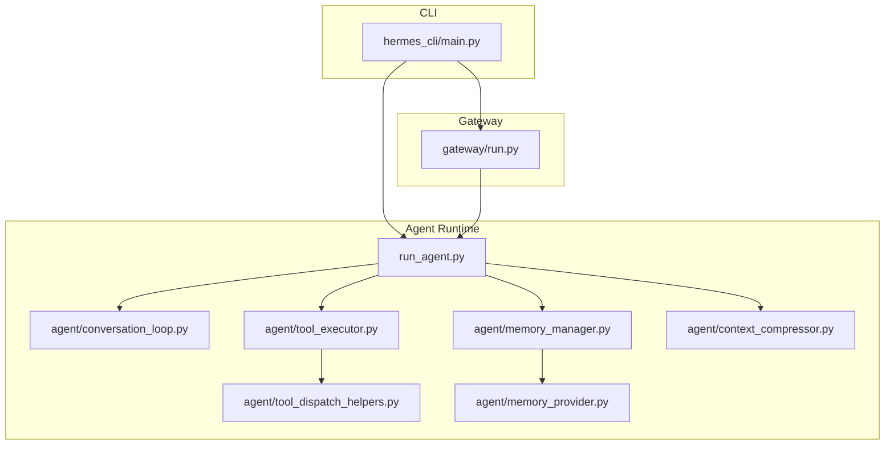
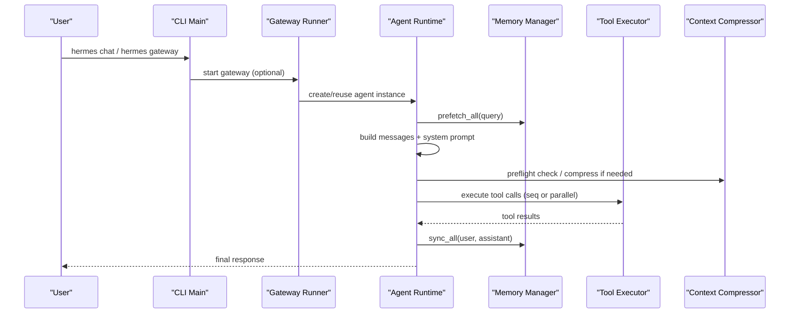
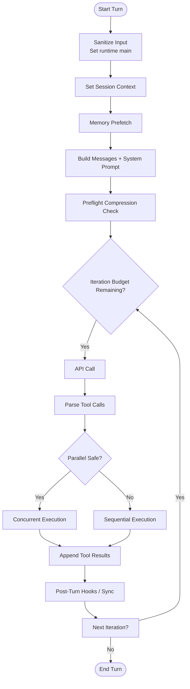
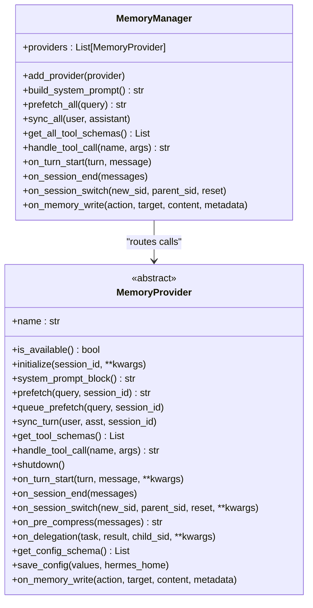
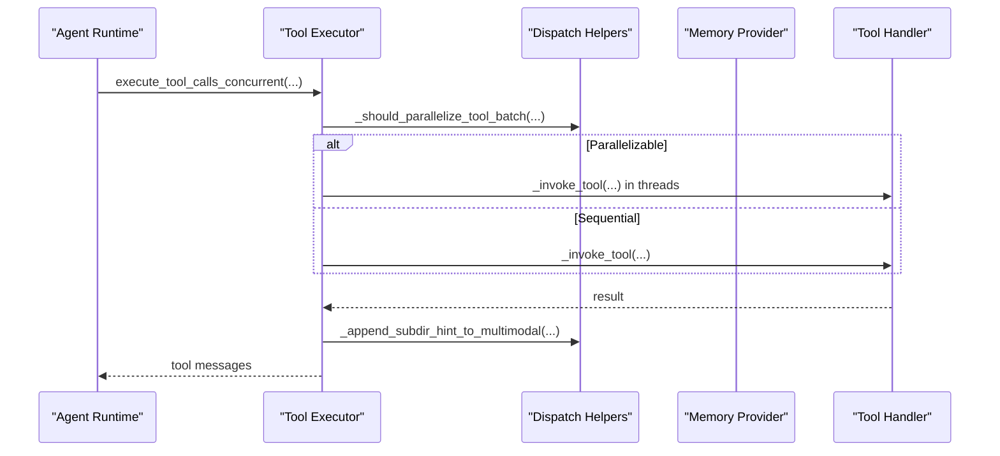
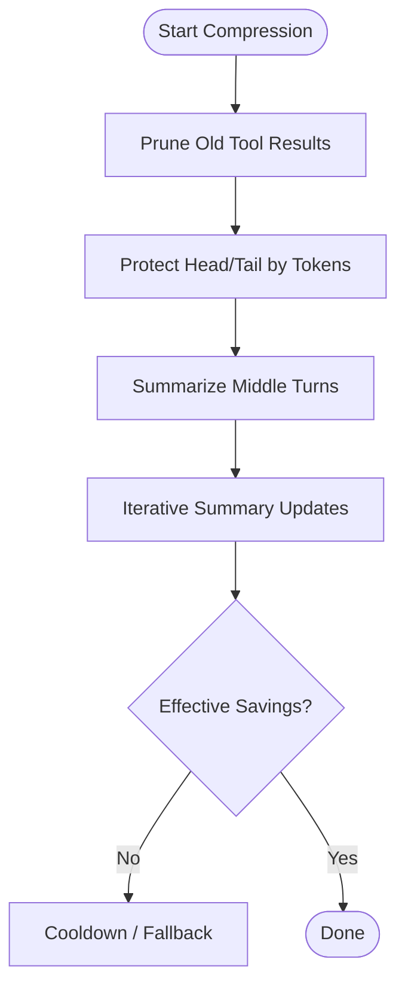
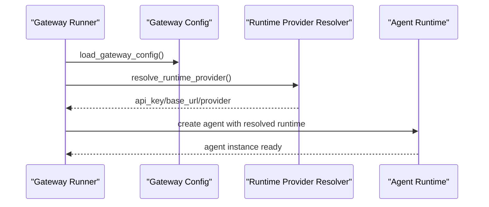
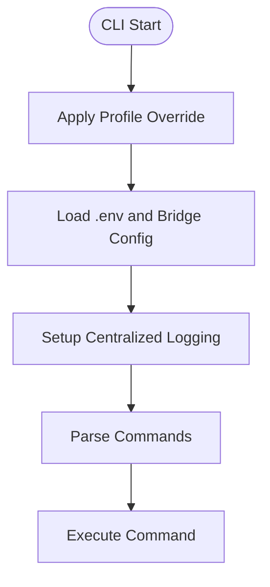
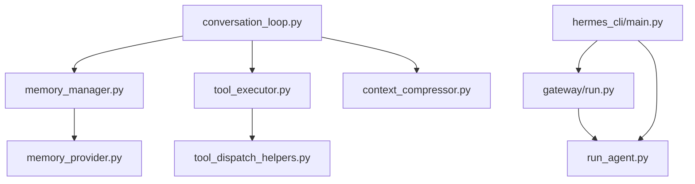

# Core Architecture

<cite>
**Referenced Files in This Document**
- [conversation_loop.py](file://agent/conversation_loop.py)
- [memory_manager.py](file://agent/memory_manager.py)
- [tool_executor.py](file://agent/tool_executor.py)
- [context_compressor.py](file://agent/context_compressor.py)
- [tool_dispatch_helpers.py](file://agent/tool_dispatch_helpers.py)
- [memory_provider.py](file://agent/memory_provider.py)
- [run.py](file://gateway/run.py)
- [main.py](file://hermes_cli/main.py)
</cite>

## Table of Contents
1. [Introduction](#introduction)
2. [Project Structure](#project-structure)
3. [Core Components](#core-components)
4. [Architecture Overview](#architecture-overview)
5. [Detailed Component Analysis](#detailed-component-analysis)
6. [Dependency Analysis](#dependency-analysis)
7. [Performance Considerations](#performance-considerations)
8. [Troubleshooting Guide](#troubleshooting-guide)
9. [Conclusion](#conclusion)

## Introduction
This document describes the core architecture of the Hermes Agent system. It explains how the CLI interface, agent runtime, tool execution system, and messaging gateway collaborate to deliver a modular, extensible, and stateful conversational AI experience. The focus is on the agent loop, conversation orchestration, memory management, context compression, and tool dispatch, along with the system boundaries and cross-cutting concerns such as security, monitoring, and deployment topology.

## Project Structure
The Hermes Agent is organized as a modular monolith with clear separation of concerns:
- CLI entry point and commands
- Agent runtime orchestrating conversation loops, memory, and tool execution
- Messaging gateway for platform integrations
- Plugins and providers enabling extensibility

**Diagram sources**
- [main.py:1-120](file://hermes_cli/main.py#L1-L120)
- [run.py:1-120](file://gateway/run.py#L1-L120)
- [conversation_loop.py:1-120](file://agent/conversation_loop.py#L1-L120)
- [memory_manager.py:1-120](file://agent/memory_manager.py#L1-L120)
- [tool_executor.py:1-120](file://agent/tool_executor.py#L1-L120)
- [context_compressor.py:1-120](file://agent/context_compressor.py#L1-L120)
- [tool_dispatch_helpers.py:1-120](file://agent/tool_dispatch_helpers.py#L1-L120)
- [memory_provider.py:1-120](file://agent/memory_provider.py#L1-L120)

**Section sources**
- [main.py:1-120](file://hermes_cli/main.py#L1-L120)
- [run.py:1-120](file://gateway/run.py#L1-L120)

## Core Components
- Conversation Loop: Drives a single user turn through model inference, tool dispatch, retries, compression, and post-turn hooks. Orchestrates memory prefetch, plugin hooks, and streaming.
- Memory Manager: Integrates built-in and external memory providers, coordinates prefetch, sync, and tool routing.
- Tool Executor: Executes tool calls sequentially or in parallel, with safety gates, guardrails, and result normalization.
- Context Compressor: Summarizes and prunes conversation history to fit model context windows.
- Tool Dispatch Helpers: Enforce concurrency safety, multimodal result handling, and file mutation verification.
- Memory Provider: Abstract base for pluggable memory backends with lifecycle hooks.
- Gateway Runner: Starts and manages platform adapters, bridges configuration, and orchestrates long-lived agent instances.
- CLI Main: Bootstraps environment, loads configuration, and routes commands.

**Section sources**
- [conversation_loop.py:85-220](file://agent/conversation_loop.py#L85-L220)
- [memory_manager.py:190-260](file://agent/memory_manager.py#L190-L260)
- [tool_executor.py:64-120](file://agent/tool_executor.py#L64-L120)
- [context_compressor.py:454-520](file://agent/context_compressor.py#L454-L520)
- [tool_dispatch_helpers.py:103-147](file://agent/tool_dispatch_helpers.py#L103-L147)
- [memory_provider.py:42-90](file://agent/memory_provider.py#L42-L90)
- [run.py:624-720](file://gateway/run.py#L624-L720)
- [main.py:207-260](file://hermes_cli/main.py#L207-L260)

## Architecture Overview
The system is event-driven and stateful. The CLI and Gateway both spawn or reuse agent instances that maintain session state, memory counters, and tool schemas. The agent loop encapsulates the conversation flow, invoking memory prefetch, tool execution, and compression as needed.

**Diagram sources**
- [main.py:1-120](file://hermes_cli/main.py#L1-L120)
- [run.py:624-720](file://gateway/run.py#L624-L720)
- [conversation_loop.py:460-532](file://agent/conversation_loop.py#L460-L532)
- [memory_manager.py:285-303](file://agent/memory_manager.py#L285-L303)
- [tool_executor.py:64-120](file://agent/tool_executor.py#L64-L120)
- [context_compressor.py:601-622](file://agent/context_compressor.py#L601-L622)

## Detailed Component Analysis

### Conversation Loop Architecture
The conversation loop is the central driver of a single user turn. It:
- Sanitizes input, tracks interruptions, and prepares messages
- Builds or reuses the system prompt and injects ephemeral context
- Prefetches memory, applies plugin hooks, and executes tool calls
- Handles retries, compression, and post-turn callbacks
- Maintains counters for nudges and budgets

**Diagram sources**
- [conversation_loop.py:85-220](file://agent/conversation_loop.py#L85-L220)
- [conversation_loop.py:532-532](file://agent/conversation_loop.py#L532-L532)
- [conversation_loop.py:643-720](file://agent/conversation_loop.py#L643-L720)
- [tool_executor.py:64-120](file://agent/tool_executor.py#L64-L120)
- [tool_dispatch_helpers.py:103-147](file://agent/tool_dispatch_helpers.py#L103-L147)

**Section sources**
- [conversation_loop.py:85-220](file://agent/conversation_loop.py#L85-L220)
- [conversation_loop.py:532-532](file://agent/conversation_loop.py#L532-L532)
- [conversation_loop.py:643-720](file://agent/conversation_loop.py#L643-L720)

### Memory Management and Providers
The MemoryManager coordinates built-in and external memory providers:
- Registers providers and routes tool calls
- Prefetches context before each turn
- Syncs after each turn and supports lifecycle hooks
- Bridges built-in memory writes to external providers

**Diagram sources**
- [memory_manager.py:190-260](file://agent/memory_manager.py#L190-L260)
- [memory_provider.py:42-90](file://agent/memory_provider.py#L42-L90)
- [memory_provider.py:121-138](file://agent/memory_provider.py#L121-L138)

**Section sources**
- [memory_manager.py:190-260](file://agent/memory_manager.py#L190-L260)
- [memory_provider.py:42-90](file://agent/memory_provider.py#L42-L90)

### Tool Execution System
The tool execution system supports both sequential and concurrent dispatch:
- Parses tool calls, applies guardrails, and enforces safety
- Manages checkpoints for destructive operations and file mutations
- Normalizes multimodal results and applies directory hints
- Supports plugin pre-tool-call blocks and progress callbacks

**Diagram sources**
- [tool_executor.py:64-120](file://agent/tool_executor.py#L64-L120)
- [tool_executor.py:474-530](file://agent/tool_executor.py#L474-L530)
- [tool_dispatch_helpers.py:103-147](file://agent/tool_dispatch_helpers.py#L103-L147)
- [memory_manager.py:356-375](file://agent/memory_manager.py#L356-L375)

**Section sources**
- [tool_executor.py:64-120](file://agent/tool_executor.py#L64-L120)
- [tool_executor.py:474-530](file://agent/tool_executor.py#L474-L530)
- [tool_dispatch_helpers.py:103-147](file://agent/tool_dispatch_helpers.py#L103-L147)

### Context Compression Engine
The ContextCompressor prunes and summarizes long histories:
- Prunes old tool results and truncates arguments
- Protects head and tail by token budget
- Summarizes middle turns using an auxiliary model
- Tracks effectiveness and cooldowns to avoid thrashing

**Diagram sources**
- [context_compressor.py:601-622](file://agent/context_compressor.py#L601-L622)
- [context_compressor.py:627-794](file://agent/context_compressor.py#L627-L794)
- [context_compressor.py:799-800](file://agent/context_compressor.py#L799-L800)

**Section sources**
- [context_compressor.py:601-622](file://agent/context_compressor.py#L601-L622)
- [context_compressor.py:627-794](file://agent/context_compressor.py#L627-L794)

### Messaging Gateway Integration
The Gateway Runner:
- Loads configuration and bridges settings to environment
- Resolves runtime provider credentials and fallbacks
- Manages long-lived agent instances with cache and TTL policies
- Coordinates platform adapters and delivery routing

**Diagram sources**
- [run.py:624-720](file://gateway/run.py#L624-L720)
- [run.py:674-711](file://gateway/run.py#L674-L711)

**Section sources**
- [run.py:624-720](file://gateway/run.py#L624-L720)
- [run.py:674-711](file://gateway/run.py#L674-L711)

### CLI Entry Point
The CLI initializes logging, loads environment, and routes commands:
- Applies profile overrides and environment bridging
- Initializes logging early for all subcommands
- Validates configuration and applies IPv4 preferences

**Diagram sources**
- [main.py:119-205](file://hermes_cli/main.py#L119-L205)
- [main.py:207-260](file://hermes_cli/main.py#L207-L260)

**Section sources**
- [main.py:119-205](file://hermes_cli/main.py#L119-L205)
- [main.py:207-260](file://hermes_cli/main.py#L207-L260)

## Dependency Analysis
Key dependencies and relationships:
- Conversation loop depends on memory manager for prefetch/sync, tool executor for tool calls, and context compressor for token budgeting.
- Tool executor depends on dispatch helpers for concurrency gating and multimodal handling.
- Memory manager depends on memory provider abstractions for routing and lifecycle.
- Gateway runner depends on runtime provider resolution and bridges configuration to environment variables.
- CLI main depends on configuration loading and environment bridging for security and display settings.

**Diagram sources**
- [conversation_loop.py:1-120](file://agent/conversation_loop.py#L1-L120)
- [memory_manager.py:1-120](file://agent/memory_manager.py#L1-L120)
- [tool_executor.py:1-120](file://agent/tool_executor.py#L1-L120)
- [context_compressor.py:1-120](file://agent/context_compressor.py#L1-L120)
- [tool_dispatch_helpers.py:1-120](file://agent/tool_dispatch_helpers.py#L1-L120)
- [memory_provider.py:1-120](file://agent/memory_provider.py#L1-L120)
- [run.py:1-120](file://gateway/run.py#L1-L120)
- [main.py:1-120](file://hermes_cli/main.py#L1-L120)

**Section sources**
- [conversation_loop.py:1-120](file://agent/conversation_loop.py#L1-L120)
- [memory_manager.py:1-120](file://agent/memory_manager.py#L1-L120)
- [tool_executor.py:1-120](file://agent/tool_executor.py#L1-L120)
- [context_compressor.py:1-120](file://agent/context_compressor.py#L1-L120)
- [tool_dispatch_helpers.py:1-120](file://agent/tool_dispatch_helpers.py#L1-L120)
- [memory_provider.py:1-120](file://agent/memory_provider.py#L1-L120)
- [run.py:1-120](file://gateway/run.py#L1-L120)
- [main.py:1-120](file://hermes_cli/main.py#L1-L120)

## Performance Considerations
- Token budgeting: The context compressor protects head and tail by token budget and scales summary size proportionally to compressed content.
- Prefetching: Memory prefetch is performed once per turn and cached across tool calls to reduce latency and cost.
- Concurrency: Parallel tool execution is gated by path overlap and destructive command detection to avoid contention and unsafe operations.
- Streaming: The conversation loop supports streaming callbacks to start audio synthesis before the full response is available.
- Caching: Prompt caching is applied for compatible providers to reduce token usage across turns.

[No sources needed since this section provides general guidance]

## Troubleshooting Guide
Common issues and diagnostics:
- Authentication failures: The gateway attempts fallback provider chains before raising errors.
- Interrupt handling: The agent loop respects user interrupts and cancels pending concurrent tool calls.
- Compression effectiveness: The compressor tracks savings and applies cooldowns to avoid thrashing.
- Environment bridging: Configuration values are bridged to environment variables; failures are logged to aid investigation.

**Section sources**
- [run.py:674-758](file://gateway/run.py#L674-L758)
- [conversation_loop.py:314-354](file://agent/conversation_loop.py#L314-L354)
- [context_compressor.py:601-622](file://agent/context_compressor.py#L601-L622)
- [run.py:424-584](file://gateway/run.py#L424-L584)

## Conclusion
The Hermes Agent employs a modular monolith architecture with clear separation of concerns. The CLI and Gateway provide distinct entry points, while the agent runtime orchestrates conversation loops, memory, tool execution, and compression. The system’s plugin-based extensibility and event-driven design enable scalable integrations across platforms and providers. Stateful session management, robust error handling, and performance-conscious features ensure reliable operation across diverse deployment scenarios.