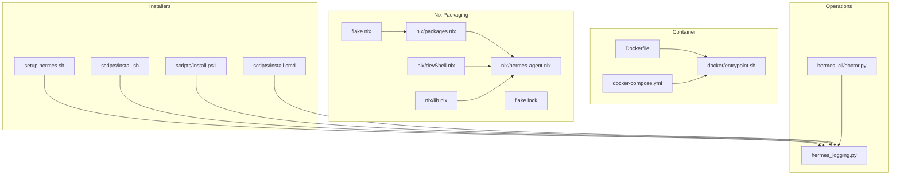
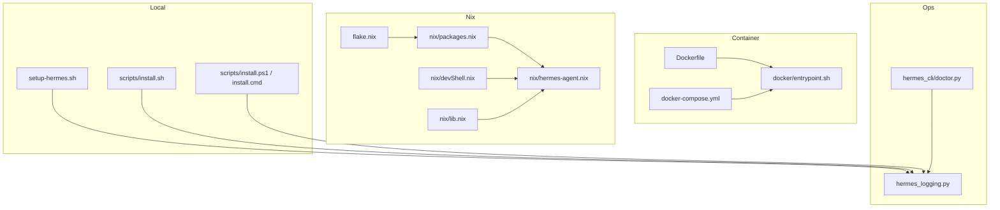
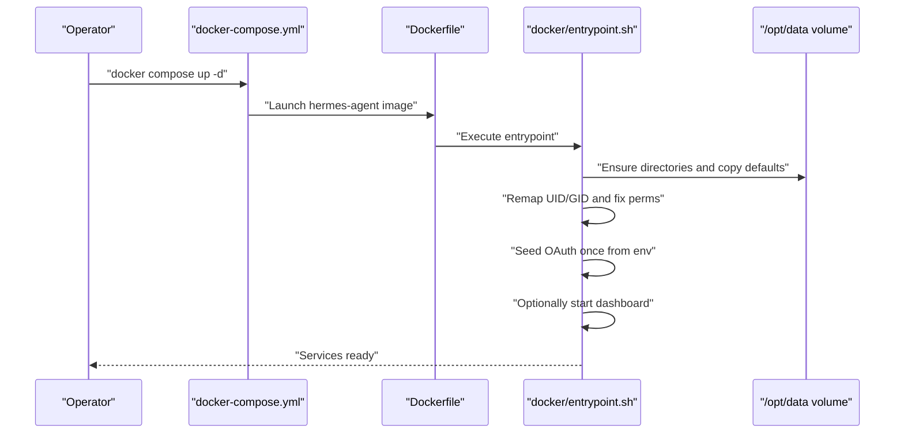
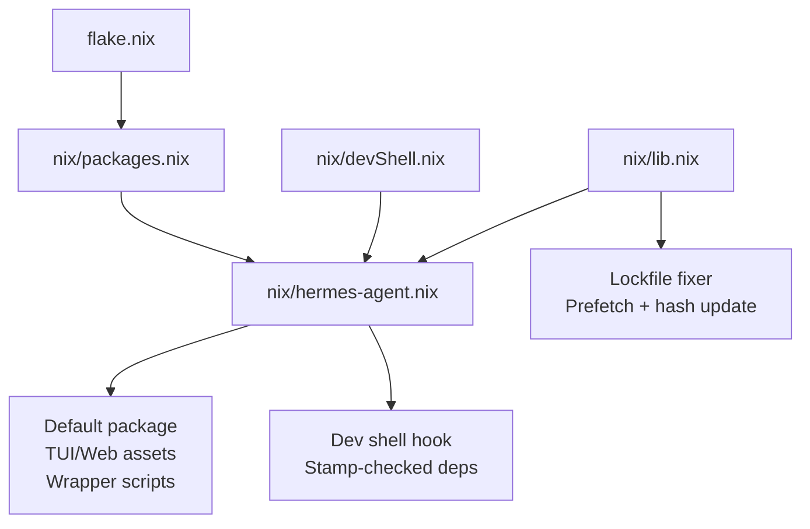
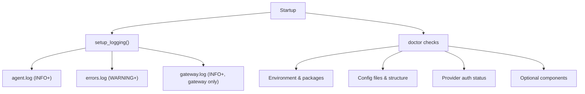
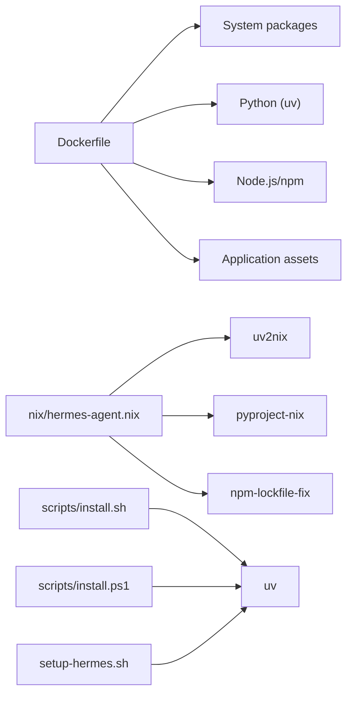

# Deployment and Operations

<cite>
**Referenced Files in This Document**
- [Dockerfile](file://Dockerfile)
- [docker-compose.yml](file://docker-compose.yml)
- [docker/entrypoint.sh](file://docker/entrypoint.sh)
- [flake.nix](file://flake.nix)
- [flake.lock](file://flake.lock)
- [nix/packages.nix](file://nix/packages.nix)
- [nix/devShell.nix](file://nix/devShell.nix)
- [nix/hermes-agent.nix](file://nix/hermes-agent.nix)
- [nix/lib.nix](file://nix/lib.nix)
- [setup-hermes.sh](file://setup-hermes.sh)
- [scripts/install.sh](file://scripts/install.sh)
- [scripts/install.ps1](file://scripts/install.ps1)
- [scripts/install.cmd](file://scripts/install.cmd)
- [hermes_logging.py](file://hermes_logging.py)
- [hermes_cli/doctor.py](file://hermes_cli/doctor.py)
</cite>

## Table of Contents
1. [Introduction](#introduction)
2. [Project Structure](#project-structure)
3. [Core Components](#core-components)
4. [Architecture Overview](#architecture-overview)
5. [Detailed Component Analysis](#detailed-component-analysis)
6. [Dependency Analysis](#dependency-analysis)
7. [Performance Considerations](#performance-considerations)
8. [Troubleshooting Guide](#troubleshooting-guide)
9. [Conclusion](#conclusion)
10. [Appendices](#appendices)

## Introduction
This document provides comprehensive guidance for deploying and operating the Hermes Agent across multiple environments and platforms. It covers local development setups, containerized deployments with Docker and docker-compose, Nix-based packaging, and operational procedures for monitoring, maintenance, backup/recovery, and troubleshooting. It also documents the doctor command functionality and its integration with various terminal backends (local, Docker, SSH, Singularity, Modal, Daytona, Vercel Sandbox).

## Project Structure
The repository includes first-class deployment artifacts and operational tooling:
- Container images and orchestration: Dockerfile, docker-compose.yml, and a container entrypoint script
- Nix-based packaging and development shell: flake.nix, flake.lock, and supporting Nix modules
- Platform-specific installation scripts for Unix-like systems, Windows (PowerShell and CMD), and Android/Termux
- Logging and diagnostics infrastructure for operations and troubleshooting

**Diagram sources**
- [Dockerfile:1-120](file://Dockerfile#L1-L120)
- [docker-compose.yml:1-72](file://docker-compose.yml#L1-L72)
- [docker/entrypoint.sh:1-158](file://docker/entrypoint.sh#L1-L158)
- [flake.nix:1-46](file://flake.nix#L1-L46)
- [flake.lock:1-203](file://flake.lock#L1-L203)
- [nix/packages.nix:1-27](file://nix/packages.nix#L1-L27)
- [nix/devShell.nix:1-31](file://nix/devShell.nix#L1-L31)
- [nix/hermes-agent.nix:1-212](file://nix/hermes-agent.nix#L1-L212)
- [nix/lib.nix:1-246](file://nix/lib.nix#L1-L246)
- [setup-hermes.sh:1-457](file://setup-hermes.sh#L1-L457)
- [scripts/install.sh:1-800](file://scripts/install.sh#L1-L800)
- [scripts/install.ps1:1-800](file://scripts/install.ps1#L1-L800)
- [scripts/install.cmd:1-29](file://scripts/install.cmd#L1-L29)
- [hermes_logging.py:1-390](file://hermes_logging.py#L1-L390)
- [hermes_cli/doctor.py:1-800](file://hermes_cli/doctor.py#L1-L800)

**Section sources**
- [Dockerfile:1-120](file://Dockerfile#L1-L120)
- [docker-compose.yml:1-72](file://docker-compose.yml#L1-L72)
- [docker/entrypoint.sh:1-158](file://docker/entrypoint.sh#L1-L158)
- [flake.nix:1-46](file://flake.nix#L1-L46)
- [flake.lock:1-203](file://flake.lock#L1-L203)
- [nix/packages.nix:1-27](file://nix/packages.nix#L1-L27)
- [nix/devShell.nix:1-31](file://nix/devShell.nix#L1-L31)
- [nix/hermes-agent.nix:1-212](file://nix/hermes-agent.nix#L1-L212)
- [nix/lib.nix:1-246](file://nix/lib.nix#L1-L246)
- [setup-hermes.sh:1-457](file://setup-hermes.sh#L1-L457)
- [scripts/install.sh:1-800](file://scripts/install.sh#L1-L800)
- [scripts/install.ps1:1-800](file://scripts/install.ps1#L1-L800)
- [scripts/install.cmd:1-29](file://scripts/install.cmd#L1-L29)
- [hermes_logging.py:1-390](file://hermes_logging.py#L1-L390)
- [hermes_cli/doctor.py:1-800](file://hermes_cli/doctor.py#L1-L800)

## Core Components
- Container image and runtime: The Dockerfile defines a multi-stage build, installs system dependencies, sets up a non-root user, prepares Node.js and Python environments, and configures entrypoints and volumes for persistent data.
- Compose orchestration: docker-compose.yml defines services for the gateway and dashboard, with environment variables for UID/GID remapping, optional API server exposure, and platform integrations.
- Container entrypoint: The entrypoint script initializes configuration files, remaps user/group IDs, fixes permissions, seeds OAuth credentials if provided, and optionally starts the dashboard.
- Nix packaging: flake.nix aggregates inputs and imports Nix modules that define the hermes-agent package, TUI, web assets, and a dev shell with stamp-checked setup logic.
- Installation scripts: setup-hermes.sh and scripts/install.sh provide guided local installations with uv and platform-specific dependency handling. scripts/install.ps1 and scripts/install.cmd support Windows environments.
- Logging and diagnostics: hermes_logging.py centralizes logging with rotating files, redaction, and component routing. hermes_cli/doctor.py provides diagnostics for environment, configuration, providers, and optional components.

**Section sources**
- [Dockerfile:1-120](file://Dockerfile#L1-L120)
- [docker-compose.yml:1-72](file://docker-compose.yml#L1-L72)
- [docker/entrypoint.sh:1-158](file://docker/entrypoint.sh#L1-L158)
- [flake.nix:1-46](file://flake.nix#L1-L46)
- [nix/packages.nix:1-27](file://nix/packages.nix#L1-L27)
- [nix/hermes-agent.nix:1-212](file://nix/hermes-agent.nix#L1-L212)
- [nix/devShell.nix:1-31](file://nix/devShell.nix#L1-L31)
- [nix/lib.nix:1-246](file://nix/lib.nix#L1-L246)
- [setup-hermes.sh:1-457](file://setup-hermes.sh#L1-L457)
- [scripts/install.sh:1-800](file://scripts/install.sh#L1-L800)
- [scripts/install.ps1:1-800](file://scripts/install.ps1#L1-L800)
- [scripts/install.cmd:1-29](file://scripts/install.cmd#L1-L29)
- [hermes_logging.py:1-390](file://hermes_logging.py#L1-L390)
- [hermes_cli/doctor.py:1-800](file://hermes_cli/doctor.py#L1-L800)

## Architecture Overview
The deployment architecture supports multiple modes:
- Local development: Scripts install uv, Python, Node.js, and dependencies, then create a virtual environment and symlink the hermes command.
- Containerized deployment: The image is built with system dependencies, Node.js, Python (via uv), and application assets. docker-compose runs the gateway and dashboard with persistent volumes and optional API exposure.
- Nix-based packaging: The flake builds a hermes-agent package with bundled skills and plugins, exposes TUI and web assets, and provides a dev shell with stamp-checked dependency installation.
- Operational runtime: The entrypoint bootstraps configuration, remaps user/group IDs, seeds OAuth credentials, and optionally starts the dashboard.

**Diagram sources**
- [Dockerfile:1-120](file://Dockerfile#L1-L120)
- [docker-compose.yml:1-72](file://docker-compose.yml#L1-L72)
- [docker/entrypoint.sh:1-158](file://docker/entrypoint.sh#L1-L158)
- [flake.nix:1-46](file://flake.nix#L1-L46)
- [nix/packages.nix:1-27](file://nix/packages.nix#L1-L27)
- [nix/hermes-agent.nix:1-212](file://nix/hermes-agent.nix#L1-L212)
- [nix/devShell.nix:1-31](file://nix/devShell.nix#L1-L31)
- [nix/lib.nix:1-246](file://nix/lib.nix#L1-L246)
- [setup-hermes.sh:1-457](file://setup-hermes.sh#L1-L457)
- [scripts/install.sh:1-800](file://scripts/install.sh#L1-L800)
- [scripts/install.ps1:1-800](file://scripts/install.ps1#L1-L800)
- [scripts/install.cmd:1-29](file://scripts/install.cmd#L1-L29)
- [hermes_logging.py:1-390](file://hermes_logging.py#L1-L390)
- [hermes_cli/doctor.py:1-800](file://hermes_cli/doctor.py#L1-L800)

## Detailed Component Analysis

### Local Deployment (Development Environments)
- Unix-like and Android/Termux:
  - setup-hermes.sh detects Termux vs desktop/server, installs uv (or falls back to Python stdlib venv + pip on Termux), creates a virtual environment, installs dependencies with uv or pip, optionally installs ripgrep, seeds skills, and symlinks the hermes command into ~/.local/bin or Termux’s bin.
  - scripts/install.sh provides a curl-to-bash installer with options for branch selection, directory layout, skipping browser tools, and ensuring specific dependencies.
- Windows:
  - scripts/install.ps1 and scripts/install.cmd provide PowerShell and CMD wrappers to install uv, Python, Git (PortableGit), Node.js (portable zip or winget), system packages (ripgrep, ffmpeg), and set environment variables. It supports a stage protocol for programmatic drivers.

Operational notes:
- The scripts enforce uv isolation by disabling config discovery and clearing PYTHONPATH/HOME to prevent module shadowing.
- Termux paths and constraints are handled explicitly, including Android build toolchain requirements.

**Section sources**
- [setup-hermes.sh:1-457](file://setup-hermes.sh#L1-L457)
- [scripts/install.sh:1-800](file://scripts/install.sh#L1-L800)
- [scripts/install.ps1:1-800](file://scripts/install.ps1#L1-L800)
- [scripts/install.cmd:1-29](file://scripts/install.cmd#L1-L29)

### Container Deployment (Docker and docker-compose)
- Image build:
  - Multi-stage build with system dependencies, Node.js/npm, Python via uv, Playwright Chromium, and application assets.
  - Non-root runtime user with UID/GID customization via HERMES_UID/HERMES_GID.
  - Persistent data volume at /opt/data with environment variables for web dist and home.
- Orchestration:
  - docker-compose.yml defines gateway and dashboard services, binds to host networking, mounts ~/.hermes to /opt/data, and supports optional API server exposure with authentication.
- Entrypoint behavior:
  - Remaps UID/GID to match host ownership, fixes permissions, seeds OAuth credentials from environment once, syncs bundled skills, and optionally starts the dashboard in the background.

**Diagram sources**
- [docker-compose.yml:1-72](file://docker-compose.yml#L1-L72)
- [Dockerfile:1-120](file://Dockerfile#L1-L120)
- [docker/entrypoint.sh:1-158](file://docker/entrypoint.sh#L1-L158)

**Section sources**
- [Dockerfile:1-120](file://Dockerfile#L1-L120)
- [docker-compose.yml:1-72](file://docker-compose.yml#L1-L72)
- [docker/entrypoint.sh:1-158](file://docker/entrypoint.sh#L1-L158)

### Nix Package Management and Development Shell
- flake.nix defines inputs (nixpkgs, flake-parts, pyproject-nix, uv2nix, npm-lockfile-fix) and imports Nix modules for packages, overlays, nixosModules, checks, and devShell.
- nix/packages.nix exposes default, tui, web, and a lockfile fixer utility.
- nix/hermes-agent.nix builds the hermes-agent package with:
  - A sealed Python venv via uv2nix and pyproject-nix
  - Bundled skills and plugins
  - Web and TUI assets
  - Wrapper scripts with environment variables for assets and executables
  - Stamp-checked devShellHook for idempotent dependency installation
- nix/devShell.nix composes dev shells from package hooks and includes uv.
- nix/lib.nix provides shared helpers for npm lockfile normalization, stamp-checked npm installs, and a fix-lockfiles utility.

**Diagram sources**
- [flake.nix:1-46](file://flake.nix#L1-L46)
- [flake.lock:1-203](file://flake.lock#L1-L203)
- [nix/packages.nix:1-27](file://nix/packages.nix#L1-L27)
- [nix/devShell.nix:1-31](file://nix/devShell.nix#L1-L31)
- [nix/hermes-agent.nix:1-212](file://nix/hermes-agent.nix#L1-L212)
- [nix/lib.nix:1-246](file://nix/lib.nix#L1-L246)

**Section sources**
- [flake.nix:1-46](file://flake.nix#L1-L46)
- [flake.lock:1-203](file://flake.lock#L1-L203)
- [nix/packages.nix:1-27](file://nix/packages.nix#L1-L27)
- [nix/devShell.nix:1-31](file://nix/devShell.nix#L1-L31)
- [nix/hermes-agent.nix:1-212](file://nix/hermes-agent.nix#L1-L212)
- [nix/lib.nix:1-246](file://nix/lib.nix#L1-L246)

### Monitoring and Maintenance Procedures
- Logging:
  - Centralized logging via hermes_logging.py with rotating file handlers, redaction, and component routing (agent, gateway, tools, CLI, cron).
  - Session context tagging for correlation across threads.
  - Configurable levels and retention controlled by config.yaml.
- Diagnostics:
  - hermes_cli/doctor.py performs environment checks (Python version, virtual environment, required packages), validates configuration files and structure, checks provider auth status, and offers auto-fix paths when requested.

**Diagram sources**
- [hermes_logging.py:1-390](file://hermes_logging.py#L1-L390)
- [hermes_cli/doctor.py:1-800](file://hermes_cli/doctor.py#L1-L800)

**Section sources**
- [hermes_logging.py:1-390](file://hermes_logging.py#L1-L390)
- [hermes_cli/doctor.py:1-800](file://hermes_cli/doctor.py#L1-L800)

### Backup and Recovery
- Persistent data:
  - The container entrypoint ensures essential directories exist under /opt/data (or HERMES_HOME) and copies default configuration files if missing.
  - OAuth bootstrap is applied only once to avoid overwriting rotated tokens on restarts.
- Recommendations:
  - Back up the mounted volume directory (e.g., ~/.hermes) regularly.
  - Preserve config.yaml and .env for environment-specific settings.
  - For OAuth flows, maintain auth.json only if you need non-interactive bootstrap; otherwise rely on user-initiated login.

**Section sources**
- [docker/entrypoint.sh:64-105](file://docker/entrypoint.sh#L64-L105)

### Operational Best Practices
- Local:
  - Use uv for reproducible Python installations; leverage setup-hermes.sh or scripts/install.sh for automated setup.
  - On Termux, ensure Android build toolchain and platform-specific packages are installed.
- Containers:
  - Set HERMES_UID/HERMES_GID to match host ownership to avoid permission issues.
  - Expose the dashboard only on localhost or behind a reverse proxy with authentication.
  - Use docker-compose environment overrides for platform integrations (e.g., Teams, Google Chat).
- Nix:
  - Use the dev shell for iterative development with stamp-checked dependency installation.
  - Keep npm lockfile hashes synchronized using the provided fixer utility.

**Section sources**
- [docker-compose.yml:1-72](file://docker-compose.yml#L1-L72)
- [docker/entrypoint.sh:1-158](file://docker/entrypoint.sh#L1-L158)
- [nix/devShell.nix:1-31](file://nix/devShell.nix#L1-L31)
- [nix/lib.nix:116-246](file://nix/lib.nix#L116-L246)

### Scaling Considerations
- Horizontal scaling:
  - Stateless gateway instances can be scaled behind a reverse proxy; ensure shared persistent storage for ~/.hermes.
- Resource allocation:
  - Tune JVM/Node/Python resource limits per service; monitor disk usage for logs and caches.
- Observability:
  - Enable verbose logging for debugging and use component-specific log files for triage.

[No sources needed since this section provides general guidance]

### Disaster Recovery Planning
- Snapshot the persistent volume periodically.
- Maintain a minimal config.yaml and .env template for rapid restoration.
- Document environment variables for platform integrations to rebuild service configurations.

[No sources needed since this section provides general guidance]

### Practical Deployment Workflows
- Local development:
  - Run setup-hermes.sh or scripts/install.sh to initialize the environment, then run hermes setup to configure API keys.
- Containerized:
  - Build or pull the image, then use docker compose up -d; adjust environment variables for platform integrations and API server exposure.
- Nix:
  - Enter the dev shell via nix develop; run hermes from the wrapped script with bundled assets.

**Section sources**
- [setup-hermes.sh:414-457](file://setup-hermes.sh#L414-L457)
- [scripts/install.sh:1-800](file://scripts/install.sh#L1-L800)
- [docker-compose.yml:1-72](file://docker-compose.yml#L1-L72)
- [nix/devShell.nix:1-31](file://nix/devShell.nix#L1-L31)

### Configuration for Different Environments
- Local:
  - .env and config.yaml under ~/.hermes; environment variables for provider keys and base URLs.
- Container:
  - Use environment variables (e.g., API keys) and mount ~/.hermes for persistence; dashboard host/port can be overridden via environment variables.
- Nix:
  - Use the dev shell to activate the environment; wrapper scripts set asset paths and Python/Node executables.

**Section sources**
- [docker/entrypoint.sh:74-105](file://docker/entrypoint.sh#L74-L105)
- [nix/hermes-agent.nix:138-176](file://nix/hermes-agent.nix#L138-L176)

### Operational Troubleshooting Procedures
- Use hermes doctor to diagnose:
  - Python version and virtual environment status
  - Required and optional packages
  - Configuration file presence and structure
  - Provider authentication and model configuration
  - Optional component availability and overrides
- Review logs:
  - agent.log for general activity
  - errors.log for warnings and errors
  - gateway.log for gateway-specific events (when running in gateway mode)

**Section sources**
- [hermes_cli/doctor.py:327-800](file://hermes_cli/doctor.py#L327-L800)
- [hermes_logging.py:156-292](file://hermes_logging.py#L156-L292)

## Dependency Analysis
The deployment stack integrates several dependency chains:
- Docker image depends on system packages, Node.js, Python (via uv), and application assets.
- Nix packaging depends on pyproject-nix, uv2nix, and npm-lockfile-fix for deterministic builds.
- Installation scripts depend on platform package managers and uv for Python provisioning.

**Diagram sources**
- [Dockerfile:1-120](file://Dockerfile#L1-L120)
- [nix/hermes-agent.nix:1-31](file://nix/hermes-agent.nix#L1-L31)
- [scripts/install.sh:1-800](file://scripts/install.sh#L1-L800)
- [scripts/install.ps1:1-800](file://scripts/install.ps1#L1-L800)
- [setup-hermes.sh:1-457](file://setup-hermes.sh#L1-L457)

**Section sources**
- [Dockerfile:1-120](file://Dockerfile#L1-L120)
- [nix/hermes-agent.nix:1-31](file://nix/hermes-agent.nix#L1-L31)
- [scripts/install.sh:1-800](file://scripts/install.sh#L1-L800)
- [scripts/install.ps1:1-800](file://scripts/install.ps1#L1-L800)
- [setup-hermes.sh:1-457](file://setup-hermes.sh#L1-L457)

## Performance Considerations
- Container builds optimize layer caching for npm and Python dependencies to reduce cold-start times.
- Nix packaging ensures deterministic builds and avoids unnecessary rebuilds via stamp-checked hooks.
- Logging uses rotating handlers to limit disk usage and includes redaction to protect sensitive data.

[No sources needed since this section provides general guidance]

## Troubleshooting Guide
Common issues and resolutions:
- Permission problems in containers:
  - Set HERMES_UID/HERMES_GID to match host ownership; the entrypoint remaps user/group and fixes permissions.
- Missing dependencies:
  - Use scripts/install.sh or setup-hermes.sh to install uv, Python, Node.js, and system packages.
- Configuration drift:
  - Run hermes doctor to validate config.yaml and .env; use --fix to apply safe corrections.
- OAuth bootstrap:
  - Provide HERMES_AUTH_JSON_BOOTSTRAP once at first boot; subsequent token rotations are persisted in auth.json.

**Section sources**
- [docker/entrypoint.sh:12-59](file://docker/entrypoint.sh#L12-L59)
- [scripts/install.sh:1-800](file://scripts/install.sh#L1-L800)
- [setup-hermes.sh:1-457](file://setup-hermes.sh#L1-L457)
- [hermes_cli/doctor.py:327-800](file://hermes_cli/doctor.py#L327-L800)

## Conclusion
The Hermes Agent provides robust deployment options spanning local development, containerized environments, and Nix-based packaging. Operational tooling, including centralized logging and the doctor command, enables effective monitoring, maintenance, and troubleshooting across diverse environments. By following the outlined workflows and best practices, operators can reliably deploy, scale, and maintain the system.

[No sources needed since this section summarizes without analyzing specific files]

## Appendices
- Platform-specific notes:
  - Termux: Android build toolchain and platform constraints are handled by the installation scripts.
  - Windows: PowerShell and CMD installers automate uv, Python, Git, Node.js, and system packages.
- Serverless and cloud backends:
  - The doctor command and configuration logic support provider families and OAuth flows commonly used in serverless contexts; however, specific serverless deployment recipes are not included in the referenced files.

[No sources needed since this section provides general guidance]