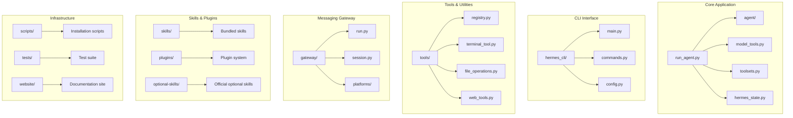
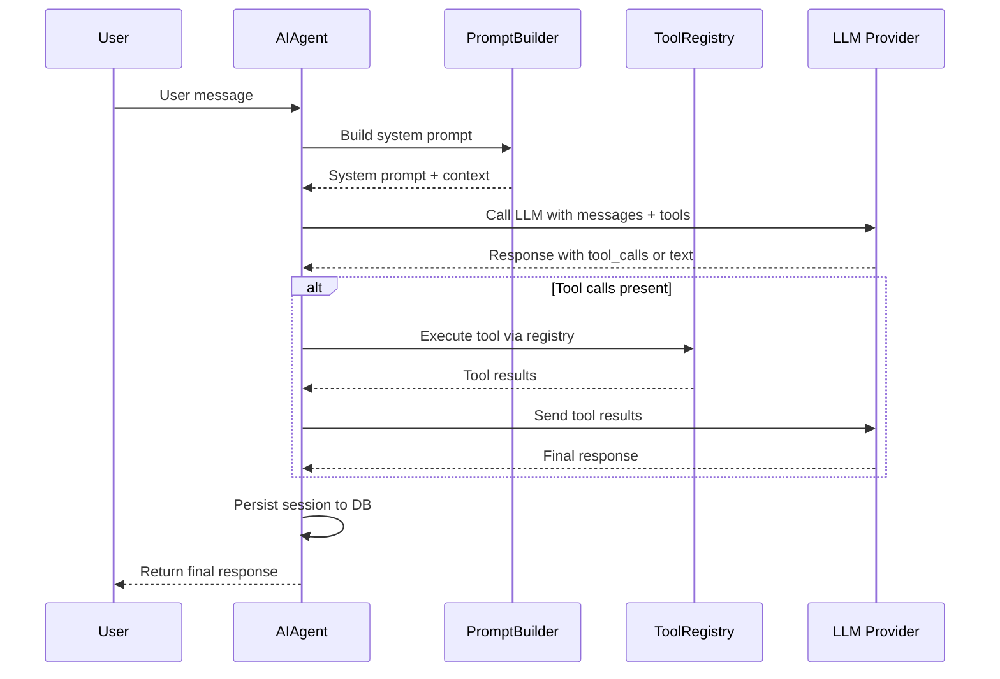
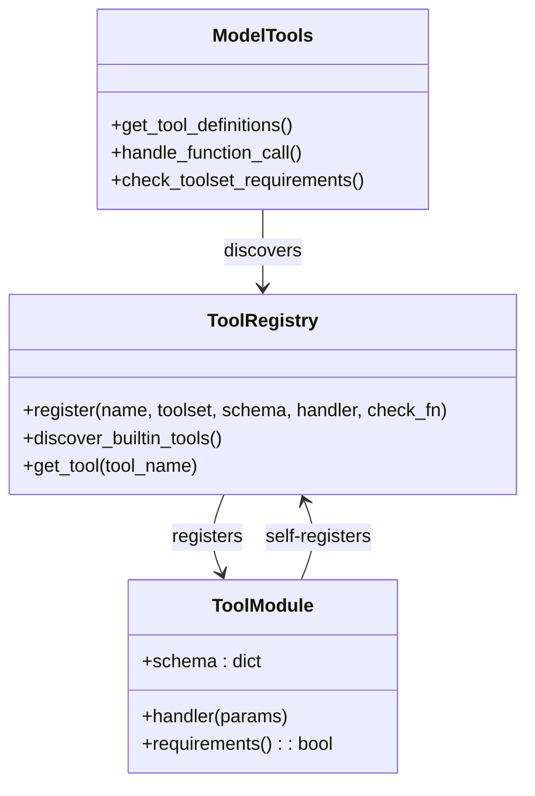
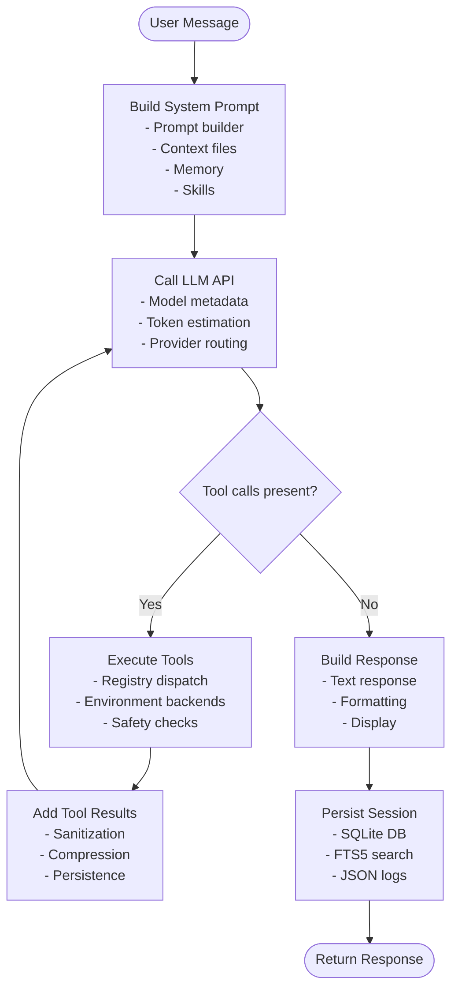
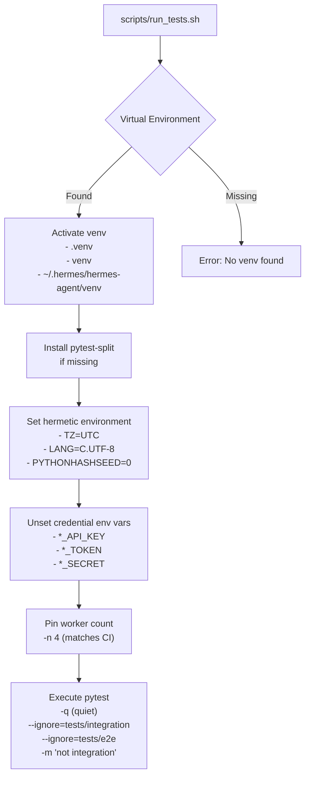
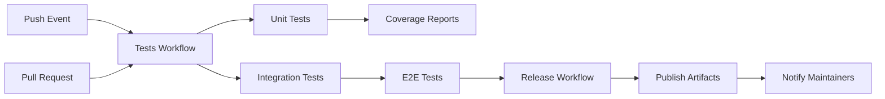
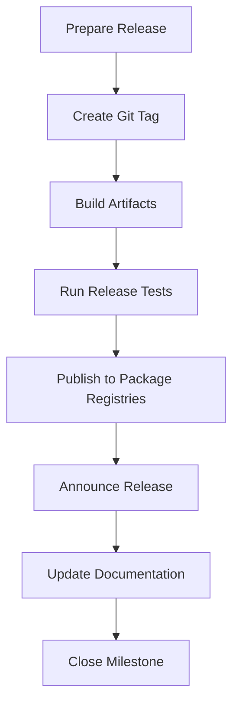

# Development Guide

<cite>
**Referenced Files in This Document**
- [CONTRIBUTING.md](file://CONTRIBUTING.md)
- [README.md](file://README.md)
- [pyproject.toml](file://pyproject.toml)
- [flake.nix](file://flake.nix)
- [package.json](file://package.json)
- [uv.lock](file://uv.lock)
- [scripts/run_tests.sh](file://scripts/run_tests.sh)
- [.github/workflows/tests.yml](file://.github/workflows/tests.yml)
- [hermes_cli/main.py](file://hermes_cli/main.py)
- [run_agent.py](file://run_agent.py)
- [nix/devShell.nix](file://nix/devShell.nix)
- [nix/packages.nix](file://nix/packages.nix)
</cite>

## Table of Contents
1. [Introduction](#introduction)
2. [Development Environment Setup](#development-environment-setup)
3. [Project Structure Overview](#project-structure-overview)
4. [Core Components](#core-components)
5. [Architecture Overview](#architecture-overview)
6. [Testing Framework](#testing-framework)
7. [Development Workflows](#development-workflows)
8. [Code Quality and Style](#code-quality-and-style)
9. [Continuous Integration](#continuous-integration)
10. [Contribution Guidelines](#contribution-guidelines)
11. [Troubleshooting Guide](#troubleshooting-guide)
12. [Best Practices](#best-practices)
13. [Release Procedures](#release-procedures)
14. [Conclusion](#conclusion)

## Introduction

This Development Guide provides comprehensive documentation for setting up a development environment, understanding the project structure, implementing and testing features, and contributing to the Hermes Agent project. The guide covers development environment configuration using Python virtual environments, Node.js setup, dependency management with uv and Nix, testing frameworks, code style conventions, and contribution processes.

## Development Environment Setup

### Prerequisites

The project requires the following tools and dependencies:

- **Git**: With `--recurse-submodules` support and Git LFS extension installed
- **Python 3.11+**: Managed via uv
- **uv**: Fast Python package manager
- **Node.js 20+**: Optional, needed for browser tools and WhatsApp bridge

### Manual Setup

Follow these steps to set up the development environment manually:

1. **Clone the repository**:
   ```bash
   git clone --recurse-submodules https://github.com/NousResearch/hermes-agent.git
   cd hermes-agent
   ```

2. **Create a Python virtual environment**:
   ```bash
   uv venv venv --python 3.11
   export VIRTUAL_ENV="$(pwd)/venv"
   ```

3. **Install dependencies with all extras**:
   ```bash
   uv pip install -e ".[all,dev]"
   ```

4. **Optional: Install Node.js dependencies for browser tools**:
   ```bash
   npm install
   ```

5. **Configure development environment**:
   ```bash
   mkdir -p ~/.hermes/{cron,sessions,logs,memories,skills}
   cp cli-config.yaml.example ~/.hermes/config.yaml
   touch ~/.hermes/.env
   echo "OPENROUTER_API_KEY=***" >> ~/.hermes/.env
   ```

6. **Run the application**:
   ```bash
   mkdir -p ~/.local/bin
   ln -sf "$(pwd)/venv/bin/hermes" ~/.local/bin/hermes
   hermes doctor
   hermes chat -q "Hello"
   ```

### Automated Setup

The repository provides automated setup scripts for quick initialization:

- **Setup script**: `./setup-hermes.sh` - Installs uv, creates venv, installs `.[all]`, symlinks to `~/.local/bin/hermes`
- **Manual path**: Equivalent to the automated setup using uv commands

### Nix Development Shell

For Nix users, the project provides a development shell that delegates setup to each package:

1. **Build the project**:
   ```bash
   nix build
   ```

2. **Enter the development shell**:
   ```bash
   nix develop
   ```

3. **The shell includes**:
   - uv for Python dependency management
   - Pre-configured environment with all necessary tools

**Section sources**
- [CONTRIBUTING.md:70-120](file://CONTRIBUTING.md#L70-L120)
- [README.md:159-177](file://README.md#L159-L177)
- [nix/devShell.nix:1-31](file://nix/devShell.nix#L1-L31)
- [nix/packages.nix:1-27](file://nix/packages.nix#L1-L27)

## Project Structure Overview

The Hermes Agent project follows a modular architecture with distinct components:



**Diagram sources**
- [CONTRIBUTING.md:134-201](file://CONTRIBUTING.md#L134-L201)

### Key Directories and Their Purposes

- **agent/**: Core agent internals including prompt building, context compression, and memory management
- **hermes_cli/**: Command-line interface implementation with configuration management and command dispatch
- **tools/**: Tool implementations with self-registering mechanism and environment backends
- **gateway/**: Messaging platform integration and session management
- **skills/**: Bundled skills organized by category with structured documentation
- **plugins/**: Plugin system for extending functionality
- **tests/**: Comprehensive test suite with unit, integration, and end-to-end tests
- **scripts/**: Installation and maintenance scripts
- **website/**: Documentation site source

**Section sources**
- [CONTRIBUTING.md:134-216](file://CONTRIBUTING.md#L134-L216)

## Core Components

### Agent Runtime System

The agent runtime system orchestrates conversation loops, tool execution, and session persistence:



**Diagram sources**
- [CONTRIBUTING.md:221-236](file://CONTRIBUTING.md#L221-L236)

### Tool Registration System

The tool system uses a self-registering pattern for automatic discovery:



**Diagram sources**
- [CONTRIBUTING.md:258-320](file://CONTRIBUTING.md#L258-L320)

**Section sources**
- [run_agent.py:1-200](file://run_agent.py#L1-L200)
- [hermes_cli/main.py:1-200](file://hermes_cli/main.py#L1-L200)

## Architecture Overview

### Core Loop Architecture

The agent follows a structured conversation loop with tool execution capabilities:



**Diagram sources**
- [CONTRIBUTING.md:219-246](file://CONTRIBUTING.md#L219-L246)

### Cross-Platform Compatibility

The system implements comprehensive cross-platform compatibility measures:

- **Process Management**: Uses `psutil` for cross-platform process operations
- **File Operations**: Handles encoding differences between platforms
- **Terminal Backends**: Supports multiple execution environments (local, Docker, SSH, etc.)
- **Windows Compatibility**: Special handling for Windows-specific APIs and limitations

**Section sources**
- [CONTRIBUTING.md:589-775](file://CONTRIBUTING.md#L589-L775)

## Testing Framework

### Test Execution Strategy

The project uses pytest with a hermetic test runner that ensures consistent behavior across environments:



**Diagram sources**
- [scripts/run_tests.sh:1-130](file://scripts/run_tests.sh#L1-L130)

### Test Categories

The testing framework supports multiple test types:

- **Unit Tests**: Individual component testing with mocks and fixtures
- **Integration Tests**: External service interactions (API keys, Modal, etc.)
- **End-to-End Tests**: Complete workflow testing with real scenarios
- **Cross-Platform Tests**: Platform-specific functionality verification

### Continuous Integration Testing

GitHub Actions provides automated testing on Ubuntu runners:

- **Standard Tests**: Runs pytest with 4 workers, ignores integration and e2e tests
- **End-to-End Tests**: Dedicated workflow for comprehensive testing
- **Environment Isolation**: Ensures tests don't call real APIs by blanking credential variables

**Section sources**
- [scripts/run_tests.sh:1-130](file://scripts/run_tests.sh#L1-L130)
- [.github/workflows/tests.yml:1-86](file://.github/workflows/tests.yml#L1-L86)

## Development Workflows

### Common Development Tasks

#### Setting Up a New Feature

1. **Create feature branch**:
   ```bash
   git checkout -b feature/new-capability
   ```

2. **Install development dependencies**:
   ```bash
   uv pip install -e ".[dev]"
   ```

3. **Run tests to verify environment**:
   ```bash
   scripts/run_tests.sh
   ```

4. **Implement feature with proper testing**:
   - Add unit tests
   - Test cross-platform compatibility
   - Verify security considerations

#### Adding a New Tool

Follow the self-registering pattern:

1. **Create tool file** in `tools/` directory
2. **Define tool handler function** with proper error handling
3. **Create tool schema** following the function definition format
4. **Register tool** with `registry.register()`
5. **Add to toolset** in `toolsets.py`
6. **Write comprehensive tests**

#### Creating a New Skill

1. **Create skill directory** under `skills/` or `optional-skills/`
2. **Add `SKILL.md`** with proper frontmatter and documentation
3. **Implement skill logic** in appropriate files
4. **Add test coverage** in `tests/skills/`
5. **Update skill metadata** and ensure compliance with standards

### Debugging Techniques

#### Interactive Debugging

- **Debugpy Integration**: Python debugger support for IDE integration
- **Logging Configuration**: Structured logging with detailed context
- **Session Inspection**: Access to conversation history and tool execution logs

#### Performance Profiling

- **Memory Profiling**: Monitor memory usage during long-running operations
- **Timing Analysis**: Track tool execution and API call performance
- **Resource Monitoring**: CPU and I/O usage during intensive operations

**Section sources**
- [CONTRIBUTING.md:258-320](file://CONTRIBUTING.md#L258-L320)
- [CONTRIBUTING.md:589-775](file://CONTRIBUTING.md#L589-L775)

## Code Quality and Style

### Code Style Conventions

The project follows these style guidelines:

- **PEP 8 Compliance**: With practical exceptions for readability
- **Documentation Comments**: Explain non-obvious intent, trade-offs, and API quirks
- **Error Handling**: Specific exception catching with proper logging
- **Cross-Platform Coding**: Platform-aware implementations with fallbacks

### Security Considerations

Critical security measures implemented:

- **Shell Injection Prevention**: Using `shlex.quote()` for command construction
- **Dangerous Command Detection**: Regex-based approval flow for sensitive operations
- **Path Resolution**: Using `os.path.realpath()` to prevent symlink bypass
- **Secret Management**: Never logging API keys or sensitive information
- **Container Hardening**: Docker containers with capability drops and resource limits

### Cross-Platform Compatibility Rules

Strict guidelines for platform-specific code:

1. **Process Operations**: Use `psutil` instead of `os.kill(pid, 0)`
2. **File Operations**: Handle encoding differences between platforms
3. **Terminal Backends**: Support multiple execution environments
4. **Windows-Specific Handling**: Special cases for Windows limitations
5. **Path Separators**: Use `pathlib.Path` instead of string concatenation

**Section sources**
- [CONTRIBUTING.md:249-255](file://CONTRIBUTING.md#L249-L255)
- [CONTRIBUTING.md:777-800](file://CONTRIBUTING.md#L777-L800)
- [CONTRIBUTING.md:589-775](file://CONTRIBUTING.md#L589-L775)

## Continuous Integration

### GitHub Actions Workflows

The CI system consists of multiple workflows:



### CI Environment Configuration

- **Ubuntu Latest**: Standard Linux environment for most tests
- **Python 3.11**: Consistent Python version across environments
- **System Dependencies**: ripgrep for efficient text searching
- **Environment Isolation**: Blank credential variables to prevent API calls

### Test Coverage Requirements

- **Unit Tests**: Must pass in hermetic environment
- **Integration Tests**: Optional, marked with integration marker
- **Cross-Platform Tests**: Platform-specific tests with appropriate markers
- **Security Tests**: Validation of security measures and protections

**Section sources**
- [.github/workflows/tests.yml:1-86](file://.github/workflows/tests.yml#L1-L86)

## Contribution Guidelines

### Contribution Priority Order

1. **Bug fixes** - crashes, incorrect behavior, data loss
2. **Cross-platform compatibility** - macOS, Linux, WSL2, Windows
3. **Security hardening** - shell injection, prompt injection, path traversal
4. **Performance and robustness** - retry logic, error handling
5. **New skills** - broadly useful capabilities
6. **New tools** - rarely needed, most should be skills
7. **Documentation** - fixes, clarifications, examples

### Pull Request Process

1. **Fork and branch** from main
2. **Implement changes** with proper testing
3. **Update documentation** if affected
4. **Run all tests** locally
5. **Submit PR** with clear description
6. **Address review comments**
7. **Squash commits** before merging

### Code Review Process

- **Automated Checks**: CI workflows run on every PR
- **Human Review**: Maintainer review with feedback
- **Cross-Platform Testing**: Ensure compatibility across all supported platforms
- **Security Review**: Critical security measures validated
- **Performance Impact**: Evaluate performance implications

**Section sources**
- [CONTRIBUTING.md:7-18](file://CONTRIBUTING.md#L7-L18)
- [CONTRIBUTING.md:121-131](file://CONTRIBUTING.md#L121-L131)

## Troubleshooting Guide

### Common Development Issues

#### Virtual Environment Problems

**Issue**: No virtual environment found
**Solution**: 
```bash
# Check if venv exists
ls -la venv/
# Create new venv
uv venv venv --python 3.11
```

#### Dependency Installation Issues

**Issue**: Missing dependencies or version conflicts
**Solution**:
```bash
# Clean reinstall
uv pip uninstall -e ".[all,dev]"
uv pip install -e ".[all,dev]"
```

#### Cross-Platform Compatibility Issues

**Issue**: Windows-specific failures
**Solution**:
- Use `psutil` instead of `os.kill(pid, 0)`
- Handle encoding differences with proper error handling
- Test with `scripts/check-windows-footguns.py`

#### Test Environment Issues

**Issue**: Tests failing due to environment variables
**Solution**:
- Use `scripts/run_tests.sh` instead of direct pytest calls
- Ensure credential variables are properly unset
- Verify timezone and locale settings

### Debugging Tools and Techniques

#### Interactive Debugging

- **Debugpy**: Python debugger integration for IDEs
- **Logging**: Structured logging with detailed context information
- **Session Inspection**: Access to conversation history and tool execution logs

#### Performance Analysis

- **Memory Profiling**: Monitor memory usage during long operations
- **Timing Analysis**: Track tool execution and API call performance
- **Resource Monitoring**: CPU and I/O usage during intensive operations

**Section sources**
- [scripts/run_tests.sh:1-130](file://scripts/run_tests.sh#L1-L130)
- [CONTRIBUTING.md:589-775](file://CONTRIBUTING.md#L589-L775)

## Best Practices

### Development Practices

1. **Test-Driven Development**: Write tests before implementing features
2. **Cross-Platform First**: Design with all supported platforms in mind
3. **Security by Design**: Implement security measures from the start
4. **Performance Awareness**: Consider performance implications of all changes
5. **Documentation**: Keep documentation current with code changes

### Code Organization

1. **Modular Design**: Keep components focused and reusable
2. **Clear Interfaces**: Define clear contracts between modules
3. **Error Handling**: Implement comprehensive error handling
4. **Logging**: Use structured logging for debugging and monitoring
5. **Configuration**: Externalize configuration where appropriate

### Collaboration Standards

1. **Code Reviews**: All changes reviewed by maintainers
2. **Branch Naming**: Descriptive branch names following conventions
3. **Commit Messages**: Clear, descriptive commit messages
4. **Pull Requests**: Well-documented PRs with testing information
5. **Issue Tracking**: Use issues for bugs and feature requests

## Release Procedures

### Version Management

The project uses semantic versioning with the following structure:
- **Major**: Breaking changes
- **Minor**: New features
- **Patch**: Bug fixes and improvements

### Release Workflow



### Release Checklist

- [ ] All tests passing in CI
- [ ] Documentation updated
- [ ] Changelog compiled
- [ ] Version bumped appropriately
- [ ] Tags created and pushed
- [ ] Artifacts published
- [ ] Announcement made

**Section sources**
- [pyproject.toml:1-253](file://pyproject.toml#L1-L253)

## Conclusion

This Development Guide provides comprehensive coverage of setting up a development environment, understanding the project architecture, implementing features safely, and contributing effectively to the Hermes Agent project. The guide emphasizes cross-platform compatibility, security best practices, and thorough testing procedures that are essential for maintaining the quality and reliability of this sophisticated AI agent system.

Key takeaways for contributors:
- Follow the established patterns for tools, skills, and plugins
- Prioritize security and cross-platform compatibility
- Implement comprehensive testing with proper isolation
- Maintain clear documentation and code organization
- Engage constructively in the review process

The modular architecture and extensive testing framework provide a solid foundation for extending the Hermes Agent with new capabilities while maintaining system stability and security.