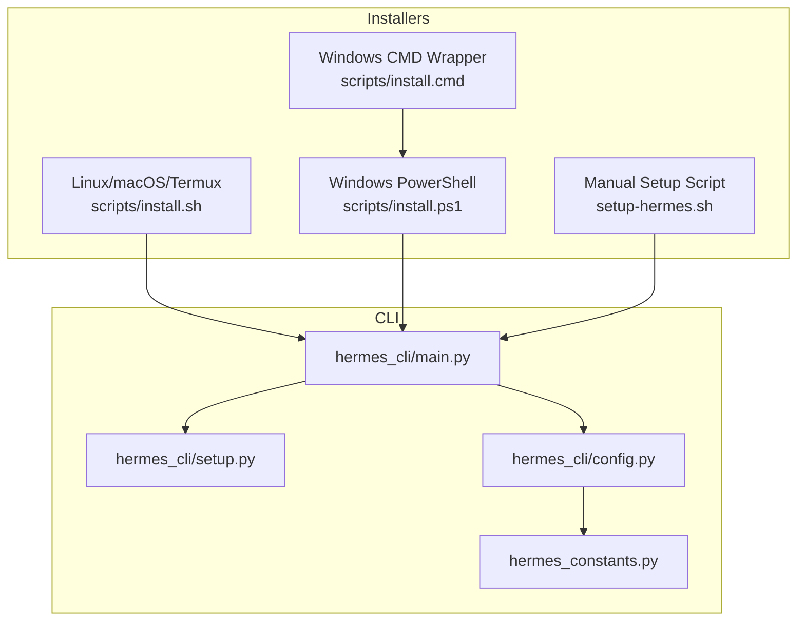
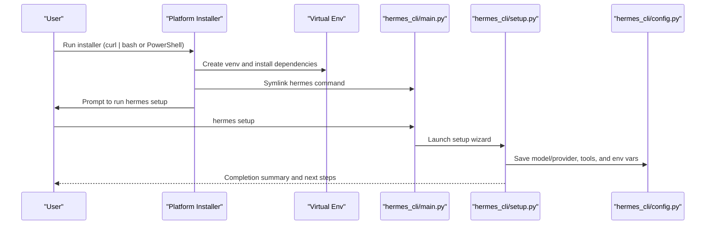
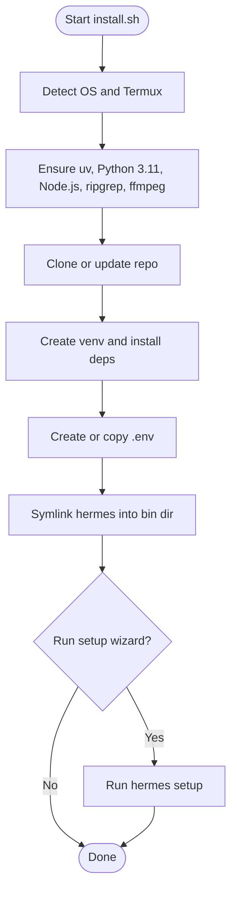
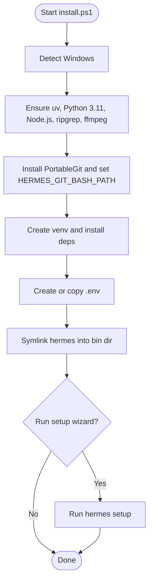
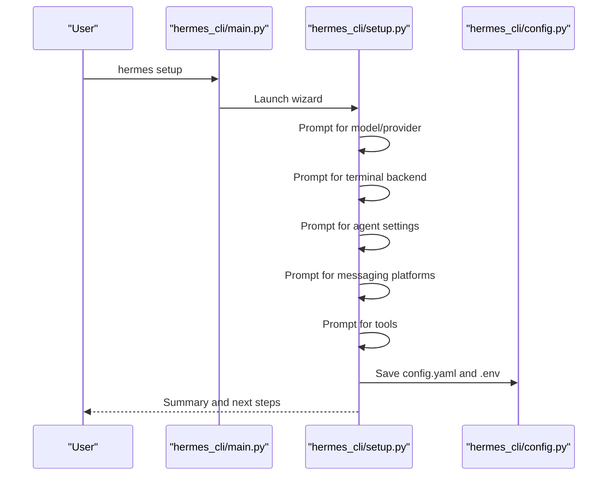
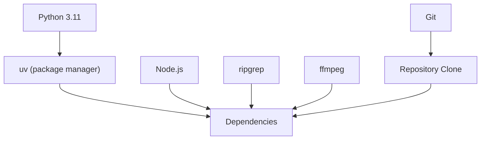

# Getting Started

<cite>
**Referenced Files in This Document**
- [setup-hermes.sh](file://setup-hermes.sh)
- [install.sh](file://scripts/install.sh)
- [install.ps1](file://scripts/install.ps1)
- [install.cmd](file://scripts/install.cmd)
- [hermes_cli/setup.py](file://hermes_cli/setup.py)
- [hermes_cli/main.py](file://hermes_cli/main.py)
- [hermes_cli/config.py](file://hermes_cli/config.py)
- [hermes_constants.py](file://hermes_constants.py)
</cite>

## Table of Contents
1. [Introduction](#introduction)
2. [Project Structure](#project-structure)
3. [Core Components](#core-components)
4. [Architecture Overview](#architecture-overview)
5. [Detailed Component Analysis](#detailed-component-analysis)
6. [Dependency Analysis](#dependency-analysis)
7. [Performance Considerations](#performance-considerations)
8. [Troubleshooting Guide](#troubleshooting-guide)
9. [Conclusion](#conclusion)
10. [Appendices](#appendices)

## Introduction
This guide helps you install and get started with Hermes Agent across Linux, macOS, Windows (PowerShell), WSL2, and Termux. It explains the automated installer process, dependency management (uv, Python 3.11, Node.js, ripgrep, ffmpeg), platform-specific considerations, and how to complete initial setup. You will learn how to source shell configurations, run the setup wizard, and begin chatting, configuring models, enabling tools, and starting the gateway.

## Project Structure
Hermes provides platform-specific installers and a unified CLI entry point. The key pieces are:
- Automated installers for Linux/macOS/Termux and Windows (PowerShell/CMD)
- A setup wizard that configures models, providers, terminal backend, messaging platforms, and tools
- A CLI that exposes commands like hermes, hermes setup, hermes model, hermes tools, hermes gateway, hermes doctor, and more

**Diagram sources**
- [install.sh:1-200](file://scripts/install.sh#L1-L200)
- [install.ps1:1-120](file://scripts/install.ps1#L1-L120)
- [install.cmd:1-29](file://scripts/install.cmd#L1-L29)
- [setup-hermes.sh:1-120](file://setup-hermes.sh#L1-L120)
- [hermes_cli/main.py:1-120](file://hermes_cli/main.py#L1-L120)
- [hermes_cli/setup.py:1-120](file://hermes_cli/setup.py#L1-L120)
- [hermes_cli/config.py:1-120](file://hermes_cli/config.py#L1-L120)
- [hermes_constants.py:1-120](file://hermes_constants.py#L1-L120)

**Section sources**
- [install.sh:1-200](file://scripts/install.sh#L1-L200)
- [install.ps1:1-120](file://scripts/install.ps1#L1-L120)
- [install.cmd:1-29](file://scripts/install.cmd#L1-L29)
- [setup-hermes.sh:1-120](file://setup-hermes.sh#L1-L120)
- [hermes_cli/main.py:1-120](file://hermes_cli/main.py#L1-L120)
- [hermes_cli/setup.py:1-120](file://hermes_cli/setup.py#L1-L120)
- [hermes_cli/config.py:1-120](file://hermes_cli/config.py#L1-L120)
- [hermes_constants.py:1-120](file://hermes_constants.py#L1-L120)

## Core Components
- Automated installers:
  - Linux/macOS/Termux: scripts/install.sh
  - Windows: scripts/install.ps1 and scripts/install.cmd
- Manual setup script: setup-hermes.sh for developers who cloned the repo
- CLI entry point: hermes_cli/main.py
- Setup wizard: hermes_cli/setup.py
- Configuration and paths: hermes_cli/config.py and hermes_constants.py

Key capabilities:
- Detect platform and installers (uv, Python 3.11, Node.js, ripgrep, ffmpeg)
- Create a Python virtual environment and install dependencies
- Create or copy .env from template
- Symlink the hermes command into a user-facing bin directory
- Optionally run the setup wizard to configure API keys and tools
- Provide commands like hermes, hermes setup, hermes model, hermes tools, hermes gateway, hermes doctor

**Section sources**
- [install.sh:1-200](file://scripts/install.sh#L1-L200)
- [install.ps1:1-120](file://scripts/install.ps1#L1-L120)
- [install.cmd:1-29](file://scripts/install.cmd#L1-L29)
- [setup-hermes.sh:1-120](file://setup-hermes.sh#L1-L120)
- [hermes_cli/main.py:1-120](file://hermes_cli/main.py#L1-L120)
- [hermes_cli/setup.py:1-120](file://hermes_cli/setup.py#L1-L120)
- [hermes_cli/config.py:1-120](file://hermes_cli/config.py#L1-L120)
- [hermes_constants.py:1-120](file://hermes_constants.py#L1-L120)

## Architecture Overview
The installation and setup flow varies by platform but converges on a common CLI and configuration model.

**Diagram sources**
- [install.sh:1-200](file://scripts/install.sh#L1-L200)
- [install.ps1:1-120](file://scripts/install.ps1#L1-L120)
- [install.cmd:1-29](file://scripts/install.cmd#L1-L29)
- [setup-hermes.sh:1-120](file://setup-hermes.sh#L1-L120)
- [hermes_cli/main.py:1-120](file://hermes_cli/main.py#L1-L120)
- [hermes_cli/setup.py:1-120](file://hermes_cli/setup.py#L1-L120)
- [hermes_cli/config.py:1-120](file://hermes_cli/config.py#L1-L120)

## Detailed Component Analysis

### Automated Installers

#### Linux/macOS/Termux (scripts/install.sh)
- Detects OS and Termux
- Ensures uv, Python 3.11, Node.js, ripgrep, ffmpeg
- Clones or updates the repository
- Creates a virtual environment and installs dependencies
- Creates or copies .env from template
- Symlinks hermes into ~/.local/bin or $PREFIX/bin (Termux)
- Optionally runs the setup wizard

**Diagram sources**
- [install.sh:1-200](file://scripts/install.sh#L1-L200)
- [install.sh:200-600](file://scripts/install.sh#L200-L600)

**Section sources**
- [install.sh:1-200](file://scripts/install.sh#L1-L200)
- [install.sh:200-600](file://scripts/install.sh#L200-L600)

#### Windows (PowerShell: scripts/install.ps1)
- Detects Windows and installs uv, Python 3.11, Node.js, ripgrep, ffmpeg
- Downloads PortableGit and sets HERMES_GIT_BASH_PATH
- Creates a virtual environment and installs dependencies
- Symlinks hermes into a user-facing bin directory
- Optionally runs the setup wizard

**Diagram sources**
- [install.ps1:1-120](file://scripts/install.ps1#L1-L120)
- [install.ps1:120-400](file://scripts/install.ps1#L120-L400)

**Section sources**
- [install.ps1:1-120](file://scripts/install.ps1#L1-L120)
- [install.ps1:120-400](file://scripts/install.ps1#L120-L400)

#### Windows (CMD: scripts/install.cmd)
- Thin wrapper that launches the PowerShell installer

**Section sources**
- [install.cmd:1-29](file://scripts/install.cmd#L1-L29)

#### Manual Setup (setup-hermes.sh)
- For developers who cloned the repo
- Detects Termux vs desktop/server
- Uses uv when available, otherwise Python stdlib venv + pip
- Creates venv, installs dependencies, creates .env, symlinks hermes
- Optionally runs the setup wizard

**Section sources**
- [setup-hermes.sh:1-120](file://setup-hermes.sh#L1-L120)
- [setup-hermes.sh:120-260](file://setup-hermes.sh#L120-L260)

### Setup Wizard (hermes_cli/setup.py)
- Interactive wizard with modular sections:
  - Model & Provider
  - Terminal Backend
  - Agent Settings
  - Messaging Platforms
  - Tools
- Saves configuration to ~/.hermes/config.yaml and API keys to ~/.hermes/.env
- Provides a summary of tool availability and next steps

**Diagram sources**
- [hermes_cli/main.py:1-120](file://hermes_cli/main.py#L1-L120)
- [hermes_cli/setup.py:1-120](file://hermes_cli/setup.py#L1-L120)
- [hermes_cli/config.py:1-120](file://hermes_cli/config.py#L1-L120)

**Section sources**
- [hermes_cli/setup.py:1-120](file://hermes_cli/setup.py#L1-L120)
- [hermes_cli/setup.py:780-860](file://hermes_cli/setup.py#L780-L860)
- [hermes_cli/config.py:1-120](file://hermes_cli/config.py#L1-L120)

### CLI Entry Point (hermes_cli/main.py)
- Defines CLI commands and entry points
- Loads environment from ~/.hermes/.env
- Bridges security and logging initialization
- Provides guards for interactive commands requiring a TTY

**Section sources**
- [hermes_cli/main.py:1-120](file://hermes_cli/main.py#L1-L120)
- [hermes_cli/main.py:80-120](file://hermes_cli/main.py#L80-L120)

### Configuration and Paths (hermes_cli/config.py, hermes_constants.py)
- Manages ~/.hermes directory structure and permissions
- Provides functions to get config and env file paths
- Handles managed mode (NixOS/Homebrew) and container detection
- Exposes constants and helpers for paths and environment

**Section sources**
- [hermes_cli/config.py:1-120](file://hermes_cli/config.py#L1-L120)
- [hermes_cli/config.py:320-460](file://hermes_cli/config.py#L320-L460)
- [hermes_constants.py:1-120](file://hermes_constants.py#L1-L120)
- [hermes_constants.py:140-180](file://hermes_constants.py#L140-L180)

## Dependency Analysis
- Python 3.11 is required and managed by uv or the system
- uv is used for fast dependency resolution and installation on desktop/server
- Node.js is required for browser tools and is managed by the installer
- ripgrep is optional but recommended for faster file search
- ffmpeg is optional but recommended for TTS voice messages
- Git is required for cloning the repository and is ensured by the installer

**Diagram sources**
- [install.sh:440-520](file://scripts/install.sh#L440-L520)
- [install.ps1:579-693](file://scripts/install.ps1#L579-L693)
- [setup-hermes.sh:133-163](file://setup-hermes.sh#L133-L163)

**Section sources**
- [install.sh:440-520](file://scripts/install.sh#L440-L520)
- [install.ps1:579-693](file://scripts/install.ps1#L579-L693)
- [setup-hermes.sh:133-163](file://setup-hermes.sh#L133-L163)

## Performance Considerations
- Using uv for dependency management speeds up installations and ensures reproducibility
- ripgrep significantly improves file search performance compared to grep
- ffmpeg enables TTS voice messages and video processing
- The setup wizard is designed to be non-blocking and provides clear next steps

## Troubleshooting Guide
Common issues and resolutions:
- uv not found on desktop/server: The installer will attempt to install uv; ensure ~/.local/bin is on PATH
- Termux Python not found or too old: The installer will install Python 3.11 via pkg
- Node.js not found: The installer will install Node.js or use a managed install
- ripgrep not found: The installer will prompt to install ripgrep; if auto-install fails, follow the suggested manual steps
- ffmpeg not found: The installer will prompt to install ffmpeg; if auto-install fails, follow the suggested manual steps
- Windows Git not found: The installer will download PortableGit and set HERMES_GIT_BASH_PATH
- PATH not updated: On non-Termux platforms, the installer adds ~/.local/bin to PATH; reload your shell configuration

**Section sources**
- [install.sh:357-439](file://scripts/install.sh#L357-L439)
- [install.sh:536-670](file://scripts/install.sh#L536-L670)
- [install.ps1:115-193](file://scripts/install.ps1#L115-L193)
- [install.ps1:579-693](file://scripts/install.ps1#L579-L693)
- [setup-hermes.sh:274-323](file://setup-hermes.sh#L274-L323)
- [setup-hermes.sh:351-390](file://setup-hermes.sh#L351-L390)

## Conclusion
You now have the essential steps to install Hermes Agent on Linux, macOS, Windows (PowerShell), WSL2, and Termux. Use the automated installers for a guided setup, or the manual setup script if you prefer to manage the environment yourself. After installation, run the setup wizard to configure models, providers, and tools, then start chatting and explore the gateway and other commands.

## Appendices

### Quick Start Commands
- Chat: hermes
- Setup wizard: hermes setup
- Configure model/provider: hermes model
- Enable tools: hermes tools
- Start gateway: hermes gateway
- Check configuration: hermes status
- Diagnose issues: hermes doctor

**Section sources**
- [hermes_cli/main.py:1-60](file://hermes_cli/main.py#L1-L60)
- [hermes_cli/setup.py:580-640](file://hermes_cli/setup.py#L580-L640)