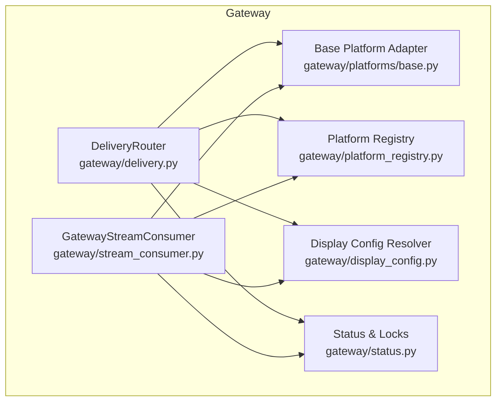
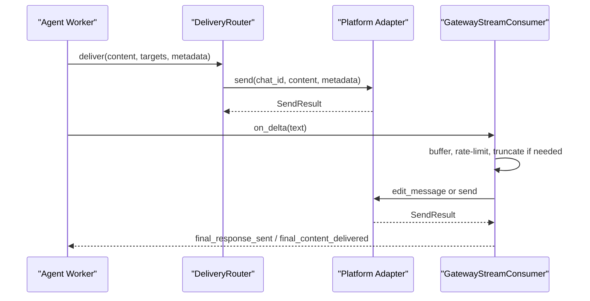
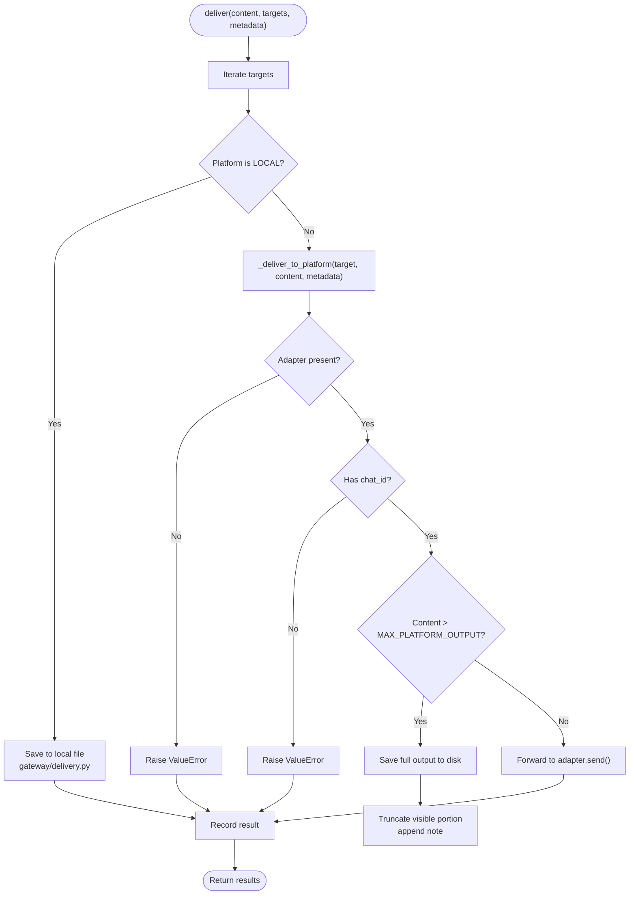
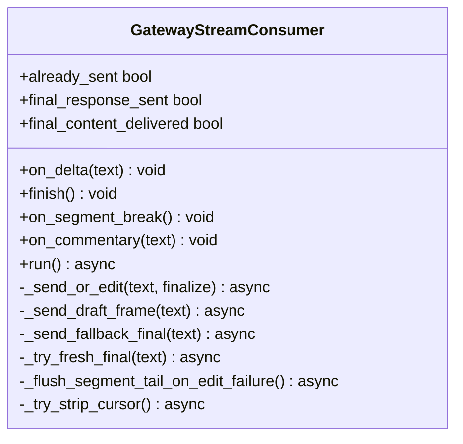
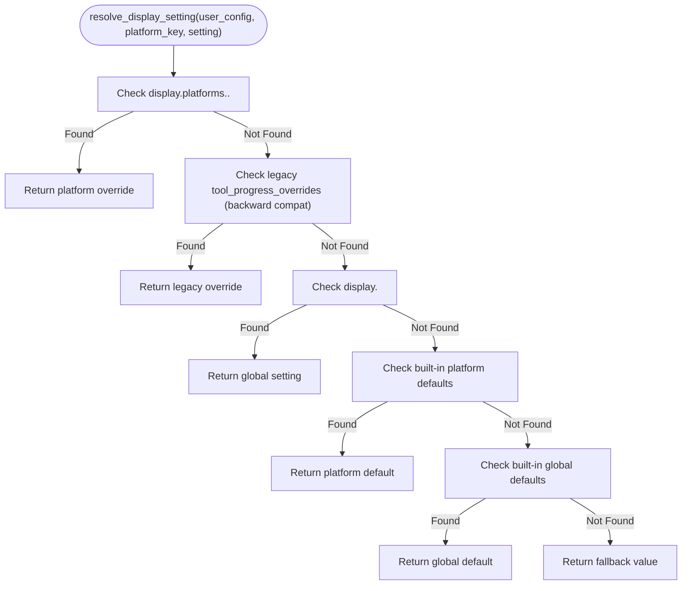
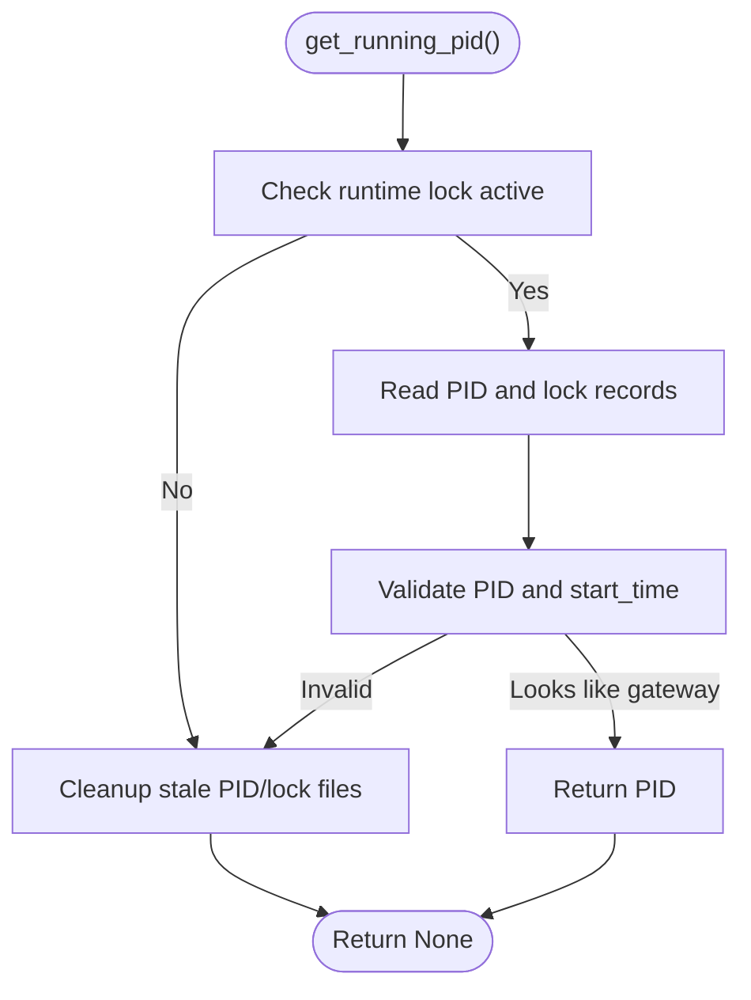
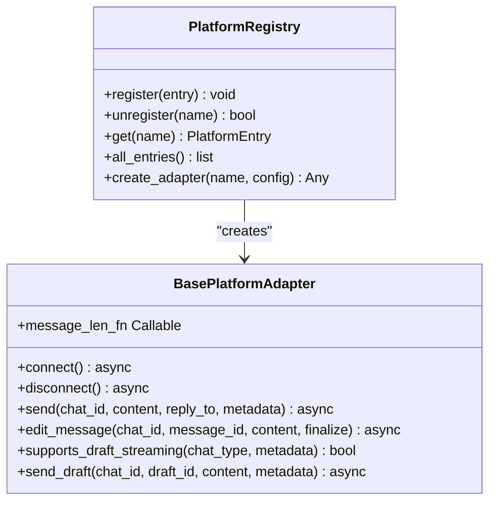
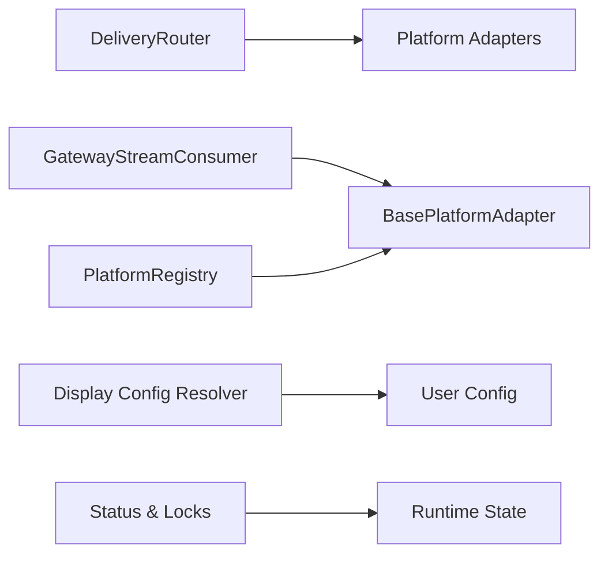

# Delivery and Routing

<cite>
**Referenced Files in This Document**
- [delivery.py](file://gateway/delivery.py)
- [stream_consumer.py](file://gateway/stream_consumer.py)
- [status.py](file://gateway/status.py)
- [display_config.py](file://gateway/display_config.py)
- [platform_registry.py](file://gateway/platform_registry.py)
- [base.py](file://gateway/platforms/base.py)
</cite>

## Table of Contents
1. [Introduction](#introduction)
2. [Project Structure](#project-structure)
3. [Core Components](#core-components)
4. [Architecture Overview](#architecture-overview)
5. [Detailed Component Analysis](#detailed-component-analysis)
6. [Dependency Analysis](#dependency-analysis)
7. [Performance Considerations](#performance-considerations)
8. [Troubleshooting Guide](#troubleshooting-guide)
9. [Conclusion](#conclusion)
10. [Appendices](#appendices)

## Introduction
This document explains the Delivery and Routing system responsible for delivering messages across platforms and managing real-time streaming responses. It covers:
- How the DeliveryRouter determines the appropriate delivery method based on message type, recipient, and platform capabilities
- Real-time streaming delivery via progressive edits and native draft streaming
- Status tracking and runtime health reporting
- Display configuration options for platform-specific formatting and UI behavior
- Practical configuration examples, streaming setup, and troubleshooting strategies

## Project Structure
The Delivery and Routing system spans several gateway modules:
- Delivery routing and local persistence
- Streaming consumer for progressive edits and fallbacks
- Runtime status and locking for gateway health
- Display configuration resolver for platform-specific verbosity and streaming behavior
- Platform adapter base and registry for pluggable integrations

**Diagram sources**
- [delivery.py:109-259](file://gateway/delivery.py#L109-L259)
- [stream_consumer.py:77-1287](file://gateway/stream_consumer.py#L77-L1287)
- [display_config.py:116-207](file://gateway/display_config.py#L116-L207)
- [status.py:925-972](file://gateway/status.py#L925-L972)
- [platform_registry.py:162-261](file://gateway/platform_registry.py#L162-L261)
- [base.py:1268-1599](file://gateway/platforms/base.py#L1268-L1599)

**Section sources**
- [delivery.py:1-259](file://gateway/delivery.py#L1-L259)
- [stream_consumer.py:1-1287](file://gateway/stream_consumer.py#L1-L1287)
- [display_config.py:1-207](file://gateway/display_config.py#L1-L207)
- [status.py:1-972](file://gateway/status.py#L1-L972)
- [platform_registry.py:1-261](file://gateway/platform_registry.py#L1-L261)
- [base.py:1-3757](file://gateway/platforms/base.py#L1-L3757)

## Core Components
- DeliveryRouter: Parses delivery targets, routes to platform adapters, and persists local outputs. It truncates oversized outputs and attaches thread metadata for platforms supporting it.
- GatewayStreamConsumer: Bridges synchronous agent callbacks to asynchronous platform delivery. It progressively edits a single message, supports native draft streaming, and implements flood-control backoff and fallback final sends.
- Display Config Resolver: Provides platform-aware display settings (tool progress, reasoning visibility, streaming behavior) with sensible defaults and overrides.
- Status & Locks: Manages gateway runtime status, PID/lock files, and scoped locks for safe multi-process operation.
- Platform Registry & Base Adapter: Enables plugin and built-in platform adapters, defines the adapter interface, and exposes capabilities like draft streaming and message length functions.

**Section sources**
- [delivery.py:109-259](file://gateway/delivery.py#L109-L259)
- [stream_consumer.py:77-1287](file://gateway/stream_consumer.py#L77-L1287)
- [display_config.py:116-207](file://gateway/display_config.py#L116-L207)
- [status.py:925-972](file://gateway/status.py#L925-L972)
- [platform_registry.py:162-261](file://gateway/platform_registry.py#L162-L261)
- [base.py:1268-1599](file://gateway/platforms/base.py#L1268-L1599)

## Architecture Overview
The system orchestrates delivery and streaming through a clear separation of concerns:
- DeliveryRouter resolves targets and dispatches to platform adapters
- GatewayStreamConsumer buffers and progressively edits messages with platform-aware logic
- Display configuration influences verbosity and streaming behavior per platform
- Status and locks maintain runtime health and concurrency control
- Platform adapters encapsulate platform-specific capabilities and constraints

**Diagram sources**
- [delivery.py:129-254](file://gateway/delivery.py#L129-L254)
- [stream_consumer.py:361-1287](file://gateway/stream_consumer.py#L361-L1287)
- [base.py:1555-1575](file://gateway/platforms/base.py#L1555-L1575)

## Detailed Component Analysis

### DeliveryRouter
Responsibilities:
- Parse delivery targets (origin, local, platform:chat_id:thread_id)
- Route to platform adapters or save locally
- Truncate oversized outputs and persist full content
- Attach thread metadata for platforms supporting it

Key behaviors:
- Target parsing supports explicit chat/thread IDs and home-channel defaults
- Local delivery writes structured markdown files with metadata
- Platform delivery validates adapters and chat IDs, truncates content exceeding platform limits, and forwards thread IDs via metadata

**Diagram sources**
- [delivery.py:129-254](file://gateway/delivery.py#L129-L254)

**Section sources**
- [delivery.py:28-107](file://gateway/delivery.py#L28-L107)
- [delivery.py:109-259](file://gateway/delivery.py#L109-L259)

### GatewayStreamConsumer
Responsibilities:
- Progressive edits with rate-limiting and buffer thresholds
- Native draft streaming for platforms that support it
- Flood-control backoff and fallback final sends
- Tool boundary segmentation and commentary messages
- Fresh final message strategy to align visible timestamps with completion

Key behaviors:
- Maintains a queue from synchronous agent callbacks and drains it in an async loop
- Filters reasoning/thinking tags and cleans MEDIA directives before display
- Adapts edit intervals on flood-control errors and disables progressive edits after repeated strikes
- Supports segmented messages and overflow splitting with platform-aware chunking
- Notifies on new message creation to linearize tool-progress bubbles

**Diagram sources**
- [stream_consumer.py:77-1287](file://gateway/stream_consumer.py#L77-L1287)

**Section sources**
- [stream_consumer.py:77-1287](file://gateway/stream_consumer.py#L77-L1287)

### Display Configuration Resolver
Responsibilities:
- Resolve platform-specific display settings with precedence: per-platform overrides, global user settings, platform defaults, and global defaults
- Provide sensible defaults for tool progress, reasoning visibility, preview length, and streaming behavior
- Maintain backward compatibility for legacy overrides

Key behaviors:
- Supports per-platform tiers (high/medium/low/minimal) aligned with platform capabilities
- Normalizes YAML values and ensures consistent interpretation across platforms

**Diagram sources**
- [display_config.py:116-207](file://gateway/display_config.py#L116-L207)

**Section sources**
- [display_config.py:116-207](file://gateway/display_config.py#L116-L207)

### Status and Runtime Health
Responsibilities:
- Persist gateway runtime status and PID/lock files
- Acquire/release scoped locks to prevent conflicting gateway instances
- Detect running gateway instances and manage takeover/planned stop markers
- Report platform-specific status for diagnostics

Key behaviors:
- Atomic PID and runtime status writes with JSON payloads
- Cross-platform process existence checks and lock acquisition
- Takeover and planned stop markers to coordinate graceful replacements

**Diagram sources**
- [status.py:925-972](file://gateway/status.py#L925-L972)

**Section sources**
- [status.py:925-972](file://gateway/status.py#L925-L972)

### Platform Registry and Base Adapter
Responsibilities:
- Register and create platform adapters (built-in and plugin)
- Define the BasePlatformAdapter interface for send/edit/capabilities
- Expose platform capabilities like draft streaming and message length functions

Key behaviors:
- PlatformEntry metadata and factory pattern for adapters
- Base adapter methods for connect/disconnect, send, edit, and optional draft streaming
- Capability probes and message length normalization

**Diagram sources**
- [platform_registry.py:162-261](file://gateway/platform_registry.py#L162-L261)
- [base.py:1268-1599](file://gateway/platforms/base.py#L1268-L1599)

**Section sources**
- [platform_registry.py:162-261](file://gateway/platform_registry.py#L162-L261)
- [base.py:1268-1599](file://gateway/platforms/base.py#L1268-L1599)

## Dependency Analysis
The system exhibits low coupling and high cohesion:
- DeliveryRouter depends on Platform enum and adapters dictionary; it delegates platform-specific logic to adapters
- GatewayStreamConsumer depends on BasePlatformAdapter interface and platform capabilities
- Display configuration resolver is decoupled and only consumes configuration
- Status module is self-contained for runtime health and concurrency control
- Platform registry centralizes adapter creation and validation

**Diagram sources**
- [delivery.py:117-127](file://gateway/delivery.py#L117-L127)
- [stream_consumer.py:113-121](file://gateway/stream_consumer.py#L113-L121)
- [display_config.py:116-178](file://gateway/display_config.py#L116-L178)
- [status.py:504-547](file://gateway/status.py#L504-L547)
- [platform_registry.py:208-256](file://gateway/platform_registry.py#L208-L256)

**Section sources**
- [delivery.py:117-127](file://gateway/delivery.py#L117-L127)
- [stream_consumer.py:113-121](file://gateway/stream_consumer.py#L113-L121)
- [display_config.py:116-178](file://gateway/display_config.py#L116-L178)
- [status.py:504-547](file://gateway/status.py#L504-L547)
- [platform_registry.py:208-256](file://gateway/platform_registry.py#L208-L256)

## Performance Considerations
- Streaming edits: Use buffer thresholds and edit intervals to balance responsiveness and API pressure; increase intervals on flood-control to reduce churn
- Overflow handling: Platform-aware chunking prevents message loss; ensure thread metadata is included to avoid routing issues
- Draft streaming: Prefer native drafts for platforms that support it to reduce edit traffic; gracefully degrade to edit-based progressive updates
- Local persistence: Structured markdown outputs aid diagnostics but should be rotated to avoid disk growth
- Status writes: Batch and throttle status updates to minimize IO overhead

[No sources needed since this section provides general guidance]

## Troubleshooting Guide
Common issues and resolutions:
- Delivery fails with “No adapter configured” or “No chat ID”: Verify platform registration and chat/thread configuration
- Flood control errors: The consumer adapts by increasing edit intervals and eventually falls back to final continuation sends
- Stuck cursors: The consumer attempts to strip cursors on fallback; ensure platform supports message edits
- Oversized outputs: The router truncates and saves the full output; review platform limits and adjust content
- Runtime conflicts: Use scoped locks and takeover markers to coordinate gateway replacement safely

Operational checks:
- Confirm gateway is running and PID/lock files are healthy
- Inspect runtime status for platform-specific errors
- Validate platform capabilities (draft streaming, message length functions) via adapter interface

**Section sources**
- [delivery.py:235-254](file://gateway/delivery.py#L235-L254)
- [stream_consumer.py:828-833](file://gateway/stream_consumer.py#L828-L833)
- [stream_consumer.py:1204-1242](file://gateway/stream_consumer.py#L1204-L1242)
- [status.py:925-972](file://gateway/status.py#L925-L972)

## Conclusion
The Delivery and Routing system provides a robust, extensible framework for delivering messages across platforms and streaming responses in real time. Its modular design separates concerns between routing, streaming, configuration, and runtime health, enabling reliable delivery with platform-aware behavior and strong fallback strategies.

[No sources needed since this section summarizes without analyzing specific files]

## Appendices

### Practical Examples

- Delivery configuration
  - Targets: origin, local, platform, platform:chat_id, platform:chat_id:thread_id
  - Metadata: thread_id propagation for threaded platforms
  - Local output: structured markdown with job metadata and timestamp

- Streaming setup
  - Enable draft streaming where supported; otherwise rely on progressive edits
  - Tune buffer thresholds and edit intervals per platform
  - Use commentary and segment breaks to separate tool progress from final answers

- Display configuration
  - Tool progress: “off”, “new”, “all”
  - Reasoning visibility: show/hide inline reasoning
  - Streaming: follow top-level config or override per platform

- Troubleshooting
  - Review runtime status and platform-specific error codes
  - Validate adapter capabilities and message length functions
  - Use scoped locks and takeover markers for safe gateway replacement

**Section sources**
- [delivery.py:46-106](file://gateway/delivery.py#L46-L106)
- [stream_consumer.py:49-75](file://gateway/stream_consumer.py#L49-L75)
- [display_config.py:116-178](file://gateway/display_config.py#L116-L178)
- [status.py:504-547](file://gateway/status.py#L504-L547)