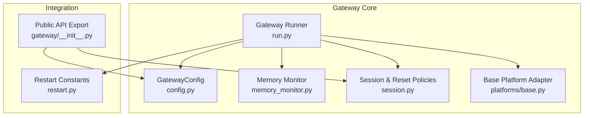
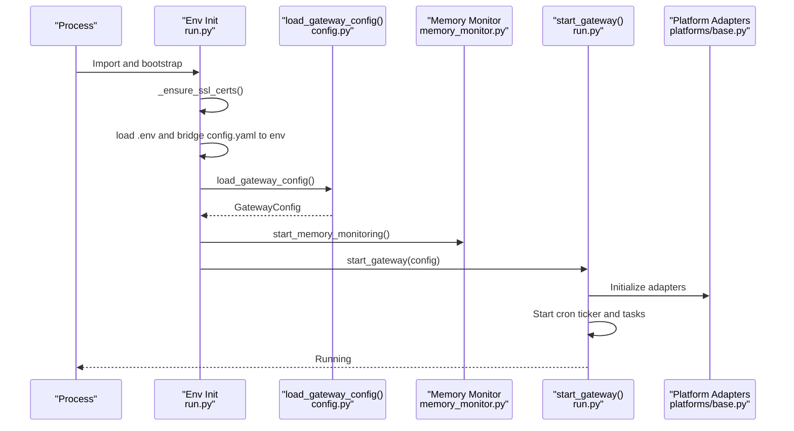
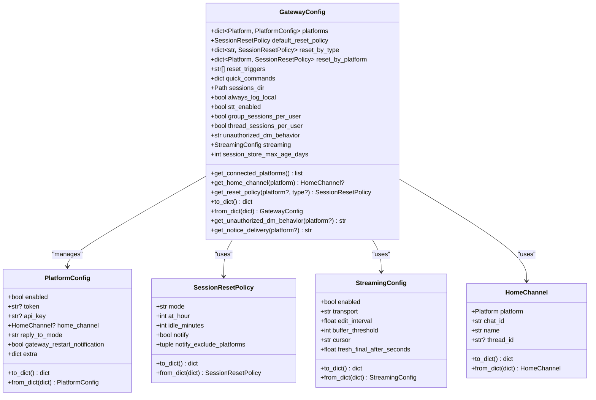
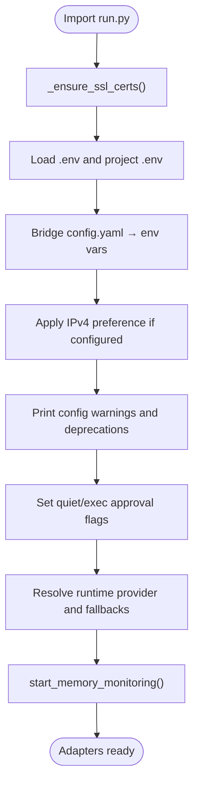
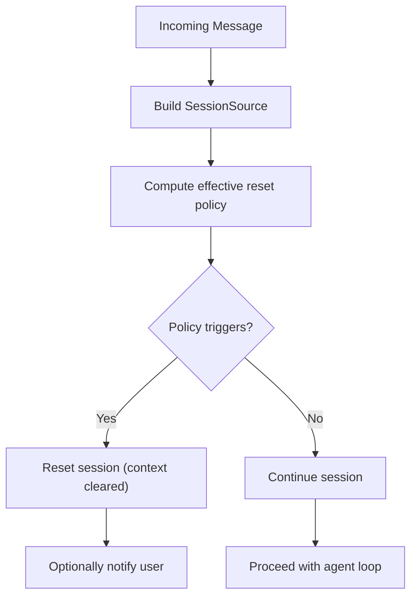
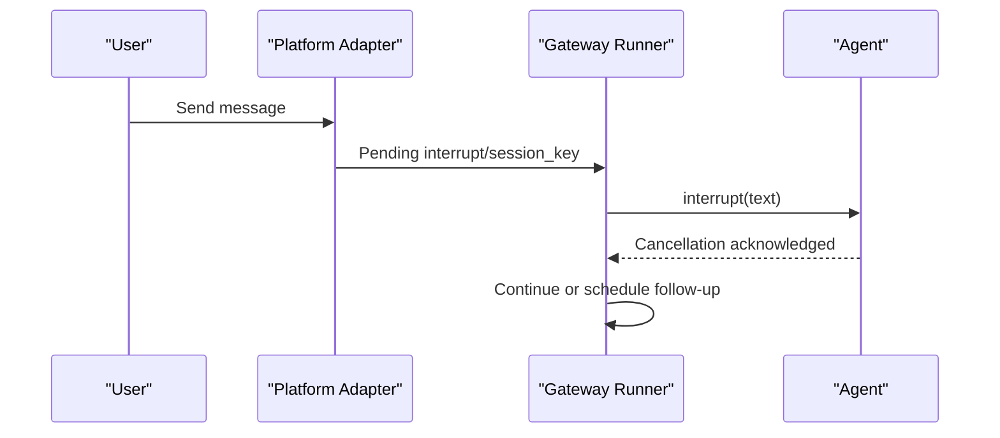
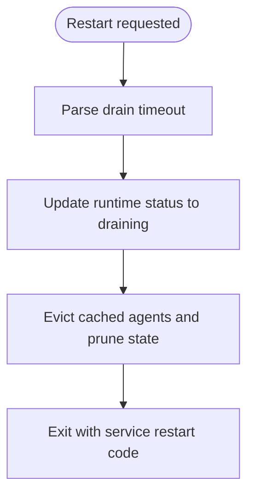
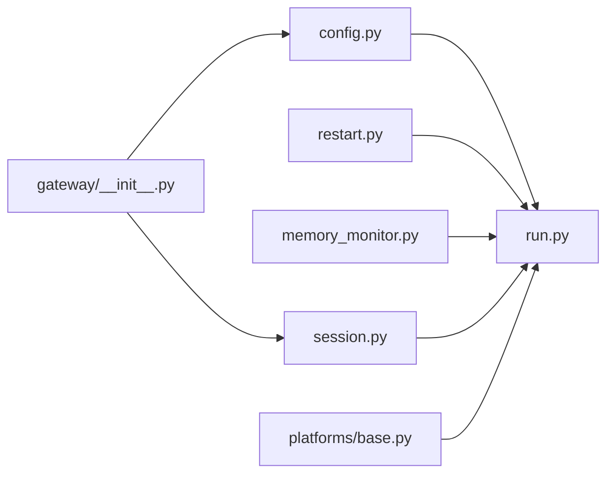

# Gateway Configuration

<cite>
**Referenced Files in This Document**
- [gateway/config.py](file://gateway/config.py)
- [gateway/run.py](file://gateway/run.py)
- [gateway/restart.py](file://gateway/restart.py)
- [gateway/memory_monitor.py](file://gateway/memory_monitor.py)
- [gateway/session.py](file://gateway/session.py)
- [gateway/platforms/base.py](file://gateway/platforms/base.py)
- [gateway/__init__.py](file://gateway/__init__.py)
</cite>

## Table of Contents
1. [Introduction](#introduction)
2. [Project Structure](#project-structure)
3. [Core Components](#core-components)
4. [Architecture Overview](#architecture-overview)
5. [Detailed Component Analysis](#detailed-component-analysis)
6. [Dependency Analysis](#dependency-analysis)
7. [Performance Considerations](#performance-considerations)
8. [Troubleshooting Guide](#troubleshooting-guide)
9. [Conclusion](#conclusion)
10. [Appendices](#appendices)

## Introduction
This document explains the Gateway Configuration and Lifecycle Management system. It covers how the gateway loads and validates configuration, initializes runtime environment and dependencies, manages sessions and resets, streams responses, monitors memory, and handles restarts and shutdowns. It also documents configuration file structure, environment variables, security and network settings, and operational monitoring.

## Project Structure
The gateway is organized around a central configuration model and a long-running runner that orchestrates platform adapters, session management, delivery routing, and maintenance tasks.

**Diagram sources**
- [gateway/config.py:1-1874](file://gateway/config.py#L1-L1874)
- [gateway/run.py:1-17236](file://gateway/run.py#L1-L17236)
- [gateway/memory_monitor.py:1-231](file://gateway/memory_monitor.py#L1-L231)
- [gateway/session.py:1-1399](file://gateway/session.py#L1-L1399)
- [gateway/platforms/base.py:1-3757](file://gateway/platforms/base.py#L1-L3757)
- [gateway/__init__.py:1-36](file://gateway/__init__.py#L1-L36)
- [gateway/restart.py:1-21](file://gateway/restart.py#L1-L21)

**Section sources**
- [gateway/__init__.py:12-35](file://gateway/__init__.py#L12-L35)

## Core Components
- GatewayConfig: Central configuration model for platforms, reset policies, streaming, and delivery preferences. Loads from config.yaml and environment variables, validates and normalizes values, and exposes helpers to compute effective settings per platform.
- PlatformConfig: Per-platform configuration including credentials, home channel, reply threading mode, and platform-specific extras.
- SessionResetPolicy: Defines daily/idle reset behavior and notification controls.
- StreamingConfig: Controls real-time token streaming behavior across platforms.
- Gateway Runner: Initializes environment, loads configuration, starts platform adapters, runs the main loop, and coordinates restarts and shutdowns.
- Memory Monitor: Periodically logs process memory usage for leak detection and diagnostics.
- Base Platform Adapter: Shared interface and utilities for platform-specific adapters.

**Section sources**
- [gateway/config.py:442-650](file://gateway/config.py#L442-L650)
- [gateway/config.py:280-336](file://gateway/config.py#L280-L336)
- [gateway/config.py:237-278](file://gateway/config.py#L237-L278)
- [gateway/config.py:348-401](file://gateway/config.py#L348-L401)
- [gateway/run.py:16792-17236](file://gateway/run.py#L16792-L17236)
- [gateway/memory_monitor.py:1-231](file://gateway/memory_monitor.py#L1-L231)
- [gateway/platforms/base.py:1-200](file://gateway/platforms/base.py#L1-L200)

## Architecture Overview
The gateway startup and runtime orchestration flow:

**Diagram sources**
- [gateway/run.py:307-623](file://gateway/run.py#L307-L623)
- [gateway/config.py:675-1167](file://gateway/config.py#L675-L1167)
- [gateway/memory_monitor.py:139-194](file://gateway/memory_monitor.py#L139-L194)
- [gateway/run.py:16792-16800](file://gateway/run.py#L16792-L16800)

## Detailed Component Analysis

### GatewayConfig: Configuration Model and Loading
GatewayConfig encapsulates:
- Platforms: keyed by Platform enum with PlatformConfig values
- Reset policies: default, by type, and by platform
- Quick commands and reset triggers
- Sessions directory and logging preferences
- STT enablement and session isolation controls
- Unauthorized DM behavior and streaming configuration
- Session store pruning age

Key behaviors:
- Platform connectivity detection using generic token/API key or platform-specific validators
- Effective policy resolution with precedence: platform override > type override > default
- YAML-to-internal mapping with deep merging of platform extras
- Environment variable overrides with explicit platform bridges
- Validation and sanitization (e.g., token placeholders, invalid reset policy bounds)

**Diagram sources**
- [gateway/config.py:442-650](file://gateway/config.py#L442-L650)
- [gateway/config.py:280-336](file://gateway/config.py#L280-L336)
- [gateway/config.py:237-278](file://gateway/config.py#L237-L278)
- [gateway/config.py:348-401](file://gateway/config.py#L348-L401)
- [gateway/config.py:202-235](file://gateway/config.py#L202-L235)

**Section sources**
- [gateway/config.py:442-650](file://gateway/config.py#L442-L650)
- [gateway/config.py:675-1167](file://gateway/config.py#L675-L1167)
- [gateway/config.py:1170-1237](file://gateway/config.py#L1170-L1237)
- [gateway/config.py:1239-1600](file://gateway/config.py#L1239-L1600)

### Startup and Environment Initialization
The runner performs:
- Early bootstrap: UTF-8 stdio setup, import ordering, and path adjustments
- SSL certificate auto-detection to ensure outbound HTTP requests succeed
- Load and merge environment: .env and project .env into the process environment
- Bridge config.yaml to environment variables for terminal, auxiliary, agent, display, timezone, and security settings
- Apply IPv4 preference if configured
- Print configuration warnings and deprecation checks
- Quiet mode and interactive exec approval flags
- Resolve runtime provider credentials and fallback providers
- Start memory monitoring and initialize adapters

**Diagram sources**
- [gateway/run.py:307-623](file://gateway/run.py#L307-L623)

**Section sources**
- [gateway/run.py:307-623](file://gateway/run.py#L307-L623)

### Platform Connectivity and Credentials
- Built-in platforms include Telegram, Discord, WhatsApp, Slack, Signal, Matrix, Mattermost, Home Assistant, Email, SMS, DingTalk, API Server, Webhook, Microsoft Graph Webhook, Feishu, WeCom, WeChat, Bluebubbles, QQBot, Yuanbao, and more.
- Credentials are supplied via:
  - config.yaml sections per platform (e.g., telegram:, discord:, whatsapp:)
  - Environment variables (e.g., TELEGRAM_BOT_TOKEN, DISCORD_BOT_TOKEN, WHATSAPP_ENABLED, TWILIO_ACCOUNT_SID)
  - Platform-specific extras (e.g., homeserver, device_id, encryption for Matrix; app_id/app_secret for Feishu; client_id/client_secret for DingTalk)
- Connectivity checks vary by platform; some rely on token/API key presence, others on dedicated fields (e.g., Signal http_url/account, WeCom bot_id).

**Section sources**
- [gateway/config.py:100-199](file://gateway/config.py#L100-L199)
- [gateway/config.py:404-440](file://gateway/config.py#L404-L440)
- [gateway/config.py:1239-1600](file://gateway/config.py#L1239-L1600)

### Session Management and Reset Policies
- SessionSource describes origin (platform, chat, user, thread, guild, etc.) and is used to build dynamic system prompts and route responses.
- SessionContext augments source with connected platforms, home channels, and metadata.
- Reset policies support:
  - Daily reset at a configurable hour
  - Idle reset after N minutes of inactivity
  - Combined “both” mode
  - Disabled “none” mode
- Effective reset policy resolution considers platform-specific overrides, type-specific overrides, and defaults.

**Diagram sources**
- [gateway/session.py:70-200](file://gateway/session.py#L70-L200)
- [gateway/config.py:540-559](file://gateway/config.py#L540-L559)

**Section sources**
- [gateway/session.py:70-200](file://gateway/session.py#L70-L200)
- [gateway/config.py:237-278](file://gateway/config.py#L237-L278)
- [gateway/config.py:540-559](file://gateway/config.py#L540-L559)

### Streaming and Real-time Delivery
- StreamingConfig controls:
  - Transport mode: auto/native draft/edit/off
  - Edit interval and buffer threshold
  - Cursor and final message behavior
- Transport selection prefers native draft updates when supported, falls back to progressive edits, and can disable streaming.

**Section sources**
- [gateway/config.py:348-401](file://gateway/config.py#L348-L401)

### Runtime Execution and Interrupt Handling
- The runner executes agent turns in a thread pool with inactivity-based timeouts and periodic “still working” notifications.
- Interrupts are detected from adapters and can preempt ongoing turns.
- Long-running tasks can be interrupted via commands or inactivity thresholds; the system logs diagnostics and attempts graceful cancellation.

**Diagram sources**
- [gateway/run.py:16074-16112](file://gateway/run.py#L16074-L16112)
- [gateway/run.py:16178-16274](file://gateway/run.py#L16178-L16274)

**Section sources**
- [gateway/run.py:16074-16112](file://gateway/run.py#L16074-L16112)
- [gateway/run.py:16178-16274](file://gateway/run.py#L16178-L16274)

### Restart and Shutdown Procedures
- Restart drain timeout is parsed from configuration with a shared default constant.
- The runner supports graceful draining and status updates during restarts.
- Exit codes can signal service managers to restart after a graceful drain.

**Diagram sources**
- [gateway/restart.py:14-21](file://gateway/restart.py#L14-L21)
- [gateway/run.py:16792-16800](file://gateway/run.py#L16792-L16800)

**Section sources**
- [gateway/restart.py:1-21](file://gateway/restart.py#L1-L21)
- [gateway/run.py:16792-16800](file://gateway/run.py#L16792-L16800)

### Memory Monitoring and Resource Management
- A background thread periodically logs RSS and GC statistics at a configurable interval.
- Supports baseline snapshot on start and final snapshot on stop.
- Graceful degradation when process RSS cannot be determined.

**Section sources**
- [gateway/memory_monitor.py:139-231](file://gateway/memory_monitor.py#L139-L231)

### Operational Monitoring and Maintenance
- Cron ticker runs maintenance tasks: channel directory refresh, image/document cache cleanup, paste sweeps, and periodic curator maintenance.
- Memory monitor provides structured logs for leak detection.

**Section sources**
- [gateway/run.py:16697-16790](file://gateway/run.py#L16697-L16790)
- [gateway/memory_monitor.py:1-231](file://gateway/memory_monitor.py#L1-L231)

## Dependency Analysis
The gateway composes several subsystems with clear boundaries:

**Diagram sources**
- [gateway/config.py:1-1874](file://gateway/config.py#L1-L1874)
- [gateway/run.py:1-17236](file://gateway/run.py#L1-L17236)
- [gateway/restart.py:1-21](file://gateway/restart.py#L1-L21)
- [gateway/memory_monitor.py:1-231](file://gateway/memory_monitor.py#L1-L231)
- [gateway/session.py:1-1399](file://gateway/session.py#L1-L1399)
- [gateway/platforms/base.py:1-3757](file://gateway/platforms/base.py#L1-L3757)
- [gateway/__init__.py:1-36](file://gateway/__init__.py#L1-L36)

**Section sources**
- [gateway/__init__.py:12-35](file://gateway/__init__.py#L12-L35)

## Performance Considerations
- Agent cache sizing and TTL are bounded to prevent unbounded growth in long-lived gateways.
- Streaming edit intervals and buffer thresholds are tuned for platform rate limits and responsiveness.
- IPv4 preference can be forced at startup to improve connectivity on certain networks.
- Memory monitoring helps detect slow leaks and informs tuning of cache sizes and pruning policies.

[No sources needed since this section provides general guidance]

## Troubleshooting Guide
Common startup and runtime issues:
- Empty or placeholder tokens: The loader warns and disables platforms with empty tokens and rejects known weak placeholders.
- SSL certificate issues: The runner ensures SSL_CERT_FILE is set using system defaults, certifi bundle, or common distro locations.
- Environment overrides: config.yaml is authoritative for terminal and agent settings; .env values are bridged but can be shadowed by config.yaml.
- Deprecations: The loader prints warnings for deprecated environment variables and suggests migration.
- Inactivity timeouts: The runner logs diagnostics and can send “still working” notifications; adjust agent.gateway_timeout and related settings to tune behavior.

Practical steps:
- Verify platform credentials in config.yaml or environment variables.
- Confirm SSL certificates are resolvable or set SSL_CERT_FILE explicitly.
- Use hermes doctor to diagnose configuration issues.
- Inspect memory monitor logs for RSS trends.

**Section sources**
- [gateway/config.py:1170-1237](file://gateway/config.py#L1170-L1237)
- [gateway/run.py:307-623](file://gateway/run.py#L307-L623)
- [gateway/memory_monitor.py:139-194](file://gateway/memory_monitor.py#L139-L194)

## Conclusion
The gateway’s configuration and lifecycle system is designed for reliability and operability in long-running deployments. GatewayConfig consolidates platform settings, reset policies, and streaming preferences, while the runner initializes environment, adapters, and maintenance tasks. Robust validation, environment bridging, memory monitoring, and restart/shutdown procedures provide strong operational foundations.

[No sources needed since this section summarizes without analyzing specific files]

## Appendices

### Configuration File Setup and Environment Variables
- Primary location: ~/.hermes/config.yaml
- Legacy fallback: ~/.hermes/gateway.json
- Environment: ~/.hermes/.env and project .env are loaded and bridged to environment variables
- Platform sections: telegram:, discord:, whatsapp:, slack:, signal:, matrix:, mattermost:, homeassistant:, email:, sms:, dingtalk:, webhook:, msgraph_webhook:, feishu:, wecom:, weixin:, bluebubbles:, qqbot:, yuanbao:
- Global settings: session_reset, quick_commands, stt, group_sessions_per_user, thread_sessions_per_user, unauthorized_dm_behavior, streaming, reset_triggers, always_log_local, sessions_dir

**Section sources**
- [gateway/config.py:675-1167](file://gateway/config.py#L675-L1167)
- [gateway/config.py:1239-1600](file://gateway/config.py#L1239-L1600)

### Security Configuration Options
- Redaction of secrets can be enabled via config.yaml security.redact_secrets
- Provider fallback chains can be configured to mitigate single-point auth failures
- TLS certificate handling is automatic with explicit fallbacks

**Section sources**
- [gateway/run.py:560-584](file://gateway/run.py#L560-L584)
- [gateway/run.py:687-757](file://gateway/run.py#L687-L757)

### Network Settings and Performance Tuning
- Force IPv4 preference via network.force_ipv4 in config.yaml
- Adjust agent.gateway_timeout, agent.gateway_notify_interval, and related environment variables to tune responsiveness and user feedback
- Streaming edit_interval and buffer_threshold can be tuned per platform

**Section sources**
- [gateway/run.py:585-592](file://gateway/run.py#L585-L592)
- [gateway/config.py:348-401](file://gateway/config.py#L348-L401)

### Practical Examples
- Telegram: set TELEGRAM_BOT_TOKEN or configure telegram.token in config.yaml; optionally set TELEGRAM_HOME_CHANNEL and reply threading mode
- Discord: set DISCORD_BOT_TOKEN or configure discord.token; customize require_mention and free_response_channels
- Matrix: set MATRIX_ACCESS_TOKEN or MATRIX_PASSWORD and MATRIX_HOMESERVER; enable encryption and device_id if needed
- SMS (Twilio): set TWILIO_ACCOUNT_SID and TWILIO_AUTH_TOKEN
- API Server: set API_SERVER_KEY and optional CORS origins, port, host, model name

**Section sources**
- [gateway/config.py:1239-1600](file://gateway/config.py#L1239-L1600)