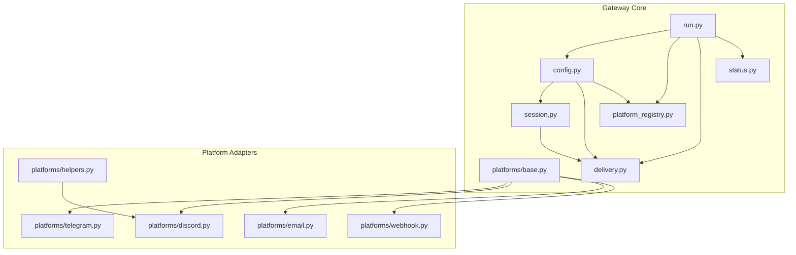
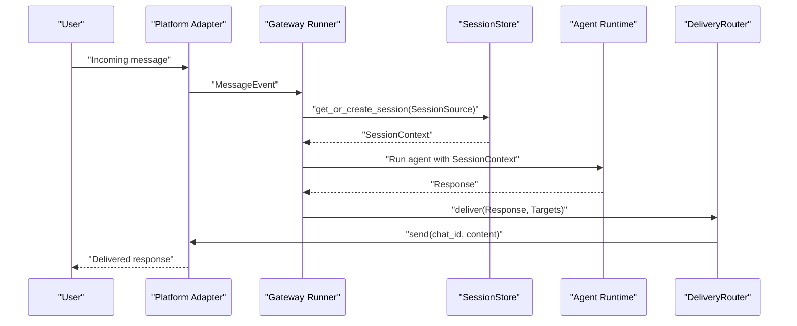
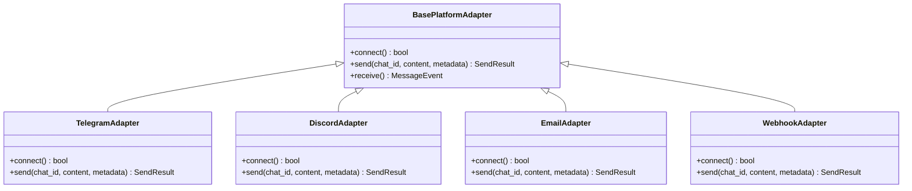
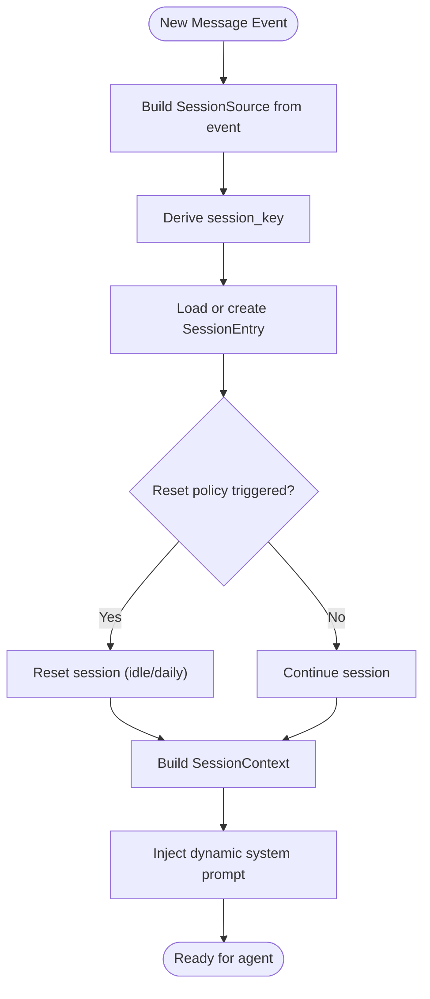
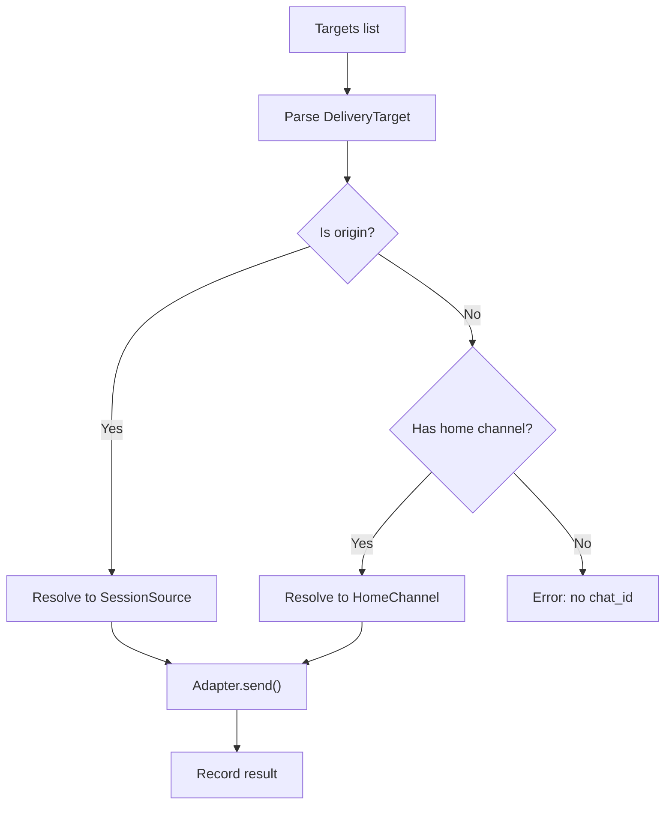
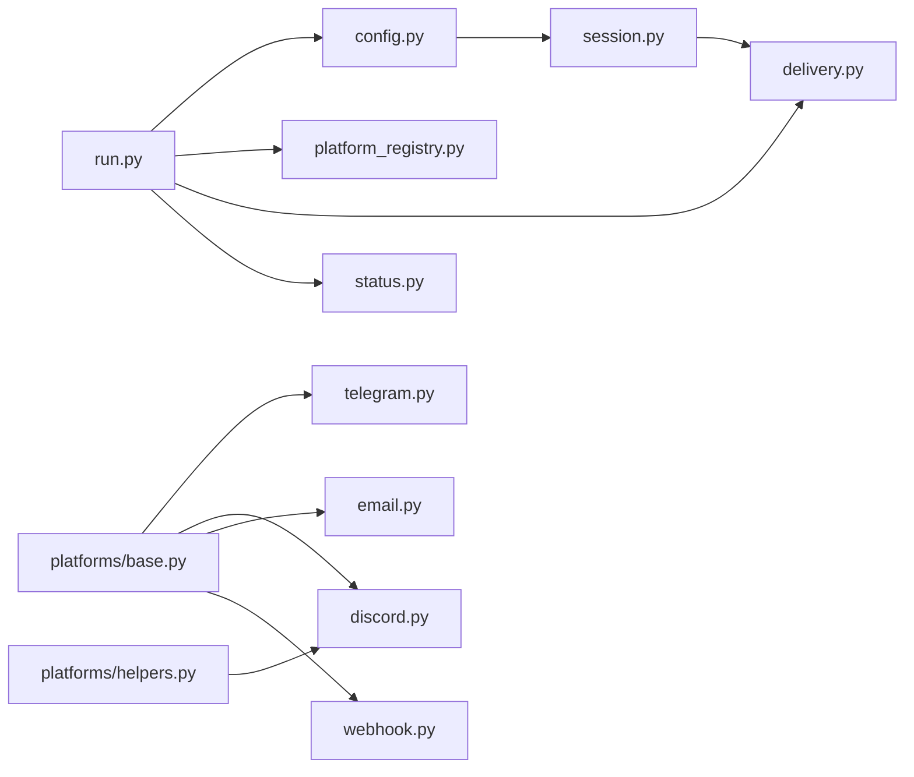
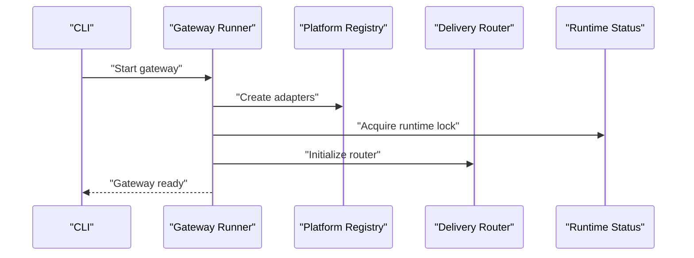

# Messaging Gateway

<cite>
**Referenced Files in This Document**
- [gateway/__init__.py](file://gateway/__init__.py)
- [gateway/config.py](file://gateway/config.py)
- [gateway/session.py](file://gateway/session.py)
- [gateway/platforms/base.py](file://gateway/platforms/base.py)
- [gateway/platforms/telegram.py](file://gateway/platforms/telegram.py)
- [gateway/platforms/discord.py](file://gateway/platforms/discord.py)
- [gateway/platforms/email.py](file://gateway/platforms/email.py)
- [gateway/platforms/webhook.py](file://gateway/platforms/webhook.py)
- [gateway/platforms/helpers.py](file://gateway/platforms/helpers.py)
- [gateway/delivery.py](file://gateway/delivery.py)
- [gateway/platform_registry.py](file://gateway/platform_registry.py)
- [gateway/status.py](file://gateway/status.py)
- [gateway/run.py](file://gateway/run.py)
</cite>

## Table of Contents
1. [Introduction](#introduction)
2. [Project Structure](#project-structure)
3. [Core Components](#core-components)
4. [Architecture Overview](#architecture-overview)
5. [Detailed Component Analysis](#detailed-component-analysis)
6. [Dependency Analysis](#dependency-analysis)
7. [Performance Considerations](#performance-considerations)
8. [Troubleshooting Guide](#troubleshooting-guide)
9. [Conclusion](#conclusion)
10. [Appendices](#appendices)

## Introduction
The Messaging Gateway provides a unified, extensible integration layer for multi-platform messaging systems. It standardizes how incoming messages are received, processed, and routed, and how outgoing responses are delivered consistently across platforms such as Telegram, Discord, Slack, WhatsApp, Signal, Email, and more. The system emphasizes:
- Adapter-based architecture for platform integration
- Persistent session management across platforms
- Delivery routing for cron jobs and agent responses
- Cross-platform session continuity and status monitoring
- Security, rate limiting, and scalability controls

## Project Structure
The gateway module organizes platform adapters, configuration, session management, delivery routing, and runtime status helpers. Key areas:
- gateway/config.py: Central configuration for platforms, reset policies, streaming, and delivery preferences
- gateway/session.py: Session modeling, key derivation, persistence, and context building
- gateway/platforms/base.py: Shared base adapter interface and utilities (media caching, proxy handling, message truncation)
- gateway/platforms/*.py: Platform-specific adapters (Telegram, Discord, Email, Webhook, etc.)
- gateway/delivery.py: Delivery routing and target resolution
- gateway/platform_registry.py: Plugin-driven registration and factory for platform adapters
- gateway/status.py: Runtime status and PID/lock management for the gateway daemon
- gateway/run.py: Gateway runner and lifecycle orchestration

**Diagram sources**
- [gateway/config.py:1-120](file://gateway/config.py#L1-L120)
- [gateway/session.py:1-120](file://gateway/session.py#L1-L120)
- [gateway/platforms/base.py:1-120](file://gateway/platforms/base.py#L1-L120)
- [gateway/delivery.py:1-120](file://gateway/delivery.py#L1-L120)
- [gateway/platform_registry.py:1-120](file://gateway/platform_registry.py#L1-L120)
- [gateway/status.py:1-120](file://gateway/status.py#L1-L120)
- [gateway/run.py:1-120](file://gateway/run.py#L1-L120)
- [gateway/platforms/telegram.py:1-120](file://gateway/platforms/telegram.py#L1-L120)
- [gateway/platforms/discord.py:1-120](file://gateway/platforms/discord.py#L1-L120)
- [gateway/platforms/email.py:1-120](file://gateway/platforms/email.py#L1-L120)
- [gateway/platforms/webhook.py:1-120](file://gateway/platforms/webhook.py#L1-L120)
- [gateway/platforms/helpers.py:1-120](file://gateway/platforms/helpers.py#L1-L120)

**Section sources**
- [gateway/__init__.py:1-36](file://gateway/__init__.py#L1-L36)
- [gateway/config.py:1-120](file://gateway/config.py#L1-L120)
- [gateway/session.py:1-120](file://gateway/session.py#L1-L120)
- [gateway/platforms/base.py:1-120](file://gateway/platforms/base.py#L1-L120)
- [gateway/delivery.py:1-120](file://gateway/delivery.py#L1-L120)
- [gateway/platform_registry.py:1-120](file://gateway/platform_registry.py#L1-L120)
- [gateway/status.py:1-120](file://gateway/status.py#L1-L120)
- [gateway/run.py:1-120](file://gateway/run.py#L1-L120)

## Core Components
- Configuration and Policies
  - Platform enumeration and configuration, home channels, reset policies, streaming, and delivery preferences
  - Dynamic platform registration for plugin adapters
- Session Management
  - SessionSource describes origin and routing context
  - SessionContext builds dynamic system prompt with platform hints and delivery options
  - SessionStore persists sessions and enforces reset policies
- Platform Adapters
  - BasePlatformAdapter defines the interface and shared utilities
  - Platform-specific adapters implement receive/send, threading, media handling, and platform-specific features
- Delivery Routing
  - DeliveryTarget parses explicit targets and resolves home channels
  - DeliveryRouter dispatches to adapters and saves local outputs
- Runtime Status
  - PID/lock management and runtime state for daemon supervision

**Section sources**
- [gateway/config.py:100-200](file://gateway/config.py#L100-L200)
- [gateway/session.py:70-200](file://gateway/session.py#L70-L200)
- [gateway/platforms/base.py:1-120](file://gateway/platforms/base.py#L1-L120)
- [gateway/delivery.py:28-120](file://gateway/delivery.py#L28-L120)
- [gateway/status.py:44-120](file://gateway/status.py#L44-L120)

## Architecture Overview
The gateway orchestrates platform adapters, manages sessions, and routes deliveries. Incoming events are transformed into MessageEvent objects and processed through session-aware handlers. Outgoing responses are sent via adapters or saved locally for cron jobs.

**Diagram sources**
- [gateway/run.py:1-120](file://gateway/run.py#L1-L120)
- [gateway/session.py:668-760](file://gateway/session.py#L668-L760)
- [gateway/delivery.py:129-170](file://gateway/delivery.py#L129-L170)

## Detailed Component Analysis

### Adapter Pattern and Platform Integration
The adapter pattern encapsulates platform differences behind a common interface:
- BasePlatformAdapter defines message/event types, send semantics, and shared utilities
- Platform adapters implement connect, receive, and send for their ecosystem
- Helpers centralize deduplication, batching, markdown stripping, and thread participation tracking

**Diagram sources**
- [gateway/platforms/base.py:1-120](file://gateway/platforms/base.py#L1-L120)
- [gateway/platforms/telegram.py:1-120](file://gateway/platforms/telegram.py#L1-L120)
- [gateway/platforms/discord.py:1-120](file://gateway/platforms/discord.py#L1-L120)
- [gateway/platforms/email.py:1-120](file://gateway/platforms/email.py#L1-L120)
- [gateway/platforms/webhook.py:1-120](file://gateway/platforms/webhook.py#L1-120)

**Section sources**
- [gateway/platforms/base.py:1-120](file://gateway/platforms/base.py#L1-L120)
- [gateway/platforms/helpers.py:27-164](file://gateway/platforms/helpers.py#L27-L164)
- [gateway/platforms/telegram.py:105-158](file://gateway/platforms/telegram.py#L105-L158)
- [gateway/platforms/discord.py:88-114](file://gateway/platforms/discord.py#L88-L114)
- [gateway/platforms/email.py:102-111](file://gateway/platforms/email.py#L102-L111)
- [gateway/platforms/webhook.py:93-96](file://gateway/platforms/webhook.py#L93-L96)

### Session Management Across Platforms
Session management ensures continuity and context:
- SessionSource captures origin metadata (platform, chat, user, thread, guild)
- SessionContext builds dynamic system prompt with platform notes and delivery options
- SessionStore persists sessions, enforces reset policies, and tracks token usage
- Session key derivation supports DMs, threads, and group isolation rules

**Diagram sources**
- [gateway/session.py:70-156](file://gateway/session.py#L70-L156)
- [gateway/session.py:231-422](file://gateway/session.py#L231-L422)
- [gateway/session.py:600-666](file://gateway/session.py#L600-L666)
- [gateway/session.py:668-800](file://gateway/session.py#L668-L800)

**Section sources**
- [gateway/session.py:70-156](file://gateway/session.py#L70-L156)
- [gateway/session.py:231-422](file://gateway/session.py#L231-L422)
- [gateway/session.py:600-666](file://gateway/session.py#L600-L666)
- [gateway/session.py:668-800](file://gateway/session.py#L668-L800)

### Message Routing and Delivery Mechanisms
Delivery routing supports:
- Explicit targets: platform:chat_id or platform:chat_id:thread_id
- Home channels: platform name resolves to configured home channel
- Origin delivery: back to the source chat
- Local delivery: saved to files under cron output directory

**Diagram sources**
- [gateway/delivery.py:46-107](file://gateway/delivery.py#L46-L107)
- [gateway/delivery.py:129-170](file://gateway/delivery.py#L129-L170)
- [gateway/delivery.py:226-255](file://gateway/delivery.py#L226-L255)

**Section sources**
- [gateway/delivery.py:28-120](file://gateway/delivery.py#L28-L120)
- [gateway/delivery.py:129-170](file://gateway/delivery.py#L129-L170)
- [gateway/delivery.py:226-255](file://gateway/delivery.py#L226-L255)

### Platform-Specific Features and Implementations
- Telegram
  - Uses python-telegram-bot; supports MarkdownV2 escaping, media caching, and Telegram-specific threading
  - Includes fallback transport and network utilities
- Discord
  - Uses discord.py; supports voice capture, allowed mentions, and thread participation tracking
- Email
  - IMAP polling and SMTP sending; automated sender detection and attachment handling
- Webhook
  - Generic webhook receiver with HMAC validation, rate limiting, idempotency, and dynamic routes

**Section sources**
- [gateway/platforms/telegram.py:105-200](file://gateway/platforms/telegram.py#L105-L200)
- [gateway/platforms/discord.py:88-150](file://gateway/platforms/discord.py#L88-L150)
- [gateway/platforms/email.py:91-120](file://gateway/platforms/email.py#L91-L120)
- [gateway/platforms/webhook.py:93-200](file://gateway/platforms/webhook.py#L93-L200)

### Authentication Flows and Webhook Handling
- Platform adapters implement platform-specific authentication checks and lazy installation helpers
- Webhook adapter validates HMAC secrets per route, enforces rate limits, and maintains idempotency caches
- Helpers provide shared deduplication and text batching across adapters

**Section sources**
- [gateway/platforms/telegram.py:105-158](file://gateway/platforms/telegram.py#L105-L158)
- [gateway/platforms/discord.py:88-114](file://gateway/platforms/discord.py#L88-L114)
- [gateway/platforms/webhook.py:145-200](file://gateway/platforms/webhook.py#L145-L200)
- [gateway/platforms/helpers.py:27-76](file://gateway/platforms/helpers.py#L27-L76)

### Cross-Platform Session Continuity and Status Monitoring
- SessionStore tracks session lifetimes and expiry; supports suspension and resume-pending states for gateway restarts
- Runtime status helpers manage PID files, runtime state, and scoped locks for multi-instance safety
- Gateway runner coordinates agent cache sizing, auto-continue freshness windows, and platform timeouts

**Section sources**
- [gateway/session.py:477-520](file://gateway/session.py#L477-L520)
- [gateway/session.py:752-789](file://gateway/session.py#L752-L789)
- [gateway/status.py:44-120](file://gateway/status.py#L44-L120)
- [gateway/status.py:421-454](file://gateway/status.py#L421-L454)
- [gateway/run.py:57-108](file://gateway/run.py#L57-L108)

## Dependency Analysis
The gateway relies on:
- hermes_cli.config for configuration and hermes constants for paths
- platform libraries (python-telegram-bot, discord.py, aiohttp) gated by availability checks
- SQLite-backed session storage with JSONL fallback
- Utilities for atomic file operations and lazy dependency installation

**Diagram sources**
- [gateway/run.py:1-120](file://gateway/run.py#L1-L120)
- [gateway/config.py:1-120](file://gateway/config.py#L1-L120)
- [gateway/platform_registry.py:1-120](file://gateway/platform_registry.py#L1-L120)
- [gateway/delivery.py:1-120](file://gateway/delivery.py#L1-L120)
- [gateway/status.py:1-120](file://gateway/status.py#L1-L120)
- [gateway/session.py:1-120](file://gateway/session.py#L1-L120)
- [gateway/platforms/base.py:1-120](file://gateway/platforms/base.py#L1-L120)
- [gateway/platforms/telegram.py:1-120](file://gateway/platforms/telegram.py#L1-L120)
- [gateway/platforms/discord.py:1-120](file://gateway/platforms/discord.py#L1-L120)
- [gateway/platforms/email.py:1-120](file://gateway/platforms/email.py#L1-L120)
- [gateway/platforms/webhook.py:1-120](file://gateway/platforms/webhook.py#L1-L120)
- [gateway/platforms/helpers.py:1-120](file://gateway/platforms/helpers.py#L1-L120)

**Section sources**
- [gateway/run.py:1-120](file://gateway/run.py#L1-L120)
- [gateway/config.py:1-120](file://gateway/config.py#L1-L120)
- [gateway/platform_registry.py:1-120](file://gateway/platform_registry.py#L1-L120)
- [gateway/delivery.py:1-120](file://gateway/delivery.py#L1-L120)
- [gateway/status.py:1-120](file://gateway/status.py#L1-L120)
- [gateway/session.py:1-120](file://gateway/session.py#L1-L120)
- [gateway/platforms/base.py:1-120](file://gateway/platforms/base.py#L1-L120)
- [gateway/platforms/telegram.py:1-120](file://gateway/platforms/telegram.py#L1-L120)
- [gateway/platforms/discord.py:1-120](file://gateway/platforms/discord.py#L1-L120)
- [gateway/platforms/email.py:1-120](file://gateway/platforms/email.py#L1-L120)
- [gateway/platforms/webhook.py:1-120](file://gateway/platforms/webhook.py#L1-L120)
- [gateway/platforms/helpers.py:1-120](file://gateway/platforms/helpers.py#L1-L120)

## Performance Considerations
- Streaming configuration controls progressive edits and draft-based updates to reduce rate-limit pressure
- Text batching aggregates rapid-fire messages to minimize send operations
- Media caching reduces repeated downloads and improves reliability for vision and STT tools
- Session cache bounds and idle TTL eviction prevent unbounded growth in long-running gateways
- Platform-specific rate limiting and idempotency guard against provider throttling and retries

[No sources needed since this section provides general guidance]

## Troubleshooting Guide
Common issues and remedies:
- Platform not connected
  - Verify token/api_key presence and platform-specific checks in configuration
  - Use platform requirement checks to confirm dependencies are installed
- Delivery failures
  - Check DeliveryTarget resolution and adapter availability
  - Inspect local output directory for saved cron outputs
- Session resets unexpectedly
  - Review reset policies (idle/daily) and session store pruning settings
  - Confirm session key derivation for DMs, threads, and group isolation
- Runtime conflicts
  - Check PID file and runtime lock ownership
  - Use scoped locks to prevent multiple gateways from sharing the same identity

**Section sources**
- [gateway/config.py:499-532](file://gateway/config.py#L499-L532)
- [gateway/platforms/telegram.py:105-158](file://gateway/platforms/telegram.py#L105-L158)
- [gateway/platforms/discord.py:88-114](file://gateway/platforms/discord.py#L88-L114)
- [gateway/delivery.py:129-170](file://gateway/delivery.py#L129-L170)
- [gateway/session.py:752-789](file://gateway/session.py#L752-L789)
- [gateway/status.py:421-454](file://gateway/status.py#L421-L454)
- [gateway/status.py:578-679](file://gateway/status.py#L578-L679)

## Conclusion
The Messaging Gateway offers a robust, extensible foundation for multi-platform messaging. Its adapter-based design, persistent session management, and delivery routing enable seamless integration across diverse ecosystems while maintaining security, scalability, and operational visibility.

[No sources needed since this section summarizes without analyzing specific files]

## Appendices

### Practical Setup Examples
- Enable a platform
  - Add platform entry in configuration with token/api_key or platform-specific settings
  - Use platform requirement checks to ensure dependencies are installed
- Configure home channels
  - Define HomeChannel for each platform to establish default delivery destinations
- Configure streaming
  - Adjust streaming transport and thresholds per platform’s capabilities
- Webhook routes
  - Define HMAC secrets and event filters; optionally enable deliver_only for direct notifications

**Section sources**
- [gateway/config.py:202-235](file://gateway/config.py#L202-L235)
- [gateway/config.py:348-401](file://gateway/config.py#L348-L401)
- [gateway/platforms/webhook.py:93-200](file://gateway/platforms/webhook.py#L93-L200)

### Relationship Between Gateway and Agent Runtime
- Gateway runner initializes configuration, adapters, and runtime state
- SessionStore provides context-aware session keys and reset policies
- DeliveryRouter resolves targets and dispatches outputs to adapters or local storage
- Status helpers maintain runtime health and daemon coordination

**Diagram sources**
- [gateway/run.py:1-120](file://gateway/run.py#L1-L120)
- [gateway/platform_registry.py:208-257](file://gateway/platform_registry.py#L208-L257)
- [gateway/delivery.py:129-170](file://gateway/delivery.py#L129-L170)
- [gateway/status.py:421-454](file://gateway/status.py#L421-L454)