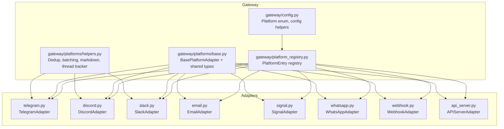
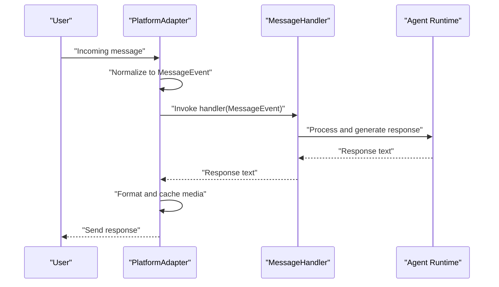
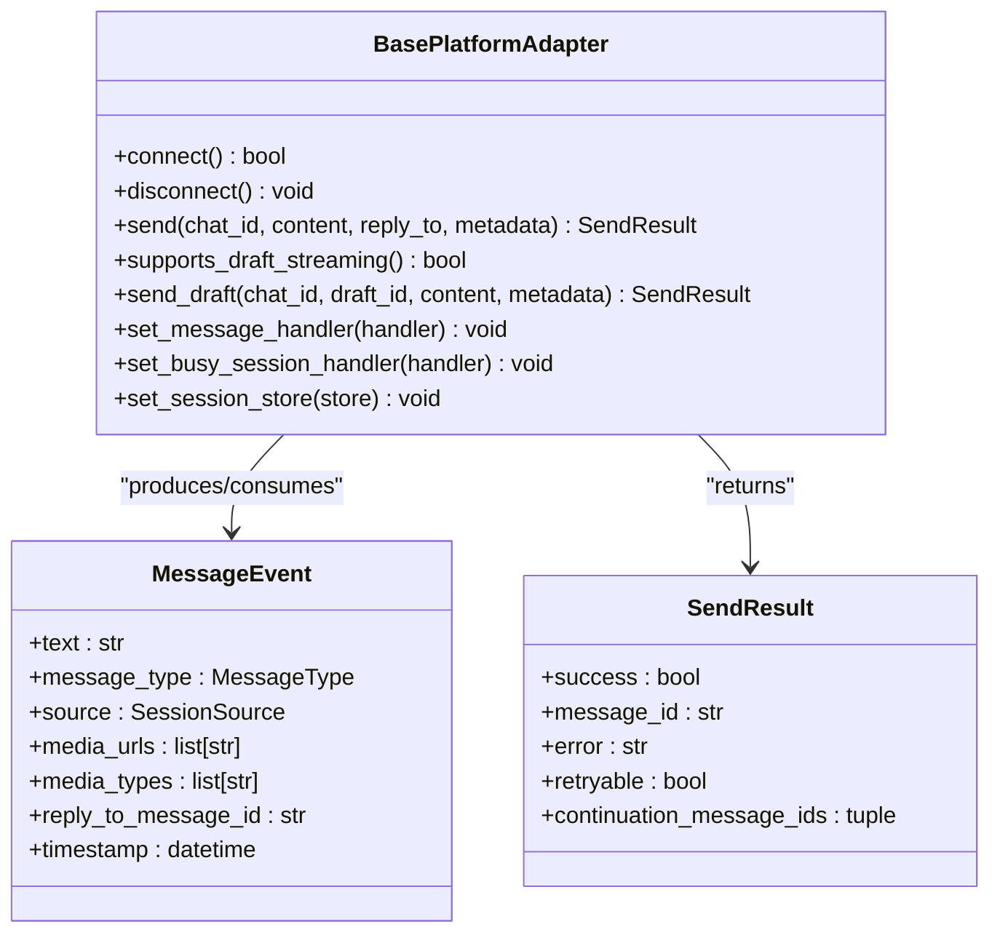
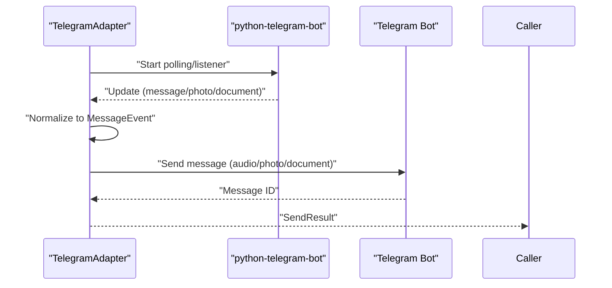
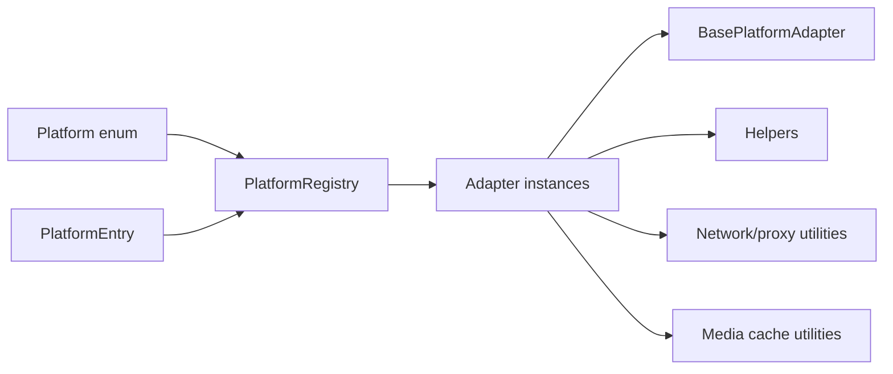

# Platform Adapters

<cite>
**Referenced Files in This Document**
- [base.py](file://gateway/platforms/base.py)
- [__init__.py](file://gateway/platforms/__init__.py)
- [helpers.py](file://gateway/platforms/helpers.py)
- [telegram.py](file://gateway/platforms/telegram.py)
- [discord.py](file://gateway/platforms/discord.py)
- [slack.py](file://gateway/platforms/slack.py)
- [email.py](file://gateway/platforms/email.py)
- [signal.py](file://gateway/platforms/signal.py)
- [whatsapp.py](file://gateway/platforms/whatsapp.py)
- [webhook.py](file://gateway/platforms/webhook.py)
- [telegram_network.py](file://gateway/platforms/telegram_network.py)
- [config.py](file://gateway/config.py)
- [platform_registry.py](file://gateway/platform_registry.py)
- [api_server.py](file://gateway/platforms/api_server.py)
</cite>

## Table of Contents
1. [Introduction](#introduction)
2. [Project Structure](#project-structure)
3. [Core Components](#core-components)
4. [Architecture Overview](#architecture-overview)
5. [Detailed Component Analysis](#detailed-component-analysis)
6. [Dependency Analysis](#dependency-analysis)
7. [Performance Considerations](#performance-considerations)
8. [Troubleshooting Guide](#troubleshooting-guide)
9. [Conclusion](#conclusion)
10. [Appendices](#appendices)

## Introduction
This document explains the Platform Adapter system that powers multi-platform messaging integration in the gateway. It covers the adapter pattern architecture, the BasePlatformAdapter contract, platform-specific implementations, authentication flows, message/media processing, and the relationship to the core gateway runtime. It also addresses security, rate limiting, and scaling considerations for multi-platform operations.

## Project Structure
The platform adapters live under gateway/platforms and share a common base and helper utilities. Each platform provides its own adapter class that inherits from BasePlatformAdapter and implements platform-specific logic for connecting, receiving, sending, and processing messages.

**Diagram sources**
- [config.py:100-199](file://gateway/config.py#L100-L199)
- [platform_registry.py:162-257](file://gateway/platform_registry.py#L162-L257)
- [base.py:1268-1599](file://gateway/platforms/base.py#L1268-L1599)
- [helpers.py:27-279](file://gateway/platforms/helpers.py#L27-L279)
- [telegram.py:1-200](file://gateway/platforms/telegram.py#L1-L200)
- [discord.py:1-200](file://gateway/platforms/discord.py#L1-L200)
- [slack.py:1-200](file://gateway/platforms/slack.py#L1-L200)
- [email.py:1-200](file://gateway/platforms/email.py#L1-L200)
- [signal.py:1-200](file://gateway/platforms/signal.py#L1-L200)
- [whatsapp.py:1-200](file://gateway/platforms/whatsapp.py#L1-L200)
- [webhook.py:1-200](file://gateway/platforms/webhook.py#L1-L200)
- [api_server.py:631-763](file://gateway/platforms/api_server.py#L631-L763)

**Section sources**
- [__init__.py:1-46](file://gateway/platforms/__init__.py#L1-L46)
- [config.py:100-199](file://gateway/config.py#L100-L199)
- [platform_registry.py:162-257](file://gateway/platform_registry.py#L162-L257)

## Core Components
- BasePlatformAdapter: Defines the abstract interface and shared utilities for all platform adapters. It specifies connect(), disconnect(), send(), and optional streaming/editing hooks. It also provides helpers for media caching, deduplication, batching, markdown stripping, and thread participation tracking.
- MessageEvent and SendResult: Standardized event and response types used across adapters.
- Platform enum and configuration: Centralized platform identification and configuration helpers.
- PlatformEntry and registry: Mechanism for built-in and plugin adapters to register themselves and be instantiated by the gateway.

Key responsibilities:
- Unified interface for connecting, receiving, sending, and editing messages.
- Platform-specific normalization of incoming events and outgoing responses.
- Media handling and caching for images, audio, video, and documents.
- Shared helpers for deduplication, text batching, and thread participation.

**Section sources**
- [base.py:897-1093](file://gateway/platforms/base.py#L897-L1093)
- [base.py:1268-1599](file://gateway/platforms/base.py#L1268-L1599)
- [config.py:100-199](file://gateway/config.py#L100-L199)
- [platform_registry.py:38-161](file://gateway/platform_registry.py#L38-L161)

## Architecture Overview
The gateway loads platform configurations, consults the registry, and instantiates adapters. Each adapter manages its own connection and event loop, normalizes incoming messages into MessageEvent, and invokes the configured message handler. Outgoing messages are normalized and sent via platform-specific APIs, with optional streaming and editing support.

**Diagram sources**
- [base.py:1518-1575](file://gateway/platforms/base.py#L1518-L1575)
- [telegram.py:1-200](file://gateway/platforms/telegram.py#L1-L200)
- [discord.py:1-200](file://gateway/platforms/discord.py#L1-L200)
- [slack.py:1-200](file://gateway/platforms/slack.py#L1-L200)

## Detailed Component Analysis

### BasePlatformAdapter and Shared Utilities
- Abstract methods: connect(), disconnect(), send().
- Optional streaming/editing: supports_draft_streaming(), send_draft(), REQUIRES_EDIT_FINALIZE.
- Message handling: set_message_handler(), set_busy_session_handler(), set_session_store().
- Media caching: cache_image_from_bytes/url, cache_audio_from_bytes/url, cache_video_from_bytes, cache_document_from_bytes.
- Helpers: MessageDeduplicator, TextBatchAggregator, strip_markdown, ThreadParticipationTracker.
- Security and networking: safe_url_for_log, SSRF redirect guard, proxy resolution, Telegram fallback transport.

**Diagram sources**
- [base.py:1268-1599](file://gateway/platforms/base.py#L1268-L1599)
- [base.py:918-1002](file://gateway/platforms/base.py#L918-L1002)
- [base.py:1040-1054](file://gateway/platforms/base.py#L1040-L1054)

**Section sources**
- [base.py:897-1093](file://gateway/platforms/base.py#L897-L1093)
- [base.py:1268-1599](file://gateway/platforms/base.py#L1268-L1599)
- [helpers.py:27-279](file://gateway/platforms/helpers.py#L27-L279)

### Telegram Adapter
- Uses python-telegram-bot for receiving/sending and media handling.
- MarkdownV2 escaping and stripping helpers.
- Telegram-specific network fallback transport to handle unreachable api.telegram.org endpoints.
- Message normalization, media caching, and thread metadata handling.

Authentication:
- Uses bot token via environment variables.
- Optional proxy support via TELEGRAM_PROXY or system proxy detection.

Message processing:
- Escapes/converts MarkdownV2.
- Handles photos, documents, stickers, voice, audio, and video.
- Supports DM topics and reply anchoring.

**Diagram sources**
- [telegram.py:1-200](file://gateway/platforms/telegram.py#L1-L200)
- [telegram_network.py:52-120](file://gateway/platforms/telegram_network.py#L52-L120)

**Section sources**
- [telegram.py:1-200](file://gateway/platforms/telegram.py#L1-L200)
- [telegram_network.py:1-200](file://gateway/platforms/telegram_network.py#L1-L200)

### Discord Adapter
- Uses discord.py for receiving/sending, threads, and slash commands.
- Voice receiver for capturing voice audio from voice channels.
- Allowed mentions configuration and safety defaults.
- Message deduplication and thread participation tracking.

Authentication:
- Uses bot token via environment variables.
- Optional proxy support.

Message processing:
- Rich text blocks extraction and quoting preservation.
- Thread support and auto-archive minutes configuration.

**Section sources**
- [discord.py:1-200](file://gateway/platforms/discord.py#L1-L200)
- [helpers.py:27-164](file://gateway/platforms/helpers.py#L27-L164)

### Slack Adapter
- Uses slack-bolt with Socket Mode for receiving/sending and slash commands.
- ContextVar for slash-command user context propagation.
- Thread context caching and rich text rendering.

Authentication:
- Uses app-level token and signing secret via environment variables.

Message processing:
- Extracts readable text from Block Kit blocks, including quotes and code blocks.
- Thread support and slash command routing.

**Section sources**
- [slack.py:1-200](file://gateway/platforms/slack.py#L1-L200)
- [helpers.py:27-164](file://gateway/platforms/helpers.py#L27-L164)

### Email Adapter
- Uses IMAP to receive and SMTP to send messages.
- Automated sender detection and header-based suppression.
- Text/html body extraction and attachment handling.

Authentication:
- EMAIL_ADDRESS, EMAIL_PASSWORD, EMAIL_IMAP_HOST/PORT, EMAIL_SMTP_HOST/PORT.

Message processing:
- RFC 2047 header decoding.
- HTML-to-text fallback and naive tag stripping.
- Attachment caching and inline image detection.

**Section sources**
- [email.py:1-200](file://gateway/platforms/email.py#L1-L200)

### Signal Adapter
- Connects to signal-cli daemon via HTTP (SSE for inbound, JSON-RPC for outbound).
- Rate limiting and scheduler integration.
- Mention placeholder replacement and extension guessing.

Authentication:
- SIGNAL_HTTP_URL and SIGNAL_ACCOUNT environment variables.

Message processing:
- SSE streaming for inbound messages.
- Typing indicators and health checks.
- Attachment handling and size limits.

**Section sources**
- [signal.py:1-200](file://gateway/platforms/signal.py#L1-L200)
- [helpers.py:268-279](file://gateway/platforms/helpers.py#L268-L279)

### WhatsApp Adapter
- Supports multiple backends (Business API, whatsapp-web.js, Baileys).
- Bridge process management with PID file cleanup and termination.
- Cross-platform process tree killing and port conflict handling.

Authentication:
- Depends on backend-specific configuration (Node.js bridge, tokens).

Message processing:
- Bridges platform-specific payloads to MessageEvent.
- Media caching and document handling.

**Section sources**
- [whatsapp.py:1-200](file://gateway/platforms/whatsapp.py#L1-L200)

### Webhook Adapter
- Generic webhook receiver with HMAC signature validation.
- Route-based configuration with secrets, prompt templates, and delivery targets.
- Idempotency cache and rate limiting.

Authentication:
- HMAC secret per route (required) or global secret.
- Optional INSECURE_NO_AUTH for local testing only.

Message processing:
- Validates signatures, transforms payloads into prompts, and optionally invokes agent.
- Supports direct delivery to other platforms.

**Section sources**
- [webhook.py:1-200](file://gateway/platforms/webhook.py#L1-L200)

### API Server Adapter
- Exposes OpenAI-compatible endpoints (chat completions, responses, runs, health).
- CORS and security headers middleware.
- SQLite-backed response store for stateful responses.
- Idempotency cache and request body size limits.

Authentication:
- Optional Bearer token via API_SERVER_KEY.

Message processing:
- Normalizes multimodal content (text and images).
- Streaming SSE for runs and approvals.

**Section sources**
- [api_server.py:631-763](file://gateway/platforms/api_server.py#L631-L763)

## Dependency Analysis
- Platform discovery and instantiation:
  - Platform enum enumerates built-in platforms and allows dynamic plugin platforms.
  - PlatformEntry describes platform metadata, factory, requirements, and validation.
  - PlatformRegistry registers entries and creates adapters with validation and hints.
- Adapter dependencies:
  - All adapters depend on BasePlatformAdapter and shared helpers.
  - Some adapters depend on third-party libraries (e.g., telegram, discord, slack, aiohttp).
  - Telegram has a specialized fallback transport for network reachability.
- Configuration:
  - PlatformConfig drives adapter construction and environment variable overrides.
  - Helper functions coerce booleans, floats, integers, and normalize values.

**Diagram sources**
- [config.py:100-199](file://gateway/config.py#L100-L199)
- [platform_registry.py:162-257](file://gateway/platform_registry.py#L162-L257)
- [base.py:1268-1599](file://gateway/platforms/base.py#L1268-L1599)
- [helpers.py:27-279](file://gateway/platforms/helpers.py#L27-L279)
- [telegram_network.py:52-120](file://gateway/platforms/telegram_network.py#L52-L120)

**Section sources**
- [config.py:100-199](file://gateway/config.py#L100-L199)
- [platform_registry.py:162-257](file://gateway/platform_registry.py#L162-L257)
- [base.py:1268-1599](file://gateway/platforms/base.py#L1268-L1599)

## Performance Considerations
- Media caching: Images, audio, video, and documents are cached locally to avoid platform URL expiration and to enable tool access. Cleanup routines remove stale files periodically.
- Text batching: Rapid-fire text events can be aggregated to reduce API churn.
- Deduplication: TTL-based deduplication prevents processing duplicate messages.
- Streaming and editing: Optional draft streaming reduces perceived latency; adapters can choose whether to finalize edits.
- Network resilience: Telegram fallback transport and proxy resolution improve connectivity in restricted networks.
- Backpressure and rate limiting: Webhook adapter includes rate limiting and idempotency; Signal adapter includes rate-limit handling and pacing.

[No sources needed since this section provides general guidance]

## Troubleshooting Guide
Common issues and resolutions:
- Authentication failures:
  - Telegram: Ensure bot token is set and reachable via TELEGRAM_PROXY if needed.
  - Discord: Verify bot token and required intents; check allowed mentions configuration.
  - Slack: Confirm app-level token and signing secret; ensure Socket Mode is enabled.
  - Email: Validate IMAP/SMTP host/port/credentials; ensure automated sender suppression is configured.
  - Signal: Confirm SIGNAL_HTTP_URL and SIGNAL_ACCOUNT; verify daemon is running.
  - Webhook: Provide HMAC secret per route; avoid INSECURE_NO_AUTH on non-loopback binds.
- Network connectivity:
  - Telegram fallback transport and DOH resolution help when api.telegram.org is unreachable.
  - Proxy environment variables and macOS system proxy detection are supported.
- Message handling:
  - Deduplication and text batching reduce duplicate processing and API pressure.
  - Markdown stripping for plain-text platforms ensures compatibility.
- Rate limiting and retries:
  - Webhook adapter applies fixed-window rate limiting and idempotency.
  - Signal adapter implements retry scheduling and pacing thresholds.
  - BasePlatformAdapter marks retryable errors and supports automatic retries for transient failures.

**Section sources**
- [telegram_network.py:52-120](file://gateway/platforms/telegram_network.py#L52-L120)
- [helpers.py:27-164](file://gateway/platforms/helpers.py#L27-L164)
- [webhook.py:145-200](file://gateway/platforms/webhook.py#L145-L200)
- [signal.py:1-200](file://gateway/platforms/signal.py#L1-L200)
- [base.py:1157-1174](file://gateway/platforms/base.py#L1157-L1174)

## Conclusion
The Platform Adapter system provides a robust, extensible foundation for integrating diverse messaging platforms. By adhering to a unified interface and leveraging shared utilities, adapters can implement platform-specific authentication, message processing, and media handling while maintaining consistent behavior across the gateway runtime. The registry and configuration mechanisms enable both built-in and plugin adapters to be seamlessly integrated and managed.

[No sources needed since this section summarizes without analyzing specific files]

## Appendices

### Practical Setup Examples
- Telegram
  - Install dependencies and configure bot token.
  - Optionally set TELEGRAM_PROXY for restricted networks.
  - Enable DM topics and thread metadata as needed.
- Discord
  - Configure bot token and intents.
  - Set allowed mentions to safe defaults.
  - Enable voice receiver if voice input is required.
- Slack
  - Configure app-level token and signing secret.
  - Enable Socket Mode and slash commands.
  - Use thread context caching for richer conversations.
- Email
  - Configure IMAP/SMTP settings and credentials.
  - Set automated sender patterns to suppress bounce/notifications.
- Signal
  - Run signal-cli daemon in HTTP mode.
  - Configure SIGNAL_HTTP_URL and SIGNAL_ACCOUNT.
  - Monitor rate limits and adjust pacing.
- Webhook
  - Define routes with HMAC secrets.
  - Choose deliver targets and prompt templates.
  - Apply rate limiting and idempotency settings.
- API Server
  - Configure host/port and optional API key.
  - Enable CORS origins as needed.
  - Use SSE for run streaming and approvals.

[No sources needed since this section provides general guidance]