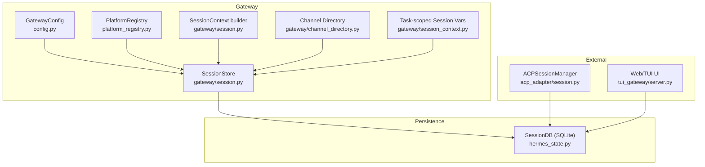
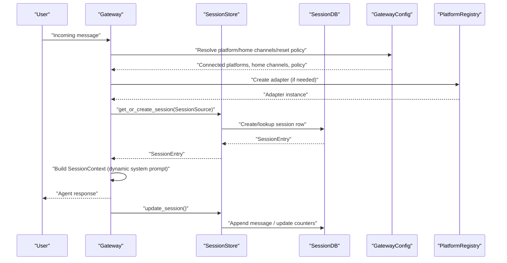
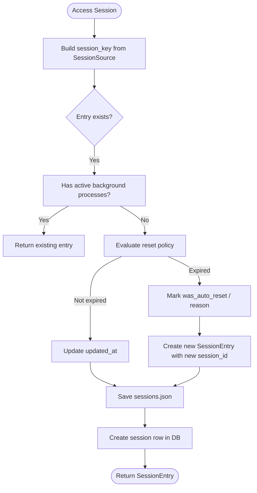
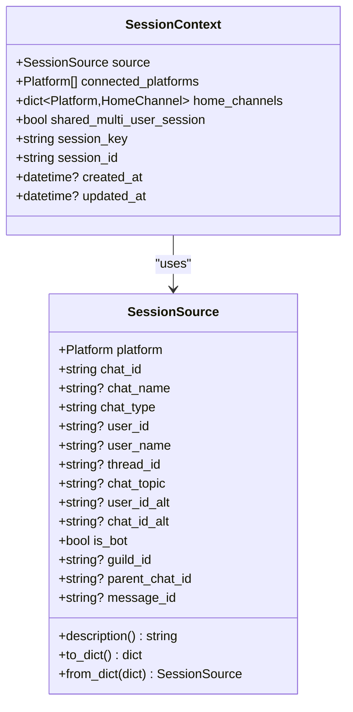
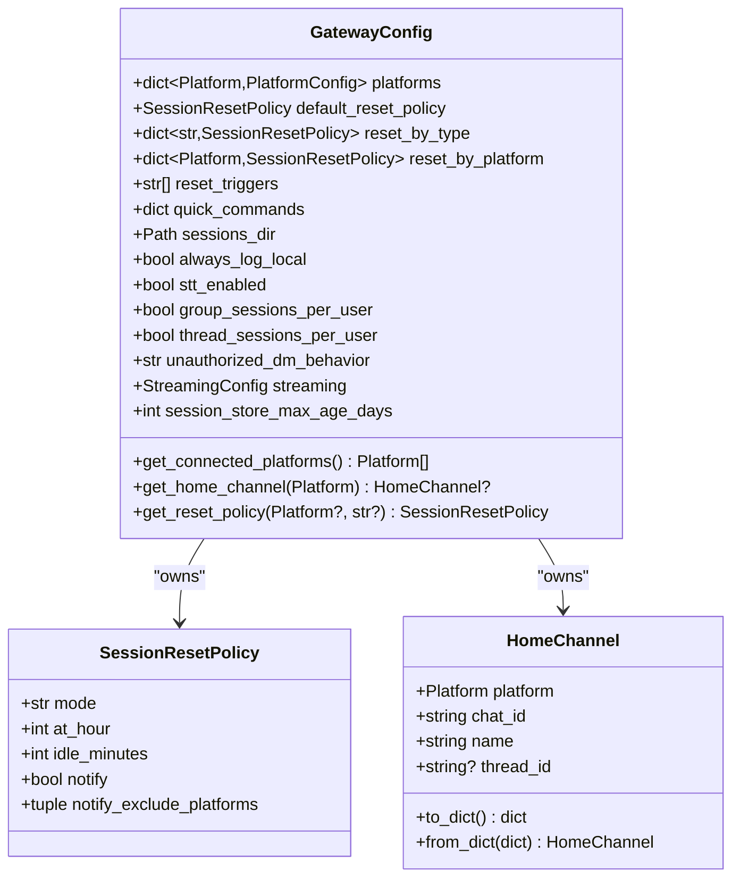
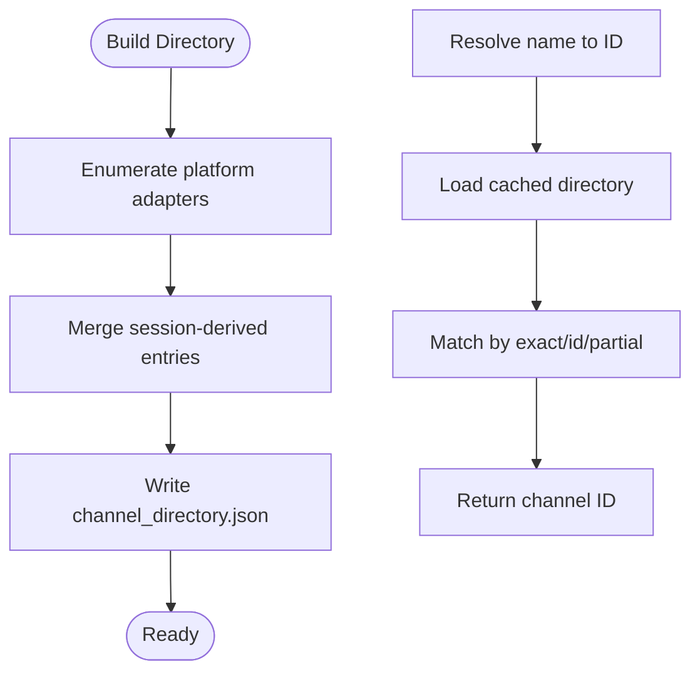
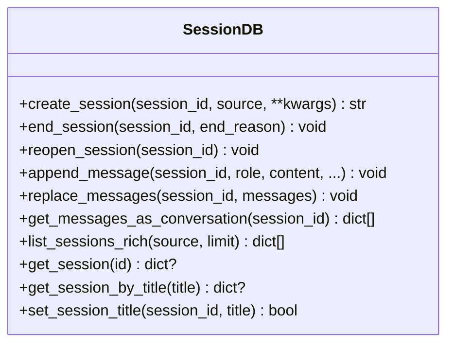
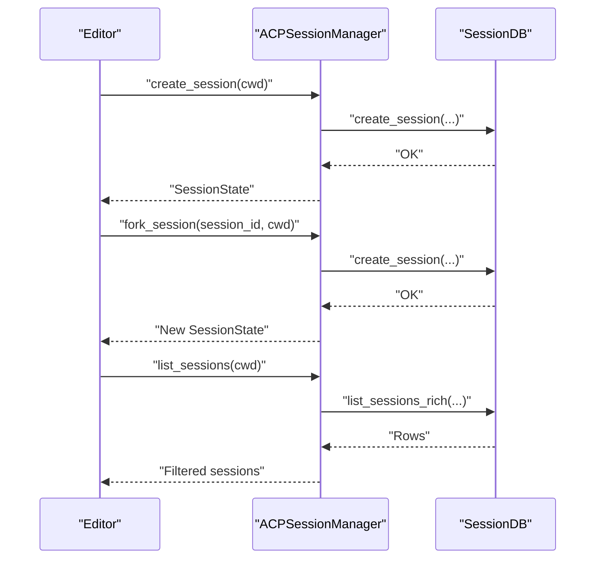
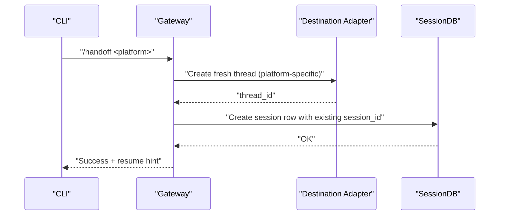
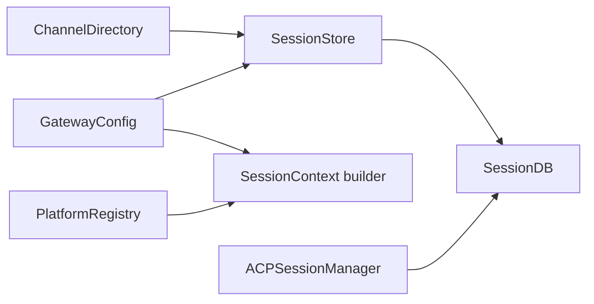

# Session Management

<cite>
**Referenced Files in This Document**
- [gateway/session.py](file://gateway/session.py)
- [gateway/session_context.py](file://gateway/session_context.py)
- [gateway/config.py](file://gateway/config.py)
- [gateway/channel_directory.py](file://gateway/channel_directory.py)
- [gateway/platform_registry.py](file://gateway/platform_registry.py)
- [hermes_state.py](file://hermes_state.py)
- [acp_adapter/session.py](file://acp_adapter/session.py)
- [website/docs/user-guide/sessions.md](file://website/docs/user-guide/sessions.md)
- [tests/gateway/test_session_store_prune.py](file://tests/gateway/test_session_store_prune.py)
- [tests/gateway/test_session_reset_notify.py](file://tests/gateway/test_session_reset_notify.py)
- [tui_gateway/server.py](file://tui_gateway/server.py)
- [tools/session_search_tool.py](file://tools/session_search_tool.py)
</cite>

## Table of Contents
1. [Introduction](#introduction)
2. [Project Structure](#project-structure)
3. [Core Components](#core-components)
4. [Architecture Overview](#architecture-overview)
5. [Detailed Component Analysis](#detailed-component-analysis)
6. [Dependency Analysis](#dependency-analysis)
7. [Performance Considerations](#performance-considerations)
8. [Troubleshooting Guide](#troubleshooting-guide)
9. [Conclusion](#conclusion)
10. [Appendices](#appendices)

## Introduction
This document explains the Session Management system that maintains conversational continuity across platforms and channels. It covers:
- SessionStore architecture for persisting session state, user identification, and cross-platform session mapping
- Session context building, including permissions, channel restrictions, and platform-specific metadata
- Channel directory system for allowed channels, user groups, and platform-specific routing rules
- Session lifecycle management (creation, updates, expiration, cleanup)
- Cross-platform session continuity and seamless handoffs
- Practical configuration, authorization flows, and troubleshooting

## Project Structure
The session management system spans several modules:
- Gateway session store and context builders
- Platform configuration and registry
- Channel directory for discoverable targets
- Persistent state via SQLite
- ACP session manager for editor integrations

**Diagram sources**
- [gateway/session.py:668-1399](file://gateway/session.py#L668-L1399)
- [gateway/config.py:442-673](file://gateway/config.py#L442-L673)
- [gateway/platform_registry.py:162-261](file://gateway/platform_registry.py#L162-L261)
- [gateway/channel_directory.py:1-358](file://gateway/channel_directory.py#L1-L358)
- [gateway/session_context.py:1-157](file://gateway/session_context.py#L1-L157)
- [hermes_state.py:309-800](file://hermes_state.py#L309-L800)
- [acp_adapter/session.py:186-629](file://acp_adapter/session.py#L186-L629)
- [tui_gateway/server.py:2217-2384](file://tui_gateway/server.py#L2217-L2384)

**Section sources**
- [gateway/session.py:1-1399](file://gateway/session.py#L1-L1399)
- [gateway/config.py:1-800](file://gateway/config.py#L1-L800)
- [gateway/platform_registry.py:1-261](file://gateway/platform_registry.py#L1-L261)
- [gateway/channel_directory.py:1-358](file://gateway/channel_directory.py#L1-L358)
- [gateway/session_context.py:1-157](file://gateway/session_context.py#L1-L157)
- [hermes_state.py:1-800](file://hermes_state.py#L1-L800)
- [acp_adapter/session.py:1-629](file://acp_adapter/session.py#L1-L629)
- [tui_gateway/server.py:2217-2384](file://tui_gateway/server.py#L2217-L2384)

## Core Components
- SessionStore: central persistence and lifecycle manager for gateway sessions; supports SQLite and JSONL fallback; enforces reset policies; tracks token usage and costs; supports pruning and resume-pending markers.
- SessionSource and SessionContext: describe message origins, platform metadata, and build dynamic system prompts with PII redaction and platform hints.
- GatewayConfig: defines platform connectivity, home channels, session reset policies, and streaming behavior.
- PlatformRegistry: discovers and instantiates platform adapters; exposes platform capabilities (e.g., PII-safe hints).
- ChannelDirectory: builds and caches a human-friendly map of reachable channels per platform for send operations.
- SessionDB (SQLite): durable storage for sessions and messages with FTS5 search and WAL/DELETE fallback.
- ACP SessionManager: manages editor-driven sessions with persistence to the shared SessionDB.

**Section sources**
- [gateway/session.py:668-1399](file://gateway/session.py#L668-L1399)
- [gateway/config.py:202-673](file://gateway/config.py#L202-L673)
- [gateway/platform_registry.py:38-261](file://gateway/platform_registry.py#L38-L261)
- [gateway/channel_directory.py:60-358](file://gateway/channel_directory.py#L60-L358)
- [hermes_state.py:309-800](file://hermes_state.py#L309-L800)
- [acp_adapter/session.py:186-629](file://acp_adapter/session.py#L186-L629)

## Architecture Overview
The system orchestrates session creation, persistence, and context injection across platforms. It ensures continuity by mapping user and channel identifiers deterministically and by persisting transcripts and metadata.

**Diagram sources**
- [gateway/session.py:856-955](file://gateway/session.py#L856-L955)
- [gateway/config.py:442-673](file://gateway/config.py#L442-L673)
- [gateway/platform_registry.py:208-256](file://gateway/platform_registry.py#L208-L256)
- [hermes_state.py:713-742](file://hermes_state.py#L713-L742)

## Detailed Component Analysis

### SessionStore: Persistence, Keys, and Lifecycle
- Deterministic session keys derived from platform, chat type, chat/thread/participant IDs; supports DMs, threads, and group/channel isolation rules.
- SQLite-backed session metadata with JSONL fallback; atomic writes and safe reloads.
- Reset policy evaluation (idle, daily, both, none) with notifications and persistence of reasons.
- Pruning of old entries with safeguards for active processes and suspended sessions.
- Resume-pending markers to recover in-flight sessions after restarts.
- Cross-session operations: reset_session, switch_session, suspend_session.

**Diagram sources**
- [gateway/session.py:668-955](file://gateway/session.py#L668-L955)
- [gateway/session.py:1037-1128](file://gateway/session.py#L1037-L1128)

**Section sources**
- [gateway/session.py:600-666](file://gateway/session.py#L600-L666)
- [gateway/session.py:746-832](file://gateway/session.py#L746-L832)
- [gateway/session.py:856-955](file://gateway/session.py#L856-L955)
- [gateway/session.py:1037-1128](file://gateway/session.py#L1037-L1128)
- [tests/gateway/test_session_store_prune.py:194-248](file://tests/gateway/test_session_store_prune.py#L194-L248)
- [tests/gateway/test_session_reset_notify.py:48-113](file://tests/gateway/test_session_reset_notify.py#L48-L113)

### SessionSource and SessionContext: Building Conversational Context
- SessionSource captures platform, chat identifiers, thread/topic, user identities, and platform-specific metadata.
- SessionContext aggregates connected platforms, home channels, and session metadata; builds a dynamic system prompt with PII redaction and platform hints.
- PII-safe platforms and plugin registry entries influence redaction behavior.

**Diagram sources**
- [gateway/session.py:70-156](file://gateway/session.py#L70-L156)
- [gateway/session.py:158-193](file://gateway/session.py#L158-L193)
- [gateway/session.py:231-421](file://gateway/session.py#L231-L421)
- [gateway/config.py:202-235](file://gateway/config.py#L202-L235)

**Section sources**
- [gateway/session.py:70-156](file://gateway/session.py#L70-L156)
- [gateway/session.py:158-193](file://gateway/session.py#L158-L193)
- [gateway/session.py:231-421](file://gateway/session.py#L231-L421)
- [gateway/config.py:202-235](file://gateway/config.py#L202-L235)

### GatewayConfig: Policies, Platforms, and Home Channels
- Defines platform connectivity, home channels, session reset policies (mode, idle_minutes, at_hour, notify), streaming behavior, and session store pruning.
- Provides helpers to derive effective settings per platform and to normalize configuration values.

**Diagram sources**
- [gateway/config.py:442-673](file://gateway/config.py#L442-L673)
- [gateway/config.py:237-278](file://gateway/config.py#L237-L278)
- [gateway/config.py:202-235](file://gateway/config.py#L202-L235)

**Section sources**
- [gateway/config.py:442-673](file://gateway/config.py#L442-L673)
- [gateway/config.py:237-278](file://gateway/config.py#L237-L278)
- [gateway/config.py:202-235](file://gateway/config.py#L202-L235)

### Channel Directory: Discoverable Targets and Resolving Names
- Builds a cached directory of channels/contacts per platform, merging platform-specific enumerations and session-derived entries.
- Supports resolving human-friendly names to numeric IDs and formatting lists for display.

**Diagram sources**
- [gateway/channel_directory.py:60-109](file://gateway/channel_directory.py#L60-L109)
- [gateway/channel_directory.py:247-311](file://gateway/channel_directory.py#L247-L311)

**Section sources**
- [gateway/channel_directory.py:60-109](file://gateway/channel_directory.py#L60-L109)
- [gateway/channel_directory.py:247-311](file://gateway/channel_directory.py#L247-L311)

### SessionDB (SQLite): Persistent State and Search
- Provides durable storage for sessions and messages with FTS5 search; supports WAL with DELETE fallback on incompatible filesystems; includes triggers to maintain FTS indices.
- Offers CRUD operations for sessions and messages, plus token accounting and system prompt snapshots.

**Diagram sources**
- [hermes_state.py:309-800](file://hermes_state.py#L309-L800)

**Section sources**
- [hermes_state.py:309-800](file://hermes_state.py#L309-L800)

### ACP SessionManager: Editor-Integrated Sessions
- Manages ACP sessions with in-memory cache and persistence to the shared SessionDB; supports creating, forking, listing, updating, and cleaning up sessions; translates working directories for cross-environment compatibility.

**Diagram sources**
- [acp_adapter/session.py:186-387](file://acp_adapter/session.py#L186-L387)

**Section sources**
- [acp_adapter/session.py:186-387](file://acp_adapter/session.py#L186-L387)

### Cross-Platform Session Continuity and Handoff
- The system supports seamless handoff from CLI to a platform’s home channel, preserving session ID and transcript.
- The resume mechanism allows switching a session key to an existing session ID and reloading the transcript.

**Diagram sources**
- [website/docs/user-guide/sessions.md:167-195](file://website/docs/user-guide/sessions.md#L167-L195)
- [tui_gateway/server.py:2217-2384](file://tui_gateway/server.py#L2217-L2384)

**Section sources**
- [website/docs/user-guide/sessions.md:167-195](file://website/docs/user-guide/sessions.md#L167-L195)
- [tui_gateway/server.py:2217-2384](file://tui_gateway/server.py#L2217-L2384)

## Dependency Analysis
- SessionStore depends on GatewayConfig for reset policies and on SessionDB for persistence.
- SessionContext building depends on PlatformRegistry to detect PII-safe platforms and on GatewayConfig for home channels.
- ChannelDirectory depends on platform adapters and session history to populate discoverable targets.
- ACP SessionManager depends on SessionDB for durable storage and on runtime provider resolution for agent creation.

**Diagram sources**
- [gateway/session.py:1363-1399](file://gateway/session.py#L1363-L1399)
- [gateway/config.py:442-673](file://gateway/config.py#L442-L673)
- [gateway/platform_registry.py:162-261](file://gateway/platform_registry.py#L162-L261)
- [gateway/channel_directory.py:60-109](file://gateway/channel_directory.py#L60-L109)
- [acp_adapter/session.py:401-422](file://acp_adapter/session.py#L401-L422)

**Section sources**
- [gateway/session.py:1363-1399](file://gateway/session.py#L1363-L1399)
- [gateway/config.py:442-673](file://gateway/config.py#L442-L673)
- [gateway/platform_registry.py:162-261](file://gateway/platform_registry.py#L162-L261)
- [gateway/channel_directory.py:60-109](file://gateway/channel_directory.py#L60-L109)
- [acp_adapter/session.py:401-422](file://acp_adapter/session.py#L401-L422)

## Performance Considerations
- SQLite WAL mode improves concurrency; fallback to DELETE mode on incompatible filesystems avoids silent failures.
- Application-level retry with jitter reduces write contention under high concurrency.
- FTS5 virtual tables enable efficient full-text search across messages.
- SessionStore prunes old entries to prevent unbounded growth; pruning respects active processes and suspended sessions.

[No sources needed since this section provides general guidance]

## Troubleshooting Guide
Common issues and resolutions:
- Session database unavailable: check filesystem compatibility and WAL fallback behavior; inspect last initialization error for WAL-related causes.
- Excessive write contention: verify WAL fallback is active; consider reducing concurrent writers or adjusting retry parameters.
- Session not persisting or losing history: ensure SessionDB is available and schema reconciliation succeeded; verify FTS triggers are present.
- Pruning removing expected sessions: confirm sessions are not marked suspended and not held by active processes; adjust prune age threshold.
- Reset policy not applying: verify policy mode, idle_minutes, and at_hour; check notify settings and excluded platforms.

**Section sources**
- [hermes_state.py:105-126](file://hermes_state.py#L105-L126)
- [hermes_state.py:128-184](file://hermes_state.py#L128-L184)
- [hermes_state.py:550-678](file://hermes_state.py#L550-L678)
- [tests/gateway/test_session_store_prune.py:225-248](file://tests/gateway/test_session_store_prune.py#L225-L248)
- [tests/gateway/test_session_reset_notify.py:48-113](file://tests/gateway/test_session_reset_notify.py#L48-L113)

## Conclusion
The Session Management system integrates robust persistence, deterministic session keys, dynamic context building, and platform-aware policies to ensure continuity across channels and platforms. Its design balances durability (SQLite), discoverability (channel directory), and concurrency (WAL with fallback), while providing clear lifecycle controls and diagnostics.

## Appendices

### Practical Examples
- Session configuration: define platforms, home channels, reset policies, and streaming behavior in the gateway configuration.
- Authorization flows: platform adapters validate configuration and dependencies; plugin entries expose allowed users and environment requirements.
- Cross-platform handoff: use the handoff command to move a CLI session to a platform’s home channel; resume back to CLI when needed.

**Section sources**
- [gateway/config.py:442-673](file://gateway/config.py#L442-L673)
- [gateway/platform_registry.py:38-160](file://gateway/platform_registry.py#L38-L160)
- [website/docs/user-guide/sessions.md:167-195](file://website/docs/user-guide/sessions.md#L167-L195)

### Security and Privacy Notes
- PII redaction: dynamic system prompt redacts user IDs and chat IDs on PII-safe platforms; Discord mentions require real IDs and are not redacted.
- Platform hints: platform-specific guidance is injected into the system prompt to constrain behavior on platforms with stricter limitations.
- Access control: platform entries can declare allowed users and environment variables; plugin platforms can enforce authorization and update commands.

**Section sources**
- [gateway/session.py:231-421](file://gateway/session.py#L231-L421)
- [gateway/platform_registry.py:86-112](file://gateway/platform_registry.py#L86-L112)