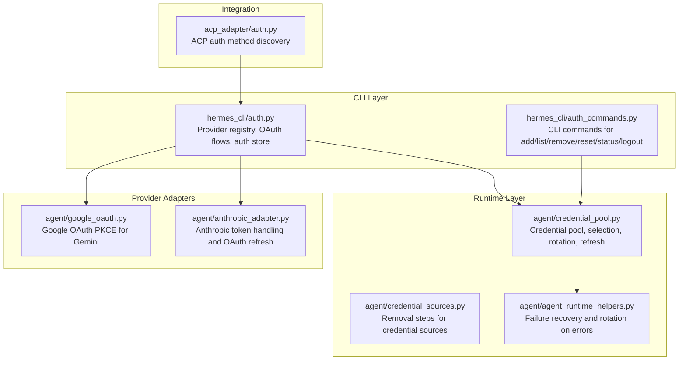
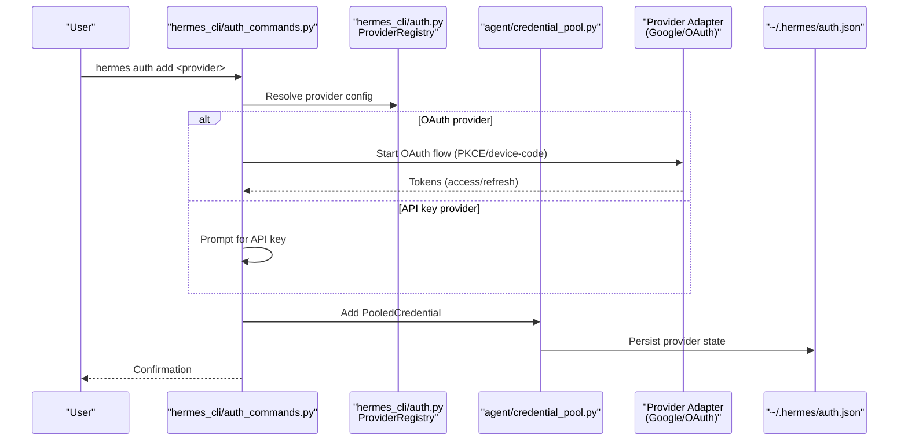
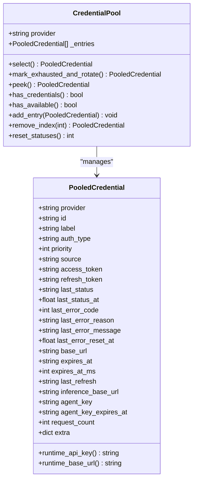
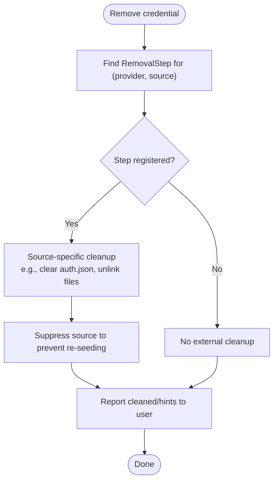
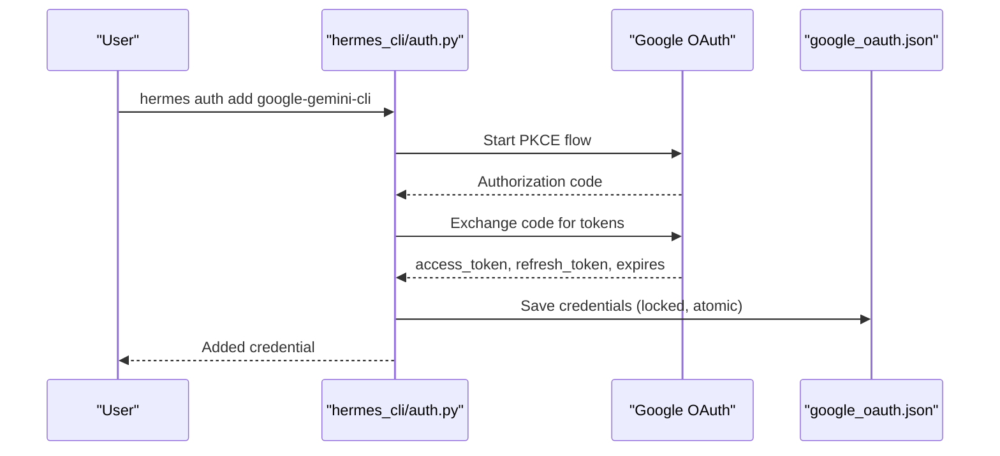
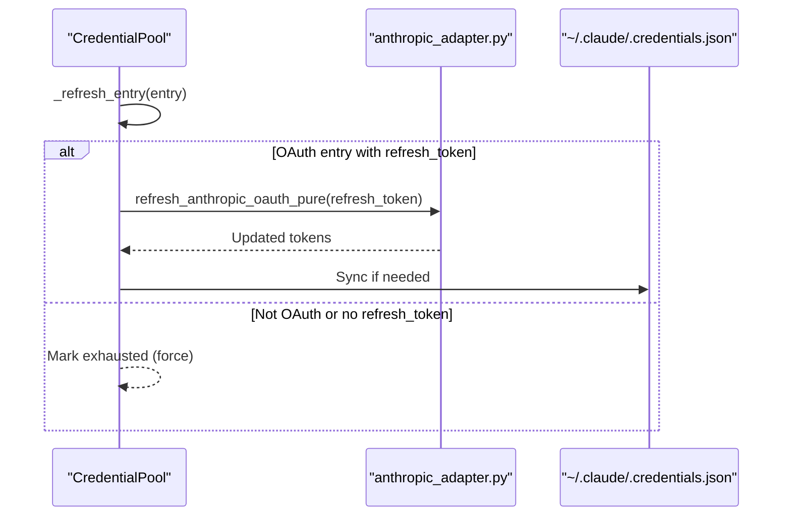
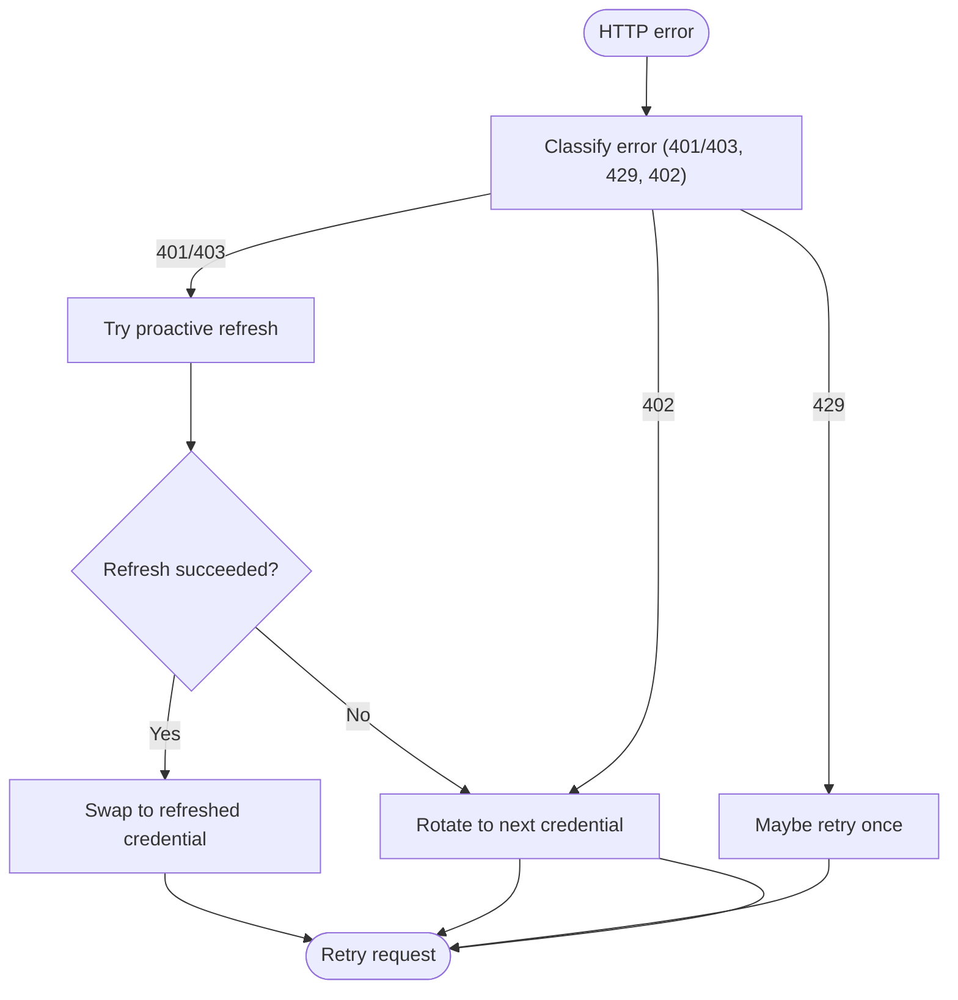
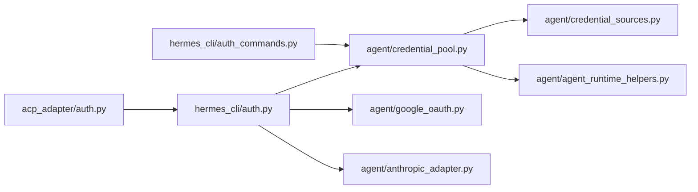

# Authentication Systems

<cite>
**Referenced Files in This Document**
- [credential_pool.py](file://agent/credential_pool.py)
- [credential_sources.py](file://agent/credential_sources.py)
- [google_oauth.py](file://agent/google_oauth.py)
- [anthropic_adapter.py](file://agent/anthropic_adapter.py)
- [auth.py](file://hermes_cli/auth.py)
- [auth_commands.py](file://hermes_cli/auth_commands.py)
- [auth.py](file://acp_adapter/auth.py)
- [agent_runtime_helpers.py](file://agent/agent_runtime_helpers.py)
- [test_credential_pool.py](file://tests/agent/test_credential_pool.py)
- [test_auth_xai_oauth_provider.py](file://tests/hermes_cli/test_auth_xai_oauth_provider.py)
- [credential-pools.md](file://website/docs/user-guide/features/credential-pools.md)
</cite>

## Table of Contents
1. [Introduction](#introduction)
2. [Project Structure](#project-structure)
3. [Core Components](#core-components)
4. [Architecture Overview](#architecture-overview)
5. [Detailed Component Analysis](#detailed-component-analysis)
6. [Dependency Analysis](#dependency-analysis)
7. [Performance Considerations](#performance-considerations)
8. [Troubleshooting Guide](#troubleshooting-guide)
9. [Conclusion](#conclusion)
10. [Appendices](#appendices)

## Introduction
This document describes the Authentication Systems powering Hermes Agent, focusing on:
- Supported authentication methods: API keys and OAuth flows
- Credential pool architecture for same-provider rotation and failover
- Credential sources management and secure storage
- OAuth implementations for providers like Google (Gemini), Anthropic, xAI, Qwen, MiniMax, and others
- PKCE flows, token refresh, and proactive refresh strategies
- API key management, rotation, validation, and fallback strategies
- Practical setup examples, failure handling, and custom authentication flows
- Security considerations and best practices for managing credentials across environments

## Project Structure
Authentication spans multiple modules:
- CLI and provider registry: hermes_cli/auth.py
- Credential pool and sources: agent/credential_pool.py, agent/credential_sources.py
- Provider-specific adapters and flows: agent/google_oauth.py, agent/anthropic_adapter.py
- Runtime integration and recovery: agent/agent_runtime_helpers.py
- ACP integration: acp_adapter/auth.py
- Tests and documentation: tests/*, website/docs/*

**Diagram sources**
- [auth.py:166-457](file://hermes_cli/auth.py#L166-L457)
- [auth_commands.py:163-428](file://hermes_cli/auth_commands.py#L163-L428)
- [credential_pool.py:389-764](file://agent/credential_pool.py#L389-L764)
- [credential_sources.py:112-448](file://agent/credential_sources.py#L112-L448)
- [agent_runtime_helpers.py:564-636](file://agent/agent_runtime_helpers.py#L564-L636)
- [google_oauth.py:1-1062](file://agent/google_oauth.py#L1-L1062)
- [anthropic_adapter.py:786-800](file://agent/anthropic_adapter.py#L786-L800)
- [auth.py:11-68](file://acp_adapter/auth.py#L11-L68)

**Section sources**
- [auth.py:1-100](file://hermes_cli/auth.py#L1-L100)
- [auth_commands.py:1-100](file://hermes_cli/auth_commands.py#L1-L100)
- [credential_pool.py:1-120](file://agent/credential_pool.py#L1-L120)
- [credential_sources.py:1-60](file://agent/credential_sources.py#L1-L60)
- [google_oauth.py:1-60](file://agent/google_oauth.py#L1-L60)
- [anthropic_adapter.py:1-40](file://agent/anthropic_adapter.py#L1-L40)
- [auth.py:1-30](file://acp_adapter/auth.py#L1-L30)

## Core Components
- Provider registry and OAuth configuration: Defines providers, endpoints, scopes, and client IDs used by CLI flows.
- Credential pool: Manages multiple credentials per provider, selects by strategy, marks exhaustion, rotates, and refreshes OAuth tokens.
- Credential sources: Centralizes removal logic for all credential sources (env vars, external OAuth files, auth.json blocks, custom configs).
- Provider-specific adapters: Implement OAuth flows (PKCE), token refresh, and runtime credential resolution.
- Runtime integration: Reacts to HTTP 401/403/429/402 to proactively rotate or refresh credentials.

**Section sources**
- [auth.py:166-457](file://hermes_cli/auth.py#L166-L457)
- [credential_pool.py:50-120](file://agent/credential_pool.py#L50-L120)
- [credential_sources.py:112-133](file://agent/credential_sources.py#L112-L133)
- [agent_runtime_helpers.py:564-636](file://agent/agent_runtime_helpers.py#L564-L636)

## Architecture Overview
The authentication system integrates CLI-driven OAuth flows with a persistent credential pool and runtime recovery.

**Diagram sources**
- [auth_commands.py:163-428](file://hermes_cli/auth_commands.py#L163-L428)
- [auth.py:166-457](file://hermes_cli/auth.py#L166-L457)
- [credential_pool.py:421-425](file://agent/credential_pool.py#L421-L425)
- [google_oauth.py:578-624](file://agent/google_oauth.py#L578-L624)

## Detailed Component Analysis

### Credential Pool Architecture
The pool manages multiple credentials per provider, supports rotation strategies, and tracks exhaustion and refresh.

Key behaviors:
- Exhaustion tracking and TTL-based cooldowns
- Proactive refresh for expiring OAuth tokens
- Sync with auth.json for multi-process consistency
- Strategy-based selection: fill_first, round_robin, random, least_used

**Diagram sources**
- [credential_pool.py:93-180](file://agent/credential_pool.py#L93-L180)
- [credential_pool.py:389-420](file://agent/credential_pool.py#L389-L420)

**Section sources**
- [credential_pool.py:50-120](file://agent/credential_pool.py#L50-L120)
- [credential_pool.py:199-284](file://agent/credential_pool.py#L199-L284)
- [credential_pool.py:766-786](file://agent/credential_pool.py#L766-L786)
- [credential_pool.py:421-445](file://agent/credential_pool.py#L421-L445)

### Credential Sources Management
Removal steps unify cleanup across sources:
- Env vars, external OAuth files, auth.json blocks, custom configs, manual entries
- Suppression to prevent re-seeding after removal
- Provider-specific handling (e.g., Claude Code, Qwen CLI, xAI OAuth)

**Diagram sources**
- [credential_sources.py:112-133](file://agent/credential_sources.py#L112-L133)
- [credential_sources.py:383-448](file://agent/credential_sources.py#L383-L448)

**Section sources**
- [credential_sources.py:112-133](file://agent/credential_sources.py#L112-L133)
- [credential_sources.py:143-191](file://agent/credential_sources.py#L143-L191)
- [credential_sources.py:222-237](file://agent/credential_sources.py#L222-L237)

### OAuth Implementations

#### Google OAuth PKCE (Gemini)
- Implements Authorization Code + PKCE (S256) against Google accounts
- Stores tokens in a locked, atomic file with strict permissions
- Supports in-flight refresh deduplication and invalid_grant handling

**Diagram sources**
- [google_oauth.py:578-624](file://agent/google_oauth.py#L578-L624)
- [google_oauth.py:468-522](file://agent/google_oauth.py#L468-L522)
- [auth.py:211-216](file://hermes_cli/auth.py#L211-L216)

**Section sources**
- [google_oauth.py:1-1062](file://agent/google_oauth.py#L1-L1062)
- [auth.py:211-216](file://hermes_cli/auth.py#L211-L216)

#### Anthropic OAuth and Refresh
- Supports OAuth setup tokens and Claude Code credentials
- Provides refresh function for Anthropic OAuth tokens
- Maintains parity with external credential files (e.g., ~/.claude/.credentials.json)

**Diagram sources**
- [credential_pool.py:766-786](file://agent/credential_pool.py#L766-L786)
- [anthropic_adapter.py:786-800](file://agent/anthropic_adapter.py#L786-L800)

**Section sources**
- [anthropic_adapter.py:786-800](file://agent/anthropic_adapter.py#L786-L800)
- [credential_pool.py:447-482](file://agent/credential_pool.py#L447-L482)

#### xAI OAuth Loopback PKCE
- Implements loopback PKCE flow with a local callback server
- Proactive refresh and sync with auth.json for multi-process consistency
- Dedicated removal step clears provider state and suppresses re-seeding

**Section sources**
- [auth.py:115-122](file://hermes_cli/auth.py#L115-L122)
- [credential_pool.py:548-604](file://agent/credential_pool.py#L548-L604)
- [credential_pool.py:766-786](file://agent/credential_pool.py#L766-L786)
- [credential_sources.py:268-290](file://agent/credential_sources.py#L268-L290)

#### Qwen OAuth and MiniMax OAuth
- Qwen OAuth uses CLI credentials and stores API key in pool
- MiniMax OAuth uses device code flow with provider-specific base URLs and scopes

**Section sources**
- [auth.py:123-125](file://hermes_cli/auth.py#L123-L125)
- [auth.py:298-316](file://hermes_cli/auth.py#L298-L316)
- [auth_commands.py:384-426](file://hermes_cli/auth_commands.py#L384-L426)

### API Key Management
- API keys can be added via CLI and stored in the credential pool
- Validation checks filter placeholder or empty values
- Pool can fallback to env vars and credential pool entries for providers

**Section sources**
- [auth_commands.py:196-221](file://hermes_cli/auth_commands.py#L196-L221)
- [auth.py:577-615](file://hermes_cli/auth.py#L577-L615)

### Runtime Recovery and Rotation
- On HTTP 401/403/429/402, the runtime attempts proactive refresh or rotation
- Billing and rate-limit errors trigger immediate rotation; auth failures attempt refresh first
- Expiration-aware refresh avoids redundant exchanges

**Diagram sources**
- [agent_runtime_helpers.py:564-636](file://agent/agent_runtime_helpers.py#L564-L636)
- [credential_pool.py:766-786](file://agent/credential_pool.py#L766-L786)

**Section sources**
- [agent_runtime_helpers.py:564-636](file://agent/agent_runtime_helpers.py#L564-L636)
- [credential_pool.py:766-786](file://agent/credential_pool.py#L766-L786)

### Practical Setup Examples
- Add API key for a provider: hermes auth add <provider> --type api-key
- Add OAuth credential: hermes auth add <provider> (browser flow)
- List credentials: hermes auth list
- Remove credential and clean up source: hermes auth remove <provider> <target>
- Reset cooldowns: hermes auth reset <provider>
- Provider status: hermes auth status <provider>

**Section sources**
- [auth_commands.py:163-428](file://hermes_cli/auth_commands.py#L163-L428)
- [auth_commands.py:431-456](file://hermes_cli/auth_commands.py#L431-L456)
- [auth_commands.py:458-494](file://hermes_cli/auth_commands.py#L458-L494)
- [auth_commands.py:496-501](file://hermes_cli/auth_commands.py#L496-L501)
- [auth_commands.py:503-521](file://hermes_cli/auth_commands.py#L503-L521)

### Security Considerations and Best Practices
- Secure storage:
  - Lock and atomic writes for OAuth credentials files
  - Strict permissions (chmod 0600) and tight parent directory permissions
  - Cross-process locks to prevent race conditions
- Token lifecycle:
  - Proactive refresh before expiry to minimize downtime
  - Dedupe concurrent refreshes to avoid thundering herd
  - Handle invalid_grant by clearing credentials and prompting re-login
- Environment hygiene:
  - Filter placeholder/empty secrets
  - Prefer OAuth over long-lived API keys when available
  - Use credential pool strategies to distribute load and reduce throttling
- Multi-process consistency:
  - Sync pool entries with auth.json for shared singletons (e.g., xAI OAuth)
  - Suppress sources after removal to prevent re-seeding

**Section sources**
- [google_oauth.py:468-522](file://agent/google_oauth.py#L468-L522)
- [google_oauth.py:647-720](file://agent/google_oauth.py#L647-L720)
- [credential_pool.py:548-604](file://agent/credential_pool.py#L548-L604)
- [auth.py:565-574](file://hermes_cli/auth.py#L565-L574)

## Dependency Analysis
High-level dependencies among authentication components:

**Diagram sources**
- [auth.py:166-457](file://hermes_cli/auth.py#L166-L457)
- [auth_commands.py:163-428](file://hermes_cli/auth_commands.py#L163-L428)
- [credential_pool.py:389-420](file://agent/credential_pool.py#L389-L420)
- [credential_sources.py:112-133](file://agent/credential_sources.py#L112-L133)
- [agent_runtime_helpers.py:564-636](file://agent/agent_runtime_helpers.py#L564-L636)
- [google_oauth.py:1-1062](file://agent/google_oauth.py#L1-L1062)
- [anthropic_adapter.py:786-800](file://agent/anthropic_adapter.py#L786-L800)
- [auth.py:11-68](file://acp_adapter/auth.py#L11-L68)

**Section sources**
- [auth.py:166-457](file://hermes_cli/auth.py#L166-L457)
- [auth_commands.py:163-428](file://hermes_cli/auth_commands.py#L163-L428)
- [credential_pool.py:389-420](file://agent/credential_pool.py#L389-L420)
- [credential_sources.py:112-133](file://agent/credential_sources.py#L112-L133)
- [agent_runtime_helpers.py:564-636](file://agent/agent_runtime_helpers.py#L564-L636)
- [google_oauth.py:1-1062](file://agent/google_oauth.py#L1-L1062)
- [anthropic_adapter.py:786-800](file://agent/anthropic_adapter.py#L786-L800)
- [auth.py:11-68](file://acp_adapter/auth.py#L11-L68)

## Performance Considerations
- Pool selection strategies:
  - fill_first: reduces churn and improves cache locality
  - least_used: balances load across credentials
  - round_robin/random: simple distribution
- Refresh timing:
  - Proactive refresh slightly before expiry reduces latency spikes
  - Skewed refresh windows across credentials avoid synchronized refresh storms
- IO efficiency:
  - Atomic writes and cross-process locks minimize contention
  - Minimal auth.json writes during refresh syncbacks

[No sources needed since this section provides general guidance]

## Troubleshooting Guide
Common issues and resolutions:
- Rate limit (429) or billing (402) errors:
  - Pool rotates to next credential automatically
  - Verify provider state and reset cooldowns if needed
- Authentication failures (401/403):
  - Attempt proactive refresh; if unsuccessful, rotate to next credential
  - For Google OAuth, invalid_grant clears credentials and requires re-login
- OAuth login hangs or fails:
  - Check browser flow, callback port availability, and SSH restrictions
  - Review OAuth trace logs if enabled
- Multi-process token drift:
  - Pool syncs with auth.json for singletons; ensure no external process replays consumed refresh tokens

**Section sources**
- [agent_runtime_helpers.py:564-636](file://agent/agent_runtime_helpers.py#L564-L636)
- [google_oauth.py:647-720](file://agent/google_oauth.py#L647-L720)
- [credential_pool.py:548-604](file://agent/credential_pool.py#L548-L604)
- [auth.py:782-794](file://hermes_cli/auth.py#L782-L794)

## Conclusion
Hermes Authentication Systems combine a robust credential pool with provider-specific OAuth flows and runtime recovery. The design emphasizes reliability, security, and operability across diverse environments. By leveraging proactive refresh, multi-process synchronization, and unified removal steps, the system provides seamless rotation and minimal downtime for production usage.

[No sources needed since this section summarizes without analyzing specific files]

## Appendices

### Credential Pool Strategies
- fill_first: Use first key until exhausted, then next
- round_robin: Cycle through keys evenly
- least_used: Always pick the least-used key
- random: Random selection

**Section sources**
- [credential_pool.py:64-69](file://agent/credential_pool.py#L64-L69)
- [auth_commands.py:682-721](file://hermes_cli/auth_commands.py#L682-L721)

### OAuth Provider Registry Highlights
- Google Gemini (OAuth): PKCE loopback flow, cloudcode-pa.googleapis.com
- Anthropic: API keys and OAuth tokens; Claude Code credentials
- xAI Grok OAuth: Loopback PKCE, SuperGrok subscription
- Qwen OAuth: CLI credentials
- MiniMax OAuth: Device code flow with region-aware endpoints
- Nous Portal: Device code flow with invoke/legacy modes

**Section sources**
- [auth.py:183-316](file://hermes_cli/auth.py#L183-L316)

### Documentation References
- Credential pools overview and behavior: [credential-pools.md:1-30](file://website/docs/user-guide/features/credential-pools.md#L1-L30)

**Section sources**
- [credential-pools.md:1-30](file://website/docs/user-guide/features/credential-pools.md#L1-L30)