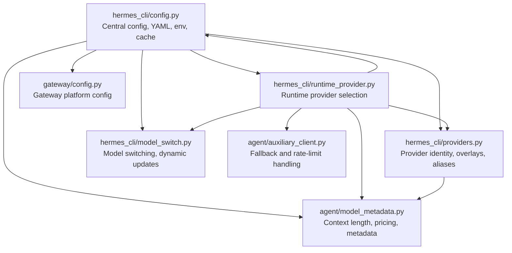
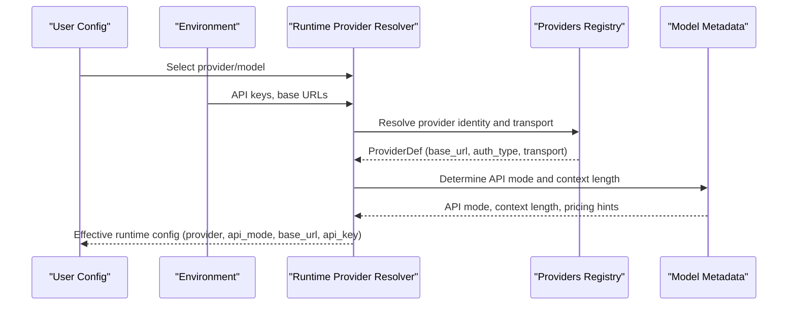
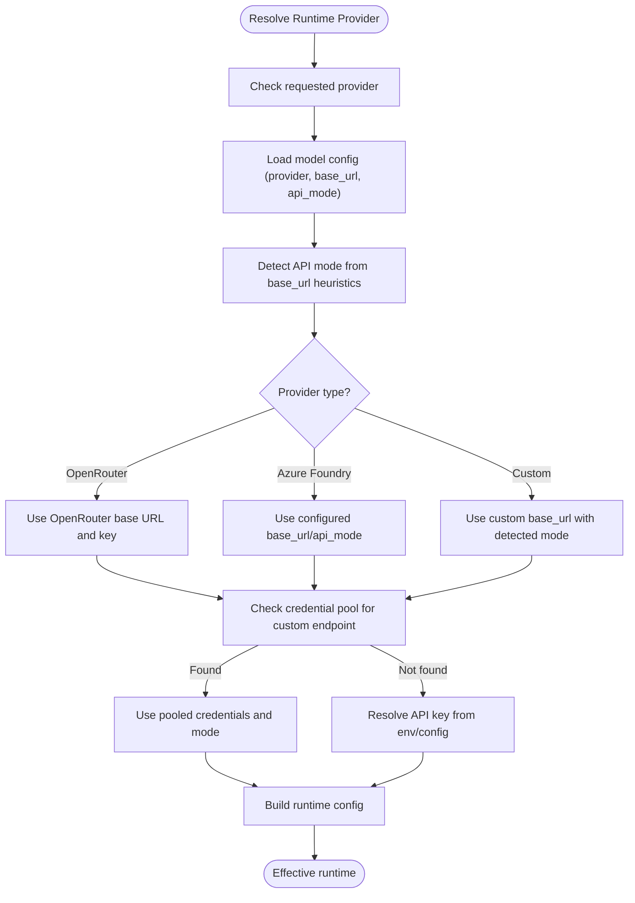
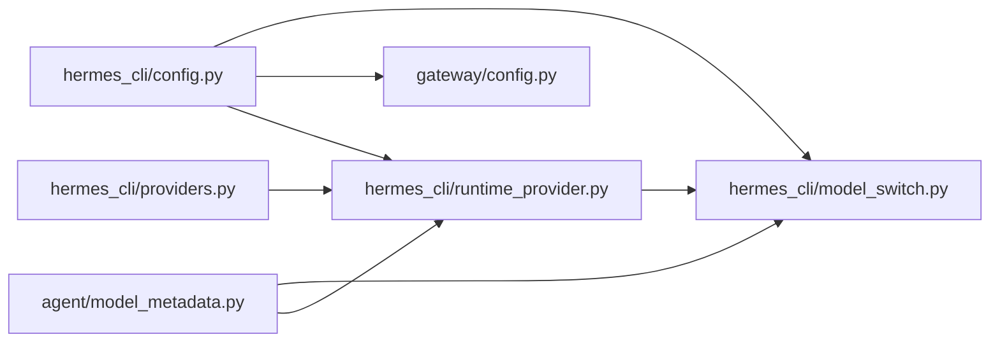

# Configuration Management

<cite>
**Referenced Files in This Document**
- [hermes_cli/config.py](file://hermes_cli/config.py)
- [gateway/config.py](file://gateway/config.py)
- [hermes_cli/providers.py](file://hermes_cli/providers.py)
- [agent/model_metadata.py](file://agent/model_metadata.py)
- [hermes_cli/runtime_provider.py](file://hermes_cli/runtime_provider.py)
- [hermes_cli/model_switch.py](file://hermes_cli/model_switch.py)
- [agent/auxiliary_client.py](file://agent/auxiliary_client.py)
</cite>

## Table of Contents
1. [Introduction](#introduction)
2. [Project Structure](#project-structure)
3. [Core Components](#core-components)
4. [Architecture Overview](#architecture-overview)
5. [Detailed Component Analysis](#detailed-component-analysis)
6. [Dependency Analysis](#dependency-analysis)
7. [Performance Considerations](#performance-considerations)
8. [Troubleshooting Guide](#troubleshooting-guide)
9. [Conclusion](#conclusion)
10. [Appendices](#appendices)

## Introduction
This document explains Configuration Management for the Hermes Agent, focusing on provider-specific settings, API endpoint configuration, and model selection strategies. It covers the model metadata system (context length limits, token pricing, provider capabilities), configuration inheritance and environment variable overrides, dynamic configuration updates, rate limiting and quota management, and practical examples for configuring providers and optimizing performance. It also documents configuration validation, migration strategies, and troubleshooting.

## Project Structure
Configuration spans several modules:
- Central configuration management and persistence
- Provider identity and resolution
- Model metadata and context length resolution
- Runtime provider selection and API mode determination
- Gateway-specific configuration for platforms and delivery
- Model switching and dynamic updates

**Diagram sources**
- [hermes_cli/config.py:1-200](file://hermes_cli/config.py#L1-L200)
- [hermes_cli/providers.py:1-200](file://hermes_cli/providers.py#L1-L200)
- [agent/model_metadata.py:1-200](file://agent/model_metadata.py#L1-L200)
- [hermes_cli/runtime_provider.py:1-200](file://hermes_cli/runtime_provider.py#L1-L200)
- [gateway/config.py:1-200](file://gateway/config.py#L1-L200)
- [hermes_cli/model_switch.py:1500-1650](file://hermes_cli/model_switch.py#L1500-L1650)
- [agent/auxiliary_client.py:4667-4688](file://agent/auxiliary_client.py#L4667-L4688)

**Section sources**
- [hermes_cli/config.py:1-200](file://hermes_cli/config.py#L1-L200)
- [hermes_cli/providers.py:1-200](file://hermes_cli/providers.py#L1-L200)
- [agent/model_metadata.py:1-200](file://agent/model_metadata.py#L1-L200)
- [hermes_cli/runtime_provider.py:1-200](file://hermes_cli/runtime_provider.py#L1-L200)
- [gateway/config.py:1-200](file://gateway/config.py#L1-L200)

## Core Components
- Central configuration loader and saver with YAML parsing, environment expansion, and caching
- Provider registry with overlays, aliases, and transport/API mode mapping
- Model metadata resolver with context length, pricing, and provider capability detection
- Runtime provider selection with environment and config precedence, API mode auto-detection
- Gateway configuration for platforms, session reset policies, and streaming
- Model switching and dynamic updates with credential pools and endpoint discovery

**Section sources**
- [hermes_cli/config.py:460-800](file://hermes_cli/config.py#L460-L800)
- [hermes_cli/providers.py:31-213](file://hermes_cli/providers.py#L31-L213)
- [agent/model_metadata.py:611-789](file://agent/model_metadata.py#L611-L789)
- [hermes_cli/runtime_provider.py:114-354](file://hermes_cli/runtime_provider.py#L114-L354)
- [gateway/config.py:442-650](file://gateway/config.py#L442-L650)

## Architecture Overview
The configuration system merges three layers:
- models.dev catalog (primary provider metadata)
- Hermes overlays (transport, auth, aggregator flags)
- User config (providers, custom_providers, model settings)

Resolution proceeds from built-in providers to user config, with environment variables and runtime overrides applied.

**Diagram sources**
- [hermes_cli/providers.py:408-542](file://hermes_cli/providers.py#L408-L542)
- [hermes_cli/runtime_provider.py:220-354](file://hermes_cli/runtime_provider.py#L220-L354)
- [agent/model_metadata.py:1429-1590](file://agent/model_metadata.py#L1429-L1590)

## Detailed Component Analysis

### Central Configuration Management
- YAML-backed storage in ~/.hermes/config.yaml with defaults and environment expansion
- Secure file permissions and managed mode handling
- Config cache keyed by (path, mtime, size) to avoid repeated YAML loads
- Environment variable expansion and validation helpers
- Migration and schema normalization for backward compatibility

Key behaviors:
- Parse failure warning with persistent suppression per file version
- Managed mode detection and update command recommendation
- Container-aware permission enforcement
- Thread-safe read/write with atomic replacement

**Section sources**
- [hermes_cli/config.py:1-200](file://hermes_cli/config.py#L1-L200)
- [hermes_cli/config.py:327-464](file://hermes_cli/config.py#L327-L464)
- [hermes_cli/config.py:466-800](file://hermes_cli/config.py#L466-L800)

### Provider Identity and Resolution
- Canonical provider IDs with aliases mapping to models.dev
- Hermes overlays for transport, auth type, aggregator flags, and base URL env vars
- User-defined providers via providers: and custom_providers:
- Automatic API mode determination from provider and URL heuristics

Highlights:
- Transport-to-API-mode mapping for OpenAI chat, Anthropic messages, Codex responses, Bedrock converse
- URL-based heuristics for unknown/custom providers
- Local server detection and transport selection

**Section sources**
- [hermes_cli/providers.py:219-542](file://hermes_cli/providers.py#L219-L542)
- [hermes_cli/providers.py:544-721](file://hermes_cli/providers.py#L544-L721)
- [hermes_cli/runtime_provider.py:64-89](file://hermes_cli/runtime_provider.py#L64-L89)

### Model Metadata and Context Length Resolution
- Live metadata from OpenRouter with caching and endpoint-specific metadata
- Endpoint model metadata probing for custom providers
- Persistent cache of model+provider context lengths
- Heuristics for local servers, AWS Bedrock, Anthropic, Nous Portal, Codex OAuth
- Hardcoded defaults for broad model families with longest-key-first matching

Capabilities:
- Pricing extraction from metadata (prompt/completion/request/cache)
- Context length probing with fallback tiers
- Error parsing for context and output token limits
- Ollama native show API and local server introspection

**Section sources**
- [agent/model_metadata.py:611-789](file://agent/model_metadata.py#L611-L789)
- [agent/model_metadata.py:814-876](file://agent/model_metadata.py#L814-L876)
- [agent/model_metadata.py:1429-1590](file://agent/model_metadata.py#L1429-L1590)

### Runtime Provider Selection and API Mode
- Requested provider precedence: explicit argument → config → environment → auto
- Credential resolution from pools, env vars, and config
- API mode auto-detection from base URL heuristics
- Special handling for providers with fixed API modes (e.g., Azure Foundry, OpenCode)
- Optional rerouting to codex app server for OpenAI/Codex

**Diagram sources**
- [hermes_cli/runtime_provider.py:357-729](file://hermes_cli/runtime_provider.py#L357-L729)

**Section sources**
- [hermes_cli/runtime_provider.py:114-354](file://hermes_cli/runtime_provider.py#L114-L354)
- [hermes_cli/runtime_provider.py:357-729](file://hermes_cli/runtime_provider.py#L357-L729)

### Gateway Configuration
- Platform-specific configuration with validation and normalization
- Session reset policies by type and platform
- Streaming configuration with transport selection and buffer tuning
- Home channel routing and unauthorized DM behavior
- Legacy gateway.json migration and precedence

**Section sources**
- [gateway/config.py:100-200](file://gateway/config.py#L100-L200)
- [gateway/config.py:442-650](file://gateway/config.py#L442-L650)

### Model Switching and Dynamic Updates
- Discover live models from endpoints when credentials are available
- Persist selected model back to provider entries
- Apply api_mode from custom_providers or auto-detect
- Maintain user-defined model lists and totals

**Section sources**
- [hermes_cli/model_switch.py:1518-1545](file://hermes_cli/model_switch.py#L1518-L1545)
- [hermes_cli/model_switch.py:3931-3959](file://hermes_cli/model_switch.py#L3931-L3959)

### Rate Limiting and Quota Management
- Fallback on connection errors, rate-limit 429, and payment errors
- Alternative provider selection to avoid exhausted endpoints
- Daily token quota 429 treated as capacity problem, triggering fallback

**Section sources**
- [agent/auxiliary_client.py:4667-4688](file://agent/auxiliary_client.py#L4667-L4688)

## Dependency Analysis
Configuration dependencies and coupling:
- hermes_cli/config.py is central and imported by runtime and gateway modules
- hermes_cli/providers.py depends on models.dev and overlays; used by runtime provider resolver
- agent/model_metadata.py is used by runtime provider resolver and model switching
- gateway/config.py depends on hermes_cli/config.py for shared keys and precedence
- hermes_cli/model_switch.py integrates with runtime provider and config modules

**Diagram sources**
- [hermes_cli/config.py:1-200](file://hermes_cli/config.py#L1-L200)
- [hermes_cli/providers.py:1-200](file://hermes_cli/providers.py#L1-L200)
- [agent/model_metadata.py:1-200](file://agent/model_metadata.py#L1-L200)
- [hermes_cli/runtime_provider.py:1-200](file://hermes_cli/runtime_provider.py#L1-L200)
- [gateway/config.py:1-200](file://gateway/config.py#L1-L200)
- [hermes_cli/model_switch.py:1500-1650](file://hermes_cli/model_switch.py#L1500-L1650)

**Section sources**
- [hermes_cli/config.py:1-200](file://hermes_cli/config.py#L1-L200)
- [hermes_cli/providers.py:1-200](file://hermes_cli/providers.py#L1-L200)
- [agent/model_metadata.py:1-200](file://agent/model_metadata.py#L1-L200)
- [hermes_cli/runtime_provider.py:1-200](file://hermes_cli/runtime_provider.py#L1-L200)
- [gateway/config.py:1-200](file://gateway/config.py#L1-L200)
- [hermes_cli/model_switch.py:1500-1650](file://hermes_cli/model_switch.py#L1500-L1650)

## Performance Considerations
- Configuration caching: YAML parse and merge are cached by file metadata to avoid repeated work
- Model metadata caching: OpenRouter and endpoint metadata caches with TTLs
- Local server probing: Short timeouts and targeted endpoints minimize latency
- Streaming: Tunable edit intervals and buffer thresholds for platform responsiveness
- Context length probing: Tiered fallback reduces retries on unknown models

[No sources needed since this section provides general guidance]

## Troubleshooting Guide
Common configuration issues and resolutions:
- YAML parse failures: Centralized warning logged and surfaced to stderr; fix YAML and restart
- Managed mode conflicts: Cannot modify configuration in managed environments; use recommended update command
- Container permission issues: Skip chmod in containers; set HERMES_SKIP_CHMOD=1 to force
- Provider resolution ambiguity: Use canonical provider IDs or aliases; verify environment variables
- API mode mismatch: Explicitly set model.api_mode or rely on URL heuristics; verify base_url correctness
- Context length probing failures: Set model.context_length in config.yaml; ensure endpoint is reachable
- Rate limit exhaustion: Enable fallback providers; adjust retry/backoff; monitor quotas
- Gateway configuration errors: Validate platform sections and reset policies; use legacy migration paths

**Section sources**
- [hermes_cli/config.py:37-72](file://hermes_cli/config.py#L37-L72)
- [hermes_cli/config.py:166-268](file://hermes_cli/config.py#L166-L268)
- [hermes_cli/runtime_provider.py:624-729](file://hermes_cli/runtime_provider.py#L624-L729)
- [agent/model_metadata.py:1429-1590](file://agent/model_metadata.py#L1429-L1590)
- [agent/auxiliary_client.py:4667-4688](file://agent/auxiliary_client.py#L4667-L4688)

## Conclusion
The Configuration Management system integrates centralized YAML configuration, provider overlays, and runtime resolution to deliver robust provider selection, accurate model metadata, and dynamic updates. It supports environment variable overrides, fallback mechanisms, and platform-specific tuning, enabling reliable operation across diverse providers and deployment scenarios.

## Appendices

### Practical Examples

- Configure a custom provider endpoint:
  - Add to providers: with api/url/base_url, optional key_env, and transport
  - Optionally set default_model and discover_models
  - Persist and select via model switching

- Set up OpenRouter with custom base URL:
  - Set OPENROUTER_BASE_URL or configure model.base_url
  - Use OPENROUTER_API_KEY or OPENAI_API_KEY depending on target
  - Verify API mode auto-detection or set model.api_mode explicitly

- Optimize streaming delivery:
  - Adjust gateway.streaming.edit_interval and buffer_threshold
  - Choose transport mode (auto/draft/edit/off) per platform

- Tune context length for local models:
  - For Ollama, ensure /api/show is reachable; context may come from parameters or model_info
  - For LM Studio, use /api/v1/models; context comes from loaded instances
  - For vLLM/llama.cpp, use /v1/models/{model} or /v1/models

- Handle rate limits and quotas:
  - Enable fallback providers in auxiliary client fallback logic
  - Monitor provider-specific rate limits and adjust concurrency
  - Use model.api_mode that matches provider capabilities (e.g., anthropic_messages for Anthropic-compatible endpoints)

**Section sources**
- [hermes_cli/providers.py:544-721](file://hermes_cli/providers.py#L544-L721)
- [hermes_cli/runtime_provider.py:624-729](file://hermes_cli/runtime_provider.py#L624-L729)
- [gateway/config.py:348-401](file://gateway/config.py#L348-L401)
- [agent/model_metadata.py:1031-1195](file://agent/model_metadata.py#L1031-L1195)
- [agent/auxiliary_client.py:4667-4688](file://agent/auxiliary_client.py#L4667-L4688)