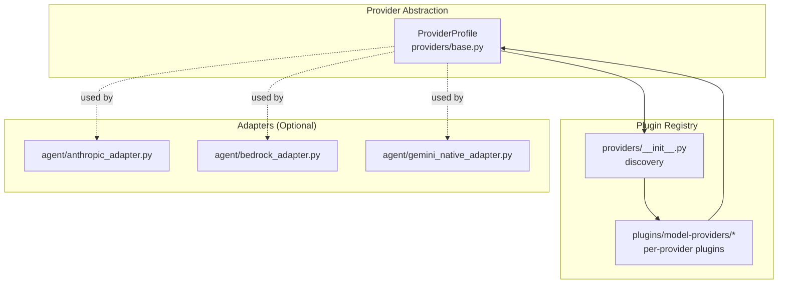
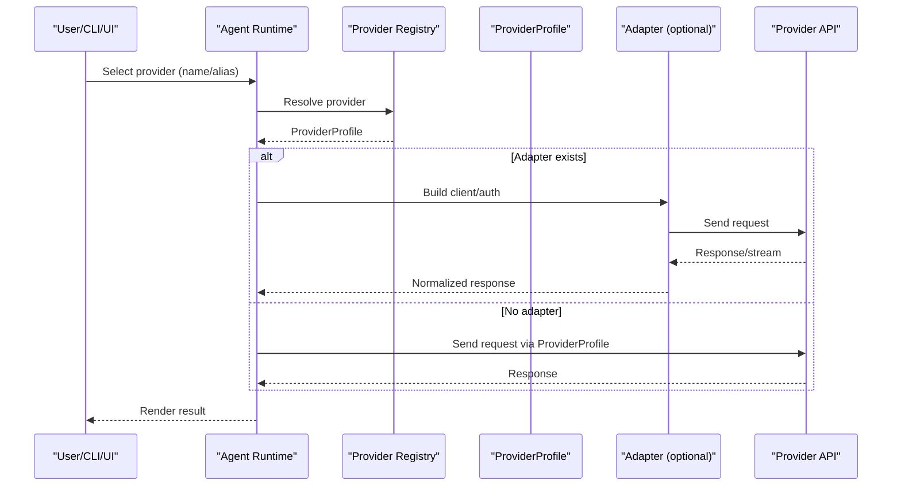
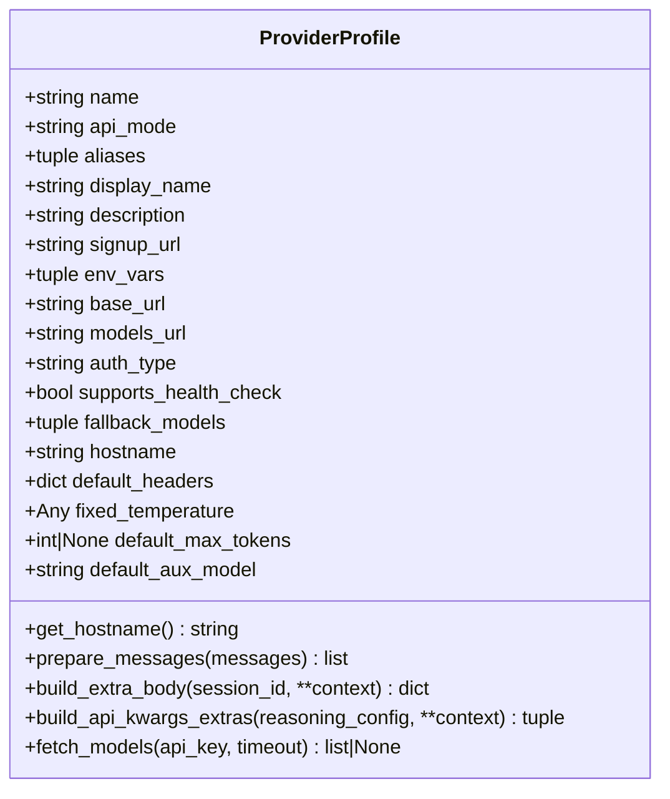
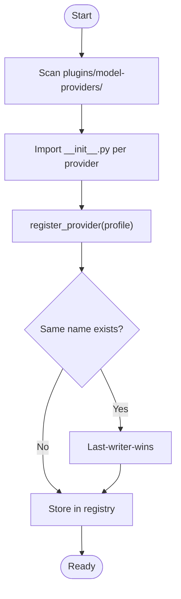
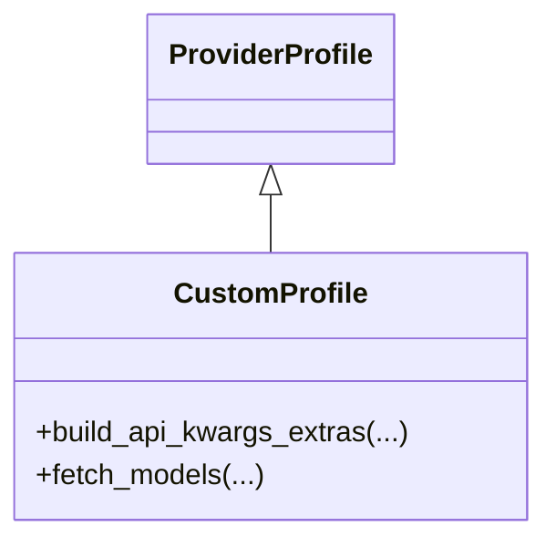
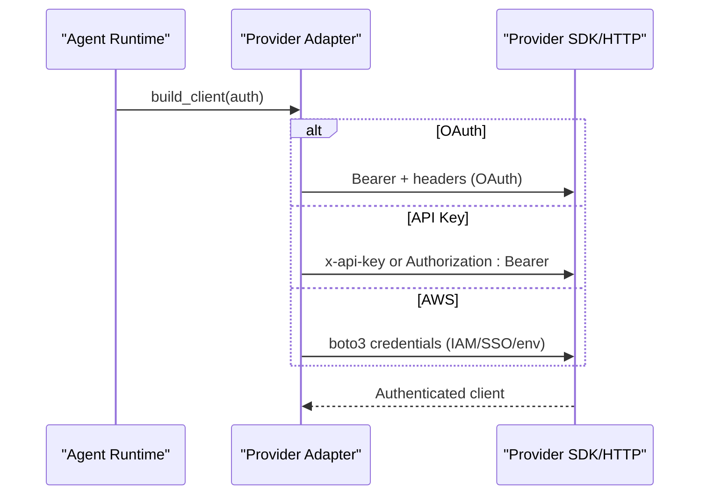
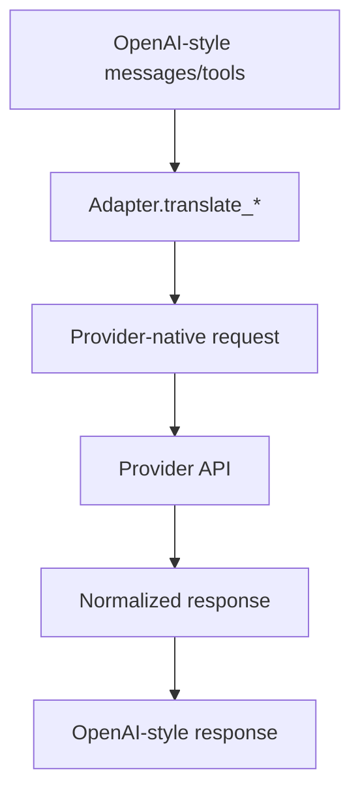
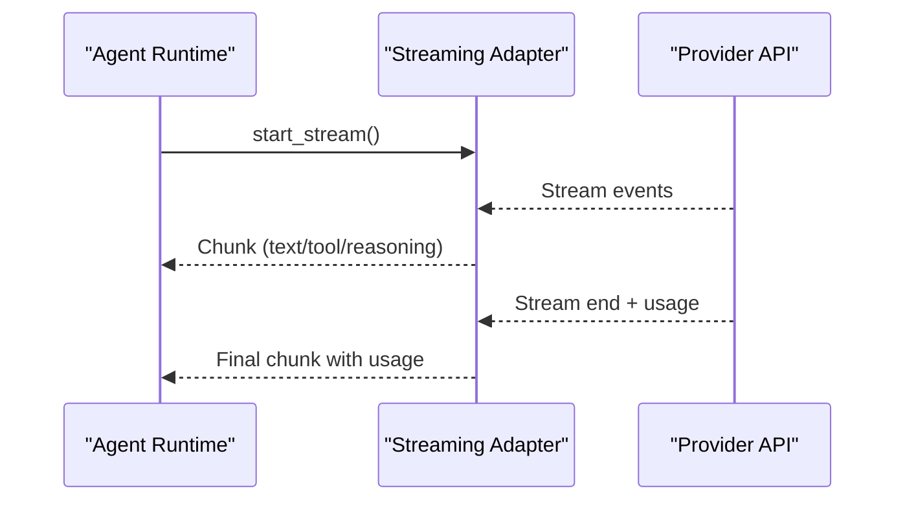
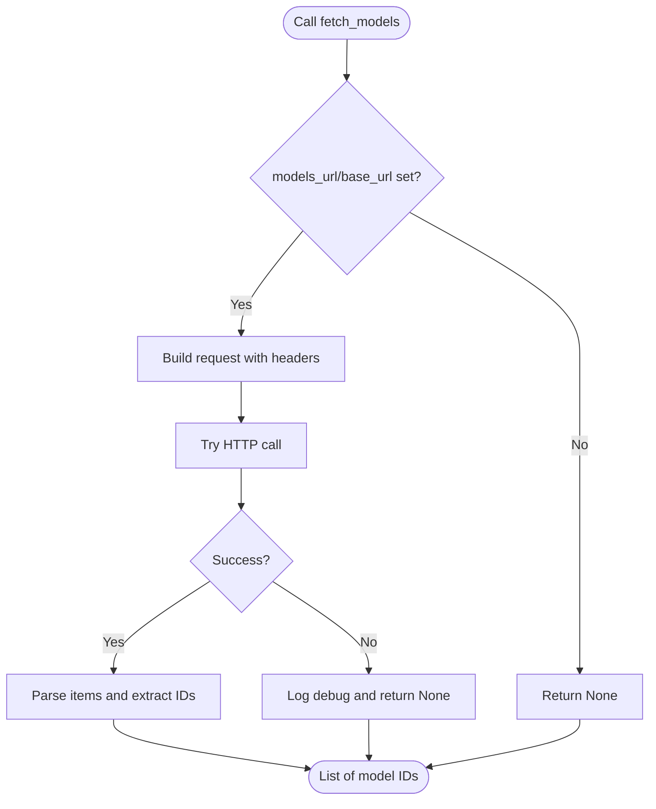
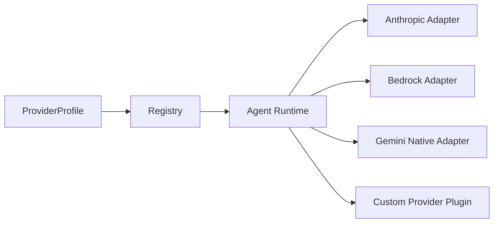

# Custom Provider Development

<cite>
**Referenced Files in This Document**
- [providers/base.py](file://providers/base.py)
- [plugins/model-providers/README.md](file://plugins/model-providers/README.md)
- [plugins/model-providers/custom/__init__.py](file://plugins/model-providers/custom/__init__.py)
- [plugins/model-providers/custom/plugin.yaml](file://plugins/model-providers/custom/plugin.yaml)
- [agent/anthropic_adapter.py](file://agent/anthropic_adapter.py)
- [agent/bedrock_adapter.py](file://agent/bedrock_adapter.py)
- [agent/gemini_native_adapter.py](file://agent/gemini_native_adapter.py)
- [hermes_cli/model_switch.py](file://hermes_cli/model_switch.py)
</cite>

## Table of Contents
1. [Introduction](#introduction)
2. [Project Structure](#project-structure)
3. [Core Components](#core-components)
4. [Architecture Overview](#architecture-overview)
5. [Detailed Component Analysis](#detailed-component-analysis)
6. [Dependency Analysis](#dependency-analysis)
7. [Performance Considerations](#performance-considerations)
8. [Troubleshooting Guide](#troubleshooting-guide)
9. [Conclusion](#conclusion)
10. [Appendices](#appendices)

## Introduction
This document explains how to develop custom model provider integrations for the agent ecosystem. It focuses on the ProviderProfile abstraction, the plugin architecture for model providers, and the patterns used to implement adapters for authentication, request/response transformation, error handling, streaming, and tool integration. You will learn how to create a minimal custom provider, extend it for advanced scenarios, and integrate it into the broader agent runtime.

## Project Structure
The custom provider development model centers around:
- A declarative ProviderProfile that describes authentication, endpoints, quirks, and catalog behavior.
- A plugin-based registry that discovers and loads provider profiles.
- Optional adapter modules that handle provider-specific nuances (authentication, message/tool translation, streaming).

**Diagram sources**
- [providers/base.py:39-185](file://providers/base.py#L39-L185)
- [plugins/model-providers/README.md:17-27](file://plugins/model-providers/README.md#L17-L27)

**Section sources**
- [plugins/model-providers/README.md:17-27](file://plugins/model-providers/README.md#L17-L27)

## Core Components
- ProviderProfile: A declarative descriptor of a provider’s identity, auth, endpoints, catalog, and request/response quirks. It provides hooks for message preprocessing, extra body assembly, and model catalog fetching.
- Plugin-based registration: Providers are registered via plugin manifests and Python modules under plugins/model-providers/.
- Adapter modules: Optional modules that encapsulate provider-specific logic (e.g., Anthropic, Bedrock, Gemini) and translate between the agent’s internal format and the provider’s wire protocol.

Key responsibilities:
- Authentication handling: ProviderProfile defines auth_type and environment variables; adapters implement provider-specific flows (e.g., OAuth, bearer tokens).
- Request/response transformation: Adapters convert messages and tools to provider-specific shapes and normalize responses.
- Error management: Adapters raise structured errors with codes/status/retry hints; ProviderProfile fetch_models returns None for providers without a REST catalog.
- Streaming: Adapters implement streaming normalization for live token delivery and tool argument streaming.

**Section sources**
- [providers/base.py:39-185](file://providers/base.py#L39-L185)
- [plugins/model-providers/README.md:17-27](file://plugins/model-providers/README.md#L17-L27)

## Architecture Overview
The runtime resolves a provider by name or alias, constructs a ProviderProfile, and optionally uses an adapter to translate messages and handle streaming. The plugin system allows user-defined providers to override built-ins.

**Diagram sources**
- [plugins/model-providers/README.md:17-27](file://plugins/model-providers/README.md#L17-L27)
- [agent/anthropic_adapter.py:522-621](file://agent/anthropic_adapter.py#L522-L621)
- [agent/bedrock_adapter.py:709-754](file://agent/bedrock_adapter.py#L709-L754)
- [agent/gemini_native_adapter.py:388-427](file://agent/gemini_native_adapter.py#L388-L427)

## Detailed Component Analysis

### ProviderProfile: Declarative Provider Descriptor
ProviderProfile centralizes provider identity, auth, endpoints, and quirks. It also exposes hooks for:
- prepare_messages: Preprocess messages before developer role swap.
- build_extra_body: Provider-specific extra fields merged into request bodies.
- build_api_kwargs_extras: Split extra_body additions and top-level api_kwargs for providers with differing conventions.
- fetch_models: Probe the provider’s model catalog endpoint; returns None when unsupported.

Implementation highlights:
- Fixed temperature and default_max_tokens enable provider-specific defaults.
- default_aux_model supports cheaper auxiliary tasks.
- get_hostname derives hostname from base_url when not explicitly set.
- fetch_models respects Authorization headers and default_headers; returns None for providers without a catalog.

**Diagram sources**
- [providers/base.py:39-185](file://providers/base.py#L39-L185)

**Section sources**
- [providers/base.py:39-185](file://providers/base.py#L39-L185)

### Plugin Architecture: Discovery and Registration
Providers are distributed as plugins under plugins/model-providers/<provider>/ with:
- __init__.py that instantiates a ProviderProfile and calls register_provider(profile).
- plugin.yaml manifest declaring name, kind, version, description, and author.

Discovery:
- providers/__init__.py._discover_providers scans the directory and imports each __init__.py, expecting register_provider calls.
- User plugins under $HERMES_HOME/plugins/model-providers/<name>/ override bundled plugins of the same name.

**Diagram sources**
- [plugins/model-providers/README.md:17-27](file://plugins/model-providers/README.md#L17-L27)

**Section sources**
- [plugins/model-providers/README.md:17-27](file://plugins/model-providers/README.md#L17-L27)

### Example: Custom Provider Plugin (Local/OpenAI-Compatible)
The custom provider demonstrates:
- A subclass of ProviderProfile overriding build_api_kwargs_extras to map ollama_num_ctx and reasoning_config.
- A fetch_models override that only probes when base_url is set.
- A plugin.yaml manifest.

**Diagram sources**
- [plugins/model-providers/custom/__init__.py:15-69](file://plugins/model-providers/custom/__init__.py#L15-L69)

**Section sources**
- [plugins/model-providers/custom/__init__.py:15-69](file://plugins/model-providers/custom/__init__.py#L15-L69)
- [plugins/model-providers/custom/plugin.yaml:1-6](file://plugins/model-providers/custom/plugin.yaml#L1-6)

### Authentication Handling Patterns
Adapters implement provider-specific authentication flows:
- Anthropic: Supports API keys, OAuth setup tokens, and Claude Code credentials; selects Bearer vs x-api-key depending on endpoint; injects beta headers and user-agent for OAuth.
- Bedrock: Uses AWS credential chain (env vars, profiles, roles) and supports dynamic model discovery and guardrails.
- Gemini Native: Probes tier, detects free/paid quotas, and translates OpenAI-style requests to Gemini’s native REST schema.

**Diagram sources**
- [agent/anthropic_adapter.py:522-621](file://agent/anthropic_adapter.py#L522-L621)
- [agent/bedrock_adapter.py:74-117](file://agent/bedrock_adapter.py#L74-L117)
- [agent/gemini_native_adapter.py:47-118](file://agent/gemini_native_adapter.py#L47-L118)

**Section sources**
- [agent/anthropic_adapter.py:522-621](file://agent/anthropic_adapter.py#L522-L621)
- [agent/bedrock_adapter.py:74-117](file://agent/bedrock_adapter.py#L74-L117)
- [agent/gemini_native_adapter.py:47-118](file://agent/gemini_native_adapter.py#L47-L118)

### Request/Response Transformation and Tool Integration
Adapters translate between the agent’s internal OpenAI-style format and provider-specific schemas:
- Anthropic: Converts messages and tool calls; normalizes responses and streaming events; adapts thinking budgets and effort levels.
- Bedrock: Converts OpenAI-style messages to Converse format; normalizes tool calls/results; streams deltas and usage.
- Gemini Native: Builds native generateContent requests; translates tool calls and responses; handles SSE streaming.

**Diagram sources**
- [agent/anthropic_adapter.py:493-610](file://agent/anthropic_adapter.py#L493-L610)
- [agent/bedrock_adapter.py:493-703](file://agent/bedrock_adapter.py#L493-L703)
- [agent/gemini_native_adapter.py:388-541](file://agent/gemini_native_adapter.py#L388-L541)

**Section sources**
- [agent/anthropic_adapter.py:493-610](file://agent/anthropic_adapter.py#L493-L610)
- [agent/bedrock_adapter.py:493-703](file://agent/bedrock_adapter.py#L493-L703)
- [agent/gemini_native_adapter.py:388-541](file://agent/gemini_native_adapter.py#L388-L541)

### Streaming Support
Adapters implement streaming normalization:
- Bedrock Converse: Consumes event streams and emits OpenAI-compatible chunks; supports tool streaming and reasoning deltas.
- Gemini Native: Parses SSE events and emits chunks for text, tool arguments, and reasoning.

**Diagram sources**
- [agent/bedrock_adapter.py:709-754](file://agent/bedrock_adapter.py#L709-L754)
- [agent/gemini_native_adapter.py:593-697](file://agent/gemini_native_adapter.py#L593-L697)

**Section sources**
- [agent/bedrock_adapter.py:709-754](file://agent/bedrock_adapter.py#L709-L754)
- [agent/gemini_native_adapter.py:593-697](file://agent/gemini_native_adapter.py#L593-L697)

### Error Management and Catalog Fetching
- ProviderProfile.fetch_models returns None when unsupported; callers fall back to curated models.
- Adapters raise structured errors with codes, status, retry hints, and details for classification and retry logic.
- Tier probing (e.g., Gemini) helps detect free-tier limitations early.

**Diagram sources**
- [providers/base.py:132-185](file://providers/base.py#L132-L185)

**Section sources**
- [providers/base.py:132-185](file://providers/base.py#L132-L185)
- [agent/gemini_native_adapter.py:138-157](file://agent/gemini_native_adapter.py#L138-L157)
- [agent/gemini_native_adapter.py:700-777](file://agent/gemini_native_adapter.py#L700-L777)

## Dependency Analysis
ProviderProfile is consumed by:
- The provider registry and runtime selection logic.
- Optional adapters that encapsulate provider-specific behavior.
- UI and CLI flows that switch providers and resolve slugs.

**Diagram sources**
- [plugins/model-providers/README.md:17-27](file://plugins/model-providers/README.md#L17-L27)
- [plugins/model-providers/custom/__init__.py:54-69](file://plugins/model-providers/custom/__init__.py#L54-L69)

**Section sources**
- [plugins/model-providers/README.md:17-27](file://plugins/model-providers/README.md#L17-L27)
- [plugins/model-providers/custom/__init__.py:54-69](file://plugins/model-providers/custom/__init__.py#L54-L69)

## Performance Considerations
- Prefer adapter-based translation to minimize repeated conversions and reduce latency.
- Use ProviderProfile hooks to avoid unnecessary transformations (e.g., skip prepare_messages when not needed).
- For streaming, emit deltas promptly and avoid buffering large intermediate payloads.
- Cache provider clients and credentials where appropriate; invalidate on stale connections (e.g., Bedrock client cache eviction).
- Respect provider-specific constraints (e.g., Anthropic’s max_tokens resolution) to prevent retries.

[No sources needed since this section provides general guidance]

## Troubleshooting Guide
Common issues and resolutions:
- Provider catalog not available: ProviderProfile.fetch_models returns None; ensure models_url or base_url is set and reachable; fall back to curated models.
- Authentication failures: Verify env_vars and auth_type; confirm adapter’s auth path (Bearer vs x-api-key) matches the endpoint.
- Streaming stalls: For Bedrock, stale connections can cause connection errors; invalidate cached clients and retry.
- Tool call mismatches: Ensure tool definitions and tool_choice are translated to provider-native schemas; confirm denylists for non-tool-calling models.
- Free-tier quotas: Gemini free tier limits can cause 429 errors; upgrade billing or reduce usage.

**Section sources**
- [providers/base.py:132-185](file://providers/base.py#L132-L185)
- [agent/bedrock_adapter.py:155-209](file://agent/bedrock_adapter.py#L155-L209)
- [agent/gemini_native_adapter.py:121-126](file://agent/gemini_native_adapter.py#L121-L126)
- [agent/gemini_native_adapter.py:700-777](file://agent/gemini_native_adapter.py#L700-L777)

## Conclusion
By combining a declarative ProviderProfile with a plugin-based registry and optional adapters, the agent ecosystem supports rapid integration of new providers. Follow the patterns demonstrated by built-in adapters and the custom provider plugin to implement authentication, request/response translation, streaming, and robust error handling. Use the hooks and manifests to keep your provider maintainable and aligned with the broader agent runtime.

[No sources needed since this section summarizes without analyzing specific files]

## Appendices

### Step-by-Step Tutorial: Building a Custom Provider
1. Create the plugin directory and manifest:
   - plugins/model-providers/<your_provider>/plugin.yaml
2. Implement the provider profile:
   - plugins/model-providers/<your_provider>/__init__.py
   - Instantiate ProviderProfile with name, aliases, env_vars, base_url, and optional quirks.
   - Call register_provider(profile).
3. Extend if needed:
   - Subclass ProviderProfile to override prepare_messages, build_extra_body, build_api_kwargs_extras, or fetch_models.
   - Optionally add an adapter module mirroring the patterns in agent/anthropic_adapter.py, agent/bedrock_adapter.py, or agent/gemini_native_adapter.py.
4. Test:
   - Verify provider discovery and selection.
   - Validate model catalog fetching (if applicable).
   - Run a simple chat completion and streaming test.
5. Integrate:
   - Confirm switching flows and slug resolution in the UI/CLI.

**Section sources**
- [plugins/model-providers/README.md:28-71](file://plugins/model-providers/README.md#L28-L71)
- [plugins/model-providers/custom/__init__.py:15-69](file://plugins/model-providers/custom/__init__.py#L15-L69)
- [plugins/model-providers/custom/plugin.yaml:1-6](file://plugins/model-providers/custom/plugin.yaml#L1-6)

### Best Practices and Maintenance Strategies
- Keep ProviderProfile declarative and free of client construction or streaming logic.
- Encapsulate provider-specific behavior in adapters to isolate changes.
- Use hooks to adapt to provider quirks rather than hard-coding in the core runtime.
- Document auth_type and env_vars clearly in plugin.yaml and ProviderProfile.
- Add unit/integration tests for message/tool translation and streaming.
- Monitor provider-specific constraints (e.g., max_tokens, thinking budgets) and adjust defaults accordingly.

[No sources needed since this section provides general guidance]