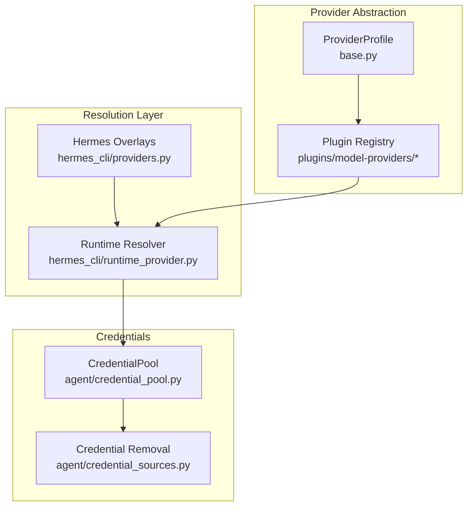
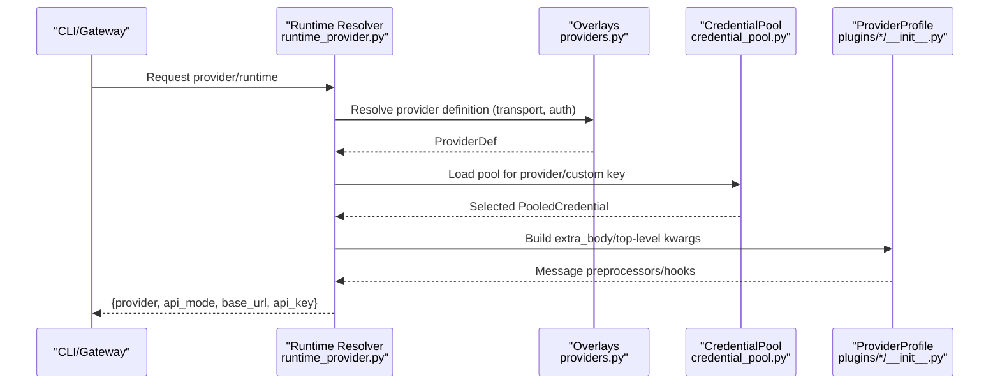
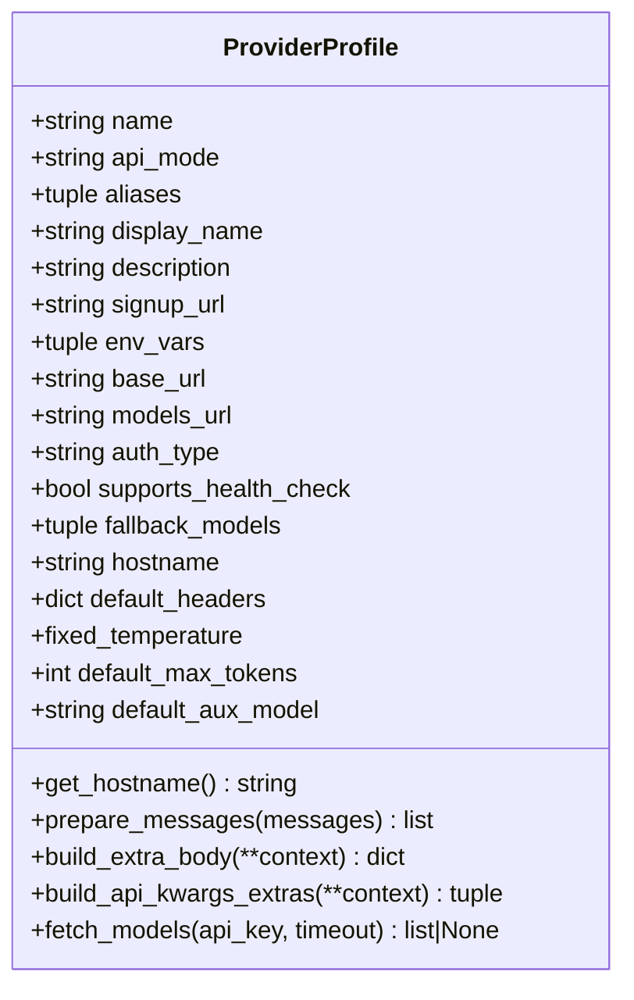
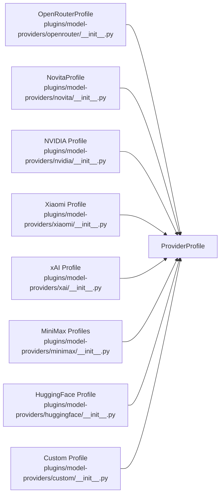
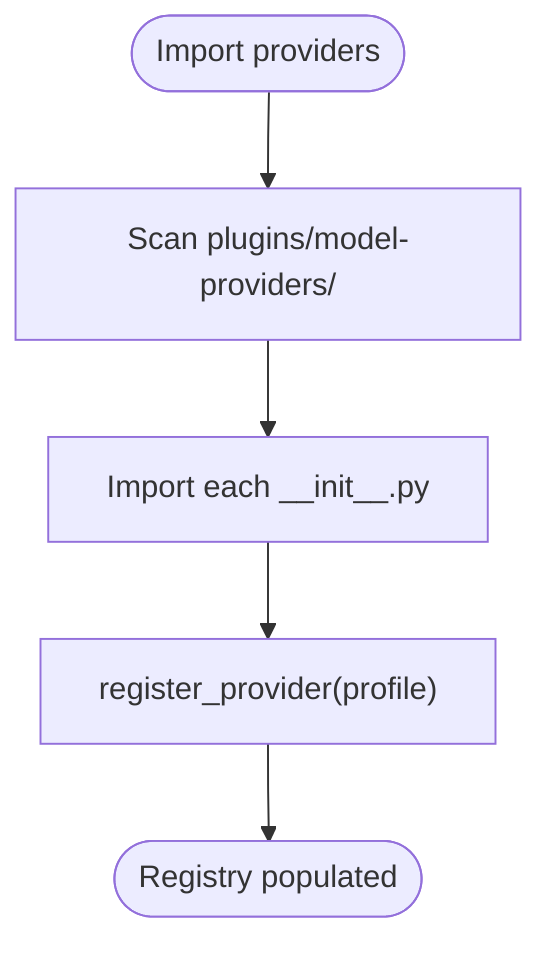
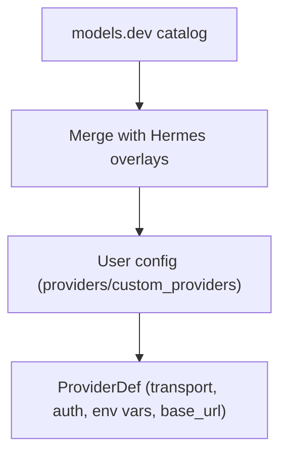
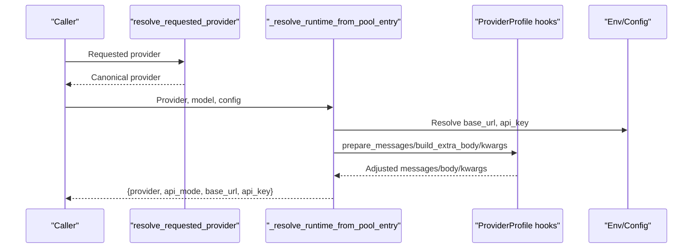
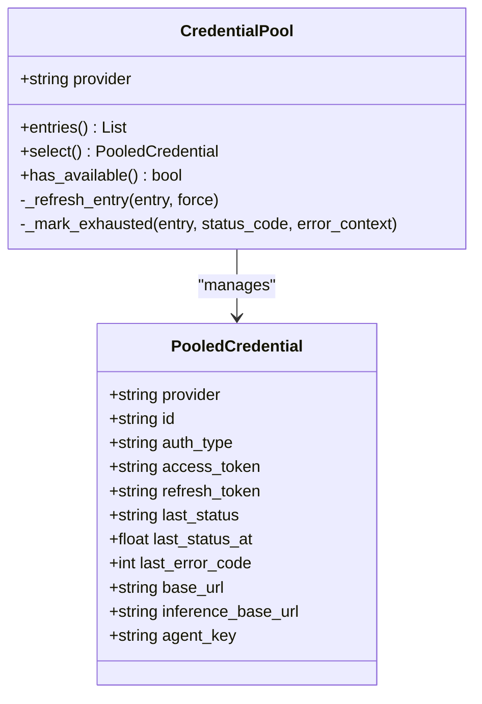
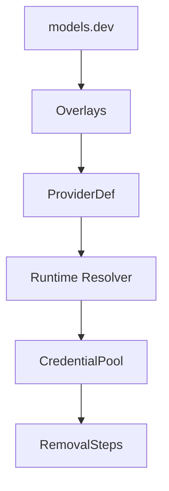

# Model Providers

<cite>
**Referenced Files in This Document**
- [providers/base.py](file://providers/base.py)
- [plugins/model-providers/README.md](file://plugins/model-providers/README.md)
- [plugins/model-providers/openrouter/__init__.py](file://plugins/model-providers/openrouter/__init__.py)
- [plugins/model-providers/novita/__init__.py](file://plugins/model-providers/novita/__init__.py)
- [plugins/model-providers/nvidia/__init__.py](file://plugins/model-providers/nvidia/__init__.py)
- [plugins/model-providers/xiaomi/__init__.py](file://plugins/model-providers/xiaomi/__init__.py)
- [plugins/model-providers/xai/__init__.py](file://plugins/model-providers/xai/__init__.py)
- [plugins/model-providers/minimax/__init__.py](file://plugins/model-providers/minimax/__init__.py)
- [plugins/model-providers/huggingface/__init__.py](file://plugins/model-providers/huggingface/__init__.py)
- [plugins/model-providers/custom/__init__.py](file://plugins/model-providers/custom/__init__.py)
- [hermes_cli/providers.py](file://hermes_cli/providers.py)
- [hermes_cli/runtime_provider.py](file://hermes_cli/runtime_provider.py)
- [agent/credential_pool.py](file://agent/credential_pool.py)
- [agent/credential_sources.py](file://agent/credential_sources.py)
</cite>

## Table of Contents
1. [Introduction](#introduction)
2. [Project Structure](#project-structure)
3. [Core Components](#core-components)
4. [Architecture Overview](#architecture-overview)
5. [Detailed Component Analysis](#detailed-component-analysis)
6. [Dependency Analysis](#dependency-analysis)
7. [Performance Considerations](#performance-considerations)
8. [Troubleshooting Guide](#troubleshooting-guide)
9. [Conclusion](#conclusion)
10. [Appendices](#appendices)

## Introduction
This document explains the Model Provider Integration that enables universal compatibility across 200+ models from diverse providers. It covers the provider abstraction layer, authentication and credential management, configuration and runtime resolution, adapter pattern usage, rate-limiting and quota handling, and fallback strategies. It also documents provider-specific settings, API key management, endpoint configuration, and custom provider setup procedures, with practical examples for switching providers and models, and handling provider-specific features.

## Project Structure
The provider integration spans a few core areas:
- Provider profiles and discovery: a declarative ProviderProfile base class and a plugin-based registry for built-in and user-defined providers.
- Provider overlays and resolution: a consolidated provider definition with transport, auth type, and environment variables.
- Runtime provider resolution: logic to pick the right provider, API mode, base URL, and API key at runtime.
- Credential pooling and removal: multi-credential management with failover, refresh, and secure removal.

**Diagram sources**
- [providers/base.py:39-185](file://providers/base.py#L39-L185)
- [plugins/model-providers/README.md:17-62](file://plugins/model-providers/README.md#L17-L62)
- [hermes_cli/providers.py:46-213](file://hermes_cli/providers.py#L46-L213)
- [hermes_cli/runtime_provider.py:357-729](file://hermes_cli/runtime_provider.py#L357-L729)
- [agent/credential_pool.py:389-764](file://agent/credential_pool.py#L389-L764)
- [agent/credential_sources.py:112-448](file://agent/credential_sources.py#L112-L448)

**Section sources**
- [plugins/model-providers/README.md:17-62](file://plugins/model-providers/README.md#L17-L62)
- [hermes_cli/providers.py:408-475](file://hermes_cli/providers.py#L408-L475)
- [hermes_cli/runtime_provider.py:357-729](file://hermes_cli/runtime_provider.py#L357-L729)
- [agent/credential_pool.py:389-764](file://agent/credential_pool.py#L389-L764)
- [agent/credential_sources.py:112-448](file://agent/credential_sources.py#L112-L448)

## Core Components
- ProviderProfile: Declarative description of a provider’s identity, auth, endpoints, quirks, and catalog probing behavior. It defines hooks for message preprocessing, extra request fields, and reasoning config placement.
- Plugin-based provider registry: Each provider is a self-contained plugin that registers a ProviderProfile. Discovery scans built-in and user-overridable locations.
- Hermes overlays: Additional metadata layered on top of the models catalog (transport, auth type, base URL env vars).
- Runtime provider resolution: Determines provider, API mode, base URL, and API key from CLI/config/env/pool, with URL heuristics and explicit overrides.
- Credential pooling: Multi-credential storage with strategies, exhaustion tracking, refresh, and synchronization across OAuth single-use tokens.

**Section sources**
- [providers/base.py:39-185](file://providers/base.py#L39-L185)
- [plugins/model-providers/README.md:17-62](file://plugins/model-providers/README.md#L17-L62)
- [hermes_cli/providers.py:46-213](file://hermes_cli/providers.py#L46-L213)
- [hermes_cli/runtime_provider.py:357-729](file://hermes_cli/runtime_provider.py#L357-L729)
- [agent/credential_pool.py:389-764](file://agent/credential_pool.py#L389-L764)

## Architecture Overview
The provider integration follows an adapter-like pattern: ProviderProfile encapsulates provider specifics, Hermes overlays supply transport and auth metadata, and runtime resolution selects the appropriate endpoint and credentials. The credential pool provides robust failover and refresh for OAuth and API-key providers.

**Diagram sources**
- [hermes_cli/runtime_provider.py:357-729](file://hermes_cli/runtime_provider.py#L357-L729)
- [hermes_cli/providers.py:408-475](file://hermes_cli/providers.py#L408-L475)
- [agent/credential_pool.py:389-764](file://agent/credential_pool.py#L389-L764)
- [plugins/model-providers/openrouter/__init__.py:14-116](file://plugins/model-providers/openrouter/__init__.py#L14-L116)

## Detailed Component Analysis

### Provider Abstraction Layer (ProviderProfile)
ProviderProfile is the central abstraction for a provider. It declares:
- Identity: name, api_mode, aliases
- Metadata: display_name, description, signup_url
- Auth and endpoints: env_vars, base_url, models_url, auth_type, health-check toggle
- Catalog: fallback_models and hostname derivation
- Client/request quirks: default headers, fixed_temperature, default_max_tokens, default_aux_model
- Hooks: prepare_messages, build_extra_body, build_api_kwargs_extras, fetch_models

Key behaviors:
- fetch_models probes the provider’s models endpoint, with sensible defaults and a stable user-agent to bypass WAFs.
- Subclasses override hooks to handle provider-specific quirks (e.g., reasoning config placement).

**Diagram sources**
- [providers/base.py:39-185](file://providers/base.py#L39-L185)

**Section sources**
- [providers/base.py:39-185](file://providers/base.py#L39-L185)

### Built-in Provider Profiles
Built-in providers are implemented as self-contained plugins. Each registers a ProviderProfile with:
- name, aliases, env_vars, base_url, auth_type, and optional overrides like default_aux_model and fallback_models.

Examples:
- OpenRouter: aggregator with reasoning passthrough and provider preferences.
- NovitaAI: OpenAI-compatible endpoint with fallback models.
- NVIDIA NIM: OpenAI-compatible with default_max_tokens.
- Xiaomi MiMo: OpenAI-compatible with health checks disabled.
- xAI: Codex Responses API with api_mode set accordingly.
- MiniMax: Anthropic Messages with multiple variants (API key and OAuth).
- Hugging Face: Router endpoint with fallback models.
- Custom: Local endpoints (including Ollama) with context/window and reasoning toggles.

**Diagram sources**
- [plugins/model-providers/openrouter/__init__.py:14-116](file://plugins/model-providers/openrouter/__init__.py#L14-L116)
- [plugins/model-providers/novita/__init__.py:7-27](file://plugins/model-providers/novita/__init__.py#L7-L27)
- [plugins/model-providers/nvidia/__init__.py:6-21](file://plugins/model-providers/nvidia/__init__.py#L6-L21)
- [plugins/model-providers/xiaomi/__init__.py:6-14](file://plugins/model-providers/xiaomi/__init__.py#L6-L14)
- [plugins/model-providers/xai/__init__.py:6-15](file://plugins/model-providers/xai/__init__.py#L6-L15)
- [plugins/model-providers/minimax/__init__.py:10-45](file://plugins/model-providers/minimax/__init__.py#L10-L45)
- [plugins/model-providers/huggingface/__init__.py:6-20](file://plugins/model-providers/huggingface/__init__.py#L6-L20)
- [plugins/model-providers/custom/__init__.py:15-68](file://plugins/model-providers/custom/__init__.py#L15-L68)

**Section sources**
- [plugins/model-providers/openrouter/__init__.py:14-116](file://plugins/model-providers/openrouter/__init__.py#L14-L116)
- [plugins/model-providers/novita/__init__.py:7-27](file://plugins/model-providers/novita/__init__.py#L7-L27)
- [plugins/model-providers/nvidia/__init__.py:6-21](file://plugins/model-providers/nvidia/__init__.py#L6-L21)
- [plugins/model-providers/xiaomi/__init__.py:6-14](file://plugins/model-providers/xiaomi/__init__.py#L6-L14)
- [plugins/model-providers/xai/__init__.py:6-15](file://plugins/model-providers/xai/__init__.py#L6-L15)
- [plugins/model-providers/minimax/__init__.py:10-45](file://plugins/model-providers/minimax/__init__.py#L10-L45)
- [plugins/model-providers/huggingface/__init__.py:6-20](file://plugins/model-providers/huggingface/__init__.py#L6-L20)
- [plugins/model-providers/custom/__init__.py:15-68](file://plugins/model-providers/custom/__init__.py#L15-L68)

### Provider Discovery and Registration
Discovery scans built-in and user-overridable plugin directories and registers ProviderProfile instances. Users can drop custom plugins to override built-ins.

**Diagram sources**
- [plugins/model-providers/README.md:17-27](file://plugins/model-providers/README.md#L17-L27)

**Section sources**
- [plugins/model-providers/README.md:17-27](file://plugins/model-providers/README.md#L17-L27)

### Provider Overlays and Resolution
Hermes overlays define transport, auth type, and base URL environment variables for providers not in the catalog. The resolver merges models catalog, overlays, and user config to produce a ProviderDef.

**Diagram sources**
- [hermes_cli/providers.py:46-213](file://hermes_cli/providers.py#L46-L213)
- [hermes_cli/providers.py:408-475](file://hermes_cli/providers.py#L408-L475)

**Section sources**
- [hermes_cli/providers.py:46-213](file://hermes_cli/providers.py#L46-L213)
- [hermes_cli/providers.py:408-475](file://hermes_cli/providers.py#L408-L475)

### Runtime Provider Resolution
The runtime resolver:
- Normalizes provider names and aliases
- Selects provider from explicit request, config, or environment
- Determines API mode from provider, URL heuristics, or config
- Resolves base URL and API key from pool, env, or config
- Applies provider-specific adjustments (e.g., stripping /v1 for Anthropic-style endpoints)

**Diagram sources**
- [hermes_cli/runtime_provider.py:357-729](file://hermes_cli/runtime_provider.py#L357-L729)
- [plugins/model-providers/openrouter/__init__.py:42-94](file://plugins/model-providers/openrouter/__init__.py#L42-L94)

**Section sources**
- [hermes_cli/runtime_provider.py:357-729](file://hermes_cli/runtime_provider.py#L357-L729)
- [plugins/model-providers/openrouter/__init__.py:42-94](file://plugins/model-providers/openrouter/__init__.py#L42-L94)

### Authentication and Credential Management
CredentialPool maintains multiple credentials per provider, with strategies and exhaustion tracking. It supports OAuth refresh and synchronization across external credential files. RemovalSteps unify credential removal across sources.

**Diagram sources**
- [agent/credential_pool.py:389-764](file://agent/credential_pool.py#L389-L764)

**Section sources**
- [agent/credential_pool.py:389-764](file://agent/credential_pool.py#L389-L764)
- [agent/credential_sources.py:112-448](file://agent/credential_sources.py#L112-L448)

### Adapter Pattern Implementation
ProviderProfile acts as an adapter around provider differences:
- Hooks encapsulate provider-specific message preprocessing and request shaping.
- Subclasses override to translate higher-level concepts (e.g., reasoning config) into provider-specific fields.

Examples:
- OpenRouterProfile: attaches provider preferences and reasoning config to extra_body; adds x-grok-conv-id header for xAI Grok.
- CustomProfile: maps ollama_num_ctx to extra_body.options and disables reasoning when effort is “none”.

**Section sources**
- [plugins/model-providers/openrouter/__init__.py:42-94](file://plugins/model-providers/openrouter/__init__.py#L42-L94)
- [plugins/model-providers/custom/__init__.py:18-40](file://plugins/model-providers/custom/__init__.py#L18-L40)

### Rate Limiting and Quota Management
The credential pool tracks exhaustion and resets:
- Exhaustion TTLs vary by HTTP status (e.g., 5 minutes for 401, 1 hour for 429/default).
- Error contexts can include provider-supplied reset timestamps or retry hints; these are normalized and used to compute exhaustion windows.
- OAuth refresh is attempted when applicable, and tokens are synchronized across external files.

Operational notes:
- Single-use refresh tokens are detected and synced to prevent “refresh token reused” errors.
- Provider-specific reset-at parsing supports absolute timestamps and retry hints.

**Section sources**
- [agent/credential_pool.py:199-284](file://agent/credential_pool.py#L199-L284)
- [agent/credential_pool.py:251-273](file://agent/credential_pool.py#L251-L273)
- [agent/credential_pool.py:447-604](file://agent/credential_pool.py#L447-L604)

### Fallback and Failover Strategies
- Provider catalog probing falls back to static fallback_models when live fetch fails.
- For custom endpoints, the pool can be keyed by name or base_url; when multiple custom providers share a base_url, name matching is preferred to avoid credential mix-ups.
- Runtime honors persisted api_mode only when the configured provider matches the runtime provider to prevent stale modes from leaking across providers.

**Section sources**
- [providers/base.py:132-185](file://providers/base.py#L132-L185)
- [agent/credential_pool.py:318-345](file://agent/credential_pool.py#L318-L345)
- [hermes_cli/runtime_provider.py:136-151](file://hermes_cli/runtime_provider.py#L136-L151)

### Provider-Specific Settings and Configuration
- OpenRouter: supports provider preferences and reasoning passthrough; uses a public catalog endpoint.
- NovitaAI: OpenAI-compatible base URL with fallback models.
- NVIDIA NIM: OpenAI-compatible base URL with default_max_tokens.
- Xiaomi MiMo: OpenAI-compatible base URL; health checks disabled.
- xAI: Codex Responses API with api_mode set accordingly.
- MiniMax: Anthropic Messages with variants for API key and OAuth.
- Hugging Face: Router endpoint with fallback models.
- Custom: Supports local endpoints (including Ollama) with context/window and reasoning toggles.

**Section sources**
- [plugins/model-providers/openrouter/__init__.py:14-116](file://plugins/model-providers/openrouter/__init__.py#L14-L116)
- [plugins/model-providers/novita/__init__.py:7-27](file://plugins/model-providers/novita/__init__.py#L7-L27)
- [plugins/model-providers/nvidia/__init__.py:6-21](file://plugins/model-providers/nvidia/__init__.py#L6-L21)
- [plugins/model-providers/xiaomi/__init__.py:6-14](file://plugins/model-providers/xiaomi/__init__.py#L6-L14)
- [plugins/model-providers/xai/__init__.py:6-15](file://plugins/model-providers/xai/__init__.py#L6-L15)
- [plugins/model-providers/minimax/__init__.py:10-45](file://plugins/model-providers/minimax/__init__.py#L10-L45)
- [plugins/model-providers/huggingface/__init__.py:6-20](file://plugins/model-providers/huggingface/__init__.py#L6-L20)
- [plugins/model-providers/custom/__init__.py:15-68](file://plugins/model-providers/custom/__init__.py#L15-L68)

### Practical Examples
- Configure a provider:
  - Add environment variables for the provider’s env_vars.
  - Optionally set a base URL via the provider’s base_url_env_var.
  - Use the provider’s aliases for quick selection.
- Switch between models:
  - Change model.default in config.yaml; runtime resolver auto-detects API mode for known providers and URL heuristics.
- Use custom endpoints:
  - Define providers: or custom_providers: entries with api/url/base_url and optional key_env.
  - For local servers without auth, the runtime may inject a placeholder API key when appropriate.

**Section sources**
- [hermes_cli/providers.py:46-213](file://hermes_cli/providers.py#L46-L213)
- [hermes_cli/runtime_provider.py:541-621](file://hermes_cli/runtime_provider.py#L541-L621)
- [plugins/model-providers/custom/__init__.py:15-68](file://plugins/model-providers/custom/__init__.py#L15-L68)

### Model Metadata, Context Length, and Performance
- ProviderProfile supports default_max_tokens and default_aux_model to optimize performance and reduce auxiliary costs.
- URL heuristics detect Anthropic Messages and Codex Responses endpoints to select the correct API mode automatically.
- For OpenCode Zen and similar providers behind WAFs, a stable user-agent is used when probing catalogs.

**Section sources**
- [providers/base.py:74-77](file://providers/base.py#L74-L77)
- [providers/base.py:24-35](file://providers/base.py#L24-L35)
- [hermes_cli/runtime_provider.py:64-88](file://hermes_cli/runtime_provider.py#L64-L88)

## Dependency Analysis
Provider resolution depends on:
- models catalog and overlays for canonical provider definitions
- plugin registry for provider-specific quirks
- credential pool for multi-key and OAuth failover
- environment/config for base URLs and API keys

**Diagram sources**
- [hermes_cli/providers.py:408-475](file://hermes_cli/providers.py#L408-L475)
- [hermes_cli/runtime_provider.py:357-729](file://hermes_cli/runtime_provider.py#L357-L729)
- [agent/credential_pool.py:389-764](file://agent/credential_pool.py#L389-L764)
- [agent/credential_sources.py:112-448](file://agent/credential_sources.py#L112-L448)

**Section sources**
- [hermes_cli/providers.py:408-475](file://hermes_cli/providers.py#L408-L475)
- [hermes_cli/runtime_provider.py:357-729](file://hermes_cli/runtime_provider.py#L357-L729)
- [agent/credential_pool.py:389-764](file://agent/credential_pool.py#L389-L764)
- [agent/credential_sources.py:112-448](file://agent/credential_sources.py#L112-L448)

## Performance Considerations
- Prefer provider-specific base URLs and env vars to minimize retries and misrouting.
- Use default_max_tokens and default_aux_model to bound context and reduce auxiliary calls.
- Leverage URL heuristics to avoid unnecessary mode switches.
- For local endpoints, enable auto-detection of a single loaded model to reduce manual configuration.

[No sources needed since this section provides general guidance]

## Troubleshooting Guide
Common issues and remedies:
- Provider not recognized:
  - Verify alias normalization and that the provider is registered in the plugin directory.
- Authentication failures:
  - Confirm env_vars and base_url_env_var are set; for OAuth providers, ensure tokens are fresh and not single-use.
- Rate limits and quotas:
  - Monitor exhaustion TTLs and reset timestamps; the pool marks entries exhausted and delays retries accordingly.
- Custom endpoint credential mix-ups:
  - When multiple custom providers share a base_url, prefer matching by name to avoid mixing credentials.
- Connectivity problems:
  - For providers behind WAFs, ensure the catalog probe uses a stable user-agent.

**Section sources**
- [plugins/model-providers/README.md:17-27](file://plugins/model-providers/README.md#L17-L27)
- [agent/credential_pool.py:199-284](file://agent/credential_pool.py#L199-L284)
- [agent/credential_pool.py:318-345](file://agent/credential_pool.py#L318-L345)
- [providers/base.py:24-35](file://providers/base.py#L24-L35)

## Conclusion
The Model Provider Integration provides a robust, extensible framework for supporting hundreds of models across diverse providers. Through ProviderProfile, Hermes overlays, and runtime resolution, it abstracts provider differences, manages credentials securely, and optimizes performance. The adapter pattern and plugin-based registry make adding new providers straightforward, while the credential pool and removal steps ensure reliable, secure, and maintainable operations.

[No sources needed since this section summarizes without analyzing specific files]

## Appendices

### Security Considerations and Best Practices
- Prefer environment variables for secrets and avoid embedding them in code or config files.
- Use provider-specific base URLs and env vars to limit credential leakage.
- For OAuth providers, keep refresh tokens synchronized and avoid replaying consumed tokens.
- Remove credentials cleanly using RemovalSteps to prevent re-seeding.

**Section sources**
- [agent/credential_sources.py:112-448](file://agent/credential_sources.py#L112-L448)
- [agent/credential_pool.py:447-604](file://agent/credential_pool.py#L447-L604)