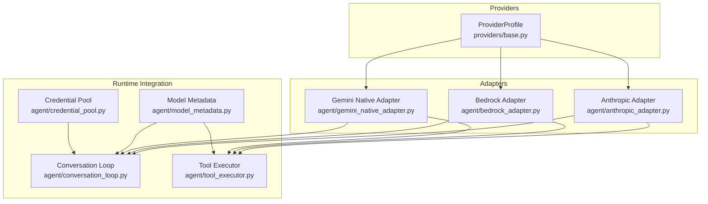
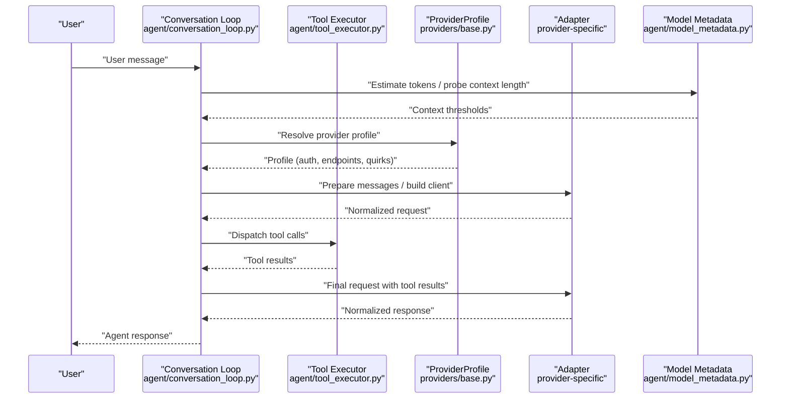
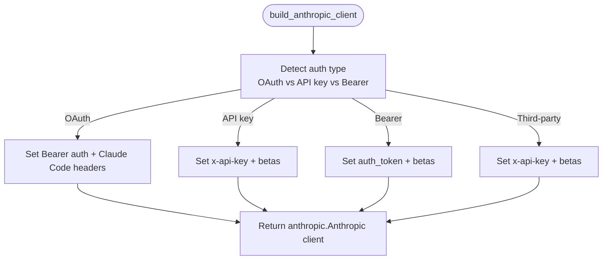
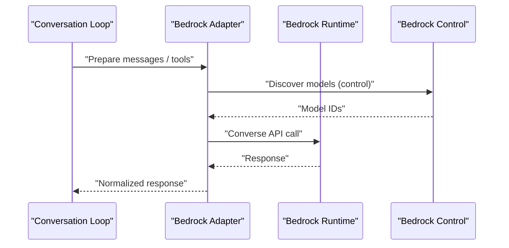
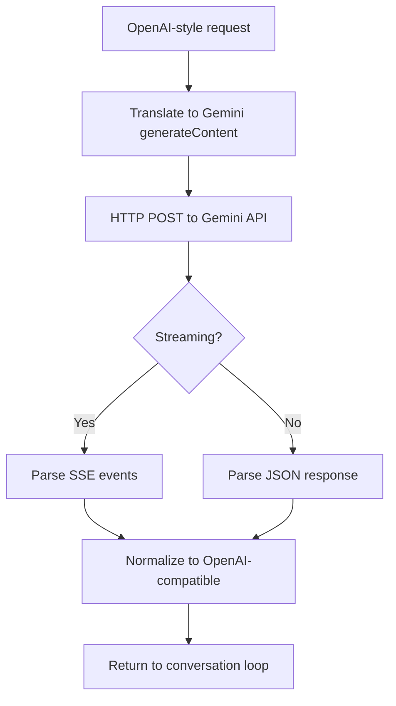
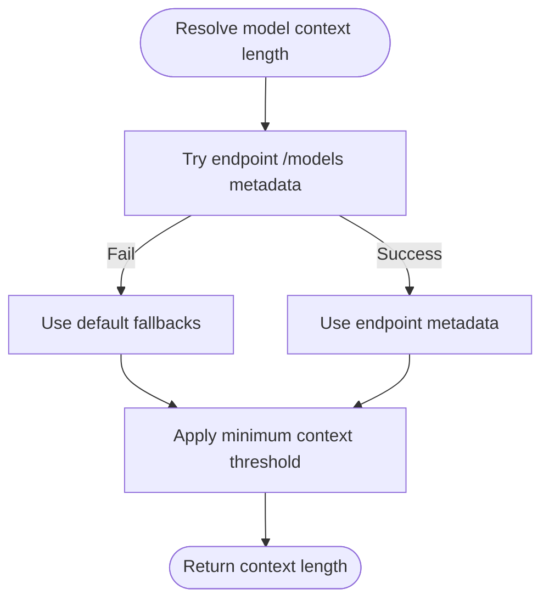
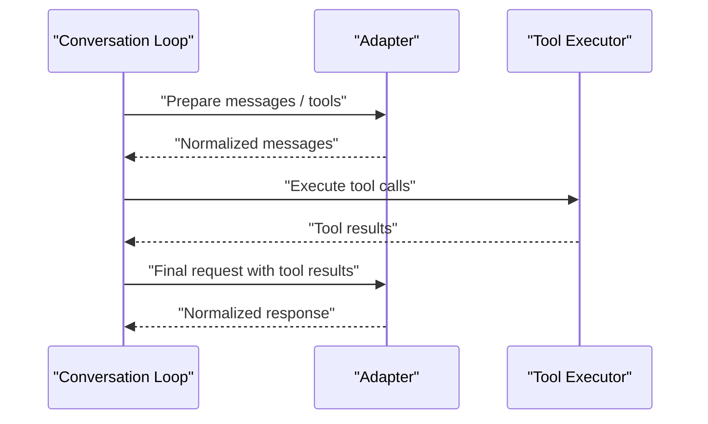
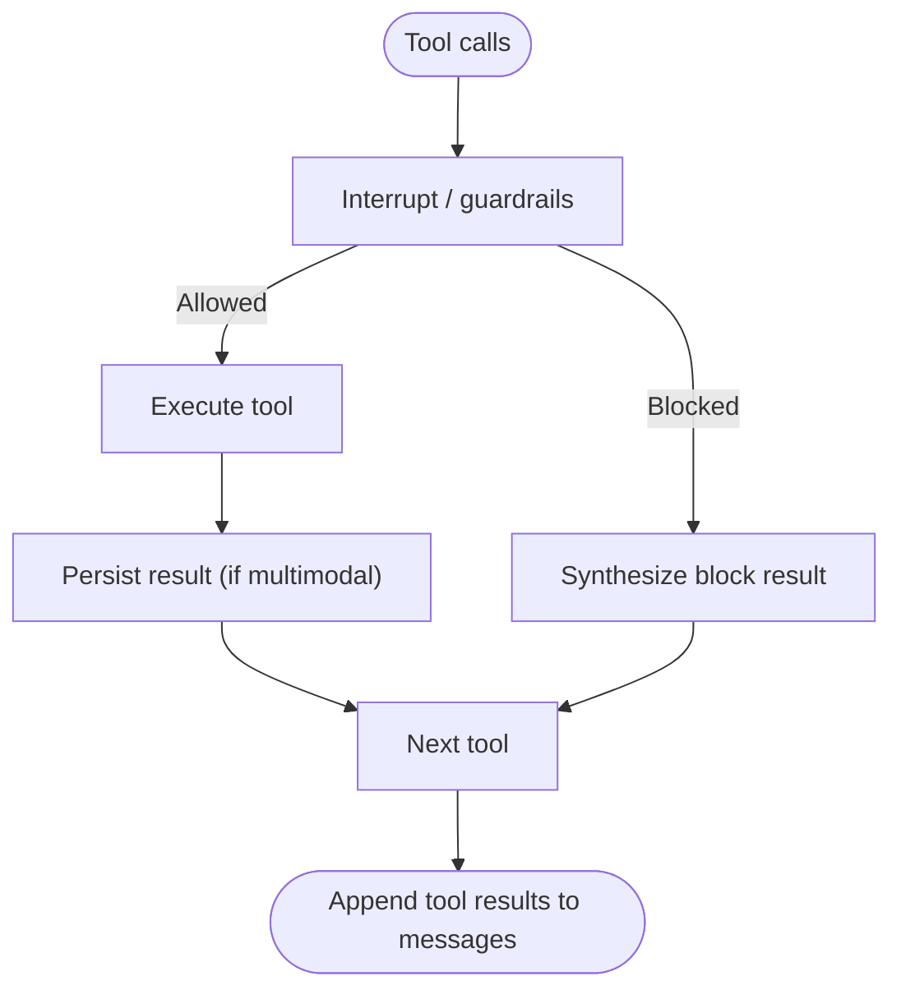
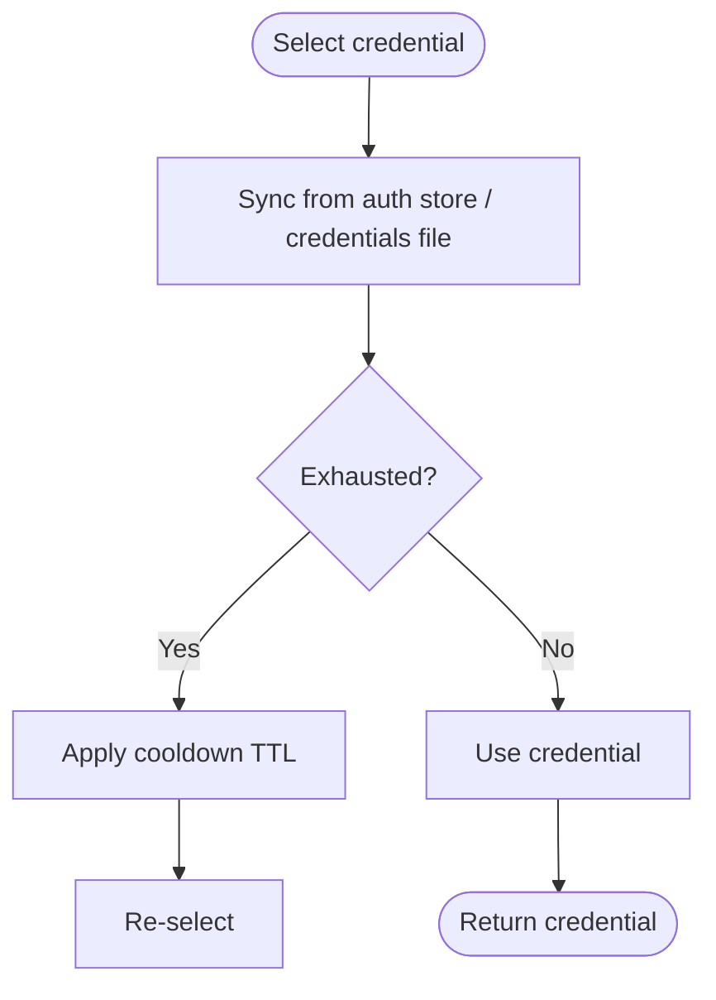
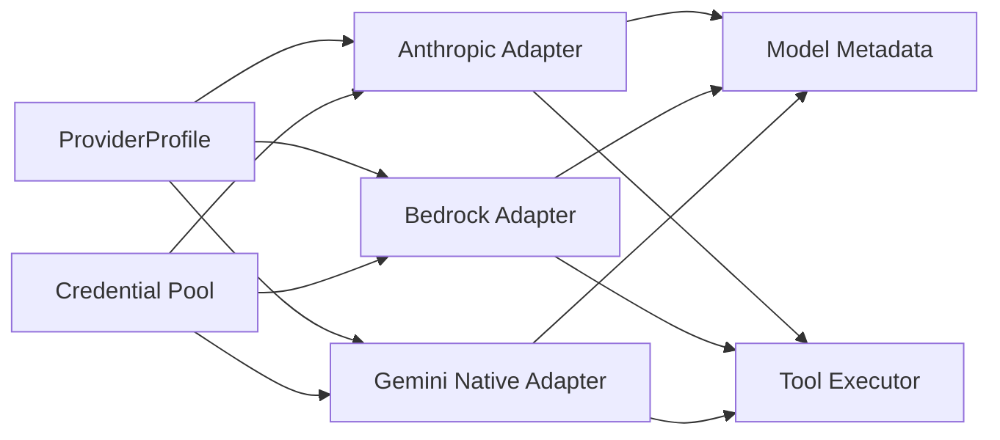

# Provider Abstraction Layer

<cite>
**Referenced Files in This Document**
- [providers/base.py](file://providers/base.py)
- [agent/anthropic_adapter.py](file://agent/anthropic_adapter.py)
- [agent/bedrock_adapter.py](file://agent/bedrock_adapter.py)
- [agent/gemini_native_adapter.py](file://agent/gemini_native_adapter.py)
- [agent/model_metadata.py](file://agent/model_metadata.py)
- [agent/conversation_loop.py](file://agent/conversation_loop.py)
- [agent/tool_executor.py](file://agent/tool_executor.py)
- [agent/credential_pool.py](file://agent/credential_pool.py)
</cite>

## Table of Contents
1. [Introduction](#introduction)
2. [Project Structure](#project-structure)
3. [Core Components](#core-components)
4. [Architecture Overview](#architecture-overview)
5. [Detailed Component Analysis](#detailed-component-analysis)
6. [Dependency Analysis](#dependency-analysis)
7. [Performance Considerations](#performance-considerations)
8. [Troubleshooting Guide](#troubleshooting-guide)
9. [Conclusion](#conclusion)

## Introduction
This document explains the Provider Abstraction Layer that enables universal compatibility across 200+ models. It focuses on the adapter pattern implementation that isolates provider-specific logic, allowing seamless switching between different model providers. The layer centers around declarative provider profiles, client builders, authentication handlers, and request/response transformations. It also documents how model metadata, context length management, and provider-specific features are handled, along with practical guidance for implementing new providers, extending adapters, and integrating with the broader agent runtime.

## Project Structure
The Provider Abstraction Layer spans several modules:
- providers/base.py defines the ProviderProfile abstraction used by adapters and the runtime to unify provider behavior.
- Adapter modules encapsulate provider-specific logic for Anthropic, AWS Bedrock, and Google Gemini.
- agent/model_metadata.py centralizes model metadata, context length detection, and endpoint probing.
- agent/conversation_loop.py orchestrates the agent loop and integrates with adapters and tool execution.
- agent/tool_executor.py executes tools concurrently or sequentially, interacting with adapters and providers.
- agent/credential_pool.py manages multi-credential pools and failover strategies.

**Diagram sources**
- [providers/base.py:39-185](file://providers/base.py#L39-L185)
- [agent/anthropic_adapter.py:522-621](file://agent/anthropic_adapter.py#L522-L621)
- [agent/bedrock_adapter.py:74-117](file://agent/bedrock_adapter.py#L74-L117)
- [agent/gemini_native_adapter.py:379-800](file://agent/gemini_native_adapter.py#L379-L800)
- [agent/conversation_loop.py:85-131](file://agent/conversation_loop.py#L85-L131)
- [agent/tool_executor.py:64-93](file://agent/tool_executor.py#L64-L93)
- [agent/model_metadata.py:611-788](file://agent/model_metadata.py#L611-L788)
- [agent/credential_pool.py:389-446](file://agent/credential_pool.py#L389-L446)

**Section sources**
- [providers/base.py:1-185](file://providers/base.py#L1-L185)
- [agent/anthropic_adapter.py:1-200](file://agent/anthropic_adapter.py#L1-L200)
- [agent/bedrock_adapter.py:1-120](file://agent/bedrock_adapter.py#L1-L120)
- [agent/gemini_native_adapter.py:1-120](file://agent/gemini_native_adapter.py#L1-L120)
- [agent/model_metadata.py:1-120](file://agent/model_metadata.py#L1-L120)
- [agent/conversation_loop.py:1-120](file://agent/conversation_loop.py#L1-L120)
- [agent/tool_executor.py:1-120](file://agent/tool_executor.py#L1-L120)
- [agent/credential_pool.py:1-120](file://agent/credential_pool.py#L1-L120)

## Core Components
- ProviderProfile: Declarative specification of provider identity, endpoints, auth types, quirks, and hooks for message transformation and model catalog fetching.
- Adapters: Provider-specific translators for messages, tools, and responses; client builders; auth handling; and feature-specific logic.
- Model Metadata: Centralized utilities for context length detection, endpoint probing, and pricing metadata.
- Conversation Loop: Orchestrates turns, integrates adapters, and coordinates tool execution.
- Tool Executor: Executes tools concurrently or sequentially, respecting interrupts and guardrails.
- Credential Pool: Manages multi-credential failover and refresh strategies.

**Section sources**
- [providers/base.py:39-185](file://providers/base.py#L39-L185)
- [agent/anthropic_adapter.py:522-621](file://agent/anthropic_adapter.py#L522-L621)
- [agent/bedrock_adapter.py:74-117](file://agent/bedrock_adapter.py#L74-L117)
- [agent/gemini_native_adapter.py:379-800](file://agent/gemini_native_adapter.py#L379-L800)
- [agent/model_metadata.py:611-788](file://agent/model_metadata.py#L611-L788)
- [agent/conversation_loop.py:85-131](file://agent/conversation_loop.py#L85-L131)
- [agent/tool_executor.py:64-93](file://agent/tool_executor.py#L64-L93)
- [agent/credential_pool.py:389-446](file://agent/credential_pool.py#L389-L446)

## Architecture Overview
The Provider Abstraction Layer follows an adapter pattern:
- ProviderProfile describes provider behavior declaratively.
- Adapters translate between the agent’s internal OpenAI-style format and provider-specific APIs.
- Model metadata and context length utilities inform preflight checks and runtime decisions.
- The conversation loop and tool executor integrate with adapters and providers to deliver a unified experience.

**Diagram sources**
- [agent/conversation_loop.py:85-131](file://agent/conversation_loop.py#L85-L131)
- [agent/tool_executor.py:64-93](file://agent/tool_executor.py#L64-L93)
- [providers/base.py:39-185](file://providers/base.py#L39-L185)
- [agent/model_metadata.py:611-788](file://agent/model_metadata.py#L611-L788)
- [agent/anthropic_adapter.py:522-621](file://agent/anthropic_adapter.py#L522-L621)
- [agent/bedrock_adapter.py:74-117](file://agent/bedrock_adapter.py#L74-L117)
- [agent/gemini_native_adapter.py:379-800](file://agent/gemini_native_adapter.py#L379-L800)

## Detailed Component Analysis

### ProviderProfile Abstraction
ProviderProfile is the core declarative contract for providers:
- Identity and metadata: name, api_mode, aliases, display_name, description, signup_url.
- Auth and endpoints: env_vars, base_url, models_url, auth_type, supports_health_check.
- Catalog and hostname: fallback_models, hostname derivation.
- Client and request quirks: default_headers, fixed_temperature, default_max_tokens, default_aux_model.
- Hooks: prepare_messages, build_extra_body, build_api_kwargs_extras, fetch_models.

Key behaviors:
- fetch_models probes provider catalogs using a stable user agent and merges default headers.
- prepare_messages and build_api_kwargs_extras enable provider-specific normalization and parameter routing.

**Section sources**
- [providers/base.py:39-185](file://providers/base.py#L39-L185)

### Anthropic Adapter
The Anthropic adapter translates between Hermes’s internal format and the Anthropic Messages API:
- Lazy SDK loading for the anthropic package to reduce cold-start overhead.
- Client builders:
  - build_anthropic_client: auto-detects OAuth vs API key, sets betas, handles special endpoints (Kimi, Bearer auth).
  - build_anthropic_bedrock_client: uses AnthropicBedrock SDK for full feature parity on Bedrock.
- Message and tool handling:
  - Provider-specific message preprocessing and reasoning content handling.
  - Model capability detection (adaptive thinking, xhigh effort, fast mode, sampling params).
- Authentication:
  - OAuth token detection and Claude Code identity headers.
  - Refresh flows and credential sources (macOS Keychain, JSON file).

**Diagram sources**
- [agent/anthropic_adapter.py:522-621](file://agent/anthropic_adapter.py#L522-L621)

**Section sources**
- [agent/anthropic_adapter.py:34-621](file://agent/anthropic_adapter.py#L34-L621)

### AWS Bedrock Adapter
The Bedrock adapter integrates via the Converse API:
- Lazy boto3 import and client caching for regions.
- Client helpers for runtime and control clients; stale connection detection and recovery.
- Credential detection and region resolution.
- Message and tool conversion between OpenAI and Bedrock schemas.
- Response normalization and streaming support.

**Diagram sources**
- [agent/bedrock_adapter.py:74-117](file://agent/bedrock_adapter.py#L74-L117)
- [agent/bedrock_adapter.py:335-352](file://agent/bedrock_adapter.py#L335-L352)
- [agent/bedrock_adapter.py:493-609](file://agent/bedrock_adapter.py#L493-L609)
- [agent/bedrock_adapter.py:629-702](file://agent/bedrock_adapter.py#L629-L702)

**Section sources**
- [agent/bedrock_adapter.py:1-200](file://agent/bedrock_adapter.py#L1-L200)
- [agent/bedrock_adapter.py:335-352](file://agent/bedrock_adapter.py#L335-L352)
- [agent/bedrock_adapter.py:493-609](file://agent/bedrock_adapter.py#L493-L609)
- [agent/bedrock_adapter.py:629-702](file://agent/bedrock_adapter.py#L629-L702)

### Google Gemini Native Adapter
The Gemini adapter provides a native REST transport over Google AI Studio:
- Native endpoint detection and tier probing.
- Request translation from OpenAI-style to Gemini’s generateContent schema.
- Response normalization and streaming event parsing.
- Error handling with structured GeminiAPIError.

**Diagram sources**
- [agent/gemini_native_adapter.py:388-427](file://agent/gemini_native_adapter.py#L388-L427)
- [agent/gemini_native_adapter.py:474-540](file://agent/gemini_native_adapter.py#L474-L540)
- [agent/gemini_native_adapter.py:593-697](file://agent/gemini_native_adapter.py#L593-L697)

**Section sources**
- [agent/gemini_native_adapter.py:1-200](file://agent/gemini_native_adapter.py#L1-L200)
- [agent/gemini_native_adapter.py:388-427](file://agent/gemini_native_adapter.py#L388-L427)
- [agent/gemini_native_adapter.py:474-540](file://agent/gemini_native_adapter.py#L474-L540)
- [agent/gemini_native_adapter.py:593-697](file://agent/gemini_native_adapter.py#L593-L697)

### Model Metadata and Context Length Management
Model metadata utilities:
- Provider-to-base_url mapping and URL-to-provider resolution.
- Endpoint model metadata fetching with caching and local server detection.
- Context length probing with fallback tiers and minimum thresholds.
- Pricing metadata extraction and caching.

**Diagram sources**
- [agent/model_metadata.py:611-788](file://agent/model_metadata.py#L611-L788)
- [agent/model_metadata.py:114-133](file://agent/model_metadata.py#L114-L133)

**Section sources**
- [agent/model_metadata.py:1-200](file://agent/model_metadata.py#L1-L200)
- [agent/model_metadata.py:331-411](file://agent/model_metadata.py#L331-L411)
- [agent/model_metadata.py:611-788](file://agent/model_metadata.py#L611-L788)
- [agent/model_metadata.py:114-133](file://agent/model_metadata.py#L114-L133)

### Conversation Loop Integration
The conversation loop:
- Prepares messages, sanitizes tool calls, and injects ephemeral context.
- Applies prompt caching for providers supporting it.
- Integrates with adapters for provider-specific normalization and reasoning continuity.
- Coordinates tool execution and handles interruptions.

**Diagram sources**
- [agent/conversation_loop.py:643-776](file://agent/conversation_loop.py#L643-L776)
- [agent/tool_executor.py:64-93](file://agent/tool_executor.py#L64-L93)

**Section sources**
- [agent/conversation_loop.py:85-131](file://agent/conversation_loop.py#L85-L131)
- [agent/conversation_loop.py:643-776](file://agent/conversation_loop.py#L643-L776)
- [agent/tool_executor.py:64-93](file://agent/tool_executor.py#L64-L93)

### Tool Execution and Provider Integration
Tool execution:
- Concurrent and sequential dispatch with interrupt handling.
- Guardrails and plugin hooks.
- Results formatted for provider compatibility and persisted when appropriate.

**Diagram sources**
- [agent/tool_executor.py:64-93](file://agent/tool_executor.py#L64-L93)
- [agent/tool_executor.py:474-531](file://agent/tool_executor.py#L474-L531)
- [agent/tool_executor.py:64-93](file://agent/tool_executor.py#L64-L93)

**Section sources**
- [agent/tool_executor.py:64-93](file://agent/tool_executor.py#L64-L93)
- [agent/tool_executor.py:474-531](file://agent/tool_executor.py#L474-L531)

### Credential Pool and Provider-Specific Configurations
Credential pooling:
- Multi-credential failover with strategies (fill_first, round_robin, random, least_used).
- Exhaustion cooldowns and synchronization with provider auth stores.
- Custom provider pool keys for endpoints with shared provider names.

**Diagram sources**
- [agent/credential_pool.py:389-446](file://agent/credential_pool.py#L389-L446)
- [agent/credential_pool.py:447-482](file://agent/credential_pool.py#L447-L482)
- [agent/credential_pool.py:766-804](file://agent/credential_pool.py#L766-L804)

**Section sources**
- [agent/credential_pool.py:389-446](file://agent/credential_pool.py#L389-L446)
- [agent/credential_pool.py:447-482](file://agent/credential_pool.py#L447-L482)
- [agent/credential_pool.py:766-804](file://agent/credential_pool.py#L766-L804)

## Dependency Analysis
- ProviderProfile is consumed by adapters and the runtime to unify behavior across providers.
- Adapters depend on provider SDKs (anthropic, boto3) and are lazily imported to minimize cold-start impact.
- Model metadata utilities are used by the conversation loop for preflight checks and by adapters for endpoint-specific logic.
- Tool executor interacts with adapters and providers to execute tools and manage results.
- Credential pool integrates with provider auth stores and singleton flows.

**Diagram sources**
- [providers/base.py:39-185](file://providers/base.py#L39-L185)
- [agent/anthropic_adapter.py:522-621](file://agent/anthropic_adapter.py#L522-L621)
- [agent/bedrock_adapter.py:74-117](file://agent/bedrock_adapter.py#L74-L117)
- [agent/gemini_native_adapter.py:379-800](file://agent/gemini_native_adapter.py#L379-L800)
- [agent/model_metadata.py:611-788](file://agent/model_metadata.py#L611-L788)
- [agent/tool_executor.py:64-93](file://agent/tool_executor.py#L64-L93)
- [agent/credential_pool.py:389-446](file://agent/credential_pool.py#L389-L446)

**Section sources**
- [providers/base.py:39-185](file://providers/base.py#L39-L185)
- [agent/anthropic_adapter.py:522-621](file://agent/anthropic_adapter.py#L522-L621)
- [agent/bedrock_adapter.py:74-117](file://agent/bedrock_adapter.py#L74-L117)
- [agent/gemini_native_adapter.py:379-800](file://agent/gemini_native_adapter.py#L379-L800)
- [agent/model_metadata.py:611-788](file://agent/model_metadata.py#L611-L788)
- [agent/tool_executor.py:64-93](file://agent/tool_executor.py#L64-L93)
- [agent/credential_pool.py:389-446](file://agent/credential_pool.py#L389-L446)

## Performance Considerations
- Lazy SDK loading: Adapters import provider SDKs only when needed to reduce cold-start overhead.
- Client caching: Bedrock adapter caches runtime/control clients per region; Anthropic adapter caches SDK module.
- Connection health checks: Preemptive cleanup of stale connections to avoid hanging sockets.
- Prompt caching: Anthropic prompt caching reduces input token costs for multi-turn conversations.
- Streaming: Native streaming support in adapters minimizes latency and improves UX.

[No sources needed since this section provides general guidance]

## Troubleshooting Guide
Common issues and strategies:
- Anthropic OAuth errors: Verify Claude Code credentials and betas; ensure correct user-agent for OAuth endpoints.
- Bedrock connectivity: Detect and evict stale clients; confirm region and credential resolution.
- Gemini quota errors: Free-tier quotas are limited; detect via tier probing and guide users to paid tiers.
- Model metadata fetch failures: Fallback to default context lengths and cached endpoint metadata.
- Tool execution interruptions: Respect per-thread interrupt signals and cancel pending concurrent tasks.

**Section sources**
- [agent/anthropic_adapter.py:522-621](file://agent/anthropic_adapter.py#L522-L621)
- [agent/bedrock_adapter.py:155-208](file://agent/bedrock_adapter.py#L155-L208)
- [agent/gemini_native_adapter.py:138-157](file://agent/gemini_native_adapter.py#L138-L157)
- [agent/model_metadata.py:611-788](file://agent/model_metadata.py#L611-L788)
- [agent/tool_executor.py:314-327](file://agent/tool_executor.py#L314-L327)

## Conclusion
The Provider Abstraction Layer achieves universal compatibility by isolating provider-specific logic in dedicated adapters, governed by declarative ProviderProfiles. It leverages lazy SDK loading, robust credential pooling, and centralized model metadata to optimize performance and reliability. The integration with the conversation loop and tool executor ensures a seamless experience across 200+ models, while maintaining extensibility for new providers and provider-specific features.