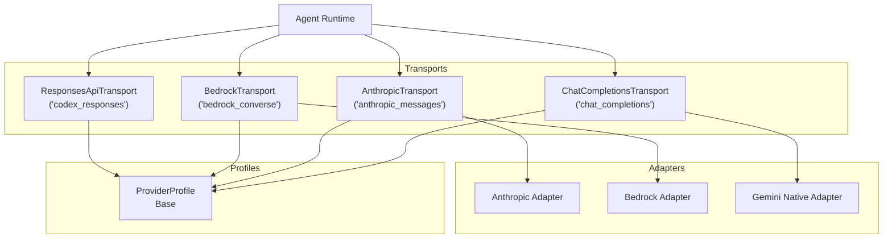
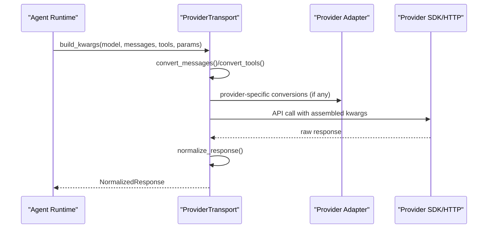
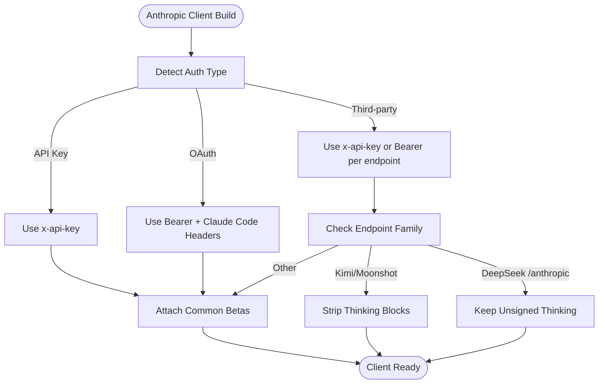
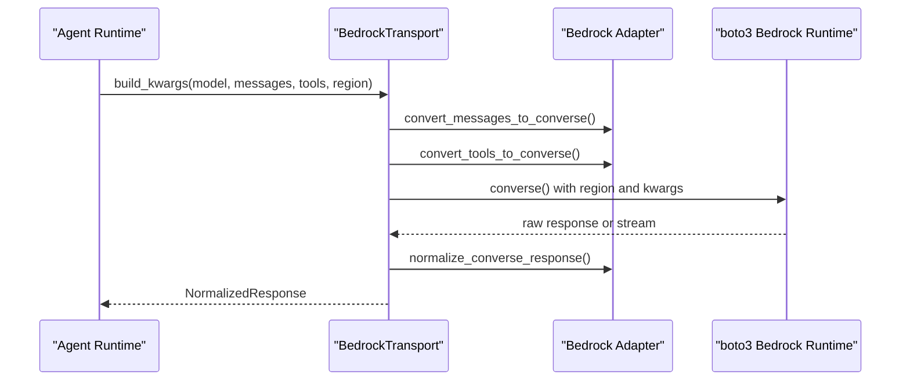
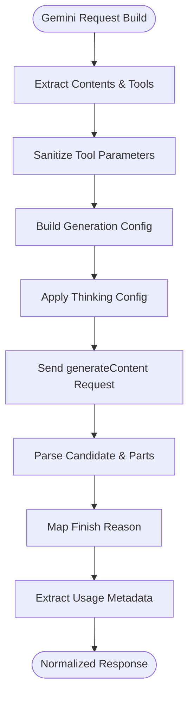
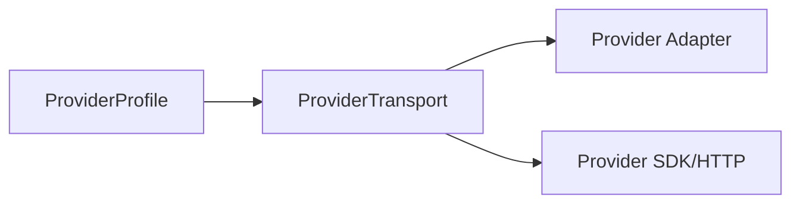

# Provider-Specific Implementation Guides

<cite>
**Referenced Files in This Document**
- [anthropic_adapter.py](file://agent/anthropic_adapter.py)
- [anthropic.py](file://agent/transports/anthropic.py)
- [bedrock_adapter.py](file://agent/bedrock_adapter.py)
- [bedrock.py](file://agent/transports/bedrock.py)
- [gemini_native_adapter.py](file://agent/gemini_native_adapter.py)
- [gemini_schema.py](file://agent/gemini_schema.py)
- [chat_completions.py](file://agent/transports/chat_completions.py)
- [codex.py](file://agent/transports/codex.py)
- [base.py](file://providers/base.py)
- [base.py](file://agent/transports/base.py)
</cite>

## Table of Contents
1. [Introduction](#introduction)
2. [Project Structure](#project-structure)
3. [Core Components](#core-components)
4. [Architecture Overview](#architecture-overview)
5. [Detailed Component Analysis](#detailed-component-analysis)
6. [Dependency Analysis](#dependency-analysis)
7. [Performance Considerations](#performance-considerations)
8. [Troubleshooting Guide](#troubleshooting-guide)
9. [Conclusion](#conclusion)

## Introduction
This document provides comprehensive implementation guides for major model providers in the agent system, focusing on Anthropic, AWS Bedrock, Google Gemini, and OpenAI-compatible providers. It explains setup procedures, authentication requirements, endpoint configuration, provider-specific features, rate limiting strategies, quota management, error handling, and performance optimization techniques. Migration guidance and compatibility considerations for different model families are included to help you integrate and operate these providers effectively.

## Project Structure
The provider integration is organized around a transport abstraction that converts OpenAI-style messages and tools into provider-specific formats, and then normalizes provider responses into a shared representation. Provider profiles encapsulate endpoint, authentication, and request-time quirks for declarative configuration.

**Diagram sources**
- [chat_completions.py:102-615](file://agent/transports/chat_completions.py#L102-L615)
- [anthropic.py:13-180](file://agent/transports/anthropic.py#L13-L180)
- [bedrock.py:15-155](file://agent/transports/bedrock.py#L15-L155)
- [codex.py:14-284](file://agent/transports/codex.py#L14-L284)
- [anthropic_adapter.py:522-622](file://agent/anthropic_adapter.py#L522-L622)
- [bedrock_adapter.py:74-95](file://agent/bedrock_adapter.py#L74-L95)
- [gemini_native_adapter.py:388-428](file://agent/gemini_native_adapter.py#L388-L428)
- [base.py:38-185](file://providers/base.py#L38-L185)

**Section sources**
- [base.py:16-90](file://agent/transports/base.py#L16-L90)
- [base.py:38-185](file://providers/base.py#L38-L185)

## Core Components
- ProviderTransport: Abstract base defining the conversion and normalization pipeline for a given api_mode. Concrete transports implement provider-specific logic for message/tool conversion, building kwargs, response normalization, validation, and finish reason mapping.
- ProviderProfile: Declarative configuration describing a provider’s identity, authentication, endpoints, and request-time quirks. Transports use profiles to assemble kwargs and extra_body consistently.
- Adapters: Provider-specific logic for message/tool conversion and response normalization, isolated from transport concerns.

Key responsibilities:
- AnthropicTransport: Converts OpenAI messages to Anthropic format, builds kwargs with thinking and beta headers, normalizes responses, and extracts cache stats.
- BedrockTransport: Converts OpenAI messages to Bedrock Converse format, builds kwargs with region and guardrails, normalizes responses, and validates raw boto3 dicts.
- ChatCompletionsTransport: Default path for OpenAI-compatible providers; handles provider-specific reasoning configuration, max_tokens defaults, and extra_body assembly.
- ResponsesApiTransport: Codex Responses API path for providers like xAI/Grok and GitHub Models; handles reasoning effort, cache routing, and normalized output.

**Section sources**
- [anthropic.py:13-180](file://agent/transports/anthropic.py#L13-L180)
- [bedrock.py:15-155](file://agent/transports/bedrock.py#L15-L155)
- [chat_completions.py:102-615](file://agent/transports/chat_completions.py#L102-L615)
- [codex.py:14-284](file://agent/transports/codex.py#L14-L284)

## Architecture Overview
The runtime selects a provider profile and transport based on the chosen api_mode. The transport converts messages and tools, assembles provider-specific kwargs, and normalizes the response into a shared format. Profiles centralize endpoint, auth, and quirks to minimize duplication across transports.

**Diagram sources**
- [base.py:42-65](file://agent/transports/base.py#L42-L65)
- [anthropic.py:41-79](file://agent/transports/anthropic.py#L41-L79)
- [bedrock.py:32-66](file://agent/transports/bedrock.py#L32-L66)
- [chat_completions.py:160-392](file://agent/transports/chat_completions.py#L160-L392)
- [codex.py:37-197](file://agent/transports/codex.py#L37-L197)

## Detailed Component Analysis

### Anthropic Implementation Guide
Setup and Authentication
- API key formats:
  - Regular API keys: x-api-key header
  - OAuth setup-tokens and JWTs: Bearer auth with Claude Code identity headers
  - Claude Code credentials: Bearer auth with specific user-agent
- Endpoint detection:
  - Direct Anthropic API vs third-party proxies (e.g., Azure AI Foundry, AWS Bedrock)
  - Special handling for Kimi/Moonshot endpoints and DeepSeek’s /anthropic route
- Beta headers:
  - Common betas for enhanced features
  - Tool streaming and 1M context betas vary by endpoint and provider

Configuration
- Client construction:
  - build_anthropic_client: selects auth scheme, sets default headers, and attaches betas
  - build_anthropic_bedrock_client: uses Anthropic SDK’s native Bedrock adapter with full feature parity
- Message and tool conversion:
  - convert_messages_to_anthropic and convert_tools_to_anthropic handle provider-specific schemas
- Thinking and reasoning:
  - Adaptive thinking effort mapping and xhigh support gating
  - Fast mode support for specific models
- Max output token resolution:
  - Model-specific ceilings and fallback logic
- Response normalization:
  - Stop reason mapping, reasoning extraction, and cache stats

Rate Limiting and Quota Management
- Anthropic’s Messages API requires max_tokens; invalid values produce HTTP 400
- Use provider-specific max_tokens resolution and context-length clamping

Error Handling
- OAuth token validation and refresh flows
- Claude Code credential detection and version spoofing for OAuth infrastructure
- Clear ImportError messages when SDK is missing

Migration and Compatibility
- Model family compatibility:
  - Adaptive thinking availability varies by model version
  - Sampling parameters forbidden on newer models
- Endpoint compatibility:
  - Azure endpoints require api-version query param
  - Third-party endpoints may require Bearer auth and stripped betas

**Diagram sources**
- [anthropic_adapter.py:522-622](file://agent/anthropic_adapter.py#L522-L622)
- [anthropic_adapter.py:364-441](file://agent/anthropic_adapter.py#L364-L441)
- [anthropic.py:41-79](file://agent/transports/anthropic.py#L41-L79)

**Section sources**
- [anthropic_adapter.py:522-622](file://agent/anthropic_adapter.py#L522-L622)
- [anthropic_adapter.py:127-203](file://agent/anthropic_adapter.py#L127-L203)
- [anthropic_adapter.py:205-240](file://agent/anthropic_adapter.py#L205-L240)
- [anthropic.py:13-180](file://agent/transports/anthropic.py#L13-L180)

### AWS Bedrock Implementation Guide
Setup and Authentication
- Native Converse API integration bypasses OpenAI-compatible endpoints
- AWS credential chain: IAM roles, SSO profiles, environment variables, instance metadata
- Dynamic model discovery via Bedrock control plane
- Guardrails support and inference profiles for capacity and failover

Configuration
- Client construction:
  - Lazy boto3 import and cached clients per region
  - Stale connection detection and eviction for robustness
- Message and tool conversion:
  - OpenAI → Converse format conversion with strict alternation rules
  - Tool-call capability detection and denylisting for non-tool models
- Response normalization:
  - Converse API response to OpenAI-compatible shape
  - Streaming event processing with callbacks for text deltas, tool starts, and reasoning

Rate Limiting and Quota Management
- Use provider-specific max_tokens defaults and region-aware clients
- Monitor usage metadata from responses for token accounting

Error Handling
- Stale connection detection for botocore and urllib3 errors
- AssertionErrors from internal libraries indicate stale pools requiring client eviction

Migration and Compatibility
- Claude on Bedrock uses AnthropicBedrock SDK for full feature parity
- Non-Claude models use Converse API; tool support varies by model pattern

**Diagram sources**
- [bedrock.py:32-66](file://agent/transports/bedrock.py#L32-L66)
- [bedrock_adapter.py:493-610](file://agent/bedrock_adapter.py#L493-L610)
- [bedrock_adapter.py:74-95](file://agent/bedrock_adapter.py#L74-L95)

**Section sources**
- [bedrock_adapter.py:74-95](file://agent/bedrock_adapter.py#L74-L95)
- [bedrock_adapter.py:335-353](file://agent/bedrock_adapter.py#L335-L353)
- [bedrock_adapter.py:384-404](file://agent/bedrock_adapter.py#L384-L404)
- [bedrock_adapter.py:493-610](file://agent/bedrock_adapter.py#L493-L610)
- [bedrock.py:15-155](file://agent/transports/bedrock.py#L15-L155)

### Google Gemini Implementation Guide
Setup and Authentication
- Native Gemini API path avoids OpenAI-compatible endpoint quirks
- API key probing to detect free vs paid tiers
- Base URL detection for native vs OpenAI-compatible endpoints

Configuration
- Request building:
  - OpenAI-style messages converted to Gemini’s generateContent schema
  - Tool declarations sanitized to Gemini’s schema subset
  - Thinking configuration translation for Gemini models
- Response normalization:
  - Candidate parsing, finish reason mapping, and usage extraction
  - Streaming SSE event processing with reasoning and tool deltas

Rate Limiting and Quota Management
- Free-tier quota detection via rate limit headers and 429 messages
- Guidance appended to 429 responses indicating free-tier exhaustion

Error Handling
- Structured GeminiAPIError with status, reason, metadata, and retry-after
- Free-tier quota exhaustion detection and user guidance

Migration and Compatibility
- Gemini 2.5 supports thinkingBudget; 3.x models restrict thinking levels
- Non-Gemini models reject thinkingConfig; omit when targeting non-Gemini families

**Diagram sources**
- [gemini_native_adapter.py:388-428](file://agent/gemini_native_adapter.py#L388-L428)
- [gemini_native_adapter.py:474-541](file://agent/gemini_native_adapter.py#L474-L541)
- [gemini_schema.py:36-100](file://agent/gemini_schema.py#L36-L100)

**Section sources**
- [gemini_native_adapter.py:47-119](file://agent/gemini_native_adapter.py#L47-L119)
- [gemini_native_adapter.py:388-428](file://agent/gemini_native_adapter.py#L388-L428)
- [gemini_native_adapter.py:474-541](file://agent/gemini_native_adapter.py#L474-L541)
- [gemini_schema.py:36-100](file://agent/gemini_schema.py#L36-L100)

### OpenAI-Compatible Providers (Chat Completions)
Setup and Authentication
- Default api_mode for ~16 OpenAI-compatible providers
- Provider profiles encapsulate endpoint, auth, and quirks

Configuration
- Provider-specific reasoning configuration:
  - Gemini thinkingConfig translation and level clamping
  - Top-level reasoning_effort for providers like Kimi and TokenHub
  - LM Studio reasoning effort via capabilities
- Max tokens resolution:
  - Priority: ephemeral override > user setting > provider default
  - Anthropic-specific max output handling
- Extra body assembly:
  - Reasoning toggles, provider preferences, and model-specific plugins

Rate Limiting and Quota Management
- OpenRouter/OpenAI cache stats extraction from prompt_tokens_details

Error Handling
- Standardized response validation and finish reason mapping

Migration and Compatibility
- Developer role swap for specific model families
- Tool schema sanitization for Moonshot/Kimi models

**Section sources**
- [chat_completions.py:22-76](file://agent/transports/chat_completions.py#L22-L76)
- [chat_completions.py:160-392](file://agent/transports/chat_completions.py#L160-L392)
- [chat_completions.py:509-584](file://agent/transports/chat_completions.py#L509-L584)

### Codex Responses API (xAI/Grok, GitHub Models)
Setup and Authentication
- Dedicated api_mode for providers using the Responses API
- Session-based prompt caching and conversation headers for xAI

Configuration
- Instruction extraction and reasoning effort handling
- Tool definitions and parallel tool calls
- Request overrides and cache routing headers

Rate Limiting and Quota Management
- Prompt cache key routing for improved cache hits

Error Handling
- Output list validation and reasoning items preservation for replay

**Section sources**
- [codex.py:37-197](file://agent/transports/codex.py#L37-L197)
- [codex.py:198-240](file://agent/transports/codex.py#L198-L240)

## Dependency Analysis
Provider transports depend on adapters for message/tool conversion and response normalization. Provider profiles supply endpoint, auth, and request-time quirks to transports, reducing duplication and improving maintainability.

**Diagram sources**
- [base.py:38-185](file://providers/base.py#L38-L185)
- [base.py:16-90](file://agent/transports/base.py#L16-L90)

**Section sources**
- [base.py:38-185](file://providers/base.py#L38-L185)
- [base.py:16-90](file://agent/transports/base.py#L16-L90)

## Performance Considerations
- Anthropic
  - Use adaptive thinking effort mapping to align with model capabilities
  - Fast mode for supported models to increase throughput
  - Respect model-specific max output token limits to avoid 400 errors
- AWS Bedrock
  - Leverage cached boto3 clients per region; evict on stale connection errors
  - Use inference profiles for capacity and failover
  - Tool-call capability detection to avoid ValidationException
- Google Gemini
  - Apply thinkingConfig judiciously; omit for non-Gemini models
  - Sanitize tool parameters to Gemini’s schema subset to prevent rejection
- OpenAI-Compatible
  - Use provider profiles to avoid repeated conditional logic
  - Apply reasoning configuration only when supported by the model family

[No sources needed since this section provides general guidance]

## Troubleshooting Guide
- Anthropic
  - ImportError when anthropic SDK is missing; install required version
  - OAuth token validation and Claude Code credential detection for infrastructure routing
  - Max tokens resolution to avoid HTTP 400
- AWS Bedrock
  - Stale connection detection and client eviction for botocore and urllib3 errors
  - Tool-call denylisting for non-tool models
- Google Gemini
  - Free-tier quota exhaustion detection and guidance appended to 429 responses
  - Structured error handling with status, reason, and metadata
- OpenAI-Compatible
  - Standardized response validation and finish reason mapping
  - Provider-specific reasoning configuration to avoid unsupported fields

**Section sources**
- [anthropic_adapter.py:545-551](file://agent/anthropic_adapter.py#L545-L551)
- [anthropic_adapter.py:786-800](file://agent/anthropic_adapter.py#L786-L800)
- [bedrock_adapter.py:155-209](file://agent/bedrock_adapter.py#L155-L209)
- [gemini_native_adapter.py:700-777](file://agent/gemini_native_adapter.py#L700-L777)
- [chat_completions.py:586-595](file://agent/transports/chat_completions.py#L586-L595)

## Conclusion
By leveraging provider profiles and dedicated transports, the system achieves consistent, maintainable integrations across diverse providers. Anthropic, AWS Bedrock, Google Gemini, and OpenAI-compatible providers each have distinct authentication, endpoint, and feature requirements. Following the provider-specific guides in this document will help you configure endpoints, manage quotas and rate limits, handle provider-specific errors, and optimize performance for reliable agent operation.