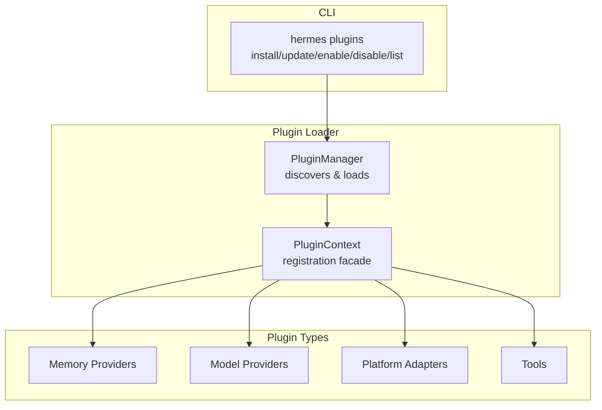
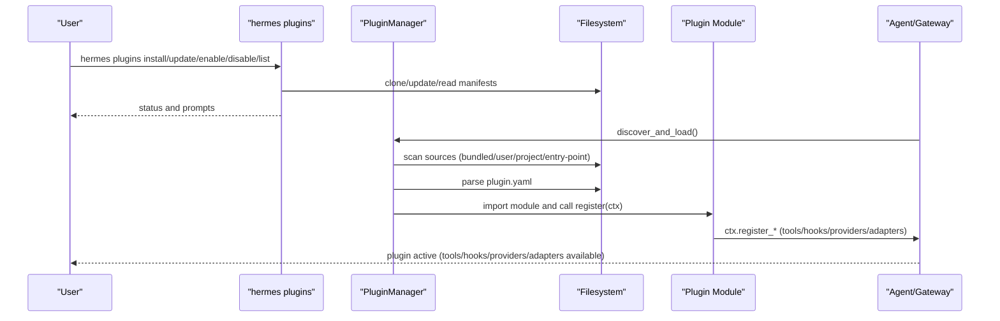
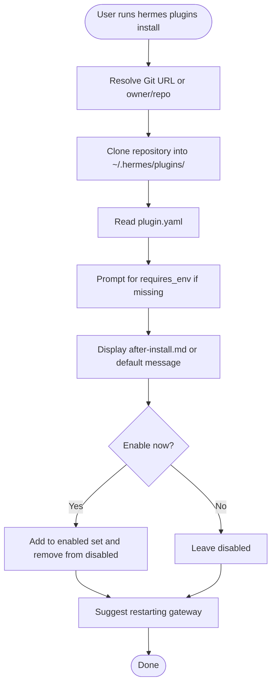
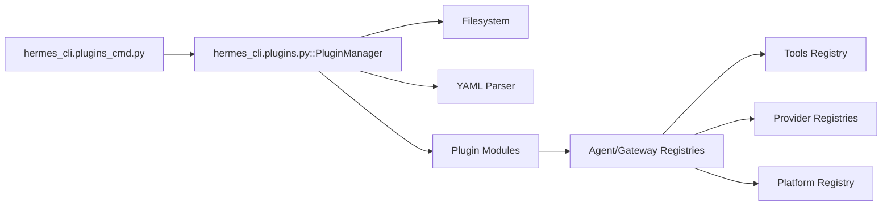

# Plugin Architecture

<cite>
**Referenced Files in This Document**
- [plugins/__init__.py](file://plugins/__init__.py)
- [hermes_cli/plugins.py](file://hermes_cli/plugins.py)
- [hermes_cli/plugins_cmd.py](file://hermes_cli/plugins_cmd.py)
- [plugins/memory/holographic/plugin.yaml](file://plugins/memory/holographic/plugin.yaml)
- [plugins/model-providers/anthropic/plugin.yaml](file://plugins/model-providers/anthropic/plugin.yaml)
- [plugins/platforms/irc/plugin.yaml](file://plugins/platforms/irc/plugin.yaml)
- [plugins/web/firecrawl/plugin.yaml](file://plugins/web/firecrawl/plugin.yaml)
- [plugins/spotify/plugin.yaml](file://plugins/spotify/plugin.yaml)
- [plugins/memory/holographic/__init__.py](file://plugins/memory/holographic/__init__.py)
- [plugins/model-providers/anthropic/__init__.py](file://plugins/model-providers/anthropic/__init__.py)
- [plugins/platforms/irc/__init__.py](file://plugins/platforms/irc/__init__.py)
- [plugins/platforms/irc/adapter.py](file://plugins/platforms/irc/adapter.py)
- [plugins/web/firecrawl/__init__.py](file://plugins/web/firecrawl/__init__.py)
- [plugins/spotify/__init__.py](file://plugins/spotify/__init__.py)
- [plugins/example-dashboard/dashboard/manifest.json](file://plugins/example-dashboard/dashboard/manifest.json)
- [plugins/memory/byterover/plugin.yaml](file://plugins/memory/byterover/plugin.yaml)
</cite>

## Table of Contents
1. [Introduction](#introduction)
2. [Project Structure](#project-structure)
3. [Core Components](#core-components)
4. [Architecture Overview](#architecture-overview)
5. [Detailed Component Analysis](#detailed-component-analysis)
6. [Dependency Analysis](#dependency-analysis)
7. [Performance Considerations](#performance-considerations)
8. [Troubleshooting Guide](#troubleshooting-guide)
9. [Conclusion](#conclusion)
10. [Appendices](#appendices)

## Introduction
This document explains the Plugin Architecture that extends Hermes Agent functionality through modular extensions. It covers plugin discovery, manifests, lifecycle hooks, and integration points. It documents the four primary plugin categories—memory, model providers, platform adapters, and tools—and outlines development guidelines, installation and activation via the CLI, security considerations, and performance and debugging practices.

## Project Structure
The plugin system is organized around a unified loader and CLI commands:
- Discovery and loading: centralized in the plugin manager and loader
- Manifests: per-plugin YAML files declaring metadata and capabilities
- Registration: each plugin exposes a register(ctx) function to bind tools, providers, hooks, and platform adapters
- CLI: commands to install, update, enable/disable, and list plugins

**Diagram sources**
- [hermes_cli/plugins.py:790-800](file://hermes_cli/plugins.py#L790-L800)
- [hermes_cli/plugins_cmd.py:438-520](file://hermes_cli/plugins_cmd.py#L438-L520)

**Section sources**
- [hermes_cli/plugins.py:1-120](file://hermes_cli/plugins.py#L1-L120)
- [hermes_cli/plugins_cmd.py:1-80](file://hermes_cli/plugins_cmd.py#L1-L80)

## Core Components
- PluginManager: scans sources, parses manifests, loads modules, and invokes register(ctx). Maintains hooks, tools, platform adapters, and plugin metadata.
- PluginContext: the registration facade exposed to plugins. Provides APIs to register tools, hooks, providers, platform adapters, slash commands, and more.
- Plugin manifests: plugin.yaml defines metadata, kind, hooks, and capabilities like provides_tools or provides_web_providers.
- CLI plugin commands: install, update, enable, disable, list plugins; manage environment variables and post-install steps.

Key responsibilities:
- Discovery and precedence across bundled, user, project, and entry-point sources
- Validation of manifests and environment requirements
- Hook invocation at lifecycle points
- Provider registration for memory, image/video/web/browser backends
- Platform adapter registration for gateway messaging

**Section sources**
- [hermes_cli/plugins.py:128-170](file://hermes_cli/plugins.py#L128-L170)
- [hermes_cli/plugins.py:233-281](file://hermes_cli/plugins.py#L233-L281)
- [hermes_cli/plugins.py:287-764](file://hermes_cli/plugins.py#L287-L764)
- [hermes_cli/plugins_cmd.py:66-70](file://hermes_cli/plugins_cmd.py#L66-L70)

## Architecture Overview
The plugin architecture centers on a loader that:
- Scans plugin directories and entry-points
- Parses plugin.yaml manifests
- Imports plugin modules and calls register(ctx)
- Registers tools, hooks, providers, and platform adapters
- Exposes CLI commands for installation and management

**Diagram sources**
- [hermes_cli/plugins_cmd.py:438-520](file://hermes_cli/plugins_cmd.py#L438-L520)
- [hermes_cli/plugins.py:790-800](file://hermes_cli/plugins.py#L790-L800)
- [hermes_cli/plugins.py:287-764](file://hermes_cli/plugins.py#L287-L764)

## Detailed Component Analysis

### Plugin Manifest Specification
Manifests define plugin metadata and capabilities. Supported fields include:
- name, version, description, author
- kind: standalone, backend, exclusive, platform, model-provider
- hooks: lifecycle hooks the plugin registers
- provides_tools: tool names provided by the plugin
- provides_web_providers, provides_image_gen_providers, provides_video_gen_providers, provides_browser_providers
- requires_env and optional_env: environment variables required or recommended
- external_dependencies: external CLI tools required by the plugin

Examples:
- Memory plugin manifest declares hooks and external dependencies
- Model provider manifest declares kind and metadata
- Platform manifest declares environment requirements and optional_env
- Backend plugin manifest declares provides_* fields
- Tools plugin manifest declares provides_tools

**Section sources**
- [plugins/memory/holographic/plugin.yaml:1-6](file://plugins/memory/holographic/plugin.yaml#L1-L6)
- [plugins/model-providers/anthropic/plugin.yaml:1-6](file://plugins/model-providers/anthropic/plugin.yaml#L1-L6)
- [plugins/platforms/irc/plugin.yaml:1-55](file://plugins/platforms/irc/plugin.yaml#L1-L55)
- [plugins/web/firecrawl/plugin.yaml:1-8](file://plugins/web/firecrawl/plugin.yaml#L1-L8)
- [plugins/spotify/plugin.yaml:1-14](file://plugins/spotify/plugin.yaml#L1-L14)
- [plugins/memory/byterover/plugin.yaml:1-10](file://plugins/memory/byterover/plugin.yaml#L1-L10)

### Lifecycle Hooks
The loader defines a fixed set of lifecycle hooks plugins can subscribe to. Examples include pre/post tool calls, transform hooks for terminal output, tool results, and LLM output, pre/post LLM calls, pre/post API requests, session lifecycle hooks, gateway pre-dispatch, and approval lifecycle hooks.

Plugins register callbacks via ctx.register_hook(name, callback). Unknown hook names are warned but stored for forward compatibility.

**Section sources**
- [hermes_cli/plugins.py:128-168](file://hermes_cli/plugins.py#L128-L168)
- [hermes_cli/plugins.py:701-717](file://hermes_cli/plugins.py#L701-L717)

### Plugin Types and Examples

#### Memory Plugins
Purpose: Provide persistent memory backends. The loader recognizes kind: exclusive for memory providers and routes selection via configuration.

Example: Holographic memory provider registers a MemoryProvider implementation and integrates with the agent’s memory subsystem.

- Registration: ctx.register_memory_provider(...)
- Manifest: declares hooks and external dependencies
- Implementation: implements MemoryProvider interface and exposes tool schemas

**Section sources**
- [plugins/memory/holographic/__init__.py:404-409](file://plugins/memory/holographic/__init__.py#L404-L409)
- [plugins/memory/holographic/plugin.yaml:1-6](file://plugins/memory/holographic/plugin.yaml#L1-L6)

#### Model Provider Plugins
Purpose: Integrate LLM providers. The loader recognizes kind: model-provider and registers provider profiles.

Example: Native Anthropic provider registers a ProviderProfile and exposes model discovery.

- Registration: ctx.register_*_provider(...) for web/search/image/video/browser backends
- Manifest: declares kind: model-provider

**Section sources**
- [plugins/model-providers/anthropic/__init__.py:42-53](file://plugins/model-providers/anthropic/__init__.py#L42-L53)
- [plugins/model-providers/anthropic/plugin.yaml:1-6](file://plugins/model-providers/anthropic/plugin.yaml#L1-L6)

#### Platform Plugins
Purpose: Add gateway messaging platform adapters. The loader recognizes kind: platform and registers platform adapters.

Example: IRC platform adapter registers platform entry and implements BasePlatformAdapter.

- Registration: ctx.register_platform(...)
- Manifest: declares environment requirements and optional_env
- Implementation: adapter class, check/validation, interactive setup, and optional standalone send hook

**Section sources**
- [plugins/platforms/irc/__init__.py:1-4](file://plugins/platforms/irc/__init__.py#L1-L4)
- [plugins/platforms/irc/adapter.py:96-510](file://plugins/platforms/irc/adapter.py#L96-L510)
- [plugins/platforms/irc/plugin.yaml:1-55](file://plugins/platforms/irc/plugin.yaml#L1-L55)

#### Tool Plugins
Purpose: Extend the toolset with new capabilities gated by availability checks.

Example: Spotify plugin registers multiple tools into the spotify toolset.

- Registration: ctx.register_tool(...)
- Manifest: declares provides_tools

**Section sources**
- [plugins/spotify/__init__.py:56-67](file://plugins/spotify/__init__.py#L56-L67)
- [plugins/spotify/plugin.yaml:1-14](file://plugins/spotify/plugin.yaml#L1-L14)

#### Backend Plugins
Purpose: Provide backends for existing subsystems (e.g., web search providers).

Example: Firecrawl plugin registers a web search provider.

- Registration: ctx.register_web_search_provider(...)
- Manifest: declares provides_web_providers

**Section sources**
- [plugins/web/firecrawl/__init__.py:26-29](file://plugins/web/firecrawl/__init__.py#L26-L29)
- [plugins/web/firecrawl/plugin.yaml:1-8](file://plugins/web/firecrawl/plugin.yaml#L1-L8)

#### Dashboard Plugins
Purpose: Provide web dashboards integrated into the UI.

Example: Example dashboard plugin manifest defines tab position, entry, and API.

**Section sources**
- [plugins/example-dashboard/dashboard/manifest.json:1-15](file://plugins/example-dashboard/dashboard/manifest.json#L1-L15)

### Plugin Development Guidelines
- Manifest specification
  - Define name, version, description, author
  - Choose kind: standalone, backend, exclusive, platform, model-provider
  - Declare hooks, provides_* fields, and environment requirements
  - Optionally declare external_dependencies for CLI tools
- Registration patterns
  - Implement register(ctx) and call ctx.register_* APIs appropriate to the plugin type
  - For tools: provide schema, handler, and optional check_fn and emoji
  - For providers: register via ctx.register_*_provider
  - For platform adapters: register via ctx.register_platform with factory and check_fn
  - For hooks: register via ctx.register_hook
- Configuration options
  - Use requires_env and optional_env to declare environment variables
  - Provide interactive setup and validation helpers when applicable
- Integration patterns
  - Respect opt-in loading via plugins.enabled and disabled lists
  - Honor exclusive kinds and category namespaces (e.g., image_gen/<backend>)
  - Use ctx.llm for trusted plugins to access host-owned LLMs with capability gating

**Section sources**
- [hermes_cli/plugins.py:233-281](file://hermes_cli/plugins.py#L233-L281)
- [hermes_cli/plugins.py:287-764](file://hermes_cli/plugins.py#L287-L764)
- [plugins/platforms/irc/plugin.yaml:11-55](file://plugins/platforms/irc/plugin.yaml#L11-L55)
- [plugins/web/firecrawl/plugin.yaml:5-8](file://plugins/web/firecrawl/plugin.yaml#L5-L8)

### Installation, Activation, and Management via CLI
- Install: hermes plugins install <identifier> clones a Git repository into ~/.hermes/plugins and optionally prompts to enable immediately
- Update: hermes plugins update <name> pulls latest from the remote
- Enable/Disable: hermes plugins enable <name> and hermes plugins disable <name> modify the allow-list and deny-list in config.yaml
- List: hermes plugins list enumerates all plugins with enabled/disabled state
- Environment variables: the installer prompts for required_env entries and saves them to ~/.hermes/.env

**Diagram sources**
- [hermes_cli/plugins_cmd.py:438-520](file://hermes_cli/plugins_cmd.py#L438-L520)
- [hermes_cli/plugins_cmd.py:521-560](file://hermes_cli/plugins_cmd.py#L521-L560)
- [hermes_cli/plugins_cmd.py:631-682](file://hermes_cli/plugins_cmd.py#L631-L682)

**Section sources**
- [hermes_cli/plugins_cmd.py:438-520](file://hermes_cli/plugins_cmd.py#L438-L520)
- [hermes_cli/plugins_cmd.py:521-560](file://hermes_cli/plugins_cmd.py#L521-L560)
- [hermes_cli/plugins_cmd.py:631-682](file://hermes_cli/plugins_cmd.py#L631-L682)

### Practical Examples

#### Developing a Custom Memory Plugin
- Create plugin.yaml with kind: exclusive and declare hooks
- Implement register(ctx) that constructs a MemoryProvider and calls ctx.register_memory_provider
- Optionally expose tool schemas and integrate with session lifecycle hooks

**Section sources**
- [plugins/memory/holographic/plugin.yaml:1-6](file://plugins/memory/holographic/plugin.yaml#L1-L6)
- [plugins/memory/holographic/__init__.py:404-409](file://plugins/memory/holographic/__init__.py#L404-L409)

#### Developing a Platform Plugin
- Create plugin.yaml with kind: platform and requires_env
- Implement register(ctx) that calls ctx.register_platform with adapter factory and check_fn
- Provide interactive setup and validation helpers

**Section sources**
- [plugins/platforms/irc/plugin.yaml:1-55](file://plugins/platforms/irc/plugin.yaml#L1-L55)
- [plugins/platforms/irc/__init__.py:1-4](file://plugins/platforms/irc/__init__.py#L1-L4)
- [plugins/platforms/irc/adapter.py:515-534](file://plugins/platforms/irc/adapter.py#L515-L534)

#### Developing a Tool Plugin
- Create plugin.yaml with provides_tools
- Implement register(ctx) that calls ctx.register_tool for each tool
- Gate availability with a check_fn and provide descriptive schemas

**Section sources**
- [plugins/spotify/plugin.yaml:1-14](file://plugins/spotify/plugin.yaml#L1-L14)
- [plugins/spotify/__init__.py:56-67](file://plugins/spotify/__init__.py#L56-L67)

#### Testing Plugin Functionality
- Use the loader’s discovery and registration to validate manifests and environment requirements
- Verify hooks and tool registrations by inspecting PluginManager state
- For platform plugins, test connectivity and message dispatch using the adapter’s connect/send patterns

**Section sources**
- [hermes_cli/plugins.py:790-800](file://hermes_cli/plugins.py#L790-L800)
- [plugins/platforms/irc/adapter.py:153-218](file://plugins/platforms/irc/adapter.py#L153-L218)

#### Distributing Plugins
- Publish as a Git repository with a plugin.yaml manifest
- Users install via hermes plugins install <owner/repo>
- Provide after-install.md to guide users through initial setup

**Section sources**
- [hermes_cli/plugins_cmd.py:438-520](file://hermes_cli/plugins_cmd.py#L438-L520)
- [hermes_cli/plugins_cmd.py:288-315](file://hermes_cli/plugins_cmd.py#L288-L315)

### Security Model and Sandboxing
- Source precedence and overrides: user and project plugins override bundled plugins with the same name
- Environment gating: requires_env and optional_env are enforced during installation and runtime
- Platform adapters: strict input sanitization and control-character stripping to prevent command injection
- Exclusive providers: selection via configuration ensures only one active provider per category
- Debug logging: HERMES_PLUGINS_DEBUG enables verbose plugin-discovery logs to stderr for diagnostics

**Section sources**
- [hermes_cli/plugins.py:5-27](file://hermes_cli/plugins.py#L5-L27)
- [plugins/platforms/irc/adapter.py:702-711](file://plugins/platforms/irc/adapter.py#L702-L711)
- [hermes_cli/plugins.py:89-122](file://hermes_cli/plugins.py#L89-L122)

### Dependency Management
- Manifest-level external_dependencies: declare external CLI tools and install/check commands
- Environment variables: requires_env and optional_env are prompted and persisted to ~/.hermes/.env
- Entry-point plugins: packages exposing the hermes_agent.plugins group are supported

**Section sources**
- [plugins/memory/byterover/plugin.yaml:4-7](file://plugins/memory/byterover/plugin.yaml#L4-L7)
- [hermes_cli/plugins_cmd.py:194-210](file://hermes_cli/plugins_cmd.py#L194-L210)
- [hermes_cli/plugins.py](file://hermes_cli/plugins.py#L170)

## Dependency Analysis
The plugin system exhibits clear separation of concerns:
- Loader depends on filesystem scanning and YAML parsing
- PluginContext encapsulates host integrations and provider registration
- CLI commands orchestrate installation and configuration
- Plugins depend on the host’s tool registry, provider registries, and platform registry

**Diagram sources**
- [hermes_cli/plugins_cmd.py:438-520](file://hermes_cli/plugins_cmd.py#L438-L520)
- [hermes_cli/plugins.py:790-800](file://hermes_cli/plugins.py#L790-L800)

**Section sources**
- [hermes_cli/plugins.py:790-800](file://hermes_cli/plugins.py#L790-L800)
- [hermes_cli/plugins_cmd.py:438-520](file://hermes_cli/plugins_cmd.py#L438-L520)

## Performance Considerations
- Lazy initialization: some plugins defer heavy imports until first use
- Minimal external dependencies: platform plugins rely on stdlib where possible
- Hook filtering: only registered hooks incur overhead
- Provider selection: exclusive kinds and configuration reduce ambiguity and overhead

[No sources needed since this section provides general guidance]

## Troubleshooting Guide
Common issues and remedies:
- Plugin not appearing
  - Verify plugin.yaml presence and validity
  - Check source precedence and name collisions
  - Enable debugging with HERMES_PLUGINS_DEBUG
- Missing environment variables
  - Review requires_env and optional_env declarations
  - Use hermes plugins install to prompt for missing variables
- Platform adapter failures
  - Validate server/channel configuration and credentials
  - Inspect sanitized input and control-character stripping
- Provider conflicts
  - For exclusive kinds, ensure only one provider is enabled
  - Confirm category-specific configuration

**Section sources**
- [hermes_cli/plugins.py:89-122](file://hermes_cli/plugins.py#L89-L122)
- [hermes_cli/plugins_cmd.py:194-210](file://hermes_cli/plugins_cmd.py#L194-L210)
- [plugins/platforms/irc/adapter.py:702-711](file://plugins/platforms/irc/adapter.py#L702-L711)

## Conclusion
The Plugin Architecture provides a robust, extensible foundation for Hermes Agent. Through standardized manifests, a unified loader, and rich registration APIs, developers can create memory providers, model providers, platform adapters, and tools. The CLI simplifies distribution and lifecycle management, while security and performance considerations ensure safe and efficient operation.

## Appendices

### Appendix A: Plugin Kind Semantics
- standalone: opt-in via plugins.enabled
- backend: category backends (e.g., image_gen/<backend>) with auto-loading behavior
- exclusive: category with exactly one active provider (e.g., memory)
- platform: gateway messaging platform adapters
- model-provider: LLM provider integrations

**Section sources**
- [hermes_cli/plugins.py](file://hermes_cli/plugins.py#L230)