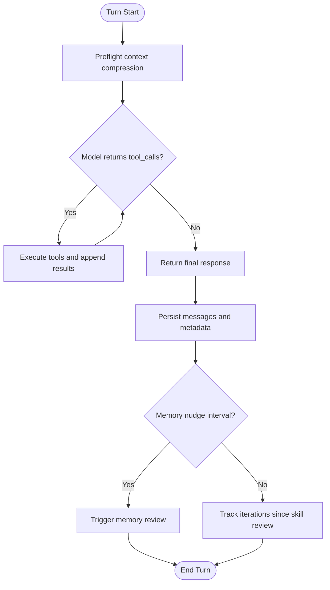
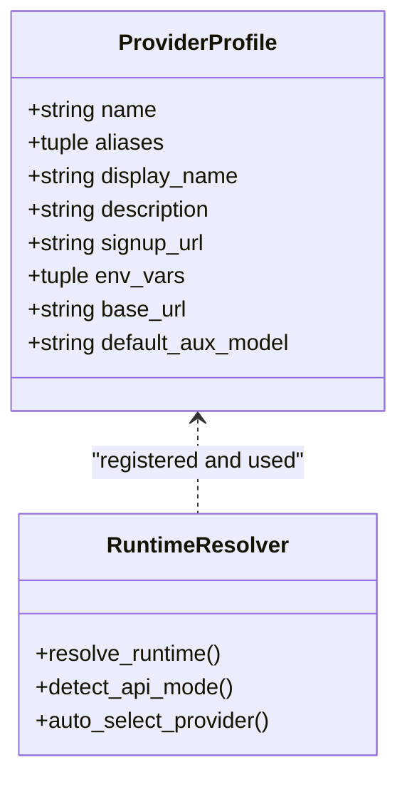
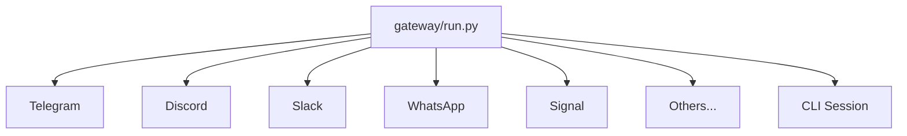
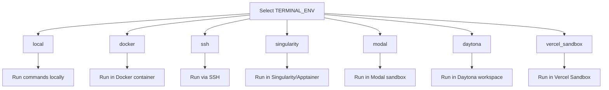
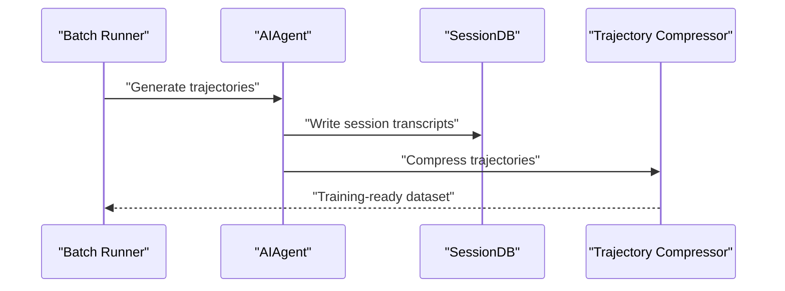
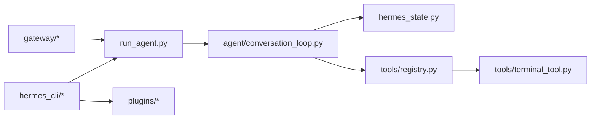

# Project Overview

<cite>
**Referenced Files in This Document**
- [README.md](file://README.md)
- [PROJECT_ANALYSIS_REPORT.md](file://PROJECT_ANALYSIS_REPORT.md)
- [hermes_constants.py](file://hermes_constants.py)
- [hermes_state.py](file://hermes_state.py)
- [agent/conversation_loop.py](file://agent/conversation_loop.py)
- [hermes_cli/runtime_provider.py](file://hermes_cli/runtime_provider.py)
- [tools/terminal_tool.py](file://tools/terminal_tool.py)
- [plugins/model-providers/README.md](file://plugins/model-providers/README.md)
</cite>

## Table of Contents
1. [Introduction](#introduction)
2. [Project Structure](#project-structure)
3. [Core Components](#core-components)
4. [Architecture Overview](#architecture-overview)
5. [Detailed Component Analysis](#detailed-component-analysis)
6. [Dependency Analysis](#dependency-analysis)
7. [Performance Considerations](#performance-considerations)
8. [Troubleshooting Guide](#troubleshooting-guide)
9. [Conclusion](#conclusion)

## Introduction
Hermes Agent is a self-improving AI agent framework built by Nous Research. It is purpose-built to learn continuously from experience, improve skills during use, and maintain persistent memory across sessions. The project emphasizes practical deployment flexibility—running anywhere from a terminal to cloud VMs—and provides a closed learning loop that curates memory, periodically nudges improvements, and supports cross-platform presence through a unified messaging gateway. Its research-ready features enable batch trajectory generation and compression for training the next generation of tool-calling models.

Key value propositions:
- Real terminal interface with full TUI, slash-command autocomplete, conversation history, interrupt-and-redirect, and streaming tool output
- Lives where you do—Telegram, Discord, Slack, WhatsApp, Signal, and CLI—all from a single gateway process with cross-platform conversation continuity
- Closed learning loop—agent-curated memory, autonomous skill creation, periodic self-improvement, and FTS5-powered cross-session recall
- Scheduled automations—built-in cron scheduler with delivery to any platform
- Delegates and parallelizes—spawn isolated subagents for parallel workstreams and collapse multi-step pipelines into zero-context-cost turns
- Runs anywhere, not just your laptop—seven terminal backends (local, Docker, SSH, Singularity, Modal, Daytona, Vercel Sandbox) with serverless persistence options
- Research-ready—batch trajectory generation and trajectory compression for training tool-call models

## Project Structure
At a high level, Hermes is organized around:
- Agent runtime and conversation loop
- Tools and toolsets for capabilities
- Messaging gateway for multi-platform presence
- CLI and configuration subsystems
- Plugins for model providers, memory providers, and integrations
- Terminal backends enabling diverse execution environments

```mermaid
graph TB
subgraph "CLI"
CLI["hermes_cli/main.py<br/>Commands, config, gateway"]
end
subgraph "Agent Runtime"
RUN["run_agent.py<br/>Agent orchestration"]
LOOP["agent/conversation_loop.py<br/>Tool-calling loop"]
STATE["hermes_state.py<br/>SQLite session store"]
end
subgraph "Tools & Integrations"
REG["tools/registry.py<br/>Tool registration"]
TERM["tools/terminal_tool.py<br/>Terminal backends"]
PLUG["plugins/*<br/>Model/memory providers"]
end
subgraph "Messaging"
GW["gateway/run.py<br/>Multi-platform adapter"]
end
CLI --> RUN
RUN --> LOOP
LOOP --> STATE
LOOP --> REG
REG --> TERM
CLI --> GW
GW --> LOOP
CLI --> PLUG
```

**Diagram sources**
- [README.md:15-27](file://README.md#L15-L27)
- [PROJECT_ANALYSIS_REPORT.md:31-90](file://PROJECT_ANALYSIS_REPORT.md#L31-L90)

**Section sources**
- [README.md:15-27](file://README.md#L15-L27)
- [PROJECT_ANALYSIS_REPORT.md:31-90](file://PROJECT_ANALYSIS_REPORT.md#L31-L90)

## Core Components
- Conversation loop: synchronous loop that orchestrates model calls, tool execution, retries, compression, and post-turn hooks. It manages iteration budgets, memory nudges, and skill review triggers across turns.
- Session state: SQLite-backed store with FTS5 search, WAL/DELETE journal modes, and triggers to maintain searchable transcripts and metadata across sessions.
- Terminal backends: a unified abstraction for execution environments (local, Docker, SSH, Singularity, Modal, Daytona, Vercel Sandbox), enabling serverless persistence and reproducible environments.
- Model provider resolution: robust runtime provider selection supporting dozens of providers, custom endpoints, and API mode auto-detection.
- Messaging gateway: a single entry point for Telegram, Discord, Slack, WhatsApp, Signal, and more, with consistent session continuity and delivery.

**Section sources**
- [agent/conversation_loop.py:85-120](file://agent/conversation_loop.py#L85-L120)
- [hermes_state.py:309-372](file://hermes_state.py#L309-L372)
- [tools/terminal_tool.py:1106-1120](file://tools/terminal_tool.py#L1106-L1120)
- [hermes_cli/runtime_provider.py:171-192](file://hermes_cli/runtime_provider.py#L171-L192)
- [README.md:19-27](file://README.md#L19-L27)

## Architecture Overview
Hermes integrates a terminal-first CLI with a messaging gateway, both feeding into a shared agent runtime. The runtime coordinates model calls and tools, persists session state, and maintains memory and skills. Plugins extend capabilities for model providers, memory providers, and observability.

```mermaid
sequenceDiagram
participant User as "User"
participant CLI as "CLI / TUI"
participant GW as "Messaging Gateway"
participant Agent as "AIAgent"
participant Loop as "Conversation Loop"
participant State as "SessionDB (SQLite)"
participant Tools as "Tools Registry"
participant Prov as "Model Provider"
User->>CLI : "hermes" or slash commands
User->>GW : "Platform message"
CLI->>Agent : "Start session"
GW->>Agent : "Start session"
Agent->>Loop : "run_conversation()"
Loop->>State : "Ensure session, hydrate counters"
Loop->>Prov : "chat.completions / anthropic_messages"
Prov-->>Loop : "Response or tool_calls"
Loop->>Tools : "Dispatch tool(s)"
Tools-->>Loop : "Tool results"
Loop->>State : "Persist messages, tokens, metadata"
Loop-->>CLI : "Final response"
Loop-->>GW : "Deliver to platform"
```

**Diagram sources**
- [README.md:82-98](file://README.md#L82-L98)
- [agent/conversation_loop.py:85-120](file://agent/conversation_loop.py#L85-L120)
- [hermes_state.py:309-372](file://hermes_state.py#L309-L372)

## Detailed Component Analysis

### Closed Learning Loop and Persistent Memory
Hermes maintains a closed loop by:
- Creating skills from experience and improving them during use
- Periodically nudging memory reviews and skill maintenance
- Persisting session transcripts and metadata in SQLite with FTS5 search
- Supporting cross-session recall via LLM-assisted summarization and structured queries



**Diagram sources**
- [agent/conversation_loop.py:532-592](file://agent/conversation_loop.py#L532-L592)
- [hermes_state.py:309-372](file://hermes_state.py#L309-L372)

**Section sources**
- [agent/conversation_loop.py:282-293](file://agent/conversation_loop.py#L282-L293)
- [hermes_state.py:185-307](file://hermes_state.py#L185-L307)

### Universal Model Provider Compatibility
Hermes supports a wide range of providers and endpoints, with automatic API mode detection and credential routing. Providers are registered as plugins and resolved dynamically at runtime.



**Diagram sources**
- [plugins/model-providers/README.md:30-71](file://plugins/model-providers/README.md#L30-L71)
- [hermes_cli/runtime_provider.py:171-192](file://hermes_cli/runtime_provider.py#L171-L192)

**Section sources**
- [plugins/model-providers/README.md:17-71](file://plugins/model-providers/README.md#L17-L71)
- [hermes_cli/runtime_provider.py:64-88](file://hermes_cli/runtime_provider.py#L64-L88)

### Multi-Platform Messaging Presence
The gateway supports numerous platforms and delivers messages consistently across CLI and messaging channels. Sessions are tracked centrally, ensuring continuity and consistent behavior.



**Diagram sources**
- [README.md:21-27](file://README.md#L21-L27)

**Section sources**
- [README.md:21-27](file://README.md#L21-L27)

### Terminal Backends and Serverless Execution
Hermes provides seven terminal backends, enabling execution anywhere—from local to cloud sandboxes—with serverless persistence options. The terminal tooling abstracts environment creation, resource configuration, and lifecycle management.



**Diagram sources**
- [tools/terminal_tool.py:1106-1120](file://tools/terminal_tool.py#L1106-L1120)
- [tools/terminal_tool.py:2238-2244](file://tools/terminal_tool.py#L2238-L2244)

**Section sources**
- [tools/terminal_tool.py:1097-1120](file://tools/terminal_tool.py#L1097-L1120)
- [tools/terminal_tool.py:2238-2244](file://tools/terminal_tool.py#L2238-L2244)

### Research-Ready Trajectory Generation
Hermes supports research workflows with batch trajectory generation and compression, enabling training the next generation of tool-calling models. The state store and trajectory utilities are designed to capture and process conversational traces efficiently.



**Diagram sources**
- [README.md:26-27](file://README.md#L26-L27)

**Section sources**
- [README.md:26-27](file://README.md#L26-L27)

## Dependency Analysis
Hermes exhibits strong modularity:
- CLI and gateway depend on the agent runtime
- The agent runtime depends on the conversation loop, tools registry, and session state
- Tools registry depends on tool implementations and terminal backends
- Plugins extend model and memory provider ecosystems



**Diagram sources**
- [PROJECT_ANALYSIS_REPORT.md:92-103](file://PROJECT_ANALYSIS_REPORT.md#L92-L103)

**Section sources**
- [PROJECT_ANALYSIS_REPORT.md:92-103](file://PROJECT_ANALYSIS_REPORT.md#L92-L103)

## Performance Considerations
- SQLite journal mode fallback: automatic fallback to DELETE mode on incompatible filesystems (e.g., NFS/SMB) to ensure reliability, trading concurrency for compatibility
- WAL checkpointing: periodic passive checkpointing to prevent WAL growth under sustained write loads
- Application-level retry with jitter: reduces writer convoy effects under contention
- Prompt caching: Anthropic prompt caching support to reduce token costs on multi-turn conversations
- Context compression: proactive compression before entering the loop to avoid expensive API errors and reduce latency

**Section sources**
- [hermes_state.py:128-184](file://hermes_state.py#L128-L184)
- [hermes_state.py:427-447](file://hermes_state.py#L427-L447)
- [agent/conversation_loop.py:755-761](file://agent/conversation_loop.py#L755-L761)

## Troubleshooting Guide
Common operational issues and remedies:
- Session database unavailable: WAL journal mode may fail on network filesystems; the system logs a one-time warning and falls back to DELETE mode. Check the last initialization error for the cause and adjust storage to a compatible filesystem
- Terminal backend requirements: ensure required SDKs and credentials are present for selected backends (e.g., Modal, Daytona, Vercel Sandbox)
- Provider resolution: verify provider configuration and API mode detection; use explicit overrides when endpoints require specific transports

**Section sources**
- [hermes_state.py:105-126](file://hermes_state.py#L105-L126)
- [hermes_state.py:164-184](file://hermes_state.py#L164-L184)
- [tools/terminal_tool.py:2232-2236](file://tools/terminal_tool.py#L2232-L2236)
- [hermes_cli/runtime_provider.py:64-88](file://hermes_cli/runtime_provider.py#L64-L88)

## Conclusion
Hermes Agent delivers a practical, self-improving AI agent with a closed learning loop, cross-platform presence, and flexible execution environments. Its architecture balances modularity, extensibility, and reliability, enabling both everyday use and advanced research workflows. By maintaining persistent memory, supporting scheduled automations, and offering serverless deployment options, Hermes empowers users to run capable agents anywhere while continuously improving their skills from experience.