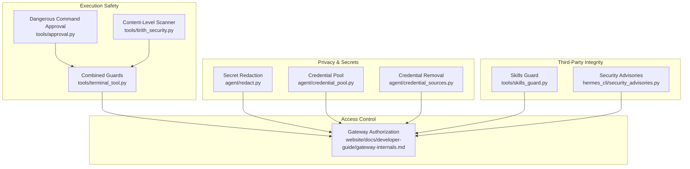
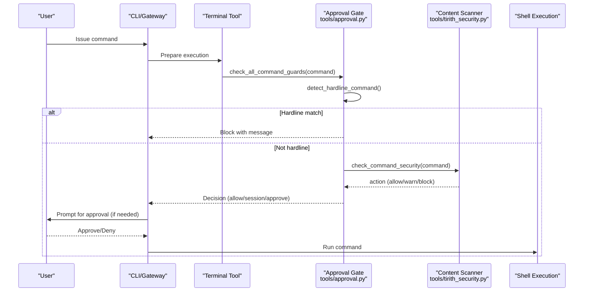
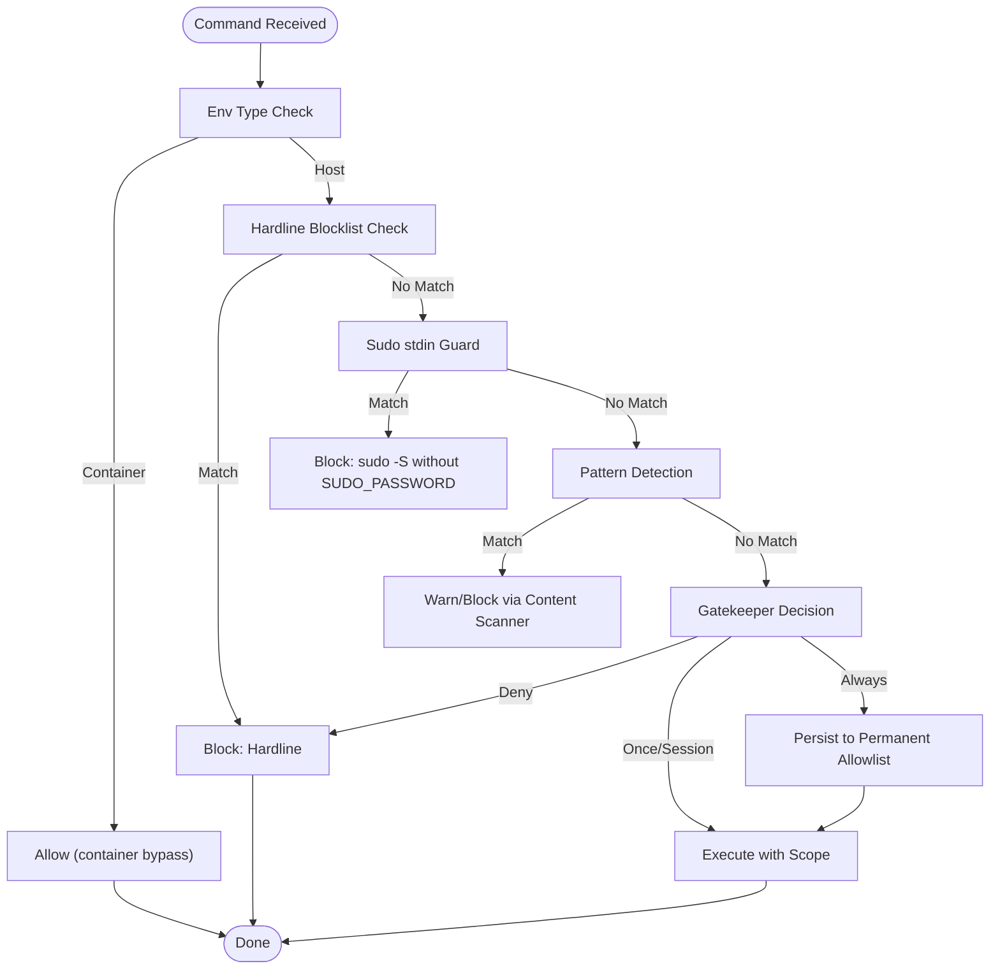
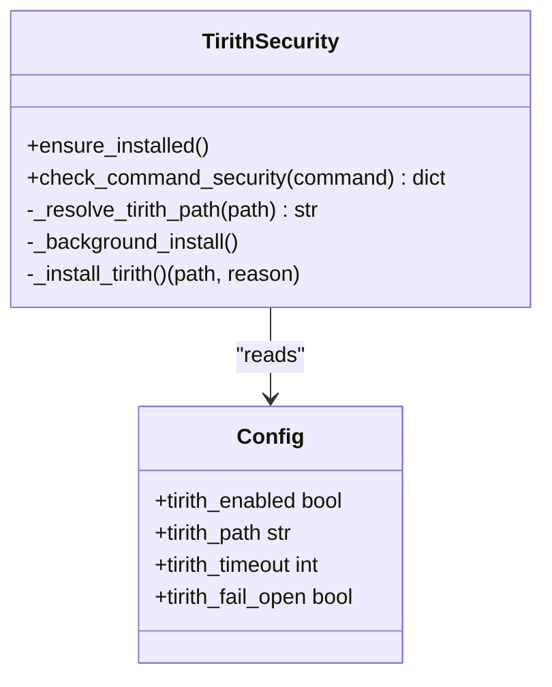
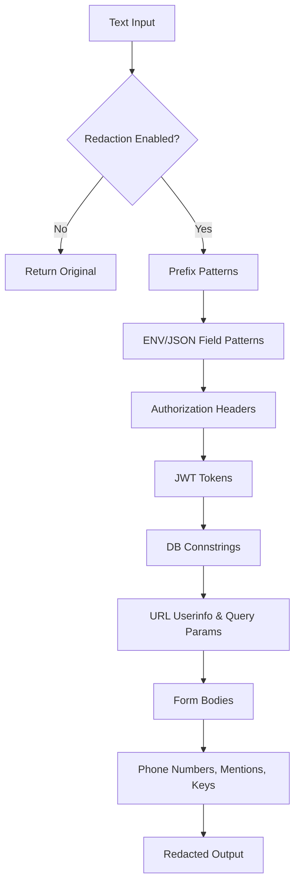
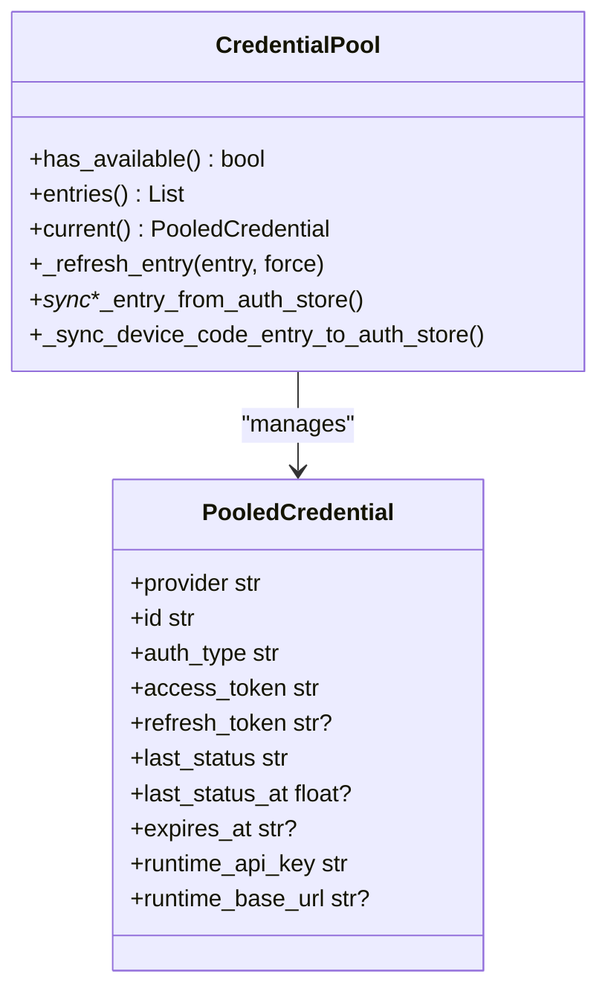
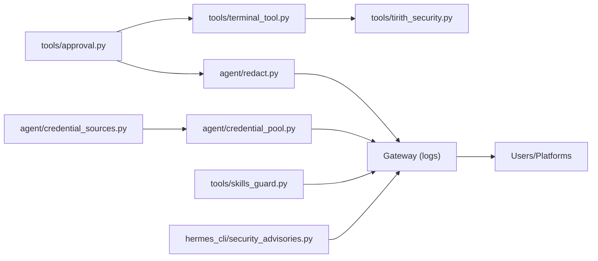

# Security and Safety

<cite>
**Referenced Files in This Document**
- [SECURITY.md](file://SECURITY.md)
- [tools/approval.py](file://tools/approval.py)
- [tools/tirith_security.py](file://tools/tirith_security.py)
- [agent/redact.py](file://agent/redact.py)
- [agent/credential_pool.py](file://agent/credential_pool.py)
- [agent/credential_sources.py](file://agent/credential_sources.py)
- [tools/skills_guard.py](file://tools/skills_guard.py)
- [hermes_cli/security_advisories.py](file://hermes_cli/security_advisories.py)
- [website/docs/user-guide/security.md](file://website/docs/user-guide/security.md)
- [website/docs/developer-guide/gateway-internals.md](file://website/docs/developer-guide/gateway-internals.md)
- [tools/terminal_tool.py](file://tools/terminal_tool.py)
- [tests/tools/test_approval.py](file://tests/tools/test_approval.py)
- [tests/tools/test_command_guards.py](file://tests/tools/test_command_guards.py)
- [tests/agent/test_redact.py](file://tests/agent/test_redact.py)
- [tests/tools/test_memory_tool.py](file://tests/tools/test_memory_tool.py)
- [tests/skills/test_openclaw_migration_hardening.py](file://tests/skills/test_openclaw_migration_hardening.py)
</cite>

## Table of Contents
1. [Introduction](#introduction)
2. [Project Structure](#project-structure)
3. [Core Components](#core-components)
4. [Architecture Overview](#architecture-overview)
5. [Detailed Component Analysis](#detailed-component-analysis)
6. [Dependency Analysis](#dependency-analysis)
7. [Performance Considerations](#performance-considerations)
8. [Troubleshooting Guide](#troubleshooting-guide)
9. [Conclusion](#conclusion)
10. [Appendices](#appendices)

## Introduction
This document explains the Security and Safety systems that protect users and prevent harmful actions in the project. It covers:
- Approval system architecture for tool execution approvals, user consent, and automated safety controls
- Safety guardrails including content filtering, secret management, access control, and malicious command detection
- Privacy and compliance features including data handling policies, PII redaction, and security best practices
- Security advisories, vulnerability reporting, and incident response
- Practical configuration examples, approval workflows, and security best practices
- Redaction system for sensitive information, secure credential storage, and protection against common attack vectors
- Platform-specific security considerations and compliance requirements

## Project Structure
Security and Safety spans multiple subsystems:
- Dangerous command approval and enforcement
- Content-level security scanning
- Secret redaction and credential management
- Skills guard for external skill installation
- Security advisories for supply-chain threats
- Gateway authorization and message guards
- Documentation and user guidance

**Diagram sources**
- [tools/approval.py:1-1393](file://tools/approval.py#L1-L1393)
- [tools/tirith_security.py:1-775](file://tools/tirith_security.py#L1-L775)
- [tools/terminal_tool.py:293-330](file://tools/terminal_tool.py#L293-L330)
- [agent/redact.py:1-404](file://agent/redact.py#L1-L404)
- [agent/credential_pool.py:1-1839](file://agent/credential_pool.py#L1-L1839)
- [agent/credential_sources.py:1-449](file://agent/credential_sources.py#L1-L449)
- [tools/skills_guard.py:1-933](file://tools/skills_guard.py#L1-L933)
- [hermes_cli/security_advisories.py:1-452](file://hermes_cli/security_advisories.py#L1-L452)
- [website/docs/developer-guide/gateway-internals.md:80-109](file://website/docs/developer-guide/gateway-internals.md#L80-L109)

**Section sources**
- [SECURITY.md:1-332](file://SECURITY.md#L1-L332)
- [website/docs/developer-guide/gateway-internals.md:80-109](file://website/docs/developer-guide/gateway-internals.md#L80-L109)

## Core Components
- Dangerous Command Approval: pattern-based detection, per-session state, and approval prompts
- Content-Level Security Scanner: external binary scanning with auto-install and fail-open/fail-closed behavior
- Combined Guards: orchestrates approval and content scanning for every command
- Secret Redaction: masking of tokens, credentials, and sensitive data in logs and tool output
- Credential Pool and Removal: multi-credential storage, rotation, and secure removal
- Skills Guard: static analysis of skills for malicious patterns and trust-aware installation policy
- Security Advisories: supply-chain threat detection and remediation guidance
- Gateway Authorization: layered allowlists and DM pairing for messaging platforms

**Section sources**
- [tools/approval.py:1-1393](file://tools/approval.py#L1-L1393)
- [tools/tirith_security.py:1-775](file://tools/tirith_security.py#L1-L775)
- [tools/terminal_tool.py:293-330](file://tools/terminal_tool.py#L293-L330)
- [agent/redact.py:1-404](file://agent/redact.py#L1-L404)
- [agent/credential_pool.py:1-1839](file://agent/credential_pool.py#L1-L1839)
- [agent/credential_sources.py:1-449](file://agent/credential_sources.py#L1-L449)
- [tools/skills_guard.py:1-933](file://tools/skills_guard.py#L1-L933)
- [hermes_cli/security_advisories.py:1-452](file://hermes_cli/security_advisories.py#L1-L452)
- [website/docs/developer-guide/gateway-internals.md:80-109](file://website/docs/developer-guide/gateway-internals.md#L80-L109)

## Architecture Overview
The system enforces safety at multiple layers:
- Pre-execution: hardline blocklist, sudo stdin guard, and pattern-based dangerous command detection
- Content-level: external scanner for injection and malicious constructs
- Post-execution: secret redaction and credential scoping
- Access control: platform allowlists and DM pairing
- Integrity: skills guard and security advisories

**Diagram sources**
- [tools/terminal_tool.py:293-330](file://tools/terminal_tool.py#L293-L330)
- [tools/approval.py:1043-1069](file://tools/approval.py#L1043-L1069)
- [tools/tirith_security.py:679-775](file://tools/tirith_security.py#L679-L775)

## Detailed Component Analysis

### Dangerous Command Approval System
- Hardline blocklist: catastrophic commands (rm -rf root, mkfs, dd to raw devices, shutdown/reboot, fork bombs, kill -1) are always blocked
- Sudo stdin guard: blocks explicit “sudo -S” when SUDO_PASSWORD is not configured
- Pattern-based detection: extensive regex rules for destructive operations, privilege escalation, and shell injection
- Per-session state: FIFO queue for pending approvals, session-scoped allowlists, and permanent allowlist persistence
- Approval prompts: CLI and gateway flows with “once”, “session”, “always”, “deny”

**Diagram sources**
- [tools/approval.py:198-295](file://tools/approval.py#L198-L295)
- [tools/approval.py:250-310](file://tools/approval.py#L250-L310)
- [tools/approval.py:470-482](file://tools/approval.py#L470-L482)
- [tools/tirith_security.py:679-775](file://tools/tirith_security.py#L679-L775)

**Section sources**
- [tools/approval.py:158-482](file://tools/approval.py#L158-L482)
- [tools/approval.py:484-799](file://tools/approval.py#L484-L799)
- [tools/terminal_tool.py:293-330](file://tools/terminal_tool.py#L293-L330)
- [website/docs/user-guide/security.md:144-196](file://website/docs/user-guide/security.md#L144-L196)
- [tests/tools/test_approval.py:650-683](file://tests/tools/test_approval.py#L650-L683)
- [tests/tools/test_command_guards.py:1-41](file://tests/tools/test_command_guards.py#L1-L41)

### Content-Level Security Scanner (Tirith)
- External binary scanning with auto-install and provenance verification
- Configurable timeout and fail-open/fail-closed behavior
- Platform support detection and background installation
- JSON enrichment of findings without overriding exit-code verdict

**Diagram sources**
- [tools/tirith_security.py:68-87](file://tools/tirith_security.py#L68-L87)
- [tools/tirith_security.py:581-669](file://tools/tirith_security.py#L581-L669)
- [tools/tirith_security.py:679-775](file://tools/tirith_security.py#L679-L775)

**Section sources**
- [tools/tirith_security.py:1-775](file://tools/tirith_security.py#L1-L775)

### Combined Guards Orchestration
- Delegates to consolidated approval and content scanning
- Containerized environments bypass dangerous command checks (container is the security boundary)
- Human-readable descriptions from content scanner inform approval decisions

**Section sources**
- [tools/terminal_tool.py:293-330](file://tools/terminal_tool.py#L293-L330)
- [website/docs/user-guide/security.md:144-196](file://website/docs/user-guide/security.md#L144-L196)

### Secret Redaction System
- Masking of tokens and credentials with configurable thresholds
- Pattern-based detection for API keys, tokens, database URLs, JWTs, private keys, and PII-like values
- Redaction in logs via a logging formatter and opt-out via configuration/environment
- Tests validate redaction of OAuth tokens, bearer headers, and nested structures

**Diagram sources**
- [agent/redact.py:16-187](file://agent/redact.py#L16-L187)
- [agent/redact.py:311-392](file://agent/redact.py#L311-L392)
- [agent/redact.py:395-404](file://agent/redact.py#L395-L404)

**Section sources**
- [agent/redact.py:1-404](file://agent/redact.py#L1-L404)
- [tests/agent/test_redact.py:491-513](file://tests/agent/test_redact.py#L491-L513)
- [tests/skills/test_openclaw_migration_hardening.py:66-107](file://tests/skills/test_openclaw_migration_hardening.py#L66-L107)

### Credential Pool and Secure Removal
- Multi-credential storage with rotation and exhaustion handling
- Strategies: fill-first, round-robin, random, least-used
- Removal steps unify credential deletion across sources (env, CLI, auth store, config)
- Ensures removal persists and suppresses re-seeding

**Diagram sources**
- [agent/credential_pool.py:389-765](file://agent/credential_pool.py#L389-L765)
- [agent/credential_pool.py:93-180](file://agent/credential_pool.py#L93-L180)
- [agent/credential_sources.py:112-133](file://agent/credential_sources.py#L112-L133)

**Section sources**
- [agent/credential_pool.py:1-1839](file://agent/credential_pool.py#L1-L1839)
- [agent/credential_sources.py:1-449](file://agent/credential_sources.py#L1-L449)

### Skills Guard for External Skills
- Static analysis for exfiltration, prompt injection, destructive operations, persistence, and more
- Trust-aware policy: builtin/trusted allow; community blocked unless forced
- Structural checks: file counts, sizes, binary files, symlinks
- Invisible Unicode detection and pattern scanning across languages

**Section sources**
- [tools/skills_guard.py:1-933](file://tools/skills_guard.py#L1-L933)
- [tests/tools/test_memory_tool.py:38-70](file://tests/tools/test_memory_tool.py#L38-L70)

### Security Advisories (Supply Chain)
- Detects known-compromised Python packages and surfaces remediation steps
- Lightweight detection using importlib.metadata
- Acknowledgement persistence and startup banner gating

**Section sources**
- [hermes_cli/security_advisories.py:1-452](file://hermes_cli/security_advisories.py#L1-L452)

### Gateway Authorization and Message Guards
- Two-level message guard: base adapter queues messages during active runs; gateway runner intercepts control commands
- Layered authorization: per-platform allow-all flag, allowlist, DM pairing, global allow-all, default deny
- Persistent pairing state across restarts

**Section sources**
- [website/docs/developer-guide/gateway-internals.md:80-109](file://website/docs/developer-guide/gateway-internals.md#L80-L109)

## Dependency Analysis

**Diagram sources**
- [tools/approval.py:1-1393](file://tools/approval.py#L1-L1393)
- [tools/terminal_tool.py:293-330](file://tools/terminal_tool.py#L293-L330)
- [tools/tirith_security.py:1-775](file://tools/tirith_security.py#L1-L775)
- [agent/redact.py:1-404](file://agent/redact.py#L1-L404)
- [agent/credential_pool.py:1-1839](file://agent/credential_pool.py#L1-L1839)
- [agent/credential_sources.py:1-449](file://agent/credential_sources.py#L1-L449)
- [tools/skills_guard.py:1-933](file://tools/skills_guard.py#L1-L933)
- [hermes_cli/security_advisories.py:1-452](file://hermes_cli/security_advisories.py#L1-L452)

**Section sources**
- [SECURITY.md:1-332](file://SECURITY.md#L1-L332)

## Performance Considerations
- Pattern compilation caching: pre-compiled regex lists reduce overhead on first use
- Container bypass: dangerous command checks are skipped in containerized environments to avoid redundant scanning
- Content scanner timeouts: configurable to balance safety and responsiveness
- Redaction: applied via logging formatter to minimize duplication and overhead
- Advisory checks: lightweight importlib.metadata queries to avoid startup delays

[No sources needed since this section provides general guidance]

## Troubleshooting Guide
Common issues and resolutions:
- Approval prompts not appearing: ensure an approval callback is registered in interactive contexts; otherwise, prompts may be denied to avoid stdin deadlocks
- Content scanner disabled: verify platform support and configuration; check fail-open/fail-closed settings
- Redaction not applied: confirm security.redact_secrets is enabled and environment variables are not overriding it
- Credential removal not sticking: use the unified removal steps to suppress re-seeding and clean external state
- Gateway authorization failures: verify allowlists and pairing state; ensure persistent pairing data is intact

**Section sources**
- [tools/approval.py:714-799](file://tools/approval.py#L714-L799)
- [tools/tirith_security.py:679-775](file://tools/tirith_security.py#L679-L775)
- [agent/redact.py:58-67](file://agent/redact.py#L58-L67)
- [agent/credential_sources.py:112-133](file://agent/credential_sources.py#L112-L133)
- [website/docs/developer-guide/gateway-internals.md:80-109](file://website/docs/developer-guide/gateway-internals.md#L80-L109)

## Conclusion
The Security and Safety system combines deterministic pattern-based guards, content-level scanning, secret redaction, credential scoping, skills integrity checks, and supply-chain advisories. Together with gateway authorization and message guards, it provides layered protection appropriate for diverse deployment scenarios. Operators should align isolation posture with input trust, configure allowlists rigorously, and maintain awareness of advisories and approval workflows.

[No sources needed since this section summarizes without analyzing specific files]

## Appendices

### Practical Configuration Examples
- Enable permanent allowlist patterns in configuration to persist “always” approvals across sessions
- Configure security.redact_secrets to enforce masking of sensitive values in logs and tool output
- Set TIRITH_* environment variables to control scanner behavior and path resolution
- Use gateway allowlists and DM pairing to authorize messaging platforms

**Section sources**
- [website/docs/user-guide/security.md:177-196](file://website/docs/user-guide/security.md#L177-L196)
- [agent/redact.py:58-67](file://agent/redact.py#L58-L67)
- [tools/tirith_security.py:68-87](file://tools/tirith_security.py#L68-L87)
- [website/docs/developer-guide/gateway-internals.md:80-109](file://website/docs/developer-guide/gateway-internals.md#L80-L109)

### Understanding Approval Workflows
- CLI: inline approval prompt with choices “once”, “session”, “always”, “deny”
- Gateway: agent sends command details to chat and awaits user replies (“yes/no” or “approve/deny”)
- Containerized environments: dangerous command checks are bypassed by design

**Section sources**
- [website/docs/user-guide/security.md:144-196](file://website/docs/user-guide/security.md#L144-L196)
- [SECURITY.md:116-120](file://SECURITY.md#L116-L120)

### Security Best Practices
- Choose isolation posture aligned with input trust (container sandbox or whole-process wrapping)
- Keep credentials scoped and avoid environment scrubbing as containment; rely on operator review for third-party components
- Harden deployments: run as non-root, restrict network exposure, configure allowlists, and audit third-party skills/plugins
- Monitor advisories and remediate compromised packages promptly

**Section sources**
- [SECURITY.md:297-332](file://SECURITY.md#L297-L332)