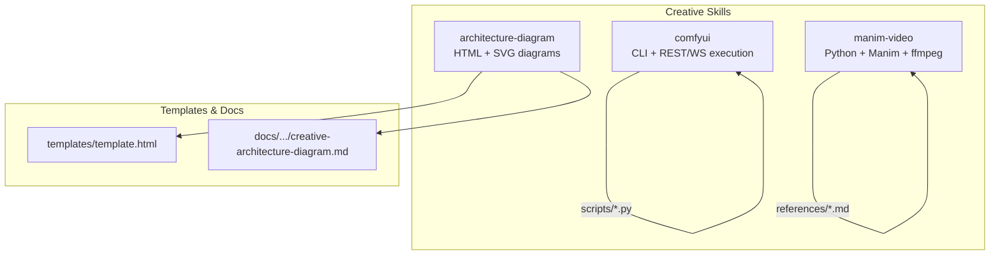
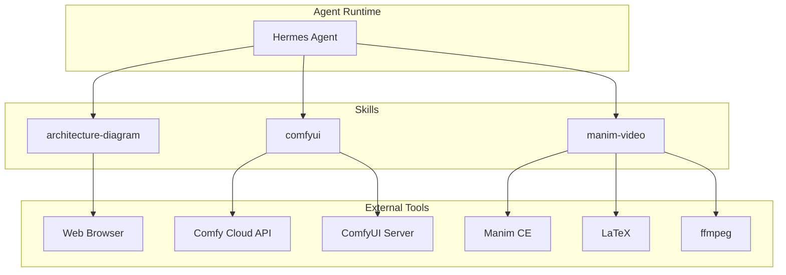
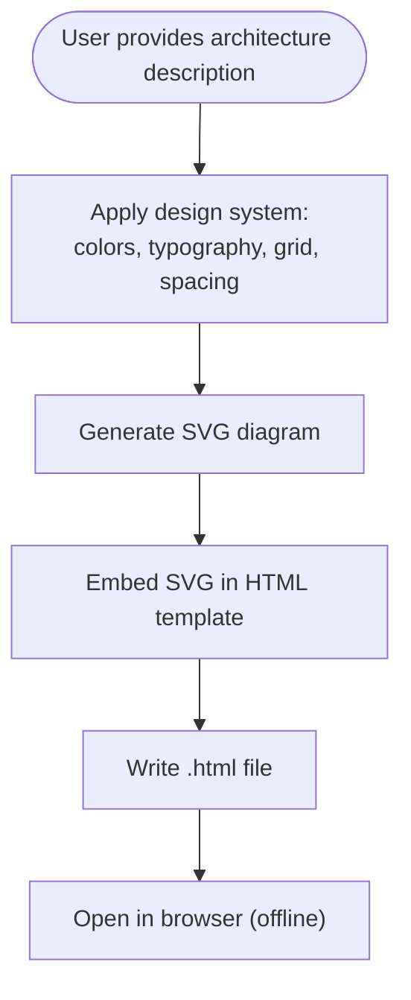
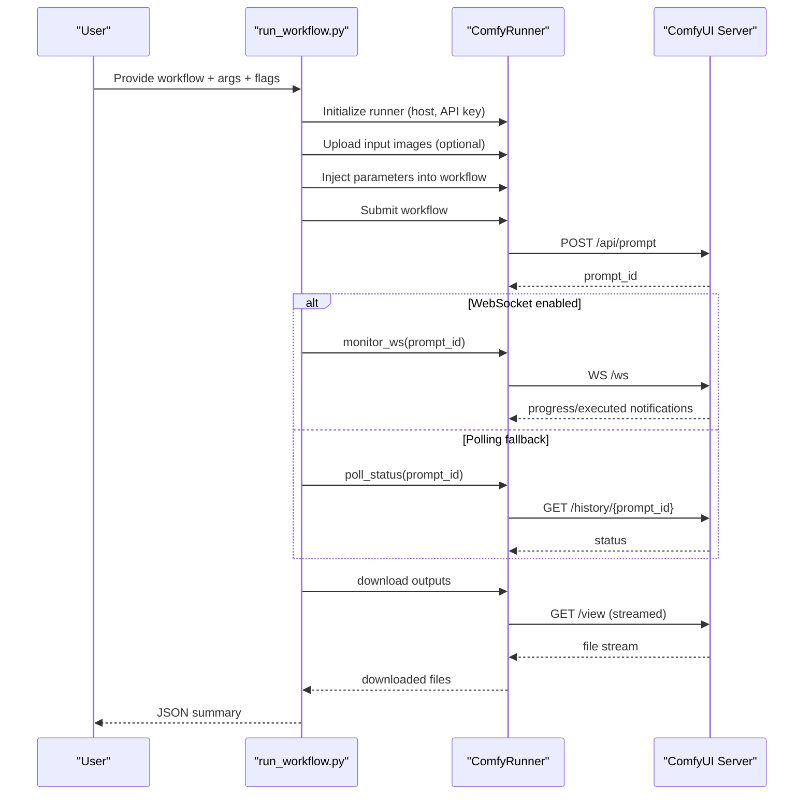
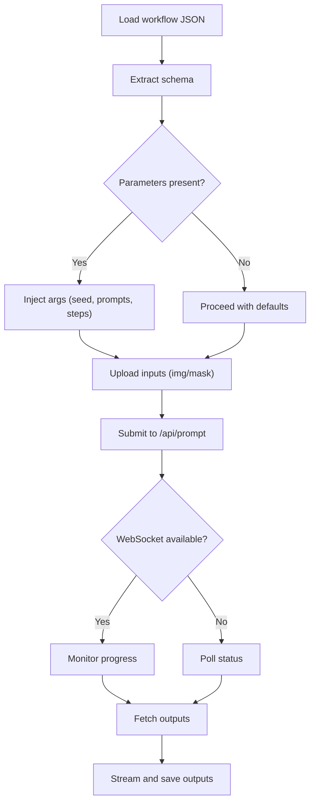
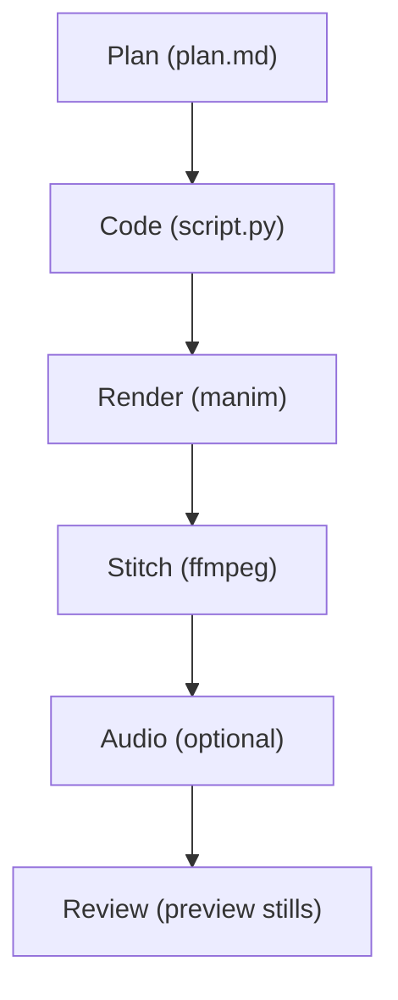
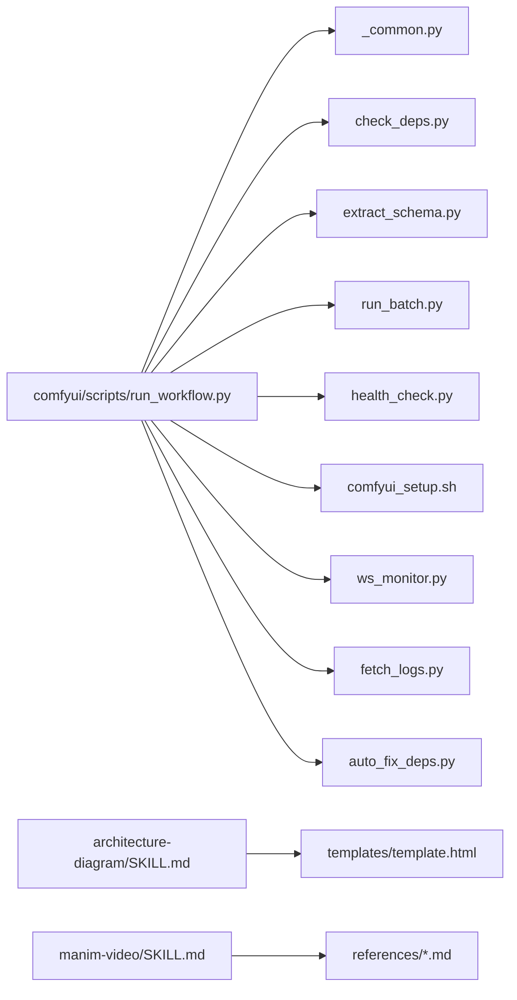

# Creative Skills

<cite>
**Referenced Files in This Document**
- [architecture-diagram/SKILL.md](file://skills/creative/architecture-diagram/SKILL.md)
- [architecture-diagram/templates/template.html](file://skills/creative/architecture-diagram/templates/template.html)
- [manim-video/SKILL.md](file://skills/creative/manim-video/SKILL.md)
- [manim-video/README.md](file://skills/creative/manim-video/README.md)
- [comfyui/SKILL.md](file://skills/creative/comfyui/SKILL.md)
- [comfyui/scripts/run_workflow.py](file://skills/creative/comfyui/scripts/run_workflow.py)
- [comfyui/scripts/_common.py](file://skills/creative/comfyui/scripts/_common.py)
- [comfyui/scripts/check_deps.py](file://skills/creative/comfyui/scripts/check_deps.py)
- [comfyui/scripts/auto_fix_deps.py](file://skills/creative/comfyui/scripts/auto_fix_deps.py)
- [comfyui/scripts/extract_schema.py](file://skills/creative/comfyui/scripts/extract_schema.py)
- [comfyui/scripts/hardware_check.py](file://skills/creative/comfyui/scripts/hardware_check.py)
- [comfyui/scripts/comfyui_setup.sh](file://skills/creative/comfyui/scripts/comfyui_setup.sh)
- [comfyui/scripts/health_check.py](file://skills/creative/comfyui/scripts/health_check.py)
- [comfyui/scripts/run_batch.py](file://skills/creative/comfyui/scripts/run_batch.py)
- [comfyui/scripts/ws_monitor.py](file://skills/creative/comfyui/scripts/ws_monitor.py)
- [comfyui/scripts/fetch_logs.py](file://skills/creative/comfyui/scripts/fetch_logs.py)
- [website/docs/user-guide/skills/bundled/creative/creative-architecture-diagram.md](file://website/docs/user-guide/skills/bundled/creative/creative-architecture-diagram.md)
</cite>

## Table of Contents
1. [Introduction](#introduction)
2. [Project Structure](#project-structure)
3. [Core Components](#core-components)
4. [Architecture Overview](#architecture-overview)
5. [Detailed Component Analysis](#detailed-component-analysis)
6. [Dependency Analysis](#dependency-analysis)
7. [Performance Considerations](#performance-considerations)
8. [Troubleshooting Guide](#troubleshooting-guide)
9. [Conclusion](#conclusion)
10. [Appendices](#appendices)

## Introduction
This document explains the Creative Skills that bring artistic and multimedia capabilities to Hermes Agent. It focuses on three core skills:
- Architecture Diagram: generates dark-themed, grid-backed technical architecture diagrams as standalone HTML files.
- ComfyUI: orchestrates image, video, and audio generation via ComfyUI using the official CLI for lifecycle and REST/WebSocket APIs for execution.
- Manim Video: produces 3Blue1Brown-style mathematical and algorithmic animations using Manim Community Edition, LaTeX, and ffmpeg.

The guide covers architecture, parameter handling, output formatting, integration with external tools and APIs, authentication and rate-limiting considerations, practical usage examples, and performance optimization strategies.

## Project Structure
Creative skills are organized under the skills/creative directory. Each skill includes:
- A skill manifest (SKILL.md) describing purpose, prerequisites, and usage.
- Templates, scripts, and example workflows where applicable.
- Website documentation that augments user guidance.

**Diagram sources**
- [architecture-diagram/SKILL.md:1-149](file://skills/creative/architecture-diagram/SKILL.md#L1-L149)
- [architecture-diagram/templates/template.html:1-320](file://skills/creative/architecture-diagram/templates/template.html#L1-L320)
- [website/docs/user-guide/skills/bundled/creative/creative-architecture-diagram.md:45-78](file://website/docs/user-guide/skills/bundled/creative/creative-architecture-diagram.md#L45-L78)
- [manim-video/SKILL.md:1-270](file://skills/creative/manim-video/SKILL.md#L1-L270)
- [comfyui/SKILL.md:1-613](file://skills/creative/comfyui/SKILL.md#L1-L613)

**Section sources**
- [architecture-diagram/SKILL.md:1-149](file://skills/creative/architecture-diagram/SKILL.md#L1-L149)
- [website/docs/user-guide/skills/bundled/creative/creative-architecture-diagram.md:45-78](file://website/docs/user-guide/skills/bundled/creative/creative-architecture-diagram.md#L45-L78)

## Core Components
- Architecture Diagram Skill
  - Generates a single HTML file containing inline SVG and CSS.
  - Uses a strict design system: color palette, typography, grid background, arrow styles, and layout rules.
  - Output is fully self-contained and renders offline in any modern browser.

- ComfyUI Skill
  - Two-layer architecture:
    - Layer 1: comfy-cli for installation, lifecycle, and model/node management.
    - Layer 2: REST/WebSocket API with helper scripts for parameter injection, execution monitoring, and output retrieval.
  - Supports local ComfyUI, Comfy Cloud, and batch/sweep execution with parallelism aware of tier limits.

- Manim Video Skill
  - End-to-end pipeline: PLAN → CODE → RENDER → STITCH → AUDIO (optional) → REVIEW.
  - Requires Python 3.10+, Manim CE, LaTeX, and ffmpeg.
  - Provides templates, references, and performance targets for draft/medium/production quality.

**Section sources**
- [architecture-diagram/SKILL.md:15-149](file://skills/creative/architecture-diagram/SKILL.md#L15-L149)
- [comfyui/SKILL.md:79-99](file://skills/creative/comfyui/SKILL.md#L79-L99)
- [manim-video/SKILL.md:57-70](file://skills/creative/manim-video/SKILL.md#L57-L70)

## Architecture Overview
The creative skill ecosystem integrates with external tools and APIs while maintaining a consistent parameter and output model across skills.

**Diagram sources**
- [architecture-diagram/SKILL.md:17-44](file://skills/creative/architecture-diagram/SKILL.md#L17-L44)
- [comfyui/SKILL.md:30-34](file://skills/creative/comfyui/SKILL.md#L30-L34)
- [manim-video/SKILL.md:30-56](file://skills/creative/manim-video/SKILL.md#L30-L56)

## Detailed Component Analysis

### Architecture Diagram Skill
- Purpose: Produce dark-tech aesthetic, grid-backed architecture diagrams as a single HTML file.
- Inputs: User’s system architecture description (components, connections, technologies).
- Processing:
  - Apply design system rules for colors, typography, spacing, and arrow styles.
  - Generate SVG diagram and embed it in a responsive HTML shell with inline CSS.
- Outputs: A self-contained .html file; preview instructions included.

**Diagram sources**
- [architecture-diagram/SKILL.md:39-61](file://skills/creative/architecture-diagram/SKILL.md#L39-L61)
- [architecture-diagram/templates/template.html:147-268](file://skills/creative/architecture-diagram/templates/template.html#L147-L268)

**Section sources**
- [architecture-diagram/SKILL.md:19-61](file://skills/creative/architecture-diagram/SKILL.md#L19-L61)
- [architecture-diagram/templates/template.html:1-320](file://skills/creative/architecture-diagram/templates/template.html#L1-L320)
- [website/docs/user-guide/skills/bundled/creative/creative-architecture-diagram.md:45-78](file://website/docs/user-guide/skills/bundled/creative/creative-architecture-diagram.md#L45-L78)

### ComfyUI Skill
- Purpose: Advanced image, video, and audio generation via ComfyUI with robust execution orchestration.
- Architecture:
  - Layer 1: comfy-cli for lifecycle and node/model management.
  - Layer 2: REST/WebSocket API with scripts for parameter injection, execution monitoring, and output retrieval.
- Parameter handling:
  - Extracts workflow schema to enumerate controllable parameters and model dependencies.
  - Injects user arguments into the workflow graph, with safeguards against overwriting links.
  - Supports image uploads for img2img/inpainting and automatic seed randomization.
- Execution:
  - Submits workflows, polls or monitors via WebSocket, and streams outputs.
  - Handles cloud routing, authentication, and signed URL downloads.
- Output formatting:
  - Downloads outputs preserving subfolder structure or flattening based on flags.
  - Emits structured JSON with file paths and metadata.

**Diagram sources**
- [comfyui/SKILL.md:79-99](file://skills/creative/comfyui/SKILL.md#L79-L99)
- [comfyui/scripts/run_workflow.py:90-343](file://skills/creative/comfyui/scripts/run_workflow.py#L90-L343)
- [comfyui/scripts/run_workflow.py:377-426](file://skills/creative/comfyui/scripts/run_workflow.py#L377-L426)

**Diagram sources**
- [comfyui/scripts/run_workflow.py:445-499](file://skills/creative/comfyui/scripts/run_workflow.py#L445-L499)
- [comfyui/scripts/run_workflow.py:506-550](file://skills/creative/comfyui/scripts/run_workflow.py#L506-L550)

**Section sources**
- [comfyui/SKILL.md:79-99](file://skills/creative/comfyui/SKILL.md#L79-L99)
- [comfyui/scripts/run_workflow.py:1-797](file://skills/creative/comfyui/scripts/run_workflow.py#L1-L797)
- [comfyui/scripts/_common.py:454-454](file://skills/creative/comfyui/scripts/_common.py#L454-L454)
- [comfyui/scripts/_common.py:834-834](file://skills/creative/comfyui/scripts/_common.py#L834-L834)

### Manim Video Skill
- Purpose: Programmatic animations for mathematics, algorithms, and technical explanations.
- Workflow:
  - PLAN: Define narrative arc, scenes, color palette, and voiceover script.
  - CODE: Implement scene classes with shared constants and clean exits.
  - RENDER: Use Manim quality presets (-ql, -qm, -qh) for draft/production.
  - STITCH: Concatenate scenes with ffmpeg.
  - AUDIO: Optionally add voiceover/music via ffmpeg.
  - REVIEW: Render preview stills and iterate.
- Creative direction:
  - Color palettes, typography scale, animation speed, and layout variation guidelines.
  - Performance targets per quality level.

**Diagram sources**
- [manim-video/SKILL.md:57-69](file://skills/creative/manim-video/SKILL.md#L57-L69)
- [manim-video/SKILL.md:136-193](file://skills/creative/manim-video/SKILL.md#L136-L193)

**Section sources**
- [manim-video/SKILL.md:8-69](file://skills/creative/manim-video/SKILL.md#L8-L69)
- [manim-video/README.md:1-24](file://skills/creative/manim-video/README.md#L1-L24)

## Dependency Analysis
- Architecture Diagram
  - No external dependencies beyond a browser; relies on inline SVG/CSS.
  - Template defines color palette, grid background, and arrow styles.

- ComfyUI
  - Depends on comfy-cli for lifecycle and ComfyUI server for execution.
  - Integrates with REST and WebSocket endpoints; supports cloud routing and authentication.
  - Scripts enforce safety (path traversal, streaming downloads) and resilience (retries, timeouts).

- Manim Video
  - Requires Python 3.10+, Manim CE, LaTeX, and ffmpeg.
  - References provide guidance for equations, graphs/data, camera/3D, and production quality.

**Diagram sources**
- [comfyui/scripts/run_workflow.py:60-68](file://skills/creative/comfyui/scripts/run_workflow.py#L60-L68)
- [comfyui/SKILL.md:50-68](file://skills/creative/comfyui/SKILL.md#L50-L68)
- [architecture-diagram/SKILL.md:140-148](file://skills/creative/architecture-diagram/SKILL.md#L140-L148)
- [manim-video/SKILL.md:229-247](file://skills/creative/manim-video/SKILL.md#L229-L247)

**Section sources**
- [comfyui/scripts/run_workflow.py:60-68](file://skills/creative/comfyui/scripts/run_workflow.py#L60-L68)
- [comfyui/scripts/check_deps.py:51-79](file://skills/creative/comfyui/scripts/check_deps.py#L51-L79)
- [comfyui/scripts/extract_schema.py](file://skills/creative/comfyui/scripts/extract_schema.py)
- [comfyui/scripts/run_batch.py](file://skills/creative/comfyui/scripts/run_batch.py)
- [comfyui/scripts/health_check.py](file://skills/creative/comfyui/scripts/health_check.py)
- [comfyui/scripts/comfyui_setup.sh](file://skills/creative/comfyui/scripts/comfyui_setup.sh)
- [comfyui/scripts/ws_monitor.py](file://skills/creative/comfyui/scripts/ws_monitor.py)
- [comfyui/scripts/fetch_logs.py](file://skills/creative/comfyui/scripts/fetch_logs.py)
- [comfyui/scripts/auto_fix_deps.py](file://skills/creative/comfyui/scripts/auto_fix_deps.py)

## Performance Considerations
- ComfyUI
  - Use WebSocket monitoring for real-time feedback; falls back to HTTP polling if unavailable.
  - Streaming downloads avoid memory spikes for large outputs.
  - Auto-adjusted timeouts for video workflows; tune via explicit timeout flags.
  - Parallel batch execution respects tier limits; use run_batch.py with appropriate parallelism.
  - Prefer local installs with adequate VRAM; leverage hardware_check.py to determine feasibility.

- Manim Video
  - Iterate at lower quality (-ql) for drafts; render production (-qh) only when needed.
  - Optimize scene composition and reduce unnecessary animations to cut render time.
  - Use preview stills to validate before full render.

- Architecture Diagram
  - Single HTML file with inline SVG ensures fast, offline rendering in any browser.

**Section sources**
- [comfyui/SKILL.md:514-598](file://skills/creative/comfyui/SKILL.md#L514-L598)
- [comfyui/scripts/run_workflow.py:10-21](file://skills/creative/comfyui/scripts/run_workflow.py#L10-L21)
- [comfyui/scripts/run_workflow.py:720-760](file://skills/creative/comfyui/scripts/run_workflow.py#L720-L760)
- [manim-video/SKILL.md:219-228](file://skills/creative/manim-video/SKILL.md#L219-L228)

## Troubleshooting Guide
- ComfyUI
  - API format required: workflows must be exported in API format; scripts detect editor format and instruct re-export.
  - Server must be running: verify with system_stats endpoint; use comfy launch --background for local.
  - Model names are exact: case-sensitive and include extensions; use comfy model list to discover.
  - Missing custom nodes: use check_deps.py and auto_fix_deps.py to install required packages.
  - Working directory: ensure comfy-cli detects the workspace; set or configure accordingly.
  - Cloud free-tier limitations: certain endpoints return 403; upgrade or use paid tier for full API access.
  - Timeout for video/audio workflows: auto-detected; override with explicit timeout.
  - Path traversal: outputs are validated to prevent escaping output-dir; keep protections enabled.
  - Trust workflows: treat unknown workflow JSON as untrusted code; inspect before execution.
  - Seed randomization: pass seed: -1 or use --randomize-seed for fresh seeds per run.

- Manim Video
  - LaTeX raw strings: use raw strings for TeX; avoid escaped sequences.
  - Text buffer spacing: ensure adequate buffer for edge text.
  - Animation lifecycle: always add mobjects before animating; fade out cleanly.
  - Performance: adhere to quality targets and scene pacing guidelines.

- Architecture Diagram
  - Follow design system rules for colors, spacing, and arrow styles.
  - Place legend outside boundary boxes; compute minimum Y-coordinate for placement.

**Section sources**
- [comfyui/SKILL.md:550-613](file://skills/creative/comfyui/SKILL.md#L550-L613)
- [manim-video/SKILL.md:194-218](file://skills/creative/manim-video/SKILL.md#L194-L218)
- [architecture-diagram/SKILL.md:106-118](file://skills/creative/architecture-diagram/SKILL.md#L106-L118)

## Conclusion
The Creative Skills in Hermes Agent provide a cohesive toolkit for technical diagrams, advanced image/video generation, and mathematical animation. By combining a design-first approach for architecture diagrams, a robust two-layer execution pipeline for ComfyUI, and a disciplined animation workflow for Manim, users can produce high-quality, reproducible creative outputs. Proper parameter handling, output formatting, and integration with external tools and APIs ensure reliability and scalability across diverse use cases.

## Appendices
- Practical Examples
  - Architecture Diagram: describe a system, generate HTML, save to a .html file, and open in a browser.
  - ComfyUI: choose local vs cloud, run health checks, upload inputs if needed, inject parameters, submit, monitor, and download outputs.
  - Manim Video: plan the narrative, write scenes, render at draft quality, stitch with ffmpeg, optionally add audio, and review.

- Authentication and Rate Limiting
  - Comfy Cloud: set COMFY_CLOUD_API_KEY; scripts route endpoints and handle signed URLs; free tier has restricted endpoints; paid tiers increase concurrency.
  - ComfyUI REST/WS: X-API-Key header for cloud; client_id filtering for local; WebSocket token support for cloud.

- Template Systems and Presets
  - Architecture Diagram: use the provided HTML template as a structural reference; it includes component examples, arrow styles, and legend.
  - ComfyUI: workflows directory contains example JSONs; convert editor-format to API format before execution.
  - Manim: references provide templates for scenes, equations, graphs/data, camera/3D, and production quality.

- Collaborative Features
  - Share workflow JSONs and parameters across team members; maintain a central repository of approved templates and presets.
  - Use standardized naming conventions for outputs and include metadata in plan.md for Manim projects.

[No sources needed since this section aggregates previously cited information]