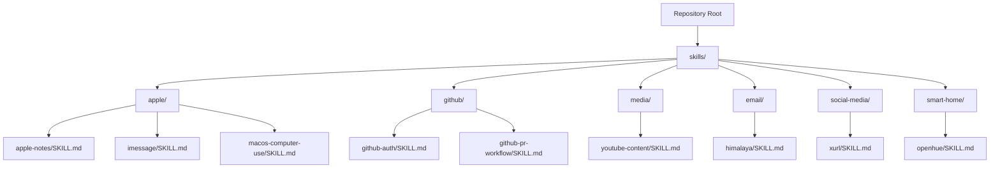
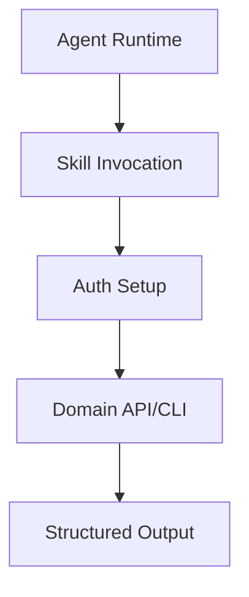
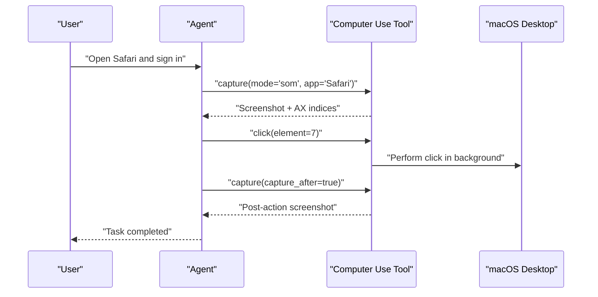
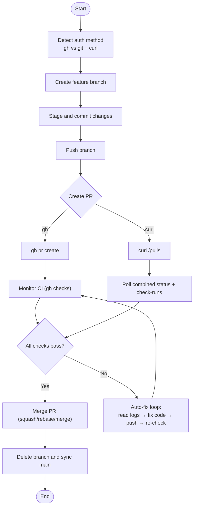
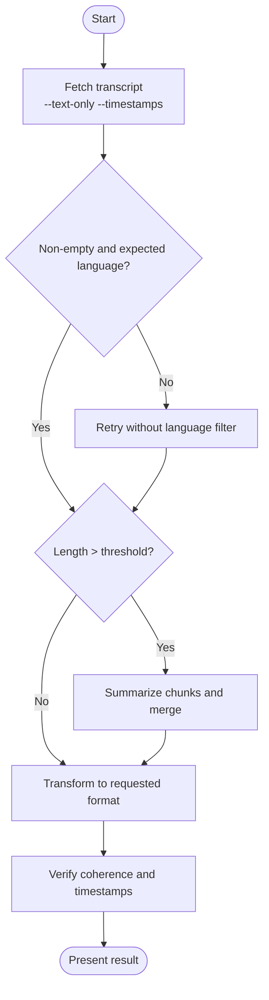
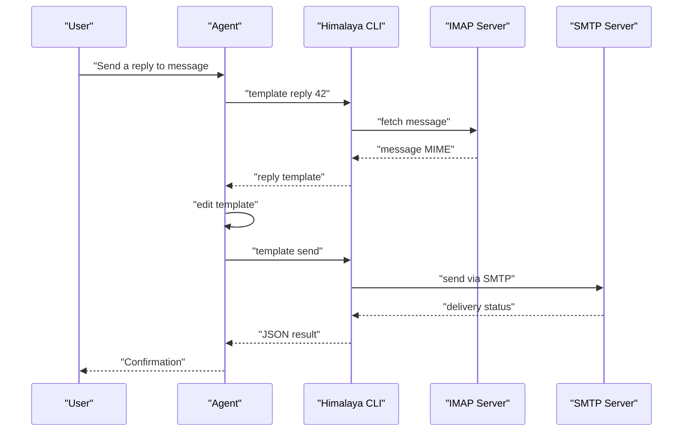
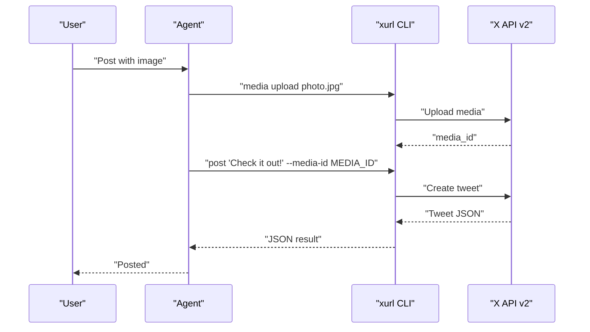
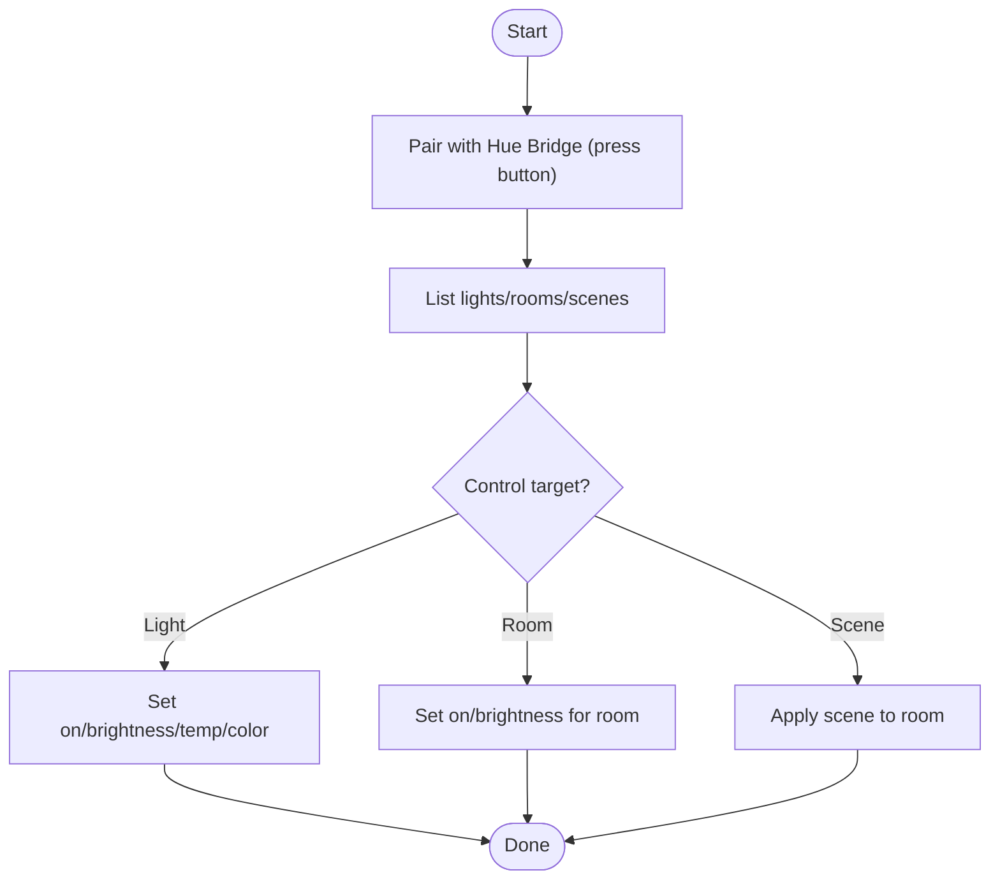
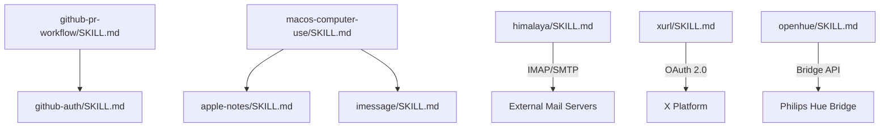

# Domain-Specific Skills

<cite>
**Referenced Files in This Document**
- [README.md](file://README.md)
- [skills/apple/DESCRIPTION.md](file://skills/apple/DESCRIPTION.md)
- [skills/apple/apple-notes/SKILL.md](file://skills/apple/apple-notes/SKILL.md)
- [skills/apple/imessage/SKILL.md](file://skills/apple/imessage/SKILL.md)
- [skills/apple/macos-computer-use/SKILL.md](file://skills/apple/macos-computer-use/SKILL.md)
- [skills/github/DESCRIPTION.md](file://skills/github/DESCRIPTION.md)
- [skills/github/github-auth/SKILL.md](file://skills/github/github-auth/SKILL.md)
- [skills/github/github-pr-workflow/SKILL.md](file://skills/github/github-pr-workflow/SKILL.md)
- [skills/media/DESCRIPTION.md](file://skills/media/DESCRIPTION.md)
- [skills/media/youtube-content/SKILL.md](file://skills/media/youtube-content/SKILL.md)
- [skills/email/DESCRIPTION.md](file://skills/email/DESCRIPTION.md)
- [skills/email/himalaya/SKILL.md](file://skills/email/himalaya/SKILL.md)
- [skills/social-media/DESCRIPTION.md](file://skills/social-media/DESCRIPTION.md)
- [skills/social-media/xurl/SKILL.md](file://skills/social-media/xurl/SKILL.md)
- [skills/smart-home/DESCRIPTION.md](file://skills/smart-home/DESCRIPTION.md)
- [skills/smart-home/openhue/SKILL.md](file://skills/smart-home/openhue/SKILL.md)
</cite>

## Table of Contents
1. [Introduction](#introduction)
2. [Project Structure](#project-structure)
3. [Core Components](#core-components)
4. [Architecture Overview](#architecture-overview)
5. [Detailed Component Analysis](#detailed-component-analysis)
6. [Dependency Analysis](#dependency-analysis)
7. [Performance Considerations](#performance-considerations)
8. [Troubleshooting Guide](#troubleshooting-guide)
9. [Conclusion](#conclusion)
10. [Appendices](#appendices)

## Introduction
This document explains the Domain-Specific Skills ecosystem that enables specialized automation across Apple platforms, GitHub, media content, email, social media, and smart home domains. It covers integration patterns, authentication mechanisms, and workflow automation capabilities. For each domain, we outline prerequisites, API/service usage, data synchronization, device control, and cross-domain coordination. Practical examples progress from simple automations to complex orchestration scenarios, with guidance on configuration, performance, and troubleshooting.

## Project Structure
The repository organizes domain-specific skills under dedicated directories. Each skill is documented with a concise SKILL.md that describes purpose, prerequisites, commands, and operational notes. The top-level README provides general context and orientation.

**Diagram sources**
- [README.md](file://README.md)
- [skills/apple/DESCRIPTION.md](file://skills/apple/DESCRIPTION.md)
- [skills/github/DESCRIPTION.md](file://skills/github/DESCRIPTION.md)
- [skills/media/DESCRIPTION.md](file://skills/media/DESCRIPTION.md)
- [skills/email/DESCRIPTION.md](file://skills/email/DESCRIPTION.md)
- [skills/social-media/DESCRIPTION.md](file://skills/social-media/DESCRIPTION.md)
- [skills/smart-home/DESCRIPTION.md](file://skills/smart-home/DESCRIPTION.md)

**Section sources**
- [README.md](file://README.md)
- [skills/apple/DESCRIPTION.md](file://skills/apple/DESCRIPTION.md)
- [skills/github/DESCRIPTION.md](file://skills/github/DESCRIPTION.md)
- [skills/media/DESCRIPTION.md](file://skills/media/DESCRIPTION.md)
- [skills/email/DESCRIPTION.md](file://skills/email/DESCRIPTION.md)
- [skills/social-media/DESCRIPTION.md](file://skills/social-media/DESCRIPTION.md)
- [skills/smart-home/DESCRIPTION.md](file://skills/smart-home/DESCRIPTION.md)

## Core Components
- Apple ecosystem skills:
  - Apple Notes: manage notes via memo CLI with iCloud sync.
  - iMessage: send/receive iMessages/SMS via imsg CLI on macOS.
  - macOS Computer Use: background GUI automation with accessibility-safe actions.
- GitHub skills:
  - Authentication: HTTPS tokens or SSH keys; optional gh CLI integration.
  - PR workflow: branch, commit, open PR, monitor CI, auto-fix, merge.
- Media skills:
  - YouTube content: fetch transcripts and transform to chapters, summaries, threads, blog posts.
- Email skills:
  - Himalaya: IMAP/SMTP email management from terminal with structured JSON output.
- Social media skills:
  - xurl: official X (Twitter) API CLI supporting OAuth 2.0 PKCE, media upload, and raw API access.
- Smart home skills:
  - OpenHue: control Philips Hue lights, rooms, and scenes via OpenHue CLI.

**Section sources**
- [skills/apple/apple-notes/SKILL.md](file://skills/apple/apple-notes/SKILL.md)
- [skills/apple/imessage/SKILL.md](file://skills/apple/imessage/SKILL.md)
- [skills/apple/macos-computer-use/SKILL.md](file://skills/apple/macos-computer-use/SKILL.md)
- [skills/github/github-auth/SKILL.md](file://skills/github/github-auth/SKILL.md)
- [skills/github/github-pr-workflow/SKILL.md](file://skills/github/github-pr-workflow/SKILL.md)
- [skills/media/youtube-content/SKILL.md](file://skills/media/youtube-content/SKILL.md)
- [skills/email/himalaya/SKILL.md](file://skills/email/himalaya/SKILL.md)
- [skills/social-media/xurl/SKILL.md](file://skills/social-media/xurl/SKILL.md)
- [skills/smart-home/openhue/SKILL.md](file://skills/smart-home/openhue/SKILL.md)

## Architecture Overview
The domain-specific skills follow a consistent pattern:
- Prerequisite detection and setup
- Authentication and credential management
- Domain API/service invocation
- Structured output and error handling
- Optional fallbacks (e.g., curl-based GitHub API when gh CLI is unavailable)

[No sources needed since this diagram shows conceptual workflow, not actual code structure]

## Detailed Component Analysis

### Apple Ecosystem Skills
- Apple Notes
  - Purpose: Create, search, edit, move, export notes via memo CLI with iCloud sync.
  - Prerequisites: macOS Notes.app, memo CLI installed, Automation permissions granted.
  - Integration pattern: Terminal commands for CRUD operations; export to Markdown/HTML.
  - Workflow: User intent → detect macOS → run memo commands → return results.
  - Limitations: Images/attachments editing not supported; interactive prompts require pty.

- iMessage
  - Purpose: Send/receive iMessages/SMS via macOS Messages.app using imsg CLI.
  - Prerequisites: macOS Messages signed in, Full Disk Access and Automation permissions.
  - Integration pattern: CLI commands for listing chats, viewing history, sending messages, watching for new messages.
  - Workflow: Resolve recipient → confirm content → send via selected service (iMessage/SMS/auto).

- macOS Computer Use
  - Purpose: Background GUI automation for screenshots, clicks, typing, scrolling, dragging without affecting user focus.
  - Prerequisites: Computer Use tool availability, cua-driver installed, Accessibility and Screen Recording permissions.
  - Integration pattern: Capture with overlays/AxoTree indices → click by index → verify with follow-up capture.
  - Workflow: Capture → Click → Verify → Repeat; avoid raising windows, restrict to app scope, stay within Spaces.

**Diagram sources**
- [skills/apple/macos-computer-use/SKILL.md](file://skills/apple/macos-computer-use/SKILL.md)

**Section sources**
- [skills/apple/apple-notes/SKILL.md](file://skills/apple/apple-notes/SKILL.md)
- [skills/apple/imessage/SKILL.md](file://skills/apple/imessage/SKILL.md)
- [skills/apple/macos-computer-use/SKILL.md](file://skills/apple/macos-computer-use/SKILL.md)

### GitHub Skills
- Authentication Setup
  - Methods:
    - Git-only: HTTPS PAT or SSH keys; credential helpers; git identity.
    - gh CLI: interactive or token-based login; automatic git credential setup.
  - Fallback: curl-based GitHub API using exported token or extracted credentials.
  - Decision flow: detect gh auth status, otherwise use git + curl.

- PR Lifecycle Workflow
  - Steps: branch creation → commits → push → create PR (gh or curl) → monitor CI (checks/status) → auto-fix loop → merge (squash/rebase/merge) → cleanup.
  - Utilities: extract owner/repo from remote; conventional commit messages; auto-enable auto-merge via GraphQL.

**Diagram sources**
- [skills/github/github-auth/SKILL.md](file://skills/github/github-auth/SKILL.md)
- [skills/github/github-pr-workflow/SKILL.md](file://skills/github/github-pr-workflow/SKILL.md)

**Section sources**
- [skills/github/github-auth/SKILL.md](file://skills/github/github-auth/SKILL.md)
- [skills/github/github-pr-workflow/SKILL.md](file://skills/github/github-pr-workflow/SKILL.md)

### Media Skills
- YouTube Content
  - Purpose: Extract transcripts and transform into chapters, summaries, threads, blog posts, quotes.
  - Setup: Install youtube-transcript-api; use helper script with JSON/plain text/timestamps/language options.
  - Workflow: Fetch transcript → validate → chunk if needed → transform → verify → present.

**Diagram sources**
- [skills/media/youtube-content/SKILL.md](file://skills/media/youtube-content/SKILL.md)

**Section sources**
- [skills/media/youtube-content/SKILL.md](file://skills/media/youtube-content/SKILL.md)

### Email Skills
- Himalaya CLI
  - Purpose: IMAP/SMTP email management from terminal; supports Notmuch and Sendmail backends.
  - Setup: Install CLI, configure config.toml with IMAP/SMTP credentials and folder aliases.
  - Operations: list folders/envelopes, search, read/export, reply/forward/write, move/copy/delete, flags, attachments.
  - Integration: structured JSON output; compose via piped templates; secure credential retrieval via external commands.

**Diagram sources**
- [skills/email/himalaya/SKILL.md](file://skills/email/himalaya/SKILL.md)

**Section sources**
- [skills/email/himalaya/SKILL.md](file://skills/email/himalaya/SKILL.md)

### Social Media Skills
- xurl (X/Twitter)
  - Purpose: Official X developer platform CLI for posting, searching, engagement, DMs, media uploads, and raw API access.
  - Authentication: OAuth 2.0 PKCE with auto-refresh; tokens persisted in user-controlled config; strict secret safety rules.
  - Integration pattern: Shortcut commands mirror X API v2; raw curl-style invocations supported; JSON output.
  - Workflows: post with media, reply/quote, search and engage, manage follows/block/mute, DMs, streaming endpoints.

**Diagram sources**
- [skills/social-media/xurl/SKILL.md](file://skills/social-media/xurl/SKILL.md)

**Section sources**
- [skills/social-media/xurl/SKILL.md](file://skills/social-media/xurl/SKILL.md)

### Smart Home Skills
- OpenHue CLI
  - Purpose: Control Philips Hue lights, rooms, and scenes via Hue Bridge from terminal.
  - Prerequisites: Install OpenHue CLI; pair with Hue Bridge by pressing bridge button; same local network.
  - Integration pattern: List resources → set on/off/brightness/color/temperature → apply to lights or rooms → trigger scenes.

**Diagram sources**
- [skills/smart-home/openhue/SKILL.md](file://skills/smart-home/openhue/SKILL.md)

**Section sources**
- [skills/smart-home/openhue/SKILL.md](file://skills/smart-home/openhue/SKILL.md)

## Dependency Analysis
- Cross-domain coordination:
  - GitHub PR workflow depends on authentication skill for credentials and can fall back to curl-based API calls.
  - Apple Notes and iMessage integrate with macOS system features and require user consent for automation.
  - Himalaya relies on external mail servers and secure credential retrieval mechanisms.
  - xurl depends on user-managed OAuth credentials and adheres to strict secret safety rules.
  - OpenHue depends on local network connectivity and physical bridge pairing.
- Coupling and cohesion:
  - Each skill encapsulates domain-specific logic and CLI usage, minimizing coupling to other domains.
  - Shared patterns include prerequisite checks, structured output, and robust error handling.

**Diagram sources**
- [skills/github/github-auth/SKILL.md](file://skills/github/github-auth/SKILL.md)
- [skills/github/github-pr-workflow/SKILL.md](file://skills/github/github-pr-workflow/SKILL.md)
- [skills/apple/apple-notes/SKILL.md](file://skills/apple/apple-notes/SKILL.md)
- [skills/apple/imessage/SKILL.md](file://skills/apple/imessage/SKILL.md)
- [skills/apple/macos-computer-use/SKILL.md](file://skills/apple/macos-computer-use/SKILL.md)
- [skills/email/himalaya/SKILL.md](file://skills/email/himalaya/SKILL.md)
- [skills/social-media/xurl/SKILL.md](file://skills/social-media/xurl/SKILL.md)
- [skills/smart-home/openhue/SKILL.md](file://skills/smart-home/openhue/SKILL.md)

**Section sources**
- [skills/github/github-auth/SKILL.md](file://skills/github/github-auth/SKILL.md)
- [skills/github/github-pr-workflow/SKILL.md](file://skills/github/github-pr-workflow/SKILL.md)
- [skills/apple/apple-notes/SKILL.md](file://skills/apple/apple-notes/SKILL.md)
- [skills/apple/imessage/SKILL.md](file://skills/apple/imessage/SKILL.md)
- [skills/apple/macos-computer-use/SKILL.md](file://skills/apple/macos-computer-use/SKILL.md)
- [skills/email/himalaya/SKILL.md](file://skills/email/himalaya/SKILL.md)
- [skills/social-media/xurl/SKILL.md](file://skills/social-media/xurl/SKILL.md)
- [skills/smart-home/openhue/SKILL.md](file://skills/smart-home/openhue/SKILL.md)

## Performance Considerations
- Apple macOS Computer Use
  - Use capture-after patterns to reduce round-trips; scope captures to specific apps to minimize overlay noise.
  - Prefer element indices over pixel coordinates for reliability across models.
- GitHub
  - Use gh CLI when available for richer API access; otherwise rely on curl with minimal requests and cached tokens.
  - Batch operations where possible (e.g., list runs, then act) and avoid repeated parsing of large outputs.
- Media
  - Chunk long transcripts before summarization; use timestamps to improve accuracy.
- Email
  - Use JSON output for programmatic parsing; paginate carefully to limit payload sizes.
- Social Media
  - Respect rate limits; throttle write operations; use streaming endpoints for continuous feeds.
- Smart Home
  - Minimize network round trips; group operations per room or scene; schedule via cron for predictable timing.

[No sources needed since this section provides general guidance]

## Troubleshooting Guide
- Apple
  - Computer Use driver not installed or permissions missing: ensure Accessibility and Screen Recording permissions; re-run tools setup.
  - Stale element indices: re-capture after UI changes.
- GitHub
  - Authentication failures: verify gh auth status or git credential helper; ensure PAT has required scopes; rotate credentials if needed.
  - SSH connectivity: adjust ~/.ssh/config to use Port 443 with Host ssh.github.com; verify key setup.
- Media
  - Transcript disabled/private/no matching language: check video settings or retry without language filter; install youtube-transcript-api.
- Email
  - Folder alias syntax: use plural dotted keys under account section; incorrect alias forms cause silent resolution failures.
  - Debugging: enable RUST_LOG for detailed traces.
- Social Media
  - OAuth misconfiguration: ensure app type is “Web app, automated app or bot”; re-run oauth2 with explicit username if /2/users/me fails.
  - Rate limits and credits: expect 429 or billing-related errors; wait and retry or purchase credits.
- Smart Home
  - Bridge pairing: press bridge button on first run; ensure same local network; verify names are case-sensitive.

**Section sources**
- [skills/apple/macos-computer-use/SKILL.md](file://skills/apple/macos-computer-use/SKILL.md)
- [skills/github/github-auth/SKILL.md](file://skills/github/github-auth/SKILL.md)
- [skills/media/youtube-content/SKILL.md](file://skills/media/youtube-content/SKILL.md)
- [skills/email/himalaya/SKILL.md](file://skills/email/himalaya/SKILL.md)
- [skills/social-media/xurl/SKILL.md](file://skills/social-media/xurl/SKILL.md)
- [skills/smart-home/openhue/SKILL.md](file://skills/smart-home/openhue/SKILL.md)

## Conclusion
The Domain-Specific Skills provide robust, repeatable automation across Apple, GitHub, media, email, social media, and smart home domains. They emphasize secure authentication, structured output, and resilient fallbacks. By following the documented workflows and troubleshooting guidance, users can implement simple automations and scale to complex orchestration across heterogeneous services.

[No sources needed since this section summarizes without analyzing specific files]

## Appendices
- Configuration management
  - Apple: grant Automation and Full Disk Access; configure memo and imsg permissions.
  - GitHub: choose gh CLI or git-only method; configure credential helpers and identities.
  - Email: set up config.toml with secure credential retrieval; define folder aliases.
  - Social Media: register app, configure redirect URI, authenticate via OAuth 2.0 PKCE; protect secrets.
  - Smart Home: install OpenHue CLI, pair bridge, ensure local network access.
- Device discovery and control
  - Apple: use cua-driver for background automation; list apps and focus_app to target UI.
  - GitHub: detect owner/repo from remote; use gh or curl endpoints.
  - Media: use helper script to fetch transcripts; validate language and length.
  - Email: list envelopes and folders; export raw MIME for advanced processing.
  - Social Media: use shortcut commands or raw API access; respect rate limits.
  - Smart Home: list lights/rooms/scenes; apply presets and schedules.

[No sources needed since this section provides general guidance]