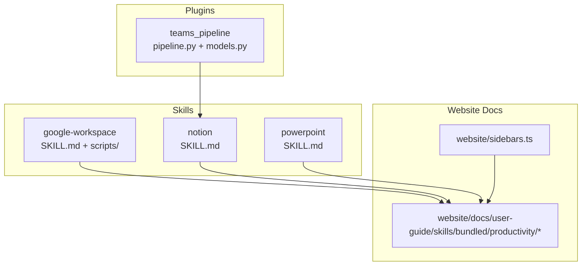
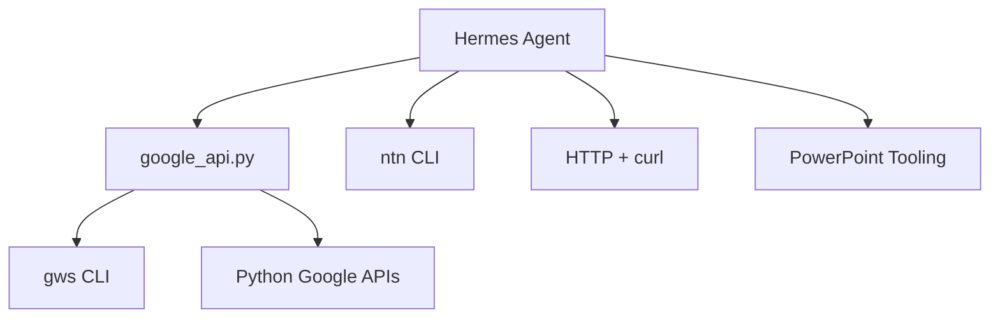
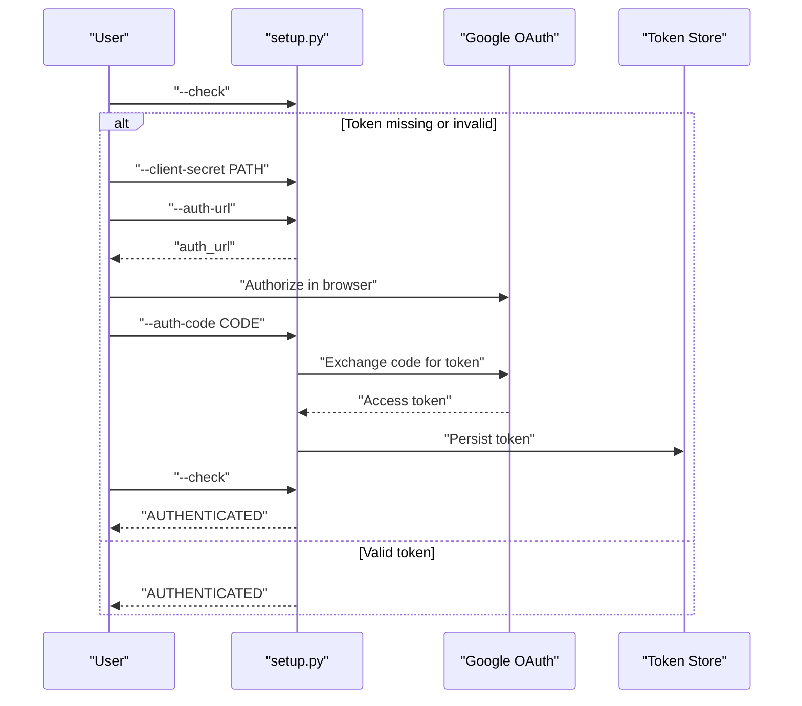
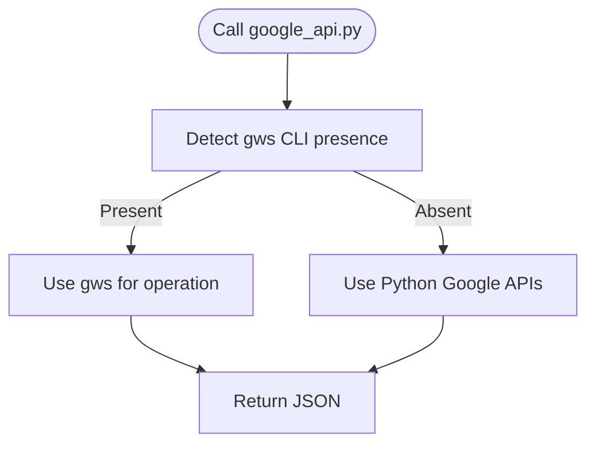
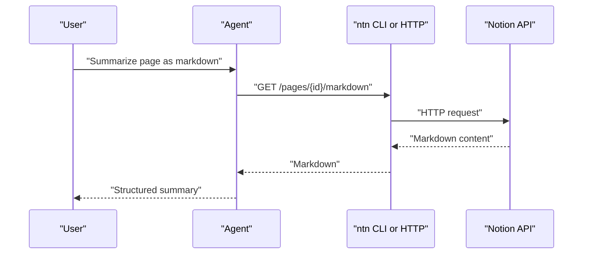
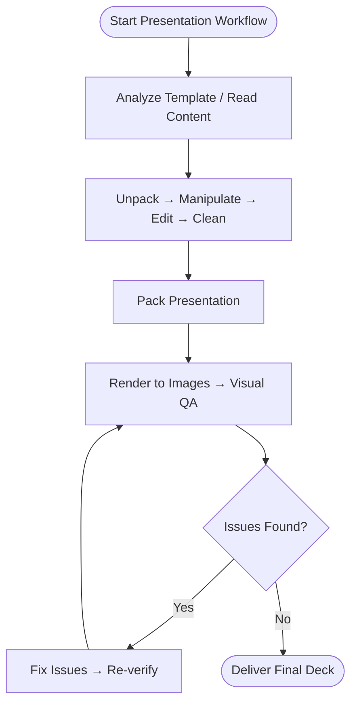
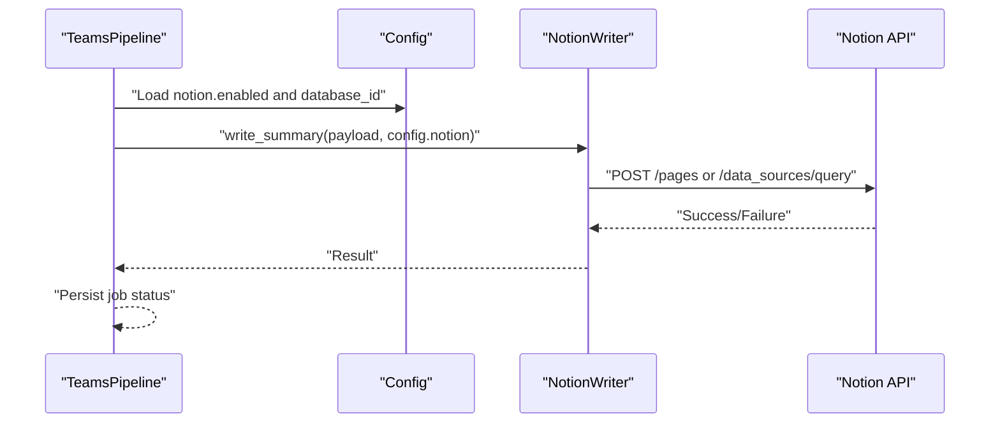
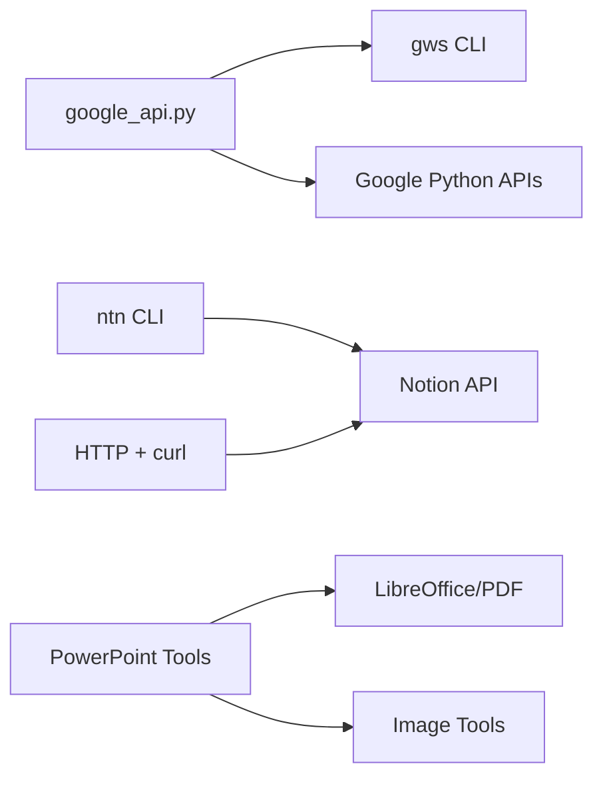

# Productivity Skills

<cite>
**Referenced Files in This Document**
- [README.md](file://README.md)
- [skills/productivity/DESCRIPTION.md](file://skills/productivity/DESCRIPTION.md)
- [skills/productivity/google-workspace/SKILL.md](file://skills/productivity/google-workspace/SKILL.md)
- [skills/productivity/google-workspace/scripts/setup.py](file://skills/productivity/google-workspace/scripts/setup.py)
- [skills/productivity/google-workspace/scripts/google_api.py](file://skills/productivity/google-workspace/scripts/google_api.py)
- [skills/productivity/notion/SKILL.md](file://skills/productivity/notion/SKILL.md)
- [skills/productivity/powerpoint/SKILL.md](file://skills/productivity/powerpoint/SKILL.md)
- [website/docs/user-guide/skills/bundled/productivity/productivity-notion.md](file://website/docs/user-guide/skills/bundled/productivity/productivity-notion.md)
- [website/sidebars.ts](file://website/sidebars.ts)
- [plugins/teams_pipeline/pipeline.py](file://plugins/teams_pipeline/pipeline.py)
- [plugins/teams_pipeline/models.py](file://plugins/teams_pipeline/models.py)
</cite>

## Table of Contents
1. [Introduction](#introduction)
2. [Project Structure](#project-structure)
3. [Core Components](#core-components)
4. [Architecture Overview](#architecture-overview)
5. [Detailed Component Analysis](#detailed-component-analysis)
6. [Dependency Analysis](#dependency-analysis)
7. [Performance Considerations](#performance-considerations)
8. [Troubleshooting Guide](#troubleshooting-guide)
9. [Conclusion](#conclusion)
10. [Appendices](#appendices)

## Introduction
This document describes the productivity skills that automate workflows and improve office productivity within Hermes Agent. It focuses on three key productivity domains:
- Google Workspace: email, calendar, Drive, Docs, Sheets, Contacts
- Notion: pages, databases (data sources), markdown, and Workers
- PowerPoint: reading, editing, and creating .pptx presentations

It explains integration patterns, authentication, data synchronization, rate-limiting considerations, and practical automation workflows. It also outlines ecosystem features such as template systems, automation rules, and team collaboration hooks.

## Project Structure
The productivity skills are distributed as bundled skills under the productivity category. Each skill includes a declarative skill definition and, where applicable, helper scripts for authentication and API access.

**Diagram sources**
- [skills/productivity/google-workspace/SKILL.md](file://skills/productivity/google-workspace/SKILL.md)
- [skills/productivity/notion/SKILL.md](file://skills/productivity/notion/SKILL.md)
- [skills/productivity/powerpoint/SKILL.md](file://skills/productivity/powerpoint/SKILL.md)
- [website/docs/user-guide/skills/bundled/productivity/productivity-notion.md](file://website/docs/user-guide/skills/bundled/productivity/productivity-notion.md)
- [website/sidebars.ts](file://website/sidebars.ts)
- [plugins/teams_pipeline/pipeline.py](file://plugins/teams_pipeline/pipeline.py)
- [plugins/teams_pipeline/models.py](file://plugins/teams_pipeline/models.py)

**Section sources**
- [skills/productivity/DESCRIPTION.md](file://skills/productivity/DESCRIPTION.md)
- [website/sidebars.ts](file://website/sidebars.ts)

## Core Components
- Google Workspace skill
  - Provides unified access to Gmail, Calendar, Drive, Docs, Sheets, Contacts via a CLI wrapper and Python client.
  - Includes a guided OAuth setup script and a compatibility wrapper that prefers an external CLI when available.
- Notion skill
  - Supports both a native CLI and a cross-platform HTTP path, enabling page reads, markdown extraction, database queries, and file uploads.
  - Documents Workers capabilities for syncing, tools, and webhooks.
- PowerPoint skill
  - Focuses on reading, editing, and creating .pptx presentations, with guidance for templates, QA, and conversion to images for visual review.

**Section sources**
- [skills/productivity/google-workspace/SKILL.md](file://skills/productivity/google-workspace/SKILL.md)
- [skills/productivity/google-workspace/scripts/setup.py](file://skills/productivity/google-workspace/scripts/setup.py)
- [skills/productivity/google-workspace/scripts/google_api.py](file://skills/productivity/google-workspace/scripts/google_api.py)
- [skills/productivity/notion/SKILL.md](file://skills/productivity/notion/SKILL.md)
- [skills/productivity/powerpoint/SKILL.md](file://skills/productivity/powerpoint/SKILL.md)

## Architecture Overview
The productivity skills integrate with cloud services through standardized authentication and API access patterns. The Google Workspace skill supports both an external CLI and a Python client, while the Notion skill supports a CLI path and a cross-platform HTTP path. The PowerPoint skill orchestrates local file manipulation and conversion tools.

**Diagram sources**
- [skills/productivity/google-workspace/scripts/google_api.py](file://skills/productivity/google-workspace/scripts/google_api.py)
- [skills/productivity/google-workspace/SKILL.md](file://skills/productivity/google-workspace/SKILL.md)
- [skills/productivity/notion/SKILL.md](file://skills/productivity/notion/SKILL.md)
- [skills/productivity/powerpoint/SKILL.md](file://skills/productivity/powerpoint/SKILL.md)

## Detailed Component Analysis

### Google Workspace Skill
- Authentication and setup
  - Uses a guided, non-interactive setup script to manage OAuth credentials, scopes, and token persistence.
  - Supports live checks to detect disabled clients or accounts.
- API access patterns
  - Prefers an external CLI when present; otherwise uses Python client libraries.
  - Normalizes credentials and refreshes tokens transparently.
- Capabilities
  - Gmail: search, read, send, reply, labels, modify.
  - Calendar: list, create, delete.
  - Drive: search, get, upload, download, create folder, share, delete.
  - Contacts: list.
  - Sheets: create, get, update, append.
  - Docs: get, create, append.

**Diagram sources**
- [skills/productivity/google-workspace/scripts/setup.py](file://skills/productivity/google-workspace/scripts/setup.py)

**Diagram sources**
- [skills/productivity/google-workspace/scripts/google_api.py](file://skills/productivity/google-workspace/scripts/google_api.py)

Practical automation examples
- Email triage and response
  - Search unread messages, extract body, draft a reply, and send.
- Calendar orchestration
  - Schedule recurring meetings, fetch upcoming events, and cancel as needed.
- Document ingestion
  - Download Google Docs as PDF, export Sheets to CSV, and upload reports to Drive.

Integration notes
- Authentication
  - Tokens are stored securely and refreshed automatically; setup supports partial scopes and live validation.
- Rate limiting
  - Follow best practices: batch reads, avoid rapid-fire sequential calls, and respect service quotas.
- Data synchronization
  - Use Drive export formats for interoperability; maintain consistent naming and folder structures.

**Section sources**
- [skills/productivity/google-workspace/SKILL.md](file://skills/productivity/google-workspace/SKILL.md)
- [skills/productivity/google-workspace/scripts/setup.py](file://skills/productivity/google-workspace/scripts/setup.py)
- [skills/productivity/google-workspace/scripts/google_api.py](file://skills/productivity/google-workspace/scripts/google_api.py)

### Notion Skill
- Dual access paths
  - ntn CLI for macOS/Linux (preferred) and HTTP + curl for cross-platform compatibility.
- Core operations
  - Pages: read metadata, read as markdown, create from markdown, patch with markdown, append blocks.
  - Databases (data sources): query with filters and sorts, create databases, update properties.
  - Files: one-liner uploads via CLI; 3-step flow via HTTP.
- Workers
  - Syncs, tools, and webhooks hosted by Notion; requires appropriate plan and CLI availability.

**Diagram sources**
- [skills/productivity/notion/SKILL.md](file://skills/productivity/notion/SKILL.md)

Practical automation examples
- Knowledge base updates
  - Create a new page from a markdown template and populate typed properties.
- Team dashboards
  - Query a database for active items, sort by date, and render a concise report.
- File ingestion
  - Upload images or documents directly from local storage to Notion.

Integration notes
- Authentication
  - Requires an integration token configured in environment variables; pages/databases must be shared with the integration.
- Rate limiting
  - Expect a sustained average around a fixed number of requests per second; avoid bursty operations.
- Workers
  - Deploy and manage Workers using the CLI; treat webhook URLs as secrets.

**Section sources**
- [skills/productivity/notion/SKILL.md](file://skills/productivity/notion/SKILL.md)
- [website/docs/user-guide/skills/bundled/productivity/productivity-notion.md](file://website/docs/user-guide/skills/bundled/productivity/productivity-notion.md)

### PowerPoint Skill
- Reading and analysis
  - Extract text, generate thumbnails, and unpack raw XML for deep inspection.
- Editing and creation
  - Use templates, unpack/manipulate slides, edit content, and repack presentations.
- Quality assurance
  - Convert slides to images and apply a structured visual QA loop to catch layout and readability issues.
- Dependencies
  - Tools for text extraction, thumbnails, creating from scratch, and converting to images.

**Diagram sources**
- [skills/productivity/powerpoint/SKILL.md](file://skills/productivity/powerpoint/SKILL.md)

Practical automation examples
- Pitch deck assembly
  - Combine content from multiple sources into a themed presentation using a consistent template.
- Slide-by-slide updates
  - Modify speaker notes, replace visuals, and adjust layouts based on feedback.
- Automated review
  - Generate image previews for each slide and run a checklist-based QA routine.

**Section sources**
- [skills/productivity/powerpoint/SKILL.md](file://skills/productivity/powerpoint/SKILL.md)

### Teams Pipeline Integration (Notion Collaboration)
The teams pipeline integrates Notion as a destination for meeting summaries and artifacts, enabling automated knowledge capture and collaboration.

**Diagram sources**
- [plugins/teams_pipeline/pipeline.py](file://plugins/teams_pipeline/pipeline.py)
- [plugins/teams_pipeline/models.py](file://plugins/teams_pipeline/models.py)

**Section sources**
- [plugins/teams_pipeline/pipeline.py](file://plugins/teams_pipeline/pipeline.py)
- [plugins/teams_pipeline/models.py](file://plugins/teams_pipeline/models.py)

## Dependency Analysis
- Google Workspace
  - External CLI preference: gws is used when available; otherwise Python client libraries are used.
  - Authentication: centralized token storage and refresh logic.
- Notion
  - Dual-path design: CLI for ergonomics and HTTP for portability.
  - Environment-based configuration for token and workspace selection.
- PowerPoint
  - Local tooling for text extraction, thumbnails, and conversion to images.

**Diagram sources**
- [skills/productivity/google-workspace/scripts/google_api.py](file://skills/productivity/google-workspace/scripts/google_api.py)
- [skills/productivity/notion/SKILL.md](file://skills/productivity/notion/SKILL.md)
- [skills/productivity/powerpoint/SKILL.md](file://skills/productivity/powerpoint/SKILL.md)

**Section sources**
- [skills/productivity/google-workspace/scripts/google_api.py](file://skills/productivity/google-workspace/scripts/google_api.py)
- [skills/productivity/notion/SKILL.md](file://skills/productivity/notion/SKILL.md)
- [skills/productivity/powerpoint/SKILL.md](file://skills/productivity/powerpoint/SKILL.md)

## Performance Considerations
- Batch operations
  - Combine reads and minimize round-trips; for example, batch Drive searches and Gmail listings.
- Export strategies
  - Prefer native export formats from Google Workspace for downstream processing.
- Rendering and QA
  - Convert slides to images at a moderate resolution to balance quality and speed.
- Rate limiting
  - Respect provider quotas; stagger requests and avoid concurrent bursts.

[No sources needed since this section provides general guidance]

## Troubleshooting Guide
- Google Workspace
  - Authentication failures: re-run setup; ensure correct client secret and scopes; verify account and client status.
  - Partial scopes: reauthorize to grant additional permissions.
  - Live checks: disabled client or account will fail; resolve in Google Cloud Console or myaccount.google.com.
- Notion
  - 404 on pages: ensure the integration is shared with the page/database.
  - Rate limiting: reduce request frequency; use efficient queries with filters and sorts.
- PowerPoint
  - QA loops: iterate until no new issues are found; leverage subagents for fresh perspectives.

**Section sources**
- [skills/productivity/google-workspace/SKILL.md](file://skills/productivity/google-workspace/SKILL.md)
- [skills/productivity/notion/SKILL.md](file://skills/productivity/notion/SKILL.md)
- [skills/productivity/powerpoint/SKILL.md](file://skills/productivity/powerpoint/SKILL.md)

## Conclusion
The productivity skills in Hermes Agent provide robust automation across email, calendars, documents, presentations, and knowledge bases. By leveraging standardized authentication, dual access paths, and structured QA routines, teams can streamline workflows, maintain consistency, and scale collaboration with minimal friction.

[No sources needed since this section summarizes without analyzing specific files]

## Appendices
- Ecosystem features
  - Template systems: PowerPoint templates and Notion page/database templates.
  - Automation rules: scheduled syncs, webhook triggers, and batch operations.
  - Team collaboration: shared pages, permissions, and pipeline-driven knowledge capture.

[No sources needed since this section provides general guidance]