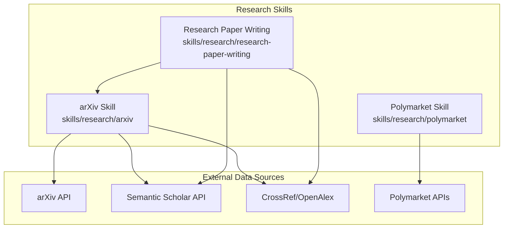
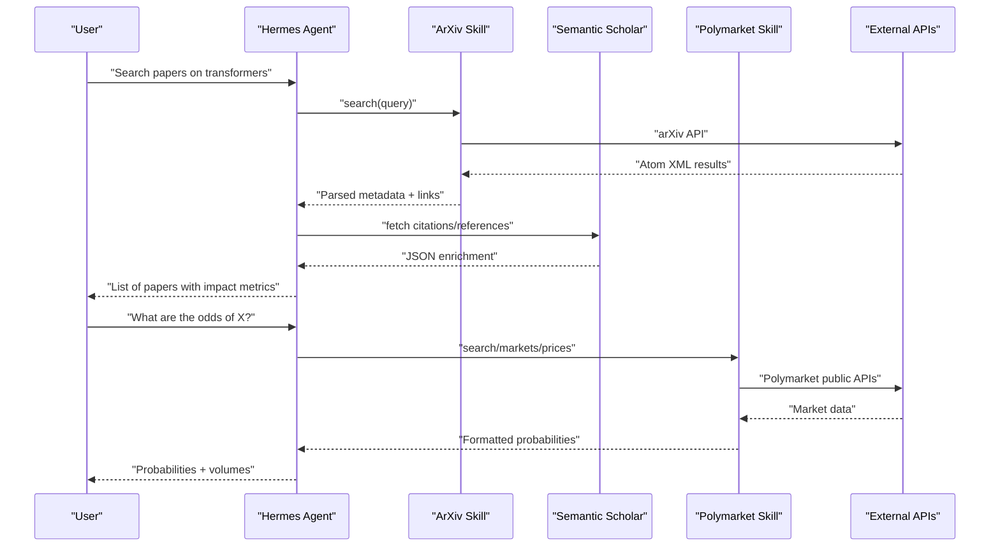
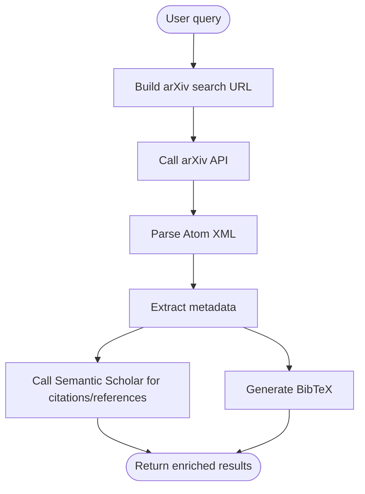
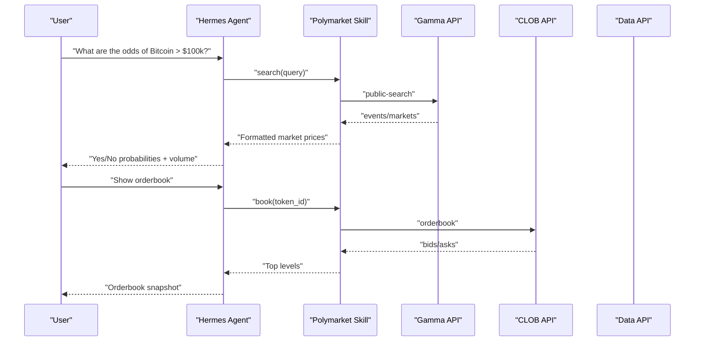
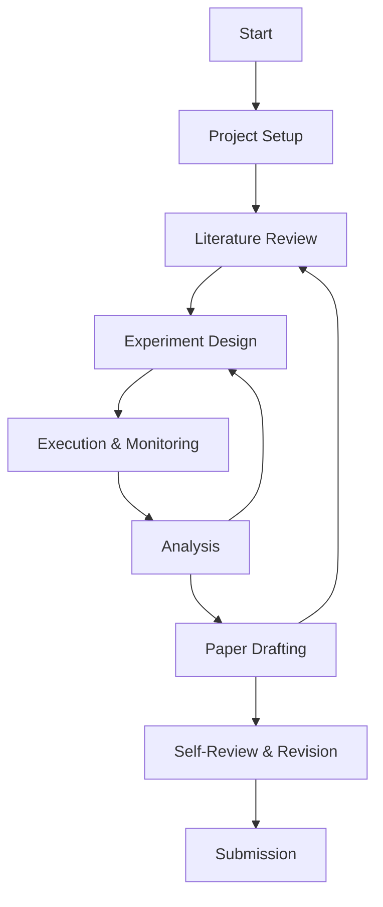
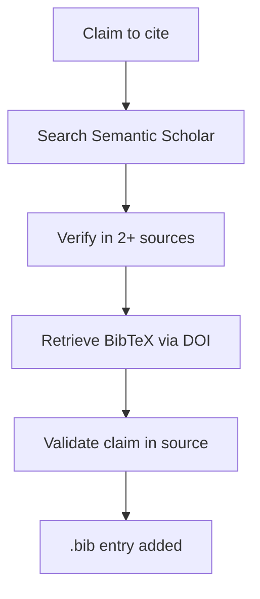
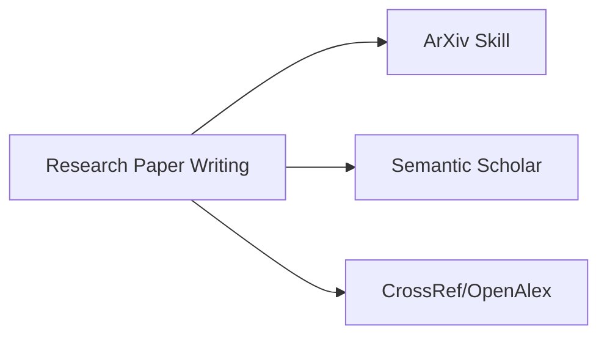

# Research Skills

<cite>
**Referenced Files in This Document**
- [arXiv Research SKILL.md](file://skills/research/arxiv/SKILL.md)
- [arXiv CLI script](file://skills/research/arxiv/scripts/search_arxiv.py)
- [Polymarket SKILL.md](file://skills/research/polymarket/SKILL.md)
- [Polymarket CLI script](file://skills/research/polymarket/scripts/polymarket.py)
- [Research Paper Writing SKILL.md](file://skills/research/research-paper-writing/SKILL.md)
- [Citation Workflow reference](file://skills/research/research-paper-writing/references/citation-workflow.md)
- [Experiment Patterns reference](file://skills/research/research-paper-writing/references/experiment-patterns.md)
- [Research Paper Writing website docs](file://website/docs/user-guide/skills/bundled/research/research-research-paper-writing.md)
- [ArXiv website docs](file://website/docs/user-guide/skills/bundled/research/research-arxiv.md)
- [Polymarket website docs](file://website/docs/user-guide/skills/bundled/research/research-polymarket.md)
</cite>

## Table of Contents
1. [Introduction](#introduction)
2. [Project Structure](#project-structure)
3. [Core Components](#core-components)
4. [Architecture Overview](#architecture-overview)
5. [Detailed Component Analysis](#detailed-component-analysis)
6. [Dependency Analysis](#dependency-analysis)
7. [Performance Considerations](#performance-considerations)
8. [Troubleshooting Guide](#troubleshooting-guide)
9. [Conclusion](#conclusion)
10. [Appendices](#appendices)

## Introduction
This document explains the Research Skills that enable academic and market research within Hermes Agent. It focuses on three bundled research capabilities:
- ArXiv skill for discovering and retrieving academic papers from arXiv and enriching metadata via Semantic Scholar
- Polymarket skill for querying prediction market data from Polymarket’s public APIs
- Research Paper Writing skill for orchestrating literature review, hypothesis formation, experiment design, analysis, and paper drafting

It also documents research methodology integration patterns, data aggregation mechanisms, analytical tool capabilities, and practical workflows spanning from basic searches to advanced research pipelines. Integration points with academic databases (arXiv, Semantic Scholar, Crossref/OpenAlex), market data sources (Polymarket), and research collaboration tools are covered, along with performance optimization and troubleshooting guidance.

## Project Structure
The research capabilities are organized as bundled skills under the research category:
- skills/research/arxiv: CLI and instructions for arXiv paper discovery and metadata extraction
- skills/research/polymarket: CLI and instructions for Polymarket prediction market data
- skills/research/research-paper-writing: End-to-end research paper writing pipeline with methodology, experiment patterns, and citation management

**Diagram sources**
- [arXiv Research SKILL.md:14-283](file://skills/research/arxiv/SKILL.md#L14-L283)
- [Polymarket SKILL.md:10-78](file://skills/research/polymarket/SKILL.md#L10-L78)
- [Research Paper Writing SKILL.md:19-2378](file://skills/research/research-paper-writing/SKILL.md#L19-L2378)

**Section sources**
- [arXiv Research SKILL.md:1-283](file://skills/research/arxiv/SKILL.md#L1-L283)
- [Polymarket SKILL.md:1-78](file://skills/research/polymarket/SKILL.md#L1-L78)
- [Research Paper Writing SKILL.md:1-2378](file://skills/research/research-paper-writing/SKILL.md#L1-L2378)

## Core Components
- ArXiv skill: Provides search, metadata retrieval, and BibTeX generation via arXiv REST API, plus enrichment via Semantic Scholar for citations and recommendations.
- Polymarket skill: Offers discovery, pricing, orderbook, and historical price data from Polymarket’s public endpoints.
- Research Paper Writing skill: Implements a structured research lifecycle including literature review, experiment design, execution, analysis, and paper drafting with robust citation and experiment management.

**Section sources**
- [arXiv Research SKILL.md:14-283](file://skills/research/arxiv/SKILL.md#L14-L283)
- [Polymarket SKILL.md:10-78](file://skills/research/polymarket/SKILL.md#L10-L78)
- [Research Paper Writing SKILL.md:19-2378](file://skills/research/research-paper-writing/SKILL.md#L19-L2378)

## Architecture Overview
The research skills integrate with external APIs and internal research tools to form a cohesive research workflow:

**Diagram sources**
- [arXiv Research SKILL.md:192-253](file://skills/research/arxiv/SKILL.md#L192-L253)
- [Polymarket SKILL.md:35-58](file://skills/research/polymarket/SKILL.md#L35-L58)
- [Research Paper Writing SKILL.md:247-270](file://skills/research/research-paper-writing/SKILL.md#L247-L270)

## Detailed Component Analysis

### ArXiv Skill
Purpose: Discover academic papers from arXiv, parse Atom XML, and generate BibTeX. Enrich with Semantic Scholar for citations and recommendations.

Key capabilities:
- Search syntax: support for all/title/author/abstract/category/comment prefixes and boolean operators
- Sorting and pagination controls
- Fetching specific IDs and reading abstracts/full-text via web extraction
- BibTeX generation from metadata
- Integration with Semantic Scholar for citation counts, references, and author profiles

**Diagram sources**
- [arXiv Research SKILL.md:27-116](file://skills/research/arxiv/SKILL.md#L27-L116)
- [arXiv Research SKILL.md:114-144](file://skills/research/arxiv/SKILL.md#L114-L144)
- [arXiv Research SKILL.md:192-241](file://skills/research/arxiv/SKILL.md#L192-L241)

Practical usage patterns:
- Basic search and clean output parsing
- Boolean queries and category filtering
- Sorting by submitted date and pagination
- Fetching specific IDs and reading abstracts/full-text
- Generating BibTeX entries and verifying citations

CLI helper:
- A Python script wraps arXiv search with clean output and supports author/category/id filters.

**Section sources**
- [arXiv Research SKILL.md:27-116](file://skills/research/arxiv/SKILL.md#L27-L116)
- [arXiv Research SKILL.md:114-144](file://skills/research/arxiv/SKILL.md#L114-L144)
- [arXiv Research SKILL.md:175-188](file://skills/research/arxiv/SKILL.md#L175-L188)
- [arXiv CLI script:20-80](file://skills/research/arxiv/scripts/search_arxiv.py#L20-L80)

### Polymarket Skill
Purpose: Query prediction market data from Polymarket’s public APIs to answer probabilistic questions and monitor market movements.

Key capabilities:
- Three public API domains: Gamma (discovery/search), CLOB (real-time prices/orderbooks/history), Data (trades/open interest)
- Parsing double-encoded JSON fields for outcomePrices/outcomes/clobTokenIds
- Formatting prices as percentages and volumes for readability
- Typical workflow: search → parse → present → deep dive (orderbook/history)

**Diagram sources**
- [Polymarket SKILL.md:35-58](file://skills/research/polymarket/SKILL.md#L35-L58)
- [Polymarket CLI script:96-150](file://skills/research/polymarket/scripts/polymarket.py#L96-L150)
- [Polymarket CLI script:179-196](file://skills/research/polymarket/scripts/polymarket.py#L179-L196)

Practical usage patterns:
- Search markets by query
- Inspect trending events
- Retrieve market details and orderbook depth
- Plot price history with configurable interval and fidelity
- Export recent trades

CLI helper:
- A Python script provides commands for search, trending, market/event details, price/orderbook/history, and trades.

**Section sources**
- [Polymarket SKILL.md:35-78](file://skills/research/polymarket/SKILL.md#L35-L78)
- [Polymarket CLI script:96-150](file://skills/research/polymarket/scripts/polymarket.py#L96-L150)
- [Polymarket CLI script:179-232](file://skills/research/polymarket/scripts/polymarket.py#L179-L232)

### Research Paper Writing Skill
Purpose: End-to-end orchestration of research projects targeting top-tier venues (NeurIPS, ICML, ICLR, ACL, AAAI, COLM).

Core phases:
- Project Setup: workspace organization, version control, contribution framing, TODO list, compute budgeting
- Literature Review: seed paper identification, iterative breadth-first then depth search, citation verification, organization
- Experiment Design: mapping claims to experiments, strong baselines, evaluation protocol, script patterns
- Execution & Monitoring: parallel runs, cron-style monitoring, failure handling, experiment journaling
- Analysis: aggregation, significance testing, negative/neutral result handling, figures/tables
- Paper Drafting: context management, iterative refinement (autoreason), venue-specific formatting
- Submission: final checks, code packaging, reproducibility

**Diagram sources**
- [Research Paper Writing SKILL.md:27-44](file://skills/research/research-paper-writing/SKILL.md#L27-L44)

Citation management:
- Verified workflow: search → verify existence in multiple sources → retrieve BibTeX via DOI content negotiation → validate claims → add to bibliography
- Python implementation of a Citation Manager class with search, verification, BibTeX retrieval, and caching

**Diagram sources**
- [Citation Workflow reference:71-85](file://skills/research/research-paper-writing/references/citation-workflow.md#L71-L85)

Experiment patterns:
- Infrastructure: incremental saving, artifact preservation, separation of concerns, configuration management
- Evaluation: blind judge panels, code/objective evaluation, compute-matched comparisons, human evaluation design
- Analysis: statistical tests (McNemar’s, bootstrapped CI, effect sizes), reporting standards
- Monitoring: cron-style prompts, silent-mode suppression, structured reporting, commit-on-complete
- Visualization: SciencePlots/matplotlib best practices, colorblind-safe palettes, vector output

**Section sources**
- [Research Paper Writing SKILL.md:92-231](file://skills/research/research-paper-writing/SKILL.md#L92-L231)
- [Research Paper Writing SKILL.md:233-354](file://skills/research/research-paper-writing/SKILL.md#L233-L354)
- [Research Paper Writing SKILL.md:356-467](file://skills/research/research-paper-writing/SKILL.md#L356-L467)
- [Research Paper Writing SKILL.md:470-556](file://skills/research/research-paper-writing/SKILL.md#L470-L556)
- [Research Paper Writing SKILL.md:559-704](file://skills/research/research-paper-writing/SKILL.md#L559-L704)
- [Research Paper Writing SKILL.md:778-800](file://skills/research/research-paper-writing/SKILL.md#L778-L800)
- [Citation Workflow reference:71-85](file://skills/research/research-paper-writing/references/citation-workflow.md#L71-L85)
- [Citation Workflow reference:214-382](file://skills/research/research-paper-writing/references/citation-workflow.md#L214-L382)
- [Experiment Patterns reference:7-118](file://skills/research/research-paper-writing/references/experiment-patterns.md#L7-L118)
- [Experiment Patterns reference:121-334](file://skills/research/research-paper-writing/references/experiment-patterns.md#L121-L334)
- [Experiment Patterns reference:337-471](file://skills/research/research-paper-writing/references/experiment-patterns.md#L337-L471)
- [Experiment Patterns reference:514-556](file://skills/research/research-paper-writing/references/experiment-patterns.md#L514-L556)

## Dependency Analysis
Research Paper Writing skill integrates with:
- arXiv and Semantic Scholar for literature discovery and citation verification
- Crossref/OpenAlex for authoritative metadata and BibTeX retrieval
- Internal tools for experiment orchestration, monitoring, and paper drafting

**Diagram sources**
- [Research Paper Writing SKILL.md:247-270](file://skills/research/research-paper-writing/SKILL.md#L247-L270)
- [Citation Workflow reference:45-68](file://skills/research/research-paper-writing/references/citation-workflow.md#L45-L68)

**Section sources**
- [Research Paper Writing SKILL.md:247-270](file://skills/research/research-paper-writing/SKILL.md#L247-L270)
- [Citation Workflow reference:45-68](file://skills/research/research-paper-writing/references/citation-workflow.md#L45-L68)

## Performance Considerations
- Rate limiting: arXiv (~1 req/3s), Semantic Scholar (1 RPS free), Polymarket generous limits; stagger requests and cache results
- Context window management: load only relevant context per drafting task; summarize large result sets
- Parallelism: limit concurrent API calls to avoid throttling; use incremental saving and resume logic
- Monitoring: adopt cron-style checks with structured reporting and silent-mode suppression
- Visualization: use vector formats and colorblind-safe palettes; precompute and reuse figures

[No sources needed since this section provides general guidance]

## Troubleshooting Guide
Common issues and resolutions:
- arXiv XML parsing: ensure clean output parsing; use provided helper scripts or XML parsers
- Semantic Scholar double-encoded fields: parse JSON strings inside JSON responses
- Citation verification: confirm existence in multiple sources; use DOI content negotiation for BibTeX; validate claims appear in source
- Polymarket parsing: handle double-encoded JSON fields; format prices as percentages; verify token IDs and condition IDs
- Experiment failures: detect via logs and process checks; recover by resuming from checkpoints; reduce parallelism if slowed by API limits

**Section sources**
- [arXiv Research SKILL.md:261-268](file://skills/research/arxiv/SKILL.md#L261-L268)
- [Polymarket SKILL.md:59-64](file://skills/research/polymarket/SKILL.md#L59-L64)
- [Citation Workflow reference:511-547](file://skills/research/research-paper-writing/references/citation-workflow.md#L511-L547)
- [Experiment Patterns reference:473-513](file://skills/research/research-paper-writing/references/experiment-patterns.md#L473-L513)

## Conclusion
The Research Skills in Hermes Agent provide a comprehensive toolkit for academic and market research. The ArXiv skill enables robust paper discovery and citation management, the Polymarket skill delivers probabilistic insights from prediction markets, and the Research Paper Writing skill orchestrates the entire research lifecycle with strong methodology, experiment patterns, and analytical rigor. Together, they support both individual researchers and collaborative teams in designing, executing, and communicating impactful research.

[No sources needed since this section summarizes without analyzing specific files]

## Appendices

### Practical Examples Index
- ArXiv
  - Basic search and clean output: [arXiv Research SKILL.md:31-58](file://skills/research/arxiv/SKILL.md#L31-L58)
  - Search query syntax and boolean operators: [arXiv Research SKILL.md:60-88](file://skills/research/arxiv/SKILL.md#L60-L88)
  - Fetching specific papers and reading content: [arXiv Research SKILL.md:104-158](file://skills/research/arxiv/SKILL.md#L104-L158)
  - BibTeX generation: [arXiv Research SKILL.md:114-144](file://skills/research/arxiv/SKILL.md#L114-L144)
  - CLI helper usage: [arXiv CLI script:82-115](file://skills/research/arxiv/scripts/search_arxiv.py#L82-L115)
- Polymarket
  - Typical workflow and concepts: [Polymarket SKILL.md:17-58](file://skills/research/polymarket/SKILL.md#L17-L58)
  - CLI commands: [Polymarket CLI script:234-285](file://skills/research/polymarket/scripts/polymarket.py#L234-L285)
- Research Paper Writing
  - Literature review workflow: [Research Paper Writing SKILL.md:233-307](file://skills/research/research-paper-writing/SKILL.md#L233-L307)
  - Citation verification workflow: [Research Paper Writing SKILL.md:308-346](file://skills/research/research-paper-writing/SKILL.md#L308-L346)
  - Experiment design patterns: [Experiment Patterns reference:7-118](file://skills/research/research-paper-writing/references/experiment-patterns.md#L7-L118)
  - Statistical analysis and reporting: [Experiment Patterns reference:337-416](file://skills/research/research-paper-writing/references/experiment-patterns.md#L337-L416)
  - Visualization best practices: [Experiment Patterns reference:558-729](file://skills/research/research-paper-writing/references/experiment-patterns.md#L558-L729)

**Section sources**
- [arXiv Research SKILL.md:31-158](file://skills/research/arxiv/SKILL.md#L31-L158)
- [arXiv CLI script:82-115](file://skills/research/arxiv/scripts/search_arxiv.py#L82-L115)
- [Polymarket SKILL.md:17-58](file://skills/research/polymarket/SKILL.md#L17-L58)
- [Polymarket CLI script:234-285](file://skills/research/polymarket/scripts/polymarket.py#L234-L285)
- [Research Paper Writing SKILL.md:233-346](file://skills/research/research-paper-writing/SKILL.md#L233-L346)
- [Experiment Patterns reference:7-118](file://skills/research/research-paper-writing/references/experiment-patterns.md#L7-L118)
- [Experiment Patterns reference:337-416](file://skills/research/research-paper-writing/references/experiment-patterns.md#L337-L416)
- [Experiment Patterns reference:558-729](file://skills/research/research-paper-writing/references/experiment-patterns.md#L558-L729)