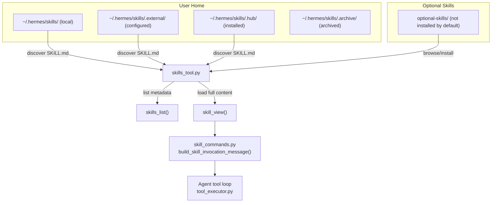
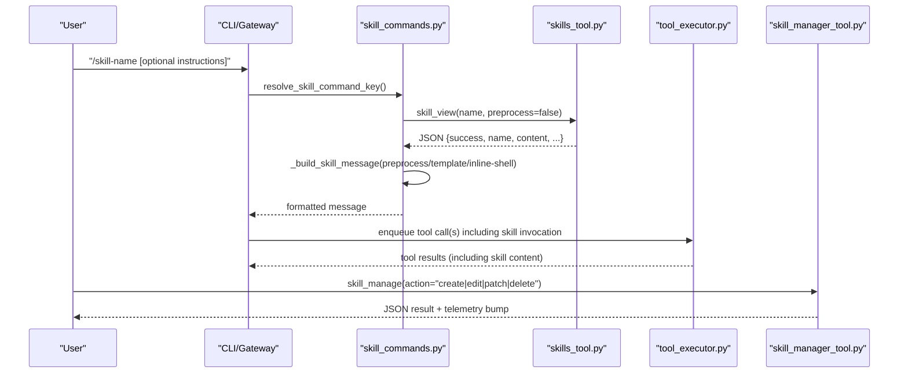
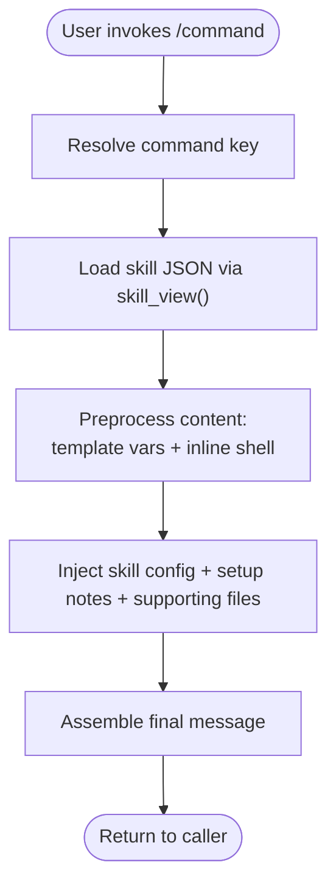
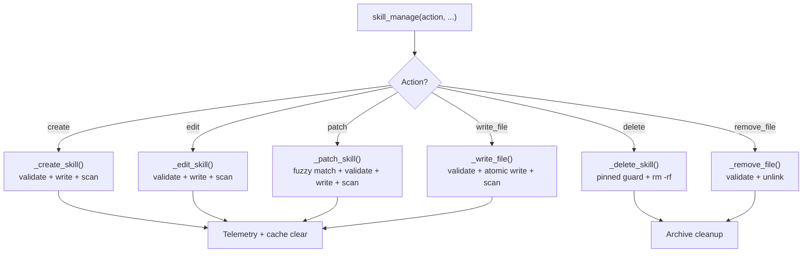
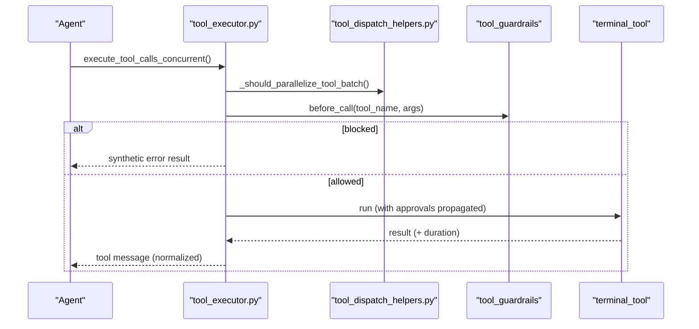
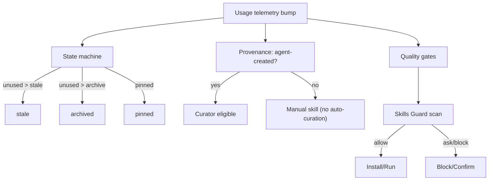
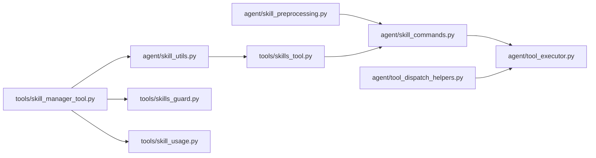

# Skills Architecture

<cite>
**Referenced Files in This Document**
- [agent/skill_commands.py](file://agent/skill_commands.py)
- [agent/skill_preprocessing.py](file://agent/skill_preprocessing.py)
- [agent/skill_utils.py](file://agent/skill_utils.py)
- [tools/skills_tool.py](file://tools/skills_tool.py)
- [tools/skill_manager_tool.py](file://tools/skill_manager_tool.py)
- [tools/skill_usage.py](file://tools/skill_usage.py)
- [tools/skill_provenance.py](file://tools/skill_provenance.py)
- [tools/skills_guard.py](file://tools/skills_guard.py)
- [hermes_cli/skills_config.py](file://hermes_cli/skills_config.py)
- [agent/tool_dispatch_helpers.py](file://agent/tool_dispatch_helpers.py)
- [agent/tool_executor.py](file://agent/tool_executor.py)
- [optional-skills/DESCRIPTION.md](file://optional-skills/DESCRIPTION.md)
</cite>

## Table of Contents
1. [Introduction](#introduction)
2. [Project Structure](#project-structure)
3. [Core Components](#core-components)
4. [Architecture Overview](#architecture-overview)
5. [Detailed Component Analysis](#detailed-component-analysis)
6. [Dependency Analysis](#dependency-analysis)
7. [Performance Considerations](#performance-considerations)
8. [Troubleshooting Guide](#troubleshooting-guide)
9. [Conclusion](#conclusion)
10. [Appendices](#appendices)

## Introduction
This document explains the Skills Architecture of Hermes Agent: how skills are authored, discovered, validated, and integrated into the agent’s closed learning loop. It covers the skill creation framework, metadata and frontmatter structure, execution and parameter handling, integration with the tool system, lifecycle management, categorization and provenance tracking, quality gates, and practical authoring workflows. It also documents the skills registry, dependency management, and version control considerations.

## Project Structure
Skills are stored under the user’s home skills directory and organized into optional categories. The system supports:
- Local skills under ~/.hermes/skills/
- External directories configured via skills.external_dirs
- Optional skills distributed with the repository but not activated by default
- Progressive disclosure: metadata listing, then full content on demand

**Diagram sources**
- [tools/skills_tool.py:675-741](file://tools/skills_tool.py#L675-L741)
- [agent/skill_commands.py:406-451](file://agent/skill_commands.py#L406-L451)
- [agent/tool_executor.py:64-472](file://agent/tool_executor.py#L64-L472)

**Section sources**
- [tools/skills_tool.py:1-120](file://tools/skills_tool.py#L1-L120)
- [optional-skills/DESCRIPTION.md:1-25](file://optional-skills/DESCRIPTION.md#L1-L25)

## Core Components
- Skills discovery and listing: tools/skills_tool.py
- Skill invocation and message assembly: agent/skill_commands.py
- Skill preprocessing (templates, inline shell): agent/skill_preprocessing.py
- Skill metadata utilities: agent/skill_utils.py
- Skill authoring and editing: tools/skill_manager_tool.py
- Usage telemetry and lifecycle: tools/skill_usage.py
- Provenance tracking: tools/skill_provenance.py
- Security scanning: tools/skills_guard.py
- Skills configuration and toggles: hermes_cli/skills_config.py
- Parallel tool execution and concurrency: agent/tool_executor.py and agent/tool_dispatch_helpers.py

**Section sources**
- [tools/skills_tool.py:550-741](file://tools/skills_tool.py#L550-L741)
- [agent/skill_commands.py:241-320](file://agent/skill_commands.py#L241-L320)
- [agent/skill_preprocessing.py:23-132](file://agent/skill_preprocessing.py#L23-L132)
- [agent/skill_utils.py:1-120](file://agent/skill_utils.py#L1-L120)
- [tools/skill_manager_tool.py:1-120](file://tools/skill_manager_tool.py#L1-L120)
- [tools/skill_usage.py:1-120](file://tools/skill_usage.py#L1-L120)
- [tools/skill_provenance.py:1-40](file://tools/skill_provenance.py#L1-L40)
- [tools/skills_guard.py:1-80](file://tools/skills_guard.py#L1-L80)
- [hermes_cli/skills_config.py:1-60](file://hermes_cli/skills_config.py#L1-L60)
- [agent/tool_executor.py:64-120](file://agent/tool_executor.py#L64-L120)
- [agent/tool_dispatch_helpers.py:40-120](file://agent/tool_dispatch_helpers.py#L40-L120)

## Architecture Overview
The skills system is layered:
- Registry layer: discovers and lists skills, normalizes metadata, and serves content on demand
- Invocation layer: transforms a skill selection into a structured message injected into the agent’s context
- Execution layer: integrates with the agent’s tool loop, respecting concurrency, guardrails, and checkpoints
- Lifecycle layer: tracks usage, manages archival, and enforces provenance and quality gates

**Diagram sources**
- [agent/skill_commands.py:406-451](file://agent/skill_commands.py#L406-L451)
- [tools/skills_tool.py:743-800](file://tools/skills_tool.py#L743-L800)
- [agent/tool_executor.py:64-120](file://agent/tool_executor.py#L64-L120)
- [tools/skill_manager_tool.py:713-791](file://tools/skill_manager_tool.py#L713-L791)

## Detailed Component Analysis

### Skill Discovery and Listing
- Progressive disclosure: skills_list returns minimal metadata; skill_view loads full content and linked files
- Platform filtering: skills are filtered by frontmatter platforms and disabled lists
- External directories: supports skills.external_dirs for third-party or team-owned skills
- Categories: optional grouping via directory layout and DESCRIPTION.md

Key behaviors:
- Iterates SKILL.md files across local and external directories
- Skips hidden/excluded directories
- Normalizes descriptions and truncates to limits
- Supports category filtering and sorting

**Section sources**
- [tools/skills_tool.py:550-741](file://tools/skills_tool.py#L550-L741)
- [agent/skill_utils.py:478-490](file://agent/skill_utils.py#L478-L490)

### Skill Invocation and Message Assembly
- Command mapping: builds a /command -> skill mapping from SKILL.md frontmatter
- Slash command resolution: supports hyphen/underscore interchange and platform scoping
- Message composition: expands templates, injects inline shell output, resolves skill config, and attaches supporting file hints
- Activation note: signals to the agent that the user intends to follow the skill’s instructions

**Diagram sources**
- [agent/skill_commands.py:406-451](file://agent/skill_commands.py#L406-L451)
- [agent/skill_preprocessing.py:115-132](file://agent/skill_preprocessing.py#L115-L132)

**Section sources**
- [agent/skill_commands.py:241-320](file://agent/skill_commands.py#L241-L320)
- [agent/skill_commands.py:138-238](file://agent/skill_commands.py#L138-L238)
- [agent/skill_preprocessing.py:23-132](file://agent/skill_preprocessing.py#L23-L132)

### Skill Authoring and Editing
- Create/Edit/Patch/Delete operations for user-authored skills
- Validation: frontmatter presence, structure, size limits, path safety
- Atomic writes: ensures partial writes do not corrupt files
- Security scanning: optional gate for agent-created skills
- Telemetry: bumps counters and marks agent-created skills for curator management

**Diagram sources**
- [tools/skill_manager_tool.py:713-791](file://tools/skill_manager_tool.py#L713-L791)
- [tools/skill_manager_tool.py:373-555](file://tools/skill_manager_tool.py#L373-L555)

**Section sources**
- [tools/skill_manager_tool.py:1-120](file://tools/skill_manager_tool.py#L1-L120)
- [tools/skill_manager_tool.py:373-555](file://tools/skill_manager_tool.py#L373-L555)
- [tools/skill_manager_tool.py:713-791](file://tools/skill_manager_tool.py#L713-L791)

### Skill Metadata and Frontmatter
- Required fields: name, description
- Optional fields: version, license, platforms, prerequisites, setup, metadata.hermes.*
- Tags and related skills: metadata.hermes.tags, metadata.hermes.related_skills
- Environment requirements: required_environment_variables and setup.collect_secrets
- Platform filtering: frontmatter platforms mapped to sys.platform prefixes

**Section sources**
- [tools/skills_tool.py:28-67](file://tools/skills_tool.py#L28-L67)
- [agent/skill_utils.py:52-87](file://agent/skill_utils.py#L52-L87)
- [agent/skill_utils.py:287-302](file://agent/skill_utils.py#L287-L302)

### Skill Execution and Tool Integration
- Parallel tool execution: batch scheduling considers destructive commands, path overlap, and tool safety
- Concurrency gating: certain tools (e.g., clarify) are never parallelized
- Guardrails and checkpoints: destructive terminal commands and file mutations are checkpointed
- Tool result shaping: multimodal results are normalized for providers

**Diagram sources**
- [agent/tool_executor.py:64-120](file://agent/tool_executor.py#L64-L120)
- [agent/tool_dispatch_helpers.py:103-147](file://agent/tool_dispatch_helpers.py#L103-L147)

**Section sources**
- [agent/tool_executor.py:64-120](file://agent/tool_executor.py#L64-L120)
- [agent/tool_dispatch_helpers.py:40-120](file://agent/tool_dispatch_helpers.py#L40-L120)

### Lifecycle, Provenance, and Quality Gates
- Usage telemetry: per-skill counters and timestamps tracked in a sidecar
- Lifecycle states: active, stale, archived; pinned flag prevents deletion
- Provenance: distinguishes agent-created skills from user-directed writes
- Quality gates: security scanner for external skills; trust levels and policies
- Optional skills: curated subset not installed by default; browse/install via hub

**Diagram sources**
- [tools/skill_usage.py:441-459](file://tools/skill_usage.py#L441-L459)
- [tools/skill_provenance.py:48-79](file://tools/skill_provenance.py#L48-L79)
- [tools/skills_guard.py:646-681](file://tools/skills_guard.py#L646-L681)

**Section sources**
- [tools/skill_usage.py:1-120](file://tools/skill_usage.py#L1-L120)
- [tools/skill_provenance.py:1-40](file://tools/skill_provenance.py#L1-L40)
- [tools/skills_guard.py:1-80](file://tools/skills_guard.py#L1-L80)

### Skills Configuration and Distribution
- Global and per-platform toggles: skills.disabled and skills.platform_disabled
- Interactive configuration UI: hermes skills toggles by individual skill or category
- Optional skills: curated official skills not installed by default; browse and install via hub

**Section sources**
- [hermes_cli/skills_config.py:1-60](file://hermes_cli/skills_config.py#L1-L60)
- [hermes_cli/skills_config.py:125-178](file://hermes_cli/skills_config.py#L125-L178)
- [optional-skills/DESCRIPTION.md:1-25](file://optional-skills/DESCRIPTION.md#L1-L25)

## Dependency Analysis
The skills system is modular and layered:
- tools/skills_tool.py depends on agent/skill_utils.py for frontmatter parsing and platform matching
- agent/skill_commands.py depends on tools/skills_tool.py for content loading and on agent/skill_preprocessing.py for preprocessing
- tools/skill_manager_tool.py depends on tools/skills_guard.py for security scanning and tools/skill_usage.py for telemetry
- agent/tool_executor.py coordinates tool execution and interacts with tool-dispatch helpers

**Diagram sources**
- [agent/skill_utils.py:1-60](file://agent/skill_utils.py#L1-L60)
- [tools/skills_tool.py:1-120](file://tools/skills_tool.py#L1-L120)
- [agent/skill_commands.py:15-25](file://agent/skill_commands.py#L15-L25)
- [agent/skill_preprocessing.py:1-25](file://agent/skill_preprocessing.py#L1-L25)
- [tools/skill_manager_tool.py:50-70](file://tools/skill_manager_tool.py#L50-L70)
- [tools/skills_guard.py:1-40](file://tools/skills_guard.py#L1-L40)
- [tools/skill_usage.py:1-40](file://tools/skill_usage.py#L1-L40)
- [agent/tool_executor.py:64-120](file://agent/tool_executor.py#L64-L120)
- [agent/tool_dispatch_helpers.py:103-147](file://agent/tool_dispatch_helpers.py#L103-L147)

**Section sources**
- [agent/skill_utils.py:1-60](file://agent/skill_utils.py#L1-L60)
- [tools/skills_tool.py:1-120](file://tools/skills_tool.py#L1-L120)
- [agent/skill_commands.py:15-25](file://agent/skill_commands.py#L15-L25)
- [agent/skill_preprocessing.py:1-25](file://agent/skill_preprocessing.py#L1-L25)
- [tools/skill_manager_tool.py:50-70](file://tools/skill_manager_tool.py#L50-L70)
- [tools/skills_guard.py:1-40](file://tools/skills_guard.py#L1-L40)
- [tools/skill_usage.py:1-40](file://tools/skill_usage.py#L1-L40)
- [agent/tool_executor.py:64-120](file://agent/tool_executor.py#L64-L120)
- [agent/tool_dispatch_helpers.py:103-147](file://agent/tool_dispatch_helpers.py#L103-L147)

## Performance Considerations
- Progressive disclosure: skills_list returns minimal metadata to reduce token usage; skill_view loads full content on demand
- External directories caching: config.yaml mtime-based cache reduces repeated YAML parsing overhead
- Atomic writes: minimize partial file corruption and retries
- Concurrency: parallel tool execution is gated by destructive command heuristics and path overlap checks to avoid contention
- Inline shell limits: bounded output and timeouts prevent runaway commands from bloating context

[No sources needed since this section provides general guidance]

## Troubleshooting Guide
Common issues and resolutions:
- Skill not found: verify command normalization and platform filtering; confirm SKILL.md exists and is readable
- Setup prerequisites missing: review setup.help and required_environment_variables; use secret capture callback or .env
- Security scan blocked: review scan report; remove flagged content or use --force if permitted
- Concurrency conflicts: destructive terminal commands or overlapping file paths may force sequential execution
- Disabled skills: check skills.disabled and skills.platform_disabled for the active platform

**Section sources**
- [tools/skills_tool.py:296-366](file://tools/skills_tool.py#L296-L366)
- [tools/skills_guard.py:646-681](file://tools/skills_guard.py#L646-L681)
- [agent/tool_dispatch_helpers.py:103-147](file://agent/tool_dispatch_helpers.py#L103-L147)
- [hermes_cli/skills_config.py:27-48](file://hermes_cli/skills_config.py#L27-L48)

## Conclusion
Hermes Agent’s skills system balances flexibility and safety. It enables rapid authoring and iteration, robust discovery and distribution, and secure ingestion of external skills. The closed-loop integration with the agent’s tool system, combined with lifecycle tracking and quality gates, supports continuous improvement while preserving user control and system stability.

## Appendices

### Practical Authoring Workflow
- Ideation: define name, description, platforms, and metadata.hermes.config as needed
- Draft: write SKILL.md with frontmatter; add references/templates/scripts/assets as needed
- Test: use skill_view to inspect content; run inline shell snippets safely
- Validate: ensure frontmatter completeness and platform compatibility
- Publish: commit to a repository or publish via Skills Hub; optional installation via hermes skills install
- Iterate: use skill_manage to edit/patch; monitor usage via telemetry and curator reports

**Section sources**
- [tools/skill_manager_tool.py:373-428](file://tools/skill_manager_tool.py#L373-L428)
- [tools/skill_usage.py:405-420](file://tools/skill_usage.py#L405-L420)
- [tools/skills_tool.py:28-67](file://tools/skills_tool.py#L28-L67)