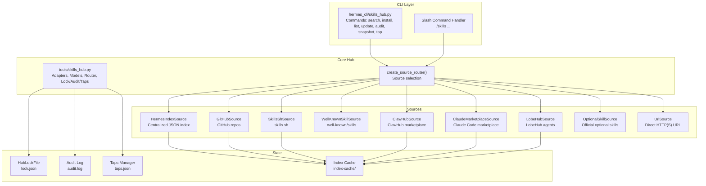
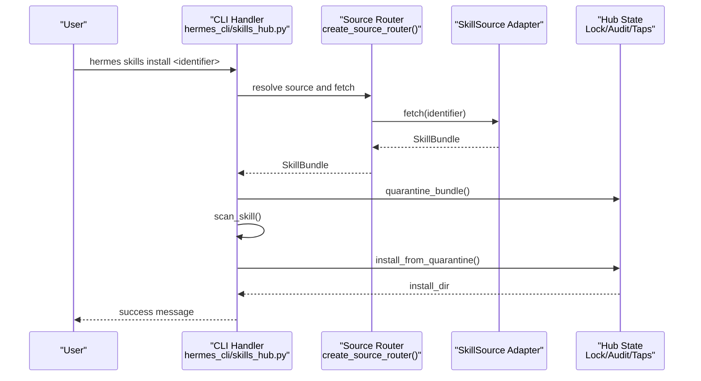
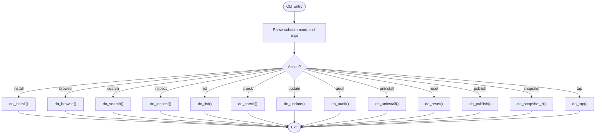
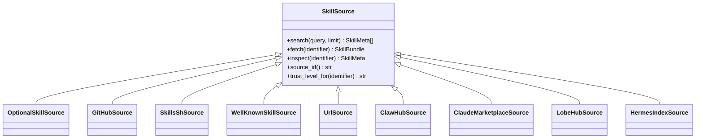
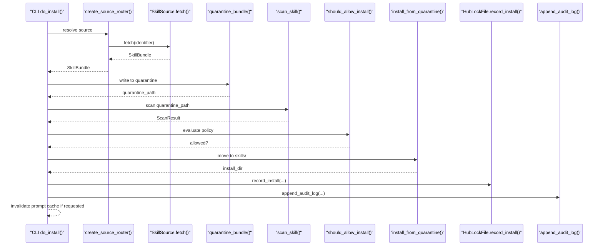
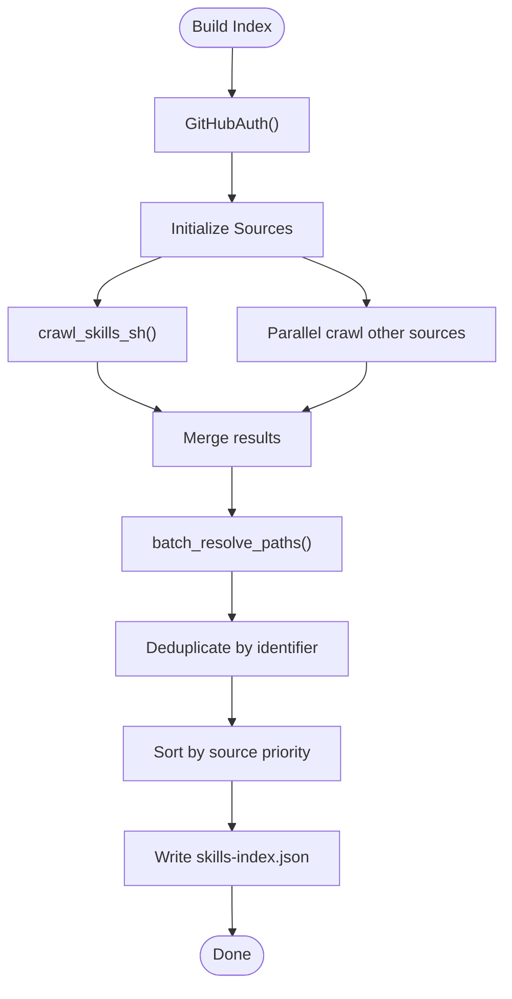
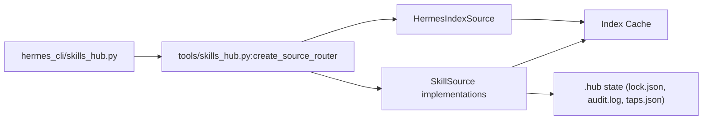

# Skills Hub

<cite>
**Referenced Files in This Document**
- [skills_hub.py](file://hermes_cli/skills_hub.py)
- [skills_hub.py](file://tools/skills_hub.py)
- [build_skills_index.py](file://scripts/build_skills_index.py)
- [claude_marketplace_anthropics_skills.json](file://skills/index-cache/claude_marketplace_anthropics_skills.json)
</cite>

## Table of Contents
1. [Introduction](#introduction)
2. [Project Structure](#project-structure)
3. [Core Components](#core-components)
4. [Architecture Overview](#architecture-overview)
5. [Detailed Component Analysis](#detailed-component-analysis)
6. [Dependency Analysis](#dependency-analysis)
7. [Performance Considerations](#performance-considerations)
8. [Troubleshooting Guide](#troubleshooting-guide)
9. [Conclusion](#conclusion)
10. [Appendices](#appendices)

## Introduction
The Skills Hub is a comprehensive system for discovering, installing, and managing community-contributed skills within the Hermes ecosystem. It provides:
- A unified CLI and slash-command interface for end users
- A distributed catalog of skills across multiple sources (GitHub, skills.sh, ClawHub, Claude Marketplace, LobeHub, and more)
- A robust installation pipeline with quarantine, scanning, and audit logging
- A centralized index to reduce API overhead and improve responsiveness
- Tools for updating, auditing, and snapshotting installed skills
- Integration with external repositories and authentication mechanisms

## Project Structure
The Skills Hub spans two primary modules:
- hermes_cli/skills_hub.py: CLI and slash-command entry points, user-facing workflows, and orchestration
- tools/skills_hub.py: Core adapters, data models, hub state management, and low-level operations

Key supporting artifacts:
- scripts/build_skills_index.py: Builds the centralized skills index used by the HermesIndexSource
- skills/index-cache: Local caches for marketplace and other indices

**Diagram sources**
- [skills_hub.py:1316-1595](file://hermes_cli/skills_hub.py#L1316-L1595)
- [skills_hub.py:3125-3148](file://tools/skills_hub.py#L3125-L3148)
- [skills_hub.py:2526-2561](file://tools/skills_hub.py#L2526-L2561)
- [skills_hub.py:2582-2642](file://tools/skills_hub.py#L2582-L2642)
- [skills_hub.py:2648-2687](file://tools/skills_hub.py#L2648-L2687)

**Section sources**
- [skills_hub.py:1-1595](file://hermes_cli/skills_hub.py#L1-L1595)
- [skills_hub.py:1-3263](file://tools/skills_hub.py#L1-L3263)

## Core Components
- SkillMeta and SkillBundle: Lightweight data models representing search results and downloadable skill packages
- SkillSource ABC: Abstract interface for all skill registries
- Source adapters:
  - OptionalSkillSource (official optional skills)
  - GitHubSource (GitHub repos)
  - SkillsShSource (skills.sh)
  - WellKnownSkillSource (well-known endpoint)
  - UrlSource (direct URL)
  - ClawHubSource (marketplace)
  - ClaudeMarketplaceSource (marketplace)
  - LobeHubSource (agents converted to skills)
  - HermesIndexSource (centralized index)
- HubLockFile: Tracks installed skills and metadata
- TapsManager: Manages custom GitHub taps
- Index cache: TTL-based caching for remote catalogs

**Section sources**
- [skills_hub.py:68-124](file://tools/skills_hub.py#L68-L124)
- [skills_hub.py:294-321](file://tools/skills_hub.py#L294-L321)
- [skills_hub.py:326-745](file://tools/skills_hub.py#L326-L745)
- [skills_hub.py:1144-1599](file://tools/skills_hub.py#L1144-L1599)
- [skills_hub.py:1616-2094](file://tools/skills_hub.py#L1616-L2094)
- [skills_hub.py:2099-2192](file://tools/skills_hub.py#L2099-L2192)
- [skills_hub.py:2198-2351](file://tools/skills_hub.py#L2198-L2351)
- [skills_hub.py:2357-2524](file://tools/skills_hub.py#L2357-L2524)
- [skills_hub.py:2969-3123](file://tools/skills_hub.py#L2969-L3123)
- [skills_hub.py:2582-2642](file://tools/skills_hub.py#L2582-L2642)
- [skills_hub.py:2648-2687](file://tools/skills_hub.py#L2648-L2687)
- [skills_hub.py:2526-2561](file://tools/skills_hub.py#L2526-L2561)

## Architecture Overview
The Skills Hub employs a layered architecture:
- Presentation layer: CLI and slash command handlers
- Orchestration layer: Unified do_* functions and source router
- Adapter layer: Pluggable SkillSource implementations
- Persistence layer: Hub state, audit logs, and index cache
- External integration: GitHub API, skills.sh, marketplaces, and centralized index

**Diagram sources**
- [skills_hub.py:408-625](file://hermes_cli/skills_hub.py#L408-L625)
- [skills_hub.py:2726-2814](file://tools/skills_hub.py#L2726-L2814)
- [skills_hub.py:3125-3148](file://tools/skills_hub.py#L3125-L3148)

## Detailed Component Analysis

### CLI and Slash Command Interface
The CLI module exposes commands for browsing, searching, installing, inspecting, listing, checking updates, auditing, uninstalling, resetting, publishing, snapshotting, and managing taps. It supports both interactive TTY and non-interactive slash-command modes.

**Diagram sources**
- [skills_hub.py:1316-1370](file://hermes_cli/skills_hub.py#L1316-L1370)
- [skills_hub.py:1376-1595](file://hermes_cli/skills_hub.py#L1376-L1595)

**Section sources**
- [skills_hub.py:1316-1595](file://hermes_cli/skills_hub.py#L1316-L1595)

### Source Adapters and Discovery
The hub aggregates skills from multiple sources. Each adapter implements a common interface and contributes metadata and bundles.

**Diagram sources**
- [skills_hub.py:294-321](file://tools/skills_hub.py#L294-L321)
- [skills_hub.py:326-745](file://tools/skills_hub.py#L326-L745)
- [skills_hub.py:1144-1599](file://tools/skills_hub.py#L1144-L1599)
- [skills_hub.py:1616-2094](file://tools/skills_hub.py#L1616-L2094)
- [skills_hub.py:2099-2192](file://tools/skills_hub.py#L2099-L2192)
- [skills_hub.py:2198-2351](file://tools/skills_hub.py#L2198-L2351)
- [skills_hub.py:2357-2524](file://tools/skills_hub.py#L2357-L2524)
- [skills_hub.py:2969-3123](file://tools/skills_hub.py#L2969-L3123)

**Section sources**
- [skills_hub.py:294-321](file://tools/skills_hub.py#L294-L321)
- [skills_hub.py:326-745](file://tools/skills_hub.py#L326-L745)
- [skills_hub.py:1144-1599](file://tools/skills_hub.py#L1144-L1599)
- [skills_hub.py:1616-2094](file://tools/skills_hub.py#L1616-L2094)
- [skills_hub.py:2099-2192](file://tools/skills_hub.py#L2099-L2192)
- [skills_hub.py:2198-2351](file://tools/skills_hub.py#L2198-L2351)
- [skills_hub.py:2357-2524](file://tools/skills_hub.py#L2357-L2524)
- [skills_hub.py:2969-3123](file://tools/skills_hub.py#L2969-L3123)

### Installation Pipeline: Quarantine, Scan, Install
The installation flow ensures safety and traceability:
- Resolve source and fetch bundle
- Quarantine bundle for scanning
- Security scan and policy evaluation
- Optional user confirmation
- Install to skills directory
- Record in lock file and audit log

**Diagram sources**
- [skills_hub.py:408-625](file://hermes_cli/skills_hub.py#L408-L625)
- [skills_hub.py:2726-2814](file://tools/skills_hub.py#L2726-L2814)
- [skills_hub.py:2582-2642](file://tools/skills_hub.py#L2582-L2642)
- [skills_hub.py:2693-2707](file://tools/skills_hub.py#L2693-L2707)

**Section sources**
- [skills_hub.py:408-625](file://hermes_cli/skills_hub.py#L408-L625)
- [skills_hub.py:2726-2814](file://tools/skills_hub.py#L2726-L2814)
- [skills_hub.py:2582-2642](file://tools/skills_hub.py#L2582-L2642)
- [skills_hub.py:2693-2707](file://tools/skills_hub.py#L2693-L2707)

### Centralized Index and Catalog Management
The centralized index improves performance and reliability by caching metadata and resolved paths. The build script crawls multiple sources, resolves GitHub paths for skills.sh entries, deduplicates, sorts, and writes a compact JSON catalog.

**Diagram sources**
- [build_skills_index.py:245-325](file://scripts/build_skills_index.py#L245-L325)
- [build_skills_index.py:140-242](file://scripts/build_skills_index.py#L140-L242)

**Section sources**
- [build_skills_index.py:1-326](file://scripts/build_skills_index.py#L1-L326)
- [skills_hub.py:2918-2967](file://tools/skills_hub.py#L2918-L2967)
- [skills_hub.py:2969-3123](file://tools/skills_hub.py#L2969-L3123)

### Distribution Mechanisms and External Repositories
- GitHubSource: Uses Contents API and Git Trees API to minimize rate limits and improve performance
- SkillsShSource: Integrates with skills.sh search and detail pages, extracting metadata and install commands
- WellKnownSkillSource: Reads standardized index.json from well-known endpoints
- ClawHubSource: Downloads ZIP bundles and extracts text files
- ClaudeMarketplaceSource: Reads marketplace manifests from known repositories
- LobeHubSource: Converts agent JSON to SKILL.md format
- UrlSource: Direct HTTP(S) URL fetching for single-file skills
- OptionalSkillSource: Bundled official skills shipped with the repository

**Section sources**
- [skills_hub.py:326-745](file://tools/skills_hub.py#L326-L745)
- [skills_hub.py:1144-1599](file://tools/skills_hub.py#L1144-L1599)
- [skills_hub.py:800-876](file://tools/skills_hub.py#L800-L876)
- [skills_hub.py:1616-2094](file://tools/skills_hub.py#L1616-L2094)
- [skills_hub.py:2099-2192](file://tools/skills_hub.py#L2099-L2192)
- [skills_hub.py:2198-2351](file://tools/skills_hub.py#L2198-L2351)
- [skills_hub.py:978-1138](file://tools/skills_hub.py#L978-L1138)
- [skills_hub.py:2357-2524](file://tools/skills_hub.py#L2357-L2524)

### Skill Search and Filtering
- Unified search across all sources with parallel execution
- Source filtering and pagination support
- Trust-level ranking and deduplication
- Short-name resolution and interactive prompts for ambiguous names

**Section sources**
- [skills_hub.py:242-406](file://hermes_cli/skills_hub.py#L242-L406)
- [skills_hub.py:3162-3199](file://hermes_cli/skills_hub.py#L3162-L3199)
- [skills_hub.py:3151-3160](file://tools/skills_hub.py#L3151-L3160)

### Rating and Review Systems
- skills.sh: Weekly installs, detail page links, and security audit badges
- Upstream metadata: Repo URL, detail URL, endpoint, install command, installs, weekly installs, security audits
- Trust levels: builtin, trusted, community

**Section sources**
- [skills_hub.py:1144-1599](file://tools/skills_hub.py#L1144-L1599)
- [skills_hub.py:800-876](file://tools/skills_hub.py#L800-L876)

### Quality Assurance and Security
- Quarantine and scanning before installation
- Policy evaluation and user confirmation
- Audit logging for all actions
- Content hashing for change detection
- Safe path normalization and validation

**Section sources**
- [skills_hub.py:534-561](file://hermes_cli/skills_hub.py#L534-L561)
- [skills_hub.py:2726-2814](file://tools/skills_hub.py#L2726-L2814)
- [skills_hub.py:2693-2707](file://tools/skills_hub.py#L2693-L2707)
- [skills_hub.py:2833-2843](file://tools/skills_hub.py#L2833-L2843)

### Update Mechanisms and Version Management
- Update checks compare current content hash with latest bundle hash
- Automatic updates supported via force reinstall
- Backward compatibility handled by preserving user modifications and allowing resets

**Section sources**
- [skills_hub.py:860-901](file://hermes_cli/skills_hub.py#L860-L901)
- [skills_hub.py:2853-2907](file://tools/skills_hub.py#L2853-L2907)

### Practical Examples
- Discovering skills: hermes skills browse --source official
- Installing from the hub: hermes skills install openai/skills/skill-creator
- Managing local collections: hermes skills list --source hub
- Snapshot import/export: hermes skills snapshot export snapshot.json

**Section sources**
- [skills_hub.py:1316-1595](file://hermes_cli/skills_hub.py#L1316-L1595)

### Integration with External Repositories and Access Control
- GitHub authentication via PAT, gh CLI, or GitHub App
- Rate-limit awareness and mitigation
- Website policy enforcement and SSRF protection
- Safe URL validation and redirect handling

**Section sources**
- [skills_hub.py:171-288](file://tools/skills_hub.py#L171-L288)
- [skills_hub.py:126-161](file://tools/skills_hub.py#L126-L161)

## Dependency Analysis
The hub’s dependencies are intentionally decoupled:
- CLI depends on shared do_* functions and source router
- Source adapters depend on HTTP clients and YAML parsers
- Hub state depends on filesystem and JSON persistence
- Centralized index depends on HTTP client and local cache

**Diagram sources**
- [skills_hub.py:1316-1595](file://hermes_cli/skills_hub.py#L1316-L1595)
- [skills_hub.py:3125-3148](file://tools/skills_hub.py#L3125-L3148)
- [skills_hub.py:2526-2561](file://tools/skills_hub.py#L2526-L2561)
- [skills_hub.py:2582-2642](file://tools/skills_hub.py#L2582-L2642)

**Section sources**
- [skills_hub.py:1316-1595](file://hermes_cli/skills_hub.py#L1316-L1595)
- [skills_hub.py:3125-3148](file://tools/skills_hub.py#L3125-L3148)
- [skills_hub.py:2526-2561](file://tools/skills_hub.py#L2526-L2561)
- [skills_hub.py:2582-2642](file://tools/skills_hub.py#L2582-L2642)

## Performance Considerations
- Centralized index dramatically reduces API calls for search and discovery
- Parallel source search with per-source timeouts
- Repo tree caching to avoid repeated GitHub API calls
- Index cache TTL to balance freshness and performance
- ZIP extraction with size limits and text-only filtering for marketplace sources

[No sources needed since this section provides general guidance]

## Troubleshooting Guide
Common issues and resolutions:
- GitHub API rate limit: Set GITHUB_TOKEN or use gh auth login to increase quota
- Invalid skill name: Provide --name or fix SKILL.md frontmatter
- Missing SKILL.md: Ensure the skill bundle contains a valid SKILL.md
- Permission errors: Verify filesystem permissions for ~/.hermes/skills/
- Network failures: Retry after checking connectivity; centralized index serves as fallback

**Section sources**
- [skills_hub.py:444-462](file://hermes_cli/skills_hub.py#L444-L462)
- [skills_hub.py:468-494](file://hermes_cli/skills_hub.py#L468-L494)
- [skills_hub.py:2726-2814](file://tools/skills_hub.py#L2726-L2814)

## Conclusion
The Skills Hub provides a robust, extensible framework for managing community skills with strong emphasis on safety, performance, and user control. Its modular design enables easy addition of new sources, while the centralized index and caching strategies ensure responsive discovery and installation experiences.

## Appendices

### Example: Marketplace Index Cache
The marketplace index cache demonstrates local caching of curated lists for performance.

**Section sources**
- [claude_marketplace_anthropics_skills.json:1-1](file://skills/index-cache/claude_marketplace_anthropics_skills.json#L1-L1)