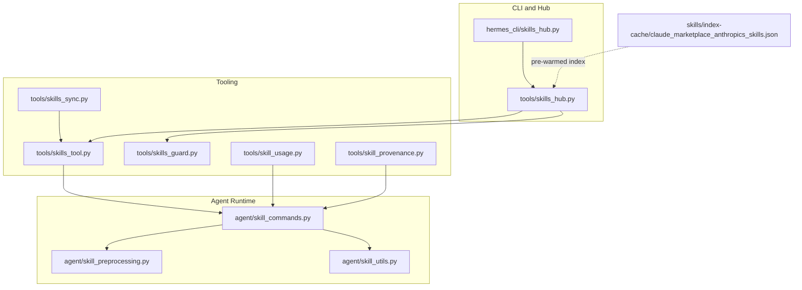
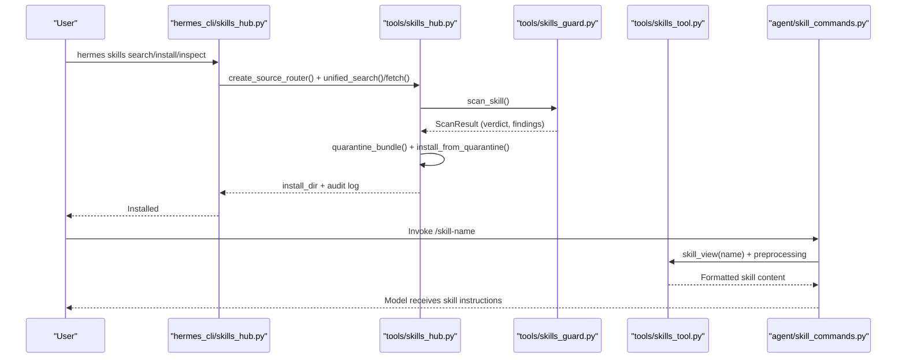
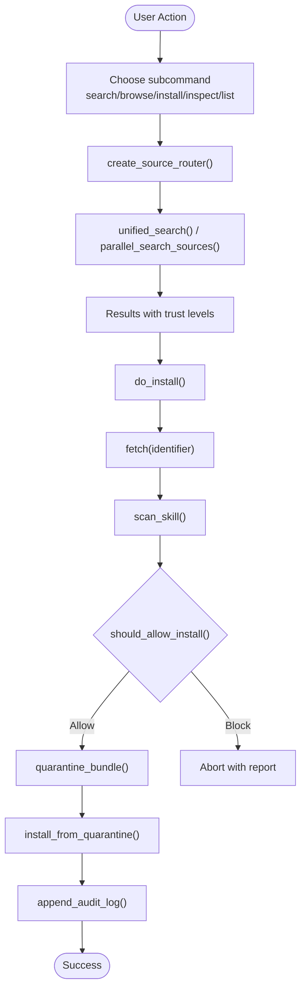
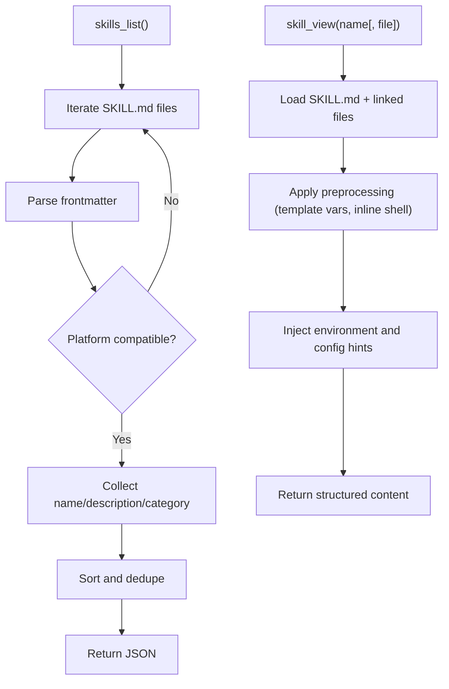
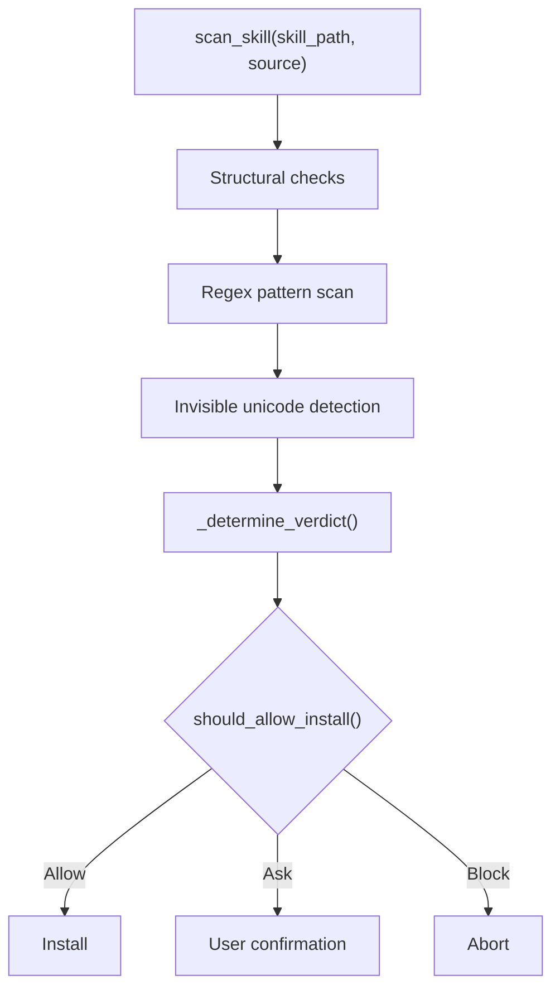
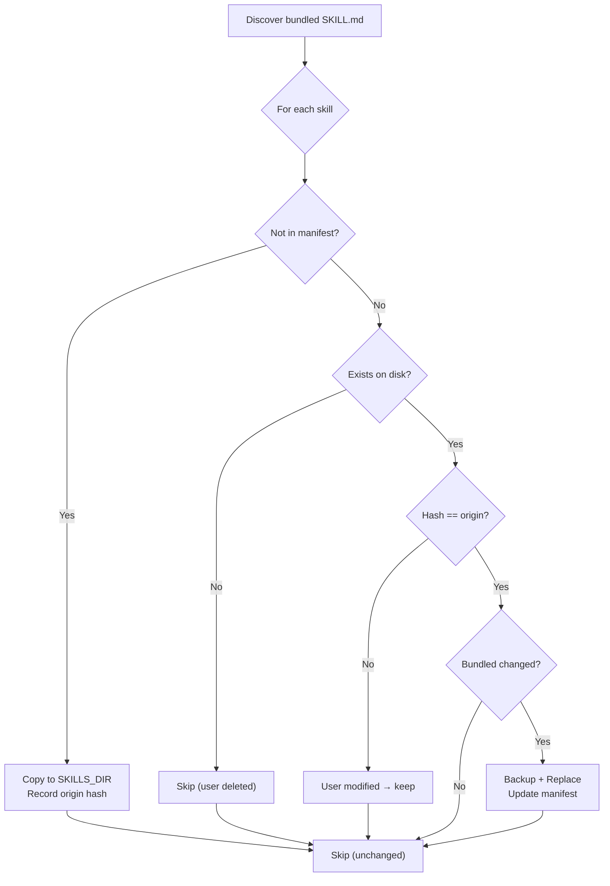
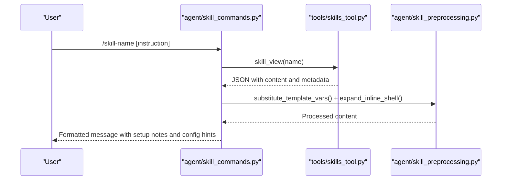
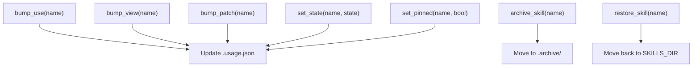
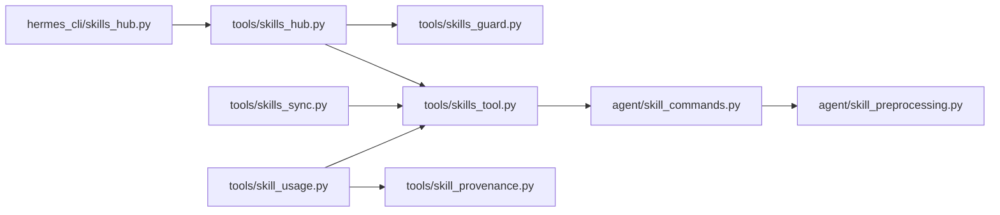

# Skills System

<cite>
**Referenced Files in This Document**
- [skills_hub.py](file://hermes_cli/skills_hub.py)
- [skills_hub.py](file://tools/skills_hub.py)
- [skills_tool.py](file://tools/skills_tool.py)
- [skills_guard.py](file://tools/skills_guard.py)
- [skills_sync.py](file://tools/skills_sync.py)
- [skill_commands.py](file://agent/skill_commands.py)
- [skill_preprocessing.py](file://agent/skill_preprocessing.py)
- [skill_utils.py](file://agent/skill_utils.py)
- [skill_usage.py](file://tools/skill_usage.py)
- [skill_provenance.py](file://tools/skill_provenance.py)
- [claude_marketplace_anthropics_skills.json](file://skills/index-cache/claude_marketplace_anthropics_skills.json)
</cite>

## Table of Contents
1. [Introduction](#introduction)
2. [Project Structure](#project-structure)
3. [Core Components](#core-components)
4. [Architecture Overview](#architecture-overview)
5. [Detailed Component Analysis](#detailed-component-analysis)
6. [Dependency Analysis](#dependency-analysis)
7. [Performance Considerations](#performance-considerations)
8. [Troubleshooting Guide](#troubleshooting-guide)
9. [Conclusion](#conclusion)
10. [Appendices](#appendices)

## Introduction
This document describes the Skills System that powers procedural memory and skill creation in Hermes Agent. It covers how skills are authored, discovered, installed, executed, and curated. It explains the Skills Hub ecosystem for distributing community-contributed skills, the agent’s skill execution pipeline, and the closed-loop curation that maintains only the most useful skills over time. Practical guidance is provided for creating custom skills, using pre-built skills, and understanding skill provenance and quality signals.

## Project Structure
The Skills System spans several modules:
- CLI and Hub orchestration: hermes_cli/skills_hub.py and tools/skills_hub.py
- Skill discovery and tooling: tools/skills_tool.py
- Safety and trust: tools/skills_guard.py
- Bundled skill seeding and updates: tools/skills_sync.py
- Agent-side skill invocation and preprocessing: agent/skill_commands.py, agent/skill_preprocessing.py, agent/skill_utils.py
- Lifecycle and provenance: tools/skill_usage.py, tools/skill_provenance.py
- Example index cache: skills/index-cache/claude_marketplace_anthropics_skills.json

**Diagram sources**
- [skills_hub.py:1-800](file://hermes_cli/skills_hub.py#L1-L800)
- [skills_hub.py:1-800](file://tools/skills_hub.py#L1-L800)
- [skills_tool.py:1-800](file://tools/skills_tool.py#L1-L800)
- [skills_guard.py:1-800](file://tools/skills_guard.py#L1-L800)
- [skills_sync.py:1-432](file://tools/skills_sync.py#L1-L432)
- [skill_commands.py:1-502](file://agent/skill_commands.py#L1-L502)
- [skill_preprocessing.py:1-132](file://agent/skill_preprocessing.py#L1-L132)
- [skill_utils.py:1-512](file://agent/skill_utils.py#L1-L512)
- [skill_usage.py:1-610](file://tools/skill_usage.py#L1-L610)
- [skill_provenance.py:1-79](file://tools/skill_provenance.py#L1-L79)
- [claude_marketplace_anthropics_skills.json:1-1](file://skills/index-cache/claude_marketplace_anthropics_skills.json#L1-L1)

**Section sources**
- [skills_hub.py:1-800](file://hermes_cli/skills_hub.py#L1-L800)
- [skills_hub.py:1-800](file://tools/skills_hub.py#L1-L800)
- [skills_tool.py:1-800](file://tools/skills_tool.py#L1-L800)
- [skills_guard.py:1-800](file://tools/skills_guard.py#L1-L800)
- [skills_sync.py:1-432](file://tools/skills_sync.py#L1-L432)
- [skill_commands.py:1-502](file://agent/skill_commands.py#L1-L502)
- [skill_preprocessing.py:1-132](file://agent/skill_preprocessing.py#L1-L132)
- [skill_utils.py:1-512](file://agent/skill_utils.py#L1-L512)
- [skill_usage.py:1-610](file://tools/skill_usage.py#L1-L610)
- [skill_provenance.py:1-79](file://tools/skill_provenance.py#L1-L79)
- [claude_marketplace_anthropics_skills.json:1-1](file://skills/index-cache/claude_marketplace_anthropics_skills.json#L1-L1)

## Core Components
- Skills Hub CLI and Library: Discovery, installation, and management of skills from multiple sources (GitHub, official, community).
- Skills Tool: Lists and views skills with progressive disclosure (metadata, then full content).
- Safety Scanner: Static analysis and trust-aware install policy for externally sourced skills.
- Bundled Skills Sync: Seeds and updates bundled skills while respecting user modifications.
- Agent Skill Invocation: Loads and formats skill content for the model, supports preprocessing and configuration.
- Lifecycle and Provenance: Tracks usage, manages state, and distinguishes agent-created vs. bundled/hub skills.

**Section sources**
- [skills_hub.py:1-800](file://hermes_cli/skills_hub.py#L1-L800)
- [skills_tool.py:1-800](file://tools/skills_tool.py#L1-L800)
- [skills_guard.py:1-800](file://tools/skills_guard.py#L1-L800)
- [skills_sync.py:1-432](file://tools/skills_sync.py#L1-L432)
- [skill_commands.py:1-502](file://agent/skill_commands.py#L1-L502)
- [skill_preprocessing.py:1-132](file://agent/skill_preprocessing.py#L1-L132)
- [skill_usage.py:1-610](file://tools/skill_usage.py#L1-L610)
- [skill_provenance.py:1-79](file://tools/skill_provenance.py#L1-L79)

## Architecture Overview
The Skills System integrates three layers:
- Distribution Layer: Skills Hub discovers and installs skills from multiple sources, quarantines and scans them, and installs into the user’s skills directory.
- Tooling Layer: Tools enumerate skills, expose metadata, and serve full content on demand.
- Agent Layer: The agent builds messages from skills, applies preprocessing, and injects configuration and environment context.

**Diagram sources**
- [skills_hub.py:242-625](file://hermes_cli/skills_hub.py#L242-L625)
- [skills_hub.py:1-800](file://tools/skills_hub.py#L1-L800)
- [skills_guard.py:599-717](file://tools/skills_guard.py#L599-L717)
- [skills_tool.py:675-741](file://tools/skills_tool.py#L675-L741)
- [skill_commands.py:406-451](file://agent/skill_commands.py#L406-L451)

## Detailed Component Analysis

### Skills Hub CLI and Library
- CLI entry points: search, browse, install, inspect, list, with rich output and pagination.
- Hub library: source adapters (GitHub, well-known endpoint), trust levels, quarantine, audit logging, and hub state management.
- Name resolution: resolves short names to identifiers, validates category and skill names, and supports interactive prompts for missing metadata.
- Security: integrates with the safety scanner and install policy.

**Diagram sources**
- [skills_hub.py:242-625](file://hermes_cli/skills_hub.py#L242-L625)
- [skills_hub.py:1-800](file://tools/skills_hub.py#L1-L800)
- [skills_guard.py:646-681](file://tools/skills_guard.py#L646-L681)

**Section sources**
- [skills_hub.py:1-800](file://hermes_cli/skills_hub.py#L1-L800)
- [skills_hub.py:1-800](file://tools/skills_hub.py#L1-L800)

### Skills Tool: Discovery and Progressive Disclosure
- Progressive disclosure: skills_list returns metadata; skill_view loads full content and linked files.
- Categories: supports top-level and nested category layouts; reads category descriptions.
- Platform gating: filters skills incompatible with the current OS.
- Environment and setup: collects required environment variables and provides setup hints.

**Diagram sources**
- [skills_tool.py:675-741](file://tools/skills_tool.py#L675-L741)
- [skills_tool.py:550-624](file://tools/skills_tool.py#L550-L624)
- [skill_preprocessing.py:115-132](file://agent/skill_preprocessing.py#L115-L132)

**Section sources**
- [skills_tool.py:1-800](file://tools/skills_tool.py#L1-L800)
- [skill_preprocessing.py:1-132](file://agent/skill_preprocessing.py#L1-L132)

### Safety Scanner and Trust Policy
- Static analysis: detects patterns for exfiltration, prompt injection, destructive operations, persistence, networking, obfuscation, execution, traversal, mining, supply chain, privilege escalation, and credential exposure.
- Trust levels: builtin (always allowed), trusted (openai/skills, anthropics/skills), community (subject to policy).
- Install policy: allows safe, requires confirmation for caution on agent-created, blocks dangerous across trust tiers.

**Diagram sources**
- [skills_guard.py:599-717](file://tools/skills_guard.py#L599-L717)

**Section sources**
- [skills_guard.py:1-800](file://tools/skills_guard.py#L1-L800)

### Bundled Skills Sync
- Seeding: copies bundled skills from the repository into the user’s skills directory.
- Manifest: tracks origin hashes to decide whether to copy, update, or skip user-modified skills.
- Resets: clears manifest entries and optionally deletes user copies to re-sync from bundled.

**Diagram sources**
- [skills_sync.py:177-318](file://tools/skills_sync.py#L177-L318)

**Section sources**
- [skills_sync.py:1-432](file://tools/skills_sync.py#L1-L432)

### Agent Skill Invocation and Preprocessing
- Slash commands: scans for skills, normalizes names, and builds invocation messages.
- Preprocessing: template variable substitution (${HERMES_SKILL_DIR}, ${HERMES_SESSION_ID}), inline shell expansion (!`cmd`), and optional template vars and inline shell toggles.
- Config injection: reads skill-declared config variables and injects current values into the message.

**Diagram sources**
- [skill_commands.py:406-451](file://agent/skill_commands.py#L406-L451)
- [skill_commands.py:138-238](file://agent/skill_commands.py#L138-L238)
- [skill_preprocessing.py:115-132](file://agent/skill_preprocessing.py#L115-L132)

**Section sources**
- [skill_commands.py:1-502](file://agent/skill_commands.py#L1-L502)
- [skill_preprocessing.py:1-132](file://agent/skill_preprocessing.py#L1-L132)
- [skill_utils.py:1-512](file://agent/skill_utils.py#L1-L512)

### Lifecycle Management and Provenance
- Usage telemetry: tracks counts and timestamps for use/view/patch; maintains state (active/stale/archived/pinned).
- Provenance: distinguishes agent-created skills from bundled/hub-installed; archives and restores only agent-created skills.
- Curator integration: provides reports and state transitions for curated skills.

**Diagram sources**
- [skill_usage.py:405-473](file://tools/skill_usage.py#L405-L473)
- [skill_usage.py:479-564](file://tools/skill_usage.py#L479-L564)

**Section sources**
- [skill_usage.py:1-610](file://tools/skill_usage.py#L1-L610)
- [skill_provenance.py:1-79](file://tools/skill_provenance.py#L1-L79)

## Dependency Analysis
Key relationships:
- hermes_cli/skills_hub.py depends on tools/skills_hub.py for source routing and hub state.
- tools/skills_hub.py depends on tools/skills_guard.py for scanning and tools/skills_tool.py for listing.
- agent/skill_commands.py depends on tools/skills_tool.py for content and on agent/skill_preprocessing.py for transformations.
- tools/skills_sync.py depends on tools/skills_tool.py for discovery and hashing.
- tools/skill_usage.py depends on tools/skills_tool.py for skill enumeration and on tools/skill_provenance.py for provenance.

**Diagram sources**
- [skills_hub.py:1-800](file://hermes_cli/skills_hub.py#L1-L800)
- [skills_hub.py:1-800](file://tools/skills_hub.py#L1-L800)
- [skills_tool.py:1-800](file://tools/skills_tool.py#L1-L800)
- [skills_guard.py:1-800](file://tools/skills_guard.py#L1-L800)
- [skills_sync.py:1-432](file://tools/skills_sync.py#L1-L432)
- [skill_commands.py:1-502](file://agent/skill_commands.py#L1-L502)
- [skill_preprocessing.py:1-132](file://agent/skill_preprocessing.py#L1-L132)
- [skill_usage.py:1-610](file://tools/skill_usage.py#L1-L610)
- [skill_provenance.py:1-79](file://tools/skill_provenance.py#L1-L79)

**Section sources**
- [skills_hub.py:1-800](file://hermes_cli/skills_hub.py#L1-L800)
- [skills_hub.py:1-800](file://tools/skills_hub.py#L1-L800)
- [skills_tool.py:1-800](file://tools/skills_tool.py#L1-L800)
- [skills_guard.py:1-800](file://tools/skills_guard.py#L1-L800)
- [skills_sync.py:1-432](file://tools/skills_sync.py#L1-L432)
- [skill_commands.py:1-502](file://agent/skill_commands.py#L1-L502)
- [skill_preprocessing.py:1-132](file://agent/skill_preprocessing.py#L1-L132)
- [skill_usage.py:1-610](file://tools/skill_usage.py#L1-L610)
- [skill_provenance.py:1-79](file://tools/skill_provenance.py#L1-L79)

## Performance Considerations
- Parallel discovery: the hub performs parallel searches across sources with timeouts to avoid long waits.
- Index caching: GitHub source caches directory listings to reduce API calls.
- Lazy parsing: YAML parsing is deferred until needed; platform checks and external directories are cached.
- Streaming and truncation: inline shell output is capped to prevent oversized context windows.
- Progressive disclosure: listing skills returns minimal metadata; full content is loaded on demand.

[No sources needed since this section provides general guidance]

## Troubleshooting Guide
Common issues and resolutions:
- Installation blocked by scanner: Review findings and use --force cautiously; consider trusted sources or --name overrides for URL-installed skills.
- Rate limit on GitHub: Set GITHUB_TOKEN or authenticate via gh CLI to increase API limits.
- Missing skill name from URL: Provide --name or use interactive prompts; ensure SKILL.md declares a valid name.
- Platform incompatibility: Skills with platforms: fields incompatible with the current OS are filtered out.
- Setup prerequisites: Missing environment variables or commands block usage; use setup hints or configure .env.
- Provenance confusion: Bundled/hub skills are not curated; agent-created skills are tracked separately.

**Section sources**
- [skills_hub.py:408-625](file://hermes_cli/skills_hub.py#L408-L625)
- [skills_guard.py:646-681](file://tools/skills_guard.py#L646-L681)
- [skills_tool.py:170-294](file://tools/skills_tool.py#L170-L294)
- [skill_usage.py:216-250](file://tools/skill_usage.py#L216-L250)

## Conclusion
The Skills System provides a secure, extensible framework for creating, discovering, and executing skills in Hermes Agent. It balances openness with safety through trust-aware policies and scanning, and it maintains a closed-loop lifecycle that keeps only the most useful skills. Authors can distribute skills via the Skills Hub, while users benefit from progressive disclosure, robust preprocessing, and curated maintenance.

[No sources needed since this section summarizes without analyzing specific files]

## Appendices

### Authoring Guidelines
- Frontmatter: Include name, description, optional version/license, platforms, prerequisites, compatibility, and metadata.hermes tags/related skills.
- Directory structure: SKILL.md plus optional references/, templates/, assets/.
- Preprocessing: Use ${HERMES_SKILL_DIR} and ${HERMES_SESSION_ID}; inline shell snippets (!`) are supported with caps.
- Configuration: Declare metadata.hermes.config entries to inject current values into the agent message.

**Section sources**
- [skills_tool.py:28-67](file://tools/skills_tool.py#L28-L67)
- [skill_preprocessing.py:10-21](file://agent/skill_preprocessing.py#L10-L21)
- [skill_utils.py:307-363](file://agent/skill_utils.py#L307-L363)

### Categories and Classifications
- Categories: Flat or nested under top-level directories; category descriptions can be provided via DESCRIPTION.md.
- Tags: Extracted from metadata.hermes.tags or tags frontmatter fields.
- Trust levels: builtin (ships with Hermes), trusted (openai/skills, anthropics/skills), community (others).

**Section sources**
- [skills_tool.py:632-673](file://tools/skills_tool.py#L632-L673)
- [skills_tool.py:473-501](file://tools/skills_tool.py#L473-L501)
- [skills_guard.py:39-51](file://tools/skills_guard.py#L39-L51)

### Relationship to Closed Learning Loop
- Agent-created skills: marked via tools/skill_provenance.py and tracked in tools/skill_usage.py for curation.
- Lifecycle states: active → stale → archived; pinned to opt out of transitions.
- Curator eligibility: excludes bundled/hub-installed skills; only agent-created records are managed.

**Section sources**
- [skill_provenance.py:1-79](file://tools/skill_provenance.py#L1-L79)
- [skill_usage.py:216-250](file://tools/skill_usage.py#L216-L250)
- [skill_usage.py:441-459](file://tools/skill_usage.py#L441-L459)

### Practical Examples
- Creating a custom skill: Place SKILL.md with frontmatter in ~/.hermes/skills/<name>/; use metadata.hermes.config to declare variables; invoke via /<name>.
- Using pre-built skills: hermes skills search <term>; hermes skills install <identifier>; hermes skills list.
- Understanding provenance: hermes skills list shows source and trust; agent-created skills appear in curated reports.

**Section sources**
- [skill_commands.py:406-451](file://agent/skill_commands.py#L406-L451)
- [skills_hub.py:242-280](file://hermes_cli/skills_hub.py#L242-L280)
- [skills_tool.py:675-741](file://tools/skills_tool.py#L675-L741)
- [skill_usage.py:592-610](file://tools/skill_usage.py#L592-L610)

### Skills Hub Functionality
- Sources: GitHub taps, well-known endpoint, official bundles, and URLs.
- Quality indicators: trust levels, install counts, weekly installs, repo URLs, and security audits surfaced in inspect previews.
- Index cache: pre-warmed indices improve discovery speed.

**Section sources**
- [skills_hub.py:326-458](file://tools/skills_hub.py#L326-L458)
- [skills_hub.py:81-106](file://hermes_cli/skills_hub.py#L81-L106)
- [claude_marketplace_anthropics_skills.json:1-1](file://skills/index-cache/claude_marketplace_anthropics_skills.json#L1-L1)

### Execution Mechanism and Tool Integration
- Invocation: Slash commands map to skills; agent builds a message with setup notes, supporting files, and injected config.
- Tool system: Skills integrate with the broader tool ecosystem; environment variables and setup are collected and presented to the user when needed.

**Section sources**
- [skill_commands.py:241-304](file://agent/skill_commands.py#L241-L304)
- [skills_tool.py:296-366](file://tools/skills_tool.py#L296-L366)

### Performance Optimization and Debugging
- Optimization: Parallel hub browsing, index caching, and progressive disclosure reduce overhead.
- Debugging: Inline shell output is truncated; scanner reports highlight findings; setup hints guide remediation.

**Section sources**
- [skills_hub.py:282-406](file://hermes_cli/skills_hub.py#L282-L406)
- [skills_guard.py:599-717](file://tools/skills_guard.py#L599-L717)
- [skill_preprocessing.py:19-21](file://agent/skill_preprocessing.py#L19-L21)