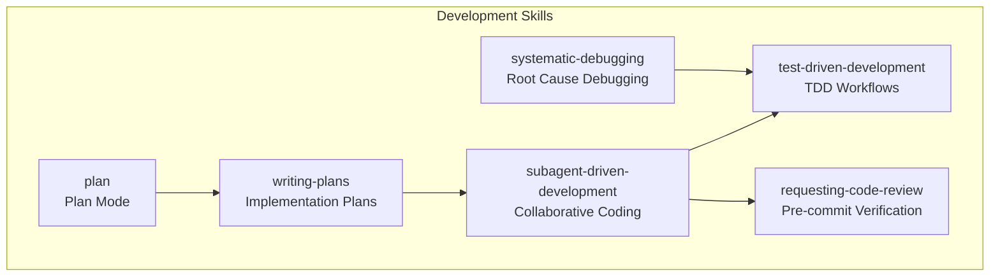
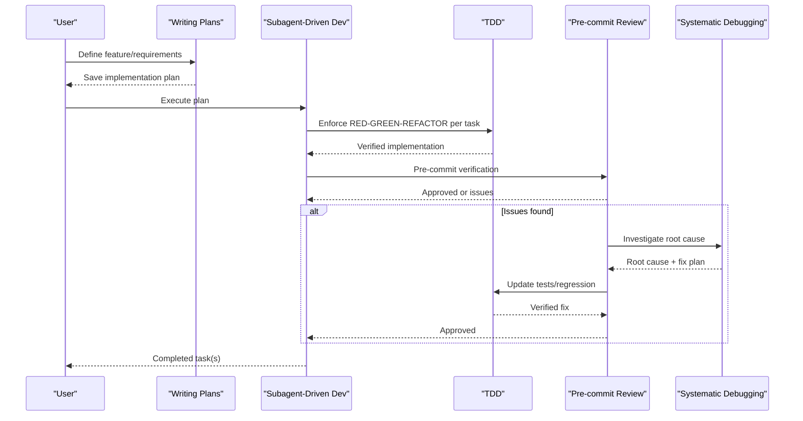
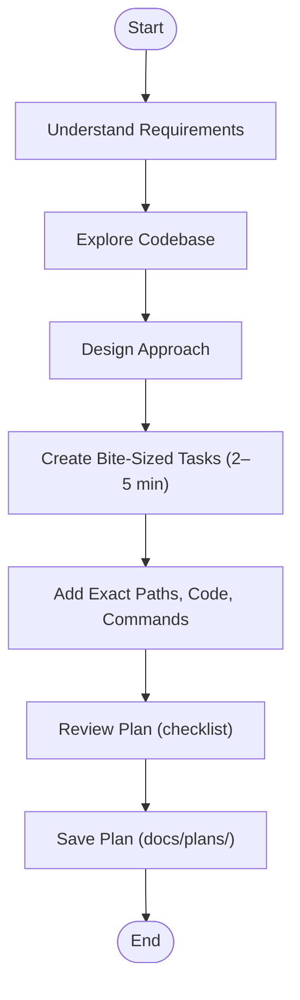
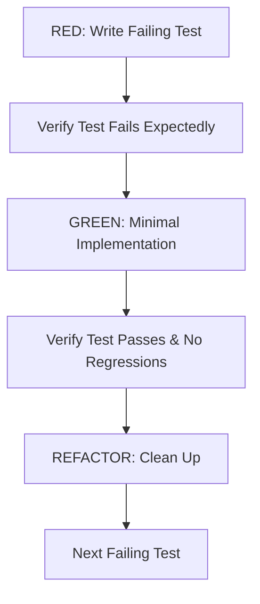
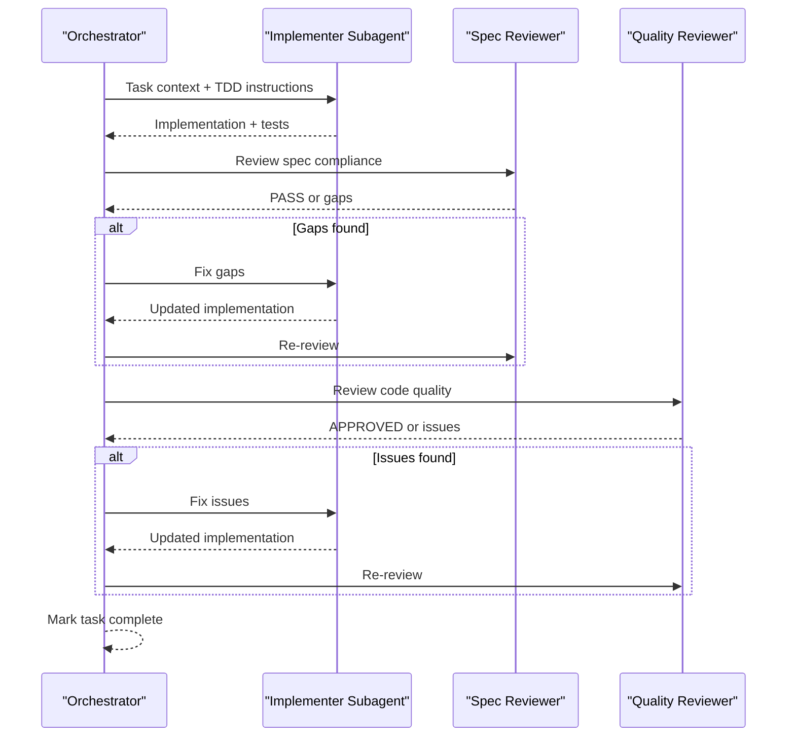
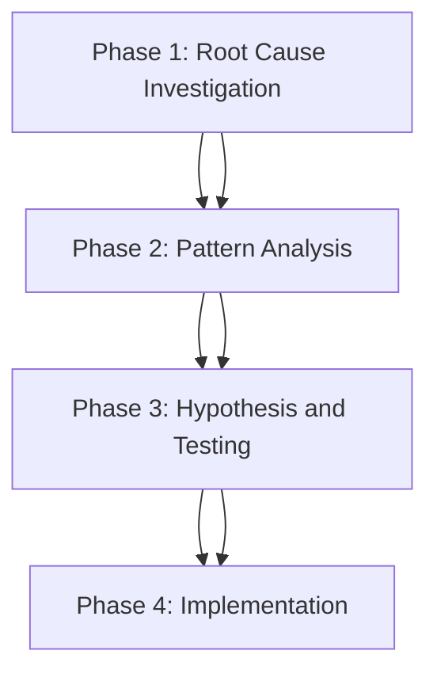
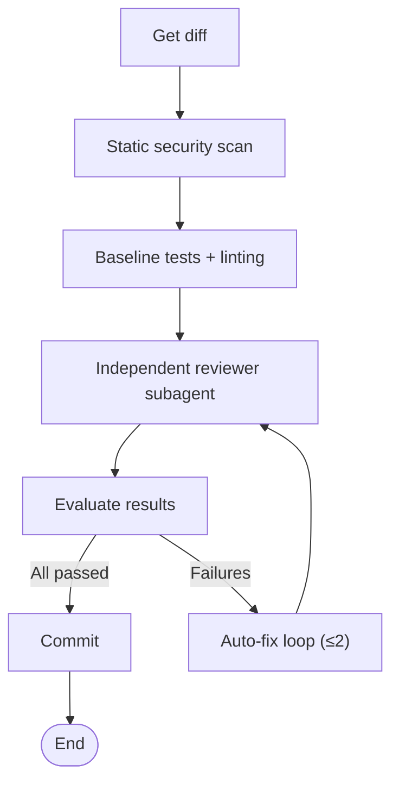
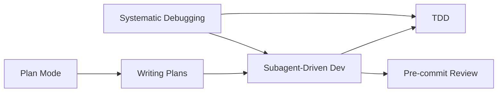

# Software Development Skills

<cite>
**Referenced Files in This Document**
- [plan/SKILL.md](file://skills/software-development/plan/SKILL.md)
- [test-driven-development/SKILL.md](file://skills/software-development/test-driven-development/SKILL.md)
- [subagent-driven-development/SKILL.md](file://skills/software-development/subagent-driven-development/SKILL.md)
- [writing-plans/SKILL.md](file://skills/software-development/writing-plans/SKILL.md)
- [systematic-debugging/SKILL.md](file://skills/software-development/systematic-debugging/SKILL.md)
- [requesting-code-review/SKILL.md](file://skills/software-development/requesting-code-review/SKILL.md)
- [software-development-test-driven-development.md](file://website/docs/user-guide/skills/bundled/software-development/software-development-test-driven-development.md)
- [software-development-subagent-driven-development.md](file://website/docs/user-guide/skills/bundled/software-development/software-development-subagent-driven-development.md)
</cite>

## Table of Contents
1. [Introduction](#introduction)
2. [Project Structure](#project-structure)
3. [Core Components](#core-components)
4. [Architecture Overview](#architecture-overview)
5. [Detailed Component Analysis](#detailed-component-analysis)
6. [Dependency Analysis](#dependency-analysis)
7. [Performance Considerations](#performance-considerations)
8. [Troubleshooting Guide](#troubleshooting-guide)
9. [Conclusion](#conclusion)
10. [Appendices](#appendices)

## Introduction
This document explains the Software Development Skills that power programming assistance and development workflow automation in Hermes Agent. It covers three core skill ecosystems:
- Planning and task breakdown for project scoping
- Test-driven development (TDD) for automated testing workflows
- Subagent-driven development for collaborative coding scenarios

It also documents development tool integration patterns, code analysis capabilities, debugging support systems, and quality assurance workflows. Practical examples demonstrate how to use each skill—from basic code assistance to complex project management—alongside performance optimization and troubleshooting guidance.

## Project Structure
The development skills are organized as bundled skills under the software-development category. Each skill defines a focused capability and integrates with others to form a cohesive development workflow.

**Diagram sources**
- [plan/SKILL.md:1-59](file://skills/software-development/plan/SKILL.md#L1-L59)
- [writing-plans/SKILL.md:1-298](file://skills/software-development/writing-plans/SKILL.md#L1-L298)
- [test-driven-development/SKILL.md:1-344](file://skills/software-development/test-driven-development/SKILL.md#L1-L344)
- [subagent-driven-development/SKILL.md:1-353](file://skills/software-development/subagent-driven-development/SKILL.md#L1-L353)
- [systematic-debugging/SKILL.md:1-368](file://skills/software-development/systematic-debugging/SKILL.md#L1-L368)
- [requesting-code-review/SKILL.md:1-281](file://skills/software-development/requesting-code-review/SKILL.md#L1-L281)

**Section sources**
- [plan/SKILL.md:1-59](file://skills/software-development/plan/SKILL.md#L1-L59)
- [writing-plans/SKILL.md:1-298](file://skills/software-development/writing-plans/SKILL.md#L1-L298)
- [test-driven-development/SKILL.md:1-344](file://skills/software-development/test-driven-development/SKILL.md#L1-L344)
- [subagent-driven-development/SKILL.md:1-353](file://skills/software-development/subagent-driven-development/SKILL.md#L1-L353)
- [systematic-debugging/SKILL.md:1-368](file://skills/software-development/systematic-debugging/SKILL.md#L1-L368)
- [requesting-code-review/SKILL.md:1-281](file://skills/software-development/requesting-code-review/SKILL.md#L1-L281)

## Core Components
- Plan Mode: Produces a markdown plan under the active workspace for future execution.
- Writing Implementation Plans: Creates detailed, executable plans with exact file paths, code examples, and verification steps.
- Subagent-Driven Development: Executes plans via fresh subagents with two-stage review (spec compliance, then code quality).
- Test-Driven Development: Enforces RED-GREEN-REFACTOR cycles and integrates with subagent workflows.
- Systematic Debugging: Four-phase root cause investigation and fix process.
- Requesting Code Review: Pre-commit verification pipeline with static scanning, baseline tests/linting, independent reviewer, and auto-fix loop.

These components integrate through shared tooling (terminal, file, delegate_task) and common workflows (plan creation, task execution, verification).

**Section sources**
- [plan/SKILL.md:14-59](file://skills/software-development/plan/SKILL.md#L14-L59)
- [writing-plans/SKILL.md:14-298](file://skills/software-development/writing-plans/SKILL.md#L14-L298)
- [subagent-driven-development/SKILL.md:14-353](file://skills/software-development/subagent-driven-development/SKILL.md#L14-L353)
- [test-driven-development/SKILL.md:14-344](file://skills/software-development/test-driven-development/SKILL.md#L14-L344)
- [systematic-debugging/SKILL.md:14-368](file://skills/software-development/systematic-debugging/SKILL.md#L14-L368)
- [requesting-code-review/SKILL.md:14-281](file://skills/software-development/requesting-code-review/SKILL.md#L14-L281)

## Architecture Overview
The development skill ecosystem orchestrates planning, implementation, and verification through a series of coordinated steps. Planning produces a structured artifact consumed by subagent-driven development, which enforces TDD and quality gates. Systematic debugging supports both planning and implementation phases, while pre-commit verification ensures safety and consistency before merging.

**Diagram sources**
- [writing-plans/SKILL.md:14-298](file://skills/software-development/writing-plans/SKILL.md#L14-L298)
- [subagent-driven-development/SKILL.md:14-353](file://skills/software-development/subagent-driven-development/SKILL.md#L14-L353)
- [test-driven-development/SKILL.md:14-344](file://skills/software-development/test-driven-development/SKILL.md#L14-L344)
- [requesting-code-review/SKILL.md:14-281](file://skills/software-development/requesting-code-review/SKILL.md#L14-L281)
- [systematic-debugging/SKILL.md:14-368](file://skills/software-development/systematic-debugging/SKILL.md#L14-L368)

## Detailed Component Analysis

### Planning and Task Breakdown (Plan Mode and Writing Plans)
- Plan Mode focuses on producing a markdown plan without executing code, saving under a workspace-relative path.
- Writing Plans transforms requirements into executable, granular tasks with exact file paths, code examples, and verification steps. It emphasizes DRY, YAGNI, TDD, and frequent commits.

**Diagram sources**
- [plan/SKILL.md:14-59](file://skills/software-development/plan/SKILL.md#L14-L59)
- [writing-plans/SKILL.md:132-204](file://skills/software-development/writing-plans/SKILL.md#L132-L204)

**Section sources**
- [plan/SKILL.md:14-59](file://skills/software-development/plan/SKILL.md#L14-L59)
- [writing-plans/SKILL.md:14-298](file://skills/software-development/writing-plans/SKILL.md#L14-L298)

### Test-Driven Development (TDD)
- Core principle: Write the test first, watch it fail, write minimal code to pass, verify, then refactor.
- Integrates with subagent-driven development by enforcing the RED-GREEN-REFACTOR cycle per task.
- Provides anti-patterns and verification checklists to maintain discipline.

**Diagram sources**
- [test-driven-development/SKILL.md:55-177](file://skills/software-development/test-driven-development/SKILL.md#L55-L177)

**Section sources**
- [test-driven-development/SKILL.md:14-344](file://skills/software-development/test-driven-development/SKILL.md#L14-L344)
- [software-development-test-driven-development.md:318-362](file://website/docs/user-guide/skills/bundled/software-development/software-development-test-driven-development.md#L318-L362)

### Subagent-Driven Development
- Executes implementation plans by dispatching fresh subagents per task with two-stage review: spec compliance, then code quality.
- Emphasizes task granularity, avoiding shared-state confusion and ensuring consistent quality checks.
- Integrates with TDD and pre-commit review to enforce quality gates.

**Diagram sources**
- [subagent-driven-development/SKILL.md:36-189](file://skills/software-development/subagent-driven-development/SKILL.md#L36-L189)

**Section sources**
- [subagent-driven-development/SKILL.md:14-353](file://skills/software-development/subagent-driven-development/SKILL.md#L14-L353)
- [software-development-subagent-driven-development.md:1-301](file://website/docs/user-guide/skills/bundled/software-development/software-development-subagent-driven-development.md#L1-L301)

### Systematic Debugging
- Four-phase process: Root Cause Investigation, Pattern Analysis, Hypothesis and Testing, Implementation.
- Requires root cause before any fix; integrates with TDD by creating failing regression tests.
- Includes red flags and common rationalizations to avoid shortcuts.

**Diagram sources**
- [systematic-debugging/SKILL.md:54-317](file://skills/software-development/systematic-debugging/SKILL.md#L54-L317)

**Section sources**
- [systematic-debugging/SKILL.md:14-368](file://skills/software-development/systematic-debugging/SKILL.md#L14-L368)

### Requesting Code Review (Pre-commit Verification)
- Static security scan, baseline-aware tests/linting, independent reviewer subagent, and auto-fix loop.
- Fail-closed rules ensure safety; auto-fix attempts up to two cycles; escalates unresolved issues to the user.

**Diagram sources**
- [requesting-code-review/SKILL.md:33-237](file://skills/software-development/requesting-code-review/SKILL.md#L33-L237)

**Section sources**
- [requesting-code-review/SKILL.md:14-281](file://skills/software-development/requesting-code-review/SKILL.md#L14-L281)

## Dependency Analysis
The skills form a layered workflow with clear dependencies:
- Writing Plans depends on Plan Mode for initial plan creation.
- Subagent-Driven Development consumes plans and enforces TDD and pre-commit review.
- Systematic Debugging supports both planning and implementation by identifying root causes and guiding regression tests.
- Pre-commit Review complements TDD by validating tests and preventing regressions.

**Diagram sources**
- [plan/SKILL.md:1-59](file://skills/software-development/plan/SKILL.md#L1-L59)
- [writing-plans/SKILL.md:1-298](file://skills/software-development/writing-plans/SKILL.md#L1-L298)
- [subagent-driven-development/SKILL.md:1-353](file://skills/software-development/subagent-driven-development/SKILL.md#L1-L353)
- [test-driven-development/SKILL.md:1-344](file://skills/software-development/test-driven-development/SKILL.md#L1-L344)
- [requesting-code-review/SKILL.md:1-281](file://skills/software-development/requesting-code-review/SKILL.md#L1-L281)
- [systematic-debugging/SKILL.md:1-368](file://skills/software-development/systematic-debugging/SKILL.md#L1-L368)

**Section sources**
- [writing-plans/SKILL.md:255-298](file://skills/software-development/writing-plans/SKILL.md#L255-L298)
- [subagent-driven-development/SKILL.md:255-353](file://skills/software-development/subagent-driven-development/SKILL.md#L255-L353)
- [test-driven-development/SKILL.md:283-344](file://skills/software-development/test-driven-development/SKILL.md#L283-L344)
- [requesting-code-review/SKILL.md:261-281](file://skills/software-development/requesting-code-review/SKILL.md#L261-L281)
- [systematic-debugging/SKILL.md:318-368](file://skills/software-development/systematic-debugging/SKILL.md#L318-L368)

## Performance Considerations
- Task granularity: Keep tasks small (2–5 minutes) to reduce context switching and improve throughput.
- Two-stage review: Early detection of spec and quality issues reduces rework and debugging time.
- Pre-commit verification: Catch regressions and security issues before merging, reducing downstream costs.
- Tooling efficiency: Use targeted terminal commands and file operations; leverage search and read operations to minimize manual navigation.
- Context management: Fresh subagents per task prevent context pollution and improve focus.

[No sources needed since this section provides general guidance]

## Troubleshooting Guide
Common issues and resolutions:
- Empty or missing diff: Ensure staged changes; split large diffs by file; confirm git repository status.
- Non-JSON reviewer response: Retry once with stricter prompts; otherwise treat as failure.
- False positives in reviewer: Clarify intent in fix prompts; ensure reviewer flags are intentional.
- No test framework detected: Skip regression check; reviewer verdict still applies.
- Auto-fix introduces new issues: Counts as a new failure; iterate the auto-fix loop up to two times.
- Subagent asks questions: Answer clearly and completely; provide additional context before proceeding.
- Reviewer finds issues: Fix and re-review; do not skip re-review loops.
- Multiple implementers touching the same files: Avoid concurrent edits; coordinate via separate tasks.

**Section sources**
- [requesting-code-review/SKILL.md:271-281](file://skills/software-development/requesting-code-review/SKILL.md#L271-L281)

## Conclusion
The Software Development Skills in Hermes Agent provide a robust, repeatable framework for planning, implementing, and verifying code. By combining structured planning, disciplined TDD, collaborative subagent execution, and rigorous pre-commit verification, teams can achieve higher quality, faster iteration, and fewer defects. Systematic debugging ensures root causes are addressed, while integrated tooling and clear workflows streamline development across local, containerized, and remote environments.

[No sources needed since this section summarizes without analyzing specific files]

## Appendices

### Practical Examples Index
- Basic code assistance: Use Plan Mode to capture intent, then Writing Plans to produce a concrete plan.
- Task execution: Use Subagent-Driven Development to execute tasks with TDD and two-stage review.
- Quality assurance: Use Requesting Code Review to validate changes before committing.
- Debugging: Use Systematic Debugging to investigate and fix issues with a structured approach.

[No sources needed since this section provides general guidance]