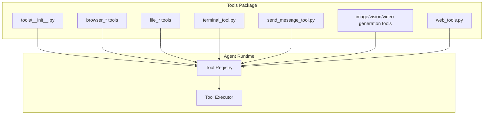
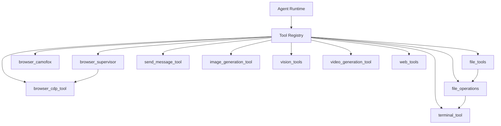
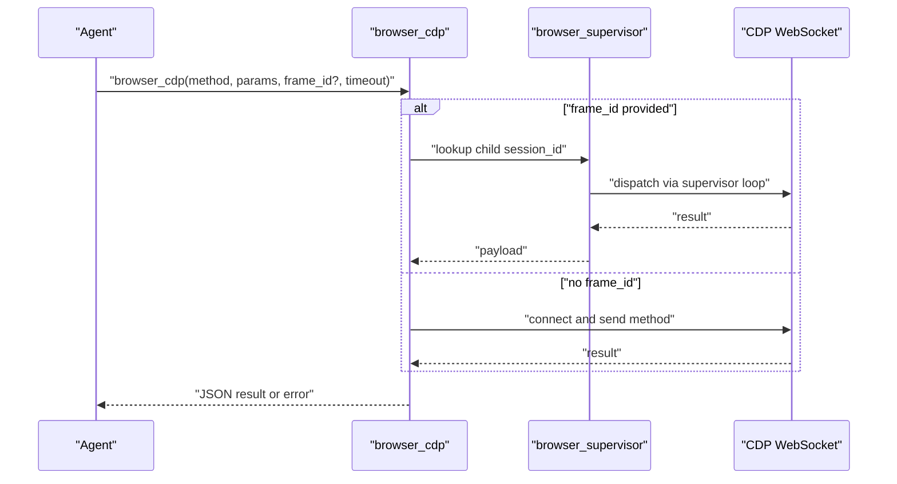
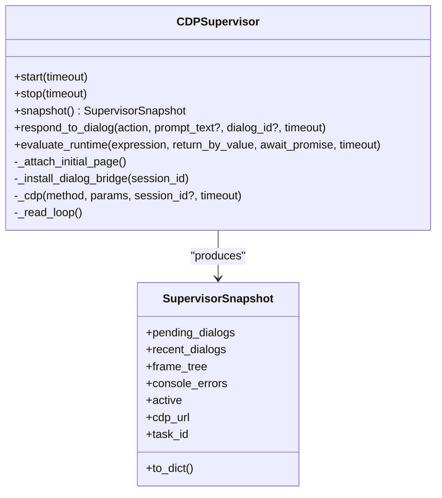
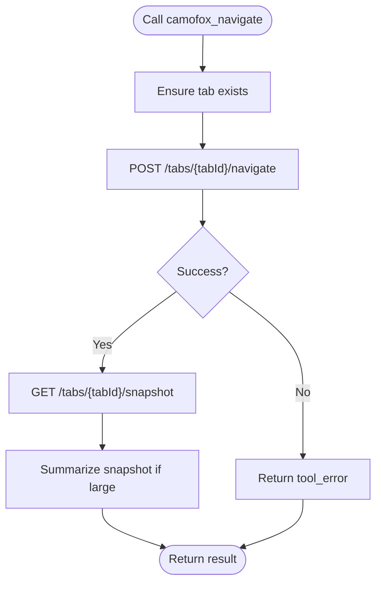
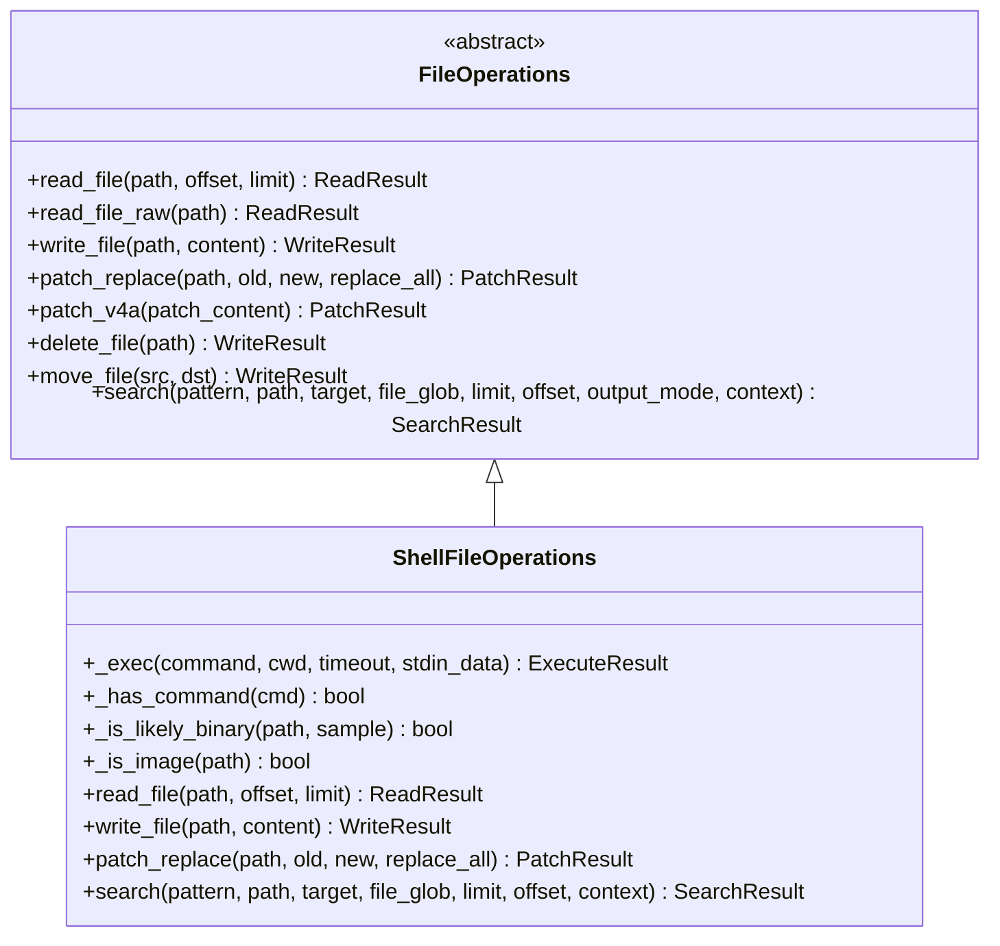
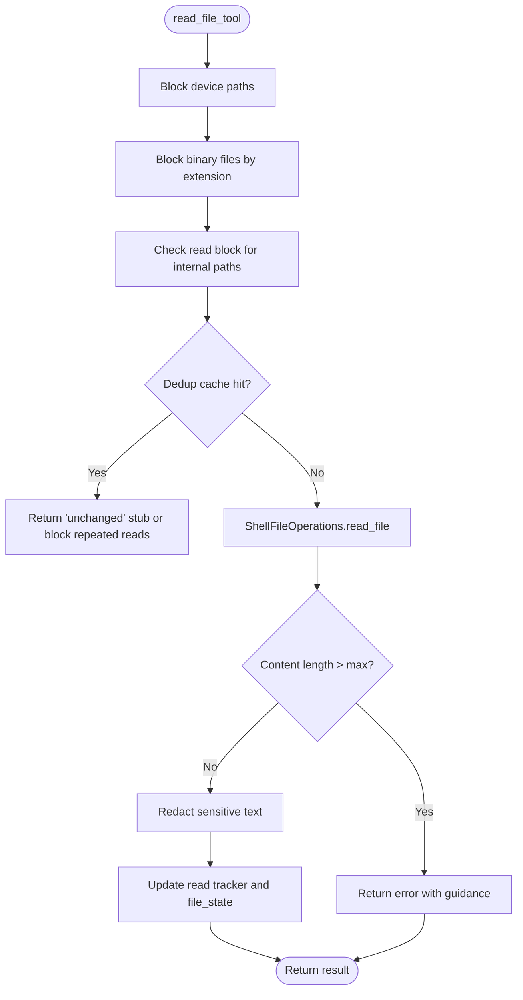
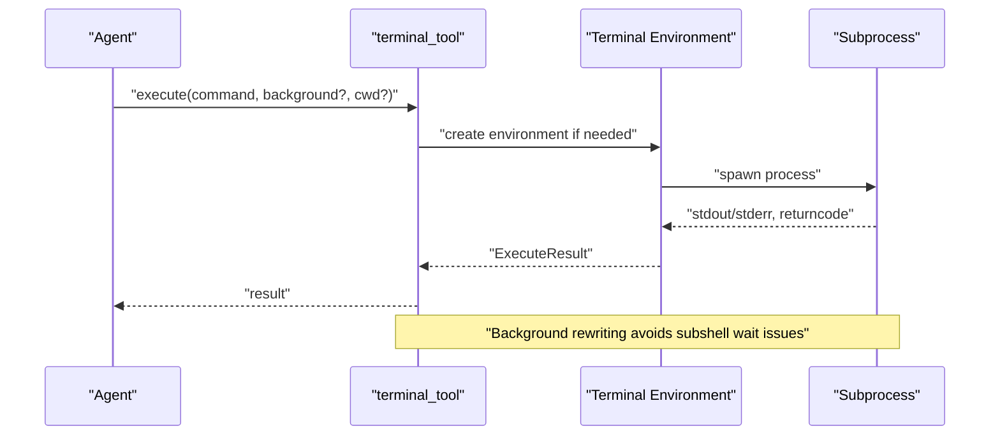
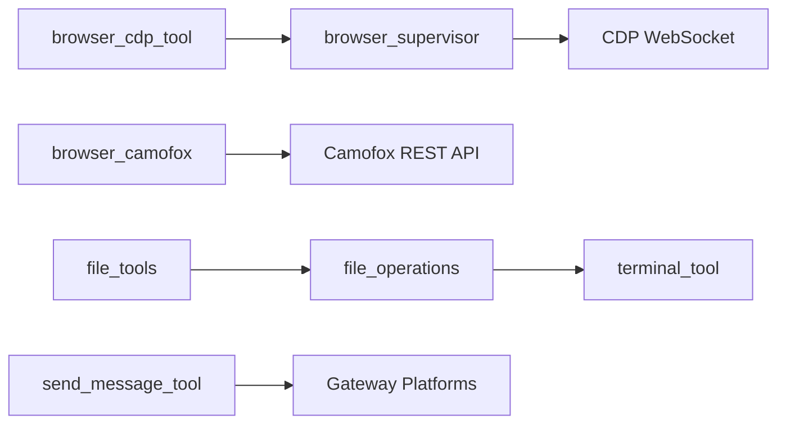

# Built-in Tools Catalog

<cite>
**Referenced Files in This Document**
- [tools/__init__.py](file://tools/__init__.py)
- [tools/browser_cdp_tool.py](file://tools/browser_cdp_tool.py)
- [tools/browser_supervisor.py](file://tools/browser_supervisor.py)
- [tools/browser_camofox.py](file://tools/browser_camofox.py)
- [tools/file_operations.py](file://tools/file_operations.py)
- [tools/file_tools.py](file://tools/file_tools.py)
- [tools/terminal_tool.py](file://tools/terminal_tool.py)
- [tools/send_message_tool.py](file://tools/send_message_tool.py)
- [tools/image_generation_tool.py](file://tools/image_generation_tool.py)
- [tools/vision_tools.py](file://tools/vision_tools.py)
- [tools/video_generation_tool.py](file://tools/video_generation_tool.py)
- [tools/web_tools.py](file://tools/web_tools.py)
</cite>

## Table of Contents
1. [Introduction](#introduction)
2. [Project Structure](#project-structure)
3. [Core Components](#core-components)
4. [Architecture Overview](#architecture-overview)
5. [Detailed Component Analysis](#detailed-component-analysis)
6. [Dependency Analysis](#dependency-analysis)
7. [Performance Considerations](#performance-considerations)
8. [Troubleshooting Guide](#troubleshooting-guide)
9. [Conclusion](#conclusion)
10. [Appendices](#appendices)

## Introduction
This document catalogs the built-in tools provided by the system, organized by functional categories. It covers browser automation (including CDP passthrough, supervisor orchestration, and Camofox integration), file operations (read, write, patch, search), process execution (terminal tool and code execution), communication tools (send_message_tool for multiple platforms), creative tools (image, vision, video generation), development tools (web search and Git-related utilities), productivity and system integration utilities, and specialized helpers. For each tool category, we describe usage patterns, configuration options, security considerations, integration approaches, schemas, parameter validation, and result formats.

## Project Structure
The built-in tools are primarily located under the tools/ directory. They are exposed to the agent runtime via a registry and integrated with terminal backends, browser providers, and platform-specific adapters. The package initialization keeps imports minimal to avoid eager loading of heavy subsystems.

**Diagram sources**
- [tools/__init__.py:1-26](file://tools/__init__.py#L1-L26)

**Section sources**
- [tools/__init__.py:1-26](file://tools/__init__.py#L1-L26)

## Core Components
- Browser automation tools:
  - browser_cdp_tool: raw Chrome DevTools Protocol passthrough for advanced browser operations.
  - browser_supervisor: persistent supervisor managing dialogs, frame detection, and live CDP sessions.
  - browser_camofox: Camofox REST API integration for anti-detection browser automation.
- File operation tools:
  - file_operations: unified shell-based file operations across terminal backends.
  - file_tools: LLM-friendly tool wrappers with safety guards, deduplication, and redaction.
- Process execution tools:
  - terminal_tool: multi-backend terminal execution (local, Docker, Modal, SSH, Singularity, Vercel Sandbox).
  - code_execution_tool: code execution abstraction (referenced via imports).
- Communication tools:
  - send_message_tool: cross-platform messaging via gateway platforms.
- Creative tools:
  - image_generation_tool, vision_tools, video_generation_tool: multimodal generation and analysis.
- Development tools:
  - web_tools: web search and related utilities.

**Section sources**
- [tools/browser_cdp_tool.py:1-570](file://tools/browser_cdp_tool.py#L1-L570)
- [tools/browser_supervisor.py:1-800](file://tools/browser_supervisor.py#L1-L800)
- [tools/browser_camofox.py:1-700](file://tools/browser_camofox.py#L1-L700)
- [tools/file_operations.py:1-800](file://tools/file_operations.py#L1-L800)
- [tools/file_tools.py:1-800](file://tools/file_tools.py#L1-L800)
- [tools/terminal_tool.py:1-800](file://tools/terminal_tool.py#L1-L800)
- [tools/send_message_tool.py](file://tools/send_message_tool.py)
- [tools/image_generation_tool.py](file://tools/image_generation_tool.py)
- [tools/vision_tools.py](file://tools/vision_tools.py)
- [tools/video_generation_tool.py](file://tools/video_generation_tool.py)
- [tools/web_tools.py](file://tools/web_tools.py)

## Architecture Overview
The tools are registered with a central registry and invoked by the agent runtime. Browser tools integrate with either a persistent supervisor (for dialogs and frame tracking) or direct CDP endpoints. File operations are executed via a terminal backend abstraction, ensuring consistent behavior across environments. Communication tools leverage platform adapters. Creative tools integrate with auxiliary clients and providers.

**Diagram sources**
- [tools/browser_cdp_tool.py:555-570](file://tools/browser_cdp_tool.py#L555-L570)
- [tools/browser_supervisor.py:259-401](file://tools/browser_supervisor.py#L259-L401)
- [tools/browser_camofox.py:336-540](file://tools/browser_camofox.py#L336-L540)
- [tools/file_operations.py:503-527](file://tools/file_operations.py#L503-L527)
- [tools/file_tools.py:305-435](file://tools/file_tools.py#L305-L435)
- [tools/terminal_tool.py:1-120](file://tools/terminal_tool.py#L1-L120)
- [tools/send_message_tool.py](file://tools/send_message_tool.py)
- [tools/image_generation_tool.py](file://tools/image_generation_tool.py)
- [tools/vision_tools.py](file://tools/vision_tools.py)
- [tools/video_generation_tool.py](file://tools/video_generation_tool.py)
- [tools/web_tools.py](file://tools/web_tools.py)

## Detailed Component Analysis

### Browser Automation Tools

#### browser_cdp_tool
- Purpose: Raw Chrome DevTools Protocol (CDP) passthrough for advanced browser operations not covered by higher-level tools.
- Key capabilities:
  - Arbitrary CDP method invocation with optional target/session scoping.
  - Routing iframe-scoped calls through a persistent supervisor for backends with strict session lifecycles.
  - Validation of endpoint availability and method parameters.
- Schema highlights:
  - Parameters include method, params, target_id, frame_id, timeout.
  - Availability gated by reachable CDP endpoint.
- Security and reliability:
  - Requires a valid CDP WebSocket URL; errors are surfaced with actionable hints.
  - Uses async-from-sync bridging and timeouts to prevent deadlocks.
- Integration patterns:
  - Use frame_id routing for cross-origin iframes on backends where per-call sessions expire quickly.
  - Combine with browser_supervisor for persistent dialog handling and frame tree introspection.

**Diagram sources**
- [tools/browser_cdp_tool.py:301-420](file://tools/browser_cdp_tool.py#L301-L420)
- [tools/browser_supervisor.py:403-463](file://tools/browser_supervisor.py#L403-L463)

**Section sources**
- [tools/browser_cdp_tool.py:1-570](file://tools/browser_cdp_tool.py#L1-L570)

#### browser_supervisor
- Purpose: Persistent supervisor maintaining a single WebSocket to the browser backend, subscribing to Page/Runtime/Target events, and exposing a thread-safe snapshot of pending dialogs and frame tree.
- Key capabilities:
  - Dialog capture and response (accept/dismiss) with configurable policies.
  - Frame tree tracking with caps to bound payload sizes.
  - Live Runtime.evaluate via supervisor’s WebSocket to avoid per-call setup costs.
  - Reconnection logic resilient to backend socket teardowns.
- Integration patterns:
  - Used by browser_snapshot and browser_dialog tools.
  - Provides state for browser_cdp frame_id routing.

**Diagram sources**
- [tools/browser_supervisor.py:259-401](file://tools/browser_supervisor.py#L259-L401)
- [tools/browser_supervisor.py:229-254](file://tools/browser_supervisor.py#L229-L254)

**Section sources**
- [tools/browser_supervisor.py:1-800](file://tools/browser_supervisor.py#L1-L800)

#### browser_camofox
- Purpose: Camofox REST API integration for anti-detection browser automation when a CDP endpoint is not available or desired.
- Key capabilities:
  - Session management with optional managed persistence and identity overrides.
  - Tab lifecycle: navigate, click, type, scroll, back, press, close.
  - Snapshot retrieval with summarization and image extraction.
  - Vision analysis by capturing screenshots and invoking an auxiliary vision client.
  - Health probing and optional VNC URL exposure.
- Security and reliability:
  - Enforces configuration precedence: CDP override takes priority over Camofox.
  - Provides graceful fallbacks when console logs are not available via REST.
- Integration patterns:
  - Configure CAMOFOX_URL and optional managed persistence in config.yaml.
  - Use camofox_vision for image analysis workflows.

**Diagram sources**
- [tools/browser_camofox.py:336-432](file://tools/browser_camofox.py#L336-L432)

**Section sources**
- [tools/browser_camofox.py:1-700](file://tools/browser_camofox.py#L1-L700)

### File Operation Tools

#### file_operations
- Purpose: Unified shell-based file operations across terminal backends (local, Docker, SSH, Singularity, Modal, Daytona, Vercel Sandbox).
- Key capabilities:
  - Read with pagination, binary detection, line numbering, and truncation hints.
  - Write with linting and LSP diagnostics integration.
  - Patching via fuzzy replacement and V4A format.
  - Search with content and file name matching, context lines, and pagination.
  - Safe path expansion and shell escaping to prevent injection.
- Safety and limits:
  - Deny-list for sensitive system paths and device files.
  - Max read limits and character caps to protect context windows.
  - Binary extension checks and image redirection to vision tools.
- Integration patterns:
  - Construct ShellFileOperations with a terminal environment.
  - Use for read_file, write_file, patch_replace, patch_v4a, delete_file, move_file, search.

**Diagram sources**
- [tools/file_operations.py:259-310](file://tools/file_operations.py#L259-L310)
- [tools/file_operations.py:503-527](file://tools/file_operations.py#L503-L527)

**Section sources**
- [tools/file_operations.py:1-800](file://tools/file_operations.py#L1-L800)

#### file_tools
- Purpose: LLM-friendly wrappers around file_operations with safety guards, deduplication, and redaction.
- Key capabilities:
  - Read with device path blocking, binary file blocking, and character count limits.
  - Deduplication cache to prevent repeated reads of unchanged files.
  - Staleness detection comparing file modification times.
  - Write with sensitive path checks and post-write invalidation of dedup cache.
  - Search with pagination normalization and context-aware hints.
- Security and reliability:
  - Redacts sensitive text from content before returning to the model.
  - Tracks file reads/writes across tasks to detect external edits and sibling subagent interference.
- Integration patterns:
  - Use read_file_tool, write_file_tool, search_files_tool (via file_operations.search) with task_id scoping.

**Diagram sources**
- [tools/file_tools.py:447-656](file://tools/file_tools.py#L447-L656)

**Section sources**
- [tools/file_tools.py:1-800](file://tools/file_tools.py#L1-L800)

### Process Execution Tools

#### terminal_tool
- Purpose: Multi-backend terminal execution supporting local, Docker, Modal, SSH, Singularity, and Vercel Sandbox environments.
- Key capabilities:
  - Environment selection via TERMINAL_ENV.
  - Background task support and compound-background rewriting to avoid subshell wait issues.
  - Dangerous command approval system and sudo password caching.
  - Workdir validation and environment variable handling.
  - Cleanup threads and lifecycle management for sandboxes.
- Security and reliability:
  - Validates workdirs against a strict allowlist.
  - Rewrites sudo invocations to avoid interactive prompts when possible.
  - Provides disk usage warnings and cleanup helpers.
- Integration patterns:
  - Select backend via environment variables; use for long-running commands, background tasks, and sandboxed operations.

**Diagram sources**
- [tools/terminal_tool.py:651-800](file://tools/terminal_tool.py#L651-L800)

**Section sources**
- [tools/terminal_tool.py:1-800](file://tools/terminal_tool.py#L1-L800)

### Communication Tools

#### send_message_tool
- Purpose: Cross-platform messaging abstraction backed by gateway platform adapters.
- Key capabilities:
  - Unified interface to send messages across multiple platforms (e.g., Telegram, Discord, Slack, Email).
  - Platform-specific configuration and credentials management.
- Integration patterns:
  - Configure platform credentials and settings in gateway configuration; invoke send_message_tool with platform-specific parameters.

**Section sources**
- [tools/send_message_tool.py](file://tools/send_message_tool.py)

### Creative Tools

#### image_generation_tool
- Purpose: Generate images via configured providers and registries.
- Integration patterns:
  - Select provider via configuration; invoke with prompt and parameters; receive generated image identifiers or URLs.

**Section sources**
- [tools/image_generation_tool.py](file://tools/image_generation_tool.py)

#### vision_tools
- Purpose: Vision analysis of images and browser screenshots.
- Integration patterns:
  - Provide image content or screenshot paths; receive textual analysis from a vision-capable LLM.

**Section sources**
- [tools/vision_tools.py](file://tools/vision_tools.py)

#### video_generation_tool
- Purpose: Generate videos via configured providers and registries.
- Integration patterns:
  - Provide prompt and parameters; receive generated video identifiers or URLs.

**Section sources**
- [tools/video_generation_tool.py](file://tools/video_generation_tool.py)

### Development Tools

#### web_tools
- Purpose: Web search and related utilities for development workflows.
- Integration patterns:
  - Invoke web search tools with queries; receive structured results for further processing.

**Section sources**
- [tools/web_tools.py](file://tools/web_tools.py)

## Dependency Analysis
- Browser tools:
  - browser_cdp_tool depends on browser_supervisor for frame-id routing and on a reachable CDP endpoint.
  - browser_supervisor maintains a persistent WebSocket and auto-attaches to targets.
  - browser_camofox provides a REST alternative when CDP is unavailable.
- File tools:
  - file_tools wraps file_operations and shells out to terminal_tool environments.
  - file_operations relies on terminal_tool’s execute() interface for all operations.
- Terminal tool:
  - Supports multiple backends and enforces safety via guards and sudo handling.
- Communication tools:
  - send_message_tool integrates with gateway platform adapters.

**Diagram sources**
- [tools/browser_cdp_tool.py:334-342](file://tools/browser_cdp_tool.py#L334-L342)
- [tools/browser_supervisor.py:584-679](file://tools/browser_supervisor.py#L584-L679)
- [tools/browser_camofox.py:336-432](file://tools/browser_camofox.py#L336-L432)
- [tools/file_tools.py:305-435](file://tools/file_tools.py#L305-L435)
- [tools/file_operations.py:503-527](file://tools/file_operations.py#L503-L527)
- [tools/terminal_tool.py:1-120](file://tools/terminal_tool.py#L1-L120)
- [tools/send_message_tool.py](file://tools/send_message_tool.py)

**Section sources**
- [tools/browser_cdp_tool.py:1-570](file://tools/browser_cdp_tool.py#L1-L570)
- [tools/browser_supervisor.py:1-800](file://tools/browser_supervisor.py#L1-L800)
- [tools/browser_camofox.py:1-700](file://tools/browser_camofox.py#L1-L700)
- [tools/file_operations.py:1-800](file://tools/file_operations.py#L1-L800)
- [tools/file_tools.py:1-800](file://tools/file_tools.py#L1-L800)
- [tools/terminal_tool.py:1-800](file://tools/terminal_tool.py#L1-L800)
- [tools/send_message_tool.py](file://tools/send_message_tool.py)

## Performance Considerations
- Browser automation:
  - Use frame_id routing via the supervisor to avoid per-call CDP connection overhead on backends with strict session lifecycles.
  - Prefer supervisor.evaluate_runtime for frequent evaluations to reuse the persistent WebSocket.
- File operations:
  - Use offset/limit to read only necessary content; large files should be processed in chunks.
  - Leverage deduplication to avoid repeated reads of unchanged files.
- Terminal execution:
  - Avoid subshell wait issues by relying on background rewriting for compound commands ending with background operators.
  - Use environment-specific timeouts and resource limits to prevent runaway processes.

## Troubleshooting Guide
- Browser CDP:
  - Ensure a reachable CDP endpoint is configured; errors indicate missing or invalid WebSocket URL.
  - For cross-origin iframes, use frame_id routing via the supervisor.
- Camofox:
  - Verify CAMOFOX_URL and health endpoint; check VNC URL exposure if enabled.
  - Prefer managed persistence for consistent sessions across restarts.
- File operations:
  - Respect binary file restrictions; use vision tools for images.
  - Monitor read dedup warnings and staleness alerts; re-read files when needed.
- Terminal tool:
  - Validate workdir allowlist; handle sudo prompts via cached passwords or callbacks.
  - Check dangerous command approvals and environment variable handling.

**Section sources**
- [tools/browser_cdp_tool.py:351-410](file://tools/browser_cdp_tool.py#L351-L410)
- [tools/browser_camofox.py:69-98](file://tools/browser_camofox.py#L69-L98)
- [tools/file_tools.py:571-656](file://tools/file_tools.py#L571-L656)
- [tools/terminal_tool.py:318-328](file://tools/terminal_tool.py#L318-L328)

## Conclusion
The built-in tools provide a robust, secure, and scalable foundation for browser automation, file manipulation, process execution, communication, and creative workflows. By leveraging the registry, terminal backends, and platform adapters, agents can safely and efficiently perform complex tasks across diverse environments while adhering to strict safety and performance guidelines.

## Appendices
- Tool schemas and parameter validation:
  - Browser CDP: method and params are validated; target_id and frame_id are mutually exclusive; timeout clamped to a safe range.
  - File operations: pagination normalized; read limits enforced; binary and device file guards applied.
  - Terminal tool: workdir allowlist enforced; sudo rewriting and approval gating active.
- Result formats:
  - JSON payloads with success/error fields; structured results for reads, writes, patches, and searches; browser snapshots include pending dialogs and frame trees.