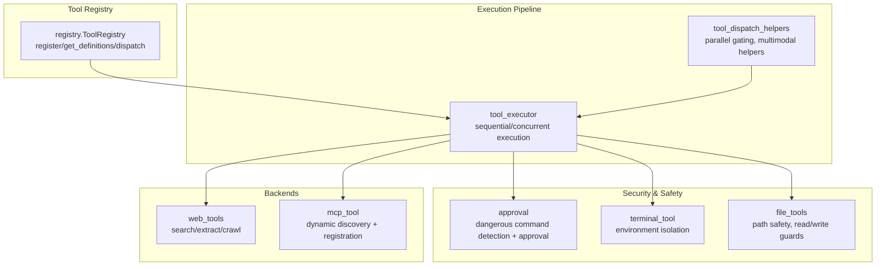
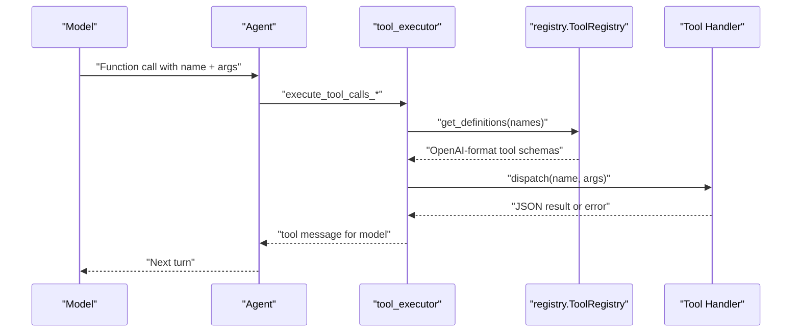
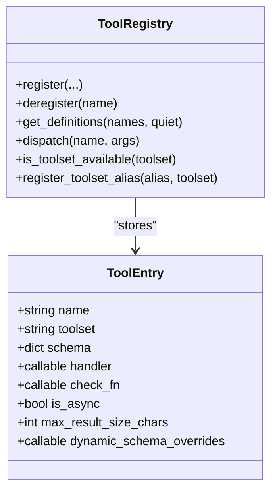
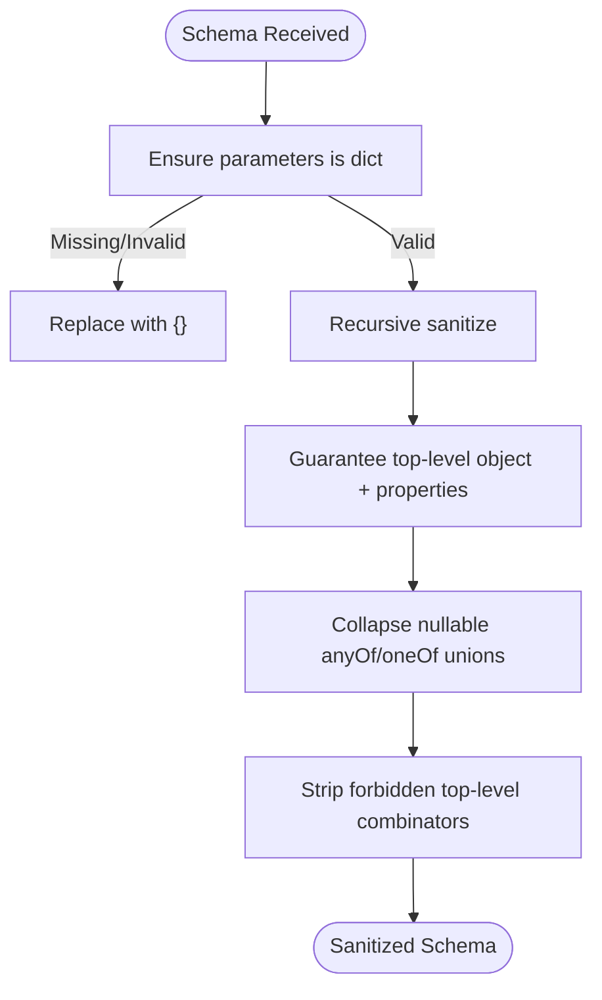
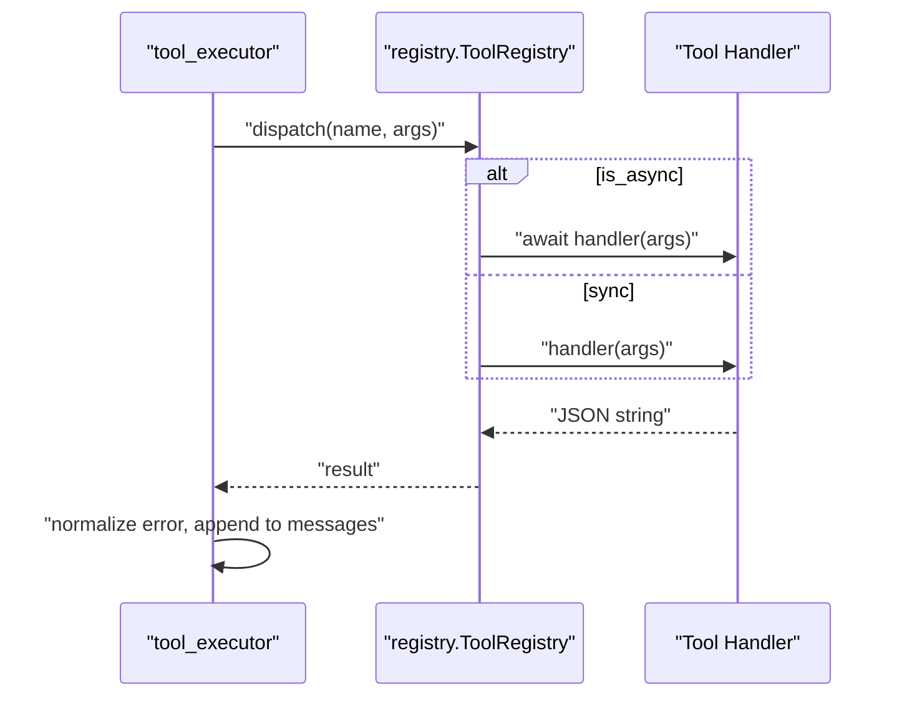
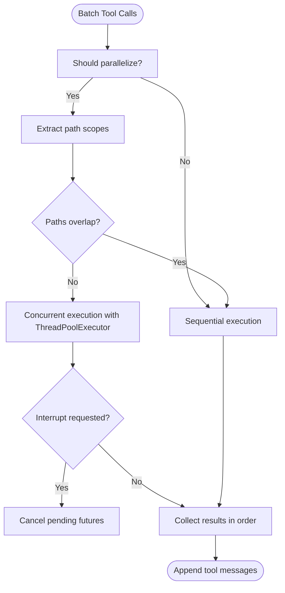
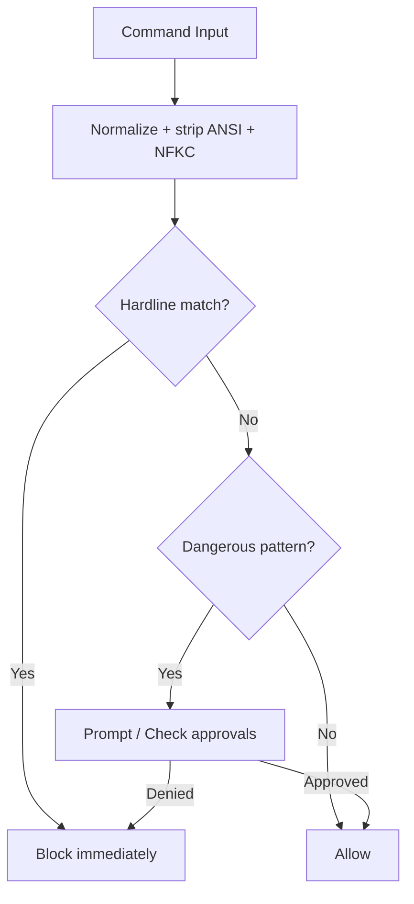
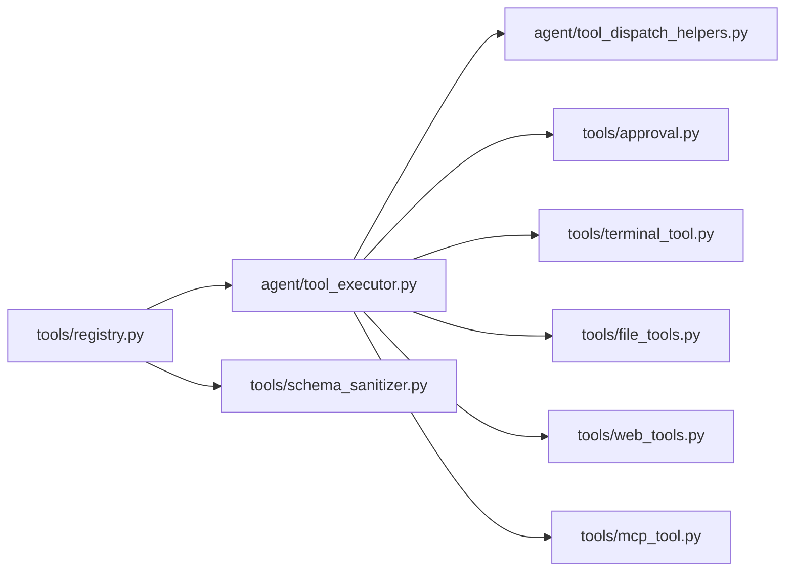

# Tool Development Guide

<cite>
**Referenced Files in This Document**
- [registry.py](file://tools/registry.py)
- [schema_sanitizer.py](file://tools/schema_sanitizer.py)
- [tool_dispatch_helpers.py](file://agent/tool_dispatch_helpers.py)
- [tool_executor.py](file://agent/tool_executor.py)
- [approval.py](file://tools/approval.py)
- [terminal_tool.py](file://tools/terminal_tool.py)
- [file_tools.py](file://tools/file_tools.py)
- [web_tools.py](file://tools/web_tools.py)
- [mcp_tool.py](file://tools/mcp_tool.py)
- [test_registry.py](file://tests/tools/test_registry.py)
- [test_mcp_dynamic_discovery.py](file://tests/tools/test_mcp_dynamic_discovery.py)
- [test_schema_sanitizer.py](file://tests/tools/test_schema_sanitizer.py)
- [test_code_execution_windows_env.py](file://tests/tools/test_code_execution_windows_env.py)
- [test_moonshot_schema.py](file://tests/agent/test_moonshot_schema.py)
- [test_web_tools.py](file://tests/integration/test_web_tools.py)
- [toolset_distributions.py](file://toolset_distributions.py)
- [test_toolset_distributions.py](file://tests/test_toolset_distributions.py)
</cite>

## Table of Contents
1. [Introduction](#introduction)
2. [Project Structure](#project-structure)
3. [Core Components](#core-components)
4. [Architecture Overview](#architecture-overview)
5. [Detailed Component Analysis](#detailed-component-analysis)
6. [Dependency Analysis](#dependency-analysis)
7. [Performance Considerations](#performance-considerations)
8. [Troubleshooting Guide](#troubleshooting-guide)
9. [Conclusion](#conclusion)
10. [Appendices](#appendices)

## Introduction
This guide explains how to develop custom tools for the Hermes agent framework. It covers the end-to-end lifecycle: defining tool schemas, implementing handlers, registering tools, validating parameters, executing tools synchronously and asynchronously, formatting results, enforcing security, testing, and optimizing performance. Practical examples demonstrate building simple utilities and complex integrations, along with advanced topics such as dynamic schema generation, parallel execution, and tool composition.

## Project Structure
Hermes organizes tool development around a central registry and a tool execution pipeline:
- Central registry: registers tool schemas, handlers, and availability checks.
- Execution pipeline: parses tool calls, validates arguments, dispatches to handlers, and formats results.
- Security: dangerous command detection, approval prompts, and environment isolation.
- Backends: file operations, web search/extract/crawl, terminal execution, and MCP integrations.

**Diagram sources**
- [registry.py:151-544](file://tools/registry.py#L151-L544)
- [tool_dispatch_helpers.py:103-146](file://agent/tool_dispatch_helpers.py#L103-L146)
- [tool_executor.py:64-472](file://agent/tool_executor.py#L64-L472)
- [approval.py:470-800](file://tools/approval.py#L470-L800)
- [terminal_tool.py:1-200](file://tools/terminal_tool.py#L1-L200)
- [file_tools.py:1-200](file://tools/file_tools.py#L1-L200)
- [web_tools.py:1-200](file://tools/web_tools.py#L1-L200)
- [mcp_tool.py:3284-3286](file://tools/mcp_tool.py#L3284-L3286)

**Section sources**
- [registry.py:1-590](file://tools/registry.py#L1-L590)
- [tool_dispatch_helpers.py:1-337](file://agent/tool_dispatch_helpers.py#L1-L337)
- [tool_executor.py:1-921](file://agent/tool_executor.py#L1-L921)

## Core Components
- Tool registry: central place for tool registration, availability checks, and dispatch.
- Schema sanitization: ensures tool schemas are compatible across providers and backends.
- Execution helpers: parallel execution gating, multimodal result handling, and file mutation tracking.
- Executor: orchestrates sequential and concurrent tool execution, error handling, and result formatting.
- Security: dangerous command detection, approval prompts, and environment isolation.
- Backends: file operations, web tools, terminal execution, and MCP dynamic discovery.

Key responsibilities:
- Registration: define schema, handler, toolset, availability check, and optional dynamic overrides.
- Availability: toolset checks gate inclusion in tool definitions.
- Execution: handlers return JSON strings; errors are normalized; results may be multimodal.
- Safety: dangerous commands require approval; sensitive paths are blocked; environment isolation is enforced.

**Section sources**
- [registry.py:234-417](file://tools/registry.py#L234-L417)
- [schema_sanitizer.py:40-93](file://tools/schema_sanitizer.py#L40-L93)
- [tool_dispatch_helpers.py:103-175](file://agent/tool_dispatch_helpers.py#L103-L175)
- [tool_executor.py:64-472](file://agent/tool_executor.py#L64-L472)
- [approval.py:470-800](file://tools/approval.py#L470-L800)
- [terminal_tool.py:1-200](file://tools/terminal_tool.py#L1-L200)
- [file_tools.py:1-200](file://tools/file_tools.py#L1-L200)
- [web_tools.py:1-200](file://tools/web_tools.py#L1-L200)

## Architecture Overview
The tool system follows a schema-first, registry-backed design:
- Tools self-register at import time with a schema and handler.
- Tool definitions are filtered by availability checks and sanitized for provider compatibility.
- Execution routes through the agent’s tool executor, which supports sequential and concurrent execution with safety and progress callbacks.
- Security gates protect against destructive operations and unauthorized access.

**Diagram sources**
- [tool_executor.py:64-472](file://agent/tool_executor.py#L64-L472)
- [registry.py:337-417](file://tools/registry.py#L337-L417)

## Detailed Component Analysis

### Tool Registration and Availability
- Registration: tools call registry.register at module import with name, toolset, schema, handler, optional check_fn, and flags like is_async.
- Availability: toolset checks gate inclusion; results cached for ~30 seconds to amortize external probes.
- Dynamic overrides: per-tool dynamic_schema_overrides can adjust descriptions or limits at runtime.
- Toolset aliases: canonical toolset names can be aliased for convenience.

**Diagram sources**
- [registry.py:77-106](file://tools/registry.py#L77-L106)
- [registry.py:234-331](file://tools/registry.py#L234-L331)

Practical implications:
- Use check_fn to gate tools behind environment readiness (e.g., Docker, SDKs).
- Use dynamic_schema_overrides for runtime-sensitive descriptions or limits.
- Prefer unique tool names; override=True is required to replace existing tools.

**Section sources**
- [registry.py:234-331](file://tools/registry.py#L234-L331)
- [registry.py:337-384](file://tools/registry.py#L337-L384)
- [registry.py:459-476](file://tools/registry.py#L459-L476)
- [test_registry.py:86-113](file://tests/tools/test_registry.py#L86-L113)

### Tool Schema Definition and Validation
- Schema format: OpenAI function-call style with a function object containing name, description, and parameters.
- Sanitization: converts malformed schemas, collapses nullable unions, strips top-level combinators for strict backends, and prunes invalid required fields.
- Provider compatibility: reactive stripping of pattern/format for llama.cpp when grammar parsing fails.

**Diagram sources**
- [schema_sanitizer.py:58-93](file://tools/schema_sanitizer.py#L58-L93)
- [schema_sanitizer.py:193-298](file://tools/schema_sanitizer.py#L193-L298)
- [schema_sanitizer.py:308-382](file://tools/schema_sanitizer.py#L308-L382)

Validation highlights:
- Missing parameters → minimal valid object.
- Bare-string schemas → normalized to dict.
- Required fields pruned if not present in properties.
- Strict backends: anyOf/oneOf/allOf/enum/not stripped at top-level.

**Section sources**
- [schema_sanitizer.py:40-93](file://tools/schema_sanitizer.py#L40-L93)
- [test_schema_sanitizer.py:190-219](file://tests/tools/test_schema_sanitizer.py#L190-L219)
- [test_moonshot_schema.py:338-373](file://tests/agent/test_moonshot_schema.py#L338-L373)

### Tool Handler Interface and Execution
- Handler contract: handlers receive a dict of arguments and return a JSON string. Use registry helpers to produce consistent error/result payloads.
- Synchronous vs asynchronous: registry.dispatch bridges async handlers via a coroutine runner.
- Error handling: exceptions are caught and normalized; sanitization prevents unsafe framing tokens from leaking to the model.
- Result formatting: multimodal results use an envelope with _multimodal=True and content list; string fallbacks are supported.

**Diagram sources**
- [registry.py:390-417](file://tools/registry.py#L390-L417)
- [tool_executor.py:237-247](file://agent/tool_executor.py#L237-L247)

Best practices:
- Always return JSON strings; use registry.tool_error/tool_result helpers.
- Validate inputs early; raise exceptions for invalid inputs to leverage normalization.
- For long-running tasks, periodically check interruption signals.

**Section sources**
- [registry.py:563-590](file://tools/registry.py#L563-L590)
- [tool_executor.py:237-247](file://agent/tool_executor.py#L237-L247)

### Parallel Execution and Concurrency
- Parallel gating: batch execution is allowed only when tools are safe and independent (e.g., path-scoped tools target disjoint paths).
- Heuristics: destructive terminal commands, interactive tools, and shared-state tools are run sequentially.
- Concurrency: ThreadPoolExecutor with bounded workers; futures cancellation on user interrupts; periodic heartbeats to keep gateways alive.

**Diagram sources**
- [tool_dispatch_helpers.py:103-146](file://agent/tool_dispatch_helpers.py#L103-L146)
- [tool_executor.py:287-341](file://agent/tool_executor.py#L287-L341)

**Section sources**
- [tool_dispatch_helpers.py:103-175](file://agent/tool_dispatch_helpers.py#L103-L175)
- [tool_executor.py:64-472](file://agent/tool_executor.py#L64-L472)

### Security: Dangerous Commands, Approvals, and Environment Isolation
- Dangerous command detection: patterns for destructive operations, privilege escalation, and self-termination; normalized input to defeat obfuscation.
- Approval system: per-session allowlists, permanent allowlists, and gateway CLI approvals; sudo stdin guard blocks password-guessing attempts.
- Environment isolation: terminal_tool supports multiple backends (local, Docker, Modal, Vercel Sandbox) with lifecycle management and cleanup.

**Diagram sources**
- [approval.py:452-482](file://tools/approval.py#L452-L482)
- [approval.py:698-800](file://tools/approval.py#L698-L800)
- [terminal_tool.py:1-200](file://tools/terminal_tool.py#L1-L200)

**Section sources**
- [approval.py:198-220](file://tools/approval.py#L198-L220)
- [approval.py:470-800](file://tools/approval.py#L470-L800)
- [terminal_tool.py:107-183](file://tools/terminal_tool.py#L107-L183)

### File Operations and Path Safety
- Path resolution: resolves relative paths against task’s live terminal cwd when available.
- Device path blocklist: prevents reading infinite-output or blocking device paths.
- Sensitive path protection: refuses writes to system directories without approval.
- Read size guard: caps characters returned to the model to avoid context-window hazards.

**Section sources**
- [file_tools.py:81-127](file://tools/file_tools.py#L81-L127)
- [file_tools.py:130-174](file://tools/file_tools.py#L130-L174)
- [file_tools.py:39-59](file://tools/file_tools.py#L39-L59)

### Web Tools and Provider Backends
- Backend selection: auto-detects from environment variables or configured defaults; supports multiple providers (Firecrawl, Parallel, Tavily, Exa, SearXNG, Brave-Free, DDGS).
- Capability-specific backends: separate selection for search vs extract/crawl.
- LLM-assisted extraction: uses auxiliary clients to summarize content and reduce token usage.

**Section sources**
- [web_tools.py:127-200](file://tools/web_tools.py#L127-L200)

### MCP Integration and Dynamic Discovery
- Dynamic discovery: connects to MCP servers, discovers tools, and registers them into the registry; supports graceful fallback and retries.
- Aliasing and overrides: MCP tool names can shadow built-ins only when explicitly allowed; aliases are cleaned up when toolsets are emptied.

**Section sources**
- [mcp_tool.py:3284-3286](file://tools/mcp_tool.py#L3284-L3286)
- [test_mcp_dynamic_discovery.py:122-161](file://tests/tools/test_mcp_dynamic_discovery.py#L122-L161)

### Testing Methodologies and Debugging
- Unit tests: validate registry behavior, schema sanitization, and MCP dynamic discovery.
- Integration tests: end-to-end web tools testing with optional LLM processing.
- Windows environment tests: ensure UTF-8 encoding for RPC stubs and round-trip fidelity.
- Debug sessions: structured logging and debug flags for web tools.

**Section sources**
- [test_registry.py:115-121](file://tests/tools/test_registry.py#L115-L121)
- [test_schema_sanitizer.py:190-219](file://tests/tools/test_schema_sanitizer.py#L190-L219)
- [test_mcp_dynamic_discovery.py:122-161](file://tests/tools/test_mcp_dynamic_discovery.py#L122-L161)
- [test_code_execution_windows_env.py:462-486](file://tests/tools/test_code_execution_windows_env.py#L462-L486)
- [test_web_tools.py:592-620](file://tests/integration/test_web_tools.py#L592-L620)

### Packaging, Distribution, and Maintenance
- Toolset distributions: predefined distributions sample toolsets probabilistically; validation ensures only valid toolsets are selected.
- Toolset availability: UI-friendly metadata aggregates toolsets, their tools, and requirements.

**Section sources**
- [toolset_distributions.py:257-288](file://toolset_distributions.py#L257-L288)
- [test_toolset_distributions.py:1-78](file://tests/test_toolset_distributions.py#L1-L78)
- [registry.py:478-498](file://tools/registry.py#L478-L498)

## Dependency Analysis
The tool system exhibits low coupling and high cohesion:
- Registry decouples tool schemas/handlers from execution logic.
- Execution pipeline depends on helpers for parallel gating and multimodal envelopes.
- Security modules are isolated and imported only at call sites.
- Backends are optional and loaded lazily to minimize startup overhead.

**Diagram sources**
- [registry.py:151-544](file://tools/registry.py#L151-L544)
- [tool_executor.py:1-921](file://agent/tool_executor.py#L1-L921)
- [tool_dispatch_helpers.py:1-337](file://agent/tool_dispatch_helpers.py#L1-L337)
- [approval.py:1-800](file://tools/approval.py#L1-L800)
- [terminal_tool.py:1-200](file://tools/terminal_tool.py#L1-L200)
- [file_tools.py:1-200](file://tools/file_tools.py#L1-L200)
- [web_tools.py:1-200](file://tools/web_tools.py#L1-L200)
- [mcp_tool.py:3284-3286](file://tools/mcp_tool.py#L3284-L3286)
- [schema_sanitizer.py:1-383](file://tools/schema_sanitizer.py#L1-L383)

**Section sources**
- [registry.py:1-590](file://tools/registry.py#L1-L590)
- [tool_executor.py:1-921](file://agent/tool_executor.py#L1-L921)

## Performance Considerations
- Concurrency: limit worker threads; cancel pending futures on interrupts; emit periodic heartbeats to keep gateways alive.
- Schema sanitization: avoid repeated sanitization by caching results; reactive stripping only on grammar-parse failures.
- File reads: cap characters per read; encourage targeted reads for large files.
- Multimodal results: prefer text summaries for providers that do not support multipart messages.

[No sources needed since this section provides general guidance]

## Troubleshooting Guide
Common issues and resolutions:
- Unknown tool: registry.dispatch returns an error JSON; verify tool name and availability.
- Toolset unavailable: check toolset check_fn; confirm environment prerequisites.
- Dangerous command blocked: review approval state and patterns; configure permanent allowlists if appropriate.
- Windows RPC stub corruption: ensure UTF-8 encoding for file-based transports.
- Web tools backend misconfiguration: verify environment variables and backend selection logic.

**Section sources**
- [test_registry.py:115-121](file://tests/tools/test_registry.py#L115-L121)
- [test_moonshot_schema.py:349-372](file://tests/agent/test_moonshot_schema.py#L349-L372)
- [test_code_execution_windows_env.py:462-486](file://tests/tools/test_code_execution_windows_env.py#L462-L486)
- [web_tools.py:127-200](file://tools/web_tools.py#L127-L200)

## Conclusion
Hermes provides a robust, extensible framework for building tools. By adhering to the schema-first design, leveraging the registry and sanitization utilities, implementing secure handlers, and using the execution pipeline’s concurrency and safety features, developers can create reliable, maintainable tools ranging from simple utilities to complex integrations.

[No sources needed since this section summarizes without analyzing specific files]

## Appendices

### Practical Examples Index
- Simple utility tool: implement a handler that returns JSON results; register with a minimal schema and no check_fn.
- File operation tool: use file_tools helpers for path resolution and safety; enforce read size limits and sensitive path checks.
- Web search/extract tool: select backend from environment; use capability-specific backends; summarize content with auxiliary clients.
- Terminal tool integration: choose environment backend; honor destructive command approvals; manage background tasks.
- MCP tool: define dynamic discovery and registration; handle server failures gracefully; alias tool names carefully.

[No sources needed since this section provides general guidance]