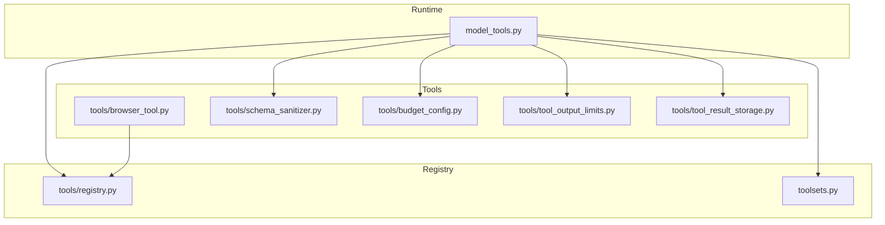
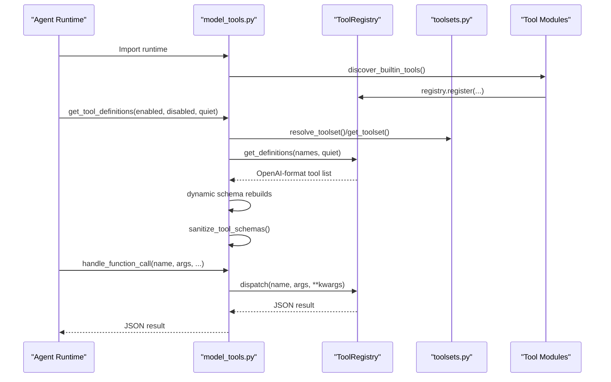
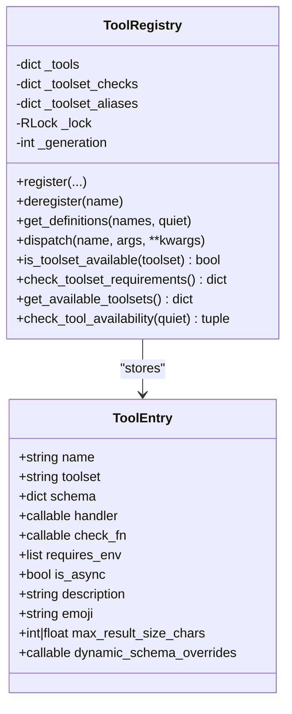
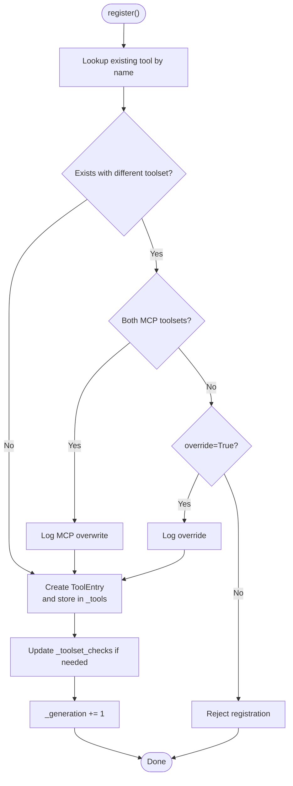
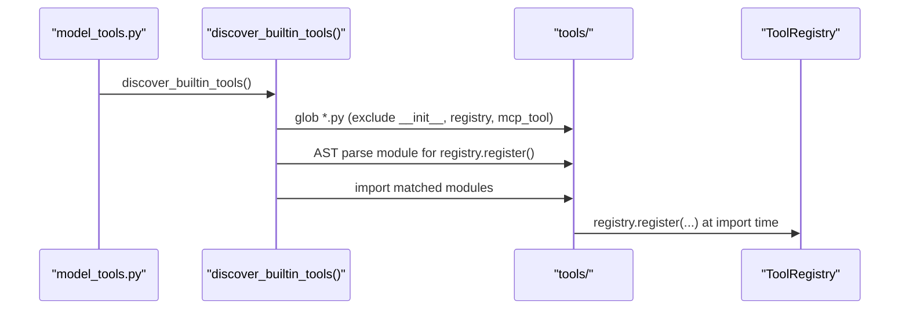
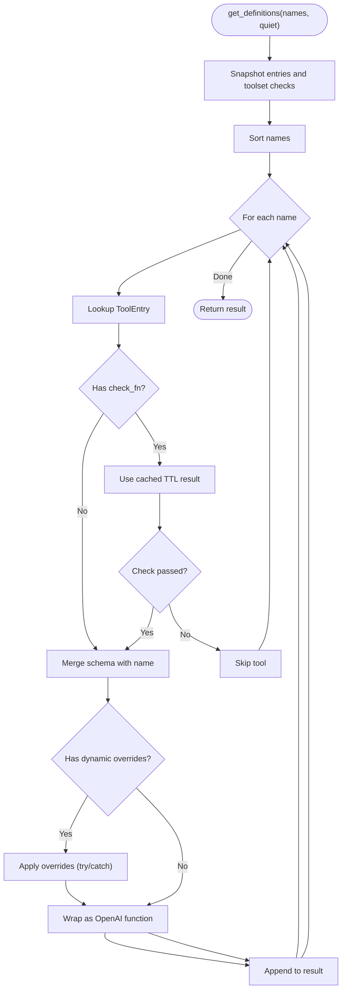
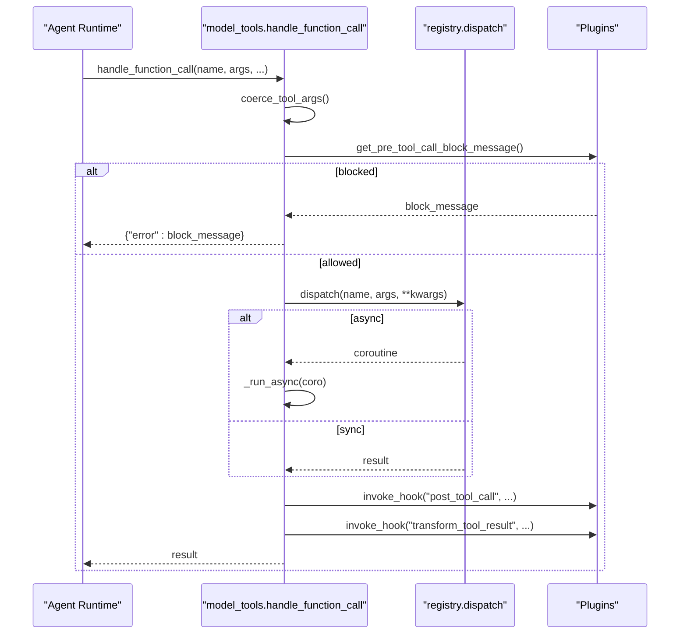
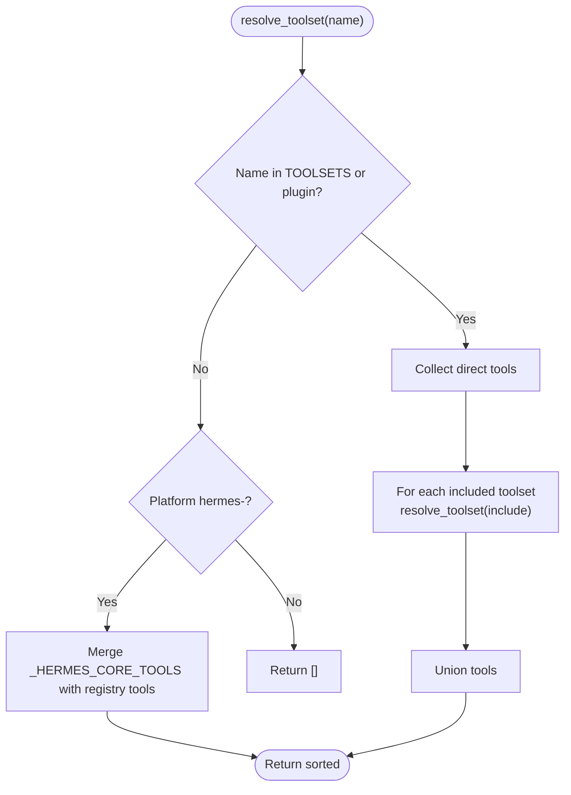
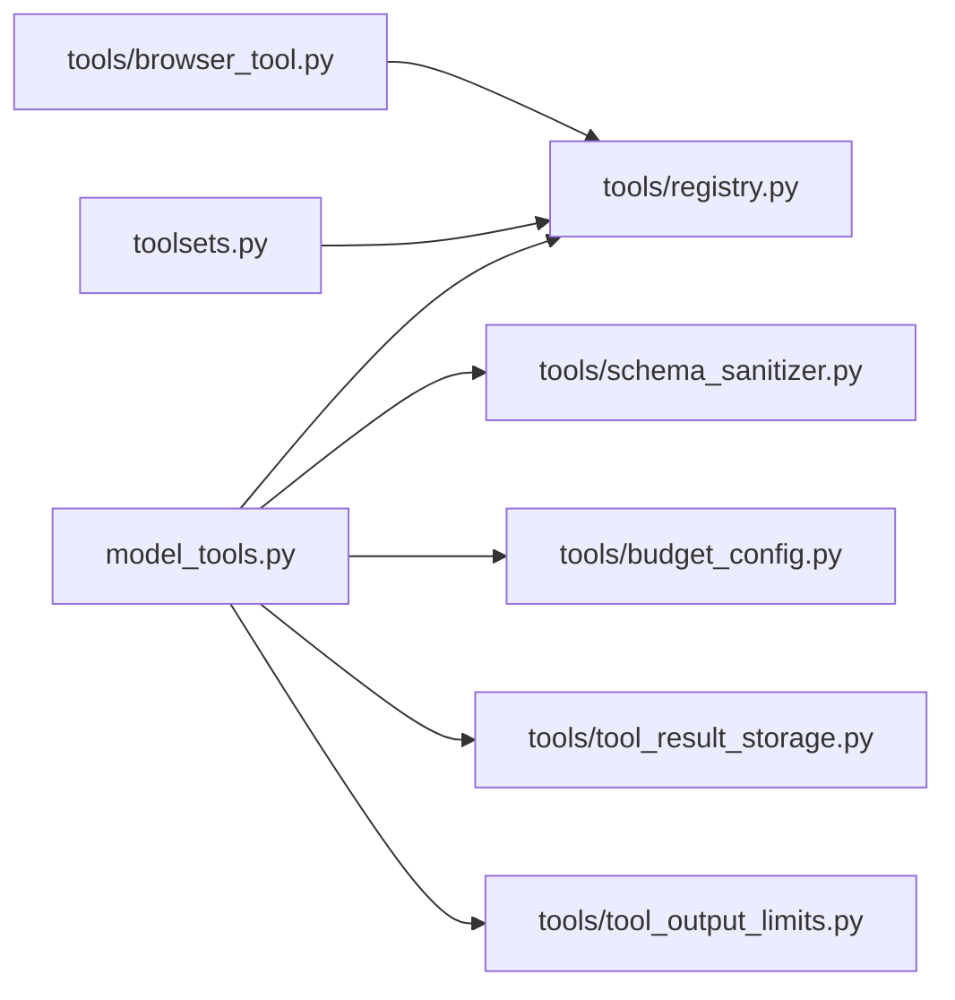

# Tool Registry System

<cite>
**Referenced Files in This Document**
- [registry.py](file://tools/registry.py)
- [model_tools.py](file://model_tools.py)
- [toolsets.py](file://toolsets.py)
- [browser_tool.py](file://tools/browser_tool.py)
- [schema_sanitizer.py](file://tools/schema_sanitizer.py)
- [budget_config.py](file://tools/budget_config.py)
- [tool_output_limits.py](file://tools/tool_output_limits.py)
- [tool_result_storage.py](file://tools/tool_result_storage.py)
</cite>

## Table of Contents
1. [Introduction](#introduction)
2. [Project Structure](#project-structure)
3. [Core Components](#core-components)
4. [Architecture Overview](#architecture-overview)
5. [Detailed Component Analysis](#detailed-component-analysis)
6. [Dependency Analysis](#dependency-analysis)
7. [Performance Considerations](#performance-considerations)
8. [Troubleshooting Guide](#troubleshooting-guide)
9. [Conclusion](#conclusion)
10. [Appendices](#appendices)

## Introduction
This document describes the Tool Registry System that powers tool discovery, schema management, availability checks, and dispatch within the agent runtime. It explains the ToolRegistry class architecture, tool registration semantics, schema retrieval with dynamic overrides, and the integration patterns with the agent runtime. Practical examples illustrate registration, query operations, and dispatch flows, along with performance optimizations such as TTL caching and memoization.

## Project Structure
The Tool Registry System spans several modules:
- tools/registry.py: Central registry, tool entry model, availability checks, and dispatch.
- model_tools.py: Agent runtime integration, tool discovery, schema filtering, and dispatch orchestration.
- toolsets.py: Toolset definitions, composition, and resolution.
- tools/browser_tool.py: Example tool module registering multiple browser tools.
- tools/schema_sanitizer.py: Schema normalization for backend compatibility.
- tools/budget_config.py, tools/tool_output_limits.py, tools/tool_result_storage.py: Result size budgets and persistence.

**Diagram sources**
- [model_tools.py:179](file://model_tools.py#L179)
- [registry.py:544](file://tools/registry.py#L544)
- [toolsets.py:539](file://toolsets.py#L539)
- [browser_tool.py:3704](file://tools/browser_tool.py#L3704)
- [schema_sanitizer.py:40](file://tools/schema_sanitizer.py#L40)
- [budget_config.py:22](file://tools/budget_config.py#L22)
- [tool_output_limits.py:55](file://tools/tool_output_limits.py#L55)
- [tool_result_storage.py:1](file://tools/tool_result_storage.py#L1)

**Section sources**
- [model_tools.py:179](file://model_tools.py#L179)
- [registry.py:544](file://tools/registry.py#L544)
- [toolsets.py:539](file://toolsets.py#L539)
- [browser_tool.py:3704](file://tools/browser_tool.py#L3704)
- [schema_sanitizer.py:40](file://tools/schema_sanitizer.py#L40)
- [budget_config.py:22](file://tools/budget_config.py#L22)
- [tool_output_limits.py:55](file://tools/tool_output_limits.py#L55)
- [tool_result_storage.py:1](file://tools/tool_result_storage.py#L1)

## Core Components
- ToolRegistry: Singleton registry storing ToolEntry instances, enforcing registration rules, computing availability, and dispatching tool handlers.
- ToolEntry: Immutable metadata container for each tool, including name, toolset, schema, handler, check_fn, requires_env, is_async, and optional dynamic_schema_overrides.
- model_tools: Orchestrates discovery, filters tool schemas by toolsets, applies dynamic schema updates, sanitizes schemas, and dispatches tool calls.
- toolsets: Defines and resolves toolsets, enabling composition and aliasing across built-in and plugin-provided tools.
- Schema sanitization and budgeting: Normalize schemas for strict backends and cap/truncate tool outputs.

Key responsibilities:
- Registration: Tools self-register at import time; override handling and MCP-to-MCP overwrites are supported.
- Availability: check_fn TTL caching amortizes environment probes; toolset checks are evaluated consistently.
- Query: get_tool_definitions filters by enabled/disabled toolsets and applies dynamic schema overrides.
- Dispatch: Handles sync/async handlers, sanitizes errors, and integrates with pre/post hooks and result transformations.

**Section sources**
- [registry.py:77](file://tools/registry.py#L77)
- [registry.py:151](file://tools/registry.py#L151)
- [model_tools.py:263](file://model_tools.py#L263)
- [toolsets.py:590](file://toolsets.py#L590)

## Architecture Overview
The runtime imports model_tools, which triggers discovery of built-in tools and plugins. Tools register themselves with the registry. The runtime queries tool definitions, applies dynamic schema updates, sanitizes schemas, and dispatches tool calls through the registry.

**Diagram sources**
- [model_tools.py:179](file://model_tools.py#L179)
- [model_tools.py:263](file://model_tools.py#L263)
- [model_tools.py:731](file://model_tools.py#L731)
- [registry.py:337](file://tools/registry.py#L337)
- [toolsets.py:590](file://toolsets.py#L590)

## Detailed Component Analysis

### ToolRegistry Class
The ToolRegistry maintains:
- _tools: name -> ToolEntry mapping
- _toolset_checks: toolset -> check_fn mapping
- _toolset_aliases: alias -> canonical toolset
- _lock: RLock for concurrent access protection
- _generation: monotonic counter for cache invalidation

Core APIs:
- register(...): Validates override rules, merges dynamic_schema_overrides, and updates toolset checks.
- deregister(name): Removes tool and prunes toolset checks/aliases if toolset becomes empty.
- get_definitions(tool_names, quiet): Filters by check_fn with per-call and TTL caches, applies dynamic overrides, and wraps as OpenAI function objects.
- dispatch(name, args, **kwargs): Executes handlers synchronously or bridges async via model_tools._run_async, sanitizing exceptions.
- Availability helpers: is_toolset_available, check_toolset_requirements, get_available_toolsets, check_tool_availability.

**Diagram sources**
- [registry.py:77](file://tools/registry.py#L77)
- [registry.py:151](file://tools/registry.py#L151)

**Section sources**
- [registry.py:151](file://tools/registry.py#L151)
- [registry.py:234](file://tools/registry.py#L234)
- [registry.py:337](file://tools/registry.py#L337)
- [registry.py:390](file://tools/registry.py#L390)

### Tool Entry Structure
Attributes:
- name: Unique tool identifier
- toolset: Canonical toolset name (e.g., "browser")
- schema: JSON Schema for the tool
- handler: Callable implementing the tool logic
- check_fn: Availability predicate (cached)
- requires_env: List of environment variables required
- is_async: Whether handler is async
- description, emoji: UI metadata
- max_result_size_chars: Optional per-tool result cap
- dynamic_schema_overrides: Zero-arg callable returning schema overrides applied at get_definitions() time

Dynamic schema overrides enable runtime-dependent adjustments (e.g., delegation limits).

**Section sources**
- [registry.py:77](file://tools/registry.py#L77)
- [registry.py:86](file://tools/registry.py#L86)
- [registry.py:99](file://tools/registry.py#L99)

### Registration Process
- Self-registration: Tools import registry and call register() at module level.
- Override handling:
  - MCP-to-MCP overwrites are allowed (logging debug).
  - Explicit override=True allows intentional replacements.
  - Shadowing across toolsets is rejected with an error log.
- Toolset aliases: register_toolset_alias maps alias -> canonical toolset; used by MCP dynamic refresh.
- Concurrency: All mutations protected by RLock; _generation bumped to invalidate caches.

**Diagram sources**
- [registry.py:234](file://tools/registry.py#L234)
- [registry.py:257](file://tools/registry.py#L257)

**Section sources**
- [registry.py:234](file://tools/registry.py#L234)
- [registry.py:208](file://tools/registry.py#L208)

### Tool Discovery Mechanism
- Built-in discovery: discover_builtin_tools scans tools directory, identifies modules with registry.register() calls, and imports them.
- Plugin discovery: model_tools triggers plugin discovery separately to populate plugin-provided toolsets.
- Toolset resolution: model_tools resolves enabled/disabled toolsets via toolsets.resolve_toolset(), merging plugin toolsets dynamically.

**Diagram sources**
- [registry.py:57](file://tools/registry.py#L57)
- [registry.py:67](file://tools/registry.py#L67)
- [model_tools.py:179](file://model_tools.py#L179)

**Section sources**
- [registry.py:57](file://tools/registry.py#L57)
- [model_tools.py:179](file://model_tools.py#L179)

### Schema Retrieval and Dynamic Overrides
- Filtering: get_definitions() iterates requested tool names, applies check_fn with per-call cache and TTL cache.
- Dynamic overrides: If dynamic_schema_overrides is provided, its result is shallow-merged into the schema before wrapping.
- OpenAI format: Each tool is wrapped as {"type": "function", "function": schema_with_name}.

**Diagram sources**
- [registry.py:337](file://tools/registry.py#L337)
- [registry.py:358](file://tools/registry.py#L358)
- [registry.py:372](file://tools/registry.py#L372)

**Section sources**
- [registry.py:337](file://tools/registry.py#L337)
- [registry.py:372](file://tools/registry.py#L372)

### Dispatch System and Error Handling
- Dispatch: registry.dispatch() executes handlers; async handlers are bridged via model_tools._run_async.
- Error handling: Exceptions are caught, sanitized via model_tools._sanitize_tool_error, and returned as JSON with {"error": "..."}.
- Hooks: model_tools.handle_function_call invokes pre_tool_call and post_tool_call hooks, and allows transform_tool_result hook to canonicalize results.

**Diagram sources**
- [model_tools.py:731](file://model_tools.py#L731)
- [model_tools.py:515](file://model_tools.py#L515)
- [registry.py:390](file://tools/registry.py#L390)

**Section sources**
- [model_tools.py:731](file://model_tools.py#L731)
- [model_tools.py:515](file://model_tools.py#L515)
- [registry.py:390](file://tools/registry.py#L390)

### Toolsets and Aliases
- Definitions: toolsets.py defines built-in toolsets and composes them from tools and includes.
- Resolution: resolve_toolset() recursively expands includes and merges plugin toolsets.
- Aliases: register_toolset_alias() maps aliases to canonical toolsets; model_tools uses registry.get_toolset_alias_target() to resolve.

**Diagram sources**
- [toolsets.py:590](file://toolsets.py#L590)
- [toolsets.py:626](file://toolsets.py#L626)

**Section sources**
- [toolsets.py:590](file://toolsets.py#L590)
- [toolsets.py:539](file://toolsets.py#L539)

### Practical Examples

- Registering a tool (browser):
  - The browser tool module registers multiple tools (navigate, snapshot, click, type, scroll, back, press, get_images, vision, console) with ToolRegistry.register().
  - Each registration specifies toolset, schema, handler, and check_fn.

  **Section sources**
  - [browser_tool.py:3708](file://tools/browser_tool.py#L3708)
  - [browser_tool.py:3766](file://tools/browser_tool.py#L3766)

- Query operations:
  - model_tools.get_tool_definitions() resolves enabled/disabled toolsets, filters by availability, applies dynamic schema rebuilds, and sanitizes schemas.

  **Section sources**
  - [model_tools.py:263](file://model_tools.py#L263)
  - [model_tools.py:327](file://model_tools.py#L327)

- Dispatch integration:
  - model_tools.handle_function_call() coerces arguments, invokes hooks, dispatches via registry.dispatch(), and returns sanitized results.

  **Section sources**
  - [model_tools.py:731](file://model_tools.py#L731)
  - [registry.py:390](file://tools/registry.py#L390)

## Dependency Analysis
- Registry-to-runtime: model_tools imports registry and uses it for discovery, filtering, and dispatch.
- Tool-to-registry: Tools import registry and call register() at module level.
- Toolsets-to-registry: toolsets.py queries registry for plugin toolsets and aliases.
- Sanitization-to-runtime: model_tools calls tools.schema_sanitizer to normalize schemas.
- Budgeting-to-storage: model_tools uses budget_config and tool_result_storage for result persistence and turn budget enforcement.

**Diagram sources**
- [model_tools.py:31](file://model_tools.py#L31)
- [browser_tool.py:3704](file://tools/browser_tool.py#L3704)
- [toolsets.py:553](file://toolsets.py#L553)
- [schema_sanitizer.py:40](file://tools/schema_sanitizer.py#L40)
- [budget_config.py:22](file://tools/budget_config.py#L22)
- [tool_result_storage.py:1](file://tools/tool_result_storage.py#L1)
- [tool_output_limits.py:55](file://tools/tool_output_limits.py#L55)

**Section sources**
- [model_tools.py:31](file://model_tools.py#L31)
- [toolsets.py:553](file://toolsets.py#L553)

## Performance Considerations
- TTL caching for check_fn:
  - _check_fn_cached caches results for ~30 seconds to amortize environment probes (e.g., Docker, Modal, Playwright).
  - invalidate_check_fn_cache() clears the cache after configuration changes.
- Memoization in model_tools:
  - get_tool_definitions caches results keyed by enabled/disabled toolsets, registry._generation, and config fingerprint.
  - _clear_tool_defs_cache() drops memoized results when dynamic dependencies change.
- Concurrency:
  - RLock protects mutations; readers snapshot state for consistent reads during MCP refresh and concurrent access.
- Schema sanitization:
  - sanitize_tool_schemas reduces backend-specific schema incompatibilities, avoiding retries and failures.

**Section sources**
- [registry.py:126](file://tools/registry.py#L126)
- [registry.py:144](file://tools/registry.py#L144)
- [model_tools.py:256](file://model_tools.py#L256)
- [model_tools.py:290](file://model_tools.py#L290)

## Troubleshooting Guide
- Registration rejected:
  - Symptom: Error log indicating rejection due to shadowing across toolsets.
  - Cause: Attempting to register a tool with a name already used by a different toolset without override=True.
  - Fix: Use override=True for intentional replacements or choose a unique tool name.

- Tool unavailable:
  - Symptom: Tool not included in get_tool_definitions().
  - Cause: check_fn returns False or raises; TTL cache may hide transient failures.
  - Fix: Verify environment prerequisites; consider invalidate_check_fn_cache() after configuration changes.

- Async handler issues:
  - Symptom: Event loop errors or “loop is closed”.
  - Cause: Cached async clients bound to closed loops.
  - Fix: Use model_tools._run_async bridging; avoid asyncio.run() per call.

- Schema compatibility:
  - Symptom: Backend rejects tool schemas (e.g., llama.cpp).
  - Cause: Strict schema constructs unsupported by the backend.
  - Fix: Allow model_tools to sanitize schemas; consider reactive strip of pattern/format when needed.

- Result truncation and persistence:
  - Symptom: Large outputs truncated or not persisted.
  - Cause: Thresholds or sandbox write failures.
  - Fix: Adjust budget_config thresholds; ensure sandbox environment is available; review tool_result_storage behavior.

**Section sources**
- [registry.py:282](file://tools/registry.py#L282)
- [registry.py:144](file://tools/registry.py#L144)
- [model_tools.py:83](file://model_tools.py#L83)
- [schema_sanitizer.py:40](file://tools/schema_sanitizer.py#L40)
- [tool_result_storage.py:122](file://tools/tool_result_storage.py#L122)

## Conclusion
The Tool Registry System provides a robust, concurrent-safe mechanism for tool discovery, schema management, availability checks, and dispatch. Its design balances flexibility (plugin and MCP toolsets, dynamic schema overrides) with reliability (TTL caching, sanitization, and hooks). The runtime integration in model_tools ensures efficient query and dispatch flows, while budgeting and persistence guard against context overflow.

## Appendices

### Tool Entry Attributes Reference
- name: Tool identifier
- toolset: Canonical toolset name
- schema: JSON Schema
- handler: Callable implementing tool logic
- check_fn: Availability predicate
- requires_env: Required environment variables
- is_async: Handler is async
- description, emoji: UI metadata
- max_result_size_chars: Optional per-tool result cap
- dynamic_schema_overrides: Callable returning schema overrides

**Section sources**
- [registry.py:77](file://tools/registry.py#L77)
- [registry.py:86](file://tools/registry.py#L86)